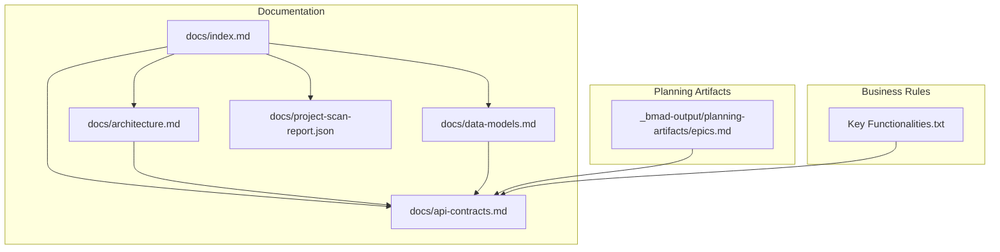
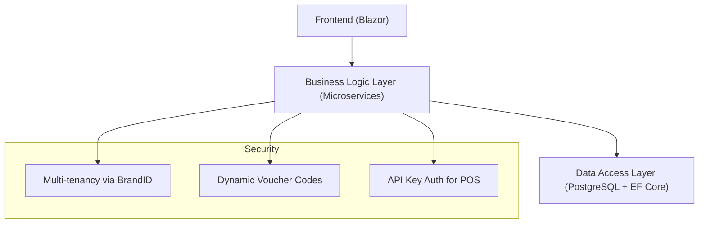
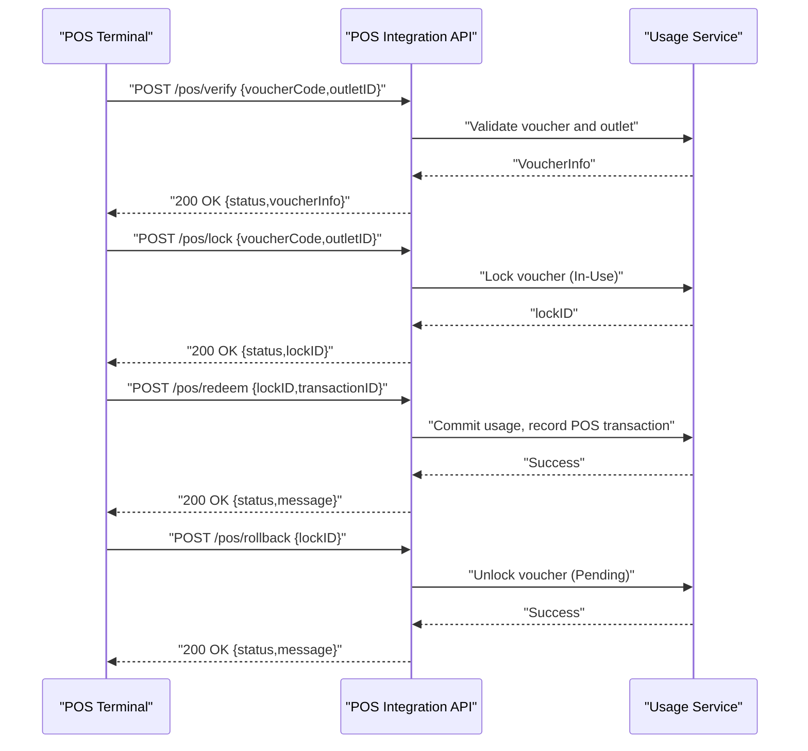
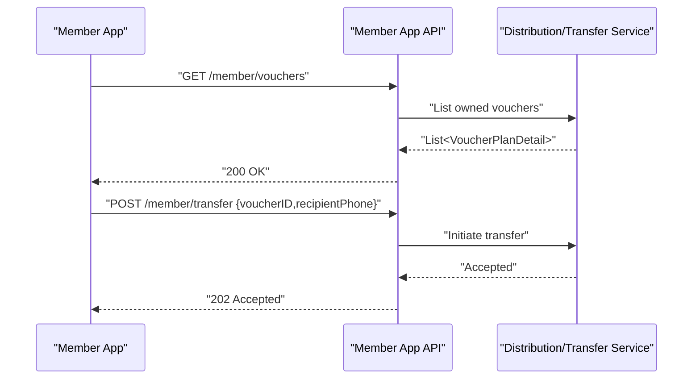
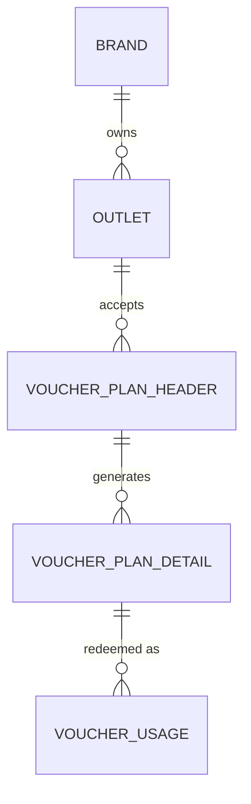
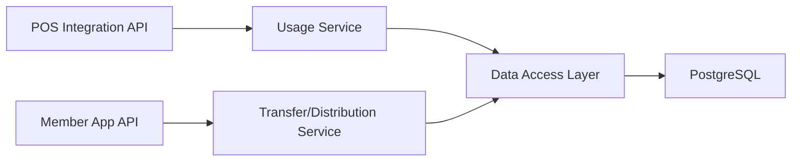

# API Contracts and Integration

<cite>
**Referenced Files in This Document**
- [api-contracts.md](file://docs/api-contracts.md)
- [architecture.md](file://docs/architecture.md)
- [data-models.md](file://docs/data-models.md)
- [index.md](file://docs/index.md)
- [Key Functionalities.txt](file://Key Functionalities.txt)
- [project-scan-report.json](file://docs/project-scan-report.json)
- [epics.md](file://_bmad-output/planning-artifacts/epics.md)
</cite>

## Table of Contents
1. [Introduction](#introduction)
2. [Project Structure](#project-structure)
3. [Core Components](#core-components)
4. [Architecture Overview](#architecture-overview)
5. [Detailed Component Analysis](#detailed-component-analysis)
6. [Dependency Analysis](#dependency-analysis)
7. [Performance Considerations](#performance-considerations)
8. [Troubleshooting Guide](#troubleshooting-guide)
9. [Conclusion](#conclusion)
10. [Appendices](#appendices)

## Introduction
This document provides API contracts and integration guidance for NonCash’s RESTful services focused on:
- POS Integration API: Verify, Lock, Redeem, and Rollback endpoints for secure point-of-sale redemption workflows.
- Member App API: Voucher listing and transfer functionality for end-user applications.

It covers HTTP methods, URL patterns, request/response schemas, authentication, security, common use cases, client implementation guidelines, error handling strategies, rate limiting considerations, versioning, transaction security model, rollback mechanisms, performance optimization tips, and debugging approaches.

## Project Structure
The repository organizes API-related knowledge across several documentation files:
- API Contracts define endpoint specifications and authentication.
- Architecture describes the 3-layer SaaS design and security posture.
- Data Models outline core entities and relationships.
- Index and scan report provide project metadata and current state.

**Diagram sources**
- [index.md](file://docs/index.md)
- [api-contracts.md](file://docs/api-contracts.md)
- [architecture.md](file://docs/architecture.md)
- [data-models.md](file://docs/data-models.md)
- [project-scan-report.json](file://docs/project-scan-report.json)
- [epics.md](file://_bmad-output/planning-artifacts/epics.md)
- [Key Functionalities.txt](file://Key Functionalities.txt)

**Section sources**
- [index.md](file://docs/index.md)
- [project-scan-report.json](file://docs/project-scan-report.json)

## Core Components
- POS Integration API: Exposes endpoints for verifying voucher validity, locking a voucher to prevent double-spending, committing the redemption upon successful transaction, and rolling back a lock on failure or cancellation.
- Member App API: Provides endpoints for listing a member’s vouchers and initiating a transfer to another member via phone number.

Authentication:
- API Key: Provided via the X-API-Key header for POS clients.
- JWT: Provided via Authorization: Bearer <JWT> for Member App clients.

Versioning:
- Base URL includes v1: https://api.noncash.service/v1

Format:
- JSON for requests and responses.

**Section sources**
- [api-contracts.md](file://docs/api-contracts.md)
- [index.md](file://docs/index.md)

## Architecture Overview
NonCash follows a 3-layer SaaS architecture:
- User Interface (Blazor) interacts with the Business Logic Layer (Microservices).
- Business Logic Layer orchestrates services such as Planning, Approval, Distribution, Usage (POS redemption), Identity & Tenant management.
- Data Access Layer uses PostgreSQL with EF Core and Repository pattern.

Security highlights:
- Multi-tenancy via BrandID to isolate data per tenant.
- Dynamic security: Vouchers use rotating dynamic codes similar to JWT logic to prevent reuse.
- Integration security: POS systems authenticated via API Keys and restricted to predefined outlet ranges.

**Diagram sources**
- [architecture.md](file://docs/architecture.md)

**Section sources**
- [architecture.md](file://docs/architecture.md)

## Detailed Component Analysis

### POS Integration API

Endpoints:
- Verify Voucher: POST /pos/verify
- Lock Voucher: POST /pos/lock
- Redeem Voucher: POST /pos/redeem
- Rollback Lock: POST /pos/rollback

Authentication:
- X-API-Key header for POS clients.

Common request/response patterns:
- Requests carry voucherCode and outletID for verification and lock.
- Lock response returns a lockID.
- Redeem requires lockID and transactionID.
- Rollback requires lockID.

Transaction security model:
- Verify does not change state.
- Lock transitions the voucher to In-Use to prevent double-spending.
- Redeem commits the usage and records POS transaction details.
- Rollback releases the lock without committing.

**Diagram sources**
- [api-contracts.md](file://docs/api-contracts.md)
- [epics.md](file://_bmad-output/planning-artifacts/epics.md)

**Section sources**
- [api-contracts.md](file://docs/api-contracts.md)
- [epics.md](file://_bmad-output/planning-artifacts/epics.md)

### Member App API

Endpoints:
- List My Vouchers: GET /member/vouchers (requires JWT)
- Transfer Voucher: POST /member/transfer

Authentication:
- Authorization: Bearer <JWT> header.

Transfer workflow:
- Initiator sends POST /member/transfer with voucherID and recipientPhone.
- Response is 202 Accepted, indicating the transfer is initiated and awaiting recipient confirmation.

**Diagram sources**
- [api-contracts.md](file://docs/api-contracts.md)

**Section sources**
- [api-contracts.md](file://docs/api-contracts.md)

### Data Model Context for POS Redemption

Core entities and relationships inform POS redemption semantics:
- VoucherPlanHeader: Campaign-level attributes including brand, value type, face/net values, expiry, publish date, sales range (outlets), and time range.
- VoucherPlanDetail: Individual voucher with dynamic code, owner, and usage status (Pending, In-Use, Complete).
- VoucherUsage: Records POS redemption with POSID, TransactionID, amount used, and usage date.
- Outlet: Physical or digital store linked to Brand.

**Diagram sources**
- [data-models.md](file://docs/data-models.md)

**Section sources**
- [data-models.md](file://docs/data-models.md)

## Dependency Analysis
- POS Integration API depends on the Usage Service for verification, locking, committing, and rolling back voucher usage.
- Member App API depends on Distribution/Transfer Service for listing and transferring vouchers.
- Both services rely on the Data Access Layer for persistence and transactional integrity.
- Security controls (multi-tenancy, dynamic codes, API keys) are enforced at the Business Logic Layer.

**Diagram sources**
- [architecture.md](file://docs/architecture.md)
- [data-models.md](file://docs/data-models.md)

**Section sources**
- [architecture.md](file://docs/architecture.md)
- [data-models.md](file://docs/data-models.md)

## Performance Considerations
- Minimize round-trips: Perform Verify and Lock in sequence close to the transaction boundary to reduce lock contention.
- Asynchronous operations: For bulk operations (e.g., batch promotions), leverage background workers to avoid UI stalls and improve throughput.
- Real-time updates: Use real-time communication patterns to reflect state changes without polling.
- Caching: Cache outlet and brand metadata locally at the POS terminal to reduce latency for repeated validations.
- Connection pooling: Ensure HTTP clients reuse connections and handle timeouts appropriately.

[No sources needed since this section provides general guidance]

## Troubleshooting Guide
Common issues and strategies:
- Authentication failures:
  - Verify X-API-Key header presence and correctness for POS endpoints.
  - Confirm JWT validity and scope for Member App endpoints.
- Voucher state errors:
  - If a voucher is not Pending, Lock may fail; ensure proper rollback on cancellation.
  - After Redeem, reusing the same lockID or transactionID may be rejected.
- Network interruptions:
  - Implement idempotent request handling for Lock and Redeem using lockID/transactionID deduplication at the client.
  - Retry with exponential backoff for transient failures.
- Debugging:
  - Capture request IDs and timestamps; correlate with backend logs.
  - Validate outletID against the sales range defined in the associated VoucherPlanHeader.
  - Monitor usage status transitions (Pending → In-Use → Complete/Pending) to detect anomalies.

**Section sources**
- [api-contracts.md](file://docs/api-contracts.md)
- [epics.md](file://_bmad-output/planning-artifacts/epics.md)

## Conclusion
NonCash’s API contracts enable secure, auditable, and efficient POS redemption and member-driven voucher transfers. By adhering to the documented endpoints, authentication methods, and transactional semantics, clients can integrate reliably with the platform while leveraging built-in security controls and performance best practices.

[No sources needed since this section summarizes without analyzing specific files]

## Appendices

### API Reference Summary

- Base URL: https://api.noncash.service/v1
- Authentication:
  - POS: X-API-Key header
  - Member App: Authorization: Bearer <JWT>
- Format: JSON

POS Integration API:
- POST /pos/verify
  - Request: voucherCode, outletID
  - Response: status, voucherInfo (faceValue, expiryDate, brand)
- POST /pos/lock
  - Request: voucherCode, outletID
  - Response: status, lockID
- POST /pos/redeem
  - Request: lockID, transactionID
  - Response: status, message
- POST /pos/rollback
  - Request: lockID
  - Response: status, message

Member App API:
- GET /member/vouchers
  - Header: Authorization: Bearer <JWT>
  - Response: List of VoucherPlanDetail items
- POST /member/transfer
  - Request: voucherID, recipientPhone
  - Response: 202 Accepted (recipient confirmation required)

**Section sources**
- [api-contracts.md](file://docs/api-contracts.md)

### Security Considerations
- Multi-tenancy: BrandID isolates data between tenants.
- Dynamic codes: Voucher codes rotate to prevent reuse.
- API Key scope: POS clients are restricted to predefined outlet ranges.
- JWT scope: Member App tokens are bound to the requesting member.

**Section sources**
- [architecture.md](file://docs/architecture.md)
- [index.md](file://docs/index.md)

### Versioning
- All endpoints are under v1 of the base path.

**Section sources**
- [api-contracts.md](file://docs/api-contracts.md)

### Business Rules Context
- Voucher lifecycle: Pending → In-Use → Complete (or rollback to Pending).
- POS redemption workflow: Verify → Lock → Redeem/Commit or Rollback.
- Transfers require recipient confirmation and occur outside payment flows.

**Section sources**
- [Key Functionalities.txt](file://Key Functionalities.txt)
- [epics.md](file://_bmad-output/planning-artifacts/epics.md)