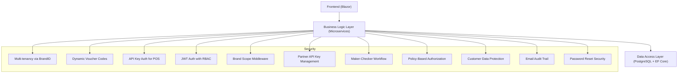
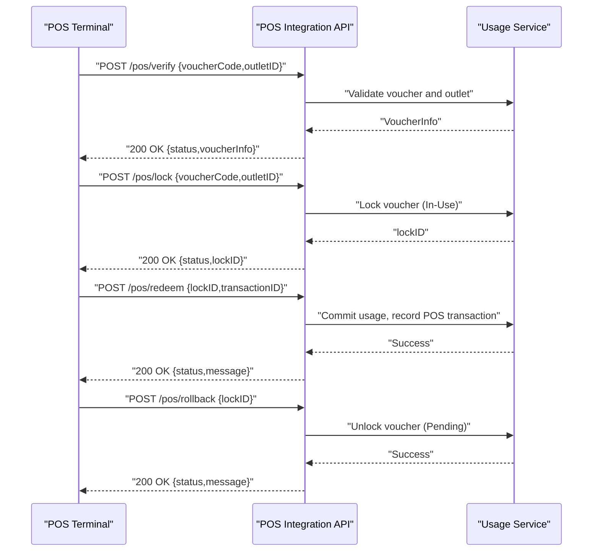
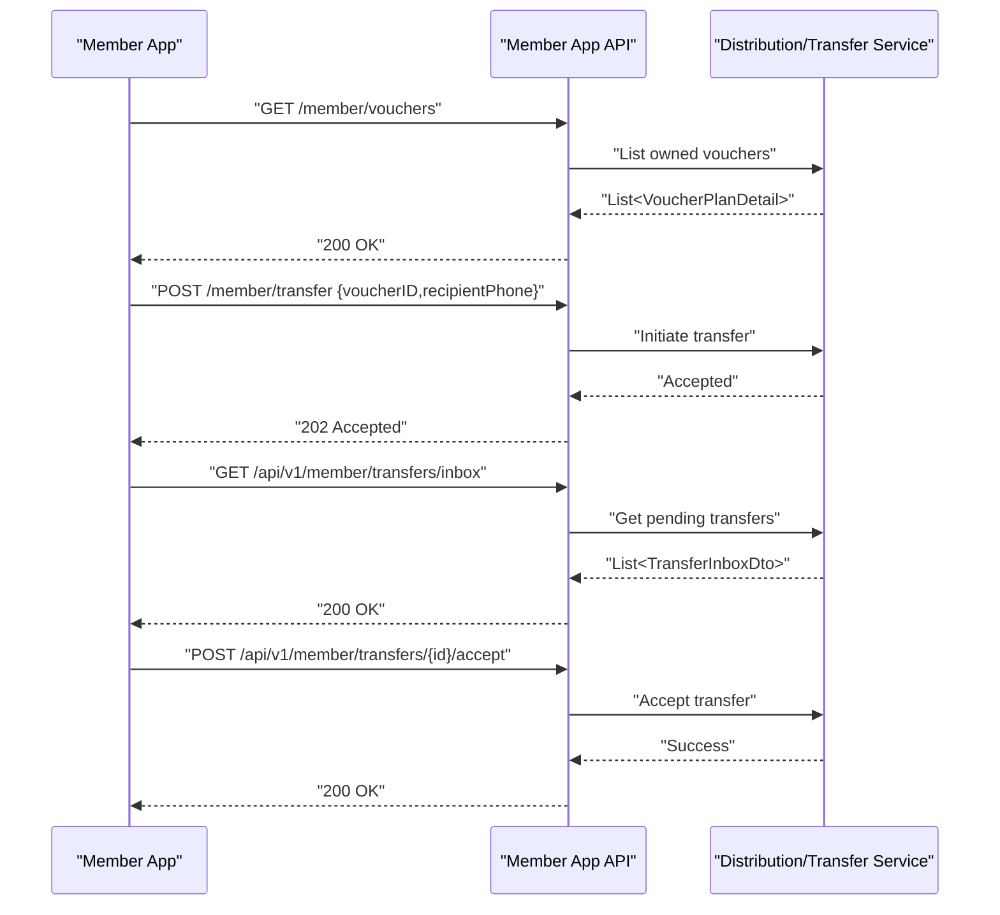
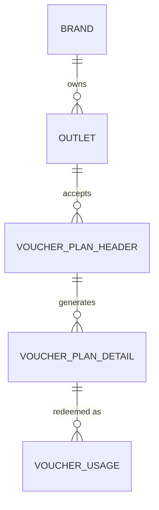
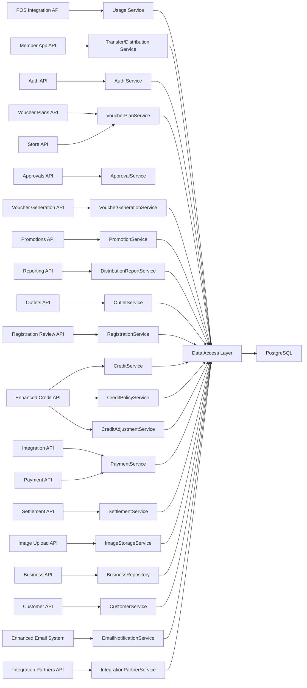

# API Contracts and Integration

<cite>
**Referenced Files in This Document**
- [api-contracts.md](file://docs/api-contracts.md)
- [architecture.md](file://docs/architecture.md)
- [data-models.md](file://docs/data-models.md)
- [index.md](file://docs/index.md)
- [Key Functionalities.txt](file://Key%20Functionalities.txt)
- [project-scan-report.json](file://docs/project-scan-report.json)
- [epics.md](file://_bmad-output/planning-artifacts/epics.md)
- [Program.cs](file://src/NonCash.API/Program.cs)
- [AuthController.cs](file://src/NonCash.API/Controllers/AuthController.cs)
- [ApprovalsController.cs](file://src/NonCash.API/Controllers/ApprovalsController.cs)
- [OutletsController.cs](file://src/NonCash.API/Controllers/OutletsController.cs)
- [PlanVersionsController.cs](file://src/NonCash.API/Controllers/PlanVersionsController.cs)
- [PromotionsController.cs](file://src/NonCash.API/Controllers/PromotionsController.cs)
- [RegistrationReviewController.cs](file://src/NonCash.API/Controllers/RegistrationReviewController.cs)
- [ReportsController.cs](file://src/NonCash.API/Controllers/ReportsController.cs)
- [StoreController.cs](file://src/NonCash.API/Controllers/StoreController.cs)
- [VoucherGenerationController.cs](file://src/NonCash.API/Controllers/VoucherGenerationController.cs)
- [VoucherPlansController.cs](file://src/NonCash.API/Controllers/VoucherPlansController.cs)
- [IntegrationController.cs](file://src/NonCash.API/Controllers/IntegrationController.cs)
- [SettlementsController.cs](file://src/NonCash.API/Controllers/SettlementsController.cs)
- [CreditsController.cs](file://src/NonCash.API/Controllers/CreditsController.cs)
- [CreditAdjustmentsController.cs](file://src/NonCash.API/Controllers/CreditAdjustmentsController.cs)
- [CreditPoliciesController.cs](file://src/NonCash.API/Controllers/CreditPoliciesController.cs)
- [PaymentsController.cs](file://src/NonCash.API/Controllers/PaymentsController.cs)
- [ImageUploadController.cs](file://src/NonCash.API/Controllers/ImageUploadController.cs)
- [MemberTransfersController.cs](file://src/NonCash.API/Controllers/MemberTransfersController.cs)
- [BusinessesController.cs](file://src/NonCash.API/Controllers/BusinessesController.cs)
- [IntegrationPartnersController.cs](file://src/NonCash.API/Controllers/IntegrationPartnersController.cs)
- [CustomersController.cs](file://src/NonCash.API/Controllers/CustomersController.cs)
- [CustomerDtos.cs](file://src/NonCash.API/DTOs/CustomerDtos.cs)
- [EmailLog.cs](file://src/NonCash.Core/Entities/EmailLog.cs)
- [EmailNotificationService.cs](file://src/NonCash.Infrastructure/Services/EmailNotificationService.cs)
- [AddEmailLog.cs](file://src/NonCash.Infrastructure/Migrations/20260814110418_AddEmailLog.cs)
- [AuthDtos.cs](file://src/NonCash.API/DTOs/AuthDtos.cs)
- [INotificationService.cs](file://src/NonCash.Core/Interfaces/INotificationService.cs)
- [PasswordReset.html](file://src/NonCash.Infrastructure/EmailTemplates/PasswordReset.html)
- [StaffAccountCreated.html](file://src/NonCash.Infrastructure/EmailTemplates/StaffAccountCreated.html)
- [VoucherTransferInitiated.html](file://src/NonCash.Infrastructure/EmailTemplates/VoucherTransferInitiated.html)
- [notification-matrix.md](file://docs/notification-matrix.md)
</cite>

## Update Summary
**Changes Made**
- Added comprehensive Customer Management API with search, CRUD operations, blacklist management, and CSV import capabilities
- Integrated Email Logging system for audit trail of all outbound email notifications with success/failure tracking
- Enhanced Business Management API with improved entity operations and validation
- Updated authentication and authorization patterns for customer management endpoints
- **Updated**: Password Reset Authentication Endpoints: Enhanced POST /api/v1/auth/forgot-password and POST /api/v1/auth/reset-password with complete token-based workflow, secure token generation, and 30-minute expiry
- **Enhanced**: Email Notification System: Added PasswordReset, StaffAccountCreated, and VoucherTransferInitiated notification types with complete template support and audit trail integration
- **Updated**: Authentication API section with enhanced password reset functionality and security considerations including token validation and user enumeration prevention

## Table of Contents
1. [Introduction](#introduction)
2. [Project Structure](#project-structure)
3. [Core Components](#core-components)
4. [Architecture Overview](#architecture-overview)
5. [Detailed Component Analysis](#detailed-component-analysis)
6. [Dependency Analysis](#dependency-analysis)
7. [Performance Considerations](#performance-considerations)
8. [Troubleshooting Guide](#troubleshooting-guide)
9. [Conclusion](#conclusion)
10. [Appendices](#appendices)

## Introduction
This document provides comprehensive API contracts and integration guidance for NonCash's expanded RESTful services focused on:
- POS Integration API: Verify, Lock, Redeem, and Rollback endpoints for secure point-of-sale redemption workflows
- Member App API: Voucher listing, transfer functionality, and enhanced member experience
- Brand Management API: User authentication, outlet management, and business operations
- Voucher Planning API: Plan creation, approval workflows, and version management
- Distribution and Reporting API: Batch promotion distribution and comprehensive reporting
- Store API: Gift voucher catalog and purchase functionality
- **Enhanced**: Credit Ledger API: Prepaid billing system with balance management, batch operations, consumption tracking, and policy resolution
- **New**: Credit Adjustment API: Maker-checker workflow for credit corrections and adjustments
- **New**: Credit Policy API: Administrative management of pricing policies and brand groups
- **New**: Loyalty App Integration API: External partner integration for segment distribution, member wallet access, and campaign analytics
- **New**: Cross-Tenant Settlement API: Financial settlement tracking between sponsoring and redeeming brands
- **New**: Payment Processing API: Integrated payment gateway support with ZaloPay
- **New**: Media Management API: Image upload and CDN integration for rich voucher displays
- **New**: Business Management API: Administrative operations for business entities
- **New**: Customer Management API: Comprehensive customer record management with blacklist functionality and bulk import
- **New**: Email Notification System: Complete audit trail for all outbound email communications with retry logic and error tracking
- **Enhanced**: Password Reset Authentication: Secure password reset workflow with token-based verification, email notifications, and enhanced security measures

It covers HTTP methods, URL patterns, request/response schemas, authentication, security, common use cases, client implementation guidelines, error handling strategies, rate limiting considerations, versioning, transaction security model, rollback mechanisms, performance optimization tips, and debugging approaches.

## Project Structure
The repository organizes API-related knowledge across several documentation files and controller implementations:
- API Contracts define endpoint specifications and authentication
- Architecture describes the 3-layer SaaS design and security posture
- Data Models outline core entities and relationships
- Index and scan report provide project metadata and current state
- New controllers provide comprehensive business functionality including loyalty app integration, settlement processing, payment handling, enhanced credit management, customer management, and email logging


```mermaid
graph TB
subgraph "Documentation"
A["docs/index.md"]
B["docs/api-contracts.md"]
C["docs/architecture.md"]
D["docs/data-models.md"]
E["docs/project-scan-report.json"]
end
subgraph "Core Controllers"
F["AuthController"]
G["ApprovalsController"]
H["OutletsController"]
I["PlanVersionsController"]
J["PromotionsController"]
K["RegistrationReviewController"]
L["ReportsController"]
M["StoreController"]
N["VoucherGenerationController"]
O["VoucherPlansController"]
end
subgraph "Enhanced Credit Management"
P["CreditsController"]
Q["CreditAdjustmentsController"]
R["CreditPoliciesController"]
end
subgraph "New Epic Controllers"
S["IntegrationController"]
T["SettlementsController"]
U["PaymentsController"]
V["ImageUploadController"]
W["MemberTransfersController"]
X["BusinessesController"]
Y["IntegrationPartnersController"]
Z["CustomersController"]
end
subgraph "Email & Notifications"
AA["EmailNotificationService"]
BB["EmailLog Entity"]
CC["PasswordReset Template"]
DD["StaffAccountCreated Template"]
EE["VoucherTransferInitiated Template"]
end
subgraph "Planning Artifacts"
FF["_bmad-output/planning-artifacts/epics.md"]
end
subgraph "Business Rules"
GG["Key Functionalities.txt"]
end
A --> B
A --> C
A --> D
A --> E
C --> B
D --> B
FF --> B
GG --> B
F --> B
G --> B
H --> B
I --> B
J --> B
K --> B
L --> B
M --> B
N --> B
O --> B
P --> B
Q --> B
R --> B
S --> B
T --> B
U --> B
V --> B
W --> B
X --> B
Y --> B
Z --> B
AA --> B
BB --> B
CC --> B
DD --> B
EE --> B
```

**Diagram sources**
- [index.md](file://docs/index.md)
- [api-contracts.md](file://docs/api-contracts.md)
- [architecture.md](file://docs/architecture.md)
- [data-models.md](file://docs/data-models.md)
- [project-scan-report.json](file://docs/project-scan-report.json)
- [epics.md](file://_bmad-output/planning-artifacts/epics.md)
- [Key Functionalities.txt](file://Key%20Functionalities.txt)
- [CreditsController.cs](file://src/NonCash.API/Controllers/CreditsController.cs)
- [CreditAdjustmentsController.cs](file://src/NonCash.API/Controllers/CreditAdjustmentsController.cs)
- [CreditPoliciesController.cs](file://src/NonCash.API/Controllers/CreditPoliciesController.cs)
- [IntegrationController.cs](file://src/NonCash.API/Controllers/IntegrationController.cs)
- [SettlementsController.cs](file://src/NonCash.API/Controllers/SettlementsController.cs)
- [PaymentsController.cs](file://src/NonCash.API/Controllers/PaymentsController.cs)
- [ImageUploadController.cs](file://src/NonCash.API/Controllers/ImageUploadController.cs)
- [MemberTransfersController.cs](file://src/NonCash.API/Controllers/MemberTransfersController.cs)
- [BusinessesController.cs](file://src/NonCash.API/Controllers/BusinessesController.cs)
- [IntegrationPartnersController.cs](file://src/NonCash.API/Controllers/IntegrationPartnersController.cs)
- [CustomersController.cs](file://src/NonCash.API/Controllers/CustomersController.cs)
- [EmailNotificationService.cs](file://src/NonCash.Infrastructure/Services/EmailNotificationService.cs)
- [EmailLog.cs](file://src/NonCash.Core/Entities/EmailLog.cs)
- [PasswordReset.html](file://src/NonCash.Infrastructure/EmailTemplates/PasswordReset.html)
- [StaffAccountCreated.html](file://src/NonCash.Infrastructure/EmailTemplates/StaffAccountCreated.html)
- [VoucherTransferInitiated.html](file://src/NonCash.Infrastructure/EmailTemplates/VoucherTransferInitiated.html)

**Section sources**
- [index.md](file://docs/index.md)
- [project-scan-report.json](file://docs/project-scan-report.json)

## Core Components
- POS Integration API: Exposes endpoints for verifying voucher validity, locking a voucher to prevent double-spending, committing the redemption upon successful transaction, and rolling back a lock on failure or cancellation
- Member App API: Provides endpoints for listing a member's vouchers, initiating transfers, and managing transfer inbox/outbox
- Brand Management API: Handles user authentication, outlet management, and administrative functions
- Voucher Planning API: Manages voucher plan creation, approval workflows, and version control
- Distribution API: Supports batch promotion distribution with CSV upload capabilities
- Reporting API: Provides comprehensive distribution summaries and CSV exports
- Store API: Offers gift voucher catalog and purchase functionality
- **Enhanced**: Credit Ledger API: Comprehensive prepaid billing system with balance management, batch operations, consumption tracking, policy resolution, and admin top-up functionality
- **New**: Credit Adjustment API: Maker-checker workflow for credit corrections with approval matrix and threshold controls
- **New**: Credit Policy API: Administrative management of pricing policies and brand groups with scope-based resolution
- **New**: Loyalty App Integration API: External partner integration for segment distribution, member wallet queries, event history, and campaign performance
- **New**: Settlement API: Cross-tenant financial settlement tracking and netting reports
- **New**: Payment Processing API: Integrated payment gateway support with ZaloPay
- **New**: Media Management API: Image upload and CDN integration for rich voucher displays
- **New**: Business Management API: Administrative operations for business entities
- **New**: Customer Management API: Comprehensive customer record management with search, CRUD operations, blacklist functionality, and CSV import capabilities
- **Enhanced**: Email Notification System: Complete audit trail for outbound email communications with retry logic, error tracking, template rendering, and additional notification types (PasswordReset, StaffAccountCreated, VoucherTransferInitiated)
- **Enhanced**: Password Reset Authentication: Secure password reset workflow with token generation, email delivery, verification, and enhanced security measures

Authentication:
- API Key: Provided via the X-API-Key header for POS clients and integration partners
- JWT: Provided via Authorization: Bearer <JWT> for all business API clients
- **Enhanced**: Password Reset: Token-based authentication for password reset flows with secure token management

Versioning:
- Base URL includes v1: https://api.noncash.service/v1

Format:
- JSON for requests and responses

**Section sources**
- [api-contracts.md](file://docs/api-contracts.md)
- [index.md](file://docs/index.md)

## Architecture Overview
NonCash follows a 3-layer SaaS architecture:
- User Interface (Blazor) interacts with the Business Logic Layer (Microservices)
- Business Logic Layer orchestrates services such as Planning, Approval, Distribution, Usage (POS redemption), Identity & Tenant management
- Data Access Layer uses PostgreSQL with EF Core and Repository pattern

Security highlights:
- Multi-tenancy via BrandID to isolate data per tenant
- Dynamic security: Vouchers use rotating dynamic codes similar to JWT logic to prevent reuse
- Integration security: POS systems authenticated via API Keys and restricted to predefined outlet ranges
- Role-Based Access Control (RBAC) with JWT claims for business operations
- Brand scoping middleware for tenant isolation
- Partner API key management for external loyalty apps
- **Enhanced**: Financial controls with maker-checker workflow for credit adjustments
- **Enhanced**: Policy-based authorization with approval thresholds and brand group scoping
- **New**: Customer data protection with role-based access controls
- **Enhanced**: Email notification audit trail with comprehensive logging and retry mechanisms
- **Enhanced**: Password reset security with time-limited tokens (30 minutes), secure token storage, and user enumeration prevention


```mermaid
graph TB
UI["Frontend (Blazor)"] --> BLL["Business Logic Layer (Microservices)"]
BLL --> DAL["Data Access Layer (PostgreSQL + EF Core)"]
subgraph "Security"
MT["Multi-tenancy via BrandID"]
DS["Dynamic Voucher Codes"]
AK["API Key Auth for POS"]
JWT["JWT Auth with RBAC"]
BS["Brand Scope Middleware"]
PK["Partner API Key Management"]
MC["Maker-Checker Workflow"]
PA["Policy-Based Authorization"]
CL["Customer Data Protection"]
EL["Email Audit Trail"]
PR["Password Reset Security"]
end
BLL --> MT
BLL --> DS
BLL --> AK
BLL --> JWT
BLL --> BS
BLL --> PK
BLL --> MC
BLL --> PA
BLL --> CL
BLL --> EL
BLL --> PR
```

**Diagram sources**
- [architecture.md](file://docs/architecture.md)
- [Program.cs](file://src/NonCash.API/Program.cs)

**Section sources**
- [architecture.md](file://docs/architecture.md)

## Detailed Component Analysis

### POS Integration API

Endpoints:
- Verify Voucher: POST /pos/verify
- Lock Voucher: POST /pos/lock
- Redeem Voucher: POST /pos/redeem
- Rollback Lock: POST /pos/rollback

Authentication:
- X-API-Key header for POS clients

Common request/response patterns:
- Requests carry voucherCode and outletID for verification and lock
- Lock response returns a lockID
- Redeem requires lockID and transactionID
- Rollback requires lockID

Transaction security model:
- Verify does not change state
- Lock transitions the voucher to In-Use to prevent double-spending
- Redeem commits the usage and records POS transaction details
- Rollback releases the lock without committing


```mermaid
sequenceDiagram
participant POS as "POS Terminal"
participant API as "POS Integration API"
participant SVC as "Usage Service"
POS->>API : "POST /pos/verify {voucherCode,outletID}"
API->>SVC : "Validate voucher and outlet"
SVC-->>API : "VoucherInfo"
API-->>POS : "200 OK {status,voucherInfo}"
POS->>API : "POST /pos/lock {voucherCode,outletID}"
API->>SVC : "Lock voucher (In-Use)"
SVC-->>API : "lockID"
API-->>POS : "200 OK {status,lockID}"
POS->>API : "POST /pos/redeem {lockID,transactionID}"
API->>SVC : "Commit usage, record POS transaction"
SVC-->>API : "Success"
API-->>POS : "200 OK {status,message}"
POS->>API : "POST /pos/rollback {lockID}"
API->>SVC : "Unlock voucher (Pending)"
SVC-->>API : "Success"
API-->>POS : "200 OK {status,message}"
```

**Diagram sources**
- [api-contracts.md](file://docs/api-contracts.md)
- [epics.md](file://_bmad-output/planning-artifacts/epics.md)

**Section sources**
- [api-contracts.md](file://docs/api-contracts.md)
- [epics.md](file://_bmad-output/planning-artifacts/epics.md)

### Member App API

Endpoints:
- List My Vouchers: GET /member/vouchers (requires JWT)
- Transfer Voucher: POST /member/transfer
- Transfer Inbox: GET /api/v1/member/transfers/inbox (requires JWT)
- Transfer Outbox: GET /api/v1/member/transfers/outbox (requires JWT)
- Accept Transfer: POST /api/v1/member/transfers/{id}/accept (requires JWT)
- Reject Transfer: POST /api/v1/member/transfers/{id}/reject (requires JWT)
- Cancel Transfer: POST /api/v1/member/transfers/{id}/cancel (requires JWT)

Authentication:
- Authorization: Bearer <JWT> header

Transfer workflow:
- Initiator sends POST /member/transfer with voucherID and recipientPhone
- Response is 202 Accepted, indicating the transfer is initiated and awaiting recipient confirmation
- Recipient can view pending transfers via inbox and accept/reject them
- Sender can cancel pending transfers via outbox


```mermaid
sequenceDiagram
participant App as "Member App"
participant API as "Member App API"
participant SVC as "Distribution/Transfer Service"
App->>API : "GET /member/vouchers"
API->>SVC : "List owned vouchers"
SVC-->>API : "List<VoucherPlanDetail>"
API-->>App : "200 OK"
App->>API : "POST /member/transfer {voucherID,recipientPhone}"
API->>SVC : "Initiate transfer"
SVC-->>API : "Accepted"
API-->>App : "202 Accepted"
App->>API : "GET /api/v1/member/transfers/inbox"
API->>SVC : "Get pending transfers"
SVC-->>API : "List<TransferInboxDto>"
API-->>App : "200 OK"
App->>API : "POST /api/v1/member/transfers/{id}/accept"
API->>SVC : "Accept transfer"
SVC-->>API : "Success"
API-->>App : "200 OK"
```

**Diagram sources**
- [api-contracts.md](file://docs/api-contracts.md)
- [MemberTransfersController.cs](file://src/NonCash.API/Controllers/MemberTransfersController.cs)

**Section sources**
- [api-contracts.md](file://docs/api-contracts.md)
- [MemberTransfersController.cs](file://src/NonCash.API/Controllers/MemberTransfersController.cs)

### Brand Management API

#### Authentication API
Endpoints:
- Login: POST /api/v1/auth/login
- Member Login: POST /api/v1/auth/member/login
- **Enhanced**: Forgot Password: POST /api/v1/auth/forgot-password
- **Enhanced**: Reset Password: POST /api/v1/auth/reset-password

Request/Response Examples:
- Login: { username, password } → { token, expiresAt, user: { userId, fullName, role, brandId } }
- **Enhanced**: Forgot Password: { usernameOrEmail } → { message } - Always returns success to prevent user enumeration
- **Enhanced**: Reset Password: { token, newPassword } → { message } - Validates token and updates password

Authentication:
- No authentication required for login and password reset endpoints
- Subsequent endpoints require Authorization: Bearer <JWT>

**Enhanced** Password Reset Workflow:
1. User calls POST /api/v1/auth/forgot-password with username or email
2. System generates secure 32-byte random token and stores it with 30-minute expiry
3. Password reset email sent with token via EmailNotificationService using PasswordReset template
4. User calls POST /api/v1/auth/reset-password with token and new password (minimum 8 characters)
5. System validates token existence, expiry, and user status before updating password
6. Success response returned regardless of whether account exists (prevents enumeration)

Security Considerations:
- Token-based authentication prevents brute force attacks
- Time-limited tokens (30 minutes) reduce security risks
- Always returns success message to prevent user enumeration
- Password validation enforces minimum length requirements (8 characters)
- Token validation checks user status and token expiry
- Secure token generation using cryptographic random number generator

**Updated** Enhanced with comprehensive password reset functionality, secure token management, and enhanced security measures

**Section sources**
- [AuthController.cs:19-86](file://src/NonCash.API/Controllers/AuthController.cs#L19-L86)
- [AuthDtos.cs:48-50](file://src/NonCash.API/DTOs/AuthDtos.cs#L48-L50)
- [UsersController.cs](file://src/NonCash.API/Controllers/UsersController.cs)

#### Users Management API
Endpoints:
- Get Users: GET /api/v1/users
- Get User: GET /api/v1/users/{id}
- Create User: POST /api/v1/users (Admin only)

Access Control:
- Requires Admin role for user management
- Brand managers can access outlet management endpoints

**Section sources**
- [UsersController.cs](file://src/NonCash.API/Controllers/UsersController.cs)

### Voucher Planning API

#### Voucher Plans API
Endpoints:
- Create Plan: POST /api/v1/plans
- List Plans: GET /api/v1/plans
- Get Plan: GET /api/v1/plans/{id}
- Update Plan: PUT /api/v1/plans/{id}

Request/Response:
- Create requires plan configuration with approval status set to Draft
- Update supports draft modifications before approval
- Response includes comprehensive plan metadata including outlets, versions, and status

#### Approvals API
Endpoints:
- Approve Plan: POST /api/v1/plans/{planId}/approve
- Reject Plan: POST /api/v1/plans/{planId}/reject
- Get Review History: GET /api/v1/plans/{planId}/reviews

Workflow:
- Plan approval requires authorized approver with proper role
- Review history tracks all approval decisions with timestamps
- Publish date validation ensures proper timing

#### Plan Versions API
Endpoints:
- Clone Plan: POST /api/v1/plans/{planId}/clone
- Get Versions: GET /api/v1/plans/{planId}/versions

Versioning:
- Creates new plan version from approved plan
- Maintains version lineage with previous version tracking
- Supports plan iteration and improvement workflows

**Section sources**
- [VoucherPlansController.cs](file://src/NonCash.API/Controllers/VoucherPlansController.cs)
- [ApprovalsController.cs](file://src/NonCash.API/Controllers/ApprovalsController.cs)
- [PlanVersionsController.cs](file://src/NonCash.API/Controllers/PlanVersionsController.cs)

### Distribution and Promotion API

#### Voucher Generation API
Endpoints:
- Generate Vouchers: POST /api/v1/plans/{planId}/generate
- List Generated Vouchers: GET /api/v1/plans/{planId}/vouchers

Capabilities:
- Batch generation of vouchers for approved plans
- Dynamic code generation for security
- Voucher listing with usage status tracking

#### Promotions API
Endpoints:
- Promote via CSV: POST /api/v1/plans/{planId}/promote
- Promote via JSON: POST /api/v1/plans/{planId}/promote/json

Features:
- CSV file upload support with automatic phone number extraction
- JSON array input for programmatic integration
- Bulk distribution with skip reporting
- Size limit of 10MB for CSV uploads

**Section sources**
- [VoucherGenerationController.cs](file://src/NonCash.API/Controllers/VoucherGenerationController.cs)
- [PromotionsController.cs](file://src/NonCash.API/Controllers/PromotionsController.cs)

### Reporting API

#### Distribution Reports API
Endpoints:
- Get Summary: GET /api/v1/reports/distribution
- Get Plan Details: GET /api/v1/reports/distribution/{planId}/details
- Export CSV: GET /api/v1/reports/distribution/export

Access Control:
- Requires roles: BrandManager, Planner, Approver, Admin
- Brand-scoped reporting with tenant isolation

Report Features:
- Summary with distribution metrics by method (Sale, Promotion, Transfer)
- Detailed plan-level breakdown
- CSV export with configurable date ranges

**Section sources**
- [ReportsController.cs](file://src/NonCash.API/Controllers/ReportsController.cs)

### Store API

#### Gift Voucher Store API
Endpoints:
- List Catalog: GET /api/v1/store/vouchers

Functionality:
- Lists approved and published gift vouchers
- Returns catalog items with pricing, validity periods, and media assets
- Supports both B2C and B2B purchase scenarios

**Section sources**
- [StoreController.cs](file://src/NonCash.API/Controllers/StoreController.cs)

### Outlet Management API

#### Outlets API
Endpoints:
- Get Outlets: GET /api/v1/outlets
- Get Outlet: GET /api/v1/outlets/{id}
- Create Outlet: POST /api/v1/outlets
- Update Outlet: PUT /api/v1/outlets/{id}
- Close Outlet: PUT /api/v1/outlets/{id}/close

Access Control:
- Requires roles: BrandManager, Admin
- Brand-scoped outlet management

Features:
- Paged listing with filtering by name and status
- CRUD operations with validation
- Status management (Open, Closed)
- API key prefix generation for POS integration

**Section sources**
- [OutletsController.cs](file://src/NonCash.API/Controllers/OutletsController.cs)

### Registration Review API

#### Business Registration Review API
Endpoints:
- Get Pending Requests: GET /api/v1/admin/registration-requests/pending
- Get All Requests: GET /api/v1/admin/registration-requests
- Approve Request: POST /api/v1/admin/registration-requests/{requestId}/approve
- Reject Request: POST /api/v1/admin/registration-requests/{requestId}/reject

Access Control:
- Requires Admin role
- Comprehensive review workflow with notes and timestamps

**Section sources**
- [RegistrationReviewController.cs](file://src/NonCash.API/Controllers/RegistrationReviewController.cs)

### **Enhanced**: Credit Ledger API

#### Balance Management API
Endpoints:
- Get Balance: GET /credits/balance?brandId=GUID (Authenticated)
- Get Ledger: GET /credits/ledger?brandId=GUID&type=Grant|Purchase|Consumption|Adjustment&from=2026-07-01&to=2026-07-31&page=1&pageSize=20 (Authenticated)
- Top Up: POST /credits/topup (Admin only)

Balance Guard Behavior:
- When balance ≤ 0, voucher generation, distribution, and purchases fail with InsufficientCredits
- POS redemption continues (grace overdraft allowed)

Top Up Request:
```json
{
  "brandId": "GUID",
  "amount": 1000,
  "type": "Purchase",
  "reference": "Bank transfer #TX-2026-0728"
}
```

#### **New**: Batch Operations API
Endpoints:
- Get Batches: GET /credits/batches?brandId=GUID&type=Grant|Purchase|Consumption|Adjustment&from=2026-07-01&to=2026-07-31&page=1&pageSize=50 (Authenticated)
- Get Consumptions: GET /credits/consumptions?brandId=GUID&page=1&pageSize=50 (Authenticated)
- Get Expiring: GET /credits/expiring?brandId=GUID&withinDays=30 (Authenticated)

Batch Query Parameters:
- brandId: Target brand (Admin can specify any brand, others scoped to own brand)
- type: Filter by batch type (Grant, Purchase, Consumption, Adjustment)
- from/to: Date range filters for batch creation dates
- page/pageSize: Pagination parameters

Consumption Tracking:
- Per-voucher consumption history with batch linkage
- Reference tracking for audit trail
- Timestamped consumption records

Expiry Management:
- Batches with remaining credits expiring within specified window
- Default 30-day window, configurable via withinDays parameter
- Proactive expiry monitoring for credit management

#### **New**: Pricing Policy Resolution API
Endpoints:
- Get Pricing: GET /credits/pricing?brandId=GUID (Authenticated)

Policy Resolution Priority:
- Brand-scoped policy → BrandGroup-scoped policy → Global policy → Configuration fallback
- Returns effective pricing policy for the specified brand at current time

Policy Fields:
- PricePerCreditVnd: Cost per credit in Vietnamese Dong
- CreditExpiryMonths: Credit lifetime in months
- WelcomeCredits: Initial welcome credits for new accounts
- WelcomeCreditExpiryMonths: Welcome credit expiration period
- LowBalanceWarningPct: Threshold for low balance warnings
- ExpiryWarningDays: Days before expiry to send warnings
- AdjustmentApprovalThreshold: Amount threshold requiring approval

**Updated** Enhanced with comprehensive batch operations, consumption tracking, and policy resolution capabilities

**Section sources**
- [CreditsController.cs](file://src/NonCash.API/Controllers/CreditsController.cs)
- [CreditDtos.cs](file://src/NonCash.API/DTOs/CreditDtos.cs)
- [ICreditService.cs](file://src/NonCash.Core/Interfaces/ICreditService.cs)

### **New**: Credit Adjustment API

#### Maker-Checker Workflow API
Endpoints:
- Create Adjustment: POST /api/v1/credit-adjustments (Admin/FinancialController)
- Get Requests: GET /api/v1/credit-adjustments?brandId=GUID&status=PendingApproval|Applied|Rejected&page=1&pageSize=50 (Admin/FinancialController)
- Get Request: GET /api/v1/credit-adjustments/{id} (Admin/FinancialController)
- Approve Request: POST /api/v1/credit-adjustments/{id}/approve (FinancialController only)
- Reject Request: POST /api/v1/credit-adjustments/{id}/reject (FinancialController only)

Adjustment Types:
- Grant: Adding credits for promotional purposes
- Compensation: Credits for customer service issues
- Correction: Fixing accounting errors
- Clawback: Removing credits due to fraud or violations
- Reinstatement: Restoring previously removed credits

Approval Matrix:
- Always requires approval: Clawback, Reinstatement
- Threshold-based approval: Grant, Compensation, Correction
- Auto-approval: Small amounts below configured threshold

Request Flow:
1. Admin/FinancialController creates adjustment request with reason and evidence
2. System determines if approval required based on type and amount
3. If approval needed, FinancialController reviews and approves/rejects
4. Approved adjustments automatically create corresponding credit batches
5. All actions are auditable with timestamps and user attribution

Evidence Support:
- EvidenceNote: Supporting documentation reference
- EvidenceImageUrl: Link to supporting documents/images
- ReasonText: Mandatory human-readable justification

**New** Complete maker-checker workflow for credit corrections with comprehensive audit trail

**Section sources**
- [CreditAdjustmentsController.cs](file://src/NonCash.API/Controllers/CreditAdjustmentsController.cs)
- [CreditDtos.cs](file://src/NonCash.API/DTOs/CreditDtos.cs)
- [ICreditAdjustmentService.cs](file://src/NonCash.Core/Interfaces/ICreditAdjustmentService.cs)

### **New**: Credit Policy API

#### Policy Management API
Endpoints:
- Get Policies: GET /api/v1/credit-policies?includeInactive=false (Admin)
- Get Policy: GET /api/v1/credit-policies/{id} (Admin)
- Create Policy: POST /api/v1/credit-policies (Admin)
- Update Policy: PUT /api/v1/credit-policies/{id} (Admin)
- Deactivate Policy: POST /api/v1/credit-policies/{id}/deactivate (Admin)

Policy Configuration:
- Name: Descriptive policy name
- Scope: Global, BrandGroup, or Brand-specific
- PricePerCreditVnd: Cost per credit in Vietnamese Dong
- CreditExpiryMonths: Credit lifetime after purchase
- WelcomeCredits: Initial credits for new accounts
- WelcomeCreditExpiryMonths: Welcome credit expiration
- LowBalanceWarningPct: Percentage threshold for low balance alerts
- ExpiryWarningDays: Days before expiry to send notifications
- AdjustmentApprovalThreshold: Amount requiring manual approval
- EffectiveFrom/To: Policy validity period
- IsActive: Active/inactive status

#### Brand Group Management API
Endpoints:
- Get Groups: GET /api/v1/credit-policies/groups (Admin)
- Get Group: GET /api/v1/credit-policies/groups/{id} (Admin)
- Create Group: POST /api/v1/credit-policies/groups (Admin)
- Update Group: PUT /api/v1/credit-policies/groups/{id} (Admin)
- Set Group Members: PUT /api/v1/credit-policies/groups/{id}/members (Admin)

Group Features:
- Organize multiple brands under common policy settings
- Manage group membership dynamically
- Support for active/inactive group status
- Inherit policy settings from group level

Policy Resolution:
- Brand-scoped policies take highest priority
- BrandGroup policies apply to all member brands
- Global policies serve as default fallback
- Configuration-level defaults when no DB policy exists

**New** Complete administrative interface for credit pricing policy management with brand group organization

**Section sources**
- [CreditPoliciesController.cs](file://src/NonCash.API/Controllers/CreditPoliciesController.cs)
- [CreditDtos.cs](file://src/NonCash.API/DTOs/CreditDtos.cs)
- [ICreditPolicyService.cs](file://src/NonCash.Core/Interfaces/ICreditPolicyService.cs)

### **New**: Loyalty App Integration API (Epic 6)

#### Partner Management API
Endpoints:
- List Partners: GET /api/v1/integration-partners (Admin)
- Get Partner: GET /api/v1/integration-partners/{id} (Admin)
- Create Partner: POST /api/v1/integration-partners (Admin)
- Update Partner: PUT /api/v1/integration-partners/{id} (Admin)
- Delete Partner: DELETE /api/v1/integration-partners/{id} (Admin)
- Generate API Key: POST /api/v1/integration-partners/{id}/generate-key (Admin)
- Set Brands: PUT /api/v1/integration-partners/{id}/brands (Admin)

#### Segment Distribution API
Endpoints:
- Distribute to Segment: POST /integration/distribute (Partner API Key)

Request:
```json
{
  "planId": "GUID",
  "brandId": "GUID", 
  "phoneNumbers": ["0909222222", "0909333333"],
  "externalMemberIds": {
    "0909222222": "EXT-BOB-001",
    "0909333333": "EXT-CAROL-001"
  }
}
```

Response:
```json
{
  "distributedCount": 2,
  "skippedCount": 0,
  "errors": []
}
```

#### Member Wallet & Event History API
Endpoints:
- Get Member Vouchers: GET /integration/member/{phone}/vouchers (Partner API Key)
- Get Member Events: GET /integration/member/{phone}/events?limit=50 (Partner API Key)

#### Campaign Performance API
Endpoints:
- Get Campaign Performance: GET /integration/campaigns/{planId}/performance (Partner API Key)

Authentication:
- Partner API Key via X-API-Key header
- Brand scope validation based on partner associations

**Section sources**
- [IntegrationController.cs](file://src/NonCash.API/Controllers/IntegrationController.cs)
- [IntegrationPartnersController.cs](file://src/NonCash.API/Controllers/IntegrationPartnersController.cs)

### **New**: Cross-Tenant Settlement API (Epic 7)

#### Settlement Ledger API
Endpoints:
- Get Ledger: GET /api/v1/settlements (Authenticated)
- Mark Settled: PUT /api/v1/settlements/{id}/settle (Authenticated)
- Get Netting Report: GET /api/v1/settlements/netting?from=2026-01-01&to=2026-12-31 (Authenticated)

Query Parameters:
- sponsorBrandId: Filter by sponsoring brand
- redeemBrandId: Filter by redeeming brand  
- status: Filter by settlement status (Pending, Settled)
- from/to: Date range filters
- page/pageSize: Pagination

Netting Report Response:
```json
{
  "from": "2026-01-01T00:00:00",
  "to": "2026-12-31T00:00:00",
  "rows": [
    {
      "sponsorBrandId": "GUID",
      "redeemBrandId": "GUID", 
      "netAmount": 1250000
    }
  ]
}
```

**Section sources**
- [SettlementsController.cs](file://src/NonCash.API/Controllers/SettlementsController.cs)

### **New**: Payment Processing API

#### ZaloPay Integration API
Endpoints:
- Create Payment: POST /api/v1/payments/{orderId}/create (Authenticated)
- Webhook: POST /api/v1/payments/webhook (Anonymous - verified)
- Callback: GET /api/v1/payments/callback?status={status}&apptransid={id} (Anonymous)
- Get Transaction: GET /api/v1/payments/transactions/{transactionId} (Authenticated)
- Get by Gateway ID: GET /api/v1/payments/transactions/by-gateway/{gatewayTransactionId} (Authenticated)

Payment Flow:
1. Client creates payment session for pending order
2. Redirect to ZaloPay payment URL
3. Customer completes payment
4. Webhook notifies NonCash of payment result
5. Order fulfillment triggered automatically

Webhook Payload:
```json
{
  "data": "encrypted_data_string",
  "mac": "message_authentication_code"
}
```

**Section sources**
- [PaymentsController.cs](file://src/NonCash.API/Controllers/PaymentsController.cs)

### **New**: Image Upload API

#### Media Management API
Endpoints:
- Upload Image: POST /api/v1/upload/image (Authenticated)

Form Fields:
- file: Image file (jpg, png, webp, gif)
- entity: Business entity name (e.g., "voucher_plan_headers")
- uniqueCode: Unique record identifier (e.g., "{planId}_cover_image")

Response:
```json
{
  "success": true,
  "url": "/uploads/voucher_plan_headers/abc123_cover.jpg"
}
```

Features:
- 10MB request size limit
- CDN integration for full URL composition
- Deduplication via uniqueCode
- Entity-based organization

**Section sources**
- [ImageUploadController.cs](file://src/NonCash.API/Controllers/ImageUploadController.cs)

### **New**: Business Management API

#### Business Entity API
Endpoints:
- Get All Businesses: GET /api/v1/businesses (Admin)
- Get Business: GET /api/v1/businesses/{id} (Admin)
- Create Business: POST /api/v1/businesses (Admin)
- Update Business: PUT /api/v1/businesses/{id} (Admin)

Business Entity Features:
- Tax code validation and uniqueness
- Contact information management
- Active/inactive status
- Brand association counting

**Section sources**
- [BusinessesController.cs](file://src/NonCash.API/Controllers/BusinessesController.cs)

### **New**: Customer Management API

#### Customer CRUD Operations
Endpoints:
- Search Customers: GET /api/v1/customers?phoneNumber=&name=&email=&status=&pageNumber=1&pageSize=20
- Get Customer: GET /api/v1/customers/{id}
- Create Customer: POST /api/v1/customers
- Update Customer: PUT /api/v1/customers/{id}

#### Blacklist Management
Endpoints:
- Blacklist Customer: PUT /api/v1/customers/{id}/blacklist (BrandManager/Admin)
- Unblacklist Customer: PUT /api/v1/customers/{id}/unblacklist (BrandManager/Admin)

#### Bulk Import
Endpoints:
- Import Customers: POST /api/v1/customers/import (CSV file upload)

Customer Data Model:
- PhoneNumber: Unique identifier, required field
- FullName: Customer display name
- Email: Optional contact email
- Status: Active or Blacklisted
- CreatedAt/UpdatedAt: Timestamps

Search Capabilities:
- Phone number search with normalization
- Name search with partial matching
- Email search with exact matching
- Status filtering (Active, Blacklisted)
- Pagination support (default 20, max 100)

Import Functionality:
- CSV file upload with validation
- Upsert logic for duplicate phone numbers
- Error reporting with detailed failure reasons
- Bulk processing with transactional integrity

**New** Comprehensive customer management system with advanced search, blacklist functionality, and bulk import capabilities

**Section sources**
- [CustomersController.cs](file://src/NonCash.API/Controllers/CustomersController.cs)
- [CustomerDtos.cs](file://src/NonCash.API/DTOs/CustomerDtos.cs)

### **Enhanced**: Email Notification System

#### Email Log Entity
The EmailLog entity provides comprehensive audit trail for all outbound email communications:

Fields:
- ToAddress: Recipient email address
- Subject: Email subject line
- TemplateName: Template used for email rendering
- NotificationType: Category of notification (e.g., "NewRegistration", "VoucherDistribution", "AdjustmentPending", "PasswordReset")
- RelatedEntityId: Optional reference to related business entity
- Success: Boolean indicating delivery success
- ErrorMessage: Error details for failed deliveries
- RetryCount: Number of delivery attempts
- SentAt: Timestamp of delivery attempt

#### Email Notification Service
The EmailNotificationService handles all email communications with robust error handling and retry logic:

**Enhanced** Supported Notification Types:
- AdminNewRegistration: Business registration notifications to administrators
- ApplicantReviewResult: Registration approval/rejection notifications
- ApplicantRegistrationSubmitted: Confirmation emails for new registrations
- VoucherReceived: Voucher distribution notifications to recipients
- AdjustmentPending: Credit adjustment approval requests
- AdjustmentReviewed: Credit adjustment decision notifications
- CreditsExpiring: Warning notifications for expiring credits
- WelcomeCreditGranted: Welcome credit notifications
- CreditPurchased: Credit purchase receipts
- LowCreditBalance: Low balance warning notifications
- CreditsForfeited: Expired credit notifications
- PlanReviewed: Voucher plan approval/rejection notifications
- **Enhanced**: StaffAccountCreated: Staff account creation notifications with role and brand information
- **Enhanced**: VoucherTransferInitiated: Voucher transfer notifications with sender and recipient details
- **Enhanced**: PasswordReset: Password reset request notifications with secure token delivery

**Enhanced** Features:
- SMTP configuration with SSL/TLS support
- Automatic retry logic with exponential backoff (max 3 retries)
- HTML email template rendering with professional templates
- Comprehensive error logging and audit trail
- Configurable sender information and display names
- Transient error detection and handling
- **Enhanced**: Additional notification types for staff management and voucher transfers
- **Enhanced**: Enhanced template rendering with personalized content

**Updated** Complete email notification system with comprehensive audit trail, retry logic, template rendering, and enhanced notification capabilities

**Section sources**
- [EmailLog.cs](file://src/NonCash.Core/Entities/EmailLog.cs)
- [EmailNotificationService.cs:44-384](file://src/NonCash.Infrastructure/Services/EmailNotificationService.cs#L44-L384)
- [AddEmailLog.cs](file://src/NonCash.Infrastructure/Migrations/20260814110418_AddEmailLog.cs)
- [PasswordReset.html](file://src/NonCash.Infrastructure/EmailTemplates/PasswordReset.html)
- [StaffAccountCreated.html](file://src/NonCash.Infrastructure/EmailTemplates/StaffAccountCreated.html)
- [VoucherTransferInitiated.html](file://src/NonCash.Infrastructure/EmailTemplates/VoucherTransferInitiated.html)
- [notification-matrix.md](file://docs/notification-matrix.md)

### Data Model Context for POS Redemption

Core entities and relationships inform POS redemption semantics:
- VoucherPlanHeader: Campaign-level attributes including brand, value type, face/net values, expiry, publish date, sales range (outlets), and time range
- VoucherPlanDetail: Individual voucher with dynamic code, owner, and usage status (Pending, In-Use, Complete)
- VoucherUsage: Records POS redemption with POSID, TransactionID, amount used, and usage date
- Outlet: Physical or digital store linked to Brand


```mermaid
erDiagram
BRAND ||--o{ OUTLET : "owns"
OUTLET ||--o{ VOUCHER_PLAN_HEADER : "accepts"
VOUCHER_PLAN_HEADER ||--o{ VOUCHER_PLAN_DETAIL : "generates"
VOUCHER_PLAN_DETAIL ||--o{ VOUCHER_USAGE : "redeemed as"
```

**Diagram sources**
- [data-models.md](file://docs/data-models.md)

**Section sources**
- [data-models.md](file://docs/data-models.md)

## Dependency Analysis
- POS Integration API depends on the Usage Service for verification, locking, committing, and rolling back voucher usage
- Member App API depends on Distribution/Transfer Service for listing and transferring vouchers
- Brand Management API depends on Auth Service for user authentication, authorization, and enhanced password reset functionality
- Voucher Planning API depends on VoucherPlanService for plan management and approval workflows
- Distribution API depends on VoucherGenerationService and PromotionService for batch operations
- Reporting API depends on DistributionReportService for analytics and insights
- **Enhanced**: Credit API depends on CreditService for prepaid billing management, ICreditPolicyService for policy resolution, and ICreditAdjustmentService for adjustment workflows
- **New**: Integration API depends on PromotionService, VoucherEventPublisher, and IntegrationPartnerService
- **New**: Settlement API depends on SettlementService for cross-tenant financial tracking
- **New**: Payment API depends on PaymentService, PurchaseService, and ZaloPay integration
- **New**: Image Upload API depends on ImageStorageService for CDN integration
- **New**: Business API depends on BusinessRepository and BrandRepository
- **New**: Customer API depends on CustomerService and ICustomerImportService for bulk operations
- **Enhanced**: Email Notification System depends on EmailNotificationService, IEmailTemplateRenderer, and EmailLog repository with enhanced notification types
- **Enhanced**: Password Reset functionality depends on AuthService, INotificationService, and EmailNotificationService for secure token management and email delivery
- All services rely on the Data Access Layer for persistence and transactional integrity
- Security controls (multi-tenancy, dynamic codes, API keys, JWT) are enforced at the Business Logic Layer


```mermaid
graph LR
POS["POS Integration API"] --> USVC["Usage Service"]
MEM["Member App API"] --> TSVC["Transfer/Distribution Service"]
AUTH["Auth API"] --> ASVC["Auth Service"]
PLANS["Voucher Plans API"] --> PSVC["VoucherPlanService"]
APPROVALS["Approvals API"] --> ASVC2["ApprovalService"]
GEN["Voucher Generation API"] --> GENSVC["VoucherGenerationService"]
PROMO["Promotions API"] --> PROMOSVC["PromotionService"]
REPORTS["Reporting API"] --> RSVC["DistributionReportService"]
STORE["Store API"] --> PSVC
OUTLETS["Outlets API"] --> OSVC["OutletService"]
REG["Registration Review API"] --> RSVC2["RegistrationService"]
CREDITS["Enhanced Credit API"] --> CSVC["CreditService"]
CREDITS --> CPSVC["CreditPolicyService"]
CREDITS --> CASVC["CreditAdjustmentService"]
INTEGRATION["Integration API"] --> PSVC2["PromotionService"]
SETTLEMENT["Settlement API"] --> SSVC["SettlementService"]
PAYMENTS["Payment API"] --> PSVC2["PaymentService"]
UPLOAD["Image Upload API"] --> ISVC["ImageStorageService"]
BUSINESS["Business API"] --> BR["BusinessRepository"]
CUSTOMERS["Customer API"] --> CSVC2["CustomerService"]
EMAIL["Enhanced Email System"] --> ENSVC["EmailNotificationService"]
IPARTNERS["Integration Partners API"] --> IPSVC["IntegrationPartnerService"]
USVC --> DAL["Data Access Layer"]
TSVC --> DAL
ASVC --> DAL
PSVC --> DAL
GENSVC --> DAL
PROMOSVC --> DAL
RSVC --> DAL
OSVC --> DAL
RSVC2 --> DAL
CSVC --> DAL
CPSVC --> DAL
CASVC --> DAL
PSVC2 --> DAL
SSVC --> DAL
ISVC --> DAL
BR --> DAL
CSVC2 --> DAL
ENSVC --> DAL
IPSVC --> DAL
DAL --> DB["PostgreSQL"]
```

**Diagram sources**
- [architecture.md](file://docs/architecture.md)
- [data-models.md](file://docs/data-models.md)

**Section sources**
- [architecture.md](file://docs/architecture.md)
- [data-models.md](file://docs/data-models.md)

## Performance Considerations
- Minimize round-trips: Perform Verify and Lock in sequence close to the transaction boundary to reduce lock contention
- Asynchronous operations: For bulk operations (e.g., batch promotions), leverage background workers to avoid UI stalls and improve throughput
- Real-time updates: Use real-time communication patterns to reflect state changes without polling
- Caching: Cache outlet and brand metadata locally at the POS terminal to reduce latency for repeated validations
- Connection pooling: Ensure HTTP clients reuse connections and handle timeouts appropriately
- Pagination: Use pagination parameters for large datasets (outlets, reports, plans, settlements, credits)
- CSV processing: Implement streaming for large CSV files to avoid memory issues
- JWT caching: Cache validated JWT tokens for short periods to reduce authentication overhead
- **Enhanced**: Batch operations: Leverage paginated batch queries for credit management with efficient filtering
- **Enhanced**: Policy resolution: Cache resolved policies per brand to minimize database lookups
- **Enhanced**: Adjustment workflows: Implement efficient approval matrix evaluation with threshold calculations
- **New**: CDN integration: Leverage CDN for image delivery to reduce server load
- **New**: Webhook handling: Implement idempotent webhook processing for payment confirmations
- **New**: Settlement computation: Optimize netting calculations with database indexes for date ranges and brand pairs
- **New**: Customer search: Utilize database indexes for phone number, name, and email searches
- **Enhanced**: Email delivery: Implement asynchronous email sending with retry logic to avoid blocking operations and enhanced notification types
- **New**: Bulk imports: Process CSV imports in batches with transactional integrity and progress reporting
- **Enhanced**: Password reset: Implement efficient token generation and validation with database indexing for security tokens and enhanced security measures

## Troubleshooting Guide
Common issues and strategies:
- Authentication failures:
  - Verify X-API-Key header presence and correctness for POS endpoints
  - Confirm JWT validity and scope for business API endpoints
  - Check role-based access for protected endpoints
  - Validate partner API key permissions for integration endpoints
- Voucher state errors:
  - If a voucher is not Pending, Lock may fail; ensure proper rollback on cancellation
  - After Redeem, reusing the same lockID or transactionID may be rejected
- Plan approval issues:
  - Ensure plan is in Approved status before generating vouchers
  - Verify outlet associations match plan requirements
- CSV upload problems:
  - Check file size limits (10MB max)
  - Validate phone number formats and CSV structure
- Network interruptions:
  - Implement idempotent request handling for Lock and Redeem using lockID/transactionID deduplication at the client
  - Retry with exponential backoff for transient failures
- **Enhanced**: Credit management issues:
  - Verify brand scoping for credit operations (Admin vs non-Admin access)
  - Check policy resolution hierarchy for pricing inconsistencies
  - Monitor batch expiry warnings for proactive credit management
- **New**: Adjustment workflow issues:
  - Ensure adjustment types are valid (Grant, Compensation, Correction, Clawback, Reinstatement)
  - Verify approval matrix configuration for automatic vs manual approval
  - Check that clawback/reinstatement operations have related batch references
- **New**: Policy management issues:
  - Validate policy scope assignments (Global, BrandGroup, Brand)
  - Ensure brand group memberships are correctly configured
  - Check effective date ranges for policy applicability
- **New**: Integration partner issues:
  - Verify partner API key is active and associated with requested brand
  - Check partner callback URL configuration for webhook delivery
- **New**: Settlement processing issues:
  - Ensure settlement entries exist before attempting to mark as settled
  - Validate date ranges for netting reports
- **New**: Payment processing issues:
  - Verify webhook signature validation for ZaloPay callbacks
  - Check order status before creating payment sessions
- **New**: Image upload issues:
  - Validate file format and size constraints
  - Ensure uniqueCode prevents duplicate uploads
- **New**: Customer management issues:
  - Verify phone number normalization for consistent searching
  - Check blacklist status impacts on voucher distribution
  - Validate CSV import format and data quality
- **Enhanced**: Email notification issues:
  - Check SMTP configuration and connectivity
  - Review email logs for delivery failures and retry attempts
  - Validate email template rendering and recipient addresses
  - **Enhanced**: Check additional notification types (StaffAccountCreated, VoucherTransferInitiated, PasswordReset) for proper template rendering
- **Enhanced**: Password reset issues:
  - Verify token generation and storage in user accounts with secure random generation
  - Check email delivery for password reset notifications with PasswordReset template
  - Validate token expiry handling (30-minute timeout) and user enumeration prevention
  - Ensure password validation meets security requirements (minimum 8 characters)
  - **Enhanced**: Check token validation for user status and expiry before password updates
- Debugging:
  - Capture request IDs and timestamps; correlate with backend logs
  - Validate outletID against the sales range defined in the associated VoucherPlanHeader
  - Monitor usage status transitions (Pending → In-Use → Complete/Pending) to detect anomalies
  - Check JWT claims for brand and role information
  - Review email log entries for notification delivery status
  - Monitor customer search query performance with appropriate indexing
  - **Enhanced**: Check password reset token validity, expiry times, and security token generation

**Section sources**
- [api-contracts.md](file://docs/api-contracts.md)
- [epics.md](file://_bmad-output/planning-artifacts/epics.md)

## Conclusion
NonCash's comprehensive API suite enables secure, auditable, and efficient POS redemption, member-driven voucher transfers, and enterprise-grade business operations. The enhanced credit management system now provides complete lifecycle management from planning and approval to generation, distribution, and reporting, plus advanced features like loyalty app integration, cross-tenant settlement, prepaid billing with batch operations, payment processing, rich media management, comprehensive credit adjustment workflows with maker-checker controls, customer management with blacklist functionality, an enhanced email notification system with comprehensive audit trails and additional notification types, and secure password reset functionality with enhanced security measures. By adhering to the documented endpoints, authentication methods, and transactional semantics, clients can integrate reliably with the platform while leveraging built-in security controls, role-based access, and performance best practices.

## Appendices

### API Reference Summary

**Base URL**: https://api.noncash.service/v1
**Authentication**:
- POS: X-API-Key header
- Business APIs: Authorization: Bearer <JWT>
- Integration Partners: X-API-Key header (partner-specific)
**Format**: JSON

**POS Integration API**:
- POST /pos/verify: { voucherCode, outletID } → { status, voucherInfo }
- POST /pos/lock: { voucherCode, outletID } → { status, lockID }
- POST /pos/redeem: { lockID, transactionID } → { status, message }
- POST /pos/rollback: { lockID } → { status, message }

**Member App API**:
- GET /member/vouchers: Header: Authorization: Bearer <JWT> → List of VoucherPlanDetail
- POST /member/transfer: { voucherID, recipientPhone } → 202 Accepted
- GET /api/v1/member/transfers/inbox: Header: Authorization: Bearer <JWT> → List<TransferInboxDto>
- GET /api/v1/member/transfers/outbox: Header: Authorization: Bearer <JWT> → List<TransferOutboxDto>
- POST /api/v1/member/transfers/{id}/accept: Header: Authorization: Bearer <JWT> → TransferActionDto
- POST /api/v1/member/transfers/{id}/reject: Header: Authorization: Bearer <JWT> → TransferActionDto
- POST /api/v1/member/transfers/{id}/cancel: Header: Authorization: Bearer <JWT> → TransferActionDto

**Brand Management API**:
- POST /api/v1/auth/login: { username, password } → { token, expiresAt, user }
- POST /api/v1/auth/member/login: { username, password } → { token, expiresAt, user }
- **Enhanced**: POST /api/v1/auth/forgot-password: { usernameOrEmail } → { message } - Always returns success to prevent enumeration
- **Enhanced**: POST /api/v1/auth/reset-password: { token, newPassword } → { message } - Validates token and updates password
- GET /api/v1/users: Header: Authorization: Bearer <JWT> → List of users
- POST /api/v1/users: Header: Authorization: Bearer <JWT> → Created user

**Voucher Planning API**:
- POST /api/v1/plans: Header: Authorization: Bearer <JWT> → Created plan
- GET /api/v1/plans: Header: Authorization: Bearer <JWT> → List of plans
- POST /api/v1/plans/{planId}/approve: Header: Authorization: Bearer <JWT> → { status, plan }
- POST /api/v1/plans/{planId}/reject: Header: Authorization: Bearer <JWT> → { status, plan }
- POST /api/v1/plans/{planId}/clone: Header: Authorization: Bearer <JWT> → { newPlanId, versionNumber }

**Distribution API**:
- POST /api/v1/plans/{planId}/generate: Header: Authorization: Bearer <JWT> → { generatedCount }
- POST /api/v1/plans/{planId}/promote: Header: Authorization: Bearer <JWT> → { distributedCount, skippedCount, skippedPhones }
- POST /api/v1/plans/{planId}/promote/json: Header: Authorization: Bearer <JWT> → { distributedCount, skippedCount, skippedPhones }

**Reporting API**:
- GET /api/v1/reports/distribution: Header: Authorization: Bearer <JWT> → { summary }
- GET /api/v1/reports/distribution/{planId}/details: Header: Authorization: Bearer <JWT> → { details }
- GET /api/v1/reports/distribution/export: Header: Authorization: Bearer <JWT> → CSV file

**Store API**:
- GET /api/v1/store/vouchers: Header: Authorization: Bearer <JWT> → { catalog items }

**Outlet Management API**:
- GET /api/v1/outlets: Header: Authorization: Bearer <JWT> → { outlets }
- POST /api/v1/outlets: Header: Authorization: Bearer <JWT> → { outlet }
- PUT /api/v1/outlets/{id}: Header: Authorization: Bearer <JWT> → { outlet }
- PUT /api/v1/outlets/{id}/close: Header: Authorization: Bearer <JWT> → { outlet }

**Registration Review API**:
- GET /api/v1/admin/registration-requests/pending: Header: Authorization: Bearer <JWT> → { requests }
- POST /api/v1/admin/registration-requests/{requestId}/approve: Header: Authorization: Bearer <JWT> → { message }
- POST /api/v1/admin/registration-requests/{requestId}/reject: Header: Authorization: Bearer <JWT> → { message }

**Enhanced Credit Ledger API**:
- GET /credits/balance: Header: Authorization: Bearer <JWT> → CreditBalanceResponse
- GET /credits/ledger: Header: Authorization: Bearer <JWT> → CreditLedgerResponse
- POST /credits/topup: Header: Authorization: Bearer <JWT> (Admin) → CreditBatchDto
- GET /credits/batches: Header: Authorization: Bearer <JWT> → CreditBatchListResponse
- GET /credits/consumptions: Header: Authorization: Bearer <JWT> → CreditConsumptionListResponse
- GET /credits/expiring: Header: Authorization: Bearer <JWT> → CreditBatchListResponse
- GET /credits/pricing: Header: Authorization: Bearer <JWT> → ResolvedPolicyResponse

**Credit Adjustment API**:
- POST /api/v1/credit-adjustments: Header: Authorization: Bearer <JWT> (Admin/FinancialController) → CreditAdjustmentDto
- GET /api/v1/credit-adjustments: Header: Authorization: Bearer <JWT> (Admin/FinancialController) → CreditAdjustmentListResponse
- GET /api/v1/credit-adjustments/{id}: Header: Authorization: Bearer <JWT> (Admin/FinancialController) → CreditAdjustmentDto
- POST /api/v1/credit-adjustments/{id}/approve: Header: Authorization: Bearer <JWT> (FinancialController) → CreditAdjustmentDto
- POST /api/v1/credit-adjustments/{id}/reject: Header: Authorization: Bearer <JWT> (FinancialController) → CreditAdjustmentDto

**Credit Policy API**:
- GET /api/v1/credit-policies: Header: Authorization: Bearer <JWT> (Admin) → List<CreditPolicyDto>
- GET /api/v1/credit-policies/{id}: Header: Authorization: Bearer <JWT> (Admin) → CreditPolicyDto
- POST /api/v1/credit-policies: Header: Authorization: Bearer <JWT> (Admin) → CreditPolicyDto
- PUT /api/v1/credit-policies/{id}: Header: Authorization: Bearer <JWT> (Admin) → CreditPolicyDto
- POST /api/v1/credit-policies/{id}/deactivate: Header: Authorization: Bearer <JWT> (Admin) → NoContent
- GET /api/v1/credit-policies/groups: Header: Authorization: Bearer <JWT> (Admin) → List<BrandGroupDto>
- POST /api/v1/credit-policies/groups: Header: Authorization: Bearer <JWT> (Admin) → BrandGroupDto
- PUT /api/v1/credit-policies/groups/{id}: Header: Authorization: Bearer <JWT> (Admin) → BrandGroupDto
- PUT /api/v1/credit-policies/groups/{id}/members: Header: Authorization: Bearer <JWT> (Admin) → NoContent

**Loyalty App Integration API**:
- POST /integration/distribute: X-API-Key → { distributedCount, skippedCount, errors }
- GET /integration/member/{phone}/vouchers: X-API-Key → List<IntegrationWalletItem>
- GET /integration/member/{phone}/events: X-API-Key → List<IntegrationEventItem>
- GET /integration/campaigns/{planId}/performance: X-API-Key → Campaign performance metrics

**Integration Partners API**:
- GET /api/v1/integration-partners: Header: Authorization: Bearer <JWT> → List<PartnerDto>
- POST /api/v1/integration-partners: Header: Authorization: Bearer <JWT> → { id, apiKeyPrefix }
- POST /api/v1/integration-partners/{id}/generate-key: Header: Authorization: Bearer <JWT> → { apiKey, prefix, warning }
- PUT /api/v1/integration-partners/{id}/brands: Header: Authorization: Bearer <JWT> → { message }

**Settlement API**:
- GET /api/v1/settlements: Header: Authorization: Bearer <JWT> → SettlementLedgerResponse
- PUT /api/v1/settlements/{id}/settle: Header: Authorization: Bearer <JWT> → { message }
- GET /api/v1/settlements/netting: Header: Authorization: Bearer <JWT> → NettingResponse

**Payment Processing API**:
- POST /api/v1/payments/{orderId}/create: Header: Authorization: Bearer <JWT> → PaymentCreateResponse
- POST /api/v1/payments/webhook: → { return_code, return_message }
- GET /api/v1/payments/callback: → Redirect to configured URL
- GET /api/v1/payments/transactions/{transactionId}: Header: Authorization: Bearer <JWT> → PaymentTransactionResponse
- GET /api/v1/payments/transactions/by-gateway/{gatewayTransactionId}: Header: Authorization: Bearer <JWT> → PaymentTransactionResponse

**Image Upload API**:
- POST /api/v1/upload/image: Header: Authorization: Bearer <JWT> → UploadResponse

**Business Management API**:
- GET /api/v1/businesses: Header: Authorization: Bearer <JWT> (Admin) → List<BusinessResponse>
- POST /api/v1/businesses: Header: Authorization: Bearer <JWT> (Admin) → BusinessResponse
- PUT /api/v1/businesses/{id}: Header: Authorization: Bearer <JWT> (Admin) → BusinessResponse

**Customer Management API**:
- GET /api/v1/customers: Header: Authorization: Bearer <JWT> → PagedResult<CustomerResponse>
- GET /api/v1/customers/{id}: Header: Authorization: Bearer <JWT> → CustomerResponse
- POST /api/v1/customers: Header: Authorization: Bearer <JWT> → CustomerResponse
- PUT /api/v1/customers/{id}: Header: Authorization: Bearer <JWT> → CustomerResponse
- PUT /api/v1/customers/{id}/blacklist: Header: Authorization: Bearer <JWT> (BrandManager/Admin) → CustomerResponse
- PUT /api/v1/customers/{id}/unblacklist: Header: Authorization: Bearer <JWT> (BrandManager/Admin) → CustomerResponse
- POST /api/v1/customers/import: Header: Authorization: Bearer <JWT> (BrandManager/Admin) → CustomerImportResponse

**Section sources**
- [api-contracts.md](file://docs/api-contracts.md)
- [CreditsController.cs](file://src/NonCash.API/Controllers/CreditsController.cs)
- [CreditAdjustmentsController.cs](file://src/NonCash.API/Controllers/CreditAdjustmentsController.cs)
- [CreditPoliciesController.cs](file://src/NonCash.API/Controllers/CreditPoliciesController.cs)
- [IntegrationController.cs](file://src/NonCash.API/Controllers/IntegrationController.cs)
- [SettlementsController.cs](file://src/NonCash.API/Controllers/SettlementsController.cs)
- [PaymentsController.cs](file://src/NonCash.API/Controllers/PaymentsController.cs)
- [ImageUploadController.cs](file://src/NonCash.API/Controllers/ImageUploadController.cs)
- [MemberTransfersController.cs](file://src/NonCash.API/Controllers/MemberTransfersController.cs)
- [BusinessesController.cs](file://src/NonCash.API/Controllers/BusinessesController.cs)
- [IntegrationPartnersController.cs](file://src/NonCash.API/Controllers/IntegrationPartnersController.cs)
- [CustomersController.cs](file://src/NonCash.API/Controllers/CustomersController.cs)
- [CustomerDtos.cs](file://src/NonCash.API/DTOs/CustomerDtos.cs)
- [AuthController.cs](file://src/NonCash.API/Controllers/AuthController.cs)
- [AuthDtos.cs](file://src/NonCash.API/DTOs/AuthDtos.cs)

### Security Considerations
- Multi-tenancy: BrandID isolates data between tenants across all business APIs
- Dynamic codes: Voucher codes rotate to prevent reuse
- API Key scope: POS clients are restricted to predefined outlet ranges
- JWT scope: Business API tokens are bound to the requesting user's brand and role
- Role-Based Access Control: Different endpoints require specific roles (Admin, BrandManager, Planner, Approver, FinancialController)
- Brand Scoping: Middleware enforces tenant isolation for non-admin users
- Request Validation: All endpoints validate input parameters and enforce business rules
- **Enhanced**: Financial controls with maker-checker workflow for credit adjustments
- **Enhanced**: Policy-based authorization with approval thresholds and brand group scoping
- **New**: Partner API Key Management: Secure key generation and rotation for external loyalty apps
- **New**: Webhook Security: Signature validation for payment provider callbacks
- **New**: File Upload Security: Format validation and size limits for image uploads
- **New**: Customer Data Protection: Role-based access controls for customer management operations
- **Enhanced**: Email Audit Trail: Comprehensive logging of all email communications with success/failure tracking and enhanced notification types
- **New**: Blacklist Enforcement: Automatic exclusion of blacklisted customers from distributions and purchases
- **Enhanced**: Password Reset Security: Time-limited tokens (30 minutes), secure cryptographic token generation, user enumeration prevention, and comprehensive token validation

**Section sources**
- [architecture.md](file://docs/architecture.md)
- [index.md](file://docs/index.md)
- [Program.cs](file://src/NonCash.API/Program.cs)
- [CreditAdjustmentsController.cs](file://src/NonCash.API/Controllers/CreditAdjustmentsController.cs)
- [CreditPoliciesController.cs](file://src/NonCash.API/Controllers/CreditPoliciesController.cs)
- [IntegrationPartnersController.cs](file://src/NonCash.API/Controllers/IntegrationPartnersController.cs)
- [PaymentsController.cs](file://src/NonCash.API/Controllers/PaymentsController.cs)
- [ImageUploadController.cs](file://src/NonCash.API/Controllers/ImageUploadController.cs)
- [CustomersController.cs](file://src/NonCash.API/Controllers/CustomersController.cs)
- [EmailNotificationService.cs](file://src/NonCash.Infrastructure/Services/EmailNotificationService.cs)
- [AuthController.cs](file://src/NonCash.API/Controllers/AuthController.cs)

### Versioning
- All endpoints are under v1 of the base path
- Controller routing follows the pattern: api/v1/{controller}

**Section sources**
- [api-contracts.md](file://docs/api-contracts.md)

### Business Rules Context
- Voucher lifecycle: Pending → In-Use → Complete (or rollback to Pending)
- POS redemption workflow: Verify → Lock → Redeem/Commit or Rollback
- Transfers require recipient confirmation and occur outside payment flows
- Plan approval workflow: Draft → Review → Approve/Reject → Published
- Batch promotion requires proper authorization and validates phone number formats
- Reporting is brand-scoped with role-based access controls
- **Enhanced**: Credit consumption occurs at value moment (gift sale or POS redemption) with batch tracking
- **Enhanced**: Adjustment workflows follow maker-checker pattern with approval matrices and thresholds
- **Enhanced**: Policy resolution follows Brand → Group → Global → Config fallback hierarchy
- **New**: Partner integration requires brand association and API key validation
- **New**: Settlement tracking occurs automatically for cross-tenant redemptions
- **New**: Payment processing integrates with ZaloPay for B2C purchases
- **New**: Image uploads support rich voucher display with CDN integration
- **New**: Customer blacklist status prevents participation in promotions and purchases
- **Enhanced**: Email notifications provide audit trail for all outbound communications with retry logic and enhanced notification types
- **New**: Customer import supports upsert logic for duplicate phone numbers with error reporting
- **Enhanced**: Password reset workflow includes secure cryptographic token generation, email delivery, time-limited validation, and user enumeration prevention

**Section sources**
- [Key Functionalities.txt](file://Key%20Functionalities.txt)
- [epics.md](file://_bmad-output/planning-artifacts/epics.md)
- [CreditsController.cs](file://src/NonCash.API/Controllers/CreditsController.cs)
- [CreditAdjustmentsController.cs](file://src/NonCash.API/Controllers/CreditAdjustmentsController.cs)
- [CreditPoliciesController.cs](file://src/NonCash.API/Controllers/CreditPoliciesController.cs)
- [IntegrationController.cs](file://src/NonCash.API/Controllers/IntegrationController.cs)
- [SettlementsController.cs](file://src/NonCash.API/Controllers/SettlementsController.cs)
- [PaymentsController.cs](file://src/NonCash.API/Controllers/PaymentsController.cs)
- [ImageUploadController.cs](file://src/NonCash.API/Controllers/ImageUploadController.cs)
- [CustomersController.cs](file://src/NonCash.API/Controllers/CustomersController.cs)
- [EmailNotificationService.cs](file://src/NonCash.Infrastructure/Services/EmailNotificationService.cs)
- [AuthController.cs](file://src/NonCash.API/Controllers/AuthController.cs)