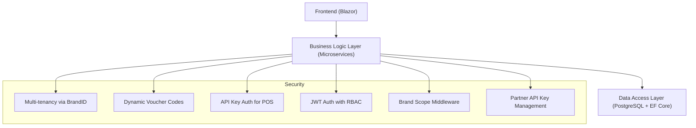
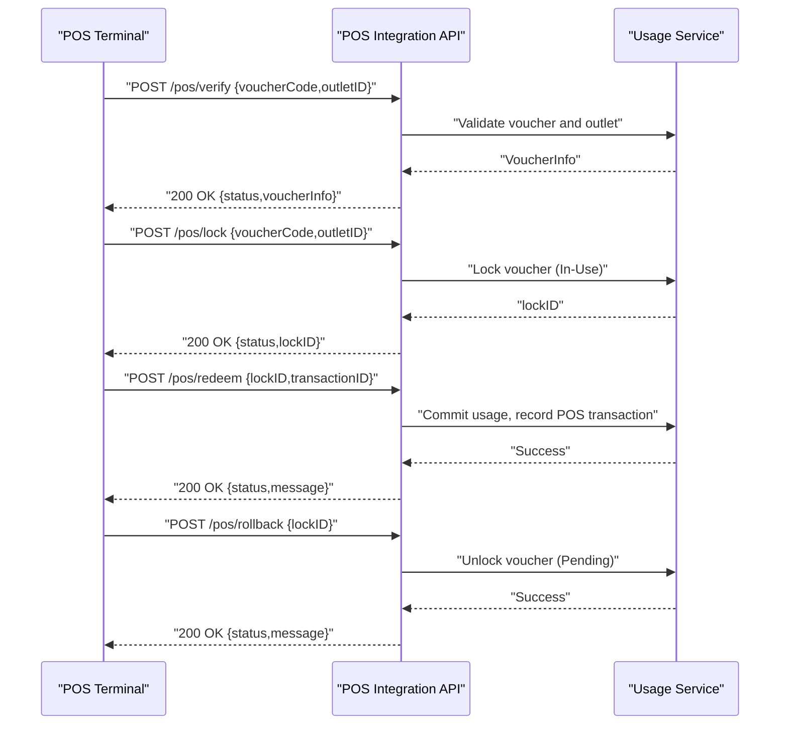
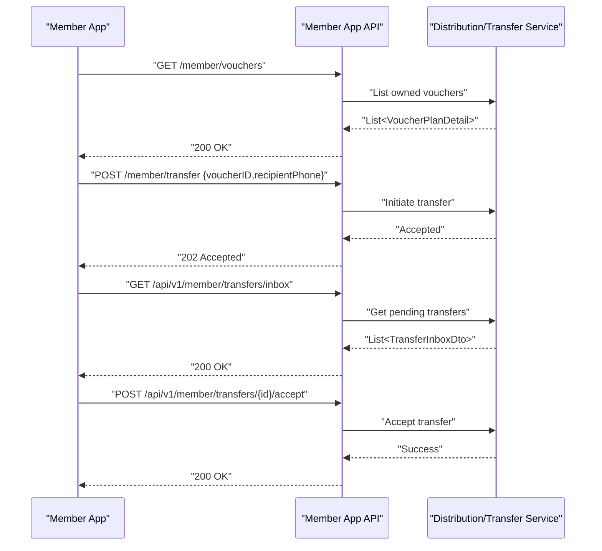
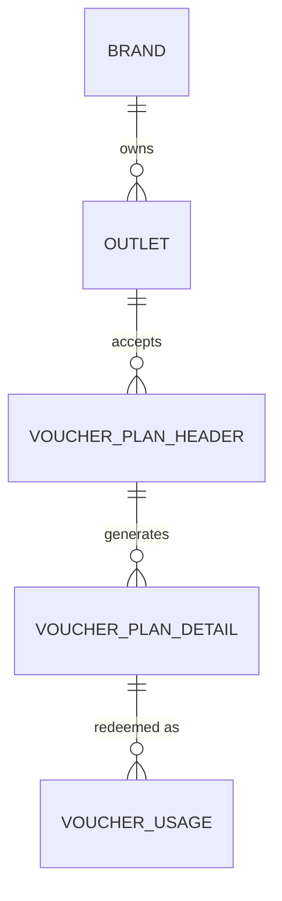
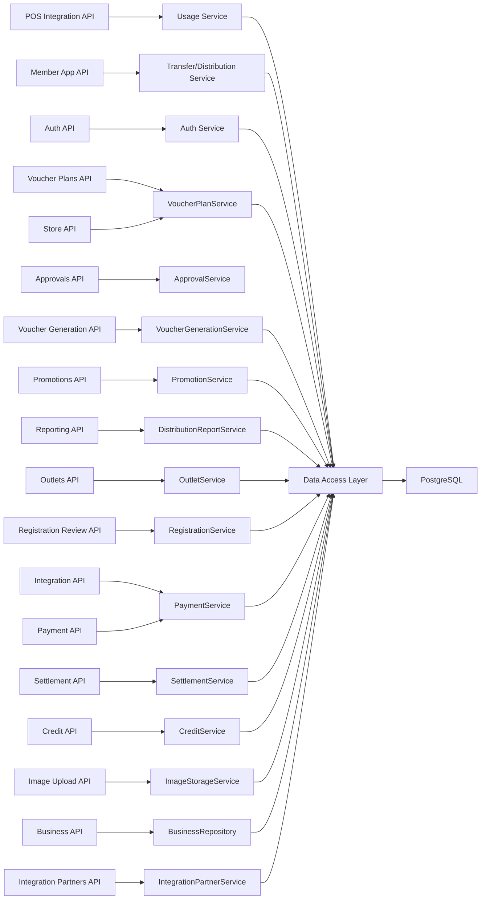

# API Contracts and Integration

<cite>
**Referenced Files in This Document**
- [api-contracts.md](file://docs/api-contracts.md)
- [architecture.md](file://docs/architecture.md)
- [data-models.md](file://docs/data-models.md)
- [index.md](file://docs/index.md)
- [Key Functionalities.txt](file://Key%20Functionalities.txt)
- [project-scan-report.json](file://docs/project-scan-report.json)
- [epics.md](file://_bmad-output/planning-artifacts/epics.md)
- [Program.cs](file://src/NonCash.API/Program.cs)
- [AuthController.cs](file://src/NonCash.API/Controllers/AuthController.cs)
- [ApprovalsController.cs](file://src/NonCash.API/Controllers/ApprovalsController.cs)
- [OutletsController.cs](file://src/NonCash.API/Controllers/OutletsController.cs)
- [PlanVersionsController.cs](file://src/NonCash.API/Controllers/PlanVersionsController.cs)
- [PromotionsController.cs](file://src/NonCash.API/Controllers/PromotionsController.cs)
- [RegistrationReviewController.cs](file://src/NonCash.API/Controllers/RegistrationReviewController.cs)
- [ReportsController.cs](file://src/NonCash.API/Controllers/ReportsController.cs)
- [StoreController.cs](file://src/NonCash.API/Controllers/StoreController.cs)
- [VoucherGenerationController.cs](file://src/NonCash.API/Controllers/VoucherGenerationController.cs)
- [VoucherPlansController.cs](file://src/NonCash.API/Controllers/VoucherPlansController.cs)
- [IntegrationController.cs](file://src/NonCash.API/Controllers/IntegrationController.cs)
- [SettlementsController.cs](file://src/NonCash.API/Controllers/SettlementsController.cs)
- [CreditsController.cs](file://src/NonCash.API/Controllers/CreditsController.cs)
- [PaymentsController.cs](file://src/NonCash.API/Controllers/PaymentsController.cs)
- [ImageUploadController.cs](file://src/NonCash.API/Controllers/ImageUploadController.cs)
- [MemberTransfersController.cs](file://src/NonCash.API/Controllers/MemberTransfersController.cs)
- [BusinessesController.cs](file://src/NonCash.API/Controllers/BusinessesController.cs)
- [IntegrationPartnersController.cs](file://src/NonCash.API/Controllers/IntegrationPartnersController.cs)
</cite>

## Update Summary
**Changes Made**
- Added comprehensive new API endpoints for Epic 6 (Loyalty App Integration) including partner management, segment distribution, member wallet queries, event history, and campaign performance
- Added Epic 7 (Cross-Tenant Settlement) APIs for settlement ledger management, netting reports, and settlement marking
- Added Epic 8 (Voucher Display) support with rich display fields and presentation data
- Enhanced Credit Ledger API with balance queries, ledger entries, and admin top-up functionality
- Added Payment Processing API with ZaloPay integration, webhook handling, and transaction management
- Added Image Upload API for media asset management with CDN integration
- Expanded Member Transfers API with inbox/outbox management, accept/reject/cancel operations
- Added Business Management API for administrative business entity operations
- Added Integration Partners API for partner lifecycle management and API key generation

## Table of Contents
1. [Introduction](#introduction)
2. [Project Structure](#project-structure)
3. [Core Components](#core-components)
4. [Architecture Overview](#architecture-overview)
5. [Detailed Component Analysis](#detailed-component-analysis)
6. [Dependency Analysis](#dependency-analysis)
7. [Performance Considerations](#performance-considerations)
8. [Troubleshooting Guide](#troubleshooting-guide)
9. [Conclusion](#conclusion)
10. [Appendices](#appendices)

## Introduction
This document provides comprehensive API contracts and integration guidance for NonCash's expanded RESTful services focused on:
- POS Integration API: Verify, Lock, Redeem, and Rollback endpoints for secure point-of-sale redemption workflows
- Member App API: Voucher listing, transfer functionality, and enhanced member experience
- Brand Management API: User authentication, outlet management, and business operations
- Voucher Planning API: Plan creation, approval workflows, and version management
- Distribution and Reporting API: Batch promotion distribution and comprehensive reporting
- Store API: Gift voucher catalog and purchase functionality
- **New**: Loyalty App Integration API: External partner integration for segment distribution, member wallet access, and campaign analytics
- **New**: Cross-Tenant Settlement API: Financial settlement tracking between sponsoring and redeeming brands
- **New**: Credit Ledger API: Prepaid billing system with balance management and transaction tracking
- **New**: Payment Processing API: Integrated payment gateway support with ZaloPay
- **New**: Media Management API: Image upload and CDN integration for rich voucher displays
- **New**: Business Management API: Administrative operations for business entities

It covers HTTP methods, URL patterns, request/response schemas, authentication, security, common use cases, client implementation guidelines, error handling strategies, rate limiting considerations, versioning, transaction security model, rollback mechanisms, performance optimization tips, and debugging approaches.

## Project Structure
The repository organizes API-related knowledge across several documentation files and controller implementations:
- API Contracts define endpoint specifications and authentication
- Architecture describes the 3-layer SaaS design and security posture
- Data Models outline core entities and relationships
- Index and scan report provide project metadata and current state
- New controllers provide comprehensive business functionality including loyalty app integration, settlement processing, and payment handling


```mermaid
graph TB
subgraph "Documentation"
A["docs/index.md"]
B["docs/api-contracts.md"]
C["docs/architecture.md"]
D["docs/data-models.md"]
E["docs/project-scan-report.json"]
end
subgraph "Core Controllers"
F["AuthController"]
G["ApprovalsController"]
H["OutletsController"]
I["PlanVersionsController"]
J["PromotionsController"]
K["RegistrationReviewController"]
L["ReportsController"]
M["StoreController"]
N["VoucherGenerationController"]
O["VoucherPlansController"]
end
subgraph "New Epic Controllers"
P["IntegrationController"]
Q["SettlementsController"]
R["CreditsController"]
S["PaymentsController"]
T["ImageUploadController"]
U["MemberTransfersController"]
V["BusinessesController"]
W["IntegrationPartnersController"]
end
subgraph "Planning Artifacts"
X["_bmad-output/planning-artifacts/epics.md"]
end
subgraph "Business Rules"
Y["Key Functionalities.txt"]
end
A --> B
A --> C
A --> D
A --> E
C --> B
D --> B
X --> B
Y --> B
F --> B
G --> B
H --> B
I --> B
J --> B
K --> B
L --> B
M --> B
N --> B
O --> B
P --> B
Q --> B
R --> B
S --> B
T --> B
U --> B
V --> B
W --> B
```

**Diagram sources**
- [index.md](file://docs/index.md)
- [api-contracts.md](file://docs/api-contracts.md)
- [architecture.md](file://docs/architecture.md)
- [data-models.md](file://docs/data-models.md)
- [project-scan-report.json](file://docs/project-scan-report.json)
- [epics.md](file://_bmad-output/planning-artifacts/epics.md)
- [Key Functionalities.txt](file://Key%20Functionalities.txt)
- [IntegrationController.cs](file://src/NonCash.API/Controllers/IntegrationController.cs)
- [SettlementsController.cs](file://src/NonCash.API/Controllers/SettlementsController.cs)
- [CreditsController.cs](file://src/NonCash.API/Controllers/CreditsController.cs)
- [PaymentsController.cs](file://src/NonCash.API/Controllers/PaymentsController.cs)
- [ImageUploadController.cs](file://src/NonCash.API/Controllers/ImageUploadController.cs)
- [MemberTransfersController.cs](file://src/NonCash.API/Controllers/MemberTransfersController.cs)
- [BusinessesController.cs](file://src/NonCash.API/Controllers/BusinessesController.cs)
- [IntegrationPartnersController.cs](file://src/NonCash.API/Controllers/IntegrationPartnersController.cs)

**Section sources**
- [index.md](file://docs/index.md)
- [project-scan-report.json](file://docs/project-scan-report.json)

## Core Components
- POS Integration API: Exposes endpoints for verifying voucher validity, locking a voucher to prevent double-spending, committing the redemption upon successful transaction, and rolling back a lock on failure or cancellation
- Member App API: Provides endpoints for listing a member's vouchers, initiating transfers, and managing transfer inbox/outbox
- Brand Management API: Handles user authentication, outlet management, and administrative functions
- Voucher Planning API: Manages voucher plan creation, approval workflows, and version control
- Distribution API: Supports batch promotion distribution with CSV upload capabilities
- Reporting API: Provides comprehensive distribution summaries and CSV exports
- Store API: Offers gift voucher catalog and purchase functionality
- **New**: Loyalty App Integration API: External partner integration for segment distribution, member wallet queries, event history, and campaign performance
- **New**: Settlement API: Cross-tenant financial settlement tracking and netting reports
- **New**: Credit Ledger API: Prepaid billing system with balance management and transaction tracking
- **New**: Payment Processing API: Integrated payment gateway support with ZaloPay
- **New**: Media Management API: Image upload and CDN integration for rich voucher displays
- **New**: Business Management API: Administrative operations for business entities

Authentication:
- API Key: Provided via the X-API-Key header for POS clients and integration partners
- JWT: Provided via Authorization: Bearer <JWT> for all business API clients

Versioning:
- Base URL includes v1: https://api.noncash.service/v1

Format:
- JSON for requests and responses

**Section sources**
- [api-contracts.md](file://docs/api-contracts.md)
- [index.md](file://docs/index.md)

## Architecture Overview
NonCash follows a 3-layer SaaS architecture:
- User Interface (Blazor) interacts with the Business Logic Layer (Microservices)
- Business Logic Layer orchestrates services such as Planning, Approval, Distribution, Usage (POS redemption), Identity & Tenant management
- Data Access Layer uses PostgreSQL with EF Core and Repository pattern

Security highlights:
- Multi-tenancy via BrandID to isolate data per tenant
- Dynamic security: Vouchers use rotating dynamic codes similar to JWT logic to prevent reuse
- Integration security: POS systems authenticated via API Keys and restricted to predefined outlet ranges
- Role-Based Access Control (RBAC) with JWT claims for business operations
- Brand scoping middleware for tenant isolation
- Partner API key management for external loyalty apps


```mermaid
graph TB
UI["Frontend (Blazor)"] --> BLL["Business Logic Layer (Microservices)"]
BLL --> DAL["Data Access Layer (PostgreSQL + EF Core)"]
subgraph "Security"
MT["Multi-tenancy via BrandID"]
DS["Dynamic Voucher Codes"]
AK["API Key Auth for POS"]
JWT["JWT Auth with RBAC"]
BS["Brand Scope Middleware"]
PK["Partner API Key Management"]
end
BLL --> MT
BLL --> DS
BLL --> AK
BLL --> JWT
BLL --> BS
BLL --> PK
```

**Diagram sources**
- [architecture.md](file://docs/architecture.md)
- [Program.cs](file://src/NonCash.API/Program.cs)

**Section sources**
- [architecture.md](file://docs/architecture.md)

## Detailed Component Analysis

### POS Integration API

Endpoints:
- Verify Voucher: POST /pos/verify
- Lock Voucher: POST /pos/lock
- Redeem Voucher: POST /pos/redeem
- Rollback Lock: POST /pos/rollback

Authentication:
- X-API-Key header for POS clients

Common request/response patterns:
- Requests carry voucherCode and outletID for verification and lock
- Lock response returns a lockID
- Redeem requires lockID and transactionID
- Rollback requires lockID

Transaction security model:
- Verify does not change state
- Lock transitions the voucher to In-Use to prevent double-spending
- Redeem commits the usage and records POS transaction details
- Rollback releases the lock without committing


```mermaid
sequenceDiagram
participant POS as "POS Terminal"
participant API as "POS Integration API"
participant SVC as "Usage Service"
POS->>API : "POST /pos/verify {voucherCode,outletID}"
API->>SVC : "Validate voucher and outlet"
SVC-->>API : "VoucherInfo"
API-->>POS : "200 OK {status,voucherInfo}"
POS->>API : "POST /pos/lock {voucherCode,outletID}"
API->>SVC : "Lock voucher (In-Use)"
SVC-->>API : "lockID"
API-->>POS : "200 OK {status,lockID}"
POS->>API : "POST /pos/redeem {lockID,transactionID}"
API->>SVC : "Commit usage, record POS transaction"
SVC-->>API : "Success"
API-->>POS : "200 OK {status,message}"
POS->>API : "POST /pos/rollback {lockID}"
API->>SVC : "Unlock voucher (Pending)"
SVC-->>API : "Success"
API-->>POS : "200 OK {status,message}"
```

**Diagram sources**
- [api-contracts.md](file://docs/api-contracts.md)
- [epics.md](file://_bmad-output/planning-artifacts/epics.md)

**Section sources**
- [api-contracts.md](file://docs/api-contracts.md)
- [epics.md](file://_bmad-output/planning-artifacts/epics.md)

### Member App API

Endpoints:
- List My Vouchers: GET /member/vouchers (requires JWT)
- Transfer Voucher: POST /member/transfer
- Transfer Inbox: GET /api/v1/member/transfers/inbox (requires JWT)
- Transfer Outbox: GET /api/v1/member/transfers/outbox (requires JWT)
- Accept Transfer: POST /api/v1/member/transfers/{id}/accept (requires JWT)
- Reject Transfer: POST /api/v1/member/transfers/{id}/reject (requires JWT)
- Cancel Transfer: POST /api/v1/member/transfers/{id}/cancel (requires JWT)

Authentication:
- Authorization: Bearer <JWT> header

Transfer workflow:
- Initiator sends POST /member/transfer with voucherID and recipientPhone
- Response is 202 Accepted, indicating the transfer is initiated and awaiting recipient confirmation
- Recipient can view pending transfers via inbox and accept/reject them
- Sender can cancel pending transfers via outbox


```mermaid
sequenceDiagram
participant App as "Member App"
participant API as "Member App API"
participant SVC as "Distribution/Transfer Service"
App->>API : "GET /member/vouchers"
API->>SVC : "List owned vouchers"
SVC-->>API : "List<VoucherPlanDetail>"
API-->>App : "200 OK"
App->>API : "POST /member/transfer {voucherID,recipientPhone}"
API->>SVC : "Initiate transfer"
SVC-->>API : "Accepted"
API-->>App : "202 Accepted"
App->>API : "GET /api/v1/member/transfers/inbox"
API->>SVC : "Get pending transfers"
SVC-->>API : "List<TransferInboxDto>"
API-->>App : "200 OK"
App->>API : "POST /api/v1/member/transfers/{id}/accept"
API->>SVC : "Accept transfer"
SVC-->>API : "Success"
API-->>App : "200 OK"
```

**Diagram sources**
- [api-contracts.md](file://docs/api-contracts.md)
- [MemberTransfersController.cs](file://src/NonCash.API/Controllers/MemberTransfersController.cs)

**Section sources**
- [api-contracts.md](file://docs/api-contracts.md)
- [MemberTransfersController.cs](file://src/NonCash.API/Controllers/MemberTransfersController.cs)

### Brand Management API

#### Authentication API
Endpoints:
- Login: POST /api/v1/auth/login
- Request body: { username, password }
- Response: { token, expiresAt, user: { userId, fullName, role, brandId } }

Authentication:
- No authentication required for login endpoint
- Subsequent endpoints require Authorization: Bearer <JWT>

#### Users Management API
Endpoints:
- Get Users: GET /api/v1/users
- Get User: GET /api/v1/users/{id}
- Create User: POST /api/v1/users (Admin only)

Access Control:
- Requires Admin role for user management
- Brand managers can access outlet management endpoints

**Section sources**
- [AuthController.cs](file://src/NonCash.API/Controllers/AuthController.cs)
- [UsersController.cs](file://src/NonCash.API/Controllers/UsersController.cs)

### Voucher Planning API

#### Voucher Plans API
Endpoints:
- Create Plan: POST /api/v1/plans
- List Plans: GET /api/v1/plans
- Get Plan: GET /api/v1/plans/{id}
- Update Plan: PUT /api/v1/plans/{id}

Request/Response:
- Create requires plan configuration with approval status set to Draft
- Update supports draft modifications before approval
- Response includes comprehensive plan metadata including outlets, versions, and status

#### Approvals API
Endpoints:
- Approve Plan: POST /api/v1/plans/{planId}/approve
- Reject Plan: POST /api/v1/plans/{planId}/reject
- Get Review History: GET /api/v1/plans/{planId}/reviews

Workflow:
- Plan approval requires authorized approver with proper role
- Review history tracks all approval decisions with timestamps
- Publish date validation ensures proper timing

#### Plan Versions API
Endpoints:
- Clone Plan: POST /api/v1/plans/{planId}/clone
- Get Versions: GET /api/v1/plans/{planId}/versions

Versioning:
- Creates new plan version from approved plan
- Maintains version lineage with previous version tracking
- Supports plan iteration and improvement workflows

**Section sources**
- [VoucherPlansController.cs](file://src/NonCash.API/Controllers/VoucherPlansController.cs)
- [ApprovalsController.cs](file://src/NonCash.API/Controllers/ApprovalsController.cs)
- [PlanVersionsController.cs](file://src/NonCash.API/Controllers/PlanVersionsController.cs)

### Distribution and Promotion API

#### Voucher Generation API
Endpoints:
- Generate Vouchers: POST /api/v1/plans/{planId}/generate
- List Generated Vouchers: GET /api/v1/plans/{planId}/vouchers

Capabilities:
- Batch generation of vouchers for approved plans
- Dynamic code generation for security
- Voucher listing with usage status tracking

#### Promotions API
Endpoints:
- Promote via CSV: POST /api/v1/plans/{planId}/promote
- Promote via JSON: POST /api/v1/plans/{planId}/promote/json

Features:
- CSV file upload support with automatic phone number extraction
- JSON array input for programmatic integration
- Bulk distribution with skip reporting
- Size limit of 10MB for CSV uploads

**Section sources**
- [VoucherGenerationController.cs](file://src/NonCash.API/Controllers/VoucherGenerationController.cs)
- [PromotionsController.cs](file://src/NonCash.API/Controllers/PromotionsController.cs)

### Reporting API

#### Distribution Reports API
Endpoints:
- Get Summary: GET /api/v1/reports/distribution
- Get Plan Details: GET /api/v1/reports/distribution/{planId}/details
- Export CSV: GET /api/v1/reports/distribution/export

Access Control:
- Requires roles: BrandManager, Planner, Approver, Admin
- Brand-scoped reporting with tenant isolation

Report Features:
- Summary with distribution metrics by method (Sale, Promotion, Transfer)
- Detailed plan-level breakdown
- CSV export with configurable date ranges

**Section sources**
- [ReportsController.cs](file://src/NonCash.API/Controllers/ReportsController.cs)

### Store API

#### Gift Voucher Store API
Endpoints:
- List Catalog: GET /api/v1/store/vouchers

Functionality:
- Lists approved and published gift vouchers
- Returns catalog items with pricing, validity periods, and media assets
- Supports both B2C and B2B purchase scenarios

**Section sources**
- [StoreController.cs](file://src/NonCash.API/Controllers/StoreController.cs)

### Outlet Management API

#### Outlets API
Endpoints:
- Get Outlets: GET /api/v1/outlets
- Get Outlet: GET /api/v1/outlets/{id}
- Create Outlet: POST /api/v1/outlets
- Update Outlet: PUT /api/v1/outlets/{id}
- Close Outlet: PUT /api/v1/outlets/{id}/close

Access Control:
- Requires roles: BrandManager, Admin
- Brand-scoped outlet management

Features:
- Paged listing with filtering by name and status
- CRUD operations with validation
- Status management (Open, Closed)
- API key prefix generation for POS integration

**Section sources**
- [OutletsController.cs](file://src/NonCash.API/Controllers/OutletsController.cs)

### Registration Review API

#### Business Registration Review API
Endpoints:
- Get Pending Requests: GET /api/v1/admin/registration-requests/pending
- Get All Requests: GET /api/v1/admin/registration-requests
- Approve Request: POST /api/v1/admin/registration-requests/{requestId}/approve
- Reject Request: POST /api/v1/admin/registration-requests/{requestId}/reject

Access Control:
- Requires Admin role
- Comprehensive review workflow with notes and timestamps

**Section sources**
- [RegistrationReviewController.cs](file://src/NonCash.API/Controllers/RegistrationReviewController.cs)

### **New**: Loyalty App Integration API (Epic 6)

#### Partner Management API
Endpoints:
- List Partners: GET /api/v1/integration-partners (Admin)
- Get Partner: GET /api/v1/integration-partners/{id} (Admin)
- Create Partner: POST /api/v1/integration-partners (Admin)
- Update Partner: PUT /api/v1/integration-partners/{id} (Admin)
- Delete Partner: DELETE /api/v1/integration-partners/{id} (Admin)
- Generate API Key: POST /api/v1/integration-partners/{id}/generate-key (Admin)
- Set Brands: PUT /api/v1/integration-partners/{id}/brands (Admin)

#### Segment Distribution API
Endpoints:
- Distribute to Segment: POST /integration/distribute (Partner API Key)

Request:
```json
{
  "planId": "GUID",
  "brandId": "GUID", 
  "phoneNumbers": ["0909222222", "0909333333"],
  "externalMemberIds": {
    "0909222222": "EXT-BOB-001",
    "0909333333": "EXT-CAROL-001"
  }
}
```

Response:
```json
{
  "distributedCount": 2,
  "skippedCount": 0,
  "errors": []
}
```

#### Member Wallet & Event History API
Endpoints:
- Get Member Vouchers: GET /integration/member/{phone}/vouchers (Partner API Key)
- Get Member Events: GET /integration/member/{phone}/events?limit=50 (Partner API Key)

#### Campaign Performance API
Endpoints:
- Get Campaign Performance: GET /integration/campaigns/{planId}/performance (Partner API Key)

Authentication:
- Partner API Key via X-API-Key header
- Brand scope validation based on partner associations

**Section sources**
- [IntegrationController.cs](file://src/NonCash.API/Controllers/IntegrationController.cs)
- [IntegrationPartnersController.cs](file://src/NonCash.API/Controllers/IntegrationPartnersController.cs)

### **New**: Cross-Tenant Settlement API (Epic 7)

#### Settlement Ledger API
Endpoints:
- Get Ledger: GET /api/v1/settlements (Authenticated)
- Mark Settled: PUT /api/v1/settlements/{id}/settle (Authenticated)
- Get Netting Report: GET /api/v1/settlements/netting?from=2026-01-01&to=2026-12-31 (Authenticated)

Query Parameters:
- sponsorBrandId: Filter by sponsoring brand
- redeemBrandId: Filter by redeeming brand  
- status: Filter by settlement status (Pending, Settled)
- from/to: Date range filters
- page/pageSize: Pagination

Netting Report Response:
```json
{
  "from": "2026-01-01T00:00:00",
  "to": "2026-12-31T00:00:00",
  "rows": [
    {
      "sponsorBrandId": "GUID",
      "redeemBrandId": "GUID", 
      "netAmount": 1250000
    }
  ]
}
```

**Section sources**
- [SettlementsController.cs](file://src/NonCash.API/Controllers/SettlementsController.cs)

### **New**: Credit Ledger API

#### Balance Management API
Endpoints:
- Get Balance: GET /credits/balance?brandId=GUID (Authenticated)
- Get Ledger: GET /credits/ledger?brandId=GUID&type=Grant|Purchase|Consumption|Adjustment&from=2026-07-01&to=2026-07-31&page=1&pageSize=20 (Authenticated)
- Top Up: POST /credits/topup (Admin only)

Balance Guard Behavior:
- When balance ≤ 0, voucher generation, distribution, and purchases fail with InsufficientCredits
- POS redemption continues (grace overdraft allowed)

Top Up Request:
```json
{
  "brandId": "GUID",
  "amount": 1000,
  "type": "Purchase",
  "reference": "Bank transfer #TX-2026-0728"
}
```

**Section sources**
- [CreditsController.cs](file://src/NonCash.API/Controllers/CreditsController.cs)

### **New**: Payment Processing API

#### ZaloPay Integration API
Endpoints:
- Create Payment: POST /api/v1/payments/{orderId}/create (Authenticated)
- Webhook: POST /api/v1/payments/webhook (Anonymous - verified)
- Callback: GET /api/v1/payments/callback?status={status}&apptransid={id} (Anonymous)
- Get Transaction: GET /api/v1/payments/transactions/{transactionId} (Authenticated)
- Get by Gateway ID: GET /api/v1/payments/transactions/by-gateway/{gatewayTransactionId} (Authenticated)

Payment Flow:
1. Client creates payment session for pending order
2. Redirect to ZaloPay payment URL
3. Customer completes payment
4. Webhook notifies NonCash of payment result
5. Order fulfillment triggered automatically

Webhook Payload:
```json
{
  "data": "encrypted_data_string",
  "mac": "message_authentication_code"
}
```

**Section sources**
- [PaymentsController.cs](file://src/NonCash.API/Controllers/PaymentsController.cs)

### **New**: Image Upload API

#### Media Management API
Endpoints:
- Upload Image: POST /api/v1/upload/image (Authenticated)

Form Fields:
- file: Image file (jpg, png, webp, gif)
- entity: Business entity name (e.g., "voucher_plan_headers")
- uniqueCode: Unique record identifier (e.g., "{planId}_cover_image")

Response:
```json
{
  "success": true,
  "url": "/uploads/voucher_plan_headers/abc123_cover.jpg"
}
```

Features:
- 10MB request size limit
- CDN integration for full URL composition
- Deduplication via uniqueCode
- Entity-based organization

**Section sources**
- [ImageUploadController.cs](file://src/NonCash.API/Controllers/ImageUploadController.cs)

### **New**: Business Management API

#### Business Entity API
Endpoints:
- Get All Businesses: GET /api/v1/businesses (Admin)
- Get Business: GET /api/v1/businesses/{id} (Admin)
- Create Business: POST /api/v1/businesses (Admin)
- Update Business: PUT /api/v1/businesses/{id} (Admin)

Business Entity Features:
- Tax code validation and uniqueness
- Contact information management
- Active/inactive status
- Brand association counting

**Section sources**
- [BusinessesController.cs](file://src/NonCash.API/Controllers/BusinessesController.cs)

### Data Model Context for POS Redemption

Core entities and relationships inform POS redemption semantics:
- VoucherPlanHeader: Campaign-level attributes including brand, value type, face/net values, expiry, publish date, sales range (outlets), and time range
- VoucherPlanDetail: Individual voucher with dynamic code, owner, and usage status (Pending, In-Use, Complete)
- VoucherUsage: Records POS redemption with POSID, TransactionID, amount used, and usage date
- Outlet: Physical or digital store linked to Brand


```mermaid
erDiagram
BRAND ||--o{ OUTLET : "owns"
OUTLET ||--o{ VOUCHER_PLAN_HEADER : "accepts"
VOUCHER_PLAN_HEADER ||--o{ VOUCHER_PLAN_DETAIL : "generates"
VOUCHER_PLAN_DETAIL ||--o{ VOUCHER_USAGE : "redeemed as"
```

**Diagram sources**
- [data-models.md](file://docs/data-models.md)

**Section sources**
- [data-models.md](file://docs/data-models.md)

## Dependency Analysis
- POS Integration API depends on the Usage Service for verification, locking, committing, and rolling back voucher usage
- Member App API depends on Distribution/Transfer Service for listing and transferring vouchers
- Brand Management API depends on Auth Service for user authentication and authorization
- Voucher Planning API depends on VoucherPlanService for plan management and approval workflows
- Distribution API depends on VoucherGenerationService and PromotionService for batch operations
- Reporting API depends on DistributionReportService for analytics and insights
- **New**: Integration API depends on PromotionService, VoucherEventPublisher, and IntegrationPartnerService
- **New**: Settlement API depends on SettlementService for cross-tenant financial tracking
- **New**: Credit API depends on CreditService for prepaid billing management
- **New**: Payment API depends on PaymentService, PurchaseService, and ZaloPay integration
- **New**: Image Upload API depends on ImageStorageService for CDN integration
- **New**: Business API depends on BusinessRepository and BrandRepository
- All services rely on the Data Access Layer for persistence and transactional integrity
- Security controls (multi-tenancy, dynamic codes, API keys, JWT) are enforced at the Business Logic Layer


```mermaid
graph LR
POS["POS Integration API"] --> USVC["Usage Service"]
MEM["Member App API"] --> TSVC["Transfer/Distribution Service"]
AUTH["Auth API"] --> ASVC["Auth Service"]
PLANS["Voucher Plans API"] --> PSVC["VoucherPlanService"]
APPROVALS["Approvals API"] --> ASVC2["ApprovalService"]
GEN["Voucher Generation API"] --> GENSVC["VoucherGenerationService"]
PROMO["Promotions API"] --> PROMOSVC["PromotionService"]
REPORTS["Reporting API"] --> RSVC["DistributionReportService"]
STORE["Store API"] --> PSVC
OUTLETS["Outlets API"] --> OSVC["OutletService"]
REG["Registration Review API"] --> RSVC2["RegistrationService"]
INTEGRATION["Integration API"] --> PSVC2["PromotionService"]
SETTLEMENT["Settlement API"] --> SSVC["SettlementService"]
CREDITS["Credit API"] --> CSVC["CreditService"]
PAYMENTS["Payment API"] --> PSVC2["PaymentService"]
UPLOAD["Image Upload API"] --> ISVC["ImageStorageService"]
BUSINESS["Business API"] --> BR["BusinessRepository"]
IPARTNERS["Integration Partners API"] --> IPSVC["IntegrationPartnerService"]
USVC --> DAL["Data Access Layer"]
TSVC --> DAL
ASVC --> DAL
PSVC --> DAL
GENSVC --> DAL
PROMOSVC --> DAL
RSVC --> DAL
OSVC --> DAL
RSVC2 --> DAL
PSVC2 --> DAL
SSVC --> DAL
CSVC --> DAL
ISVC --> DAL
BR --> DAL
IPSVC --> DAL
DAL --> DB["PostgreSQL"]
```

**Diagram sources**
- [architecture.md](file://docs/architecture.md)
- [data-models.md](file://docs/data-models.md)

**Section sources**
- [architecture.md](file://docs/architecture.md)
- [data-models.md](file://docs/data-models.md)

## Performance Considerations
- Minimize round-trips: Perform Verify and Lock in sequence close to the transaction boundary to reduce lock contention
- Asynchronous operations: For bulk operations (e.g., batch promotions), leverage background workers to avoid UI stalls and improve throughput
- Real-time updates: Use real-time communication patterns to reflect state changes without polling
- Caching: Cache outlet and brand metadata locally at the POS terminal to reduce latency for repeated validations
- Connection pooling: Ensure HTTP clients reuse connections and handle timeouts appropriately
- Pagination: Use pagination parameters for large datasets (outlets, reports, plans, settlements, credits)
- CSV processing: Implement streaming for large CSV files to avoid memory issues
- JWT caching: Cache validated JWT tokens for short periods to reduce authentication overhead
- **New**: CDN integration: Leverage CDN for image delivery to reduce server load
- **New**: Webhook handling: Implement idempotent webhook processing for payment confirmations
- **New**: Settlement computation: Optimize netting calculations with database indexes for date ranges and brand pairs

## Troubleshooting Guide
Common issues and strategies:
- Authentication failures:
  - Verify X-API-Key header presence and correctness for POS endpoints
  - Confirm JWT validity and scope for business API endpoints
  - Check role-based access for protected endpoints
  - Validate partner API key permissions for integration endpoints
- Voucher state errors:
  - If a voucher is not Pending, Lock may fail; ensure proper rollback on cancellation
  - After Redeem, reusing the same lockID or transactionID may be rejected
- Plan approval issues:
  - Ensure plan is in Approved status before generating vouchers
  - Verify outlet associations match plan requirements
- CSV upload problems:
  - Check file size limits (10MB max)
  - Validate phone number formats and CSV structure
- Network interruptions:
  - Implement idempotent request handling for Lock and Redeem using lockID/transactionID deduplication at the client
  - Retry with exponential backoff for transient failures
- **New**: Integration partner issues:
  - Verify partner API key is active and associated with requested brand
  - Check partner callback URL configuration for webhook delivery
- **New**: Settlement processing issues:
  - Ensure settlement entries exist before attempting to mark as settled
  - Validate date ranges for netting reports
- **New**: Payment processing issues:
  - Verify webhook signature validation for ZaloPay callbacks
  - Check order status before creating payment sessions
- **New**: Image upload issues:
  - Validate file format and size constraints
  - Ensure uniqueCode prevents duplicate uploads
- Debugging:
  - Capture request IDs and timestamps; correlate with backend logs
  - Validate outletID against the sales range defined in the associated VoucherPlanHeader
  - Monitor usage status transitions (Pending → In-Use → Complete/Pending) to detect anomalies
  - Check JWT claims for brand and role information

**Section sources**
- [api-contracts.md](file://docs/api-contracts.md)
- [epics.md](file://_bmad-output/planning-artifacts/epics.md)

## Conclusion
NonCash's comprehensive API suite enables secure, auditable, and efficient POS redemption, member-driven voucher transfers, and enterprise-grade business operations. The expanded controller ecosystem now supports complete voucher lifecycle management from planning and approval to generation, distribution, and reporting, plus advanced features like loyalty app integration, cross-tenant settlement, prepaid billing, payment processing, and rich media management. By adhering to the documented endpoints, authentication methods, and transactional semantics, clients can integrate reliably with the platform while leveraging built-in security controls, role-based access, and performance best practices.

## Appendices

### API Reference Summary

**Base URL**: https://api.noncash.service/v1
**Authentication**:
- POS: X-API-Key header
- Business APIs: Authorization: Bearer <JWT>
- Integration Partners: X-API-Key header (partner-specific)
**Format**: JSON

**POS Integration API**:
- POST /pos/verify: { voucherCode, outletID } → { status, voucherInfo }
- POST /pos/lock: { voucherCode, outletID } → { status, lockID }
- POST /pos/redeem: { lockID, transactionID } → { status, message }
- POST /pos/rollback: { lockID } → { status, message }

**Member App API**:
- GET /member/vouchers: Header: Authorization: Bearer <JWT> → List of VoucherPlanDetail
- POST /member/transfer: { voucherID, recipientPhone } → 202 Accepted
- GET /api/v1/member/transfers/inbox: Header: Authorization: Bearer <JWT> → List<TransferInboxDto>
- GET /api/v1/member/transfers/outbox: Header: Authorization: Bearer <JWT> → List<TransferOutboxDto>
- POST /api/v1/member/transfers/{id}/accept: Header: Authorization: Bearer <JWT> → TransferActionDto
- POST /api/v1/member/transfers/{id}/reject: Header: Authorization: Bearer <JWT> → TransferActionDto
- POST /api/v1/member/transfers/{id}/cancel: Header: Authorization: Bearer <JWT> → TransferActionDto

**Brand Management API**:
- POST /api/v1/auth/login: { username, password } → { token, expiresAt, user }
- GET /api/v1/users: Header: Authorization: Bearer <JWT> → List of users
- POST /api/v1/users: Header: Authorization: Bearer <JWT> → Created user

**Voucher Planning API**:
- POST /api/v1/plans: Header: Authorization: Bearer <JWT> → Created plan
- GET /api/v1/plans: Header: Authorization: Bearer <JWT> → List of plans
- POST /api/v1/plans/{planId}/approve: Header: Authorization: Bearer <JWT> → { status, plan }
- POST /api/v1/plans/{planId}/reject: Header: Authorization: Bearer <JWT> → { status, plan }
- POST /api/v1/plans/{planId}/clone: Header: Authorization: Bearer <JWT> → { newPlanId, versionNumber }

**Distribution API**:
- POST /api/v1/plans/{planId}/generate: Header: Authorization: Bearer <JWT> → { generatedCount }
- POST /api/v1/plans/{planId}/promote: Header: Authorization: Bearer <JWT> → { distributedCount, skippedCount, skippedPhones }
- POST /api/v1/plans/{planId}/promote/json: Header: Authorization: Bearer <JWT> → { distributedCount, skippedCount, skippedPhones }

**Reporting API**:
- GET /api/v1/reports/distribution: Header: Authorization: Bearer <JWT> → { summary }
- GET /api/v1/reports/distribution/{planId}/details: Header: Authorization: Bearer <JWT> → { details }
- GET /api/v1/reports/distribution/export: Header: Authorization: Bearer <JWT> → CSV file

**Store API**:
- GET /api/v1/store/vouchers: Header: Authorization: Bearer <JWT> → { catalog items }

**Outlet Management API**:
- GET /api/v1/outlets: Header: Authorization: Bearer <JWT> → { outlets }
- POST /api/v1/outlets: Header: Authorization: Bearer <JWT> → { outlet }
- PUT /api/v1/outlets/{id}: Header: Authorization: Bearer <JWT> → { outlet }
- PUT /api/v1/outlets/{id}/close: Header: Authorization: Bearer <JWT> → { outlet }

**Registration Review API**:
- GET /api/v1/admin/registration-requests/pending: Header: Authorization: Bearer <JWT> → { requests }
- POST /api/v1/admin/registration-requests/{requestId}/approve: Header: Authorization: Bearer <JWT> → { message }
- POST /api/v1/admin/registration-requests/{requestId}/reject: Header: Authorization: Bearer <JWT> → { message }

**Loyalty App Integration API**:
- POST /integration/distribute: X-API-Key → { distributedCount, skippedCount, errors }
- GET /integration/member/{phone}/vouchers: X-API-Key → List<IntegrationWalletItem>
- GET /integration/member/{phone}/events: X-API-Key → List<IntegrationEventItem>
- GET /integration/campaigns/{planId}/performance: X-API-Key → Campaign performance metrics

**Integration Partners API**:
- GET /api/v1/integration-partners: Header: Authorization: Bearer <JWT> → List<PartnerDto>
- POST /api/v1/integration-partners: Header: Authorization: Bearer <JWT> → { id, apiKeyPrefix }
- POST /api/v1/integration-partners/{id}/generate-key: Header: Authorization: Bearer <JWT> → { apiKey, prefix, warning }
- PUT /api/v1/integration-partners/{id}/brands: Header: Authorization: Bearer <JWT> → { message }

**Settlement API**:
- GET /api/v1/settlements: Header: Authorization: Bearer <JWT> → SettlementLedgerResponse
- PUT /api/v1/settlements/{id}/settle: Header: Authorization: Bearer <JWT> → { message }
- GET /api/v1/settlements/netting: Header: Authorization: Bearer <JWT> → NettingResponse

**Credit Ledger API**:
- GET /credits/balance: Header: Authorization: Bearer <JWT> → CreditBalanceResponse
- GET /credits/ledger: Header: Authorization: Bearer <JWT> → CreditLedgerResponse
- POST /credits/topup: Header: Authorization: Bearer <JWT> (Admin) → CreditLedgerEntryDto

**Payment Processing API**:
- POST /api/v1/payments/{orderId}/create: Header: Authorization: Bearer <JWT> → PaymentCreateResponse
- POST /api/v1/payments/webhook: → { return_code, return_message }
- GET /api/v1/payments/callback: → Redirect to configured URL
- GET /api/v1/payments/transactions/{transactionId}: Header: Authorization: Bearer <JWT> → PaymentTransactionResponse
- GET /api/v1/payments/transactions/by-gateway/{gatewayTransactionId}: Header: Authorization: Bearer <JWT> → PaymentTransactionResponse

**Image Upload API**:
- POST /api/v1/upload/image: Header: Authorization: Bearer <JWT> → UploadResponse

**Business Management API**:
- GET /api/v1/businesses: Header: Authorization: Bearer <JWT> (Admin) → List<BusinessResponse>
- POST /api/v1/businesses: Header: Authorization: Bearer <JWT> (Admin) → BusinessResponse
- PUT /api/v1/businesses/{id}: Header: Authorization: Bearer <JWT> (Admin) → BusinessResponse

**Section sources**
- [api-contracts.md](file://docs/api-contracts.md)
- [IntegrationController.cs](file://src/NonCash.API/Controllers/IntegrationController.cs)
- [SettlementsController.cs](file://src/NonCash.API/Controllers/SettlementsController.cs)
- [CreditsController.cs](file://src/NonCash.API/Controllers/CreditsController.cs)
- [PaymentsController.cs](file://src/NonCash.API/Controllers/PaymentsController.cs)
- [ImageUploadController.cs](file://src/NonCash.API/Controllers/ImageUploadController.cs)
- [MemberTransfersController.cs](file://src/NonCash.API/Controllers/MemberTransfersController.cs)
- [BusinessesController.cs](file://src/NonCash.API/Controllers/BusinessesController.cs)
- [IntegrationPartnersController.cs](file://src/NonCash.API/Controllers/IntegrationPartnersController.cs)

### Security Considerations
- Multi-tenancy: BrandID isolates data between tenants across all business APIs
- Dynamic codes: Voucher codes rotate to prevent reuse
- API Key scope: POS clients are restricted to predefined outlet ranges
- JWT scope: Business API tokens are bound to the requesting user's brand and role
- Role-Based Access Control: Different endpoints require specific roles (Admin, BrandManager, Planner, Approver)
- Brand Scoping: Middleware enforces tenant isolation for non-admin users
- Request Validation: All endpoints validate input parameters and enforce business rules
- **New**: Partner API Key Management: Secure key generation and rotation for external loyalty apps
- **New**: Webhook Security: Signature validation for payment provider callbacks
- **New**: File Upload Security: Format validation and size limits for image uploads

**Section sources**
- [architecture.md](file://docs/architecture.md)
- [index.md](file://docs/index.md)
- [Program.cs](file://src/NonCash.API/Program.cs)
- [IntegrationPartnersController.cs](file://src/NonCash.API/Controllers/IntegrationPartnersController.cs)
- [PaymentsController.cs](file://src/NonCash.API/Controllers/PaymentsController.cs)
- [ImageUploadController.cs](file://src/NonCash.API/Controllers/ImageUploadController.cs)

### Versioning
- All endpoints are under v1 of the base path
- Controller routing follows the pattern: api/v1/{controller}

**Section sources**
- [api-contracts.md](file://docs/api-contracts.md)

### Business Rules Context
- Voucher lifecycle: Pending → In-Use → Complete (or rollback to Pending)
- POS redemption workflow: Verify → Lock → Redeem/Commit or Rollback
- Transfers require recipient confirmation and occur outside payment flows
- Plan approval workflow: Draft → Review → Approve/Reject → Published
- Batch promotion requires proper authorization and validates phone number formats
- Reporting is brand-scoped with role-based access controls
- **New**: Partner integration requires brand association and API key validation
- **New**: Settlement tracking occurs automatically for cross-tenant redemptions
- **New**: Credit consumption occurs at value moment (gift sale or POS redemption)
- **New**: Payment processing integrates with ZaloPay for B2C purchases
- **New**: Image uploads support rich voucher display with CDN integration

**Section sources**
- [Key Functionalities.txt](file://Key%20Functionalities.txt)
- [epics.md](file://_bmad-output/planning-artifacts/epics.md)
- [IntegrationController.cs](file://src/NonCash.API/Controllers/IntegrationController.cs)
- [SettlementsController.cs](file://src/NonCash.API/Controllers/SettlementsController.cs)
- [CreditsController.cs](file://src/NonCash.API/Controllers/CreditsController.cs)
- [PaymentsController.cs](file://src/NonCash.API/Controllers/PaymentsController.cs)
- [ImageUploadController.cs](file://src/NonCash.API/Controllers/ImageUploadController.cs)