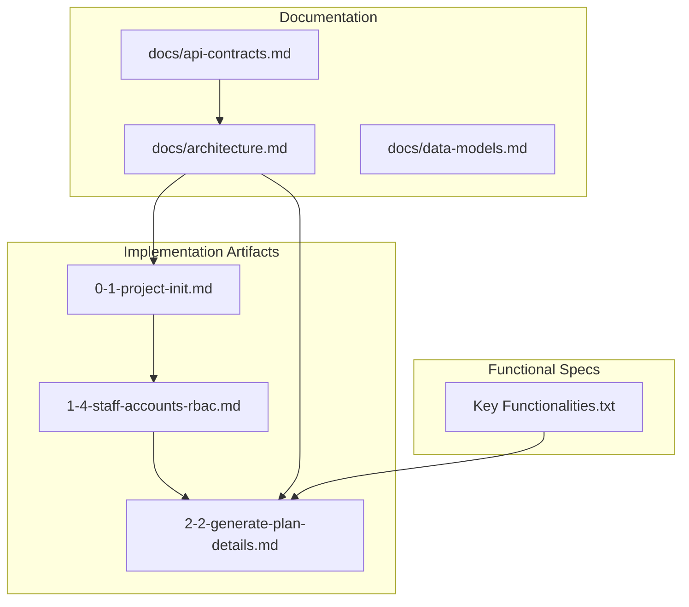
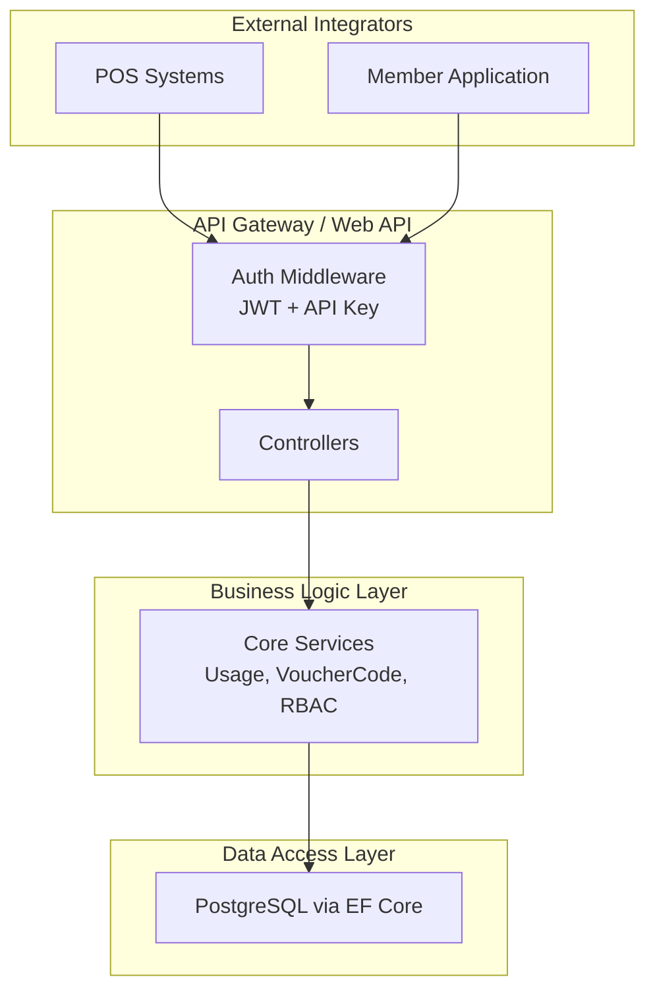
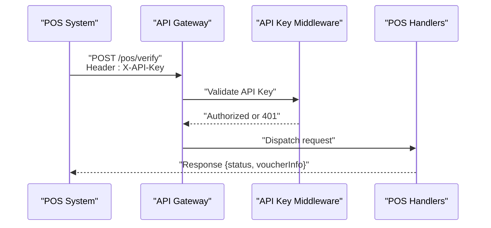
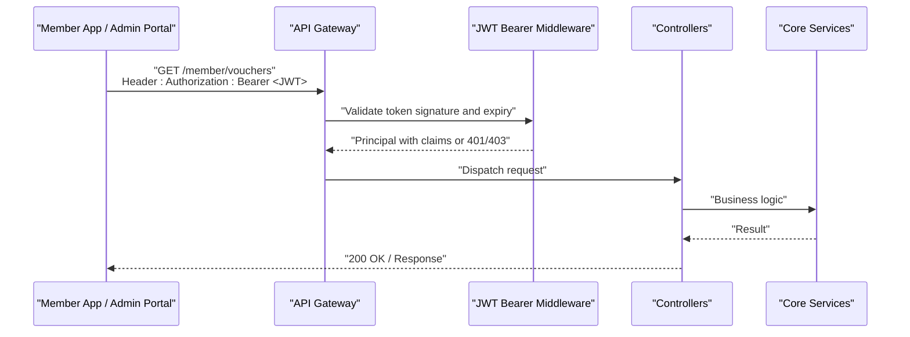
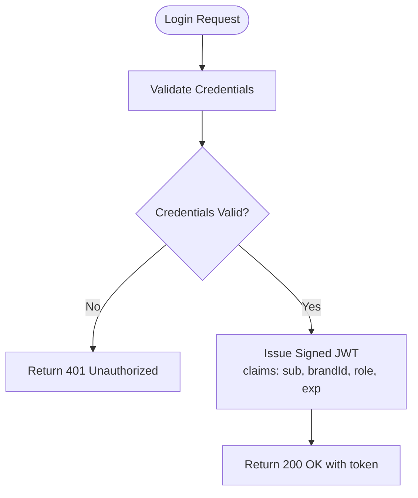
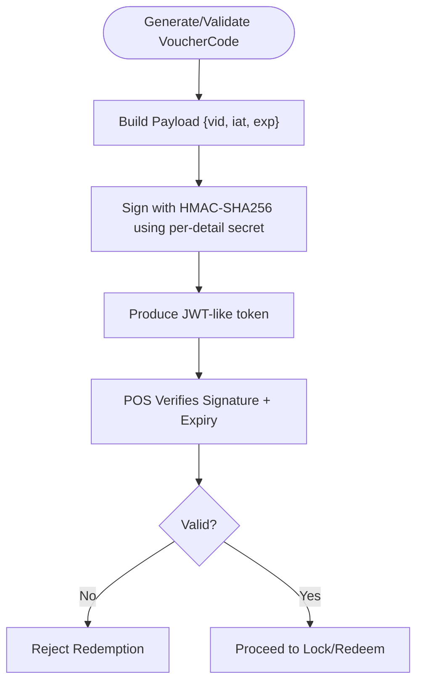
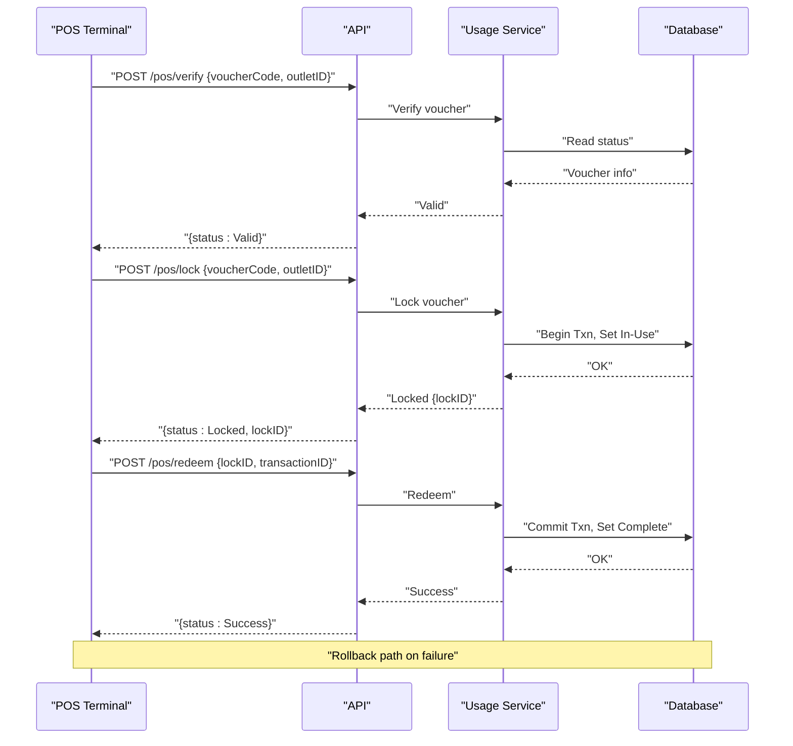
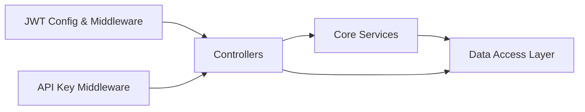

# Authentication and Security

<cite>
**Referenced Files in This Document**
- [api-contracts.md](file://docs/api-contracts.md)
- [architecture.md](file://docs/architecture.md)
- [data-models.md](file://docs/data-models.md)
- [0-1-project-init.md](file://_bmad-output/implementation-artifacts/0-1-project-init.md)
- [1-4-staff-accounts-rbac.md](file://_bmad-output/implementation-artifacts/1-4-staff-accounts-rbac.md)
- [2-2-generate-plan-details.md](file://_bmad-output/implementation-artifacts/2-2-generate-plan-details.md)
- [Key Functionalities.txt](file://Key Functionalities.txt)
</cite>

## Table of Contents
1. [Introduction](#introduction)
2. [Project Structure](#project-structure)
3. [Core Components](#core-components)
4. [Architecture Overview](#architecture-overview)
5. [Detailed Component Analysis](#detailed-component-analysis)
6. [Dependency Analysis](#dependency-analysis)
7. [Performance Considerations](#performance-considerations)
8. [Troubleshooting Guide](#troubleshooting-guide)
9. [Conclusion](#conclusion)
10. [Appendices](#appendices)

## Introduction
This document explains the NonCash API’s authentication and security mechanisms with a focus on the dual authentication system:
- API Key authentication for POS systems (via the X-API-Key header)
- JWT Bearer token authentication for member applications and administrative access

It also documents token generation and validation, expiration handling, dynamic voucher code generation, transaction security, and protection against double-spending. Guidance is included for CORS configuration, HTTPS requirements, rate limiting, monitoring, troubleshooting, and security audits.

## Project Structure
The repository organizes security-relevant information across documentation and planning artifacts:
- API contracts define endpoints, authentication headers, and request/response shapes
- Architecture documentation describes the 3-layer SaaS design and security posture
- Implementation artifacts specify JWT configuration, RBAC, and dynamic voucher code generation
- Data models define entities and fields related to security-sensitive data

**Diagram sources**
- [api-contracts.md](file://docs/api-contracts.md)
- [architecture.md](file://docs/architecture.md)
- [0-1-project-init.md](file://_bmad-output/implementation-artifacts/0-1-project-init.md)
- [1-4-staff-accounts-rbac.md](file://_bmad-output/implementation-artifacts/1-4-staff-accounts-rbac.md)
- [2-2-generate-plan-details.md](file://_bmad-output/implementation-artifacts/2-2-generate-plan-details.md)
- [Key Functionalities.txt](file://Key Functionalities.txt)

**Section sources**
- [api-contracts.md](file://docs/api-contracts.md)
- [architecture.md](file://docs/architecture.md)
- [0-1-project-init.md](file://_bmad-output/implementation-artifacts/0-1-project-init.md)
- [1-4-staff-accounts-rbac.md](file://_bmad-output/implementation-artifacts/1-4-staff-accounts-rbac.md)
- [2-2-generate-plan-details.md](file://_bmad-output/implementation-artifacts/2-2-generate-plan-details.md)
- [Key Functionalities.txt](file://Key Functionalities.txt)

## Core Components
- Dual authentication:
  - POS systems authenticate with X-API-Key header
  - Member apps and admin endpoints use Authorization: Bearer <JWT>
- JWT configuration and claims:
  - Issuer, Audience, and Key are configured in appsettings
  - Tokens carry subject, brandId, role, and expiration
- Dynamic voucher code:
  - VoucherCode is a time-rotating, JWT-like token with signature and expiry
  - POS verifies signature and expiry; Member App fetches current code on demand
- Transaction security model:
  - POS workflow: Verify -> Lock -> Redeem or Rollback
  - Lock prevents double-spending; Redeem commits; Rollback releases lock

**Section sources**
- [api-contracts.md](file://docs/api-contracts.md)
- [architecture.md](file://docs/architecture.md)
- [0-1-project-init.md](file://_bmad-output/implementation-artifacts/0-1-project-init.md)
- [1-4-staff-accounts-rbac.md](file://_bmad-output/implementation-artifacts/1-4-staff-accounts-rbac.md)
- [2-2-generate-plan-details.md](file://_bmad-output/implementation-artifacts/2-2-generate-plan-details.md)

## Architecture Overview
The NonCash platform follows a 3-layer SaaS architecture with JWT-based authentication and specialized logic for dynamic voucher code generation. Security spans identity and tenant isolation, POS integration via API Keys, and transactional integrity for voucher usage.

**Diagram sources**
- [architecture.md](file://docs/architecture.md)
- [0-1-project-init.md](file://_bmad-output/implementation-artifacts/0-1-project-init.md)
- [1-4-staff-accounts-rbac.md](file://_bmad-output/implementation-artifacts/1-4-staff-accounts-rbac.md)
- [2-2-generate-plan-details.md](file://_bmad-output/implementation-artifacts/2-2-generate-plan-details.md)

## Detailed Component Analysis

### POS Authentication: API Key (X-API-Key)
- Purpose: Secure access to POS endpoints (/pos/verify, /pos/lock, /pos/redeem, /pos/rollback)
- Configuration: API Key middleware placeholder exists in API project
- Scope: POS systems are authenticated via API Keys and locked to specific ranges defined in planning phase

**Diagram sources**
- [api-contracts.md](file://docs/api-contracts.md)
- [0-1-project-init.md](file://_bmad-output/implementation-artifacts/0-1-project-init.md)

**Section sources**
- [api-contracts.md](file://docs/api-contracts.md)
- [0-1-project-init.md](file://_bmad-output/implementation-artifacts/0-1-project-init.md)

### JWT Authentication: Bearer Token
- Purpose: Authenticate member apps and administrative endpoints
- Configuration: JWT issuer, audience, and key configured in appsettings; minimum 32-character secret key stored in environment variables
- Claims: sub (UserID), brandId, role, exp
- RBAC enforcement: Controllers use Authorize attributes; BrandID from JWT scopes tenant access

**Diagram sources**
- [1-4-staff-accounts-rbac.md](file://_bmad-output/implementation-artifacts/1-4-staff-accounts-rbac.md)
- [0-1-project-init.md](file://_bmad-output/implementation-artifacts/0-1-project-init.md)

**Section sources**
- [1-4-staff-accounts-rbac.md](file://_bmad-output/implementation-artifacts/1-4-staff-accounts-rbac.md)
- [0-1-project-init.md](file://_bmad-output/implementation-artifacts/0-1-project-init.md)

### Token Generation and Validation
- JWT generation: Login endpoint issues signed JWT with required claims and expiry
- Validation: Middleware verifies signature and expiry; enforce role-based authorization
- Secret management: JWT key must be at least 32 characters and stored in environment variables

**Diagram sources**
- [1-4-staff-accounts-rbac.md](file://_bmad-output/implementation-artifacts/1-4-staff-accounts-rbac.md)

**Section sources**
- [1-4-staff-accounts-rbac.md](file://_bmad-output/implementation-artifacts/1-4-staff-accounts-rbac.md)

### Dynamic Voucher Code Generation and Validation
- VoucherCode is a time-rotating, JWT-like token with signature and expiry
- POS verifies signature and expiry; Member App fetches current code on demand
- Token payload includes voucher detail identifier, issued-at, and expiry
- Signing key is per-detail secret (or platform secret plus salt); never expose secrets in responses

**Diagram sources**
- [2-2-generate-plan-details.md](file://_bmad-output/implementation-artifacts/2-2-generate-plan-details.md)
- [data-models.md](file://docs/data-models.md)

**Section sources**
- [2-2-generate-plan-details.md](file://_bmad-output/implementation-artifacts/2-2-generate-plan-details.md)
- [data-models.md](file://docs/data-models.md)

### Transaction Security Model and Double-Spending Prevention
- POS workflow:
  - Verify: checks validity and availability
  - Lock: sets voucher to In-Use to prevent double-spending
  - Redeem: finalizes usage after successful transaction
  - Rollback: releases lock on failure or cancellation
- Transaction boundaries: backend orchestrates begin/commit/rollback to ensure atomicity

**Diagram sources**
- [api-contracts.md](file://docs/api-contracts.md)
- [Key Functionalities.txt](file://Key Functionalities.txt)

**Section sources**
- [api-contracts.md](file://docs/api-contracts.md)
- [Key Functionalities.txt](file://Key Functionalities.txt)

### CORS, HTTPS, Rate Limiting, and Monitoring
- HTTPS: All endpoints operate over HTTPS; base URL is https://api.noncash.service/v1
- CORS: Configure per environment; ensure only trusted origins are allowed for browser clients
- Rate limiting: Enforce per-IP and per-API Key quotas; apply stricter limits for POS endpoints
- Monitoring: Track authentication failures, token expiry events, POS lock/release anomalies, and high-frequency redemption attempts

[No sources needed since this section provides general guidance]

## Dependency Analysis
The authentication stack depends on:
- JWT configuration and middleware for bearer tokens
- API Key middleware for POS endpoints
- Core services for dynamic voucher code generation and validation
- Data layer for tenant scoping and audit trails

**Diagram sources**
- [0-1-project-init.md](file://_bmad-output/implementation-artifacts/0-1-project-init.md)
- [1-4-staff-accounts-rbac.md](file://_bmad-output/implementation-artifacts/1-4-staff-accounts-rbac.md)
- [2-2-generate-plan-details.md](file://_bmad-output/implementation-artifacts/2-2-generate-plan-details.md)

**Section sources**
- [0-1-project-init.md](file://_bmad-output/implementation-artifacts/0-1-project-init.md)
- [1-4-staff-accounts-rbac.md](file://_bmad-output/implementation-artifacts/1-4-staff-accounts-rbac.md)
- [2-2-generate-plan-details.md](file://_bmad-output/implementation-artifacts/2-2-generate-plan-details.md)

## Performance Considerations
- Prefer short token lifetimes for JWTs and dynamic voucher codes to minimize exposure windows
- Cache validated POS locks judiciously with strict TTLs
- Use asynchronous processing for non-blocking operations; keep authentication checks fast
- Monitor latency for authentication endpoints and alert on spikes

[No sources needed since this section provides general guidance]

## Troubleshooting Guide
Common issues and resolutions:
- 401 Unauthorized (JWT):
  - Verify issuer, audience, and key configuration
  - Confirm token was signed with the correct secret
  - Ensure client stores tokens securely and resends Authorization header
- 403 Forbidden (RBAC):
  - Confirm user role and BrandID in JWT align with requested resource
  - Ensure BrandID from JWT overrides any request-body BrandID
- 401 Unauthorized (API Key):
  - Confirm X-API-Key header is present and matches configured key
  - Verify key scope and range alignment with plan configuration
- Voucher validation failures:
  - Confirm dynamic code signature and expiry
  - Ensure Member App fetches fresh code before POS verification
- Double-spending prevention:
  - Ensure Lock succeeds before attempting Redeem
  - Use Rollback on transaction failure

**Section sources**
- [1-4-staff-accounts-rbac.md](file://_bmad-output/implementation-artifacts/1-4-staff-accounts-rbac.md)
- [2-2-generate-plan-details.md](file://_bmad-output/implementation-artifacts/2-2-generate-plan-details.md)
- [api-contracts.md](file://docs/api-contracts.md)

## Conclusion
NonCash employs a robust dual authentication system: API Keys for POS and JWT for member/admin access. Dynamic voucher code generation and a strict POS transaction workflow protect against double-spending and fraud. Adhering to HTTPS, CORS hardening, rate limiting, and continuous monitoring ensures a secure operational environment.

[No sources needed since this section summarizes without analyzing specific files]

## Appendices

### Best Practices for Secure API Consumption
- Store JWTs securely (e.g., httpOnly cookies or secure storage) and avoid logging tokens
- Rotate JWT secrets regularly and enforce environment-variable-only storage
- Use short-lived tokens and implement refresh strategies where appropriate
- Validate all inputs and enforce strict RBAC and tenant scoping
- Log and alert on authentication anomalies without exposing sensitive data

[No sources needed since this section provides general guidance]