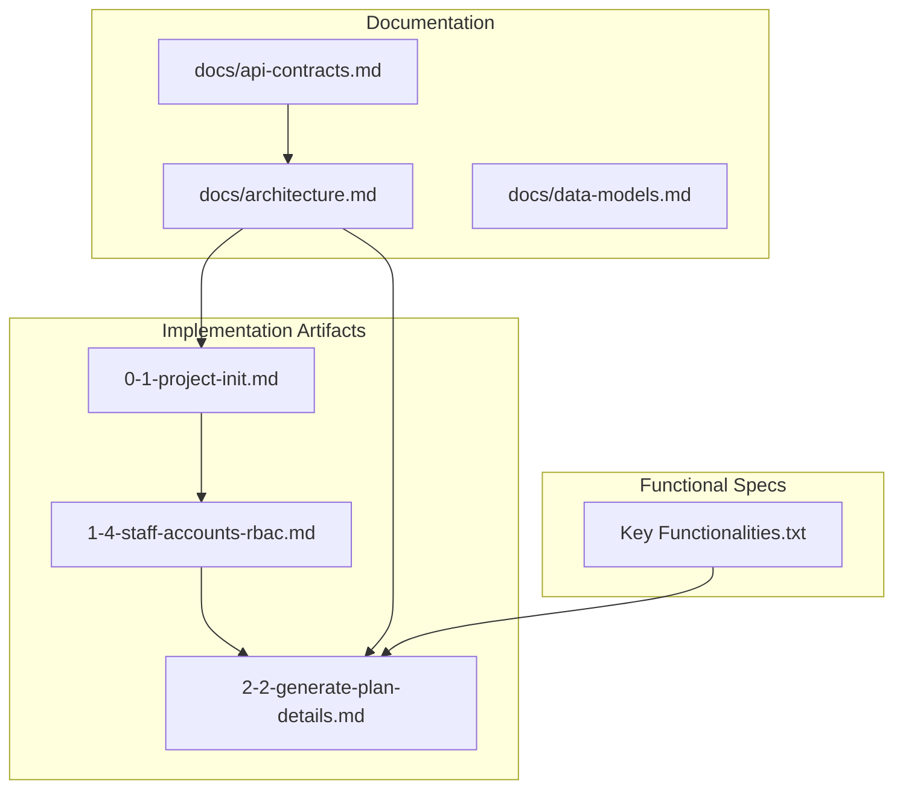
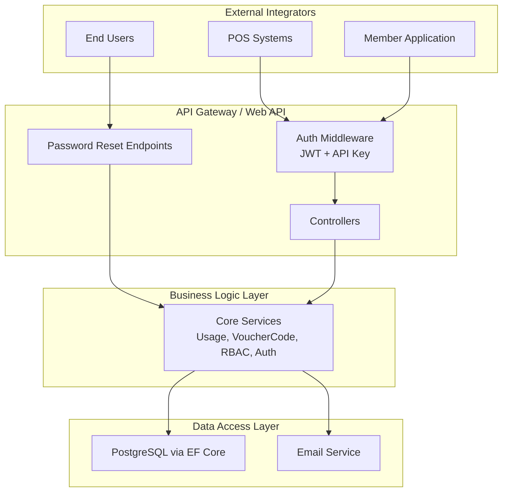
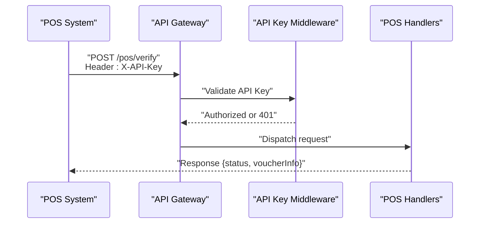
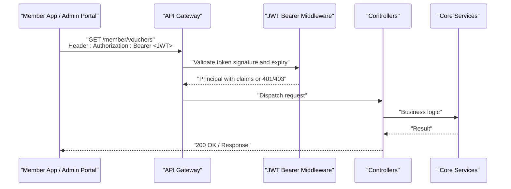
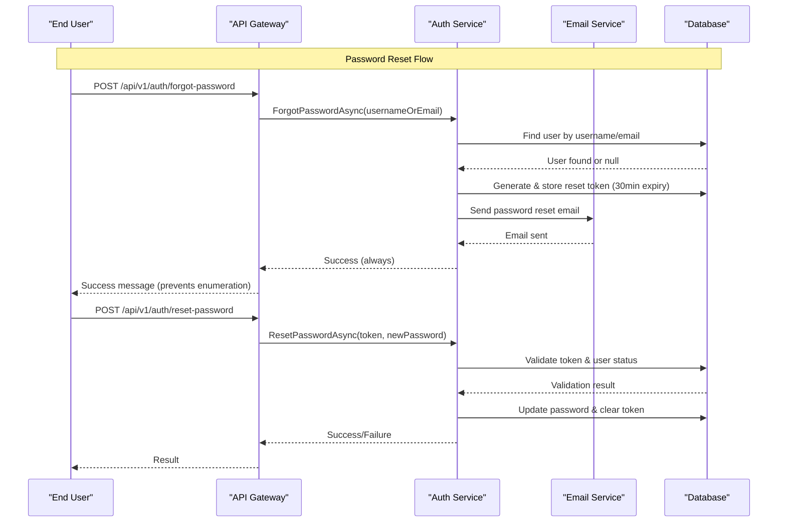
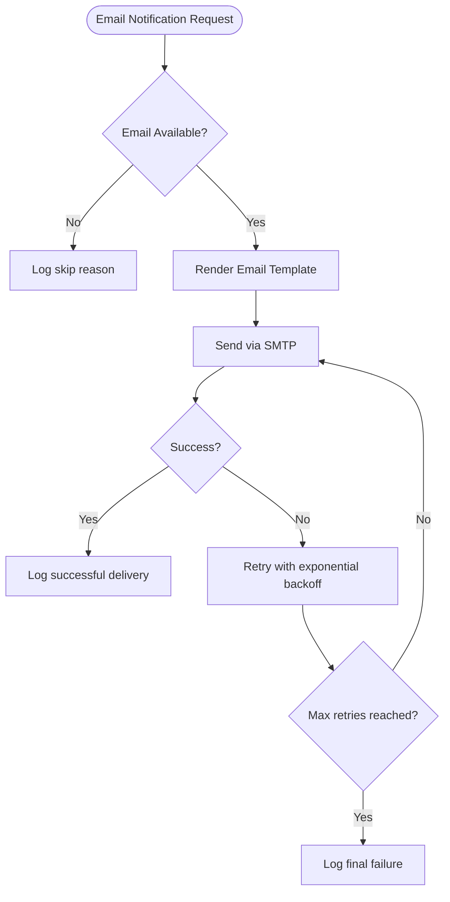
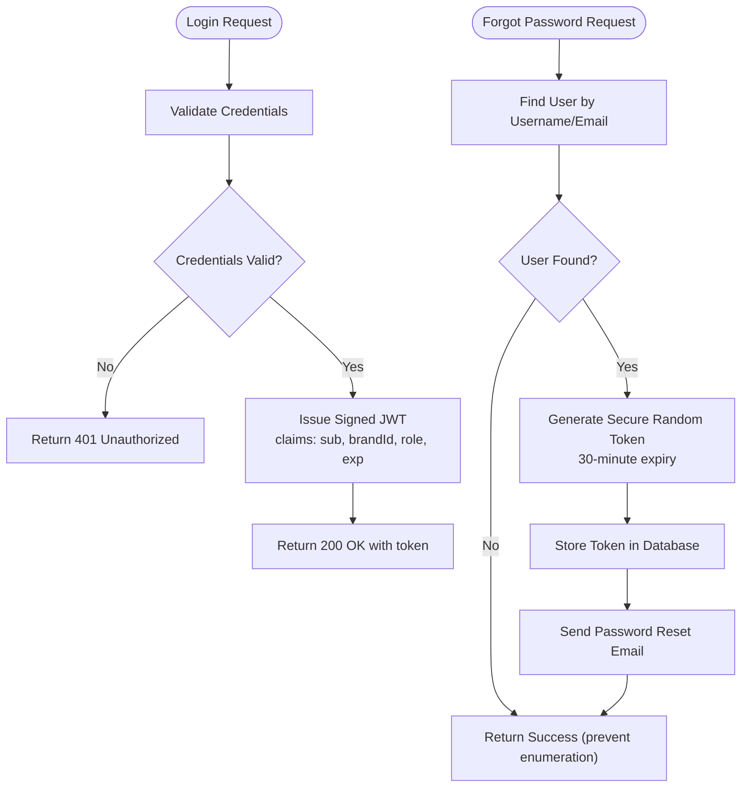
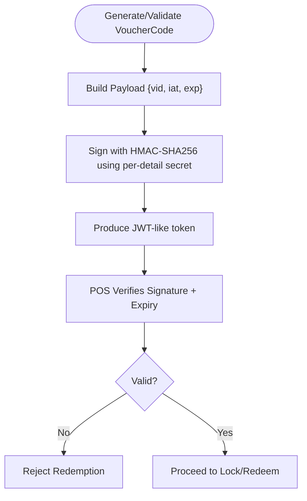
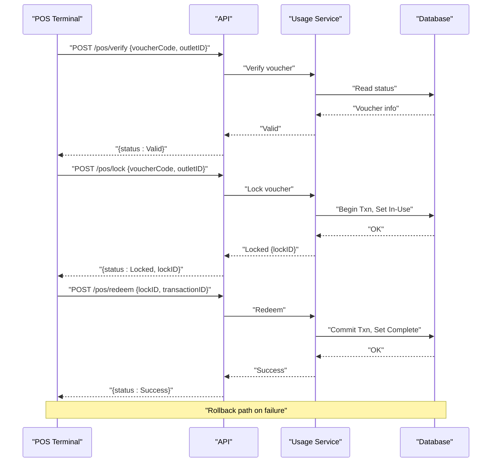
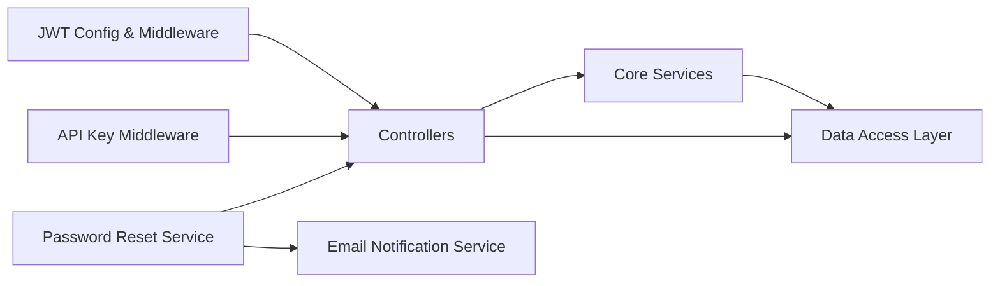

# Authentication and Security

<cite>
**Referenced Files in This Document**
- [api-contracts.md](file://docs/api-contracts.md)
- [architecture.md](file://docs/architecture.md)
- [data-models.md](file://docs/data-models.md)
- [0-1-project-init.md](file://_bmad-output/implementation-artifacts/0-1-project-init.md)
- [1-4-staff-accounts-rbac.md](file://_bmad-output/implementation-artifacts/1-4-staff-accounts-rbac.md)
- [2-2-generate-plan-details.md](file://_bmad-output/implementation-artifacts/2-2-generate-plan-details.md)
- [Key Functionalities.txt](file://Key Functionalities.txt)
- [AuthController.cs](file://src/NonCash.API/Controllers/AuthController.cs)
- [AuthService.cs](file://src/NonCash.Core/Services/AuthService.cs)
- [UserAccount.cs](file://src/NonCash.Core/Entities/UserAccount.cs)
- [EmailNotificationService.cs](file://src/NonCash.Infrastructure/Services/EmailNotificationService.cs)
- [PasswordReset.html](file://src/NonCash.Infrastructure/EmailTemplates/PasswordReset.html)
- [StaffAccountCreated.html](file://src/NonCash.Infrastructure/EmailTemplates/StaffAccountCreated.html)
- [VoucherTransferInitiated.html](file://src/NonCash.Infrastructure/EmailTemplates/VoucherTransferInitiated.html)
- [INotificationService.cs](file://src/NonCash.Core/Interfaces/INotificationService.cs)
- [AuthDtos.cs](file://src/NonCash.API/DTOs/AuthDtos.cs)
</cite>

## Update Summary
**Changes Made**
- Added comprehensive password reset functionality with forgot-password and reset-password API endpoints
- Implemented secure token generation with 30-minute expiration for password reset tokens
- Enhanced authentication security measures including user enumeration prevention
- Added email notification system for password reset requests with dedicated template
- Updated authentication flow diagrams to include password reset workflow
- Enhanced email notification system with three new templates (PasswordReset.html, StaffAccountCreated.html, VoucherTransferInitiated.html) and corresponding notification methods

## Table of Contents
1. [Introduction](#introduction)
2. [Project Structure](#project-structure)
3. [Core Components](#core-components)
4. [Architecture Overview](#architecture-overview)
5. [Detailed Component Analysis](#detailed-component-analysis)
6. [Dependency Analysis](#dependency-analysis)
7. [Performance Considerations](#performance-considerations)
8. [Troubleshooting Guide](#troubleshooting-guide)
9. [Conclusion](#conclusion)
10. [Appendices](#appendices)

## Introduction
This document explains the NonCash API's authentication and security mechanisms with a focus on the dual authentication system:
- API Key authentication for POS systems (via the X-API-Key header)
- JWT Bearer token authentication for member applications and administrative access
- **New**: Comprehensive password reset functionality with secure token management and email-based recovery

It also documents token generation and validation, expiration handling, dynamic voucher code generation, transaction security, and protection against double-spending. Guidance is included for CORS configuration, HTTPS requirements, rate limiting, monitoring, troubleshooting, and security audits.

## Project Structure
The repository organizes security-relevant information across documentation and planning artifacts:
- API contracts define endpoints, authentication headers, and request/response shapes
- Architecture documentation describes the 3-layer SaaS design and security posture
- Implementation artifacts specify JWT configuration, RBAC, and dynamic voucher code generation
- Data models define entities and fields related to security-sensitive data

```mermaid
graph TB
subgraph "Documentation"
A["docs/api-contracts.md"]
B["docs/architecture.md"]
C["docs/data-models.md"]
end
subgraph "Implementation Artifacts"
D["0-1-project-init.md"]
E["1-4-staff-accounts-rbac.md"]
F["2-2-generate-plan-details.md"]
end
subgraph "Functional Specs"
G["Key Functionalities.txt"]
end
A --> B
B --> D
D --> E
E --> F
B --> F
G --> F
```

**Diagram sources**
- [api-contracts.md](file://docs/api-contracts.md)
- [architecture.md](file://docs/architecture.md)
- [0-1-project-init.md](file://_bmad-output/implementation-artifacts/0-1-project-init.md)
- [1-4-staff-accounts-rbac.md](file://_bmad-output/implementation-artifacts/1-4-staff-accounts-rbac.md)
- [2-2-generate-plan-details.md](file://_bmad-output/implementation-artifacts/2-2-generate-plan-details.md)
- [Key Functionalities.txt](file://Key Functionalities.txt)

**Section sources**
- [api-contracts.md](file://docs/api-contracts.md)
- [architecture.md](file://docs/architecture.md)
- [0-1-project-init.md](file://_bmad-output/implementation-artifacts/0-1-project-init.md)
- [1-4-staff-accounts-rbac.md](file://_bmad-output/implementation-artifacts/1-4-staff-accounts-rbac.md)
- [2-2-generate-plan-details.md](file://_bmad-output/implementation-artifacts/2-2-generate-plan-details.md)
- [Key Functionalities.txt](file://Key Functionalities.txt)

## Core Components
- Dual authentication:
  - POS systems authenticate with X-API-Key header
  - Member apps and admin endpoints use Authorization: Bearer <JWT>
- **New**: Password reset functionality:
  - Secure token generation with 30-minute expiration
  - Email-based password reset workflow
  - User enumeration prevention
- JWT configuration and claims:
  - Issuer, Audience, and Key are configured in appsettings
  - Tokens carry subject, brandId, role, and expiration
- Dynamic voucher code:
  - VoucherCode is a time-rotating, JWT-like token with signature and expiry
  - POS verifies signature and expiry; Member App fetches current code on demand
- Transaction security model:
  - POS workflow: Verify -> Lock -> Redeem or Rollback
  - Lock prevents double-spending; Redeem commits; Rollback releases lock

**Section sources**
- [api-contracts.md](file://docs/api-contracts.md)
- [architecture.md](file://docs/architecture.md)
- [0-1-project-init.md](file://_bmad-output/implementation-artifacts/0-1-project-init.md)
- [1-4-staff-accounts-rbac.md](file://_bmad-output/implementation-artifacts/1-4-staff-accounts-rbac.md)
- [2-2-generate-plan-details.md](file://_bmad-output/implementation-artifacts/2-2-generate-plan-details.md)

## Architecture Overview
The NonCash platform follows a 3-layer SaaS architecture with JWT-based authentication and specialized logic for dynamic voucher code generation. Security spans identity and tenant isolation, POS integration via API Keys, password reset functionality, and transactional integrity for voucher usage.

```mermaid
graph TB
subgraph "External Integrators"
POS["POS Systems"]
MemberApp["Member Application"]
Users["End Users"]
end
subgraph "API Gateway / Web API"
Auth["Auth Middleware<br/>JWT + API Key"]
Handlers["Controllers"]
PasswordReset["Password Reset Endpoints"]
end
subgraph "Business Logic Layer"
Services["Core Services<br/>Usage, VoucherCode, RBAC, Auth"]
end
subgraph "Data Access Layer"
DB["PostgreSQL via EF Core"]
Email["Email Service"]
end
POS --> Auth
MemberApp --> Auth
Users --> PasswordReset
Auth --> Handlers
PasswordReset --> Services
Handlers --> Services
Services --> DB
Services --> Email
```

**Diagram sources**
- [architecture.md](file://docs/architecture.md)
- [0-1-project-init.md](file://_bmad-output/implementation-artifacts/0-1-project-init.md)
- [1-4-staff-accounts-rbac.md](file://_bmad-output/implementation-artifacts/1-4-staff-accounts-rbac.md)
- [2-2-generate-plan-details.md](file://_bmad-output/implementation-artifacts/2-2-generate-plan-details.md)

## Detailed Component Analysis

### POS Authentication: API Key (X-API-Key)
- Purpose: Secure access to POS endpoints (/pos/verify, /pos/lock, /pos/redeem, /pos/rollback)
- Configuration: API Key middleware placeholder exists in API project
- Scope: POS systems are authenticated via API Keys and locked to specific ranges defined in planning phase

```mermaid
sequenceDiagram
participant POS as "POS System"
participant API as "API Gateway"
participant Auth as "API Key Middleware"
participant Handler as "POS Handlers"
POS->>API : "POST /pos/verify"<br/>Header : X-API-Key
API->>Auth : "Validate API Key"
Auth-->>API : "Authorized or 401"
API->>Handler : "Dispatch request"
Handler-->>POS : "Response {status, voucherInfo}"
```

**Diagram sources**
- [api-contracts.md](file://docs/api-contracts.md)
- [0-1-project-init.md](file://_bmad-output/implementation-artifacts/0-1-project-init.md)

**Section sources**
- [api-contracts.md](file://docs/api-contracts.md)
- [0-1-project-init.md](file://_bmad-output/implementation-artifacts/0-1-project-init.md)

### JWT Authentication: Bearer Token
- Purpose: Authenticate member apps and administrative endpoints
- Configuration: JWT issuer, audience, and key configured in appsettings; minimum 32-character secret key stored in environment variables
- Claims: sub (UserID), brandId, role, exp
- RBAC enforcement: Controllers use Authorize attributes; BrandID from JWT scopes tenant access

```mermaid
sequenceDiagram
participant Client as "Member App / Admin Portal"
participant API as "API Gateway"
participant Auth as "JWT Bearer Middleware"
participant Handler as "Controllers"
participant Service as "Core Services"
Client->>API : "GET /member/vouchers"<br/>Header : Authorization : Bearer <JWT>
API->>Auth : "Validate token signature and expiry"
Auth-->>API : "Principal with claims or 401/403"
API->>Handler : "Dispatch request"
Handler->>Service : "Business logic"
Service-->>Handler : "Result"
Handler-->>Client : "200 OK / Response"
```

**Diagram sources**
- [1-4-staff-accounts-rbac.md](file://_bmad-output/implementation-artifacts/1-4-staff-accounts-rbac.md)
- [0-1-project-init.md](file://_bmad-output/implementation-artifacts/0-1-project-init.md)

**Section sources**
- [1-4-staff-accounts-rbac.md](file://_bmad-output/implementation-artifacts/1-4-staff-accounts-rbac.md)
- [0-1-project-init.md](file://_bmad-output/implementation-artifacts/0-1-project-init.md)

### Password Reset Functionality
**New Feature**: Comprehensive password reset system with secure token management

#### Forgot Password Endpoint
- **Endpoint**: `POST /api/v1/auth/forgot-password`
- **Purpose**: Initiate password reset process by sending reset token to user's email
- **Security**: Always returns success response to prevent user enumeration attacks
- **Token Generation**: Secure random 32-byte token with Base64 encoding
- **Expiration**: 30-minute token lifetime for enhanced security

#### Reset Password Endpoint
- **Endpoint**: `POST /api/v1/auth/reset-password`
- **Purpose**: Complete password reset using the received token
- **Validation**: Validates token existence, expiry, and new password strength
- **Security**: Clears reset token after successful password change

```mermaid
sequenceDiagram
participant User as "End User"
participant API as "API Gateway"
participant AuthService as "Auth Service"
participant Email as "Email Service"
participant DB as "Database"
Note over User,DB : Password Reset Flow
User->>API : POST /api/v1/auth/forgot-password
API->>AuthService : ForgotPasswordAsync(usernameOrEmail)
AuthService->>DB : Find user by username/email
DB-->>AuthService : User found or null
AuthService->>DB : Generate & store reset token (30min expiry)
AuthService->>Email : Send password reset email
Email-->>AuthService : Email sent
AuthService-->>API : Success (always)
API-->>User : Success message (prevents enumeration)
User->>API : POST /api/v1/auth/reset-password
API->>AuthService : ResetPasswordAsync(token, newPassword)
AuthService->>DB : Validate token & user status
DB-->>AuthService : Validation result
AuthService->>DB : Update password & clear token
AuthService-->>API : Success/Failure
API-->>User : Result
```

**Diagram sources**
- [AuthController.cs:67-86](file://src/NonCash.API/Controllers/AuthController.cs#L67-L86)
- [AuthService.cs:93-170](file://src/NonCash.Core/Services/AuthService.cs#L93-L170)
- [EmailNotificationService.cs:367-384](file://src/NonCash.Infrastructure/Services/EmailNotificationService.cs#L367-L384)

**Section sources**
- [AuthController.cs:67-86](file://src/NonCash.API/Controllers/AuthController.cs#L67-L86)
- [AuthService.cs:93-170](file://src/NonCash.Core/Services/AuthService.cs#L93-L170)
- [EmailNotificationService.cs:367-384](file://src/NonCash.Infrastructure/Services/EmailNotificationService.cs#L367-L384)

### Enhanced Email Notification System
**New Feature**: Comprehensive email notification system with multiple templates

#### Password Reset Email Template
- **Template**: `PasswordReset.html`
- **Purpose**: Sends password reset instructions with secure token
- **Content**: Includes personalized greeting, reset token display, and expiration details
- **Security**: Token displayed prominently with clear expiration warning

#### Staff Account Created Email Template
- **Template**: `StaffAccountCreated.html`
- **Purpose**: Notifies staff users when their accounts are created by administrators
- **Content**: Displays username, role, and brand information
- **Workflow**: Triggers when new staff accounts are provisioned

#### Voucher Transfer Initiated Email Template
- **Template**: `VoucherTransferInitiated.html`
- **Purpose**: Notifies recipients when vouchers are transferred to them
- **Content**: Shows recipient name, sender name, voucher count, and transfer timestamp
- **Integration**: Works with voucher transfer service for seamless notifications

```mermaid
flowchart TD
Start(["Email Notification Request"]) --> CheckEmail{"Email Available?"}
CheckEmail --> |No| LogSkip["Log skip reason"]
CheckEmail --> |Yes| RenderTemplate["Render Email Template"]
RenderTemplate --> SendEmail["Send via SMTP"]
SendEmail --> Success{"Success?"}
Success --> |Yes| LogSuccess["Log successful delivery"]
Success --> |No| Retry["Retry with exponential backoff"]
Retry --> MaxRetries{"Max retries reached?"}
MaxRetries --> |No| SendEmail
MaxRetries --> |Yes| LogFailure["Log final failure"]
```

**Diagram sources**
- [EmailNotificationService.cs:327-384](file://src/NonCash.Infrastructure/Services/EmailNotificationService.cs#L327-L384)
- [PasswordReset.html:1-25](file://src/NonCash.Infrastructure/EmailTemplates/PasswordReset.html#L1-L25)
- [StaffAccountCreated.html:1-26](file://src/NonCash.Infrastructure/EmailTemplates/StaffAccountCreated.html#L1-L26)
- [VoucherTransferInitiated.html:1-22](file://src/NonCash.Infrastructure/EmailTemplates/VoucherTransferInitiated.html#L1-L22)

**Section sources**
- [EmailNotificationService.cs:327-384](file://src/NonCash.Infrastructure/Services/EmailNotificationService.cs#L327-L384)
- [PasswordReset.html:1-25](file://src/NonCash.Infrastructure/EmailTemplates/PasswordReset.html#L1-L25)
- [StaffAccountCreated.html:1-26](file://src/NonCash.Infrastructure/EmailTemplates/StaffAccountCreated.html#L1-L26)
- [VoucherTransferInitiated.html:1-22](file://src/NonCash.Infrastructure/EmailTemplates/VoucherTransferInitiated.html#L1-L22)

### Token Generation and Validation
- JWT generation: Login endpoint issues signed JWT with required claims and expiry
- Validation: Middleware verifies signature and expiry; enforce role-based authorization
- Secret management: JWT key must be at least 32 characters and stored in environment variables
- **New**: Password reset token generation:
  - Uses cryptographically secure random number generator
  - 30-minute expiration for enhanced security
  - Stored securely in database with expiry timestamp

```mermaid
flowchart TD
Start(["Login Request"]) --> Validate["Validate Credentials"]
Validate --> Valid{"Credentials Valid?"}
Valid --> |No| Return401["Return 401 Unauthorized"]
Valid --> |Yes| IssueJWT["Issue Signed JWT<br/>claims: sub, brandId, role, exp"]
IssueJWT --> Return200["Return 200 OK with token"]
Start2(["Forgot Password Request"]) --> FindUser["Find User by Username/Email"]
FindUser --> UserFound{"User Found?"}
UserFound --> |No| ReturnSuccess["Return Success (prevent enumeration)"]
UserFound --> |Yes| GenerateToken["Generate Secure Random Token<br/>30-minute expiry"]
GenerateToken --> StoreToken["Store Token in Database"]
StoreToken --> SendEmail["Send Password Reset Email"]
SendEmail --> ReturnSuccess
```

**Diagram sources**
- [1-4-staff-accounts-rbac.md](file://_bmad-output/implementation-artifacts/1-4-staff-accounts-rbac.md)
- [AuthService.cs:93-170](file://src/NonCash.Core/Services/AuthService.cs#L93-L170)

**Section sources**
- [1-4-staff-accounts-rbac.md](file://_bmad-output/implementation-artifacts/1-4-staff-accounts-rbac.md)
- [AuthService.cs:93-170](file://src/NonCash.Core/Services/AuthService.cs#L93-L170)

### Dynamic Voucher Code Generation and Validation
- VoucherCode is a time-rotating, JWT-like token with signature and expiry
- POS verifies signature and expiry; Member App fetches current code on demand
- Token payload includes voucher detail identifier, issued-at, and expiry
- Signing key is per-detail secret (or platform secret plus salt); never expose secrets in responses

```mermaid
flowchart TD
GenStart(["Generate/Validate VoucherCode"]) --> Payload["Build Payload {vid, iat, exp}"]
Payload --> Sign["Sign with HMAC-SHA256 using per-detail secret"]
Sign --> Token["Produce JWT-like token"]
Token --> POSVerify["POS Verifies Signature + Expiry"]
POSVerify --> Valid{"Valid?"}
Valid --> |No| Reject["Reject Redemption"]
Valid --> |Yes| Proceed["Proceed to Lock/Redeem"]
```

**Diagram sources**
- [2-2-generate-plan-details.md](file://_bmad-output/implementation-artifacts/2-2-generate-plan-details.md)
- [data-models.md](file://docs/data-models.md)

**Section sources**
- [2-2-generate-plan-details.md](file://_bmad-output/implementation-artifacts/2-2-generate-plan-details.md)
- [data-models.md](file://docs/data-models.md)

### Transaction Security Model and Double-Spending Prevention
- POS workflow:
  - Verify: checks validity and availability
  - Lock: sets voucher to In-Use to prevent double-spending
  - Redeem: finalizes usage after successful transaction
  - Rollback: releases lock on failure or cancellation
- Transaction boundaries: backend orchestrates begin/commit/rollback to ensure atomicity

```mermaid
sequenceDiagram
participant POS as "POS Terminal"
participant API as "API"
participant UsageSvc as "Usage Service"
participant DB as "Database"
POS->>API : "POST /pos/verify {voucherCode, outletID}"
API->>UsageSvc : "Verify voucher"
UsageSvc->>DB : "Read status"
DB-->>UsageSvc : "Voucher info"
UsageSvc-->>API : "Valid"
API-->>POS : "{status : Valid}"
POS->>API : "POST /pos/lock {voucherCode, outletID}"
API->>UsageSvc : "Lock voucher"
UsageSvc->>DB : "Begin Txn, Set In-Use"
DB-->>UsageSvc : "OK"
UsageSvc-->>API : "Locked {lockID}"
API-->>POS : "{status : Locked, lockID}"
POS->>API : "POST /pos/redeem {lockID, transactionID}"
API->>UsageSvc : "Redeem"
UsageSvc->>DB : "Commit Txn, Set Complete"
DB-->>UsageSvc : "OK"
UsageSvc-->>API : "Success"
API-->>POS : "{status : Success}"
Note over POS,DB : "Rollback path on failure"
```

**Diagram sources**
- [api-contracts.md](file://docs/api-contracts.md)
- [Key Functionalities.txt](file://Key Functionalities.txt)

**Section sources**
- [api-contracts.md](file://docs/api-contracts.md)
- [Key Functionalities.txt](file://Key Functionalities.txt)

### CORS, HTTPS, Rate Limiting, and Monitoring
- HTTPS: All endpoints operate over HTTPS; base URL is https://api.noncash.service/v1
- CORS: Configure per environment; ensure only trusted origins are allowed for browser clients
- Rate limiting: Enforce per-IP and per-API Key quotas; apply stricter limits for POS endpoints
- Monitoring: Track authentication failures, token expiry events, POS lock/release anomalies, high-frequency redemption attempts, and password reset abuse patterns

[No sources needed since this section provides general guidance]

## Dependency Analysis
The authentication stack depends on:
- JWT configuration and middleware for bearer tokens
- API Key middleware for POS endpoints
- Core services for dynamic voucher code generation and validation
- **New**: Password reset service with email notification integration
- Data layer for tenant scoping and audit trails

```mermaid
graph LR
JWT["JWT Config & Middleware"] --> Controllers["Controllers"]
APIKey["API Key Middleware"] --> Controllers
PasswordReset["Password Reset Service"] --> Controllers
Controllers --> Core["Core Services"]
Core --> DAL["Data Access Layer"]
Controllers --> DAL
PasswordReset --> Email["Email Notification Service"]
```

**Diagram sources**
- [0-1-project-init.md](file://_bmad-output/implementation-artifacts/0-1-project-init.md)
- [1-4-staff-accounts-rbac.md](file://_bmad-output/implementation-artifacts/1-4-staff-accounts-rbac.md)
- [2-2-generate-plan-details.md](file://_bmad-output/implementation-artifacts/2-2-generate-plan-details.md)
- [AuthService.cs:93-170](file://src/NonCash.Core/Services/AuthService.cs#L93-L170)
- [EmailNotificationService.cs:367-384](file://src/NonCash.Infrastructure/Services/EmailNotificationService.cs#L367-L384)

**Section sources**
- [0-1-project-init.md](file://_bmad-output/implementation-artifacts/0-1-project-init.md)
- [1-4-staff-accounts-rbac.md](file://_bmad-output/implementation-artifacts/1-4-staff-accounts-rbac.md)
- [2-2-generate-plan-details.md](file://_bmad-output/implementation-artifacts/2-2-generate-plan-details.md)

## Performance Considerations
- Prefer short token lifetimes for JWTs and dynamic voucher codes to minimize exposure windows
- Cache validated POS locks judiciously with strict TTLs
- Use asynchronous processing for non-blocking operations; keep authentication checks fast
- Monitor latency for authentication endpoints and alert on spikes
- **New**: Implement rate limiting for password reset endpoints to prevent abuse
- **New**: Optimize email delivery with retry logic and logging
- **New**: Monitor email delivery success rates and handle failures gracefully

[No sources needed since this section provides general guidance]

## Troubleshooting Guide
Common issues and resolutions:
- 401 Unauthorized (JWT):
  - Verify issuer, audience, and key configuration
  - Confirm token was signed with the correct secret
  - Ensure client stores tokens securely and resends Authorization header
- 403 Forbidden (RBAC):
  - Confirm user role and BrandID in JWT align with requested resource
  - Ensure BrandID from JWT overrides any request-body BrandID
- 401 Unauthorized (API Key):
  - Confirm X-API-Key header is present and matches configured key
  - Verify key scope and range alignment with plan configuration
- **New**: Password reset issues:
  - Check SMTP configuration for email delivery
  - Verify user email addresses are valid and accessible
  - Monitor for excessive password reset requests (potential abuse)
  - Ensure reset tokens are properly cleared after use
  - Check email template rendering for proper token display
- **New**: Email notification problems:
  - Verify SMTP server connectivity and credentials
  - Check email logs for delivery failures
  - Monitor retry attempts and exponential backoff behavior
  - Ensure email templates render correctly with all required parameters
- Voucher validation failures:
  - Confirm dynamic code signature and expiry
  - Ensure Member App fetches fresh code before POS verification
- Double-spending prevention:
  - Ensure Lock succeeds before attempting Redeem
  - Use Rollback on transaction failure

**Section sources**
- [1-4-staff-accounts-rbac.md](file://_bmad-output/implementation-artifacts/1-4-staff-accounts-rbac.md)
- [2-2-generate-plan-details.md](file://_bmad-output/implementation-artifacts/2-2-generate-plan-details.md)
- [api-contracts.md](file://docs/api-contracts.md)
- [AuthService.cs:93-170](file://src/NonCash.Core/Services/AuthService.cs#L93-L170)
- [EmailNotificationService.cs:367-384](file://src/NonCash.Infrastructure/Services/EmailNotificationService.cs#L367-L384)

## Conclusion
NonCash employs a robust dual authentication system: API Keys for POS and JWT for member/admin access. The newly added password reset functionality provides secure token management with 30-minute expiration and email-based recovery. The enhanced email notification system supports multiple scenarios including password resets, staff account creation, and voucher transfers. Dynamic voucher code generation and a strict POS transaction workflow protect against double-spending and fraud. Adhering to HTTPS, CORS hardening, rate limiting, and continuous monitoring ensures a secure operational environment.

[No sources needed since this section summarizes without analyzing specific files]

## Appendices

### Best Practices for Secure API Consumption
- Store JWTs securely (e.g., httpOnly cookies or secure storage) and avoid logging tokens
- Rotate JWT secrets regularly and enforce environment-variable-only storage
- Use short-lived tokens and implement refresh strategies where appropriate
- Validate all inputs and enforce strict RBAC and tenant scoping
- Log and alert on authentication anomalies without exposing sensitive data
- **New**: Implement rate limiting for password reset endpoints to prevent brute force attacks
- **New**: Monitor password reset email delivery and handle failures gracefully
- **New**: Regularly audit password reset logs for suspicious activity patterns
- **New**: Implement email delivery monitoring and alerting for critical notifications

[No sources needed since this section provides general guidance]

### Password Reset Security Considerations
- **Token Security**: Reset tokens are cryptographically secure random values with 30-minute expiration
- **User Enumeration Prevention**: Always return success responses regardless of whether user exists
- **Email Validation**: Ensure user emails are valid before sending reset emails
- **Rate Limiting**: Implement appropriate rate limiting to prevent abuse
- **Audit Logging**: Log password reset attempts for security monitoring
- **Token Cleanup**: Automatically clear expired tokens to prevent reuse
- **Email Security**: Use secure email transmission and template rendering

**Section sources**
- [AuthService.cs:93-170](file://src/NonCash.Core/Services/AuthService.cs#L93-L170)
- [EmailNotificationService.cs:367-384](file://src/NonCash.Infrastructure/Services/EmailNotificationService.cs#L367-L384)
- [UserAccount.cs:31-34](file://src/NonCash.Core/Entities/UserAccount.cs#L31-L34)

### Email Notification System Security
- **SMTP Security**: Configure SSL/TLS encryption for email transmission
- **Template Security**: Sanitize all user-provided content in email templates
- **Delivery Reliability**: Implement retry logic with exponential backoff
- **Monitoring**: Track email delivery success rates and failure patterns
- **Logging**: Maintain detailed logs for email delivery attempts and outcomes
- **Configuration Management**: Store SMTP credentials securely in environment variables

**Section sources**
- [EmailNotificationService.cs:386-487](file://src/NonCash.Infrastructure/Services/EmailNotificationService.cs#L386-L487)
- [PasswordReset.html:1-25](file://src/NonCash.Infrastructure/EmailTemplates/PasswordReset.html#L1-L25)
- [StaffAccountCreated.html:1-26](file://src/NonCash.Infrastructure/EmailTemplates/StaffAccountCreated.html#L1-L26)
- [VoucherTransferInitiated.html:1-22](file://src/NonCash.Infrastructure/EmailTemplates/VoucherTransferInitiated.html#L1-L22)