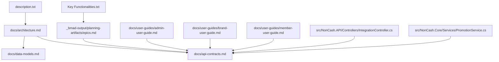
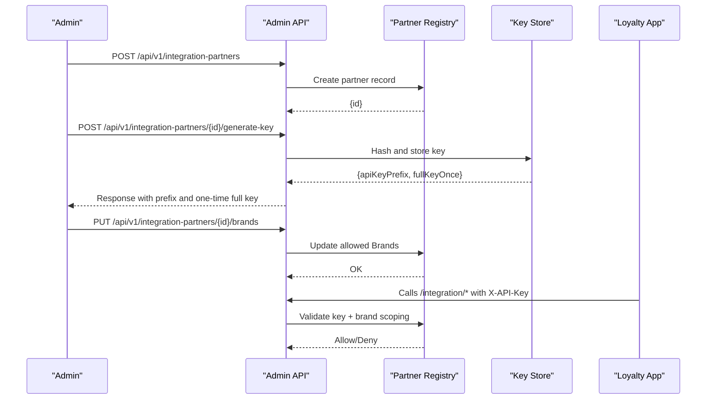
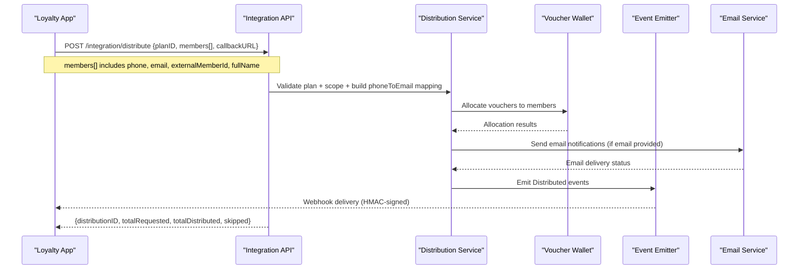
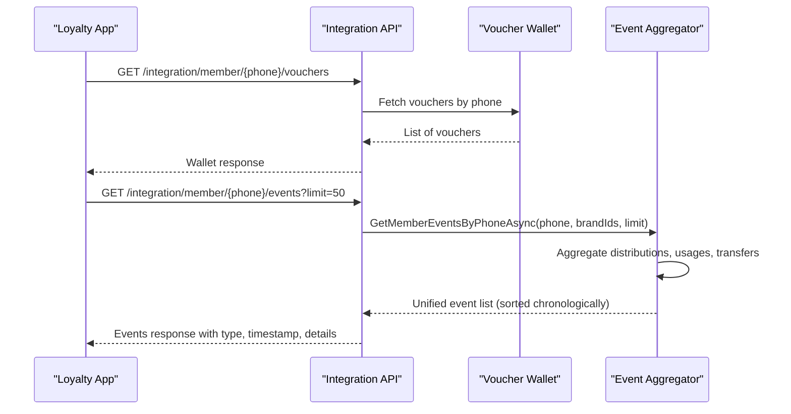
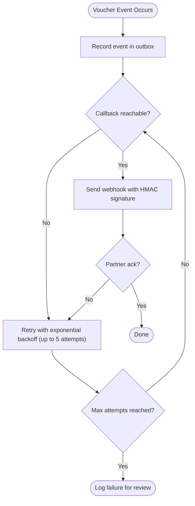
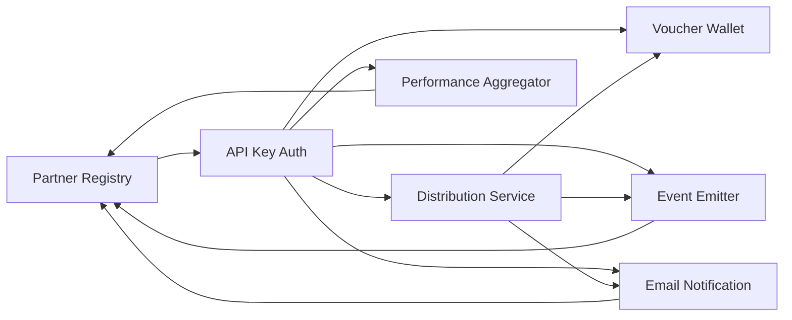

# Integration Partner Management

<cite>
**Referenced Files in This Document**
- [description.txt](file://description.txt)
- [Key Functionalities.txt](file://Key Functionalities.txt)
- [BMAD_STRUCTURE.md](file://BMAD_STRUCTURE.md)
- [docs/architecture.md](file://docs/architecture.md)
- [docs/data-models.md](file://docs/data-models.md)
- [docs/api-contracts.md](file://docs/api-contracts.md)
- [_bmad-output/planning-artifacts/epics.md](file://_bmad-output/planning-artifacts/epics.md)
- [_bmad-output/planning-artifacts/implementation-readiness-report-2026-04-17.md](file://_bmad-output/planning-artifacts/implementation-readiness-report-2026-04-17.md)
- [docs/user-guides/admin-user-guide.md](file://docs/user-guides/admin-user-guide.md)
- [docs/user-guides/brand-user-guide.md](file://docs/user-guides/brand-user-guide.md)
- [docs/user-guides/member-user-guide.md](file://docs/user-guides/member-user-guide.md)
- [src/NonCash.API/Controllers/IntegrationController.cs](file://src/NonCash.API/Controllers/IntegrationController.cs)
- [src/NonCash.Core/Services/PromotionService.cs](file://src/NonCash.Core/Services/PromotionService.cs)
- [src/NonCash.Core/Interfaces/IPromotionService.cs](file://src/NonCash.Core/Interfaces/IPromotionService.cs)
- [_bmad-output/implementation-artifacts/6-2-segment-distribution-api.md](file://_bmad-output/implementation-artifacts/6-2-segment-distribution-api.md)
</cite>

## Update Summary
**Changes Made**
- Enhanced Segment Distribution API with new Members parameter supporting phone numbers, emails, external member IDs, and full names
- Added comprehensive member event tracking via GetMemberEventsByPhoneAsync method
- Enhanced campaign performance tracking with per-outlet breakdown analysis
- Integrated email notification capabilities into voucher distribution process
- Updated API contracts and implementation details

## Table of Contents
1. [Introduction](#introduction)
2. [Project Structure](#project-structure)
3. [Core Components](#core-components)
4. [Architecture Overview](#architecture-overview)
5. [Detailed Component Analysis](#detailed-component-analysis)
6. [Dependency Analysis](#dependency-analysis)
7. [Performance Considerations](#performance-considerations)
8. [Troubleshooting Guide](#troubleshooting-guide)
9. [Conclusion](#conclusion)
10. [Appendices](#appendices)

## Introduction
This document explains the Integration Partner Management capability for the NonCash voucher platform. It focuses on how external Loyalty Apps integrate with NonCash as a generic voucher engine, including partner onboarding, API key management, segment distribution, member wallet and event history queries, real-time webhook events, and campaign performance analytics. The system is designed as a SaaS platform with a three-layer architecture (GUI, Business Logic Layer, Data Access Layer), multi-tenancy by BrandID, and strong security via JWT and API Keys.

**Updated** Enhanced integration API now supports comprehensive member data including phone numbers, emails, external member IDs, and full names for improved voucher distribution with email notification capabilities.

**Section sources**
- [description.txt:1-31](file://description.txt#L1-L31)
- [BMAD_STRUCTURE.md:37-78](file://BMAD_STRUCTURE.md#L37-L78)

## Project Structure
The repository contains product requirements, architecture documentation, data models, API contracts, user guides, and planning artifacts that together define the integration partner capabilities.



**Diagram sources**
- [docs/architecture.md:1-109](file://docs/architecture.md#L1-L109)
- [docs/api-contracts.md:1-321](file://docs/api-contracts.md#L1-L321)
- [docs/data-models.md:1-113](file://docs/data-models.md#L1-L113)
- [_bmad-output/planning-artifacts/epics.md:1-391](file://_bmad-output/planning-artifacts/epics.md#L1-L391)
- [docs/user-guides/admin-user-guide.md:1-324](file://docs/user-guides/admin-user-guide.md#L1-L324)
- [docs/user-guides/brand-user-guide.md:1-335](file://docs/user-guides/brand-user-guide.md#L1-L335)
- [docs/user-guides/member-user-guide.md:1-316](file://docs/user-guides/member-user-guide.md#L1-L316)
- [description.txt:1-31](file://description.txt#L1-L31)
- [Key Functionalities.txt:1-174](file://Key Functionalities.txt#L1-L174)
- [src/NonCash.API/Controllers/IntegrationController.cs:1-234](file://src/NonCash.API/Controllers/IntegrationController.cs#L1-L234)
- [src/NonCash.Core/Services/PromotionService.cs:1-414](file://src/NonCash.Core/Services/PromotionService.cs#L1-L414)

**Section sources**
- [docs/architecture.md:1-109](file://docs/architecture.md#L1-L109)
- [_bmad-output/planning-artifacts/epics.md:1-391](file://_bmad-output/planning-artifacts/epics.md#L1-L391)

## Core Components
Integration Partner Management centers around these components:
- Partner Onboarding and API Key Management: Admin registers partners, issues scoped API keys, associates Brands, and manages lifecycle.
- **Enhanced** Segment Distribution API: Partners push target segments with comprehensive member data (phone, email, external member ID, full name) to NonCash for batch distribution with email notification support.
- Member Wallet and Event History APIs: Partners query vouchers and comprehensive lifecycle events for members using the new GetMemberEventsByPhoneAsync method.
- Webhook Lifecycle Events: NonCash pushes real-time events to partner callback endpoints.
- **Enhanced** Campaign Performance Query: Partners retrieve aggregated redemption and ROI metrics per plan with detailed per-outlet breakdown analysis.

These are supported by:
- Multi-tenancy isolation by BrandID across all operations.
- Security via API Key authentication for partner endpoints and JWT for admin/brand users.
- Prepaid credit model ensuring consumption accounting per voucher lifetime.
- **New** Email notification integration for distributed vouchers.

**Updated** The integration API now supports enhanced member data handling and comprehensive event tracking capabilities.

**Section sources**
- [docs/api-contracts.md:174-321](file://docs/api-contracts.md#L174-L321)
- [docs/user-guides/admin-user-guide.md:158-198](file://docs/user-guides/admin-user-guide.md#L158-L198)
- [docs/architecture.md:37-98](file://docs/architecture.md#L37-L98)
- [src/NonCash.API/Controllers/IntegrationController.cs:43-105](file://src/NonCash.API/Controllers/IntegrationController.cs#L43-L105)
- [src/NonCash.Core/Services/PromotionService.cs:276-353](file://src/NonCash.Core/Services/PromotionService.cs#L276-L353)

## Architecture Overview
NonCash exposes a Loyalty App Integration API that any brand-operated loyalty application can consume. NonCash owns voucher production, distribution execution, POS redemption, fraud protection, and event emission; the Loyalty App owns customer master data, segmentation, marketing decisions, push notifications, and in-app wallet display.

```mermaid
graph TB
subgraph "Loyalty App"
LA_UI["Member Wallet UI"]
LA_SEG["Segmentation Engine"]
LA_WEBHOOK["Webhook Consumer"]
end
subgraph "NonCash Platform"
AUTH["API Key + JWT Auth"]
PARTNER["Partner Registry & Scoping"]
DIST["Distribution Service"]
WALLET["Wallet / Voucher State"]
EVENTS["Event Emitter / Outbox"]
PERM["Campaign Performance"]
EMAIL["Email Notification"]
end
LA_SEG --> |POST /integration/distribute| DIST
LA_UI --> |GET /integration/member/{phone}/vouchers| WALLET
LA_UI --> |GET /integration/member/{phone}/events| EVENTS
LA_UI --> |GET /integration/campaigns/{planID}/performance| PERM
DIST --> |Webhook| LA_WEBHOOK
DIST --> |Email| EMAIL
EVENTS --> |Webhook| LA_WEBHOOK
AUTH --> PARTNER
PARTNER --> DIST
PARTNER --> WALLET
PARTNER --> EVENTS
PARTNER --> PERM
```

**Updated** Added Email Notification component to show the enhanced distribution workflow with email capabilities.

**Diagram sources**
- [docs/architecture.md:45-98](file://docs/architecture.md#L45-L98)
- [docs/api-contracts.md:174-321](file://docs/api-contracts.md#L174-L321)
- [docs/user-guides/admin-user-guide.md:158-198](file://docs/user-guides/admin-user-guide.md#L158-L198)
- [src/NonCash.API/Controllers/IntegrationController.cs:55-82](file://src/NonCash.API/Controllers/IntegrationController.cs#L55-L82)

## Detailed Component Analysis

### Partner Onboarding and API Key Management
Admins register external Loyalty App partners, issue scoped API credentials, associate allowed Brands, and manage lifecycle (update/deactivate/delete). Webhooks are delivered asynchronously with HMAC-SHA256 signatures and retry policies.



**Diagram sources**
- [docs/user-guides/admin-user-guide.md:158-198](file://docs/user-guides/admin-user-guide.md#L158-L198)
- [docs/api-contracts.md:174-321](file://docs/api-contracts.md#L174-L321)

**Section sources**
- [docs/user-guides/admin-user-guide.md:158-198](file://docs/user-guides/admin-user-guide.md#L158-L198)

### Enhanced Segment Distribution API
Partners push a target member segment with comprehensive member data to NonCash for batch distribution. The enhanced request includes planID, members array with phone numbers, emails, external member IDs, and full names, plus optional callbackURL. Responses include distributionID and counts with email notification status.

**Updated** The API now supports rich member data including phone numbers, emails, external member IDs, and full names for improved voucher distribution with email notification capabilities.



**Updated** Enhanced sequence diagram showing email notification integration and comprehensive member data handling.

**Diagram sources**
- [docs/api-contracts.md:196-221](file://docs/api-contracts.md#L196-L221)
- [docs/user-guides/admin-user-guide.md:189-198](file://docs/user-guides/admin-user-guide.md#L189-L198)
- [src/NonCash.API/Controllers/IntegrationController.cs:55-82](file://src/NonCash.API/Controllers/IntegrationController.cs#L55-L82)
- [src/NonCash.Core/Services/PromotionService.cs:186-209](file://src/NonCash.Core/Services/PromotionService.cs#L186-L209)

**Section sources**
- [docs/api-contracts.md:196-221](file://docs/api-contracts.md#L196-L221)
- [docs/user-guides/admin-user-guide.md:189-198](file://docs/user-guides/admin-user-guide.md#L189-L198)
- [src/NonCash.API/Controllers/IntegrationController.cs:43-105](file://src/NonCash.API/Controllers/IntegrationController.cs#L43-L105)
- [src/NonCash.Core/Services/PromotionService.cs:43-216](file://src/NonCash.Core/Services/PromotionService.cs#L43-L216)
- [_bmad-output/implementation-artifacts/6-2-segment-distribution-api.md:81-142](file://_bmad-output/implementation-artifacts/6-2-segment-distribution-api.md#L81-L142)

### Enhanced Member Wallet and Event History APIs
Partners query a member's current vouchers and comprehensive lifecycle events using the new GetMemberEventsByPhoneAsync method. These enable in-app wallet rendering and detailed analytics timelines with unified event aggregation from distributions, usages, and transfers.

**Updated** Enhanced with comprehensive event tracking that aggregates distribution, redemption, and transfer events into a unified timeline.



**Updated** Enhanced sequence diagram showing the comprehensive event aggregation process.

**Diagram sources**
- [docs/api-contracts.md:223-276](file://docs/api-contracts.md#L223-L276)
- [src/NonCash.API/Controllers/IntegrationController.cs:144-164](file://src/NonCash.API/Controllers/IntegrationController.cs#L144-L164)
- [src/NonCash.Core/Services/PromotionService.cs:276-353](file://src/NonCash.Core/Services/PromotionService.cs#L276-L353)

**Section sources**
- [docs/api-contracts.md:223-276](file://docs/api-contracts.md#L223-L276)
- [src/NonCash.API/Controllers/IntegrationController.cs:144-164](file://src/NonCash.API/Controllers/IntegrationController.cs#L144-L164)
- [src/NonCash.Core/Services/PromotionService.cs:276-353](file://src/NonCash.Core/Services/PromotionService.cs#L276-L353)

### Webhook Lifecycle Events (Push)
NonCash pushes real-time events to the partner's registered callback URL. Events include distributed, redeemed, transferred, expired, cancelled. Payloads are HMAC-SHA256 signed and retried with exponential backoff.



**Diagram sources**
- [docs/user-guides/admin-user-guide.md:189-198](file://docs/user-guides/admin-user-guide.md#L189-L198)
- [docs/api-contracts.md:278-298](file://docs/api-contracts.md#L278-L298)

**Section sources**
- [docs/user-guides/admin-user-guide.md:189-198](file://docs/user-guides/admin-user-guide.md#L189-L198)
- [docs/api-contracts.md:278-298](file://docs/api-contracts.md#L278-L298)

### Enhanced Campaign Performance Query API
Partners retrieve aggregated performance data for campaigns they sponsored, including issued, distributed, redeemed counts, redemption rate, and **enhanced** per-outlet breakdown analysis showing redemption counts and values by outlet location.

**Updated** Enhanced with detailed per-outlet breakdown analysis providing granular performance insights at individual outlet locations.

```mermaid
sequenceDiagram
participant Partner as "Loyalty App"
participant API as "Integration API"
participant Analytics as "Performance Aggregator"
Participant->>API : GET /integration/campaigns/{planID}/performance
API->>Analytics : Aggregate metrics by planID with outlet breakdown
Analytics->>Analytics : Group redeemed vouchers by LockedOutletId
Analytics-->>API : Metrics payload with perOutlet breakdown
API-->>Partner : {planID, brand, totals, rates, perOutlet}
```

**Updated** Enhanced sequence diagram showing per-outlet breakdown analysis.

**Diagram sources**
- [docs/api-contracts.md:300-321](file://docs/api-contracts.md#L300-L321)
- [src/NonCash.API/Controllers/IntegrationController.cs:171-183](file://src/NonCash.API/Controllers/IntegrationController.cs#L171-L183)
- [src/NonCash.Core/Services/PromotionService.cs:356-391](file://src/NonCash.Core/Services/PromotionService.cs#L356-L391)

**Section sources**
- [docs/api-contracts.md:300-321](file://docs/api-contracts.md#L300-L321)
- [src/NonCash.API/Controllers/IntegrationController.cs:171-183](file://src/NonCash.API/Controllers/IntegrationController.cs#L171-L183)
- [src/NonCash.Core/Services/PromotionService.cs:356-391](file://src/NonCash.Core/Services/PromotionService.cs#L356-L391)

### Conceptual Overview
Conceptually, Integration Partner Management enables NonCash to act as a neutral voucher engine while allowing any brand-operated Loyalty App to drive marketing and engagement through well-defined APIs and webhooks. The design ensures clear responsibility boundaries, minimal data duplication, and robust security.

[No sources needed since this section doesn't analyze specific source files]

## Dependency Analysis
Integration Partner Management depends on several core entities and services:
- Partner registry and API key storage for authentication and authorization.
- Distribution service for executing batch promotions and transfers with enhanced member data handling.
- Voucher wallet for stateful voucher lifecycle management.
- Event emitter/outbox for reliable webhook delivery.
- Performance aggregator for campaign analytics with per-outlet breakdown.
- **New** Email notification service for voucher distribution notifications.
- Multi-tenant scoping via BrandID to isolate data access.



**Updated** Added Email Notification dependency to show the enhanced distribution workflow.

**Diagram sources**
- [docs/api-contracts.md:174-321](file://docs/api-contracts.md#L174-L321)
- [docs/user-guides/admin-user-guide.md:158-198](file://docs/user-guides/admin-user-guide.md#L158-L198)
- [src/NonCash.Core/Services/PromotionService.cs:186-209](file://src/NonCash.Core/Services/PromotionService.cs#L186-L209)

**Section sources**
- [docs/api-contracts.md:174-321](file://docs/api-contracts.md#L174-L321)
- [docs/user-guides/admin-user-guide.md:158-198](file://docs/user-guides/admin-user-guide.md#L158-L198)

## Performance Considerations
- Use pagination and filtering on event history and ledger endpoints to avoid large payloads.
- Ensure webhook callbacks are idempotent and handle retries gracefully.
- Cache member wallet responses at the Loyalty App layer when appropriate to reduce repeated calls.
- Monitor webhook delivery success rates and adjust retry/backoff strategies if necessary.
- Keep segment distribution requests reasonably sized; consider batching for very large audiences.
- **New** Optimize email notification processing to avoid blocking distribution operations.
- **New** Implement efficient per-outlet breakdown queries for campaign performance analytics.

[No sources needed since this section provides general guidance]

## Troubleshooting Guide
Common issues and resolutions for Integration Partner Management:

- 401 Unauthorized on /integration/*: Missing or invalid X-API-Key, or partner deactivated. Verify key, isActive flag, and brand associations.
- Missing webhook notifications: Callback URL unreachable or retries exhausted (max 5). Confirm HTTPS endpoint reachability and check webhook_deliveries table.
- Insufficient credits blocking distribution: When a Brand balance ≤ 0, generation, batch/partner distribution, and new self-purchase orders fail with InsufficientCredits. Top up credits to resume operations. POS redemption remains unaffected.
- Duplicate distribution due to non-idempotent calls: Ensure partners use idempotency keys or rely on system guarantees to prevent duplicate allocations.
- Performance degradation on event queries: Apply date range filters and type filters to limit result sets.
- **New** Email notification failures: Check email service configuration and recipient email validity. Failed email notifications do not affect distribution success.
- **New** Per-outlet breakdown missing: Ensure vouchers have LockedOutletId set during redemption for accurate outlet-level analytics.

**Updated** Added troubleshooting guidance for new email notification and per-outlet breakdown features.

**Section sources**
- [docs/user-guides/admin-user-guide.md:310-324](file://docs/user-guides/admin-user-guide.md#L310-L324)
- [docs/api-contracts.md:169-171](file://docs/api-contracts.md#L169-L171)
- [docs/user-guides/brand-user-guide.md:285-295](file://docs/user-guides/brand-user-guide.md#L285-L295)
- [src/NonCash.Core/Services/PromotionService.cs:186-209](file://src/NonCash.Core/Services/PromotionService.cs#L186-L209)

## Conclusion
Integration Partner Management equips NonCash to serve as a universal voucher engine for any brand-operated Loyalty App. Through secure partner onboarding, robust APIs, reliable webhooks, and actionable analytics, partners can execute targeted campaigns, deliver vouchers seamlessly into member wallets, and measure performance accurately. The design emphasizes multi-tenancy, security, and clear responsibility boundaries, enabling scalable adoption across diverse brands and markets.

**Updated** The enhanced integration API now provides comprehensive member data handling, email notification capabilities, detailed event tracking, and granular per-outlet performance analytics for more sophisticated campaign management.

[No sources needed since this section summarizes without analyzing specific files]

## Appendices

### API Endpoints Summary for Integration Partners
- Distribute to Segment: POST /integration/distribute (Enhanced with Members parameter)
- Get Member Voucher Wallet: GET /integration/member/{phone}/vouchers
- Get Voucher Event History: GET /integration/member/{phone}/events (Enhanced with comprehensive tracking)
- Webhook: Voucher Lifecycle Events (push from NonCash to partner)
- Query Campaign Performance: GET /integration/campaigns/{planID}/performance (Enhanced with per-outlet breakdown)

**Updated** Enhanced API endpoints with new capabilities and parameters.

**Section sources**
- [docs/api-contracts.md:196-321](file://docs/api-contracts.md#L196-L321)
- [src/NonCash.API/Controllers/IntegrationController.cs:43-183](file://src/NonCash.API/Controllers/IntegrationController.cs#L43-L183)

### Data Models Relevant to Integration
- VoucherPlanHeader and VoucherPlanDetail underpin distribution and redemption tracking.
- VoucherUsage records POS redemptions with outlet information for per-outlet analytics.
- VoucherDistribution tracks distribution methods (Sale, Promotion, Transfer) with enhanced member data.
- CreditLedgerEntry supports prepaid billing and consumption accounting.
- **New** Customer entity enhanced with email field for notification support.
- **New** OutletPerformance and CampaignPerformanceResult DTOs for enhanced analytics.

**Updated** Added new data models supporting enhanced integration capabilities.

**Section sources**
- [docs/data-models.md:9-113](file://docs/data-models.md#L9-L113)
- [src/NonCash.Core/Interfaces/IPromotionService.cs:40-79](file://src/NonCash.Core/Interfaces/IPromotionService.cs#L40-L79)

### Epic Coverage for Integration Partner Management
Epic 6 covers external partner integration, including stories for partner onboarding, segment distribution, member wallet/event history, webhooks, and campaign performance.

**Updated** Enhanced coverage includes new email notification capabilities and comprehensive event tracking.

**Section sources**
- [_bmad-output/planning-artifacts/epics.md:77-83](file://_bmad-output/planning-artifacts/epics.md#L77-L83)
- [_bmad-output/planning-artifacts/epics.md:332-354](file://_bmad-output/planning-artifacts/epics.md#L332-L354)
- [_bmad-output/implementation-artifacts/6-2-segment-distribution-api.md:30-79](file://_bmad-output/implementation-artifacts/6-2-segment-distribution-api.md#L30-L79)