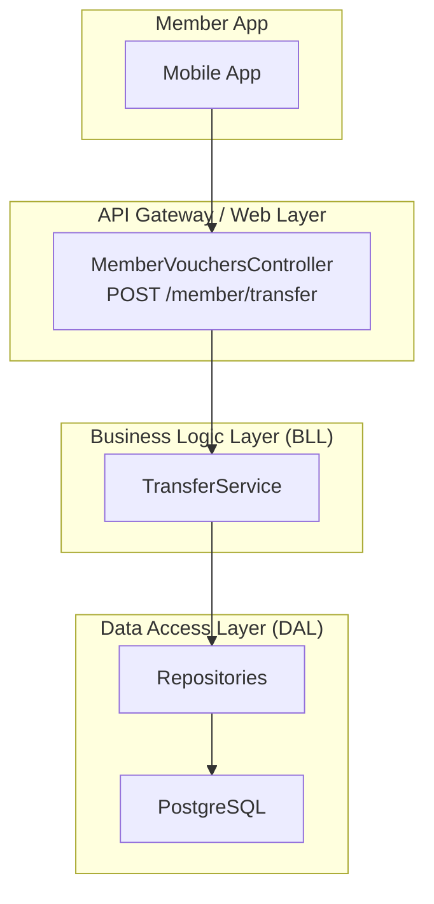
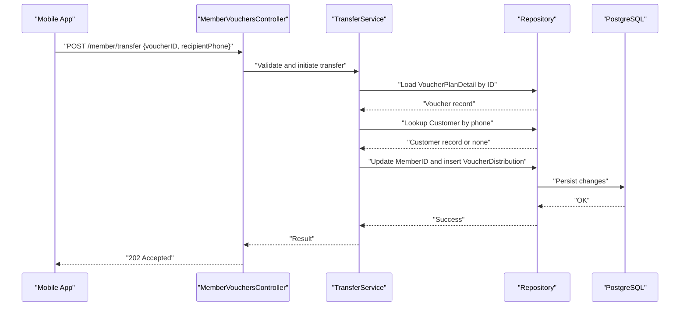
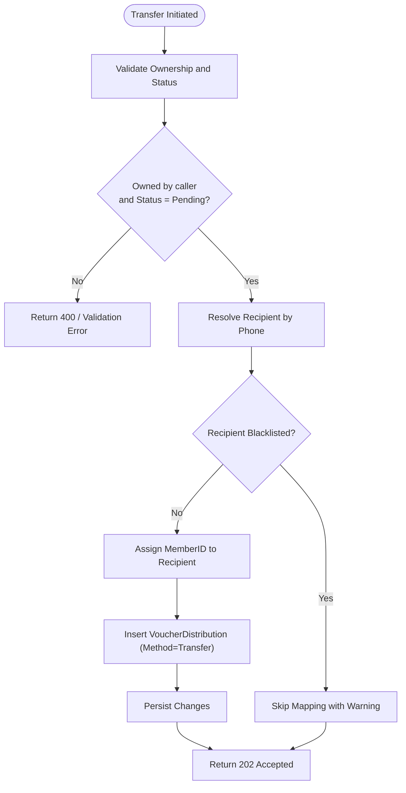
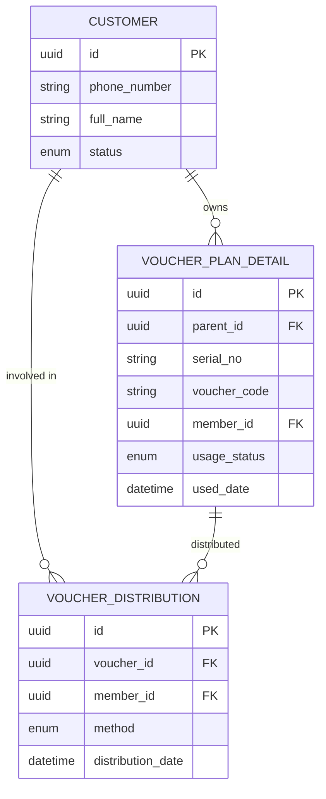

# Voucher Transfer Endpoint

<cite>
**Referenced Files in This Document**
- [api-contracts.md](file://docs/api-contracts.md)
- [data-models.md](file://docs/data-models.md)
- [architecture.md](file://docs/architecture.md)
- [Key Functionalities.txt](file://Key Functionalities.txt)
- [3-3-gifting-batch-transfer.md](file://_bmad-output/implementation-artifacts/3-3-gifting-batch-transfer.md)
</cite>

## Table of Contents
1. [Introduction](#introduction)
2. [Project Structure](#project-structure)
3. [Core Components](#core-components)
4. [Architecture Overview](#architecture-overview)
5. [Detailed Component Analysis](#detailed-component-analysis)
6. [Dependency Analysis](#dependency-analysis)
7. [Performance Considerations](#performance-considerations)
8. [Troubleshooting Guide](#troubleshooting-guide)
9. [Conclusion](#conclusion)
10. [Appendices](#appendices)

## Introduction
This document provides comprehensive API documentation for the POST /member/transfer endpoint that initiates a voucher transfer workflow. It covers the request schema, validation requirements, response handling, asynchronous confirmation process, error conditions, and operational considerations for mobile app integration. It also includes security guidance, rate limiting, transfer history tracking, and user experience recommendations.

## Project Structure
The NonCash platform follows a 3-layer SaaS architecture with microservices. The member-facing API surface is defined in the documentation and implemented behind the Business Logic Layer (BLL) and Data Access Layer (DAL). The transfer workflow is part of the “gifting/batch transfer” story and is documented in the implementation artifacts.

**Diagram sources**
- [architecture.md:17-26](file://docs/architecture.md#L17-L26)
- [3-3-gifting-batch-transfer.md:71-76](file://_bmad-output/implementation-artifacts/3-3-gifting-batch-transfer.md#L71-L76)

**Section sources**
- [architecture.md:17-26](file://docs/architecture.md#L17-L26)
- [3-3-gifting-batch-transfer.md:71-76](file://_bmad-output/implementation-artifacts/3-3-gifting-batch-transfer.md#L71-L76)

## Core Components
- API Contract: Defines the POST /member/transfer endpoint, request schema, and response semantics.
- Data Models: Describe VoucherPlanDetail (ownership and status), Customer (phone-based identity), and VoucherDistribution (audit trail).
- Implementation Artifacts: Specify validation rules, acceptance criteria, and MVP behavior for transfer confirmation.

Key references:
- Endpoint contract and request/response: [api-contracts.md:98-108](file://docs/api-contracts.md#L98-L108)
- Voucher ownership and status fields: [data-models.md:34-43](file://docs/data-models.md#L34-L43)
- Customer phone identity: [data-models.md:91-98](file://docs/data-models.md#L91-L98)
- Transfer history model: [data-models.md:55-62](file://docs/data-models.md#L55-L62)
- Acceptance criteria and MVP confirmation: [3-3-gifting-batch-transfer.md:11-25](file://_bmad-output/implementation-artifacts/3-3-gifting-batch-transfer.md#L11-L25)

**Section sources**
- [api-contracts.md:98-108](file://docs/api-contracts.md#L98-L108)
- [data-models.md:34-43](file://docs/data-models.md#L34-L43)
- [data-models.md:55-62](file://docs/data-models.md#L55-L62)
- [3-3-gifting-batch-transfer.md:11-25](file://_bmad-output/implementation-artifacts/3-3-gifting-batch-transfer.md#L11-L25)

## Architecture Overview
The transfer endpoint is part of the Member App API and is handled by a controller in the Web/API layer, delegating to a service in the BLL, and persisting changes via repositories to PostgreSQL. The system enforces JWT-based authentication and maintains audit trails through VoucherDistribution.

**Diagram sources**
- [api-contracts.md:98-108](file://docs/api-contracts.md#L98-L108)
- [3-3-gifting-batch-transfer.md:46-49](file://_bmad-output/implementation-artifacts/3-3-gifting-batch-transfer.md#L46-L49)
- [data-models.md:34-43](file://docs/data-models.md#L34-L43)
- [data-models.md:55-62](file://docs/data-models.md#L55-L62)

## Detailed Component Analysis

### Endpoint Definition: POST /member/transfer
- Method: POST
- Path: /member/transfer
- Authentication: Authorization: Bearer <JWT>
- Request Body:
  - voucherID: GUID (identifier of the voucher to transfer)
  - recipientPhone: string (phone number of the intended recipient)
- Response:
  - 202 Accepted (initiated; requires recipient confirmation)

Notes:
- The endpoint is documented in the Member App API section.
- The request schema aligns with the single-voucher transfer contract.

**Section sources**
- [api-contracts.md:98-108](file://docs/api-contracts.md#L98-L108)

### Request Validation Rules
Validation enforced by the backend service (per acceptance criteria and implementation notes):
- Ownership and Status:
  - The voucher must be owned by the authenticated member.
  - The voucher’s UsageStatus must be Pending.
- Recipient Resolution:
  - Recipient phone number must resolve to a Customer record.
  - If the recipient is blacklisted, the mapping is skipped with a warning.
- Count Consistency:
  - For single-voucher transfer, the request must include exactly one voucherID and one recipientPhone.

These rules ensure that only eligible vouchers are transferred and that recipients are valid and not blocked.

**Section sources**
- [3-3-gifting-batch-transfer.md:13-31](file://_bmad-output/implementation-artifacts/3-3-gifting-batch-transfer.md#L13-L31)
- [3-3-gifting-batch-transfer.md:84-86](file://_bmad-output/implementation-artifacts/3-3-gifting-batch-transfer.md#L84-L86)
- [data-models.md:34-43](file://docs/data-models.md#L34-L43)
- [data-models.md:91-98](file://docs/data-models.md#L91-L98)

### Asynchronous Confirmation and Auto-Accept Behavior (MVP)
- Confirmation Model:
  - The MVP simplifies the flow by auto-accepting transfers upon successful validation and persistence.
  - The recipient’s MemberID is assigned immediately, and a VoucherDistribution record is inserted with method = Transfer.
- Future Enhancement:
  - Full two-way confirmation (explicit recipient acceptance) is deferred to post-MVP.

**Diagram sources**
- [3-3-gifting-batch-transfer.md:19-25](file://_bmad-output/implementation-artifacts/3-3-gifting-batch-transfer.md#L19-L25)
- [3-3-gifting-batch-transfer.md:46-49](file://_bmad-output/implementation-artifacts/3-3-gifting-batch-transfer.md#L46-L49)
- [data-models.md:55-62](file://docs/data-models.md#L55-L62)

**Section sources**
- [3-3-gifting-batch-transfer.md:19-25](file://_bmad-output/implementation-artifacts/3-3-gifting-batch-transfer.md#L19-L25)
- [3-3-gifting-batch-transfer.md:46-49](file://_bmad-output/implementation-artifacts/3-3-gifting-batch-transfer.md#L46-L49)

### Response Handling and Transfer History
- Response:
  - 202 Accepted indicates the transfer was accepted for processing.
- Transfer History:
  - Outgoing transfers are recorded in VoucherDistribution with method = Transfer and include timestamps.
  - Members can view transfer history via the “My Voucher” list or dedicated history view.

**Section sources**
- [api-contracts.md:98-108](file://docs/api-contracts.md#L98-L108)
- [3-3-gifting-batch-transfer.md:38-42](file://_bmad-output/implementation-artifacts/3-3-gifting-batch-transfer.md#L38-L42)
- [data-models.md:55-62](file://docs/data-models.md#L55-L62)

### Error Handling
Common error scenarios and their expected outcomes:
- Invalid Phone Number:
  - If the phone number does not correspond to a valid Customer record, the mapping is skipped with a warning.
- Non-existent Voucher:
  - If the voucherID is not found or not owned by the caller, return 400.
- Transfer Limits and Validation:
  - If the voucher is not Pending or not owned by the caller, return 400.
  - If the number of vouchers does not match the number of phones (for multi-item flows), return 400.
- System Errors:
  - Database failures or concurrency conflicts trigger rollback and return 500 with an error identifier for debugging.

Recommendations:
- Return structured error payloads with machine-readable codes and human-readable messages.
- Include a correlation ID in the response headers for tracing.

**Section sources**
- [3-3-gifting-batch-transfer.md:26-31](file://_bmad-output/implementation-artifacts/3-3-gifting-batch-transfer.md#L26-L31)
- [3-3-gifting-batch-transfer.md:84-86](file://_bmad-output/implementation-artifacts/3-3-gifting-batch-transfer.md#L84-L86)
- [data-models.md:91-98](file://docs/data-models.md#L91-L98)

### Mobile App Integration Examples
- Single-Voucher Transfer:
  - Construct a request with voucherID and recipientPhone.
  - On 202 Accepted, poll or listen for push/inbox updates indicating the transfer completion.
- Batch Transfer (Future):
  - Extend the payload to arrays of voucherIDs and recipientPhones.
  - Expect per-item results and warnings for skipped mappings.

Guidance:
- Always include Authorization: Bearer <JWT>.
- Validate client-side phone normalization before sending requests.
- Implement retry with exponential backoff for transient 5xx errors.

**Section sources**
- [api-contracts.md:98-108](file://docs/api-contracts.md#L98-L108)
- [3-3-gifting-batch-transfer.md:50-53](file://_bmad-output/implementation-artifacts/3-3-gifting-batch-transfer.md#L50-L53)

### Security Considerations for Phone Number Validation
- Phone Normalization:
  - Normalize phone numbers to E.164 format on the client and server to avoid duplicates and improve matching.
- Blacklist Checks:
  - Enforce blacklist checks during transfer to prevent transfers to restricted recipients.
- Ownership Verification:
  - Ensure the authenticated member owns the voucher and that the status is Pending.

**Section sources**
- [3-3-gifting-batch-transfer.md:32-37](file://_bmad-output/implementation-artifacts/3-3-gifting-batch-transfer.md#L32-L37)
- [3-3-gifting-batch-transfer.md:88-89](file://_bmad-output/implementation-artifacts/3-3-gifting-batch-transfer.md#L88-L89)
- [data-models.md:91-98](file://docs/data-models.md#L91-L98)

### Rate Limiting and Concurrency
- Rate Limiting:
  - Apply per-member rate limits on transfer requests (e.g., N per minute) to prevent abuse.
- Concurrency:
  - Use database transactions to ensure atomic updates of MemberID and insertion of VoucherDistribution.
  - Implement optimistic concurrency to detect and resolve conflicts.

**Section sources**
- [3-3-gifting-batch-transfer.md:49](file://_bmad-output/implementation-artifacts/3-3-gifting-batch-transfer.md#L49)

### User Experience Considerations
- Immediate Feedback:
  - On 202 Accepted, inform the user that the transfer is being processed.
- Transfer History:
  - Display outgoing transfers with recipient phone numbers and timestamps for transparency.
- Notifications:
  - Use placeholders for future inbox/notification features to alert recipients.

**Section sources**
- [3-3-gifting-batch-transfer.md:22-24](file://_bmad-output/implementation-artifacts/3-3-gifting-batch-transfer.md#L22-L24)
- [3-3-gifting-batch-transfer.md:40-42](file://_bmad-output/implementation-artifacts/3-3-gifting-batch-transfer.md#L40-L42)

## Dependency Analysis
The transfer workflow depends on:
- VoucherPlanDetail for ownership and status checks.
- Customer for phone-based identity resolution.
- VoucherDistribution for audit trail.

**Diagram sources**
- [data-models.md:34-43](file://docs/data-models.md#L34-L43)
- [data-models.md:55-62](file://docs/data-models.md#L55-L62)
- [data-models.md:91-98](file://docs/data-models.md#L91-L98)

**Section sources**
- [data-models.md:34-43](file://docs/data-models.md#L34-L43)
- [data-models.md:55-62](file://docs/data-models.md#L55-L62)
- [data-models.md:91-98](file://docs/data-models.md#L91-L98)

## Performance Considerations
- Indexes:
  - Ensure indexes on VoucherPlanDetail.MemberID and VoucherPlanDetail.UsageStatus for fast ownership/status checks.
  - Ensure indexes on Customer.PhoneNumber for efficient phone-based lookup.
- Transactions:
  - Wrap transfer updates in a single transaction to guarantee atomicity.
- Caching:
  - Cache frequently accessed customer records to reduce latency.

[No sources needed since this section provides general guidance]

## Troubleshooting Guide
- Symptom: 400 Bad Request on transfer
  - Likely causes: voucher not owned by caller, UsageStatus not Pending, mismatched counts, invalid phone number.
  - Actions: Verify ownership and status, normalize phone numbers, ensure 1:1 mapping.
- Symptom: 500 Internal Server Error
  - Likely causes: database contention, constraint violations, transient failures.
  - Actions: Retry with backoff, capture correlation IDs, inspect transaction logs.
- Debugging Tips:
  - Log request correlation IDs and include them in responses.
  - Capture the exact validation rule that failed for quick diagnosis.

**Section sources**
- [3-3-gifting-batch-transfer.md:26-31](file://_bmad-output/implementation-artifacts/3-3-gifting-batch-transfer.md#L26-L31)
- [3-3-gifting-batch-transfer.md:84-86](file://_bmad-output/implementation-artifacts/3-3-gifting-batch-transfer.md#L84-L86)

## Conclusion
The POST /member/transfer endpoint enables secure, auditable voucher ownership transfers initiated by authenticated members. The current MVP auto-accepts transfers upon validation and persistence, with future enhancements planned for explicit recipient confirmation. Robust validation, rate limiting, and clear error handling ensure reliability and a good user experience.

[No sources needed since this section summarizes without analyzing specific files]

## Appendices

### API Definition Reference
- Endpoint: POST /member/transfer
- Authentication: Bearer <JWT>
- Request:
  - voucherID: GUID
  - recipientPhone: string
- Response:
  - 202 Accepted

**Section sources**
- [api-contracts.md:98-108](file://docs/api-contracts.md#L98-L108)

### Business Context References
- Transfer flow and ownership reassignment:
  - [Key Functionalities.txt:127-134](file://Key Functionalities.txt#L127-L134)
- Customer phone-based identity:
  - [data-models.md:91-98](file://docs/data-models.md#L91-L98)

**Section sources**
- [Key Functionalities.txt:127-134](file://Key Functionalities.txt#L127-L134)
- [data-models.md:91-98](file://docs/data-models.md#L91-L98)