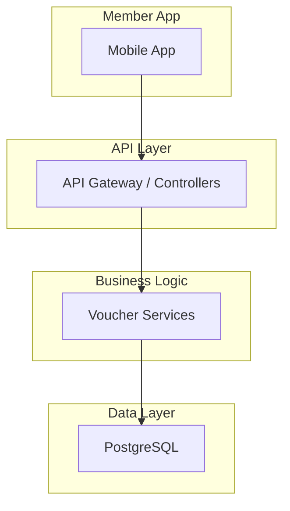
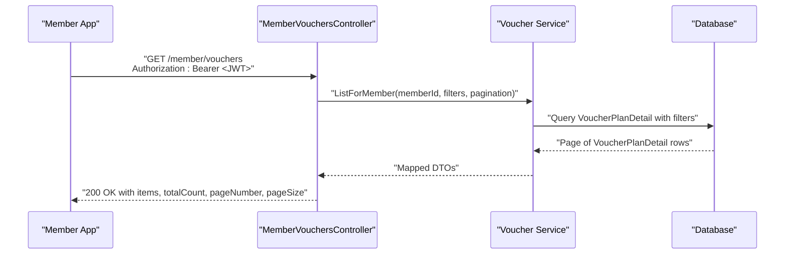
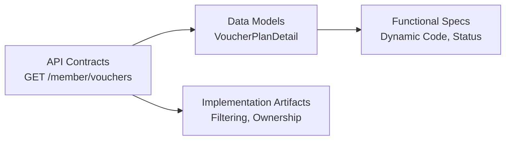

# Vouchers Listing Endpoint

<cite>
**Referenced Files in This Document**
- [api-contracts.md](file://docs/api-contracts.md)
- [data-models.md](file://docs/data-models.md)
- [architecture.md](file://docs/architecture.md)
- [Key Functionalities.txt](file://Key Functionalities.txt)
- [2-2-generate-plan-details.md](file://_bmad-output/implementation-artifacts/2-2-generate-plan-details.md)
- [3-3-gifting-batch-transfer.md](file://_bmad-output/implementation-artifacts/3-3-gifting-batch-transfer.md)
</cite>

## Table of Contents
1. [Introduction](#introduction)
2. [Project Structure](#project-structure)
3. [Core Components](#core-components)
4. [Architecture Overview](#architecture-overview)
5. [Detailed Component Analysis](#detailed-component-analysis)
6. [Dependency Analysis](#dependency-analysis)
7. [Performance Considerations](#performance-considerations)
8. [Troubleshooting Guide](#troubleshooting-guide)
9. [Conclusion](#conclusion)

## Introduction
This document specifies the GET /member/vouchers endpoint used by the Member App. It covers authentication, request parameters, response schema, pagination, filtering, error handling, and implementation guidelines for mobile clients.

## Project Structure
The endpoint is part of the Member App API group and integrates with the core data model for VoucherPlanDetail. The base URL and authentication scheme are defined in the API contracts, while the data model and business rules are documented in the data models and functional specifications.

**Section sources**
- [api-contracts.md:6-9](file://docs/api-contracts.md#L6-L9)
- [data-models.md:34-43](file://docs/data-models.md#L34-L43)

## Core Components
- Endpoint: GET /member/vouchers
- Authentication: JWT Bearer via Authorization header
- Response: Array of VoucherPlanDetail items owned by the authenticated member
- Pagination: Query parameters pageNumber and pageSize
- Filtering: By UsageStatus and date ranges (as defined below)

**Section sources**
- [api-contracts.md:93-96](file://docs/api-contracts.md#L93-L96)
- [data-models.md:34-43](file://docs/data-models.md#L34-L43)
- [Key Functionalities.txt:50-64](file://Key Functionalities.txt#L50-L64)

## Architecture Overview
The Member App interacts with the backend through a JWT-authenticated API. The GET /member/vouchers endpoint returns a paginated list of VoucherPlanDetail items associated with the caller’s membership.

**Diagram sources**
- [api-contracts.md:93-96](file://docs/api-contracts.md#L93-L96)
- [data-models.md:34-43](file://docs/data-models.md#L34-L43)

## Detailed Component Analysis

### Endpoint Specification
- Method: GET
- Path: /member/vouchers
- Authentication: Authorization: Bearer <JWT>
- Response: Array of VoucherPlanDetail items

**Section sources**
- [api-contracts.md:93-96](file://docs/api-contracts.md#L93-L96)

### Request Parameters
- Pagination
  - pageNumber: integer, default 1, minimum 1
  - pageSize: integer, default 20, typical max 100
- Filtering
  - usageStatus: enum string (Pending, In-Use, Complete)
  - fromDate: date-time (inclusive lower bound)
  - toDate: date-time (inclusive upper bound)

Notes:
- The endpoint returns only items owned by the authenticated member.
- The dynamic VoucherCode is rotated per request; the endpoint returns the current valid code.

**Section sources**
- [api-contracts.md:93-96](file://docs/api-contracts.md#L93-L96)
- [data-models.md:34-43](file://docs/data-models.md#L34-L43)
- [2-2-generate-plan-details.md:75-78](file://_bmad-output/implementation-artifacts/2-2-generate-plan-details.md#L75-L78)

### Response Schema: VoucherPlanDetail
Each item represents a single voucher detail owned by the member.

- id: string (GUID)
- parentId: string (GUID)
- serialNo: string (unique external identifier)
- voucherCode: string (ephemeral, JWT-like token)
- memberId: string (GUID, nullable)
- usageStatus: string (enum: Pending, In-Use, Complete)
- usedDate: string (date-time, nullable)
- createdAt: string (date-time)

Pagination envelope:
- items: VoucherPlanDetail[]
- totalCount: integer
- pageNumber: integer
- pageSize: integer

**Section sources**
- [data-models.md:34-43](file://docs/data-models.md#L34-L43)
- [2-2-generate-plan-details.md:75-78](file://_bmad-output/implementation-artifacts/2-2-generate-plan-details.md#L75-L78)

### Typical Responses
- Successful response: 200 OK with paginated items
- Empty result set: 200 OK with empty items array and totalCount 0
- Unauthorized: 401 Unauthorized (invalid/expired JWT)
- Forbidden: 403 Forbidden (insufficient permissions)
- Bad Request: 400 Bad Request (invalid parameters)
- Too Many Requests: 429 Too Many Requests (rate limit)
- Internal Server Error: 500 Internal Server Error

Note: The endpoint returns only items owned by the authenticated member; cross-member access is prevented by design.

**Section sources**
- [api-contracts.md:93-96](file://docs/api-contracts.md#L93-L96)
- [3-3-gifting-batch-transfer.md:82-85](file://_bmad-output/implementation-artifacts/3-3-gifting-batch-transfer.md#L82-L85)

### Implementation Guidelines for Mobile Apps
- Authentication
  - Store the JWT securely (platform keychain/security storage).
  - Refresh or re-authenticate on 401 responses.
- Pagination
  - Use pageNumber and pageSize consistently.
  - Compute total pages from totalCount and pageSize.
- Filtering
  - Apply usageStatus and date range filters client-side after fetching a reasonable pageSize.
- Caching and Offline Handling
  - Cache items keyed by memberId and timestamp.
  - Invalidate cache on logout or JWT refresh.
  - For offline scenarios, present cached items with a “last synced” indicator.
- Performance
  - Fetch pageSize aligned to device memory limits.
  - Debounce rapid pagination changes.
  - Use background sync to refresh periodically.
- Error Handling
  - Treat 401 as session invalidation; prompt re-login.
  - Treat 403 as permission error; notify user appropriately.
  - Treat 429 as throttling; back off and retry later.

**Section sources**
- [api-contracts.md:93-96](file://docs/api-contracts.md#L93-L96)
- [Key Functionalities.txt:50-64](file://Key Functionalities.txt#L50-L64)

## Dependency Analysis
- API Contracts define the endpoint and authentication.
- Data Models define VoucherPlanDetail and its fields.
- Functional Specifications describe dynamic code generation and status semantics.
- Implementation Artifacts reinforce filtering and ownership constraints.

**Diagram sources**
- [api-contracts.md:93-96](file://docs/api-contracts.md#L93-L96)
- [data-models.md:34-43](file://docs/data-models.md#L34-L43)
- [2-2-generate-plan-details.md:75-78](file://_bmad-output/implementation-artifacts/2-2-generate-plan-details.md#L75-L78)
- [3-3-gifting-batch-transfer.md:82-85](file://_bmad-output/implementation-artifacts/3-3-gifting-batch-transfer.md#L82-L85)

**Section sources**
- [api-contracts.md:93-96](file://docs/api-contracts.md#L93-L96)
- [data-models.md:34-43](file://docs/data-models.md#L34-L43)
- [2-2-generate-plan-details.md:75-78](file://_bmad-output/implementation-artifacts/2-2-generate-plan-details.md#L75-L78)
- [3-3-gifting-batch-transfer.md:82-85](file://_bmad-output/implementation-artifacts/3-3-gifting-batch-transfer.md#L82-L85)

## Performance Considerations
- Prefer server-side pagination with pageSize limits.
- Use database indexes on member_id and usage_status for efficient filtering.
- Avoid requesting excessively large pageSize values.
- Cache responses with appropriate TTL and invalidate on membership changes.

[No sources needed since this section provides general guidance]

## Troubleshooting Guide
- 401 Unauthorized
  - Cause: Missing, expired, or invalid JWT.
  - Action: Re-authenticate and retry.
- 403 Forbidden
  - Cause: Insufficient permissions or tenant isolation violation.
  - Action: Verify account status and membership scope.
- 400 Bad Request
  - Cause: Invalid pagination or filter parameters.
  - Action: Validate pageNumber >= 1 and pageSize within accepted bounds.
- 429 Too Many Requests
  - Cause: Rate limiting triggered.
  - Action: Back off and retry after delay.
- Empty Results
  - Cause: No vouchers assigned to the member or filters exclude all items.
  - Action: Adjust filters or confirm distribution history.

**Section sources**
- [api-contracts.md:93-96](file://docs/api-contracts.md#L93-L96)
- [3-3-gifting-batch-transfer.md:82-85](file://_bmad-output/implementation-artifacts/3-3-gifting-batch-transfer.md#L82-L85)

## Conclusion
The GET /member/vouchers endpoint provides a secure, paginated, and filterable view of a member’s vouchers. By adhering to the documented authentication, parameters, and response schema, and by implementing recommended caching and performance strategies, the Member App can deliver a responsive and reliable user experience.