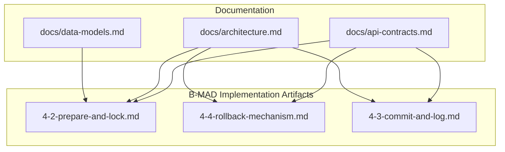
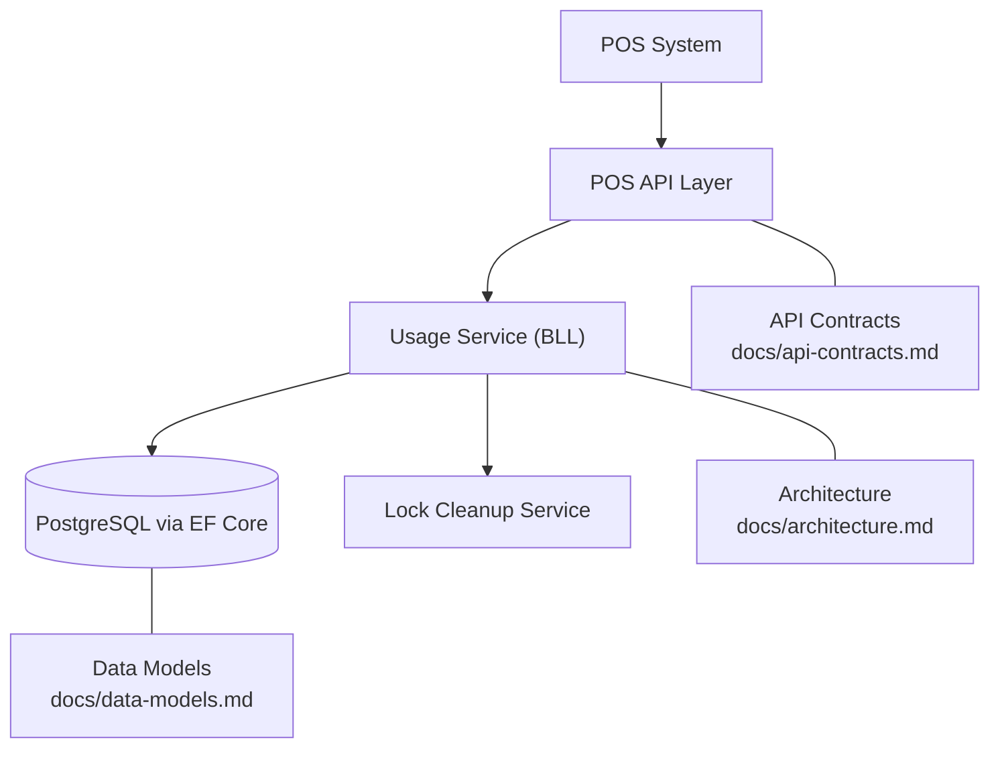
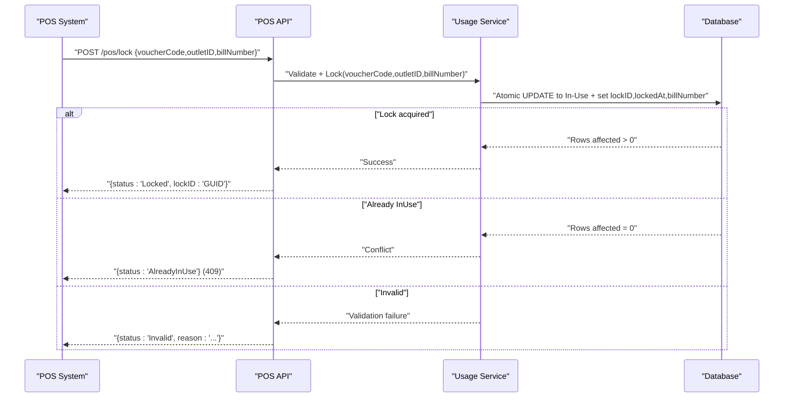
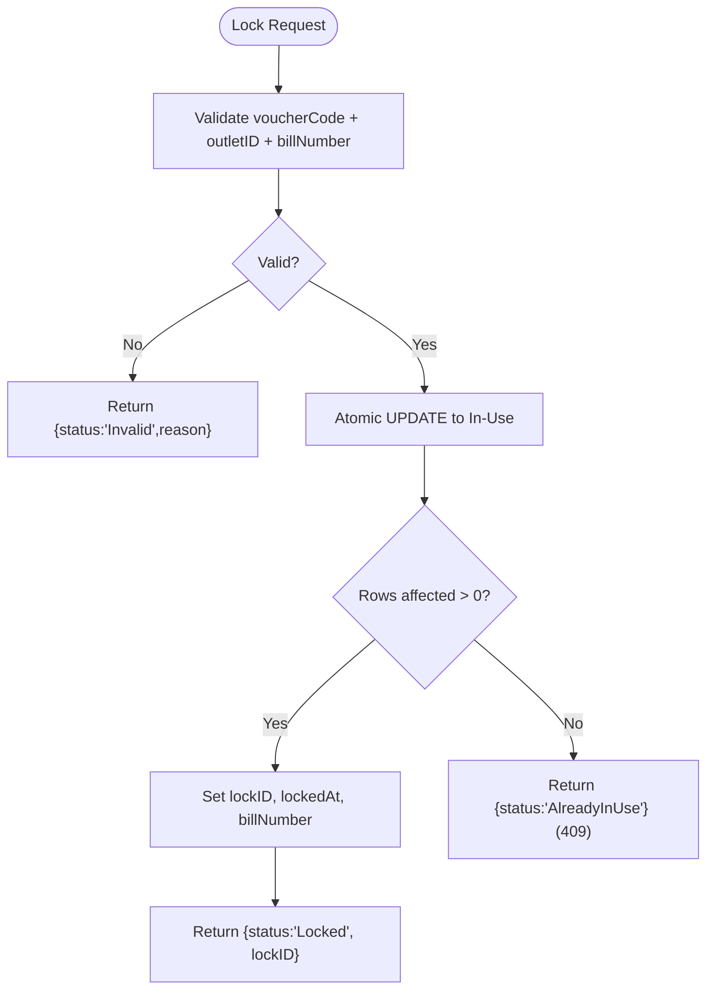
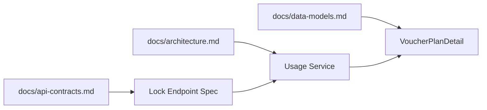

# Lock Voucher Endpoint

<cite>
**Referenced Files in This Document**
- [api-contracts.md](file://docs/api-contracts.md)
- [architecture.md](file://docs/architecture.md)
- [data-models.md](file://docs/data-models.md)
- [4-2-prepare-and-lock.md](file://_bmad-output/implementation-artifacts/4-2-prepare-and-lock.md)
- [4-4-rollback-mechanism.md](file://_bmad-output/implementation-artifacts/4-4-rollback-mechanism.md)
- [4-3-commit-and-log.md](file://_bmad-output/implementation-artifacts/4-3-commit-and-log.md)
- [Key Functionalities.txt](file://Key Functionalities.txt)
</cite>

## Table of Contents
1. [Introduction](#introduction)
2. [Project Structure](#project-structure)
3. [Core Components](#core-components)
4. [Architecture Overview](#architecture-overview)
5. [Detailed Component Analysis](#detailed-component-analysis)
6. [Dependency Analysis](#dependency-analysis)
7. [Performance Considerations](#performance-considerations)
8. [Troubleshooting Guide](#troubleshooting-guide)
9. [Conclusion](#conclusion)
10. [Appendices](#appendices)

## Introduction
This document provides comprehensive API documentation for the POS Integration Lock Voucher endpoint (POST /pos/lock). It explains the lock mechanism, request parameters, lockID generation, and transaction prevention logic. It also covers the In-Use status transition, lock duration management, concurrent access prevention strategies, response schema, error scenarios, integration patterns, security considerations, timeout handling, recovery mechanisms, performance optimization techniques, and debugging approaches.

## Project Structure
The repository organizes POS integration contracts and implementation artifacts under dedicated documentation and B-MAD (Business Model and Design) folders. The Lock Voucher endpoint is defined alongside Verify, Redeem (Commit), and Rollback endpoints.

**Diagram sources**
- [api-contracts.md:1-109](file://docs/api-contracts.md#L1-L109)
- [architecture.md:1-52](file://docs/architecture.md#L1-L52)
- [data-models.md:1-98](file://docs/data-models.md#L1-L98)
- [4-2-prepare-and-lock.md:1-103](file://_bmad-output/implementation-artifacts/4-2-prepare-and-lock.md#L1-L103)
- [4-4-rollback-mechanism.md:1-100](file://_bmad-output/implementation-artifacts/4-4-rollback-mechanism.md#L1-L100)
- [4-3-commit-and-log.md:1-99](file://_bmad-output/implementation-artifacts/4-3-commit-and-log.md#L1-L99)

**Section sources**
- [api-contracts.md:1-109](file://docs/api-contracts.md#L1-L109)
- [4-2-prepare-and-lock.md:1-103](file://_bmad-output/implementation-artifacts/4-2-prepare-and-lock.md#L1-L103)

## Core Components
- POS Lock endpoint: Validates voucher and outlet scope, transitions a Pending voucher to In-Use, generates a lockID, and records transaction context.
- POS Rollback endpoint: Releases an In-Use voucher back to Pending, clearing lock metadata.
- POS Commit (Redeem) endpoint: Permanently marks a voucher as Complete and logs the transaction.
- Data models: VoucherPlanDetail (with UsageStatus and lock fields), VoucherUsage (transaction log), and supporting entities.

**Section sources**
- [api-contracts.md:36-52](file://docs/api-contracts.md#L36-L52)
- [data-models.md:46-54](file://docs/data-models.md#L46-L54)
- [4-2-prepare-and-lock.md:13-20](file://_bmad-output/implementation-artifacts/4-2-prepare-and-lock.md#L13-L20)
- [4-4-rollback-mechanism.md:13-19](file://_bmad-output/implementation-artifacts/4-4-rollback-mechanism.md#L13-L19)
- [4-3-commit-and-log.md:13-19](file://_bmad-output/implementation-artifacts/4-3-commit-and-log.md#L13-L19)

## Architecture Overview
The POS integration follows a three-layer architecture with a Business Logic Layer orchestrating the Usage Service. Locking is the critical concurrency boundary, enforced by atomic database updates and optional background cleanup.

**Diagram sources**
- [architecture.md:17-26](file://docs/architecture.md#L17-L26)
- [api-contracts.md:10-109](file://docs/api-contracts.md#L10-L109)
- [data-models.md:1-98](file://docs/data-models.md#L1-L98)
- [4-2-prepare-and-lock.md:63-67](file://_bmad-output/implementation-artifacts/4-2-prepare-and-lock.md#L63-L67)

## Detailed Component Analysis

### Lock Voucher Endpoint (POST /pos/lock)
- Purpose: Prevent double-spending by atomically transitioning a voucher from Pending to In-Use and returning a lockID.
- Authentication: API Key header (X-API-Key).
- Request parameters:
  - voucherCode: dynamic code for the voucher.
  - outletID: POS outlet identifier.
  - billNumber: transaction context for idempotency and audit.
- Response schema:
  - On success: status "Locked" with lockID GUID.
  - On AlreadyInUse: status "AlreadyInUse" (HTTP 409).
  - On Invalid: status "Invalid" with reason.
- LockID generation: GUID created per lock attempt; stored on the voucher detail record.
- Transaction prevention logic:
  - Atomic UPDATE sets UsageStatus to In-Use and records lockID, lockedAt, and billNumber.
  - If no rows affected, another process acquired the lock first.
- Concurrent access prevention:
  - Atomic conditional update pattern ensures single winner.
  - Idempotency: repeated requests with the same (voucherId, outletId, billNumber) return the same lockID.
- Lock duration management:
  - Optional expiry: background cleanup releases locks after a period (e.g., 10 minutes) if not committed or rolled back.
- Error scenarios:
  - AlreadyInUse (HTTP 409).
  - Invalid (various reasons: expired, forged, outlet not authorized, used, not yet valid).
- Practical integration patterns:
  - POS verifies the voucher first, then locks; stores lockID locally until commit or rollback.
  - Use billNumber to ensure idempotent retries.
- Security considerations:
  - Dynamic code validation applies.
  - API Key scoped to the outlet; only the locking outlet can roll back.
- Timeout handling and recovery:
  - Expired locks are auto-released; POS should re-verify and re-lock.
  - Rollback can be used to recover from failed transactions.

**Diagram sources**
- [4-2-prepare-and-lock.md:13-20](file://_bmad-output/implementation-artifacts/4-2-prepare-and-lock.md#L13-L20)
- [4-2-prepare-and-lock.md:63-67](file://_bmad-output/implementation-artifacts/4-2-prepare-and-lock.md#L63-L67)
- [api-contracts.md:36-52](file://docs/api-contracts.md#L36-L52)

**Section sources**
- [api-contracts.md:36-52](file://docs/api-contracts.md#L36-L52)
- [4-2-prepare-and-lock.md:13-20](file://_bmad-output/implementation-artifacts/4-2-prepare-and-lock.md#L13-L20)
- [4-2-prepare-and-lock.md:22-26](file://_bmad-output/implementation-artifacts/4-2-prepare-and-lock.md#L22-L26)
- [4-2-prepare-and-lock.md:28-32](file://_bmad-output/implementation-artifacts/4-2-prepare-and-lock.md#L28-L32)
- [4-2-prepare-and-lock.md:34-38](file://_bmad-output/implementation-artifacts/4-2-prepare-and-lock.md#L34-L38)
- [4-2-prepare-and-lock.md:63-67](file://_bmad-output/implementation-artifacts/4-2-prepare-and-lock.md#L63-L67)
- [4-2-prepare-and-lock.md:83-89](file://_bmad-output/implementation-artifacts/4-2-prepare-and-lock.md#L83-L89)

### In-Use Status Transition and Lock Metadata
- Transition: Pending → In-Use via atomic UPDATE.
- Metadata recorded: lockID (GUID), lockedAt (timestamp), billNumber (context).
- Idempotency: Same billNumber yields same lockID without second lock.

**Diagram sources**
- [4-2-prepare-and-lock.md:13-20](file://_bmad-output/implementation-artifacts/4-2-prepare-and-lock.md#L13-L20)
- [4-2-prepare-and-lock.md:63-67](file://_bmad-output/implementation-artifacts/4-2-prepare-and-lock.md#L63-L67)

**Section sources**
- [4-2-prepare-and-lock.md:13-20](file://_bmad-output/implementation-artifacts/4-2-prepare-and-lock.md#L13-L20)
- [4-2-prepare-and-lock.md:63-67](file://_bmad-output/implementation-artifacts/4-2-prepare-and-lock.md#L63-L67)

### Lock Duration Management and Cleanup
- Optional expiry: background cleanup service periodically releases locks older than a threshold.
- Query-time fallback: treat locks older than X minutes as expired.
- Recovery: POS re-verifies and re-locks; rollback is not required for expired locks.

**Section sources**
- [4-2-prepare-and-lock.md:28-32](file://_bmad-output/implementation-artifacts/4-2-prepare-and-lock.md#L28-L32)
- [4-2-prepare-and-lock.md:47-50](file://_bmad-output/implementation-artifacts/4-2-prepare-and-lock.md#L47-L50)

### Concurrent Access Prevention Strategies
- Atomic conditional update prevents race conditions.
- Idempotent lock requests avoid duplicate locks.
- Background cleanup prevents indefinite stalls.

**Section sources**
- [4-2-prepare-and-lock.md:63-67](file://_bmad-output/implementation-artifacts/4-2-prepare-and-lock.md#L63-L67)
- [4-2-prepare-and-lock.md:34-38](file://_bmad-output/implementation-artifacts/4-2-prepare-and-lock.md#L34-L38)
- [4-2-prepare-and-lock.md:47-50](file://_bmad-output/implementation-artifacts/4-2-prepare-and-lock.md#L47-L50)

### Response Schema and Error Handling
- Success: { status: "Locked", lockID: "GUID" }
- AlreadyInUse: { status: "AlreadyInUse" } (HTTP 409)
- Invalid: { status: "Invalid", reason: "..." }

**Section sources**
- [api-contracts.md:46-52](file://docs/api-contracts.md#L46-L52)
- [4-2-prepare-and-lock.md:83-89](file://_bmad-output/implementation-artifacts/4-2-prepare-and-lock.md#L83-L89)

### Integration Patterns and POS Workflow
- Typical POS flow:
  1) Verify voucher (non-mutating).
  2) Lock voucher (mutating, sets In-Use).
  3) Perform transaction; upon success, commit; otherwise, rollback.
- LockID storage: POS persists lockID locally until commit or rollback.
- Idempotency: Retry lock requests with the same billNumber return the same lockID.

**Section sources**
- [4-2-prepare-and-lock.md:34-38](file://_bmad-output/implementation-artifacts/4-2-prepare-and-lock.md#L34-L38)
- [Key Functionalities.txt:135-146](file://Key Functionalities.txt#L135-L146)

### Security Considerations
- Dynamic code validation for voucherCode.
- API Key scoped to the outlet; only the locking outlet can rollback.
- Multi-tenant isolation via BrandID and outlet authorization.

**Section sources**
- [4-2-prepare-and-lock.md:91-94](file://_bmad-output/implementation-artifacts/4-2-prepare-and-lock.md#L91-L94)
- [4-4-rollback-mechanism.md:89-91](file://_bmad-output/implementation-artifacts/4-4-rollback-mechanism.md#L89-L91)
- [architecture.md:36-40](file://docs/architecture.md#L36-L40)

### Rollback and Commit Relationship
- Rollback returns In-Use voucher to Pending, clearing lock metadata.
- Commit permanently marks voucher as Complete and logs the transaction.

**Section sources**
- [4-4-rollback-mechanism.md:13-19](file://_bmad-output/implementation-artifacts/4-4-rollback-mechanism.md#L13-L19)
- [4-3-commit-and-log.md:13-19](file://_bmad-output/implementation-artifacts/4-3-commit-and-log.md#L13-L19)

## Dependency Analysis
The Lock endpoint depends on:
- API contracts for endpoint definition and response schema.
- Architecture for service orchestration and security posture.
- Data models for status transitions and persistence.

**Diagram sources**
- [api-contracts.md:36-52](file://docs/api-contracts.md#L36-L52)
- [architecture.md:17-26](file://docs/architecture.md#L17-L26)
- [data-models.md:34-43](file://docs/data-models.md#L34-L43)

**Section sources**
- [api-contracts.md:36-52](file://docs/api-contracts.md#L36-L52)
- [architecture.md:17-26](file://docs/architecture.md#L17-L26)
- [data-models.md:34-43](file://docs/data-models.md#L34-L43)

## Performance Considerations
- Use atomic conditional updates to minimize contention.
- Keep lock duration short to reduce lock pressure.
- Employ background cleanup to reclaim expired locks promptly.
- Ensure database indexes support UPDATE WHERE and SELECT queries on UsageStatus, lock fields, and transaction identifiers.

[No sources needed since this section provides general guidance]

## Troubleshooting Guide
Common issues and resolutions:
- Duplicate lock attempts: expect same lockID returned (idempotent).
- AlreadyInUse errors: another terminal is processing the same voucher; wait or retry after cleanup.
- Invalid responses: verify voucherCode signature/expiry, outlet authorization, and time-window validity.
- Expired locks: re-verify and re-lock; cleanup will release old locks.
- Rollback after commit: expect 409 indicating AlreadyCompleted.

**Section sources**
- [4-2-prepare-and-lock.md:34-38](file://_bmad-output/implementation-artifacts/4-2-prepare-and-lock.md#L34-L38)
- [4-2-prepare-and-lock.md:22-26](file://_bmad-output/implementation-artifacts/4-2-prepare-and-lock.md#L22-L26)
- [4-4-rollback-mechanism.md:21-25](file://_bmad-output/implementation-artifacts/4-4-rollback-mechanism.md#L21-L25)
- [4-3-commit-and-log.md:32-36](file://_bmad-output/implementation-artifacts/4-3-commit-and-log.md#L32-L36)

## Conclusion
The Lock Voucher endpoint provides a robust, atomic mechanism to prevent double-spending during POS transactions. By combining dynamic code validation, API Key scoping, atomic database updates, and optional lock expiry, it ensures transaction integrity and supports reliable POS workflows. Proper integration, including lockID storage and idempotent retries, maximizes reliability and performance.

[No sources needed since this section summarizes without analyzing specific files]

## Appendices

### API Definition: POST /pos/lock
- Authentication: X-API-Key
- Request: { voucherCode, outletID, billNumber }
- Success Response: { status: "Locked", lockID: "GUID" }
- Conflict Response: { status: "AlreadyInUse" } (HTTP 409)
- Error Response: { status: "Invalid", reason: "..." }

**Section sources**
- [api-contracts.md:36-52](file://docs/api-contracts.md#L36-L52)
- [4-2-prepare-and-lock.md:83-89](file://_bmad-output/implementation-artifacts/4-2-prepare-and-lock.md#L83-L89)

### Data Model: VoucherPlanDetail (Lock Fields)
- UsageStatus: Pending, In-Use, Complete
- Lock metadata: lockID (GUID), lockedAt (timestamp), billNumber (string)

**Section sources**
- [data-models.md:34-43](file://docs/data-models.md#L34-L43)
- [4-2-prepare-and-lock.md:78-81](file://_bmad-output/implementation-artifacts/4-2-prepare-and-lock.md#L78-L81)