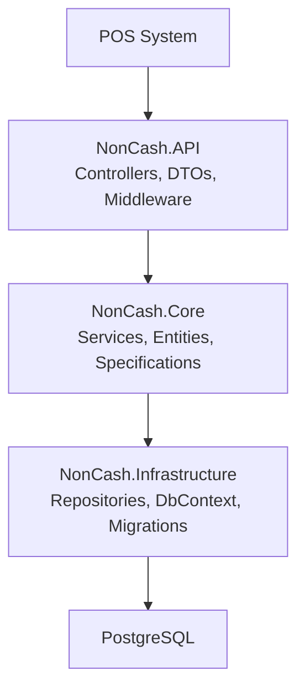
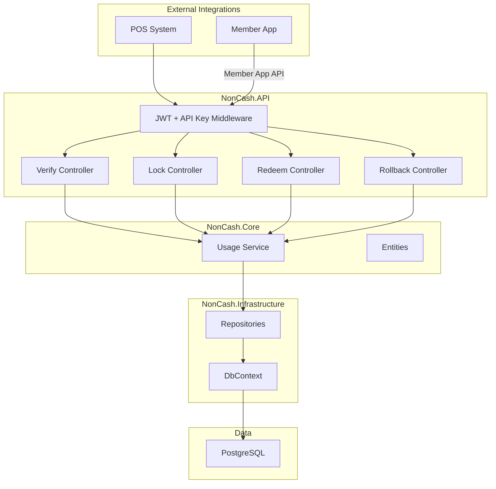
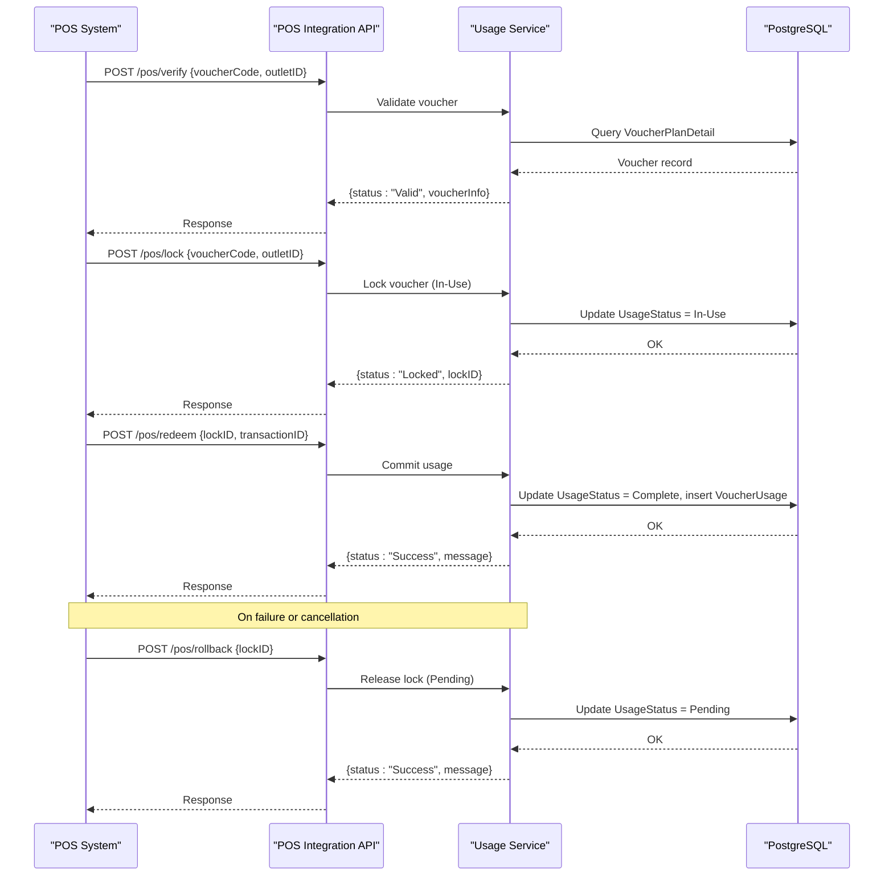
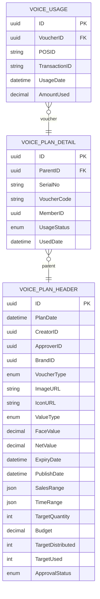
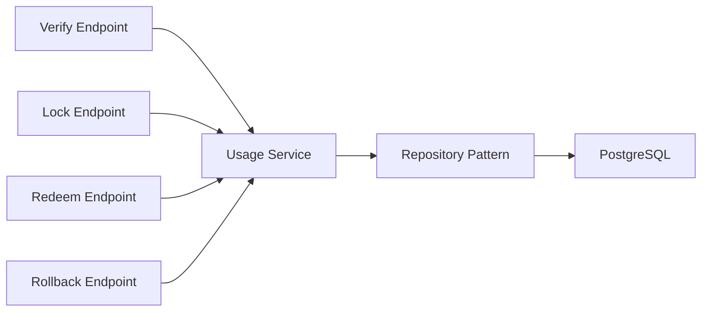
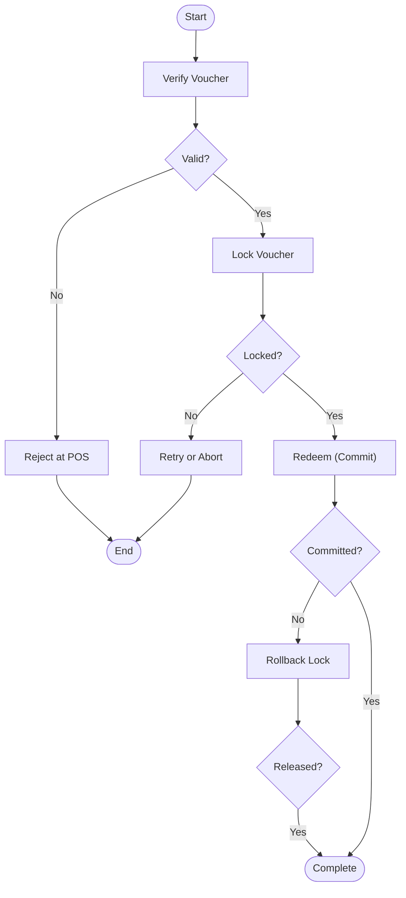

# POS Integration API

<cite>
**Referenced Files in This Document**
- [api-contracts.md](file://docs/api-contracts.md)
- [architecture.md](file://docs/architecture.md)
- [data-models.md](file://docs/data-models.md)
- [Key Functionalities.txt](file://Key Functionalities.txt)
- [implementation-readiness-report-2026-04-17.md](file://_bmad-output/planning-artifacts/implementation-readiness-report-2026-04-17.md)
- [epics.md](file://_bmad-output/planning-artifacts/epics.md)
- [ux-design-specification.md](file://_bmad-output/planning-artifacts/ux-design-specification.md)
</cite>

## Table of Contents
1. [Introduction](#introduction)
2. [Project Structure](#project-structure)
3. [Core Components](#core-components)
4. [Architecture Overview](#architecture-overview)
5. [Detailed Component Analysis](#detailed-component-analysis)
6. [Dependency Analysis](#dependency-analysis)
7. [Performance Considerations](#performance-considerations)
8. [Troubleshooting Guide](#troubleshooting-guide)
9. [Conclusion](#conclusion)
10. [Appendices](#appendices)

## Introduction
This document provides comprehensive API documentation for the POS Integration API focused on voucher verification, locking, redemption, and rollback operations. It covers the four core endpoints:
- POST /pos/verify for voucher validation
- POST /pos/lock for preventing double-spending
- POST /pos/redeem for committing transactions
- POST /pos/rollback for releasing locked vouchers

It also documents authentication requirements using API keys and JWT tokens, error handling strategies, transaction security considerations, and practical implementation guidance for POS system integration, including lockID management, transactionID correlation, and rollback mechanisms. Performance optimization, rate limiting, and debugging approaches are addressed for POS integration scenarios.

## Project Structure
The NonCash platform is a SaaS solution structured with a 3-layer architecture:
- Frontend (Blazor)
- Business Logic Layer (Microservices)
- Data Access Layer (PostgreSQL via Entity Framework)

The POS Integration API resides in the API layer and exposes REST endpoints for POS systems to integrate securely.

**Diagram sources**
- [source-tree-analysis.md:46-49](file://docs/source-tree-analysis.md#L46-L49)
- [architecture.md:9-34](file://docs/architecture.md#L9-L34)

**Section sources**
- [source-tree-analysis.md:36-49](file://docs/source-tree-analysis.md#L36-L49)
- [architecture.md:5-34](file://docs/architecture.md#L5-L34)

## Core Components
This section documents the four POS Integration API endpoints with request/response schemas, authentication, and operational semantics.

- Base URL: https://api.noncash.service/v1
- Authentication:
  - API Key: Header X-API-Key
  - JWT: Bearer Token (Authorization header)
- Format: JSON

### 1. Verify Voucher
Purpose: Checks if a voucher is valid and available for use.

- Endpoint: POST /pos/verify
- Request
  - Fields:
    - voucherCode: string (required)
    - outletID: string (required)
- Response
  - Fields:
    - status: string (example: "Valid")
    - voucherInfo: object
      - faceValue: number
      - expiryDate: string (ISO 8601 date)
      - brand: string

Example request
{
  "voucherCode": "DYNAMIC_CODE_HERE",
  "outletID": "STORE_001"
}

Example response
{
  "status": "Valid",
  "voucherInfo": {
    "faceValue": 100000,
    "expiryDate": "2026-12-31",
    "brand": "The Coffee House"
  }
}

Operational note: Verification does not change the voucher’s usage status.

**Section sources**
- [api-contracts.md:14-34](file://docs/api-contracts.md#L14-L34)
- [Key Functionalities.txt:135-146](file://Key Functionalities.txt#L135-L146)

### 2. Lock Voucher
Purpose: Sets voucher to In-Use status to prevent double-spending during a transaction.

- Endpoint: POST /pos/lock
- Request
  - Fields:
    - voucherCode: string (required)
    - outletID: string (required)
- Response
  - Fields:
    - status: string (example: "Locked")
    - lockID: string (GUID)

Example request
{
  "voucherCode": "DYNAMIC_CODE_HERE",
  "outletID": "STORE_001"
}

Example response
{
  "status": "Locked",
  "lockID": "GUID_LOCK_ID"
}

Operational note: Locking transitions the voucher to In-Use and associates the lock with the outlet.

**Section sources**
- [api-contracts.md:36-52](file://docs/api-contracts.md#L36-L52)
- [Key Functionalities.txt:135-146](file://Key Functionalities.txt#L135-L146)
- [epics.md:278-291](file://_bmad-output/planning-artifacts/epics.md#L278-L291)

### 3. Redeem Voucher (Commit)
Purpose: Finalizes the usage of the voucher after the POS transaction is successful.

- Endpoint: POST /pos/redeem
- Request
  - Fields:
    - lockID: string (required, GUID)
    - transactionID: string (required)
- Response
  - Fields:
    - status: string (example: "Success")
    - message: string (example: "Voucher completed")

Example request
{
  "lockID": "GUID_LOCK_ID",
  "transactionID": "POS_TRANS_12345"
}

Example response
{
  "status": "Success",
  "message": "Voucher completed"
}

Operational note: Commit permanently marks the voucher as used and records usage details.

**Section sources**
- [api-contracts.md:54-70](file://docs/api-contracts.md#L54-L70)
- [Key Functionalities.txt:135-146](file://Key Functionalities.txt#L135-L146)
- [epics.md:292-303](file://_bmad-output/planning-artifacts/epics.md#L292-L303)
- [data-models.md:46-53](file://docs/data-models.md#L46-L53)

### 4. Rollback Lock
Purpose: Unlocks the voucher if the POS transaction fails or is cancelled.

- Endpoint: POST /pos/rollback
- Request
  - Fields:
    - lockID: string (required, GUID)
- Response
  - Fields:
    - status: string (example: "Success")
    - message: string (example: "Voucher released")

Example request
{
  "lockID": "GUID_LOCK_ID"
}

Example response
{
  "status": "Success",
  "message": "Voucher released"
}

Operational note: Rollback returns the voucher to Pending without recording a completed usage.

**Section sources**
- [api-contracts.md:72-87](file://docs/api-contracts.md#L72-L87)
- [Key Functionalities.txt:135-146](file://Key Functionalities.txt#L135-L146)
- [epics.md:305-317](file://_bmad-output/planning-artifacts/epics.md#L305-L317)

## Architecture Overview
The POS Integration API is part of the NonCash.API layer and integrates with the Business Logic Layer (microservices) and Data Access Layer (PostgreSQL). Security is enforced via API Key and JWT. The Usage Service orchestrates POS redemption workflows.

**Diagram sources**
- [source-tree-analysis.md:23-26](file://docs/source-tree-analysis.md#L23-L26)
- [architecture.md:17-34](file://docs/architecture.md#L17-L34)
- [api-contracts.md:5-8](file://docs/api-contracts.md#L5-L8)

**Section sources**
- [architecture.md:17-34](file://docs/architecture.md#L17-L34)
- [api-contracts.md:5-8](file://docs/api-contracts.md#L5-L8)

## Detailed Component Analysis

### End-to-End Redemption Workflow
The POS redemption process follows a transactional pattern: verify, lock, commit, and rollback if needed.

**Diagram sources**
- [api-contracts.md:14-87](file://docs/api-contracts.md#L14-L87)
- [data-models.md:34-53](file://docs/data-models.md#L34-L53)
- [epics.md:278-317](file://_bmad-output/planning-artifacts/epics.md#L278-L317)

**Section sources**
- [api-contracts.md:14-87](file://docs/api-contracts.md#L14-L87)
- [data-models.md:34-53](file://docs/data-models.md#L34-L53)
- [epics.md:278-317](file://_bmad-output/planning-artifacts/epics.md#L278-L317)

### Data Model for POS Transactions
The following entities are central to POS integration:

**Diagram sources**
- [data-models.md:9-98](file://docs/data-models.md#L9-L98)

**Section sources**
- [data-models.md:9-98](file://docs/data-models.md#L9-L98)

### Authentication and Security
- API Key: Provided via header X-API-Key to the POS Integration API.
- JWT: Required for Member App endpoints; POS Integration API supports JWT alongside API Key.
- Dynamic Security: Vouchers use rotating dynamic codes to prevent reuse and unauthorized scanning.
- Multi-tenancy: BrandID isolates data between businesses; POS integrations are locked to specific ranges defined in planning.

**Section sources**
- [api-contracts.md:5-8](file://docs/api-contracts.md#L5-L8)
- [architecture.md:36-40](file://docs/architecture.md#L36-L40)

### Transaction Integrity and Audit
- Transaction Begin/Commit/Rollback: Enforced to ensure data integrity during POS redemption.
- VoucherUsage logging: Captures POSID, TransactionID, UsageDate, and AmountUsed upon successful commit.
- Rollback behavior: Returns voucher to Pending without creating a completed usage record.

**Section sources**
- [implementation-readiness-report-2026-04-17.md:41-47](file://_bmad-output/planning-artifacts/implementation-readiness-report-2026-04-17.md#L41-L47)
- [data-models.md:46-53](file://docs/data-models.md#L46-L53)
- [epics.md:292-317](file://_bmad-output/planning-artifacts/epics.md#L292-L317)

## Dependency Analysis
The POS Integration API depends on the Usage Service for business logic and repositories for persistence. The Usage Service coordinates with the database to enforce transactional integrity.

**Diagram sources**
- [architecture.md:17-34](file://docs/architecture.md#L17-L34)
- [data-models.md:34-53](file://docs/data-models.md#L34-L53)

**Section sources**
- [architecture.md:17-34](file://docs/architecture.md#L17-L34)
- [data-models.md:34-53](file://docs/data-models.md#L34-L53)

## Performance Considerations
- Optimize database queries for voucher lookup and status checks.
- Use connection pooling and efficient indexing on voucher identifiers and usage status.
- Implement short-lived locks to minimize contention; release locks promptly on rollback.
- Employ asynchronous processing for non-blocking IO and reduce latency.
- Monitor and tune PostgreSQL for high-throughput POS scenarios.

[No sources needed since this section provides general guidance]

## Troubleshooting Guide
Common issues and resolutions for POS integration:

- Voucher not found or invalid
  - Verify voucherCode and outletID correctness.
  - Confirm the voucher is within validity period and accepted at the outlet.
- Lock fails or lockID mismatch
  - Ensure the voucher is in Pending status before lock.
  - Validate that the same POS session uses the returned lockID consistently.
- Commit fails unexpectedly
  - Confirm transactionID uniqueness and POS session correlation.
  - Check backend logs for constraint violations or database errors.
- Rollback does not release the voucher
  - Ensure the correct lockID is used and the voucher is still In-Use.
  - Verify that rollback was invoked before the lock expired or timed out.

Debugging tips:
- Enable structured logging for POS requests/responses.
- Correlate transactionID across POS logs, API gateway logs, and backend logs.
- Use monitoring dashboards to track endpoint latencies and error rates.
- Validate JWT and API Key headers at the middleware level.

**Section sources**
- [api-contracts.md:5-8](file://docs/api-contracts.md#L5-L8)
- [epics.md:278-317](file://_bmad-output/planning-artifacts/epics.md#L278-L317)

## Conclusion
The POS Integration API provides a secure, transactional foundation for voucher redemption at point-of-sale systems. By adhering to the documented endpoints, authentication, and operational semantics—especially around lockID management and transactionID correlation—POS systems can reliably verify, lock, redeem, and rollback vouchers while maintaining data integrity and auditability.

[No sources needed since this section summarizes without analyzing specific files]

## Appendices

### Practical Implementation Examples
- LockID management
  - Generate a unique lockID per POS session and persist it locally until commit or rollback.
  - Use the lockID to correlate all subsequent redemption operations.
- TransactionID correlation
  - Derive transactionID from the POS terminal/session to ensure uniqueness and traceability.
  - Include transactionID in the redeem request payload.
- Rollback mechanisms
  - Implement automatic rollback on POS failure or cancellation.
  - Ensure rollback is idempotent and safe to retry.

**Section sources**
- [api-contracts.md:54-87](file://docs/api-contracts.md#L54-L87)
- [epics.md:278-317](file://_bmad-output/planning-artifacts/epics.md#L278-L317)

### Conceptual Workflow (POS Redemption)

[No sources needed since this diagram shows conceptual workflow, not actual code structure]