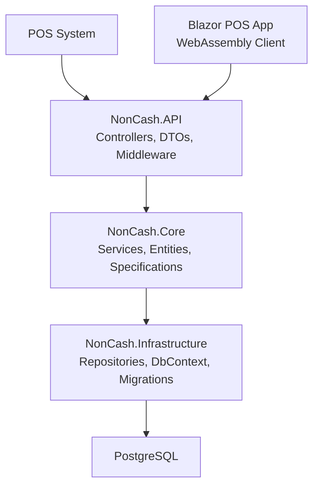
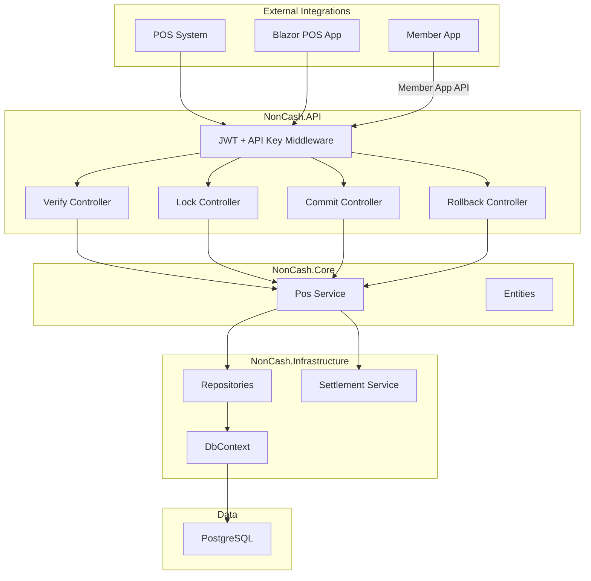
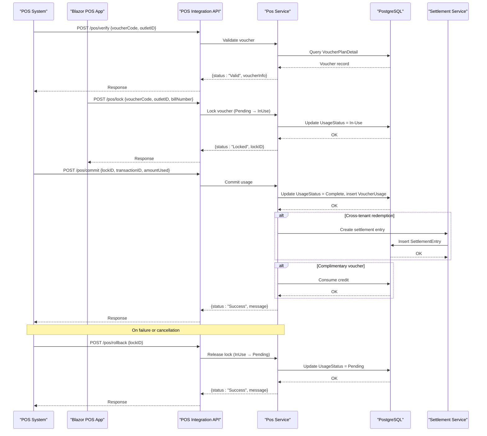
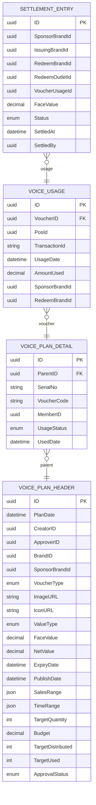
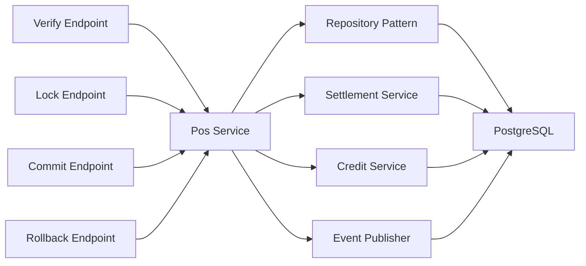
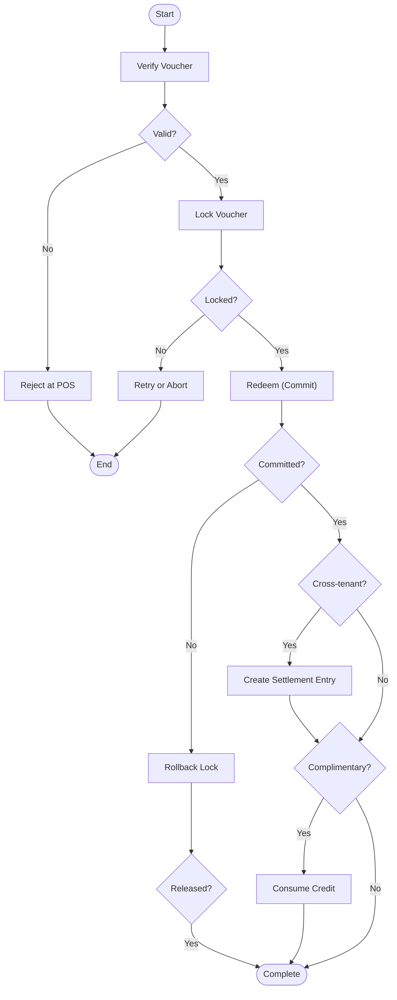
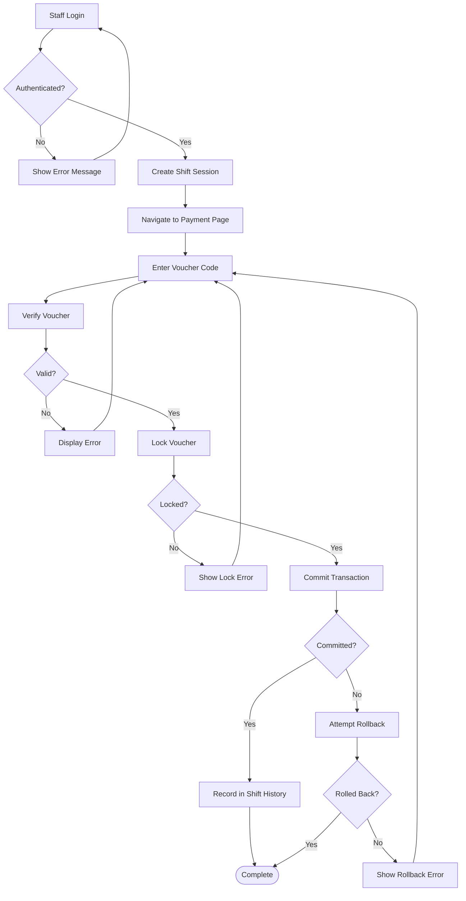

# POS Integration API

<cite>
**Referenced Files in This Document**
- [PosController.cs](file://src/NonCash.API/Controllers/PosController.cs)
- [PosService.cs](file://src/NonCash.Core/Services/PosService.cs)
- [SettlementService.cs](file://src/NonCash.Infrastructure/Services/SettlementService.cs)
- [SettlementEntry.cs](file://src/NonCash.Core/Entities/SettlementEntry.cs)
- [VoucherPlanHeader.cs](file://src/NonCash.Core/Entities/VoucherPlanHeader.cs)
- [VoucherUsage.cs](file://src/NonCash.Core/Entities/VoucherUsage.cs)
- [AuthController.cs](file://src/NonCash.API/Controllers/AuthController.cs)
- [StoreStaffController.cs](file://src/NonCash.API/Controllers/StoreStaffController.cs)
- [StoreStaffService.cs](file://src/NonCash.Core/Services/StoreStaffService.cs)
- [PosAuthService.cs](file://src/NonCash.Pos/Services/PosAuthService.cs)
- [PosApiModels.cs](file://src/NonCash.Pos/Models/PosApiModels.cs)
- [Login.razor](file://src/NonCash.Pos/Pages/Login.razor)
- [Payment.razor](file://src/NonCash.Pos/Pages/Payment.razor)
- [Query.razor](file://src/NonCash.Pos/Pages/Query.razor)
- [api-contracts.md](file://docs/api-contracts.md)
- [architecture.md](file://docs/architecture.md)
- [data-models.md](file://docs/data-models.md)
- [Key Functionalities.txt](file://Key Functionalities.txt)
- [implementation-readiness-report-2026-04-17.md](file://_bmad-output/planning-artifacts/implementation-readiness-report-2026-04-17.md)
- [epics.md](file://_bmad-output/planning-artifacts/epics.md)
- [ux-design-specification.md](file://_bmad-output/planning-artifacts/ux-design-specification.md)
</cite>

## Update Summary
**Changes Made**
- Updated POS endpoints to reflect enhanced settlement entry creation for cross-tenant redemptions
- Added comprehensive documentation for automatic settlement processing
- Enhanced error handling and transaction tracking capabilities
- Updated API request/response schemas to include new fields
- Added settlement ledger integration details
- **New**: Integrated Blazor WebAssembly POS application with complete user interface
- **New**: Enhanced authentication system with staff login and JWT token management
- **New**: Store staff management system with CRUD operations and outlet assignments
- **New**: Shift session management with transaction tracking and audit trails
- **New**: Rate limiting and security enhancements for staff authentication

## Table of Contents
1. [Introduction](#introduction)
2. [Project Structure](#project-structure)
3. [Core Components](#core-components)
4. [Architecture Overview](#architecture-overview)
5. [Detailed Component Analysis](#detailed-component-analysis)
6. [Cross-Tenant Settlement Processing](#cross-tenant-settlement-processing)
7. [Blazor POS Application](#blazor-pos-application)
8. [Staff Authentication and Management](#staff-authentication-and-management)
9. [Dependency Analysis](#dependency-analysis)
10. [Performance Considerations](#performance-considerations)
11. [Troubleshooting Guide](#troubleshooting-guide)
12. [Conclusion](#conclusion)
13. [Appendices](#appendices)

## Introduction
This document provides comprehensive API documentation for the POS Integration API focused on voucher verification, locking, redemption, and rollback operations. It covers the four core endpoints:
- POST /pos/verify for voucher validation
- POST /pos/lock for preventing double-spending  
- POST /pos/commit for committing transactions
- POST /pos/rollback for releasing locked vouchers

The system now includes **automatic settlement entry creation** for cross-tenant redemptions, enhanced error handling, improved transaction tracking, and automatic credit consumption for complimentary vouchers.

**Updated**: The platform now features a complete Blazor WebAssembly POS application with staff authentication, shift management, and comprehensive transaction tracking capabilities.

It also documents authentication requirements using API keys and JWT tokens, error handling strategies, transaction security considerations, and practical implementation guidance for POS system integration, including lockID management, transactionID correlation, and rollback mechanisms. Performance optimization, rate limiting, and debugging approaches are addressed for POS integration scenarios.

## Project Structure
The NonCash platform is a SaaS solution structured with a 3-layer architecture:
- Frontend (Blazor WebAssembly POS Application)
- Business Logic Layer (Microservices)
- Data Access Layer (PostgreSQL via Entity Framework)

The POS Integration API resides in the API layer and exposes REST endpoints for POS systems to integrate securely, complemented by a full-featured Blazor WebAssembly application for direct POS operations.

```mermaid
graph TB
POS["POS System"] --> API["NonCash.API<br/>Controllers, DTOs, Middleware"]
BLAZOR["Blazor POS App<br/>WebAssembly Client"] --> API
API --> BLL["NonCash.Core<br/>Services, Entities, Specifications"]
BLL --> DAL["NonCash.Infrastructure<br/>Repositories, DbContext, Migrations"]
DAL --> DB["PostgreSQL"]
```

**Diagram sources**
- [source-tree-analysis.md:46-49](file://docs/source-tree-analysis.md#L46-L49)
- [architecture.md:9-34](file://docs/architecture.md#L9-L34)

**Section sources**
- [source-tree-analysis.md:36-49](file://docs/source-tree-analysis.md#L36-L49)
- [architecture.md:5-34](file://docs/architecture.md#L5-L34)

## Core Components
This section documents the four POS Integration API endpoints with request/response schemas, authentication, and operational semantics.

- Base URL: https://api.noncash.service/v1
- Authentication:
  - API Key: Header X-API-Key
  - JWT: Bearer Token (Authorization header)
- Format: JSON

### 1. Verify Voucher
Purpose: Checks if a voucher is valid and available for use.

- Endpoint: POST /pos/verify
- Request
  - Fields:
    - voucherCode: string (required)
    - outletID: string (required)
- Response
  - Fields:
    - status: string (example: "Valid")
    - reason: string (optional, for error cases)
    - voucherInfo: object
      - faceValue: number
      - valueType: string (Value or Percentage)
      - expiryDate: string (ISO 8601 date)
      - brandName: string
      - serialNo: string

Example request
{
  "voucherCode": "DYNAMIC_CODE_HERE",
  "outletID": "STORE_001"
}

Example response
{
  "status": "Valid",
  "reason": null,
  "voucherInfo": {
    "faceValue": 100000,
    "valueType": "Value",
    "expiryDate": "2026-12-31",
    "brandName": "The Coffee House",
    "serialNo": "SN123456"
  }
}

Operational note: Verification does not change the voucher's usage status.

**Section sources**
- [PosController.cs:18-52](file://src/NonCash.API/Controllers/PosController.cs#L18-L52)
- [PosService.cs:45-55](file://src/NonCash.Core/Services/PosService.cs#L45-L55)
- [api-contracts.md:14-34](file://docs/api-contracts.md#L14-L34)
- [Key Functionalities.txt:135-146](file://Key Functionalities.txt#L135-L146)

### 2. Lock Voucher
Purpose: Sets voucher to In-Use status to prevent double-spending during a transaction.

- Endpoint: POST /pos/lock
- Request
  - Fields:
    - voucherCode: string (required)
    - outletID: string (required)
    - billNumber: string (required)
    - posNo: string (optional)
    - operatorId: string (optional)
- Response
  - Fields:
    - status: string (example: "Locked")
    - reason: string (optional, for error cases)
    - lockID: string (GUID)
    - voucherInfo: object

Example request
{
  "voucherCode": "DYNAMIC_CODE_HERE",
  "outletID": "STORE_001",
  "billNumber": "BILL_12345",
  "posNo": "POS-01",
  "operatorId": "STAFF_USER_ID"
}

Example response
{
  "status": "Locked",
  "reason": null,
  "lockID": "GUID_LOCK_ID",
  "voucherInfo": {
    "faceValue": 100000,
    "valueType": "Value",
    "expiryDate": "2026-12-31",
    "brandName": "The Coffee House",
    "serialNo": "SN123456"
  }
}

Operational note: Locking transitions the voucher to In-Use and associates the lock with the outlet. The endpoint is idempotent against (voucherId, outletId, billNumber).

**Section sources**
- [PosController.cs:54-95](file://src/NonCash.API/Controllers/PosController.cs#L54-L95)
- [PosService.cs:57-107](file://src/NonCash.Core/Services/PosService.cs#L57-L107)
- [api-contracts.md:36-52](file://docs/api-contracts.md#L36-L52)
- [Key Functionalities.txt:135-146](file://Key Functionalities.txt#L135-L146)
- [epics.md:278-291](file://_bmad-output/planning-artifacts/epics.md#L278-L291)

### 3. Redeem Voucher (Commit)
Purpose: Finalizes the usage of the voucher after the POS transaction is successful.

- Endpoint: POST /pos/commit
- Request
  - Fields:
    - lockID: string (required, GUID)
    - transactionID: string (required)
    - amountUsed: number (required, must be >= 0)
    - posNo: string (optional)
    - operatorId: string (optional)
- Response
  - Fields:
    - status: string (example: "Success")
    - reason: string (optional, for error cases)
    - message: string (example: "Voucher completed")

Example request
{
  "lockID": "GUID_LOCK_ID",
  "transactionID": "POS_TRANS_12345",
  "amountUsed": 100000,
  "posNo": "POS-01",
  "operatorId": "STAFF_USER_ID"
}

Example response
{
  "status": "Success",
  "reason": null,
  "message": "Voucher completed"
}

Operational note: Commit permanently marks the voucher as used and records usage details. For cross-tenant redemptions, automatic settlement entries are created. For complimentary vouchers, automatic credit consumption occurs.

**Section sources**
- [PosController.cs:97-137](file://src/NonCash.API/Controllers/PosController.cs#L97-L137)
- [PosService.cs:109-212](file://src/NonCash.Core/Services/PosService.cs#L109-L212)
- [api-contracts.md:54-70](file://docs/api-contracts.md#L54-L70)
- [Key Functionalities.txt:135-146](file://Key Functionalities.txt#L135-L146)
- [epics.md:292-303](file://_bmad-output/planning-artifacts/epics.md#L292-L303)
- [data-models.md:46-53](file://docs/data-models.md#L46-L53)

### 4. Rollback Lock
Purpose: Unlocks the voucher if the POS transaction fails or is cancelled.

- Endpoint: POST /pos/rollback
- Request
  - Fields:
    - lockID: string (required, GUID)
- Response
  - Fields:
    - status: string (example: "Success")
    - reason: string (optional, for error cases)
    - message: string (example: "Voucher released")

Example request
{
  "lockID": "GUID_LOCK_ID"
}

Example response
{
  "status": "Success",
  "reason": null,
  "message": "Voucher released"
}

Operational note: Rollback returns the voucher to Pending without recording a completed usage. The endpoint is idempotent and handles already-released locks gracefully.

**Section sources**
- [PosController.cs:139-169](file://src/NonCash.API/Controllers/PosController.cs#L139-L169)
- [PosService.cs:214-233](file://src/NonCash.Core/Services/PosService.cs#L214-L233)
- [api-contracts.md:72-87](file://docs/api-contracts.md#L72-L87)
- [Key Functionalities.txt:135-146](file://Key Functionalities.txt#L135-L146)
- [epics.md:305-317](file://_bmad-output/planning-artifacts/epics.md#L305-L317)

## Architecture Overview
The POS Integration API is part of the NonCash.API layer and integrates with the Business Logic Layer (microservices) and Data Access Layer (PostgreSQL). Security is enforced via API Key and JWT. The Usage Service orchestrates POS redemption workflows with enhanced settlement processing.

```mermaid
graph TB
subgraph "External Integrations"
POS["POS System"]
BLAZOR["Blazor POS App"]
APP["Member App"]
end
subgraph "NonCash.API"
CTRL_VERIFY["Verify Controller"]
CTRL_LOCK["Lock Controller"]
CTRL_COMMIT["Commit Controller"]
CTRL_ROLLBACK["Rollback Controller"]
AUTH["JWT + API Key Middleware"]
end
subgraph "NonCash.Core"
SVC_POS["Pos Service"]
ENTITIES["Entities"]
end
subgraph "NonCash.Infrastructure"
REPO["Repositories"]
SETTLEMENT["Settlement Service"]
DBCTX["DbContext"]
end
subgraph "Data"
PG["PostgreSQL"]
end
POS --> AUTH
BLAZOR --> AUTH
AUTH --> CTRL_VERIFY
AUTH --> CTRL_LOCK
AUTH --> CTRL_COMMIT
AUTH --> CTRL_ROLLBACK
CTRL_VERIFY --> SVC_POS
CTRL_LOCK --> SVC_POS
CTRL_COMMIT --> SVC_POS
CTRL_ROLLBACK --> SVC_POS
SVC_POS --> REPO
SVC_POS --> SETTLEMENT
REPO --> DBCTX
DBCTX --> PG
APP --> |"Member App API"| AUTH
```

**Diagram sources**
- [source-tree-analysis.md:23-26](file://docs/source-tree-analysis.md#L23-L26)
- [architecture.md:17-34](file://docs/architecture.md#L17-L34)
- [api-contracts.md:5-8](file://docs/api-contracts.md#L5-L8)

**Section sources**
- [architecture.md:17-34](file://docs/architecture.md#L17-L34)
- [api-contracts.md:5-8](file://docs/api-contracts.md#L5-L8)

## Detailed Component Analysis

### End-to-End Redemption Workflow
The POS redemption process follows a transactional pattern: verify, lock, commit, and rollback if needed.

```mermaid
sequenceDiagram
participant POS as "POS System"
participant BLAZOR as "Blazor POS App"
participant API as "POS Integration API"
participant SVC as "Pos Service"
participant DB as "PostgreSQL"
participant SETT as "Settlement Service"
POS->>API : POST /pos/verify {voucherCode, outletID}
API->>SVC : Validate voucher
SVC->>DB : Query VoucherPlanDetail
DB-->>SVC : Voucher record
SVC-->>API : {status : "Valid", voucherInfo}
API-->>POS : Response
BLAZOR->>API : POST /pos/lock {voucherCode, outletID, billNumber}
API->>SVC : Lock voucher (Pending → InUse)
SVC->>DB : Update UsageStatus = In-Use
DB-->>SVC : OK
SVC-->>API : {status : "Locked", lockID}
API-->>BLAZOR : Response
POS->>API : POST /pos/commit {lockID, transactionID, amountUsed}
API->>SVC : Commit usage
SVC->>DB : Update UsageStatus = Complete, insert VoucherUsage
DB-->>SVC : OK
alt Cross-tenant redemption
SVC->>SETT : Create settlement entry
SETT->>DB : Insert SettlementEntry
DB-->>SETT : OK
end
alt Complimentary voucher
SVC->>DB : Consume credit
DB-->>SVC : OK
end
SVC-->>API : {status : "Success", message}
API-->>POS : Response
Note over POS,SVC : On failure or cancellation
POS->>API : POST /pos/rollback {lockID}
API->>SVC : Release lock (InUse → Pending)
SVC->>DB : Update UsageStatus = Pending
DB-->>SVC : OK
SVC-->>API : {status : "Success", message}
API-->>POS : Response
```

**Diagram sources**
- [PosController.cs:18-169](file://src/NonCash.API/Controllers/PosController.cs#L18-L169)
- [PosService.cs:45-233](file://src/NonCash.Core/Services/PosService.cs#L45-L233)
- [SettlementService.cs:20-48](file://src/NonCash.Infrastructure/Services/SettlementService.cs#L20-L48)

**Section sources**
- [PosController.cs:18-169](file://src/NonCash.API/Controllers/PosController.cs#L18-L169)
- [PosService.cs:45-233](file://src/NonCash.Core/Services/PosService.cs#L45-L233)
- [data-models.md:34-53](file://docs/data-models.md#L34-L53)
- [epics.md:278-317](file://_bmad-output/planning-artifacts/epics.md#L278-L317)

### Data Model for POS Transactions
The following entities are central to POS integration with enhanced cross-tenant tracking:

```mermaid
erDiagram
VOICE_PLAN_DETAIL {
uuid ID PK
uuid ParentID FK
string SerialNo
string VoucherCode
uuid MemberID
enum UsageStatus
datetime UsedDate
}
VOICE_USAGE {
uuid ID PK
uuid VoucherID FK
uuid PosId
string TransactionId
datetime UsageDate
decimal AmountUsed
uuid SponsorBrandId
uuid RedeemBrandId
}
VOICE_PLAN_HEADER {
uuid ID PK
datetime PlanDate
uuid CreatorID
uuid ApproverID
uuid BrandID
uuid SponsorBrandId
enum VoucherType
string ImageURL
string IconURL
enum ValueType
decimal FaceValue
decimal NetValue
datetime ExpiryDate
datetime PublishDate
json SalesRange
json TimeRange
int TargetQuantity
decimal Budget
int TargetDistributed
int TargetUsed
enum ApprovalStatus
}
SETTLEMENT_ENTRY {
uuid ID PK
uuid SponsorBrandId
uuid IssuingBrandId
uuid RedeemBrandId
uuid RedeemOutletId
uuid VoucherUsageId
decimal FaceValue
enum Status
datetime SettledAt
uuid SettledBy
}
VOICE_PLAN_DETAIL }o--|| VOICE_PLAN_HEADER : "parent"
VOICE_USAGE }o--|| VOICE_PLAN_DETAIL : "voucher"
SETTLEMENT_ENTRY }o--|| VOICE_USAGE : "usage"
```

**Diagram sources**
- [data-models.md:9-98](file://docs/data-models.md#L9-L98)
- [VoucherUsage.cs:1-19](file://src/NonCash.Core/Entities/VoucherUsage.cs#L1-L19)
- [SettlementEntry.cs:1-49](file://src/NonCash.Core/Entities/SettlementEntry.cs#L1-L49)
- [VoucherPlanHeader.cs:22-66](file://src/NonCash.Core/Entities/VoucherPlanHeader.cs#L22-L66)

**Section sources**
- [data-models.md:9-98](file://docs/data-models.md#L9-L98)
- [VoucherUsage.cs:1-19](file://src/NonCash.Core/Entities/VoucherUsage.cs#L1-L19)
- [SettlementEntry.cs:1-49](file://src/NonCash.Core/Entities/SettlementEntry.cs#L1-L49)
- [VoucherPlanHeader.cs:22-66](file://src/NonCash.Core/Entities/VoucherPlanHeader.cs#L22-L66)

### Authentication and Security
- API Key: Provided via header X-API-Key to the POS Integration API.
- JWT: Required for Member App endpoints; POS Integration API supports JWT alongside API Key.
- Dynamic Security: Vouchers use rotating dynamic codes to prevent reuse and unauthorized scanning.
- Multi-tenancy: BrandID isolates data between businesses; POS integrations are locked to specific ranges defined in planning.
- Outlet Authorization: Each endpoint validates that the API key matches the requested outlet.
- **Enhanced**: Staff authentication with rate limiting and secure credential handling.

**Section sources**
- [PosController.cs:8-38](file://src/NonCash.API/Controllers/PosController.cs#L8-L38)
- [api-contracts.md:5-8](file://docs/api-contracts.md#L5-L8)
- [architecture.md:36-40](file://docs/architecture.md#L36-L40)

### Transaction Integrity and Audit
- Transaction Begin/Commit/Rollback: Enforced to ensure data integrity during POS redemption.
- VoucherUsage logging: Captures POSID, TransactionID, UsageDate, AmountUsed, SponsorBrandId, and RedeemBrandId upon successful commit.
- Rollback behavior: Returns voucher to Pending without creating a completed usage record.
- Idempotency: All endpoints handle duplicate requests gracefully with appropriate status codes.
- **Enhanced**: Shift session tracking with transaction audit trails.

**Section sources**
- [implementation-readiness-report-2026-04-17.md:41-47](file://_bmad-output/planning-artifacts/implementation-readiness-report-2026-04-17.md#L41-L47)
- [data-models.md:46-53](file://docs/data-models.md#L46-L53)
- [epics.md:292-317](file://_bmad-output/planning-artifacts/epics.md#L292-L317)
- [PosService.cs:117-123](file://src/NonCash.Core/Services/PosService.cs#L117-L123)

## Cross-Tenant Settlement Processing

### Automatic Settlement Entry Creation
When a voucher is redeemed at an outlet belonging to a different brand than the sponsor brand, the system automatically creates a settlement entry to track financial obligations.

**Settlement Creation Process:**
1. During commit, the system resolves sponsor brand from the plan header
2. Determines redeem brand from the outlet
3. If sponsor brand ≠ redeem brand, creates a settlement entry
4. Links the settlement to the original voucher usage
5. Sets initial status to "Pending" for manual settlement processing

**Settlement Entry Fields:**
- `SponsorBrandId`: Brand that sponsored the campaign
- `IssuingBrandId`: Brand that issued the voucher
- `RedeemBrandId`: Brand where the voucher was redeemed
- `RedeemOutletId`: Specific outlet where redemption occurred
- `VoucherUsageId`: Reference to the original usage record
- `FaceValue`: Value of the voucher at redemption time
- `Status`: Settlement lifecycle status (Pending/Settled)

### Credit Consumption for Complimentary Vouchers
For complimentary vouchers, the system automatically consumes 1 credit from the sponsor brand (or issuing brand as fallback) at redemption time. This represents the "value moment" when the voucher is actually used.

**Credit Consumption Rules:**
- Only applies to complimentary vouchers (not gift vouchers)
- Charges are applied to sponsor brand when available
- Falls back to issuing brand if no sponsor is set
- Gift vouchers were already charged at sale time, so no additional charge

**Section sources**
- [PosService.cs:133-183](file://src/NonCash.Core/Services/PosService.cs#L133-L183)
- [SettlementService.cs:20-48](file://src/NonCash.Infrastructure/Services/SettlementService.cs#L20-L48)
- [SettlementEntry.cs:1-49](file://src/NonCash.Core/Entities/SettlementEntry.cs#L1-L49)
- [VoucherPlanHeader.cs:48-49](file://src/NonCash.Core/Entities/VoucherPlanHeader.cs#L48-L49)

## Blazor POS Application

### Overview
The Blazor WebAssembly POS application provides a complete user interface for POS operations, including staff authentication, voucher verification, locking, commitment, and rollback functionality.

### Staff Authentication System
The POS application implements a robust staff authentication system with JWT token management and shift session tracking.

**Authentication Flow:**
1. Staff logs in with username, store code, and password
2. System validates credentials against store staff database
3. JWT token is issued with outlet-specific context
4. Shift session is created with transaction tracking capabilities

**Session Management:**
- Shift sessions track all transactions performed during a staff member's work period
- Automatic session expiration based on JWT token expiry
- Transaction audit trail maintained for each shift
- Support for multiple POS terminals per staff member

### User Interface Features
The POS application provides an intuitive interface with:
- **Login Page**: Staff authentication with optional POS terminal identification
- **Payment Page**: Complete voucher redemption workflow with real-time feedback
- **Query Page**: Standalone voucher verification without locking
- **Shift Summary**: Real-time transaction tracking and reporting

### Transaction Tracking
Each shift maintains a comprehensive audit trail of all transactions:
- Bill numbers and voucher serial numbers
- Amounts used and transaction statuses
- Timestamps and operator information
- Success/failure rates and totals

**Section sources**
- [Login.razor:1-122](file://src/NonCash.Pos/Pages/Login.razor#L1-L122)
- [Payment.razor:1-363](file://src/NonCash.Pos/Pages/Payment.razor#L1-L363)
- [Query.razor:1-188](file://src/NonCash.Pos/Pages/Query.razor#L1-L188)
- [PosAuthService.cs:1-88](file://src/NonCash.Pos/Services/PosAuthService.cs#L1-L88)
- [PosApiModels.cs:1-83](file://src/NonCash.Pos/Models/PosApiModels.cs#L1-L83)

## Staff Authentication and Management

### Staff Login Endpoint
A new staff authentication endpoint has been added to support the Blazor POS application with enhanced security measures.

**Endpoint**: POST /api/v1/auth/staff-login
**Request**:
- username: string (required)
- storeCode: string (required) 
- password: string (required)

**Response**:
- token: string (JWT token)
- expiresAt: DateTime (token expiry)
- user: object (user details)
- outletId: Guid (assigned outlet)

### Store Staff Management System
A comprehensive staff management system allows brand managers to create, update, and manage store staff accounts with outlet assignments.

**Management Capabilities:**
- Create store staff accounts with password and outlet assignments
- Update staff information and passwords
- Lock/unlock staff accounts for security
- Delete staff accounts when no longer needed
- View staff lists with outlet assignments

**Security Features:**
- Role-based access control (Admin and BrandManager roles)
- Brand-scoped operations to prevent cross-brand access
- Rate limiting on authentication endpoints to prevent brute force attacks
- Generic error messages to prevent information disclosure

**Section sources**
- [AuthController.cs:89-107](file://src/NonCash.API/Controllers/AuthController.cs#L89-L107)
- [StoreStaffController.cs:1-241](file://src/NonCash.API/Controllers/StoreStaffController.cs#L1-L241)
- [StoreStaffService.cs:1-175](file://src/NonCash.Core/Services/StoreStaffService.cs#L1-L175)
- [StoreStaffDtos.cs:1-46](file://src/NonCash.API/DTOs/StoreStaffDtos.cs#L1-L46)

## Dependency Analysis
The POS Integration API depends on the Pos Service for business logic and repositories for persistence. The Pos Service coordinates with the database to enforce transactional integrity and integrates with the Settlement Service for cross-tenant processing.

```mermaid
graph LR
VERIFY["Verify Endpoint"] --> POS_SVC["Pos Service"]
LOCK["Lock Endpoint"] --> POS_SVC
COMMIT["Commit Endpoint"] --> POS_SVC
ROLLBACK["Rollback Endpoint"] --> POS_SVC
POS_SVC --> REPO["Repository Pattern"]
POS_SVC --> SETTLEMENT["Settlement Service"]
POS_SVC --> CREDIT["Credit Service"]
POS_SVC --> EVENTS["Event Publisher"]
REPO --> DB["PostgreSQL"]
SETTLEMENT --> DB
CREDIT --> DB
EVENTS --> DB
```

**Diagram sources**
- [architecture.md:17-34](file://docs/architecture.md#L17-L34)
- [data-models.md:34-53](file://docs/data-models.md#L34-L53)
- [PosService.cs:10-17](file://src/NonCash.Core/Services/PosService.cs#L10-L17)

**Section sources**
- [architecture.md:17-34](file://docs/architecture.md#L17-L34)
- [data-models.md:34-53](file://docs/data-models.md#L34-L53)
- [PosService.cs:10-17](file://src/NonCash.Core/Services/PosService.cs#L10-L17)

## Performance Considerations
- Optimize database queries for voucher lookup and status checks.
- Use connection pooling and efficient indexing on voucher identifiers and usage status.
- Implement short-lived locks to minimize contention; release locks promptly on rollback.
- Employ asynchronous processing for non-blocking IO and reduce latency.
- Monitor and tune PostgreSQL for high-throughput POS scenarios.
- **Enhanced**: Settlement entry creation is optimized with idempotency checks to prevent duplicate entries.
- **Enhanced**: Credit consumption operations are designed to be lightweight and non-blocking.
- **New**: Blazor WebAssembly client reduces server load through client-side validation and caching.
- **New**: Staff authentication rate limiting prevents brute force attacks while maintaining performance.

[No sources needed since this section provides general guidance]

## Troubleshooting Guide
Common issues and resolutions for POS integration:

- Voucher not found or invalid
  - Verify voucherCode and outletID correctness.
  - Confirm the voucher is within validity period and accepted at the outlet.
- Lock fails or lockID mismatch
  - Ensure the voucher is in Pending status before lock.
  - Validate that the same POS session uses the returned lockID consistently.
- Commit fails unexpectedly
  - Confirm transactionID uniqueness and POS session correlation.
  - Check backend logs for constraint violations or database errors.
- Rollback does not release the voucher
  - Ensure the correct lockID is used and the voucher is still In-Use.
  - Verify that rollback was invoked before the lock expired or timed out.
- **Enhanced**: Settlement entries not created
  - Verify that sponsor brand differs from redeem brand.
  - Check that the voucher plan has proper sponsor brand configuration.
- **Enhanced**: Credit consumption failures
  - Ensure the sponsor brand has sufficient credits available.
  - Verify that the voucher type is correctly identified as complimentary.
- **New**: Staff authentication issues
  - Verify staff account is active and assigned to the correct outlet.
  - Check rate limiting limits if experiencing authentication failures.
  - Ensure JWT token is properly configured and not expired.
- **New**: Blazor POS application connectivity
  - Verify API key configuration in the POS terminal provisioning.
  - Check network connectivity between POS device and API server.
  - Review browser console for JavaScript errors in the Blazor application.

Debugging tips:
- Enable structured logging for POS requests/responses.
- Correlate transactionID across POS logs, API gateway logs, and backend logs.
- Use monitoring dashboards to track endpoint latencies and error rates.
- Validate JWT and API Key headers at the middleware level.
- **Enhanced**: Monitor settlement ledger for cross-tenant redemption tracking.
- **Enhanced**: Track credit consumption events for complimentary vouchers.
- **New**: Monitor staff authentication attempts and session management.
- **New**: Track Blazor application performance and error rates.

**Section sources**
- [PosController.cs:27-38](file://src/NonCash.API/Controllers/PosController.cs#L27-L38)
- [PosService.cs:117-123](file://src/NonCash.Core/Services/PosService.cs#L117-L123)
- [SettlementService.cs:26-32](file://src/NonCash.Infrastructure/Services/SettlementService.cs#L26-L32)
- [epics.md:278-317](file://_bmad-output/planning-artifacts/epics.md#L278-L317)

## Conclusion
The POS Integration API provides a secure, transactional foundation for voucher redemption at point-of-sale systems with enhanced cross-tenant settlement processing. By adhering to the documented endpoints, authentication, and operational semantics—especially around lockID management, transactionID correlation, and automatic settlement creation—POS systems can reliably verify, lock, redeem, and rollback vouchers while maintaining data integrity and auditability.

**Enhanced**: The platform now includes a complete Blazor WebAssembly POS application with staff authentication, shift management, and comprehensive transaction tracking capabilities. The addition of a robust staff management system enables brand managers to efficiently manage store staff accounts and their outlet assignments.

The system automatically handles complex cross-tenant scenarios by creating settlement entries and managing credit consumption for complimentary vouchers, providing a complete solution for multi-brand voucher ecosystems. The enhanced security measures, including rate limiting and role-based access control, ensure the system remains secure while supporting high-volume POS operations.

[No sources needed since this section summarizes without analyzing specific files]

## Appendices

### Practical Implementation Examples
- LockID management
  - Generate a unique lockID per POS session and persist it locally until commit or rollback.
  - Use the lockID to correlate all subsequent redemption operations.
- TransactionID correlation
  - Derive transactionID from the POS terminal/session to ensure uniqueness and traceability.
  - Include transactionID in the commit request payload.
- Rollback mechanisms
  - Implement automatic rollback on POS failure or cancellation.
  - Ensure rollback is idempotent and safe to retry.
- **Enhanced**: Settlement tracking
  - Monitor settlement ledger for cross-tenant redemptions.
  - Implement settlement reconciliation processes for financial reporting.
- **Enhanced**: Credit management
  - Monitor credit balances for brands offering complimentary vouchers.
  - Implement alerts for low credit situations.
- **New**: Staff authentication integration
  - Implement staff login flow with JWT token management.
  - Handle session expiration and automatic re-authentication.
  - Track staff activity and generate audit reports.
- **New**: Blazor POS application deployment
  - Configure POS terminal provisioning with API keys and outlet information.
  - Set up staff accounts and assign appropriate outlet permissions.
  - Monitor application performance and user experience metrics.

**Section sources**
- [PosController.cs:170-195](file://src/NonCash.API/Controllers/PosController.cs#L170-L195)
- [PosService.cs:117-123](file://src/NonCash.Core/Services/PosService.cs#L117-L123)
- [SettlementService.cs:20-48](file://src/NonCash.Infrastructure/Services/SettlementService.cs#L20-L48)
- [epics.md:278-317](file://_bmad-output/planning-artifacts/epics.md#L278-L317)

### Conceptual Workflow (POS Redemption)

```mermaid
flowchart TD
Start(["Start"]) --> Verify["Verify Voucher"]
Verify --> Valid{"Valid?"}
Valid --> |No| Reject["Reject at POS"]
Valid --> |Yes| Lock["Lock Voucher"]
Lock --> Locked{"Locked?"}
Locked --> |No| Retry["Retry or Abort"]
Locked --> |Yes| Redeem["Redeem (Commit)"]
Redeem --> Committed{"Committed?"}
Committed --> |No| Rollback["Rollback Lock"]
Committed --> |Yes| CheckCrossTenant{"Cross-tenant?"}
CheckCrossTenant --> |Yes| CreateSettlement["Create Settlement Entry"]
CheckCrossTenant --> |No| CheckComplimentary{"Complimentary?"}
CreateSettlement --> CheckComplimentary
CheckComplimentary --> |Yes| ConsumeCredit["Consume Credit"]
CheckComplimentary --> |No| Complete(["Complete"])
ConsumeCredit --> Complete
Rollback --> Released{"Released?"}
Released --> |Yes| Complete
Reject --> End(["End"])
Retry --> End
```

[No sources needed since this diagram shows conceptual workflow, not actual code structure]

### Blazor POS Application Workflow

```mermaid
flowchart TD
StaffLogin["Staff Login"] --> AuthCheck{"Authenticated?"}
AuthCheck --> |No| ShowError["Show Error Message"]
AuthCheck --> |Yes| CreateSession["Create Shift Session"]
CreateSession --> NavigateToPayment["Navigate to Payment Page"]
NavigateToPayment --> EnterVoucher["Enter Voucher Code"]
EnterVoucher --> VerifyVoucher["Verify Voucher"]
VerifyVoucher --> Valid{"Valid?"}
Valid --> |No| DisplayError["Display Error"]
Valid --> |Yes| LockVoucher["Lock Voucher"]
LockVoucher --> LockSuccess{"Locked?"}
LockSuccess --> |No| ShowLockError["Show Lock Error"]
LockSuccess --> |Yes| CommitTransaction["Commit Transaction"]
CommitTransaction --> CommitSuccess{"Committed?"}
CommitSuccess --> |No| RollbackAttempt["Attempt Rollback"]
CommitSuccess --> |Yes| RecordTransaction["Record in Shift History"]
RecordTransaction --> Complete(["Complete"])
RollbackAttempt --> RollbackSuccess{"Rolled Back?"}
RollbackSuccess --> |Yes| Complete
RollbackSuccess --> |No| ShowRollbackError["Show Rollback Error"]
ShowError --> StaffLogin
DisplayError --> EnterVoucher
ShowLockError --> EnterVoucher
ShowRollbackError --> EnterVoucher
```

[No sources needed since this diagram shows conceptual workflow, not actual code structure]