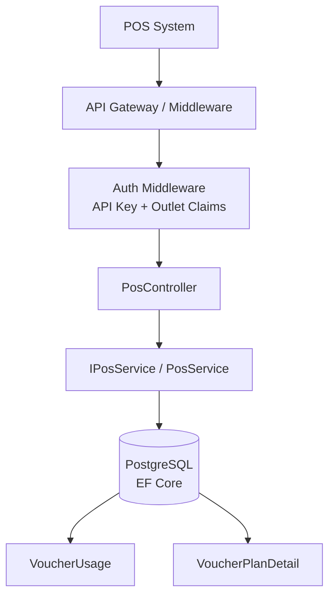
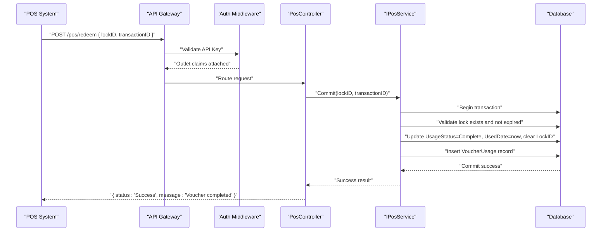
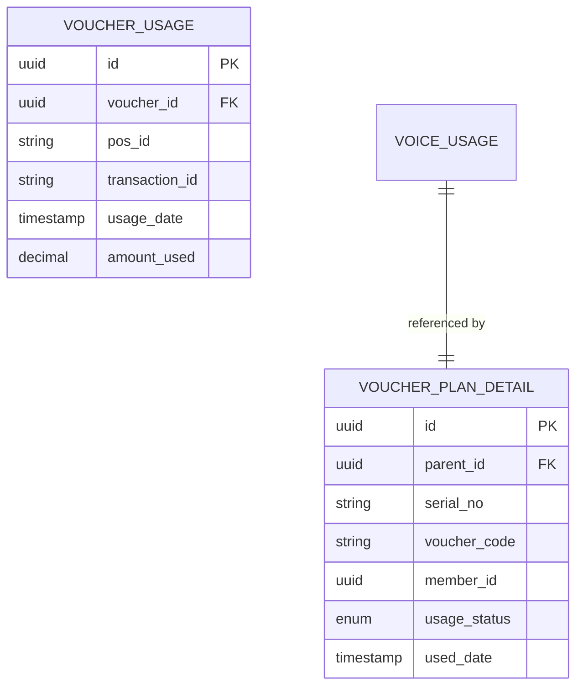
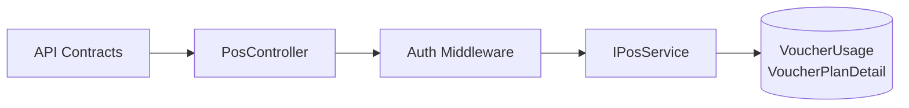

# Redeem Voucher Endpoint

<cite>
**Referenced Files in This Document**
- [api-contracts.md](file://docs/api-contracts.md)
- [architecture.md](file://docs/architecture.md)
- [data-models.md](file://docs/data-models.md)
- [4-1-check-for-information.md](file://_bmad-output/implementation-artifacts/4-1-check-for-information.md)
- [4-2-prepare-and-lock.md](file://_bmad-output/implementation-artifacts/4-2-prepare-and-lock.md)
- [4-3-commit-and-log.md](file://_bmad-output/implementation-artifacts/4-3-commit-and-log.md)
- [4-4-rollback-mechanism.md](file://_bmad-output/implementation-artifacts/4-4-rollback-mechanism.md)
- [Key Functionalities.txt](file://Key Functionalities.txt)
</cite>

## Table of Contents
1. [Introduction](#introduction)
2. [Project Structure](#project-structure)
3. [Core Components](#core-components)
4. [Architecture Overview](#architecture-overview)
5. [Detailed Component Analysis](#detailed-component-analysis)
6. [Dependency Analysis](#dependency-analysis)
7. [Performance Considerations](#performance-considerations)
8. [Troubleshooting Guide](#troubleshooting-guide)
9. [Conclusion](#conclusion)
10. [Appendices](#appendices)

## Introduction
This document provides comprehensive API documentation for the POS Integration Redeem Voucher endpoint (POST /pos/redeem). It explains the commit transaction process, including lockID validation, transactionID correlation, and finalization logic. It also covers successful redemption workflow, status updates, audit trail creation, and security considerations such as idempotency and transaction consistency guarantees. Practical implementation examples and troubleshooting guidance are included to support reliable integration.

## Project Structure
The NonCash platform follows a 3-layer SaaS architecture with microservices in the Business Logic Layer (BLL). The POS integration endpoints are part of the Usage Service and rely on secure authentication (API Key) and dynamic voucher code validation. The endpoint definitions and acceptance criteria are captured in the API contracts and implementation artifacts.

**Diagram sources**
- [architecture.md:17-26](file://docs/architecture.md#L17-L26)
- [api-contracts.md:10-87](file://docs/api-contracts.md#L10-L87)

**Section sources**
- [architecture.md:17-26](file://docs/architecture.md#L17-L26)
- [api-contracts.md:10-87](file://docs/api-contracts.md#L10-L87)

## Core Components
- POS Integration API: Defines the endpoint contracts for verify, lock, redeem (commit), and rollback.
- Usage Service: Orchestrates the POS redemption workflow with strict transaction boundaries.
- Authentication: API Key-based authentication for POS systems; dynamic voucher code validation for security.
- Data Models: VoucherPlanDetail (UsageStatus lifecycle) and VoucherUsage (audit trail).

Key endpoint references:
- POST /pos/redeem: Finalizes a voucher redemption after successful POS transaction.
- Related endpoints: POST /pos/verify, POST /pos/lock, POST /pos/rollback.

**Section sources**
- [api-contracts.md:10-87](file://docs/api-contracts.md#L10-L87)
- [data-models.md:46-53](file://docs/data-models.md#L46-L53)
- [Key Functionalities.txt:135-146](file://Key Functionalities.txt#L135-L146)

## Architecture Overview
The POS redemption flow is orchestrated by the Usage Service and secured by API Key authentication. The commit operation wraps state changes and audit logging in a single transaction to guarantee consistency.

**Diagram sources**
- [api-contracts.md:54-70](file://docs/api-contracts.md#L54-L70)
- [4-3-commit-and-log.md:13-20](file://_bmad-output/implementation-artifacts/4-3-commit-and-log.md#L13-L20)
- [data-models.md:46-53](file://docs/data-models.md#L46-L53)

## Detailed Component Analysis

### POST /pos/redeem (Redeem Voucher)
Purpose: Finalizes a voucher redemption after a successful POS transaction. Requires a valid lockID and a transactionID that links the redemption to the POS transaction.

Request schema:
- lockID: string (required)
- transactionID: string (required)

Response schema:
- status: string ("Success")
- message: string ("Voucher completed")

Validation and processing:
- Lock validation: The system verifies that the lockID exists, belongs to the same voucher, and is not expired. If the lock is expired, the system rejects the request with a lock-expired condition.
- Transaction correlation: The transactionID is recorded in the VoucherUsage table to enable audit and reconciliation.
- Finalization logic: The system atomically transitions the voucher from In-Use to Complete, sets UsedDate, clears the LockID, and inserts a VoucherUsage record within a single transaction.

Idempotency: Duplicate redeem requests with the same transactionID are handled safely to avoid duplicate audit entries.

Security considerations:
- API Key authentication ensures only authorized POS outlets can redeem.
- Dynamic voucher code validation protects against replay attacks.
- Transaction boundaries prevent partial state changes.

Audit trail: A VoucherUsage record is created with POSID (from API Key context), TransactionID, UsageDate, and AmountUsed.

**Section sources**
- [api-contracts.md:54-70](file://docs/api-contracts.md#L54-L70)
- [4-3-commit-and-log.md:13-20](file://_bmad-output/implementation-artifacts/4-3-commit-and-log.md#L13-L20)
- [data-models.md:46-53](file://docs/data-models.md#L46-L53)
- [Key Functionalities.txt:135-146](file://Key Functionalities.txt#L135-L146)

### Supporting Workflows

#### Verify Voucher (POST /pos/verify)
- Purpose: Read-only check of voucher validity and eligibility without changing state.
- Authentication: API Key required.
- Outcome: Returns valid status and voucher info if eligible; otherwise returns invalid with reason.

**Section sources**
- [api-contracts.md:14-34](file://docs/api-contracts.md#L14-L34)
- [4-1-check-for-information.md:13-26](file://_bmad-output/implementation-artifacts/4-1-check-for-information.md#L13-L26)

#### Lock Voucher (POST /pos/lock)
- Purpose: Atomically locks a voucher to prevent double-spending.
- Input: voucherCode, outletID, billNumber.
- Output: lockID if successful; already-in-use if another lock exists.
- Idempotency: Same request retried quickly returns the same lockID.

**Section sources**
- [api-contracts.md:36-52](file://docs/api-contracts.md#L36-L52)
- [4-2-prepare-and-lock.md:13-20](file://_bmad-output/implementation-artifacts/4-2-prepare-and-lock.md#L13-L20)

#### Rollback Lock (POST /pos/rollback)
- Purpose: Releases a lock if the POS transaction fails or is canceled.
- Input: lockID.
- Behavior: Resets voucher to Pending, clears lock fields; rejects if voucher is already Complete.

**Section sources**
- [api-contracts.md:72-87](file://docs/api-contracts.md#L72-L87)
- [4-4-rollback-mechanism.md:13-19](file://_bmad-output/implementation-artifacts/4-4-rollback-mechanism.md#L13-L19)

### Data Models Involved

**Diagram sources**
- [data-models.md:34-43](file://docs/data-models.md#L34-L43)
- [data-models.md:46-53](file://docs/data-models.md#L46-L53)

## Dependency Analysis
The redeem endpoint depends on:
- Authentication middleware for API Key validation and outlet claims.
- Usage Service for lock validation, transaction boundary enforcement, and audit logging.
- Database for atomic updates and VoucherUsage persistence.

**Diagram sources**
- [api-contracts.md:10-87](file://docs/api-contracts.md#L10-L87)
- [architecture.md:24-25](file://docs/architecture.md#L24-L25)

**Section sources**
- [api-contracts.md:10-87](file://docs/api-contracts.md#L10-L87)
- [architecture.md:24-25](file://docs/architecture.md#L24-L25)

## Performance Considerations
- Use database transactions for commit to minimize contention and ensure atomicity.
- Indexes on VoucherUsage.TransactionID and VoucherPlanDetail.Id improve lookup performance.
- Batch processing and background cleanup for expired locks reduce stale lock overhead.
- Monitor latency of redeem requests and enforce rate limits at the API gateway to prevent abuse.

[No sources needed since this section provides general guidance]

## Troubleshooting Guide
Common issues and resolutions:
- Invalid lockID or expired lock: Retry verify and lock; ensure lockID freshness.
- Already Completed voucher: Confirm POS transaction was not previously committed.
- Duplicate transactionID: Idempotent behavior prevents duplicate audit entries; deduplicate client-side retries.
- Rollback after commit: Attempted rollback returns completion error; do not attempt rollback on already-complete vouchers.
- Audit trail gaps: Ensure VoucherUsage insert succeeds; investigate transaction failures and retries.

Operational checks:
- Verify lock existence and expiry before redeem.
- Confirm transactionID uniqueness constraints.
- Validate API Key permissions and outlet scope.

**Section sources**
- [4-3-commit-and-log.md:32-42](file://_bmad-output/implementation-artifacts/4-3-commit-and-log.md#L32-L42)
- [4-4-rollback-mechanism.md:21-25](file://_bmad-output/implementation-artifacts/4-4-rollback-mechanism.md#L21-L25)

## Conclusion
The POST /pos/redeem endpoint provides a secure, idempotent, and auditable path to finalize voucher redemptions. By enforcing lock validation, transaction boundaries, and audit logging, the system maintains consistency and traceability. Following the implementation examples and troubleshooting guidance ensures reliable integration and operational stability.

[No sources needed since this section summarizes without analyzing specific files]

## Appendices

### Implementation Examples

Example 1: Successful redemption workflow
- Step 1: Verify voucher (read-only)
- Step 2: Lock voucher (obtain lockID)
- Step 3: Process POS payment
- Step 4: Redeem voucher (commit with lockID and transactionID)
- Step 5: Confirm audit trail in VoucherUsage

Example 2: Error handling for invalid lock
- Symptom: Lock expired or mismatched lockID
- Action: Re-verify, re-lock, then re-attempt redeem

Example 3: Rollback scenario
- Symptom: POS transaction failed
- Action: Rollback lock to release voucher for reuse

**Section sources**
- [api-contracts.md:54-70](file://docs/api-contracts.md#L54-L70)
- [4-2-prepare-and-lock.md:28-32](file://_bmad-output/implementation-artifacts/4-2-prepare-and-lock.md#L28-L32)
- [4-4-rollback-mechanism.md:13-19](file://_bmad-output/implementation-artifacts/4-4-rollback-mechanism.md#L13-L19)

### Security and Idempotency Notes
- API Key authentication restricts access to authorized POS outlets.
- Dynamic voucher code validation prevents static code reuse.
- Idempotency: Redeem and rollback handle duplicate requests safely.
- Transaction integrity: Commit wraps state changes and audit logging in a single transaction.

**Section sources**
- [4-3-commit-and-log.md:38-42](file://_bmad-output/implementation-artifacts/4-3-commit-and-log.md#L38-L42)
- [4-2-prepare-and-lock.md:34-38](file://_bmad-output/implementation-artifacts/4-2-prepare-and-lock.md#L34-L38)
- [Key Functionalities.txt:135-146](file://Key Functionalities.txt#L135-L146)