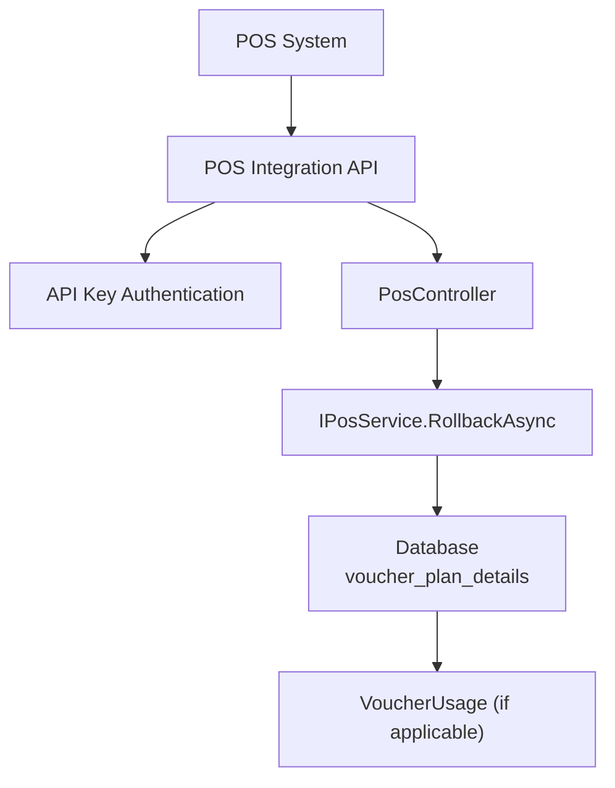
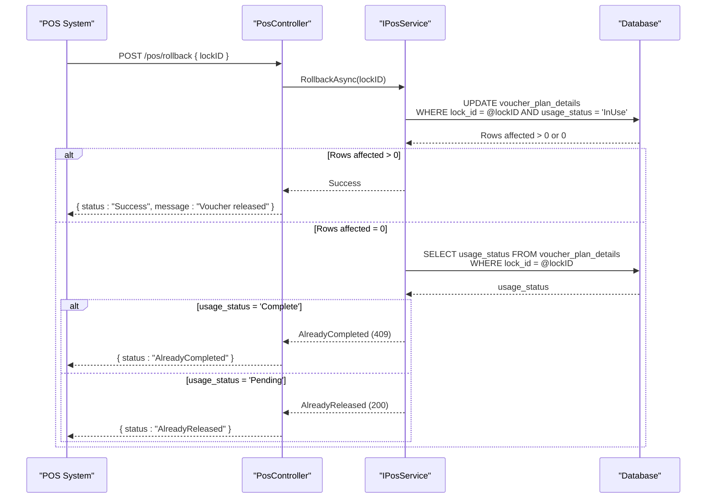
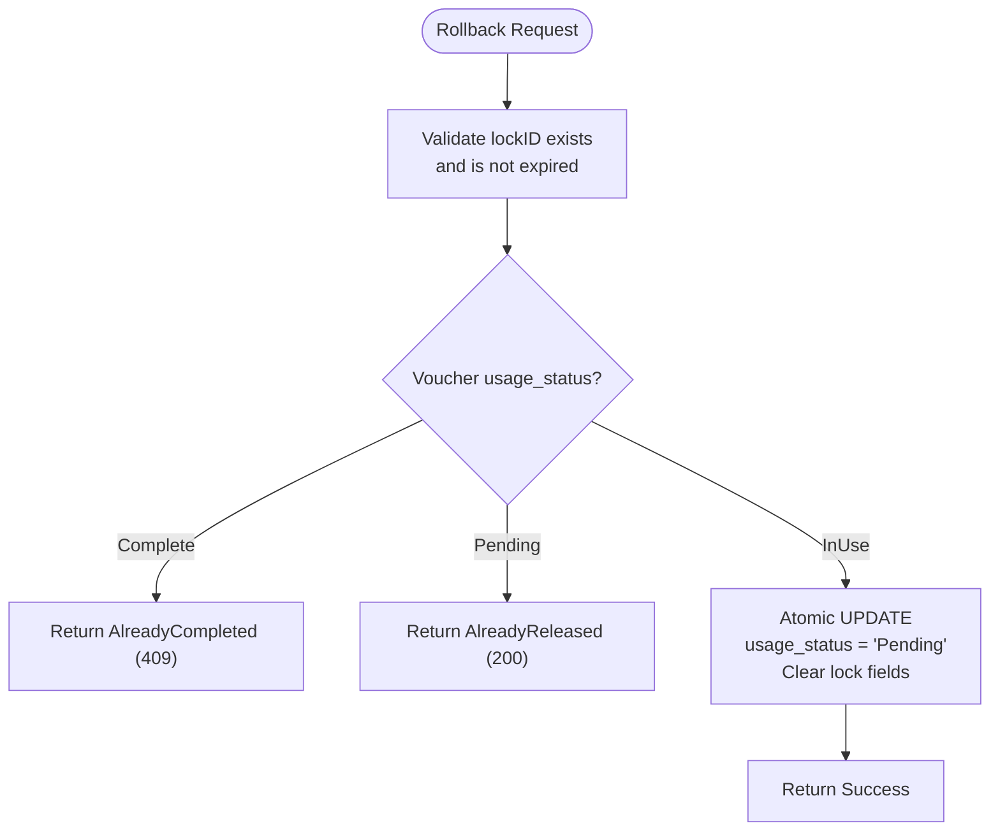
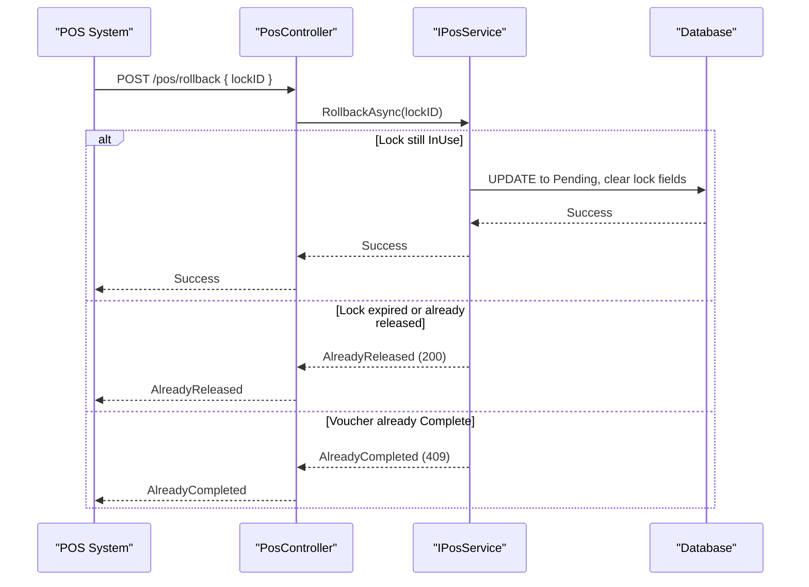
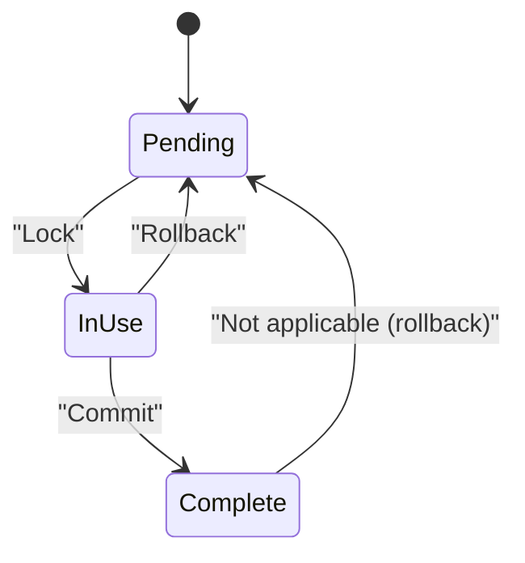
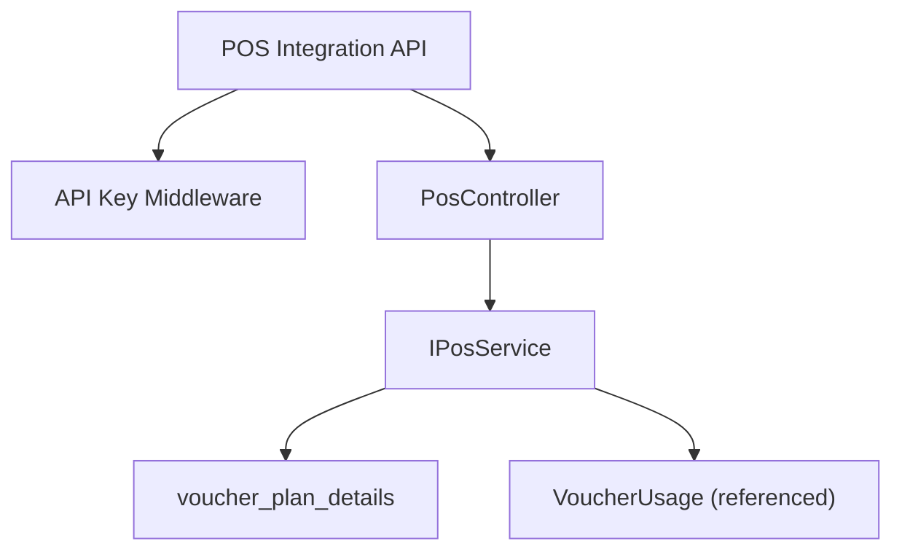

# Rollback Voucher Endpoint

<cite>
**Referenced Files in This Document**
- [api-contracts.md](file://docs/api-contracts.md)
- [architecture.md](file://docs/architecture.md)
- [data-models.md](file://docs/data-models.md)
- [Key Functionalities.txt](file://Key Functionalities.txt)
- [4-2-prepare-and-lock.md](file://_bmad-output/implementation-artifacts/4-2-prepare-and-lock.md)
- [4-4-rollback-mechanism.md](file://_bmad-output/implementation-artifacts/4-4-rollback-mechanism.md)
</cite>

## Table of Contents
1. [Introduction](#introduction)
2. [Project Structure](#project-structure)
3. [Core Components](#core-components)
4. [Architecture Overview](#architecture-overview)
5. [Detailed Component Analysis](#detailed-component-analysis)
6. [Dependency Analysis](#dependency-analysis)
7. [Performance Considerations](#performance-considerations)
8. [Troubleshooting Guide](#troubleshooting-guide)
9. [Conclusion](#conclusion)
10. [Appendices](#appendices)

## Introduction
This document provides comprehensive API documentation for the POS Integration Rollback Voucher endpoint (POST /pos/rollback). It explains the unlock mechanism, including lockID validation, release conditions, and status restoration logic. It also covers the rollback process, transaction cancellation handling, and voucher availability restoration. The document includes detailed request/response schemas, validation checks, success confirmation messages, practical implementation examples, security considerations, race condition prevention, recovery mechanisms, performance implications, monitoring approaches, and troubleshooting guidance.

## Project Structure
The rollback endpoint is part of the POS Integration API group alongside verify, lock, and redeem (commit) endpoints. The endpoint is secured with API Key authentication and follows a consistent JSON contract across POS endpoints. The rollback operation is designed as a compensating transaction to the lock operation, ensuring atomicity and idempotency guarantees.

**Diagram sources**
- [api-contracts.md:10-88](file://docs/api-contracts.md#L10-L88)
- [4-4-rollback-mechanism.md:70-76](file://_bmad-output/implementation-artifacts/4-4-rollback-mechanism.md#L70-L76)

**Section sources**
- [api-contracts.md:10-88](file://docs/api-contracts.md#L10-L88)
- [architecture.md:17-26](file://docs/architecture.md#L17-L26)

## Core Components
- Endpoint: POST /pos/rollback
- Authentication: X-API-Key header
- Request body: { lockID: "guid" }
- Response variants:
  - Success: { status: "Success", message: "Voucher released" }
  - Already Completed: { status: "AlreadyCompleted" } (HTTP 409)
  - Already Released: { status: "AlreadyReleased" } (HTTP 200)

Validation and behavior:
- Validates that a lock exists and is not expired
- Atomically updates UsageStatus back to Pending
- Clears LockID, LockedAt, and BillNumber
- Does NOT create any VoucherUsage record

**Section sources**
- [api-contracts.md:72-87](file://docs/api-contracts.md#L72-L87)
- [4-4-rollback-mechanism.md:13-19](file://_bmad-output/implementation-artifacts/4-4-rollback-mechanism.md#L13-L19)
- [4-4-rollback-mechanism.md:81-87](file://_bmad-output/implementation-artifacts/4-4-rollback-mechanism.md#L81-L87)

## Architecture Overview
The rollback endpoint participates in the POS redemption workflow orchestrated by the Usage Service. It complements the lock and commit operations to ensure transactional safety. The rollback operation mirrors the atomic update pattern used by lock, ensuring that a failed rollback does not leave a voucher stuck in InUse.

**Diagram sources**
- [4-4-rollback-mechanism.md:64-68](file://_bmad-output/implementation-artifacts/4-4-rollback-mechanism.md#L64-L68)
- [4-2-prepare-and-lock.md:63-67](file://_bmad-output/implementation-artifacts/4-2-prepare-and-lock.md#L63-L67)

**Section sources**
- [architecture.md:24](file://docs/architecture.md#L24)
- [4-4-rollback-mechanism.md:64-68](file://_bmad-output/implementation-artifacts/4-4-rollback-mechanism.md#L64-L68)

## Detailed Component Analysis

### Endpoint Definition
- Method: POST
- Path: /pos/rollback
- Authentication: X-API-Key
- Content-Type: application/json

Request schema:
- lockID: string (required, GUID)

Response schemas:
- Success: { status: "Success", message: "Voucher released" }
- Already Completed: { status: "AlreadyCompleted" } (HTTP 409)
- Already Released: { status: "AlreadyReleased" } (HTTP 200)

Validation rules:
- lockID must correspond to a currently InUse voucher
- If the voucher is already Complete, return AlreadyCompleted (409)
- If the voucher is already Pending (due to expired lock auto-release), return AlreadyReleased (200)
- The operation must be atomic and idempotent

**Section sources**
- [api-contracts.md:72-87](file://docs/api-contracts.md#L72-L87)
- [4-4-rollback-mechanism.md:13-19](file://_bmad-output/implementation-artifacts/4-4-rollback-mechanism.md#L13-L19)
- [4-4-rollback-mechanism.md:21-37](file://_bmad-output/implementation-artifacts/4-4-rollback-mechanism.md#L21-L37)

### Unlock Mechanism and Status Restoration
The rollback operation restores the voucher to Pending status and clears lock-related fields. It does not create a VoucherUsage record, distinguishing it from the commit operation.

**Diagram sources**
- [4-4-rollback-mechanism.md:13-19](file://_bmad-output/implementation-artifacts/4-4-rollback-mechanism.md#L13-L19)
- [4-4-rollback-mechanism.md:21-37](file://_bmad-output/implementation-artifacts/4-4-rollback-mechanism.md#L21-L37)

**Section sources**
- [4-4-rollback-mechanism.md:13-19](file://_bmad-output/implementation-artifacts/4-4-rollback-mechanism.md#L13-L19)
- [data-models.md:34-43](file://docs/data-models.md#L34-L43)

### Transaction Cancellation Handling
Rollback serves as the compensating action when a POS transaction is canceled or fails. It ensures the voucher returns to Pending, making it available for subsequent redemptions without creating a usage record.

**Diagram sources**
- [4-4-rollback-mechanism.md:13-19](file://_bmad-output/implementation-artifacts/4-4-rollback-mechanism.md#L13-L19)
- [4-4-rollback-mechanism.md:21-37](file://_bmad-output/implementation-artifacts/4-4-rollback-mechanism.md#L21-L37)

**Section sources**
- [4-4-rollback-mechanism.md:13-19](file://_bmad-output/implementation-artifacts/4-4-rollback-mechanism.md#L13-L19)
- [4-2-prepare-and-lock.md:28-32](file://_bmad-output/implementation-artifacts/4-2-prepare-and-lock.md#L28-L32)

### Voucher Availability Restoration
After rollback, the voucher returns to Pending status, clearing LockID, LockedAt, and BillNumber. This makes the voucher eligible for immediate re-locking and redemption.

**Diagram sources**
- [Key Functionalities.txt:59-62](file://Key Functionalities.txt#L59-L62)
- [4-4-rollback-mechanism.md:17-18](file://_bmad-output/implementation-artifacts/4-4-rollback-mechanism.md#L17-L18)

**Section sources**
- [Key Functionalities.txt:59-62](file://Key Functionalities.txt#L59-L62)
- [4-4-rollback-mechanism.md:17-18](file://_bmad-output/implementation-artifacts/4-4-rollback-mechanism.md#L17-L18)

### Practical Implementation Examples
- Proper rollback initiation:
  - Send POST /pos/rollback with a valid lockID from a previously locked voucher
  - Expect Success response with message indicating the voucher was released
- Error handling for invalid locks:
  - If the voucher is already Complete, expect AlreadyCompleted (409)
  - If the lock has expired and auto-released, expect AlreadyReleased (200)
- Integration patterns with POS transaction failures:
  - On transaction failure, immediately call rollback
  - Retry idempotently if needed; the operation is designed to be safe and repeatable

**Section sources**
- [api-contracts.md:72-87](file://docs/api-contracts.md#L72-L87)
- [4-4-rollback-mechanism.md:33-37](file://_bmad-output/implementation-artifacts/4-4-rollback-mechanism.md#L33-L37)

## Dependency Analysis
The rollback endpoint depends on:
- API authentication (X-API-Key) applied consistently across POS endpoints
- The Usage Service to validate lock existence and enforce atomic updates
- Database-level constraints to ensure rollback safety and idempotency

**Diagram sources**
- [api-contracts.md:5-8](file://docs/api-contracts.md#L5-L8)
- [4-4-rollback-mechanism.md:70-76](file://_bmad-output/implementation-artifacts/4-4-rollback-mechanism.md#L70-L76)

**Section sources**
- [api-contracts.md:5-8](file://docs/api-contracts.md#L5-L8)
- [4-4-rollback-mechanism.md:70-76](file://_bmad-output/implementation-artifacts/4-4-rollback-mechanism.md#L70-L76)

## Performance Considerations
- Atomic update pattern: The rollback uses an atomic conditional update similar to lock, minimizing contention and avoiding unnecessary retries.
- Idempotency: The operation is designed to be idempotent, reducing the impact of retries.
- Lock expiry: Optional lock expiry prevents indefinite blocking; expired locks are handled gracefully.
- Monitoring: Track rollback success rates, 409 conflicts, and 200 AlreadyReleased responses to identify operational issues.

[No sources needed since this section provides general guidance]

## Troubleshooting Guide
Common scenarios and resolutions:
- 409 AlreadyCompleted: Indicates the voucher was already committed. No rollback is possible; verify POS transaction logs.
- 200 AlreadyReleased: Indicates the lock had already expired and auto-released. The voucher is Pending; no further action is required.
- Idempotent retries: If the same rollback request is sent multiple times, it will succeed without side effects.
- Audit trail: Optional audit logging can be enabled for rollback events to improve traceability.

**Section sources**
- [4-4-rollback-mechanism.md:21-37](file://_bmad-output/implementation-artifacts/4-4-rollback-mechanism.md#L21-L37)
- [4-4-rollback-mechanism.md:39-43](file://_bmad-output/implementation-artifacts/4-4-rollback-mechanism.md#L39-L43)

## Conclusion
The POST /pos/rollback endpoint provides a safe, atomic, and idempotent mechanism to cancel POS transactions and restore voucher availability. It complements the lock and commit operations to ensure transactional integrity and supports robust POS integration workflows with appropriate validation, error handling, and recovery mechanisms.

[No sources needed since this section summarizes without analyzing specific files]

## Appendices

### API Contract Reference
- Endpoint: POST /pos/rollback
- Authentication: X-API-Key
- Request: { lockID: "guid" }
- Responses:
  - Success: { status: "Success", message: "Voucher released" }
  - Already Completed: { status: "AlreadyCompleted" } (HTTP 409)
  - Already Released: { status: "AlreadyReleased" } (HTTP 200)

**Section sources**
- [api-contracts.md:72-87](file://docs/api-contracts.md#L72-L87)

### Data Model Context
- VoucherPlanDetail fields involved in rollback:
  - UsageStatus: transitions to Pending
  - LockID, LockedAt, BillNumber: cleared
- VoucherUsage: not created on rollback (commit is required for usage records)

**Section sources**
- [data-models.md:34-43](file://docs/data-models.md#L34-L43)
- [4-4-rollback-mechanism.md:18-19](file://_bmad-output/implementation-artifacts/4-4-rollback-mechanism.md#L18-L19)