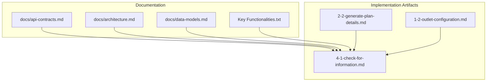
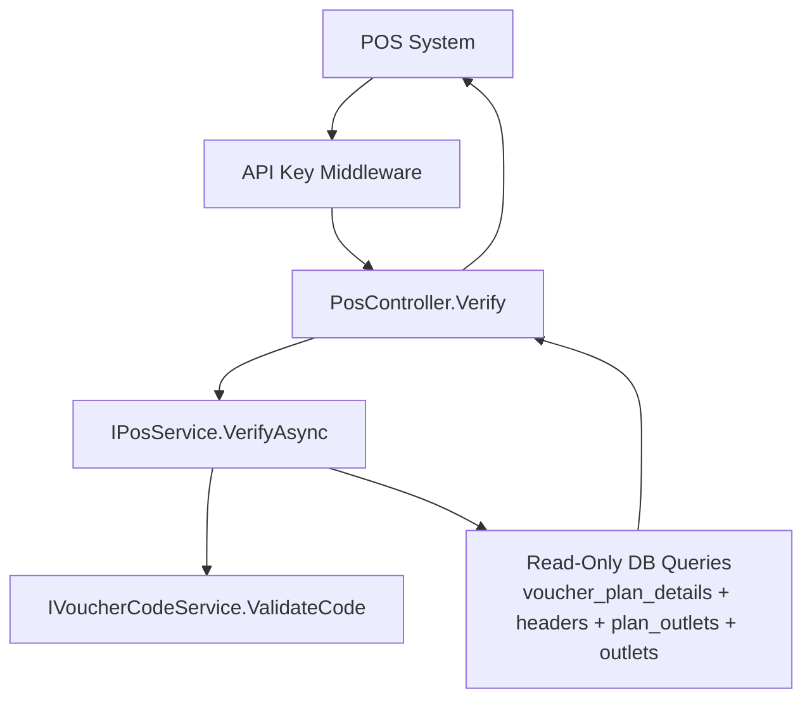
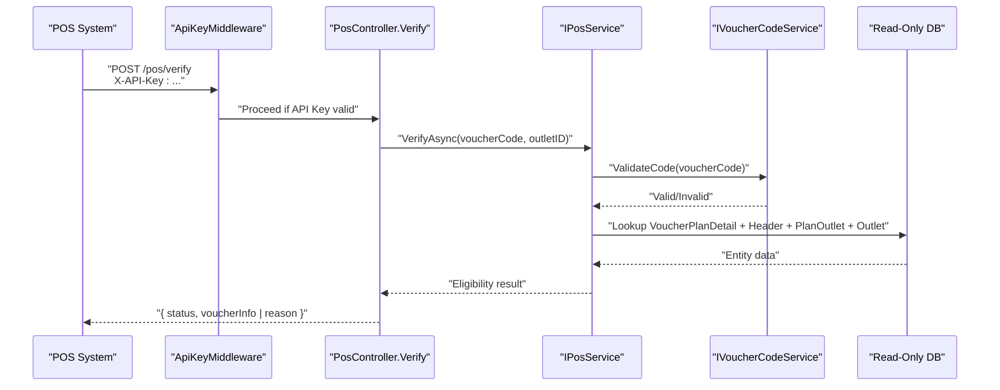
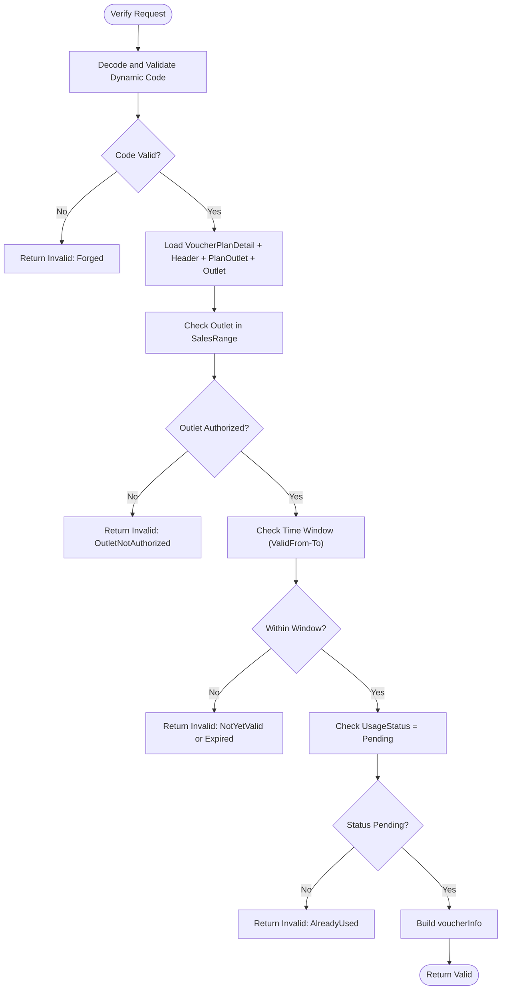
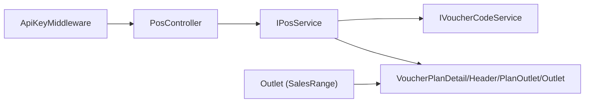

# Verify Voucher Endpoint

<cite>
**Referenced Files in This Document**
- [api-contracts.md](file://docs/api-contracts.md)
- [architecture.md](file://docs/architecture.md)
- [data-models.md](file://docs/data-models.md)
- [Key Functionalities.txt](file://Key Functionalities.txt)
- [4-1-check-for-information.md](file://_bmad-output/implementation-artifacts/4-1-check-for-information.md)
- [2-2-generate-plan-details.md](file://_bmad-output/implementation-artifacts/2-2-generate-plan-details.md)
- [1-2-outlet-configuration.md](file://_bmad-output/implementation-artifacts/1-2-outlet-configuration.md)
</cite>

## Table of Contents
1. [Introduction](#introduction)
2. [Project Structure](#project-structure)
3. [Core Components](#core-components)
4. [Architecture Overview](#architecture-overview)
5. [Detailed Component Analysis](#detailed-component-analysis)
6. [Dependency Analysis](#dependency-analysis)
7. [Performance Considerations](#performance-considerations)
8. [Troubleshooting Guide](#troubleshooting-guide)
9. [Conclusion](#conclusion)
10. [Appendices](#appendices)

## Introduction
This document provides comprehensive API documentation for the POS Integration Verify Voucher endpoint (POST /pos/verify). It covers the complete request and response schema, validation rules for voucherCode and outletID, eligibility checks, and business rules. It also includes practical examples, error handling guidance, performance considerations, caching strategies, and integration patterns tailored for POS systems.

## Project Structure
The repository organizes content around API contracts, architecture, data models, and implementation artifacts. The Verify Voucher endpoint is defined in the API contracts and further detailed in the POS story implementation artifacts. Supporting data models and security architecture inform the endpoint’s behavior.

**Diagram sources**
- [api-contracts.md:14-34](file://docs/api-contracts.md#L14-L34)
- [4-1-check-for-information.md:13-42](file://_bmad-output/implementation-artifacts/4-1-check-for-information.md#L13-L42)

**Section sources**
- [api-contracts.md:14-34](file://docs/api-contracts.md#L14-L34)
- [4-1-check-for-information.md:13-42](file://_bmad-output/implementation-artifacts/4-1-check-for-information.md#L13-L42)

## Core Components
- Endpoint: POST /pos/verify
- Authentication: API Key (X-API-Key) for POS systems
- Request body:
  - voucherCode: string (dynamic code)
  - outletID: string (GUID)
- Response body (Valid):
  - status: "Valid"
  - voucherInfo: {
      faceValue: number
      expiryDate: date string (YYYY-MM-DD)
      brand: string
    }
- Response body (Invalid):
  - status: "Invalid"
  - reason: one of "Expired", "Forged", "OutletNotAuthorized", "AlreadyUsed", "NotYetValid"

Validation and eligibility rules:
- Dynamic code validation: signature and expiry
- Outlet scope: outlet must belong to the plan’s SalesRange
- Time window: within ValidFrom-To and not past ExpiryDate
- Usage status: must be Pending

**Section sources**
- [api-contracts.md:14-34](file://docs/api-contracts.md#L14-L34)
- [4-1-check-for-information.md:13-42](file://_bmad-output/implementation-artifacts/4-1-check-for-information.md#L13-L42)
- [data-models.md:34-43](file://docs/data-models.md#L34-L43)
- [Key Functionalities.txt:135-146](file://Key Functionalities.txt#L135-L146)

## Architecture Overview
The Verify endpoint is part of the POS Integration API and is protected by API Key authentication. It reads from the voucher plan and outlet entities without mutating state. Dynamic code validation leverages a shared secret, and outlet scope enforcement ensures multi-tenant separation.

**Diagram sources**
- [4-1-check-for-information.md:52-59](file://_bmad-output/implementation-artifacts/4-1-check-for-information.md#L52-L59)
- [4-1-check-for-information.md:47-51](file://_bmad-output/implementation-artifacts/4-1-check-for-information.md#L47-L51)
- [2-2-generate-plan-details.md:49-52](file://_bmad-output/implementation-artifacts/2-2-generate-plan-details.md#L49-L52)
- [1-2-outlet-configuration.md:67-70](file://_bmad-output/implementation-artifacts/1-2-outlet-configuration.md#L67-L70)

**Section sources**
- [api-contracts.md:10-16](file://docs/api-contracts.md#L10-L16)
- [4-1-check-for-information.md:67-70](file://_bmad-output/implementation-artifacts/4-1-check-for-information.md#L67-L70)
- [architecture.md:36-41](file://docs/architecture.md#L36-L41)

## Detailed Component Analysis

### Endpoint Definition: POST /pos/verify
- Purpose: Stateless verification of a voucher’s validity and eligibility for a given outlet without changing state.
- Authentication: X-API-Key header validated by ApiKeyMiddleware; JWT middleware follows.
- Request body:
  - voucherCode: string (dynamic code)
  - outletID: string (GUID)
- Response:
  - Valid: status "Valid" with voucherInfo
  - Invalid: status "Invalid" with reason

Validation pipeline:
- Dynamic code decoding and signature verification
- Outlet scope validation against plan SalesRange
- Time window validation (ValidFrom-To and ExpiryDate)
- Usage status check (must be Pending)

**Diagram sources**
- [4-1-check-for-information.md:13-19](file://_bmad-output/implementation-artifacts/4-1-check-for-information.md#L13-L19)
- [4-1-check-for-information.md:47-51](file://_bmad-output/implementation-artifacts/4-1-check-for-information.md#L47-L51)
- [2-2-generate-plan-details.md:49-52](file://_bmad-output/implementation-artifacts/2-2-generate-plan-details.md#L49-L52)
- [1-2-outlet-configuration.md:67-70](file://_bmad-output/implementation-artifacts/1-2-outlet-configuration.md#L67-L70)

**Section sources**
- [api-contracts.md:14-34](file://docs/api-contracts.md#L14-L34)
- [4-1-check-for-information.md:13-42](file://_bmad-output/implementation-artifacts/4-1-check-for-information.md#L13-L42)

### Request Schema
- voucherCode: string (required)
  - Must be a valid, unexpired dynamic code generated by the platform
- outletID: string (required)
  - Must be a valid GUID representing an outlet associated with the plan’s SalesRange

Validation rules:
- Dynamic code must decode and verify against the stored secret
- Current time must be within the plan’s ValidFrom-To window
- ExpiryDate must not have passed
- outletID must appear in the plan’s SalesRange
- UsageStatus must be Pending

**Section sources**
- [4-1-check-for-information.md:13-19](file://_bmad-output/implementation-artifacts/4-1-check-for-information.md#L13-L19)
- [2-2-generate-plan-details.md:36-42](file://_bmad-output/implementation-artifacts/2-2-generate-plan-details.md#L36-L42)
- [data-models.md:34-43](file://docs/data-models.md#L34-L43)

### Response Schema
- Valid response:
  - status: "Valid"
  - voucherInfo:
    - faceValue: number
    - expiryDate: date string (YYYY-MM-DD)
    - brand: string
- Invalid response:
  - status: "Invalid"
  - reason: one of
    - "Expired"
    - "Forged"
    - "OutletNotAuthorized"
    - "AlreadyUsed"
    - "NotYetValid"

HTTP status:
- Prefer 200 OK for invalid responses to avoid POS error handling confusion (per acceptance criteria)

**Section sources**
- [api-contracts.md:24-34](file://docs/api-contracts.md#L24-L34)
- [4-1-check-for-information.md:28-32](file://_bmad-output/implementation-artifacts/4-1-check-for-information.md#L28-L32)

### Eligibility Decision Flow

**Diagram sources**
- [4-1-check-for-information.md:13-19](file://_bmad-output/implementation-artifacts/4-1-check-for-information.md#L13-L19)
- [4-1-check-for-information.md:28-32](file://_bmad-output/implementation-artifacts/4-1-check-for-information.md#L28-L32)
- [data-models.md:34-43](file://docs/data-models.md#L34-L43)

**Section sources**
- [4-1-check-for-information.md:13-42](file://_bmad-output/implementation-artifacts/4-1-check-for-information.md#L13-L42)

### Practical Examples

- Valid request:
  - POST /pos/verify
  - Headers: X-API-Key: <outlet_api_key>
  - Body: {"voucherCode":"...", "outletID":"<GUID>"}
  - Response: {"status":"Valid","voucherInfo":{"faceValue":100000,"expiryDate":"2026-12-31","brand":"The Coffee House"}}

- Invalid: expired
  - Response: {"status":"Invalid","reason":"Expired"}

- Invalid: forged
  - Response: {"status":"Invalid","reason":"Forged"}

- Invalid: outlet not authorized
  - Response: {"status":"Invalid","reason":"OutletNotAuthorized"}

- Invalid: already used
  - Response: {"status":"Invalid","reason":"AlreadyUsed"}

- Invalid: not yet valid
  - Response: {"status":"Invalid","reason":"NotYetValid"}

Note: HTTP status is typically 200 for invalid responses to simplify POS handling.

**Section sources**
- [api-contracts.md:14-34](file://docs/api-contracts.md#L14-L34)
- [4-1-check-for-information.md:28-32](file://_bmad-output/implementation-artifacts/4-1-check-for-information.md#L28-L32)

## Dependency Analysis
- PosController.Verify depends on IPosService
- IPosService depends on IVoucherCodeService for dynamic code validation and performs read-only queries across voucher plan entities
- ApiKeyMiddleware authenticates requests before reaching the controller
- Outlet scope enforcement relies on multi-tenancy via BrandID and SalesRange membership

**Diagram sources**
- [4-1-check-for-information.md:52-59](file://_bmad-output/implementation-artifacts/4-1-check-for-information.md#L52-L59)
- [4-1-check-for-information.md:47-51](file://_bmad-output/implementation-artifacts/4-1-check-for-information.md#L47-L51)
- [1-2-outlet-configuration.md:67-70](file://_bmad-output/implementation-artifacts/1-2-outlet-configuration.md#L67-L70)

**Section sources**
- [4-1-check-for-information.md:52-59](file://_bmad-output/implementation-artifacts/4-1-check-for-information.md#L52-L59)
- [1-2-outlet-configuration.md:67-70](file://_bmad-output/implementation-artifacts/1-2-outlet-configuration.md#L67-L70)

## Performance Considerations
- Stateless verify: no database writes reduce contention and latency
- Prefer read replicas or connection pooling for read-heavy queries
- Optimize joins across voucher_plan_details, headers, plan_outlets, and outlets
- Cache frequently accessed plan metadata at the edge (e.g., SalesRange lists) with TTL
- Rate-limit verify calls per API key to prevent abuse
- Monitor latency and error rates; alert on sustained increases

[No sources needed since this section provides general guidance]

## Troubleshooting Guide
Common failure modes and resolutions:
- Invalid: Forged
  - Cause: Code signature mismatch or tampering
  - Action: Regenerate code client-side; ensure server secret alignment
- Invalid: Expired
  - Cause: Code expiry exceeded
  - Action: Refresh code from the Member App or regenerate endpoint
- Invalid: OutletNotAuthorized
  - Cause: outletID not in plan SalesRange
  - Action: Confirm outlet configuration and plan SalesRange
- Invalid: AlreadyUsed
  - Cause: UsageStatus != Pending
  - Action: Inform cashier; do not attempt redemption
- Invalid: NotYetValid
  - Cause: Current time outside ValidFrom-To window
  - Action: Wait until valid period; confirm plan dates
- API Key rejected
  - Cause: Missing or invalid X-API-Key
  - Action: Provision correct API key for the outlet; rotate keys periodically

Debugging tips:
- Log request correlation IDs for each verify call
- Capture voucherCode and outletID for audit trails
- Validate time synchronization between POS and backend
- Confirm database connectivity and read permissions

**Section sources**
- [4-1-check-for-information.md:28-32](file://_bmad-output/implementation-artifacts/4-1-check-for-information.md#L28-L32)
- [4-1-check-for-information.md:34-37](file://_bmad-output/implementation-artifacts/4-1-check-for-information.md#L34-L37)
- [4-1-check-for-information.md:39-42](file://_bmad-output/implementation-artifacts/4-1-check-for-information.md#L39-L42)
- [1-2-outlet-configuration.md:95-97](file://_bmad-output/implementation-artifacts/1-2-outlet-configuration.md#L95-L97)

## Conclusion
The Verify Voucher endpoint enables fast, secure, and stateless validation of vouchers at POS systems. By combining dynamic code validation, outlet scope checks, and time-window eligibility, it prevents fraud while supporting seamless checkout experiences. Follow the provided schemas, validation rules, and troubleshooting steps to integrate reliably and maintain high performance.

[No sources needed since this section summarizes without analyzing specific files]

## Appendices

### API Definition Reference
- Endpoint: POST /pos/verify
- Headers: X-API-Key: <outlet_api_key>
- Request: {"voucherCode":"...","outletID":"<GUID>"}
- Response (Valid): {"status":"Valid","voucherInfo":{"faceValue":number,"expiryDate":"YYYY-MM-DD","brand":"string"}}
- Response (Invalid): {"status":"Invalid","reason":"Expired|Forged|OutletNotAuthorized|AlreadyUsed|NotYetValid"}

**Section sources**
- [api-contracts.md:14-34](file://docs/api-contracts.md#L14-L34)

### Data Model Context
- VoucherPlanDetail: contains UsageStatus and links to VoucherPlanHeader
- VoucherPlanHeader: contains SalesRange (list of outletIDs), ValidFrom-To, ExpiryDate
- Outlet: represents physical/digital stores with multi-tenancy via BrandID

**Section sources**
- [data-models.md:34-43](file://docs/data-models.md#L34-L43)
- [data-models.md:65-79](file://docs/data-models.md#L65-L79)

### Security and Multi-Tenancy Notes
- API Key per outlet; hashed storage recommended
- Dynamic codes use a shared secret; short expiry reduces replay risk
- Outlet scope enforced via SalesRange and BrandID multi-tenancy

**Section sources**
- [4-1-check-for-information.md:67-70](file://_bmad-output/implementation-artifacts/4-1-check-for-information.md#L67-L70)
- [2-2-generate-plan-details.md:36-42](file://_bmad-output/implementation-artifacts/2-2-generate-plan-details.md#L36-L42)
- [1-2-outlet-configuration.md:67-70](file://_bmad-output/implementation-artifacts/1-2-outlet-configuration.md#L67-L70)