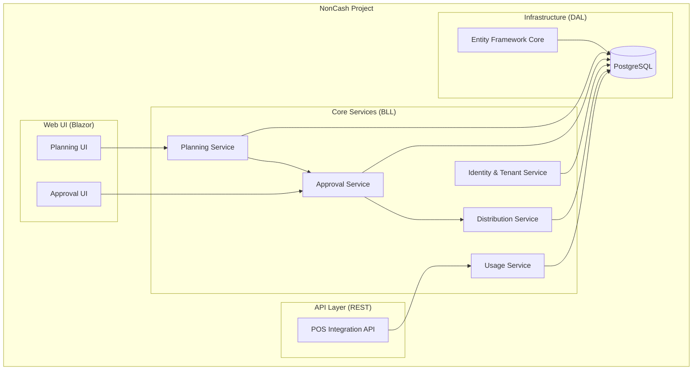
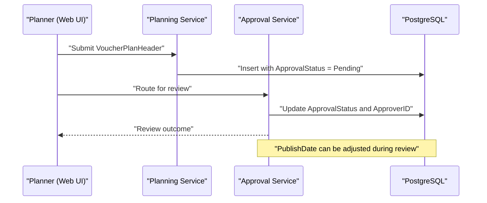
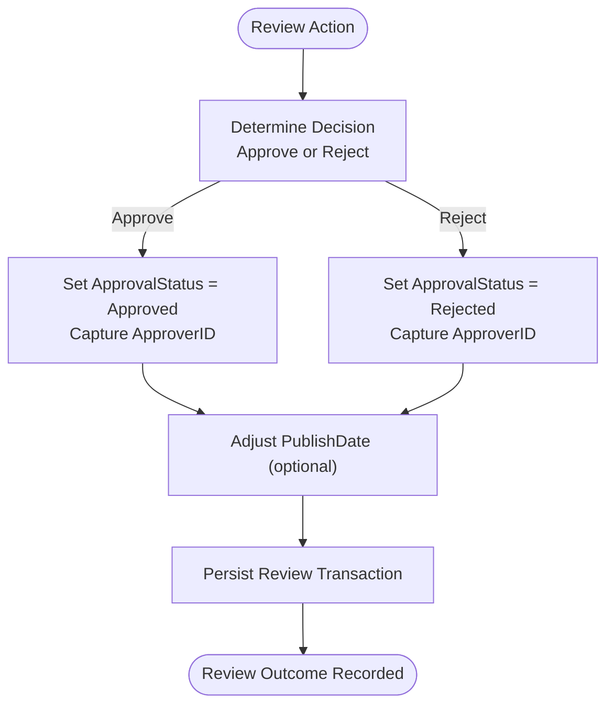
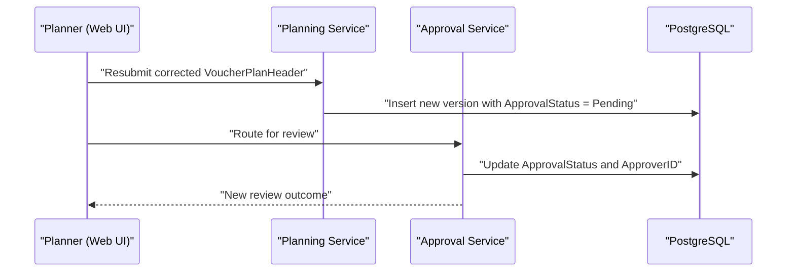
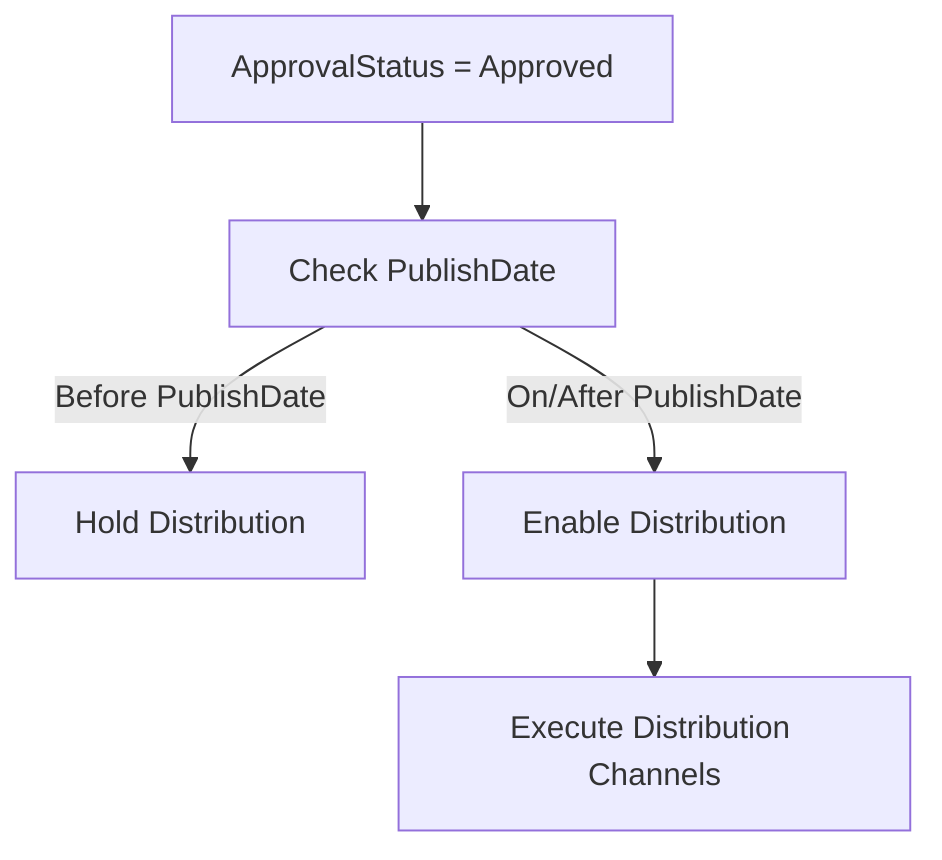
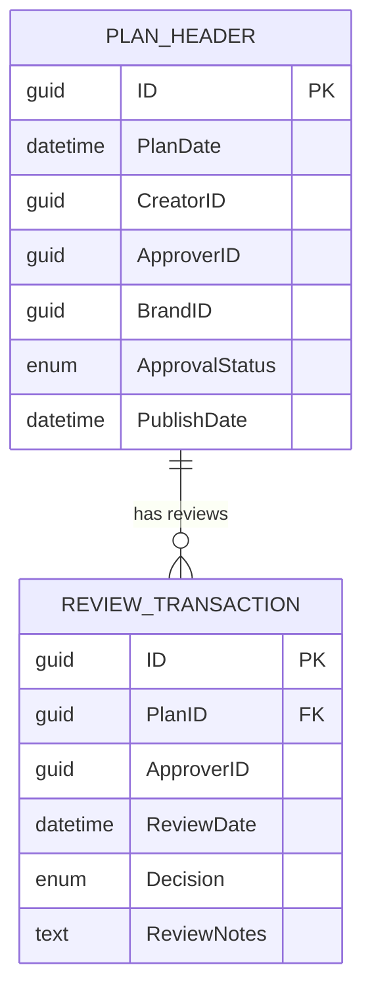
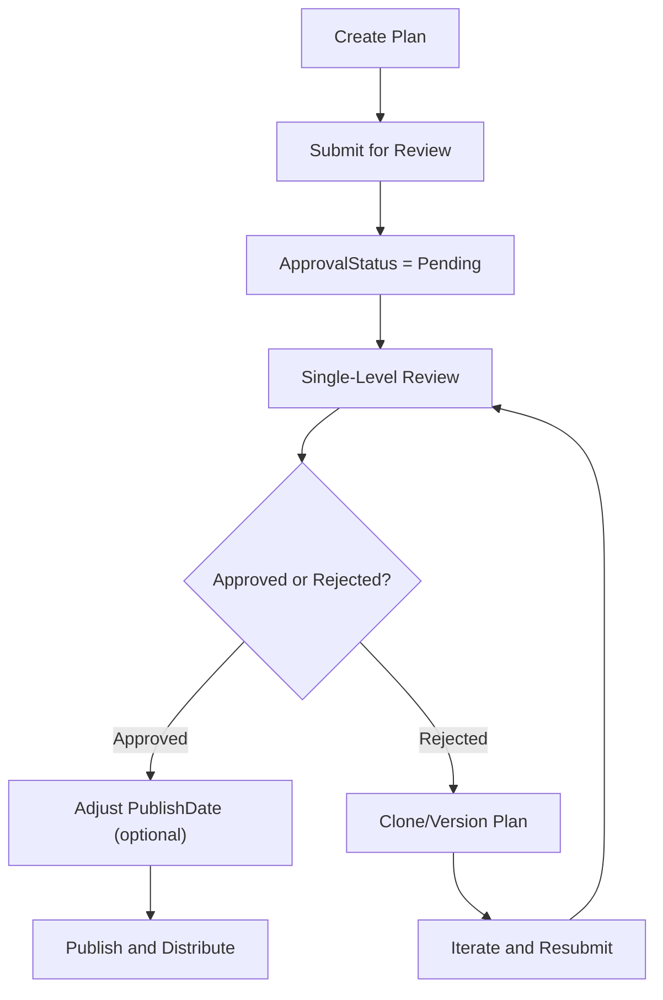
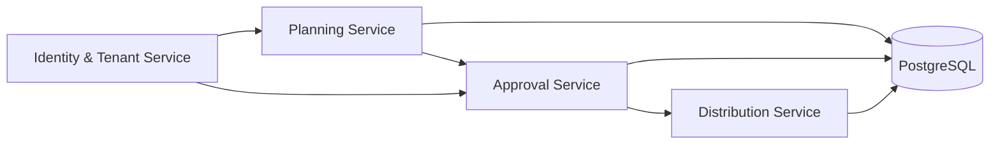

# Approval and Publication Workflow

<cite>
**Referenced Files in This Document**
- [Key Functionalities.txt](file://Key Functionalities.txt)
- [epics.md](file://_bmad-output/planning-artifacts/epics.md)
- [data-models.md](file://docs/data-models.md)
- [architecture.md](file://docs/architecture.md)
- [source-tree-analysis.md](file://docs/source-tree-analysis.md)
</cite>

## Table of Contents
1. [Introduction](#introduction)
2. [Project Structure](#project-structure)
3. [Core Components](#core-components)
4. [Architecture Overview](#architecture-overview)
5. [Detailed Component Analysis](#detailed-component-analysis)
6. [Dependency Analysis](#dependency-analysis)
7. [Performance Considerations](#performance-considerations)
8. [Troubleshooting Guide](#troubleshooting-guide)
9. [Conclusion](#conclusion)

## Introduction
This document explains the approval and publication workflow for voucher plans within the NonCash platform. It covers the single-level review process, the transaction attributes associated with each review action, the ability to adjust the publication date, and the requirement to modify and resubmit plans when rejected. It also documents version control aspects to track approval history and maintain audit trails, along with workflow diagrams illustrating approval routing, rejection handling, and transitions from rejected to approved states.

## Project Structure
The NonCash project follows a 3-layer SaaS architecture with microservices. The approval workflow is part of the Campaign Planning & Approval domain and integrates with the broader planning, distribution, and usage services.

**Diagram sources**
- [source-tree-analysis.md: 7-34:7-34](file://docs/source-tree-analysis.md#L7-L34)
- [architecture.md: 17-26:17-26](file://docs/architecture.md#L17-L26)

**Section sources**
- [source-tree-analysis.md: 7-34:7-34](file://docs/source-tree-analysis.md#L7-L34)
- [architecture.md: 17-26:17-26](file://docs/architecture.md#L17-L26)

## Core Components
- VoucherPlanHeader: Captures plan metadata, creator/approver identifiers, brand association, voucher type, value configuration, validity and publish dates, sales range, time range, target quantities, budget, and approval status.
- VoucherPlanDetail: Generated after approval; contains serial number, dynamic code, optional member assignment, and usage status.
- UserAccount: Supports role-based access control (Planner, Approver) and identifies creators and approvers.
- Approval Service: Manages routing and state transitions for plan reviews.
- Planning Service: Manages plan creation, budgeting, and targets; initializes approval status to Pending upon submission.

**Section sources**
- [data-models.md: 11-43:11-43](file://docs/data-models.md#L11-L43)
- [epics.md: 145-183:145-183](file://_bmad-output/planning-artifacts/epics.md#L145-L183)
- [architecture.md: 21-23:21-23](file://docs/architecture.md#L21-L23)

## Architecture Overview
The approval workflow spans the Web UI, Approval Service, and persistence layer. The Planning Service creates and submits plans with an initial status of Pending. The Approval Service handles the single-level review process, updating the plan’s approval status and recording the approver identity. After approval, the plan can be published and used for distribution based on the publish date.

**Diagram sources**
- [epics.md: 145-183:145-183](file://_bmad-output/planning-artifacts/epics.md#L145-L183)
- [data-models.md: 11-33:11-33](file://docs/data-models.md#L11-L33)

## Detailed Component Analysis

### Single-Level Approval Constraint
- The system enforces a single-level approval process for voucher plans. There is no multi-level routing or escalation; a single manager with the designated role performs the review.
- Implications:
  - Faster turnaround for approvals.
  - Reduced complexity in routing logic.
  - Centralized responsibility for plan governance.

**Section sources**
- [Key Functionalities.txt: 81](file://Key Functionalities.txt#L81)

### Review Transaction Attributes
Each review action records:
- Reviewer identification: The ApproverID is captured automatically upon approval or rejection.
- Review date: Implicitly recorded via the backend timestamp when the approval transaction is persisted.
- Review notes: A field for comments or justification is supported by the workflow definition.
- Decision state: ApprovalStatus transitions to Approved or Rejected.
- Publish date adjustment: The PublishDate can be adjusted during the review process.

**Diagram sources**
- [epics.md: 177-183:177-183](file://_bmad-output/planning-artifacts/epics.md#L177-L183)
- [Key Functionalities.txt: 74-81:74-81](file://Key Functionalities.txt#L74-L81)

**Section sources**
- [epics.md: 177-183:177-183](file://_bmad-output/planning-artifacts/epics.md#L177-L183)
- [Key Functionalities.txt: 74-81:74-81](file://Key Functionalities.txt#L74-L81)

### Rejection Handling and Resubmission
- When a plan is rejected, the planner must adjust the plan and resubmit it for review.
- The system supports cloning or creating a new version from a rejected plan to preserve historical audit trails while iterating on corrections.

**Diagram sources**
- [epics.md: 184-196:184-196](file://_bmad-output/planning-artifacts/epics.md#L184-L196)

**Section sources**
- [epics.md: 184-196:184-196](file://_bmad-output/planning-artifacts/epics.md#L184-L196)
- [Key Functionalities.txt: 79-83:79-83](file://Key Functionalities.txt#L79-L83)

### Publication Date Adjustment and Distribution Trigger
- During the review, the PublishDate can be adjusted. After approval, distribution can proceed based on the effective publish date.
- Distribution channels (sale and promotion) rely on the approved plan’s metadata and validity windows.

**Diagram sources**
- [Key Functionalities.txt: 80](file://Key Functionalities.txt#L80)
- [data-models.md: 24-25:24-25](file://docs/data-models.md#L24-L25)

**Section sources**
- [Key Functionalities.txt: 80](file://Key Functionalities.txt#L80)
- [data-models.md: 24-25:24-25](file://docs/data-models.md#L24-L25)

### Version Control and Audit Trail
- When a plan is rejected, a new version can be created from the rejected plan, inheriting prior data while preserving the original record.
- This preserves an audit trail of all review iterations and decisions.

**Diagram sources**
- [data-models.md: 11-33:11-33](file://docs/data-models.md#L11-L33)

**Section sources**
- [epics.md: 184-196:184-196](file://_bmad-output/planning-artifacts/epics.md#L184-L196)
- [data-models.md: 11-33:11-33](file://docs/data-models.md#L11-L33)

### Conceptual Overview
The approval and publication workflow is intentionally streamlined to reduce cycle time and administrative overhead. The single-level approval process, combined with explicit versioning for rejected plans, balances speed with governance and traceability.

[No sources needed since this diagram shows conceptual workflow, not actual code structure]

## Dependency Analysis
- Planning Service depends on the data model for VoucherPlanHeader and initializes ApprovalStatus to Pending.
- Approval Service updates ApprovalStatus and ApproverID and coordinates with the persistence layer.
- Distribution Service relies on the approved plan’s metadata and PublishDate for distribution.
- Identity & Tenant Service underpins role-based access control for approvers.

**Diagram sources**
- [architecture.md: 21-25:21-25](file://docs/architecture.md#L21-L25)

**Section sources**
- [architecture.md: 21-25:21-25](file://docs/architecture.md#L21-L25)

## Performance Considerations
- Single-level approval reduces latency and avoids complex routing logic.
- Efficient indexing on ApprovalStatus and PublishDate in the persistence layer can improve filtering and distribution scheduling.
- Minimizing unnecessary resubmissions by leveraging the clone/version capability helps maintain throughput.

[No sources needed since this section provides general guidance]

## Troubleshooting Guide
- If a plan remains in Pending status, verify that the Planning Service correctly initialized ApprovalStatus upon submission.
- If ApproverID is missing after a review, confirm that the Approval Service persists the approver identity alongside the decision.
- If distribution does not trigger, check that PublishDate is set appropriately and is on or after the current date.
- If rejected plans cannot be re-submitted, ensure the clone/version feature is used to create a new draft while preserving the previous record.

**Section sources**
- [epics.md: 145-183:145-183](file://_bmad-output/planning-artifacts/epics.md#L145-L183)
- [epics.md: 184-196:184-196](file://_bmad-output/planning-artifacts/epics.md#L184-L196)
- [data-models.md: 11-33:11-33](file://docs/data-models.md#L11-L33)

## Conclusion
The NonCash approval and publication workflow is designed for simplicity and speed through a single-level review process. It captures essential review attributes, allows publish date adjustments, mandates plan revisions upon rejection, and preserves audit trails via versioning. Together, these mechanisms balance operational efficiency with governance and transparency.