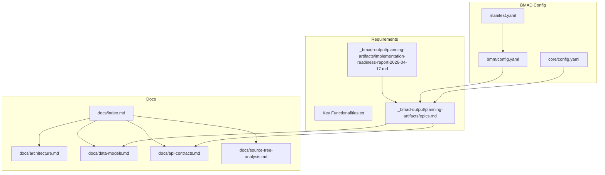
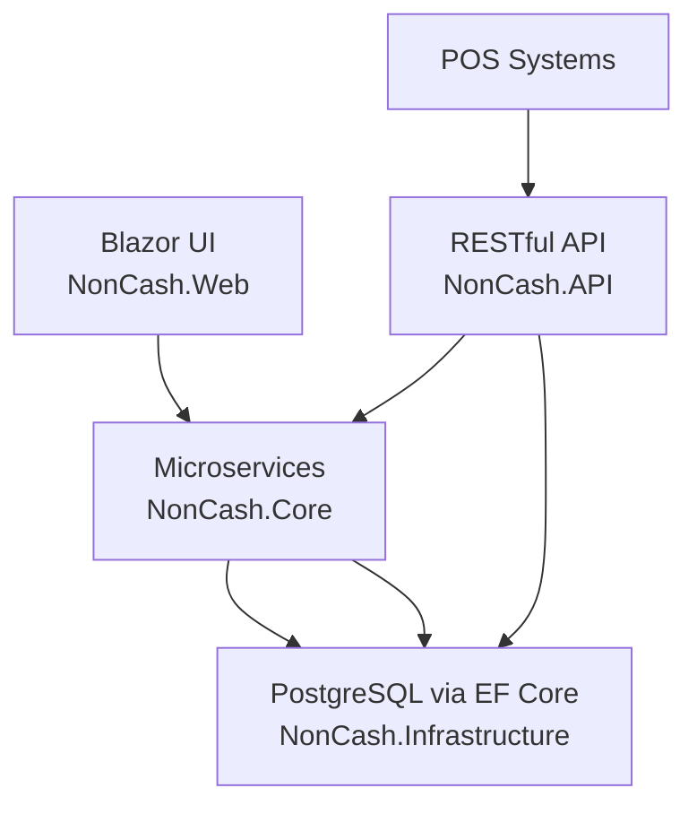
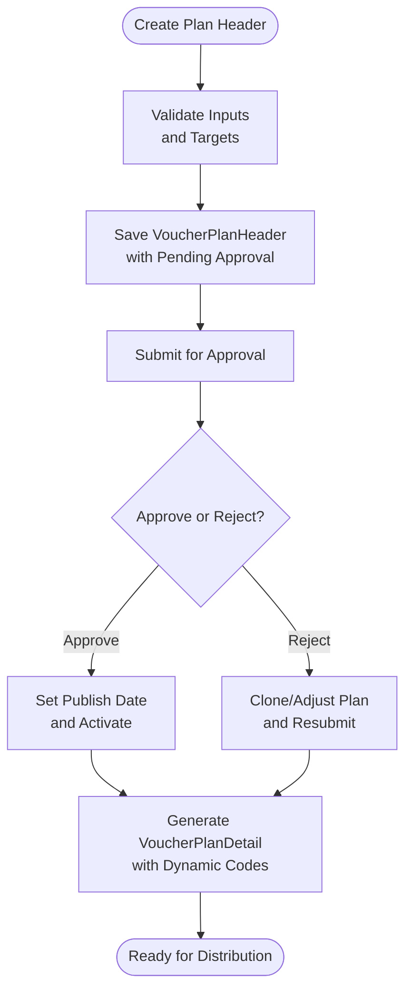
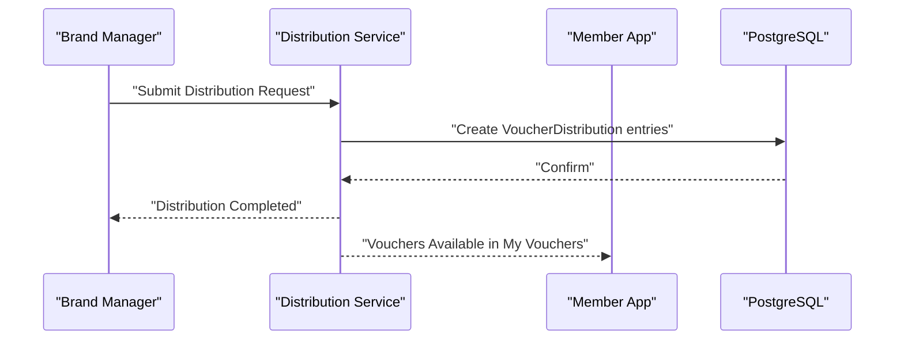
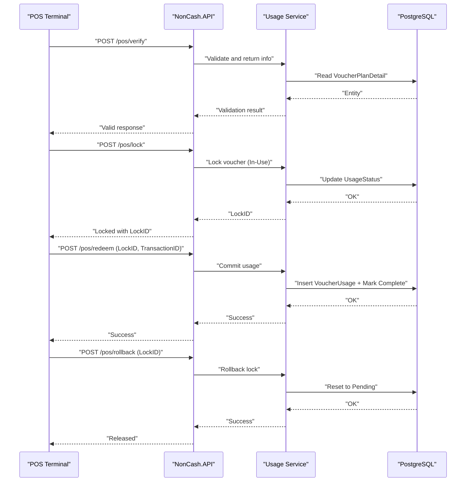
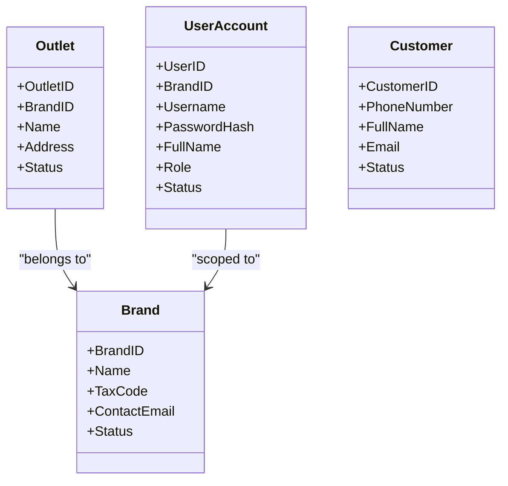
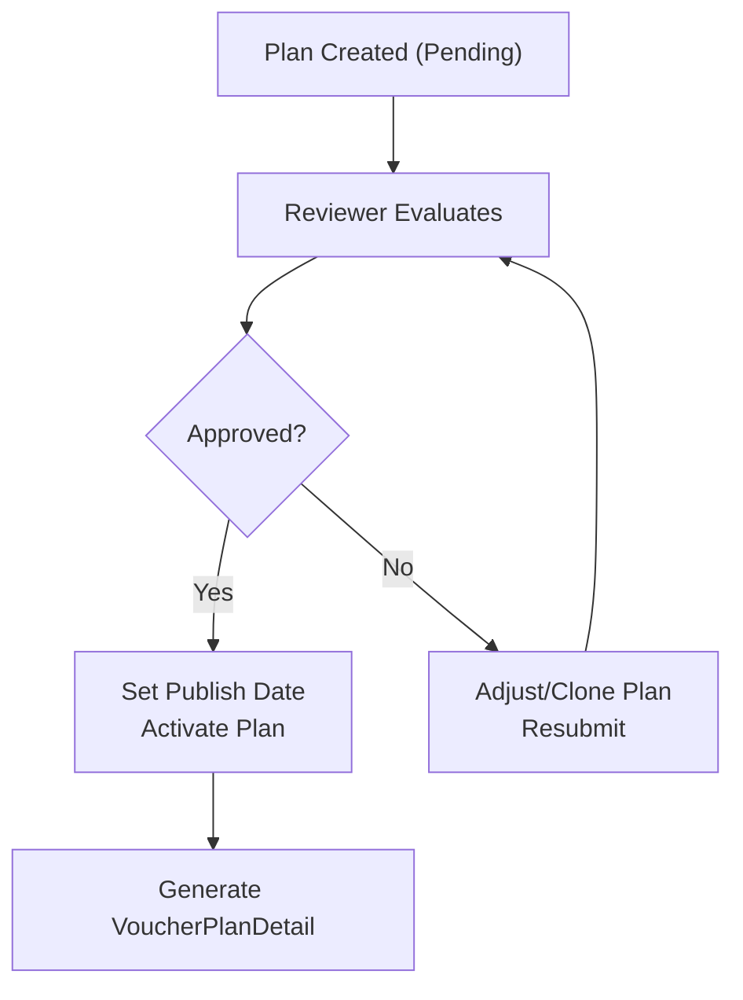
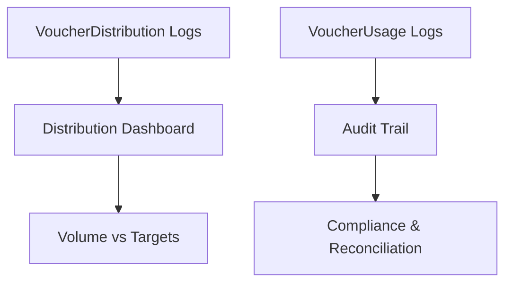
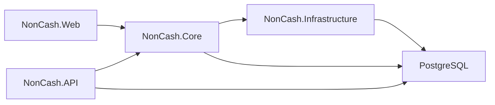

# Business Logic and Workflows

<cite>
**Referenced Files in This Document**
- [Key Functionalities.txt](file://Key%20Functionalities.txt)
- [description.txt](file://description.txt)
- [docs/index.md](file://docs/index.md)
- [docs/architecture.md](file://docs/architecture.md)
- [docs/data-models.md](file://docs/data-models.md)
- [docs/api-contracts.md](file://docs/api-contracts.md)
- [docs/source-tree-analysis.md](file://docs/source-tree-analysis.md)
- [_bmad-output/planning-artifacts/epics.md](file://_bmad-output/planning-artifacts/epics.md)
- [_bmad-output/planning-artifacts/implementation-readiness-report-2026-04-17.md](file://_bmad-output/planning-artifacts/implementation-readiness-report-2026-04-17.md)
- [_bmad/bmm/config.yaml](file://_bmad/bmm/config.yaml)
- [_bmad/core/config.yaml](file://_bmad/core/config.yaml)
- [_bmad/_config/manifest.yaml](file://_bmad/_config/manifest.yaml)
</cite>

## Table of Contents
1. [Introduction](#introduction)
2. [Project Structure](#project-structure)
3. [Core Components](#core-components)
4. [Architecture Overview](#architecture-overview)
5. [Detailed Component Analysis](#detailed-component-analysis)
6. [Dependency Analysis](#dependency-analysis)
7. [Performance Considerations](#performance-considerations)
8. [Troubleshooting Guide](#troubleshooting-guide)
9. [Conclusion](#conclusion)
10. [Appendices](#appendices)

## Introduction
This document explains the NonCash business logic and workflows across production planning, distribution, POS redemption, customer and brand management, approvals, and reporting. It synthesizes the project’s functional requirements, architecture, and API contracts into a cohesive guide for both technical and non-technical stakeholders. Practical scenarios and edge cases are included to illustrate real-world usage.

## Project Structure
The NonCash project is organized around a 3-layer SaaS architecture with microservices for planning, approval, distribution, usage, identity, and tenant management. The repository includes:
- Business requirement and functional specification documents
- Architectural and data model documentation
- API contracts for POS and Member App
- Planning artifacts and implementation readiness assessments
- BMAD configuration for project orchestration

**Diagram sources**
- [docs/index.md:1-41](file://docs/index.md#L1-L41)
- [docs/architecture.md:1-52](file://docs/architecture.md#L1-L52)
- [docs/data-models.md:1-98](file://docs/data-models.md#L1-L98)
- [docs/api-contracts.md:1-109](file://docs/api-contracts.md#L1-L109)
- [docs/source-tree-analysis.md:1-50](file://docs/source-tree-analysis.md#L1-L50)
- [_bmad-output/planning-artifacts/epics.md:1-319](file://_bmad-output/planning-artifacts/epics.md#L1-L319)
- [_bmad-output/planning-artifacts/implementation-readiness-report-2026-04-17.md:1-127](file://_bmad-output/planning-artifacts/implementation-readiness-report-2026-04-17.md#L1-L127)
- [_bmad/bmm/config.yaml:1-17](file://_bmad/bmm/config.yaml#L1-L17)
- [_bmad/core/config.yaml:1-10](file://_bmad/core/config.yaml#L1-L10)
- [_bmad/_config/manifest.yaml:1-25](file://_bmad/_config/manifest.yaml#L1-L25)

**Section sources**
- [docs/index.md:12-32](file://docs/index.md#L12-L32)
- [docs/source-tree-analysis.md:36-50](file://docs/source-tree-analysis.md#L36-L50)

## Core Components
NonCash organizes business capabilities into microservices aligned with functional epics:
- Planning Service: Campaign creation, budgeting, and targets
- Approval Service: Routing and state management for plan reviews
- Distribution Service: Sales, promotions, and inbox delivery
- Usage Service: POS redemption workflow (Lock → Commit/Rollback)
- Identity & Tenant Service: RBAC for UserAccount, multi-tenancy for Brand and Outlet, and Customer profile management

These services operate under JWT and API Key security, enforce multi-tenancy via BrandID, and use dynamic voucher codes to prevent fraud.

**Section sources**
- [docs/architecture.md:17-26](file://docs/architecture.md#L17-L26)
- [docs/architecture.md:36-41](file://docs/architecture.md#L36-L41)
- [Key Functionalities.txt:70-86](file://Key%20Functionalities.txt#L70-L86)

## Architecture Overview
The system follows a 3-layer SaaS design:
- Frontend (Blazor): Management dashboards and user interactions
- Business Logic (Microservices): Domain services orchestrating workflows
- Data Access (PostgreSQL via EF Core): Repository pattern and migrations

**Diagram sources**
- [docs/architecture.md:9-34](file://docs/architecture.md#L9-L34)
- [docs/source-tree-analysis.md:19-28](file://docs/source-tree-analysis.md#L19-L28)

**Section sources**
- [docs/architecture.md:5-52](file://docs/architecture.md#L5-L52)
- [docs/source-tree-analysis.md:36-50](file://docs/source-tree-analysis.md#L36-L50)

## Detailed Component Analysis

### Production Planning and Approval Workflow
Production planning centers on VoucherPlanHeader and VoucherPlanDetail. The process includes:
- Plan creation with attributes such as brand, type, face/net values, expiry/publish dates, sales range, and targets
- Approval routing with state transitions (Pending → Approved/Rejected)
- Plan versioning and adjustments after rejection
- Generation of VoucherPlanDetail records with dynamic codes and ownership assignment

**Diagram sources**
- [docs/data-models.md:11-43](file://docs/data-models.md#L11-L43)
- [docs/data-models.md:34-43](file://docs/data-models.md#L34-L43)
- [Key Functionalities.txt:70-86](file://Key%20Functionalities.txt#L70-L86)
- [_bmad-output/planning-artifacts/epics.md:139-197](file://_bmad-output/planning-artifacts/epics.md#L139-L197)

**Section sources**
- [Key Functionalities.txt:7-68](file://Key%20Functionalities.txt#L7-L68)
- [_bmad-output/planning-artifacts/epics.md:139-197](file://_bmad-output/planning-artifacts/epics.md#L139-L197)
- [docs/data-models.md:11-43](file://docs/data-models.md#L11-L43)

### Multi-Channel Distribution Strategies
NonCash supports multiple distribution channels:
- Self-purchase (Sale): Members buy vouchers directly; ownership assigned to MemberID; logged in VoucherDistribution
- Batch promotion: Import phone numbers or MemberIDs; system creates and delivers vouchers to inboxes; logged as Promotion method
- Gifting/transfer: Owners initiate transfers; recipients confirm; logged as Transfer method

**Diagram sources**
- [_bmad-output/planning-artifacts/epics.md:199-257](file://_bmad-output/planning-artifacts/epics.md#L199-L257)
- [docs/data-models.md:55-62](file://docs/data-models.md#L55-L62)

**Section sources**
- [Key Functionalities.txt:87-134](file://Key%20Functionalities.txt#L87-L134)
- [_bmad-output/planning-artifacts/epics.md:199-257](file://_bmad-output/planning-artifacts/epics.md#L199-L257)
- [docs/data-models.md:55-62](file://docs/data-models.md#L55-L62)

### POS Redemption Security and Transaction Lifecycle
POS redemption enforces transaction integrity with lock/commit/rollback:
- Verify: Check validity without changing state
- Lock: Transition to In-Use and bind to a transaction context
- Commit: Finalize usage, persist VoucherUsage, mark Complete
- Rollback: Release lock, revert to Pending

**Diagram sources**
- [docs/api-contracts.md:14-87](file://docs/api-contracts.md#L14-L87)
- [docs/data-models.md:46-54](file://docs/data-models.md#L46-L54)
- [docs/data-models.md:34-43](file://docs/data-models.md#L34-L43)

**Section sources**
- [Key Functionalities.txt:135-156](file://Key%20Functionalities.txt#L135-L156)
- [docs/api-contracts.md:14-87](file://docs/api-contracts.md#L14-L87)
- [docs/data-models.md:46-54](file://docs/data-models.md#L46-L54)

### Customer and Brand Management
Core profiles and onboarding include:
- Brand setup and management (multi-tenancy via BrandID)
- Outlet configuration per Brand
- Customer record management, including blacklist functionality
- Staff account management with RBAC and JWT

**Diagram sources**
- [docs/data-models.md:65-98](file://docs/data-models.md#L65-L98)

**Section sources**
- [_bmad-output/planning-artifacts/epics.md:79-137](file://_bmad-output/planning-artifacts/epics.md#L79-L137)
- [docs/data-models.md:65-98](file://docs/data-models.md#L65-L98)

### Approval and Publication Workflow
Approval involves:
- Submission of a plan with Pending status
- Review by an approver with Approve/Reject actions
- Optional adjustment and resubmission after rejection
- Activation upon approval with Publish Date enforcement

**Diagram sources**
- [Key Functionalities.txt:70-86](file://Key%20Functionalities.txt#L70-L86)
- [_bmad-output/planning-artifacts/epics.md:171-197](file://_bmad-output/planning-artifacts/epics.md#L171-L197)

**Section sources**
- [Key Functionalities.txt:70-86](file://Key%20Functionalities.txt#L70-L86)
- [_bmad-output/planning-artifacts/epics.md:171-197](file://_bmad-output/planning-artifacts/epics.md#L171-L197)

### Reporting Dashboard and Audit Trails
- Distribution tracking dashboard aggregates VoucherDistribution logs and compares actual versus target metrics
- POS usage audit trail stored in VoucherUsage with POSID, TransactionID, and timestamps
- Plan approval history preserved for traceability

**Diagram sources**
- [_bmad-output/planning-artifacts/epics.md:244-256](file://_bmad-output/planning-artifacts/epics.md#L244-L256)
- [docs/data-models.md:46-62](file://docs/data-models.md#L46-L62)

**Section sources**
- [_bmad-output/planning-artifacts/epics.md:244-256](file://_bmad-output/planning-artifacts/epics.md#L244-L256)
- [docs/data-models.md:46-62](file://docs/data-models.md#L46-L62)

## Dependency Analysis
The system’s dependencies align with the 3-layer architecture and microservices:

**Diagram sources**
- [docs/source-tree-analysis.md:19-28](file://docs/source-tree-analysis.md#L19-L28)
- [docs/architecture.md:28-34](file://docs/architecture.md#L28-L34)

**Section sources**
- [docs/source-tree-analysis.md:36-50](file://docs/source-tree-analysis.md#L36-L50)
- [docs/architecture.md:28-34](file://docs/architecture.md#L28-L34)

## Performance Considerations
- Use dynamic voucher codes to minimize replay risk and reduce validation overhead
- Enforce multi-tenancy via BrandID to avoid cross-tenant scans and queries
- Apply transaction boundaries around POS redemption steps to ensure atomicity
- Index frequently queried fields (e.g., VoucherCode, MemberID, OutletID) in PostgreSQL
- Cache non-sensitive metadata (e.g., brand and outlet info) at the API gateway level

[No sources needed since this section provides general guidance]

## Troubleshooting Guide
Common issues and resolutions:
- Voucher invalid or expired: Verify expiry and publish dates; ensure plan is approved and published
- Double-spending attempts: Confirm lock acquisition succeeded and the voucher remains In-Use until commit
- Rollback not releasing lock: Ensure rollback endpoint is invoked with the correct LockID
- Distribution failures: Check VoucherDistribution logs and reconcile with plan detail generation
- Blacklisted customer errors: Validate customer status before transfer or purchase

**Section sources**
- [Key Functionalities.txt:135-156](file://Key%20Functionalities.txt#L135-L156)
- [docs/api-contracts.md:14-87](file://docs/api-contracts.md#L14-L87)
- [docs/data-models.md:46-62](file://docs/data-models.md#L46-L62)

## Conclusion
NonCash provides a secure, scalable SaaS platform for voucher production and redemption. Its 3-layer architecture, microservices design, and robust API contracts enable reliable production planning, multi-channel distribution, and POS redemption with strong transaction integrity. The documented workflows, data models, and planning artifacts form a complete blueprint for implementation and operations.

[No sources needed since this section summarizes without analyzing specific files]

## Appendices

### Practical Examples and Edge Cases
- Example: Batch promotion with 1,000 recipients
  - Validate plan approval and publish date
  - Upload phone numbers; system maps to MemberIDs and generates plan details
  - Log entries created in VoucherDistribution with Promotion method
- Edge: Rejected plan revision
  - Clone the rejected plan; adjust targets and resubmit; preserve historical approval records
- Edge: POS rollback scenario
  - If a transaction fails, call rollback to release the lock and restore Pending state
- Edge: Blacklisted customer transfer
  - Prevent transfer initiation if the recipient is blacklisted; notify sender accordingly

**Section sources**
- [_bmad-output/planning-artifacts/epics.md:205-243](file://_bmad-output/planning-artifacts/epics.md#L205-L243)
- [Key Functionalities.txt:135-156](file://Key%20Functionalities.txt#L135-L156)