# Business Logic and Workflows

<cite>
**Referenced Files in This Document**
- [Key Functionalities.txt](file://Key%20Functionalities.txt)
- [description.txt](file://description.txt)
- [docs/index.md](file://docs/index.md)
- [docs/architecture.md](file://docs/architecture.md)
- [docs/data-models.md](file://docs/data-models.md)
- [docs/api-contracts.md](file://docs/api-contracts.md)
- [docs/source-tree-analysis.md](file://docs/source-tree-analysis.md)
- [docs/pos-integration-guide.md](file://docs/pos-integration-guide.md)
- [_bmad-output/planning-artifacts/epics.md](file://_bmad-output/planning-artifacts/epics.md)
- [_bmad-output/planning-artifacts/implementation-readiness-report-2026-04-17.md](file://_bmad-output/planning-artifacts/implementation-readiness-report-2026-04-17.md)
- [_bmad/bmm/config.yaml](file://_bmad/bmm/config.yaml)
- [_bmad/core/config.yaml](file://_bmad/core/config.yaml)
- [_bmad/_config/manifest.yaml](file://_bmad/_config/manifest.yaml)
- [src/NonCash.Core/Entities/SettlementEntry.cs](file://src/NonCash.Core/Entities/SettlementEntry.cs)
- [src/NonCash.Core/Entities/CreditLedgerEntry.cs](file://src/NonCash.Core/Entities/CreditLedgerEntry.cs)
- [src/NonCash.Core/Entities/PaymentTransaction.cs](file://src/NonCash.Core/Entities/PaymentTransaction.cs)
- [src/NonCash.Core/Interfaces/ISettlementService.cs](file://src/NonCash.Core/Interfaces/ISettlementService.cs)
- [src/NonCash.Core/Interfaces/ICreditService.cs](file://src/NonCash.Core/Interfaces/ICreditService.cs)
- [src/NonCash.API/Controllers/SettlementsController.cs](file://src/NonCash.API/Controllers/SettlementsController.cs)
- [src/NonCash.API/Controllers/CreditsController.cs](file://src/NonCash.API/Controllers/CreditsController.cs)
- [src/NonCash.API/Controllers/PaymentsController.cs](file://src/NonCash.API/Controllers/PaymentsController.cs)
- [src/NonCash.Infrastructure/Services/SettlementService.cs](file://src/NonCash.Infrastructure/Services/SettlementService.cs)
- [src/NonCash.Infrastructure/Services/CreditService.cs](file://src/NonCash.Infrastructure/Services/CreditService.cs)
- [src/NonCash.Core/Entities/IntegrationPartner.cs](file://src/NonCash.Core/Entities/IntegrationPartner.cs)
- [src/NonCash.Shared/Helpers/VoucherDisplayHelper.cs](file://src/NonCash.Shared/Helpers/VoucherDisplayHelper.cs)
</cite>

## Update Summary
**Changes Made**
- Added new section on Cross-Tenant Settlement Processing with settlement ledger, netting reports, and manual settlement workflows
- Added new section on Credit Ledger Management covering prepaid credit billing, consumption tracking, and balance management
- Added new section on Payment Processing Integration including ZaloPay integration, webhook handling, and payment lifecycle
- Enhanced POS Redemption Security section with settlement integration and credit consumption
- Added new section on Loyalty App Integrations covering partner onboarding, member wallet APIs, and display data handling
- Updated existing workflows to reflect enhanced display data handling through VoucherDisplayHelper

## Table of Contents
1. [Introduction](#introduction)
2. [Project Structure](#project-structure)
3. [Core Components](#core-components)
4. [Architecture Overview](#architecture-overview)
5. [Detailed Component Analysis](#detailed-component-analysis)
6. [Cross-Tenant Settlement Processing](#cross-tenant-settlement-processing)
7. [Credit Ledger Management](#credit-ledger-management)
8. [Payment Processing Integration](#payment-processing-integration)
9. [Loyalty App Integrations](#loyalty-app-integrations)
10. [Enhanced Display Data Handling](#enhanced-display-data-handling)
11. [Dependency Analysis](#dependency-analysis)
12. [Performance Considerations](#performance-considerations)
13. [Troubleshooting Guide](#troubleshooting-guide)
14. [Conclusion](#conclusion)
15. [Appendices](#appendices)

## Introduction
This document explains the NonCash business logic and workflows across production planning, distribution, POS redemption, customer and brand management, approvals, reporting, and the newly added cross-tenant settlement processing, credit ledger management, payment processing integration, and loyalty app integrations. It synthesizes the project's functional requirements, architecture, and API contracts into a cohesive guide for both technical and non-technical stakeholders. Practical scenarios and edge cases are included to illustrate real-world usage.

## Project Structure
The NonCash project is organized around a 3-layer SaaS architecture with microservices for planning, approval, distribution, usage, identity, tenant management, settlement processing, credit management, and payment integration. The repository includes:
- Business requirement and functional specification documents
- Architectural and data model documentation
- API contracts for POS and Member App
- Planning artifacts and implementation readiness assessments
- BMAD configuration for project orchestration

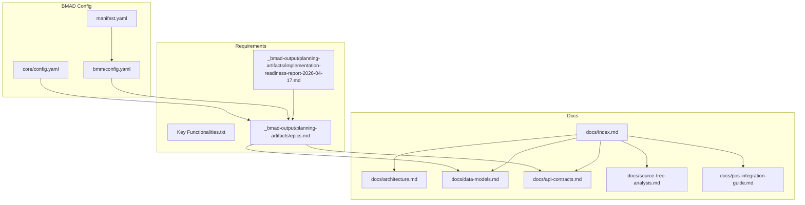
```mermaid
graph TB
subgraph "Docs"
IDX["docs/index.md"]
ARCH["docs/architecture.md"]
DM["docs/data-models.md"]
API["docs/api-contracts.md"]
STA["docs/source-tree-analysis.md"]
POS["docs/pos-integration-guide.md"]
end
subgraph "Requirements"
KEY["Key Functionalities.txt"]
EPICS["_bmad-output/planning-artifacts/epics.md"]
IR["_bmad-output/planning-artifacts/implementation-readiness-report-2026-04-17.md"]
end
subgraph "BMAD Config"
BMM["bmm/config.yaml"]
CORE["core/config.yaml"]
MAN["manifest.yaml"]
end
IDX --> ARCH
IDX --> DM
IDX --> API
IDX --> STA
IDX --> POS
EPICS --> API
EPICS --> DM
IR --> EPICS
BMM --> EPICS
CORE --> EPICS
MAN --> BMM
```

**Diagram sources**
- [docs/index.md:1-41](file://docs/index.md#L1-L41)
- [docs/architecture.md:1-52](file://docs/architecture.md#L1-L52)
- [docs/data-models.md:1-98](file://docs/data-models.md#L1-L98)
- [docs/api-contracts.md:1-109](file://docs/api-contracts.md#L1-L109)
- [docs/source-tree-analysis.md:1-50](file://docs/source-tree-analysis.md#L1-L50)
- [docs/pos-integration-guide.md:48-252](file://docs/pos-integration-guide.md#L48-L252)
- [_bmad-output/planning-artifacts/epics.md:1-319](file://_bmad-output/planning-artifacts/epics.md#L1-L319)
- [_bmad-output/planning-artifacts/implementation-readiness-report-2026-04-17.md:1-127](file://_bmad-output/planning-artifacts/implementation-readiness-report-2026-04-17.md#L1-L127)
- [_bmad/bmm/config.yaml:1-17](file://_bmad/bmm/config.yaml#L1-L17)
- [_bmad/core/config.yaml:1-10](file://_bmad/core/config.yaml#L1-L10)
- [_bmad/_config/manifest.yaml:1-25](file://_bmad/_config/manifest.yaml#L1-L25)

**Section sources**
- [docs/index.md:12-32](file://docs/index.md#L12-L32)
- [docs/source-tree-analysis.md:36-50](file://docs/source-tree-analysis.md#L36-L50)

## Core Components
NonCash organizes business capabilities into microservices aligned with functional epics:
- Planning Service: Campaign creation, budgeting, and targets
- Approval Service: Routing and state management for plan reviews
- Distribution Service: Sales, promotions, and inbox delivery
- Usage Service: POS redemption workflow (Lock → Commit/Rollback)
- Identity & Tenant Service: RBAC for UserAccount, multi-tenancy for Brand and Outlet, and Customer profile management
- Settlement Service: Cross-tenant settlement ledger and netting reports
- Credit Service: Prepaid credit billing and consumption tracking
- Payment Service: Payment gateway integration and transaction management
- Integration Service: Loyalty app partner management and member wallet APIs

These services operate under JWT and API Key security, enforce multi-tenancy via BrandID, and use dynamic voucher codes to prevent fraud.

**Section sources**
- [docs/architecture.md:17-26](file://docs/architecture.md#L17-L26)
- [docs/architecture.md:36-41](file://docs/architecture.md#L36-L41)
- [Key Functionalities.txt:70-86](file://Key%20Functionalities.txt#L70-L86)

## Architecture Overview
The system follows a 3-layer SaaS design:
- Frontend (Blazor): Management dashboards and user interactions
- Business Logic (Microservices): Domain services orchestrating workflows
- Data Access (PostgreSQL via EF Core): Repository pattern and migrations

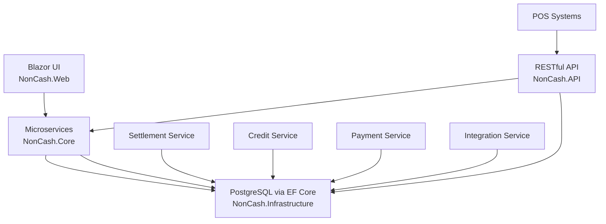
```mermaid
graph TB
UI["Blazor UI<br/>NonCash.Web"] --> BLL["Microservices<br/>NonCash.Core"]
BLL --> DAL["PostgreSQL via EF Core<br/>NonCash.Infrastructure"]
POS["POS Systems"] --> API["RESTful API<br/>NonCash.API"]
API --> BLL
API --> DAL
BLL --> DAL
SETTLEMENT["Settlement Service"] --> DAL
CREDIT["Credit Service"] --> DAL
PAYMENT["Payment Service"] --> DAL
INTEGRATION["Integration Service"] --> DAL
```

**Diagram sources**
- [docs/architecture.md:9-34](file://docs/architecture.md#L9-L34)
- [docs/source-tree-analysis.md:19-28](file://docs/source-tree-analysis.md#L19-L28)

**Section sources**
- [docs/architecture.md:5-52](file://docs/architecture.md#L5-L52)
- [docs/source-tree-analysis.md:36-50](file://docs/source-tree-analysis.md#L36-L50)

## Detailed Component Analysis

### Production Planning and Approval Workflow
Production planning centers on VoucherPlanHeader and VoucherPlanDetail. The process includes:
- Plan creation with attributes such as brand, type, face/net values, expiry/publish dates, sales range, and targets
- Approval routing with state transitions (Pending → Approved/Rejected)
- Plan versioning and adjustments after rejection
- Generation of VoucherPlanDetail records with dynamic codes and ownership assignment

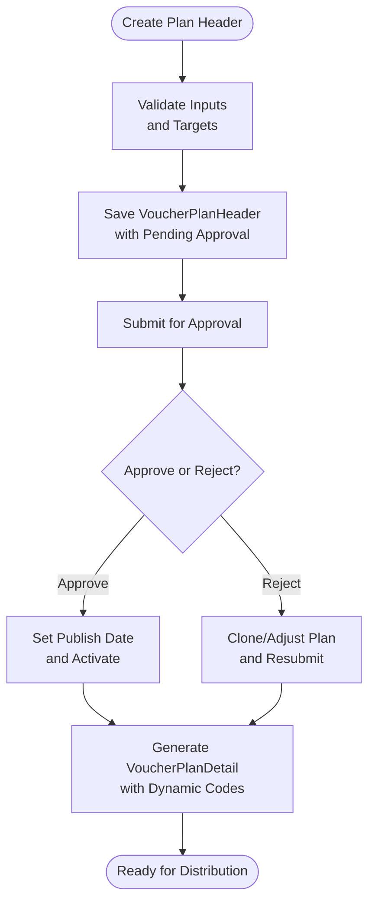
```mermaid
flowchart TD
Start(["Create Plan Header"]) --> Validate["Validate Inputs<br/>and Targets"]
Validate --> SaveHeader["Save VoucherPlanHeader<br/>with Pending Approval"]
SaveHeader --> Submit["Submit for Approval"]
Submit --> Review{"Approve or Reject?"}
Review --> |Approve| Publish["Set Publish Date<br/>and Activate"]
Review --> |Reject| Adjust["Clone/Adjust Plan<br/>and Resubmit"]
Publish --> Generate["Generate VoucherPlanDetail<br/>with Dynamic Codes"]
Adjust --> Generate
Generate --> End(["Ready for Distribution"])
```

**Diagram sources**
- [docs/data-models.md:11-43](file://docs/data-models.md#L11-L43)
- [docs/data-models.md:34-43](file://docs/data-models.md#L34-L43)
- [Key Functionalities.txt:70-86](file://Key%20Functionalities.txt#L70-L86)
- [_bmad-output/planning-artifacts/epics.md:139-197](file://_bmad-output/planning-artifacts/epics.md#L139-L197)

**Section sources**
- [Key Functionalities.txt:7-68](file://Key%20Functionalities.txt#L7-L68)
- [_bmad-output/planning-artifacts/epics.md:139-197](file://_bmad-output/planning-artifacts/epics.md#L139-L197)
- [docs/data-models.md:11-43](file://docs/data-models.md#L11-L43)

### Multi-Channel Distribution Strategies
NonCash supports multiple distribution channels:
- Self-purchase (Sale): Members buy vouchers directly; ownership assigned to MemberID; logged in VoucherDistribution
- Batch promotion: Import phone numbers or MemberIDs; system creates and delivers vouchers to inboxes; logged as Promotion method
- Gifting/transfer: Owners initiate transfers; recipients confirm; logged as Transfer method

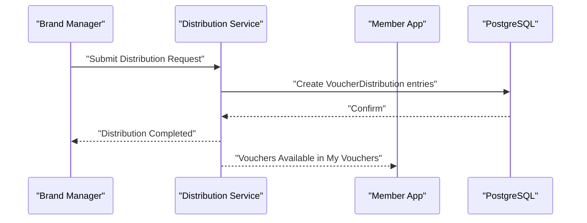
```mermaid
sequenceDiagram
participant Brand as "Brand Manager"
participant Dist as "Distribution Service"
participant Mem as "Member App"
participant DB as "PostgreSQL"
Brand->>Dist : "Submit Distribution Request"
Dist->>DB : "Create VoucherDistribution entries"
DB-->>Dist : "Confirm"
Dist-->>Brand : "Distribution Completed"
Dist-->>Mem : "Vouchers Available in My Vouchers"
```

**Diagram sources**
- [_bmad-output/planning-artifacts/epics.md:199-257](file://_bmad-output/planning-artifacts/epics.md#L199-L257)
- [docs/data-models.md:55-62](file://docs/data-models.md#L55-L62)

**Section sources**
- [Key Functionalities.txt:87-134](file://Key%20Functionalities.txt#L87-L134)
- [_bmad-output/planning-artifacts/epics.md:199-257](file://_bmad-output/planning-artifacts/epics.md#L199-L257)
- [docs/data-models.md:55-62](file://docs/data-models.md#L55-L62)

### POS Redemption Security and Transaction Lifecycle
POS redemption enforces transaction integrity with lock/commit/rollback, now enhanced with settlement processing and credit consumption:
- Verify: Check validity without changing state
- Lock: Transition to In-Use and bind to a transaction context
- Commit: Finalize usage, persist VoucherUsage, mark Complete, create settlement entry if cross-tenant, consume credit
- Rollback: Release lock, revert to Pending

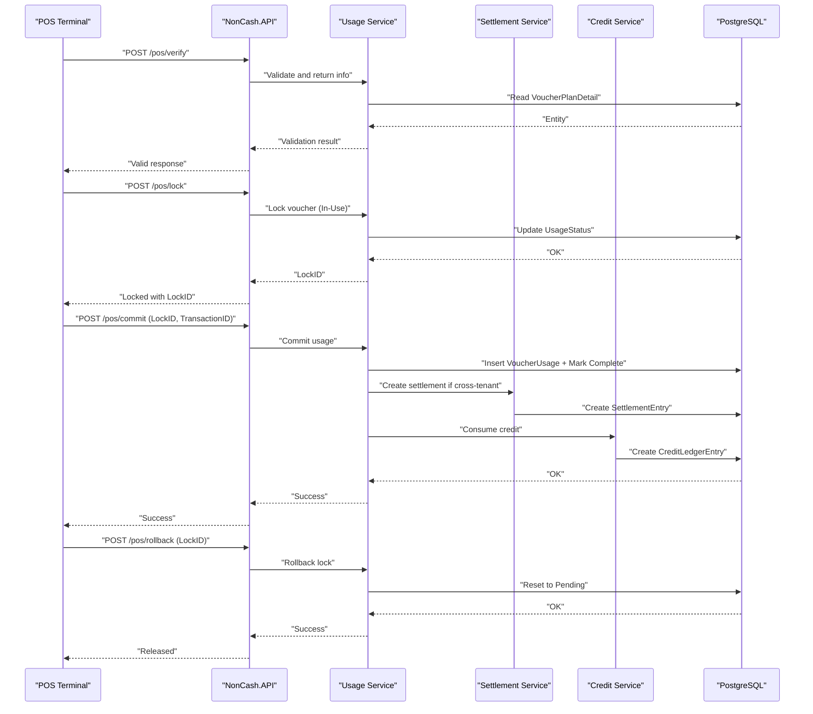
```mermaid
sequenceDiagram
participant POS as "POS Terminal"
participant API as "NonCash.API"
participant SVC as "Usage Service"
participant SETTLE as "Settlement Service"
participant CREDIT as "Credit Service"
participant DB as "PostgreSQL"
POS->>API : "POST /pos/verify"
API->>SVC : "Validate and return info"
SVC->>DB : "Read VoucherPlanDetail"
DB-->>SVC : "Entity"
SVC-->>API : "Validation result"
API-->>POS : "Valid response"
POS->>API : "POST /pos/lock"
API->>SVC : "Lock voucher (In-Use)"
SVC->>DB : "Update UsageStatus"
DB-->>SVC : "OK"
SVC-->>API : "LockID"
API-->>POS : "Locked with LockID"
POS->>API : "POST /pos/commit (LockID, TransactionID)"
API->>SVC : "Commit usage"
SVC->>DB : "Insert VoucherUsage + Mark Complete"
SVC->>SETTLE : "Create settlement if cross-tenant"
SETTLE->>DB : "Create SettlementEntry"
SVC->>CREDIT : "Consume credit"
CREDIT->>DB : "Create CreditLedgerEntry"
DB-->>SVC : "OK"
SVC-->>API : "Success"
API-->>POS : "Success"
POS->>API : "POST /pos/rollback (LockID)"
API->>SVC : "Rollback lock"
SVC->>DB : "Reset to Pending"
DB-->>SVC : "OK"
SVC-->>API : "Success"
API-->>POS : "Released"
```

**Diagram sources**
- [docs/api-contracts.md:14-87](file://docs/api-contracts.md#L14-L87)
- [docs/data-models.md:46-54](file://docs/data-models.md#L46-L54)
- [docs/data-models.md:34-43](file://docs/data-models.md#L34-L43)
- [src/NonCash.Infrastructure/Services/SettlementService.cs:20-48](file://src/NonCash.Infrastructure/Services/SettlementService.cs#L20-L48)
- [src/NonCash.Infrastructure/Services/CreditService.cs:38-79](file://src/NonCash.Infrastructure/Services/CreditService.cs#L38-L79)

**Section sources**
- [Key Functionalities.txt:135-156](file://Key%20Functionalities.txt#L135-L156)
- [docs/api-contracts.md:14-87](file://docs/api-contracts.md#L14-L87)
- [docs/data-models.md:46-54](file://docs/data-models.md#L46-L54)

### Customer and Brand Management
Core profiles and onboarding include:
- Brand setup and management (multi-tenancy via BrandID)
- Outlet configuration per Brand
- Customer record management, including blacklist functionality
- Staff account management with RBAC and JWT

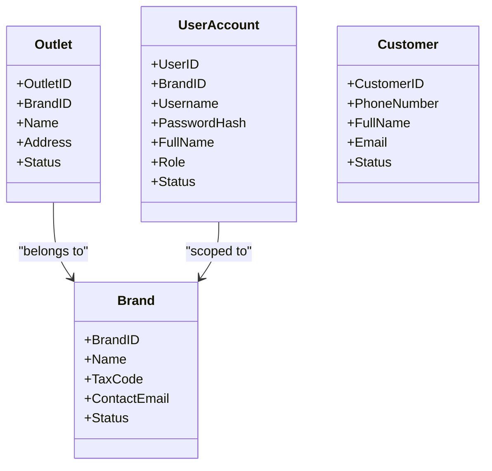
```mermaid
classDiagram
class Brand {
+BrandID
+Name
+TaxCode
+ContactEmail
+Status
}
class Outlet {
+OutletID
+BrandID
+Name
+Address
+Status
}
class UserAccount {
+UserID
+BrandID
+Username
+PasswordHash
+FullName
+Role
+Status
}
class Customer {
+CustomerID
+PhoneNumber
+FullName
+Email
+Status
}
Outlet --> Brand : "belongs to"
UserAccount --> Brand : "scoped to"
```

**Diagram sources**
- [docs/data-models.md:65-98](file://docs/data-models.md#L65-L98)

**Section sources**
- [_bmad-output/planning-artifacts/epics.md:79-137](file://_bmad-output/planning-artifacts/epics.md#L79-L137)
- [docs/data-models.md:65-98](file://docs/data-models.md#L65-L98)

### Approval and Publication Workflow
Approval involves:
- Submission of a plan with Pending status
- Review by an approver with Approve/Reject actions
- Optional adjustment and resubmission after rejection
- Activation upon approval with Publish Date enforcement

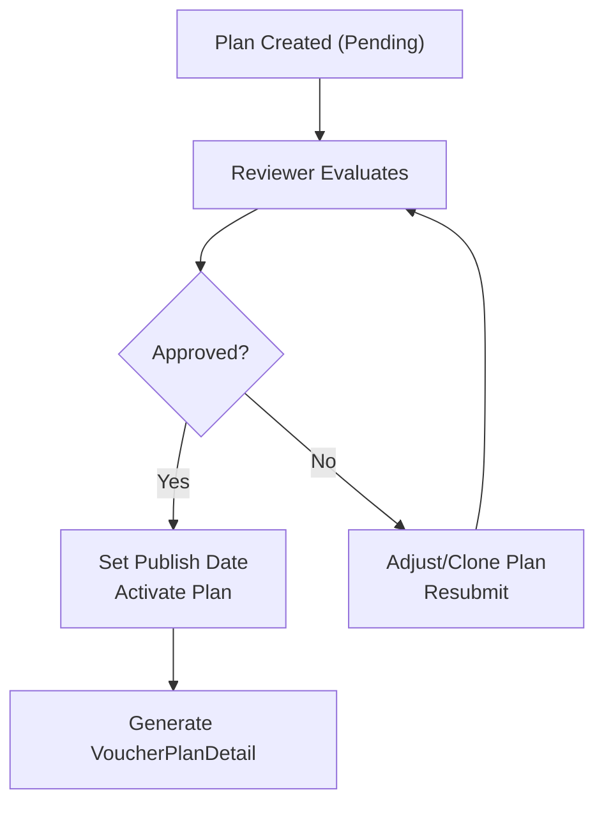
```mermaid
flowchart TD
P["Plan Created (Pending)"] --> R["Reviewer Evaluates"]
R --> A{"Approved?"}
A --> |Yes| Pub["Set Publish Date<br/>Activate Plan"]
A --> |No| Revise["Adjust/Clone Plan<br/>Resubmit"]
Revise --> R
Pub --> Gen["Generate VoucherPlanDetail"]
```

**Diagram sources**
- [Key Functionalities.txt:70-86](file://Key%20Functionalities.txt#L70-L86)
- [_bmad-output/planning-artifacts/epics.md:171-197](file://_bmad-output/planning-artifacts/epics.md#L171-L197)

**Section sources**
- [Key Functionalities.txt:70-86](file://Key%20Functionalities.txt#L70-L86)
- [_bmad-output/planning-artifacts/epics.md:171-197](file://_bmad-output/planning-artifacts/epics.md#L171-L197)

### Reporting Dashboard and Audit Trails
- Distribution tracking dashboard aggregates VoucherDistribution logs and compares actual versus target metrics
- POS usage audit trail stored in VoucherUsage with POSID, TransactionID, and timestamps
- Plan approval history preserved for traceability
- Settlement ledger provides financial reconciliation between brands
- Credit ledger tracks prepaid credit consumption and balances

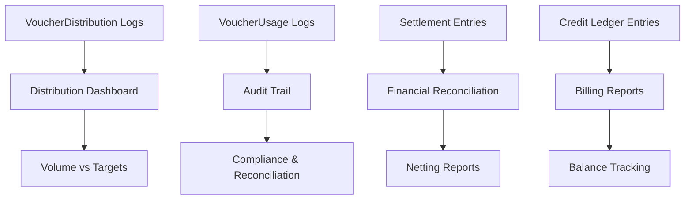
```mermaid
flowchart TD
DistLogs["VoucherDistribution Logs"] --> Dash["Distribution Dashboard"]
UsageLogs["VoucherUsage Logs"] --> Audit["Audit Trail"]
SettlementLogs["Settlement Entries"] --> Financial["Financial Reconciliation"]
CreditLogs["Credit Ledger Entries"] --> Billing["Billing Reports"]
Dash --> Metrics["Volume vs Targets"]
Audit --> Compliance["Compliance & Reconciliation"]
Financial --> Netting["Netting Reports"]
Billing --> Balance["Balance Tracking"]
```

**Diagram sources**
- [_bmad-output/planning-artifacts/epics.md:244-256](file://_bmad-output/planning-artifacts/epics.md#L244-L256)
- [docs/data-models.md:46-62](file://docs/data-models.md#L46-L62)
- [src/NonCash.Core/Entities/SettlementEntry.cs:1-49](file://src/NonCash.Core/Entities/SettlementEntry.cs#L1-L49)
- [src/NonCash.Core/Entities/CreditLedgerEntry.cs:1-42](file://src/NonCash.Core/Entities/CreditLedgerEntry.cs#L1-L42)

**Section sources**
- [_bmad-output/planning-artifacts/epics.md:244-256](file://_bmad-output/planning-artifacts/epics.md#L244-L256)
- [docs/data-models.md:46-62](file://docs/data-models.md#L46-L62)

## Cross-Tenant Settlement Processing
Cross-tenant settlement processing automatically tracks financial obligations when vouchers sponsored by one brand are redeemed at another brand's outlet. The system creates settlement entries that record who owes whom and how much, enabling automatic financial reconciliation between sponsoring and redeeming brands.

### Settlement Entry Creation
When a voucher from a cross-tenant plan (where SponsorBrandID differs from RedeemBrandID) is successfully redeemed and committed, the system automatically creates a SettlementEntry record containing:
- SponsorBrandId: The brand that sponsored the voucher campaign
- IssuingBrandId: The brand that issued the voucher (owner of the plan)
- RedeemBrandId: The brand at whose outlet the voucher was redeemed
- RedeemOutletId: The specific outlet where redemption occurred
- FaceValue: The value of the voucher at time of redemption
- Status: Initial state set to Pending for manual settlement processing

### Settlement Lifecycle Management
Settlement entries follow a clear lifecycle:
- **Pending**: Automatically created after successful cross-tenant redemption
- **Settled**: Manually marked by administrators after off-platform payment between brands
- **Tracking**: Each settlement includes SettledAt timestamp and SettledBy user identification

### Settlement Ledger and Reporting
The settlement ledger provides comprehensive filtering and reporting capabilities:
- Filter by sponsor brand, redeem brand, date range, and settlement status
- Paginated results for large datasets
- Manual settlement marking through dedicated API endpoints
- Netting reports that compute net amounts between all sponsor/redeemer brand pairs within specified date ranges

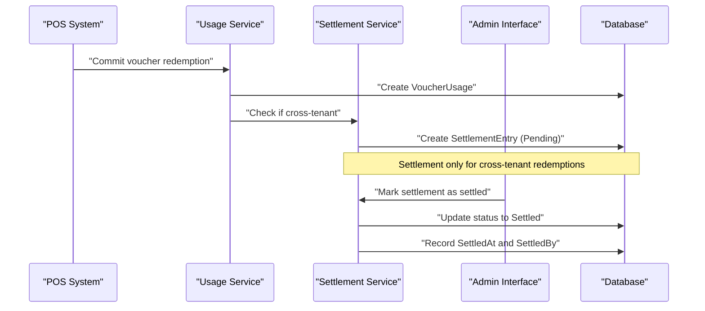
```mermaid
sequenceDiagram
participant POS as "POS System"
participant USAGE as "Usage Service"
participant SETTLE as "Settlement Service"
participant ADMIN as "Admin Interface"
participant DB as "Database"
POS->>USAGE : "Commit voucher redemption"
USAGE->>DB : "Create VoucherUsage"
USAGE->>SETTLE : "Check if cross-tenant"
SETTLE->>DB : "Create SettlementEntry (Pending)"
Note over SETTLE,DB : Settlement only for cross-tenant redemptions
ADMIN->>SETTLE : "Mark settlement as settled"
SETTLE->>DB : "Update status to Settled"
SETTLE->>DB : "Record SettledAt and SettledBy"
```

**Diagram sources**
- [src/NonCash.Infrastructure/Services/SettlementService.cs:20-48](file://src/NonCash.Infrastructure/Services/SettlementService.cs#L20-L48)
- [src/NonCash.API/Controllers/SettlementsController.cs:22-84](file://src/NonCash.API/Controllers/SettlementsController.cs#L22-L84)
- [src/NonCash.Core/Entities/SettlementEntry.cs:1-49](file://src/NonCash.Core/Entities/SettlementEntry.cs#L1-L49)

**Section sources**
- [src/NonCash.Core/Entities/SettlementEntry.cs:1-49](file://src/NonCash.Core/Entities/SettlementEntry.cs#L1-L49)
- [src/NonCash.Core/Interfaces/ISettlementService.cs:1-50](file://src/NonCash.Core/Interfaces/ISettlementService.cs#L1-L50)
- [src/NonCash.API/Controllers/SettlementsController.cs:1-138](file://src/NonCash.API/Controllers/SettlementsController.cs#L1-L138)
- [src/NonCash.Infrastructure/Services/SettlementService.cs:1-123](file://src/NonCash.Infrastructure/Services/SettlementService.cs#L1-L123)

## Credit Ledger Management
Credit ledger management implements a prepaid credit billing system where each brand maintains a credit balance used to fund voucher campaigns. The system uses an append-only ledger approach where balance equals the sum of all credit entries for a brand.

### Credit Balance Management
Each brand's credit balance is calculated as the sum of all CreditLedgerEntry amounts:
- **Positive amounts**: Grant, Purchase, or Adjustment entries increase the balance
- **Negative amounts**: Consumption entries decrease the balance
- **Grace overdraft**: Balance may go negative during consumption, but upstream actions can be blocked based on business rules

### Consumption Tracking and Idempotency
Credit consumption is tightly integrated with voucher usage:
- Each voucher consumes exactly 1 credit at its value moment
- Consumption is idempotent per voucher detail ID (enforced by unique index)
- Consumption entries are created automatically during POS redemption
- Failed consumption attempts don't block the business operation (grace policy)

### Manual Credit Operations
Administrators can perform manual credit operations:
- **Top-up**: Add credits through bank transfer confirmation flow
- **Adjustment**: Make corrections to credit balances
- **Grant**: Award promotional credits
- **Ledger queries**: View complete transaction history with filtering options

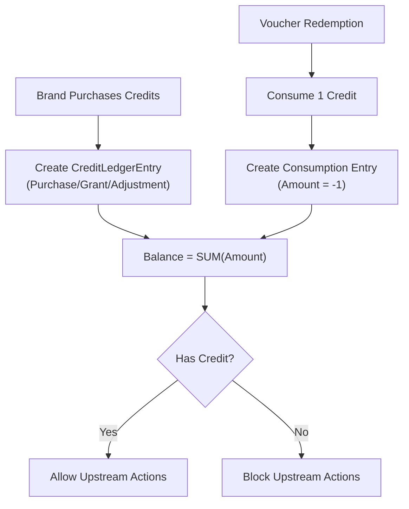
```mermaid
flowchart TD
Purchase["Brand Purchases Credits"] --> TopUp["Create CreditLedgerEntry<br/>(Purchase/Grant/Adjustment)"]
TopUp --> Balance["Balance = SUM(Amount)"]
Redemption["Voucher Redemption"] --> Consume["Consume 1 Credit"]
Consume --> Consumption["Create Consumption Entry<br/>(Amount = -1)"]
Consumption --> Balance
Balance --> HasCredit{"Has Credit?"}
HasCredit --> |Yes| Allow["Allow Upstream Actions"]
HasCredit --> |No| Block["Block Upstream Actions"]
```

**Diagram sources**
- [src/NonCash.Infrastructure/Services/CreditService.cs:38-79](file://src/NonCash.Infrastructure/Services/CreditService.cs#L38-L79)
- [src/NonCash.API/Controllers/CreditsController.cs:23-121](file://src/NonCash.API/Controllers/CreditsController.cs#L23-L121)
- [src/NonCash.Core/Entities/CreditLedgerEntry.cs:1-42](file://src/NonCash.Core/Entities/CreditLedgerEntry.cs#L1-L42)

**Section sources**
- [src/NonCash.Core/Entities/CreditLedgerEntry.cs:1-42](file://src/NonCash.Core/Entities/CreditLedgerEntry.cs#L1-L42)
- [src/NonCash.Core/Interfaces/ICreditService.cs:1-46](file://src/NonCash.Core/Interfaces/ICreditService.cs#L1-L46)
- [src/NonCash.API/Controllers/CreditsController.cs:1-143](file://src/NonCash.API/Controllers/CreditsController.cs#L1-L143)
- [src/NonCash.Infrastructure/Services/CreditService.cs:1-142](file://src/NonCash.Infrastructure/Services/CreditService.cs#L1-L142)

## Payment Processing Integration
Payment processing integration enables members to purchase vouchers using external payment gateways, with full lifecycle management from order creation to fulfillment.

### ZaloPay Integration
The system integrates with ZaloPay payment gateway for secure payment processing:
- **Payment session creation**: Generates payment URLs for member checkout flows
- **Webhook handling**: Processes server-side payment confirmations securely
- **Return URL handling**: Provides user-friendly redirection after payment completion
- **Transaction tracking**: Maintains complete payment history with gateway details

### Payment Lifecycle Management
Payment transactions follow a structured lifecycle:
- **Pending**: Initial state when payment session is created
- **Success**: Confirmed through webhook verification
- **Failed**: Payment declined or cancelled
- **Cancelled**: User-initiated cancellation
- **Refunded**: Post-payment refund processing

### Order Fulfillment Integration
Successful payments trigger automated order fulfillment:
- Payment webhook updates transaction status
- Successful payments automatically confirm pending orders
- Order status transitions from PendingPayment to confirmed states
- Error handling ensures fulfillment failures don't affect payment processing

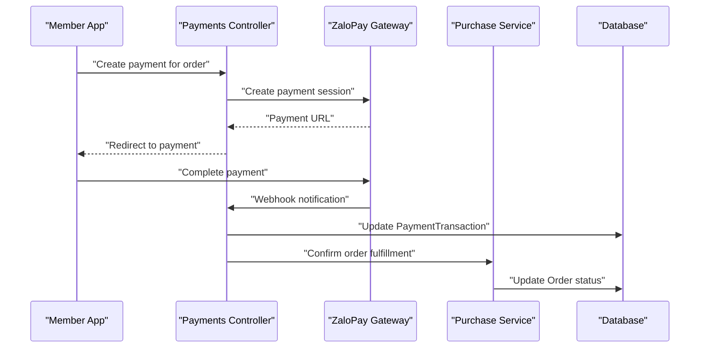
```mermaid
sequenceDiagram
participant Member as "Member App"
participant API as "Payments Controller"
participant ZALOPAY as "ZaloPay Gateway"
participant PURCHASE as "Purchase Service"
participant DB as "Database"
Member->>API : "Create payment for order"
API->>ZALOPAY : "Create payment session"
ZALOPAY-->>API : "Payment URL"
API-->>Member : "Redirect to payment"
Member->>ZALOPAY : "Complete payment"
ZALOPAY->>API : "Webhook notification"
API->>DB : "Update PaymentTransaction"
API->>PURCHASE : "Confirm order fulfillment"
PURCHASE->>DB : "Update Order status"
```

**Diagram sources**
- [src/NonCash.API/Controllers/PaymentsController.cs:47-163](file://src/NonCash.API/Controllers/PaymentsController.cs#L47-L163)
- [src/NonCash.Core/Entities/PaymentTransaction.cs:1-30](file://src/NonCash.Core/Entities/PaymentTransaction.cs#L1-L30)

**Section sources**
- [src/NonCash.API/Controllers/PaymentsController.cs:1-244](file://src/NonCash.API/Controllers/PaymentsController.cs#L1-L244)
- [src/NonCash.Core/Entities/PaymentTransaction.cs:1-30](file://src/NonCash.Core/Entities/PaymentTransaction.cs#L1-L30)

## Loyalty App Integrations
Loyalty app integrations enable external systems like mall apps and CRM platforms to interact with NonCash for voucher distribution, member wallet management, and event tracking.

### Partner Onboarding and Management
Integration partners are managed through a dedicated entity structure:
- **Partner registration**: External systems register with API keys and callback URLs
- **Brand authorization**: Partners are authorized to operate on specific brands
- **Security**: HMAC-SHA256 webhook signatures and API key authentication
- **Lifecycle management**: Active/inactive partner status control

### Member Wallet APIs
Partners can query member voucher wallets and lifecycle events:
- **Wallet queries**: Retrieve current voucher holdings across authorized brands
- **Event history**: Access complete lifecycle event history for analytics and notifications
- **Brand scoping**: Only returns vouchers from partner-authorized brands
- **Privacy protection**: Returns empty arrays for unknown members to prevent enumeration attacks

### Webhook Event Delivery
Real-time event notifications are delivered to partner systems:
- **Event types**: Distributed, Redeemed, Transferred (sent/received), Expired, Cancelled
- **Payload structure**: Includes event details, voucher information, and timestamps
- **Reliability**: Retry mechanisms and signature verification ensure delivery integrity

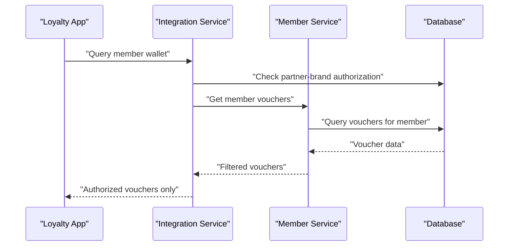
```mermaid
sequenceDiagram
participant Partner as "Loyalty App"
participant INTEGRATION as "Integration Service"
participant MEMBER as "Member Service"
participant DB as "Database"
Partner->>INTEGRATION : "Query member wallet"
INTEGRATION->>DB : "Check partner-brand authorization"
INTEGRATION->>MEMBER : "Get member vouchers"
MEMBER->>DB : "Query vouchers for member"
DB-->>MEMBER : "Voucher data"
MEMBER-->>INTEGRATION : "Filtered vouchers"
INTEGRATION-->>Partner : "Authorized vouchers only"
```

**Diagram sources**
- [src/NonCash.Core/Entities/IntegrationPartner.cs:1-46](file://src/NonCash.Core/Entities/IntegrationPartner.cs#L1-L46)

**Section sources**
- [src/NonCash.Core/Entities/IntegrationPartner.cs:1-46](file://src/NonCash.Core/Entities/IntegrationPartner.cs#L1-L46)

## Enhanced Display Data Handling
Enhanced display data handling provides centralized formatting for voucher values, status badges, and expiry information across all client interfaces.

### Value Formatting
The VoucherDisplayHelper provides consistent value formatting:
- **Percentage values**: Formatted as "20% OFF"
- **Monetary values**: Formatted with currency symbols and localization
- **Culture support**: Adapts formatting based on regional settings

### Status Badge Computation
Automatic status badge generation based on voucher state:
- **Used**: Completed vouchers
- **In Use**: Currently being processed
- **Expired**: Past expiry date
- **Expiring Soon**: Within 3 days of expiry
- **Active**: Valid and available for use

### Expiry Display
Human-friendly expiry date formatting:
- **Relative time**: "5 days left", "Expires today"
- **Past dates**: "Expired"
- **Localized**: Adapts to regional date formats

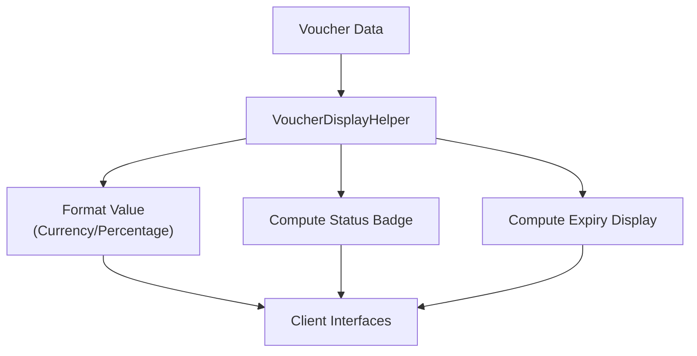
```mermaid
flowchart TD
VoucherData["Voucher Data"] --> Helper["VoucherDisplayHelper"]
Helper --> FormatValue["Format Value<br/>(Currency/Percentage)"]
Helper --> ComputeStatus["Compute Status Badge"]
Helper --> ComputeExpiry["Compute Expiry Display"]
FormatValue --> UI["Client Interfaces"]
ComputeStatus --> UI
ComputeExpiry --> UI
```

**Diagram sources**
- [src/NonCash.Shared/Helpers/VoucherDisplayHelper.cs:1-86](file://src/NonCash.Shared/Helpers/VoucherDisplayHelper.cs#L1-L86)

**Section sources**
- [src/NonCash.Shared/Helpers/VoucherDisplayHelper.cs:1-86](file://src/NonCash.Shared/Helpers/VoucherDisplayHelper.cs#L1-L86)

## Dependency Analysis
The system's dependencies align with the 3-layer architecture and microservices:

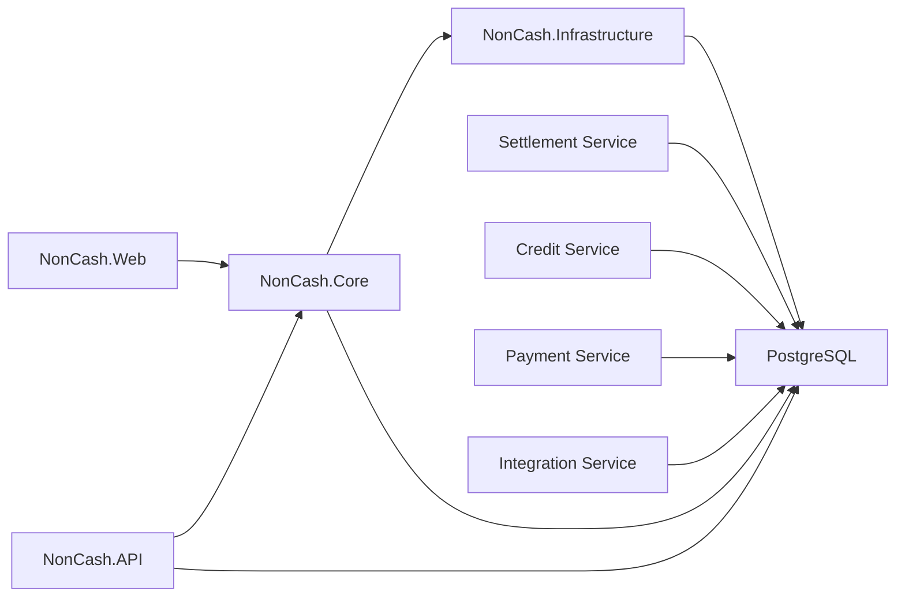
```mermaid
graph LR
Web["NonCash.Web"] --> Core["NonCash.Core"]
API["NonCash.API"] --> Core
Core --> Infra["NonCash.Infrastructure"]
Infra --> DB["PostgreSQL"]
API --> DB
Core --> DB
SETTLEMENT["Settlement Service"] --> DB
CREDIT["Credit Service"] --> DB
PAYMENT["Payment Service"] --> DB
INTEGRATION["Integration Service"] --> DB
```

**Diagram sources**
- [docs/source-tree-analysis.md:19-28](file://docs/source-tree-analysis.md#L19-L28)
- [docs/architecture.md:28-34](file://docs/architecture.md#L28-L34)

**Section sources**
- [docs/source-tree-analysis.md:36-50](file://docs/source-tree-analysis.md#L36-L50)
- [docs/architecture.md:28-34](file://docs/architecture.md#L28-L34)

## Performance Considerations
- Use dynamic voucher codes to minimize replay risk and reduce validation overhead
- Enforce multi-tenancy via BrandID to avoid cross-tenant scans and queries
- Apply transaction boundaries around POS redemption steps to ensure atomicity
- Index frequently queried fields (e.g., VoucherCode, MemberID, OutletID) in PostgreSQL
- Cache non-sensitive metadata (e.g., brand and outlet info) at the API gateway level
- Implement pagination for settlement and credit ledger queries to handle large datasets
- Use async/await patterns throughout to maximize throughput
- Optimize database queries with proper indexing and query optimization

## Troubleshooting Guide
Common issues and resolutions:
- Voucher invalid or expired: Verify expiry and publish dates; ensure plan is approved and published
- Double-spending attempts: Confirm lock acquisition succeeded and the voucher remains In-Use until commit
- Rollback not releasing lock: Ensure rollback endpoint is invoked with the correct LockID
- Distribution failures: Check VoucherDistribution logs and reconcile with plan detail generation
- Blacklisted customer errors: Validate customer status before transfer or purchase
- Settlement discrepancies: Verify cross-tenant detection logic and settlement entry creation
- Credit balance issues: Check credit ledger entries and consumption idempotency
- Payment webhook failures: Verify webhook signatures and retry failed deliveries
- Integration partner access: Confirm partner-brand authorization and API key validity

**Section sources**
- [Key Functionalities.txt:135-156](file://Key%20Functionalities.txt#L135-L156)
- [docs/api-contracts.md:14-87](file://docs/api-contracts.md#L14-L87)
- [docs/data-models.md:46-62](file://docs/data-models.md#L46-L62)

## Conclusion
NonCash provides a secure, scalable SaaS platform for voucher production and redemption with enhanced capabilities for cross-tenant settlement processing, credit ledger management, payment processing integration, and loyalty app integrations. Its 3-layer architecture, microservices design, and robust API contracts enable reliable production planning, multi-channel distribution, POS redemption with strong transaction integrity, comprehensive financial reconciliation, and seamless third-party integrations. The documented workflows, data models, and planning artifacts form a complete blueprint for implementation and operations.

## Appendices

### Practical Examples and Edge Cases
- Example: Batch promotion with 1,000 recipients
  - Validate plan approval and publish date
  - Upload phone numbers; system maps to MemberIDs and generates plan details
  - Log entries created in VoucherDistribution with Promotion method
- Edge: Rejected plan revision
  - Clone the rejected plan; adjust targets and resubmit; preserve historical approval records
- Edge: POS rollback scenario
  - If a transaction fails, call rollback to release the lock and restore Pending state
- Edge: Blacklisted customer transfer
  - Prevent transfer initiation if the recipient is blacklisted; notify sender accordingly
- Edge: Cross-tenant settlement
  - When a voucher sponsored by Brand A is redeemed at Brand B's outlet, automatically create settlement entry for financial reconciliation
- Edge: Credit consumption failure
  - Graceful handling allows POS redemption to proceed even if credit consumption fails due to system issues
- Edge: Payment webhook processing
  - Idempotent webhook processing prevents duplicate order fulfillment on network retries
- Edge: Integration partner brand scoping
  - Only return vouchers from brands explicitly authorized to the integration partner

**Section sources**
- [_bmad-output/planning-artifacts/epics.md:205-243](file://_bmad-output/planning-artifacts/epics.md#L205-L243)
- [Key Functionalities.txt:135-156](file://Key%20Functionalities.txt#L135-L156)
- [src/NonCash.Infrastructure/Services/SettlementService.cs:20-48](file://src/NonCash.Infrastructure/Services/SettlementService.cs#L20-L48)
- [src/NonCash.Infrastructure/Services/CreditService.cs:38-79](file://src/NonCash.Infrastructure/Services/CreditService.cs#L38-L79)
- [src/NonCash.API/Controllers/PaymentsController.cs:108-163](file://src/NonCash.API/Controllers/PaymentsController.cs#L108-L163)