# Business Logic and Workflows

<cite>
**Referenced Files in This Document**
- [Key Functionalities.txt](file://Key%20Functionalities.txt)
- [description.txt](file://description.txt)
- [docs/index.md](file://docs/index.md)
- [docs/architecture.md](file://docs/architecture.md)
- [docs/data-models.md](file://docs/data-models.md)
- [docs/api-contracts.md](file://docs/api-contracts.md)
- [docs/source-tree-analysis.md](file://docs/source-tree-analysis.md)
- [_bmad-output/planning-artifacts/epics.md](file://_bmad-output/planning-artifacts/epics.md)
- [_bmad-output/planning-artifacts/implementation-readiness-report-2026-04-17.md](file://_bmad-output/planning-artifacts/implementation-readiness-report-2026-04-17.md)
- [_bmad/bmm/config.yaml](file://_bmad/bmm/config.yaml)
- [_bmad/core/config.yaml](file://_bmad/core/config.yaml)
- [_bmad/_config/manifest.yaml](file://_bmad/_config/manifest.yaml)
- [src/NonCash.Core/Entities/SettlementEntry.cs](file://src/NonCash.Core/Entities/SettlementEntry.cs)
- [src/NonCash.Core/Entities/CreditLedgerEntry.cs](file://src/NonCash.Core/Entities/CreditLedgerEntry.cs)
- [src/NonCash.Core/Entities/PaymentTransaction.cs](file://src/NonCash.Core/Entities/PaymentTransaction.cs)
- [src/NonCash.Core/Entities/CreditBatch.cs](file://src/NonCash.Core/Entities/CreditBatch.cs)
- [src/NonCash.Core/Entities/CreditPricingPolicy.cs](file://src/NonCash.Core/Entities/CreditPricingPolicy.cs)
- [src/NonCash.Core/Entities/CreditAdjustmentRequest.cs](file://src/NonCash.Core/Entities/CreditAdjustmentRequest.cs)
- [src/NonCash.Core/Entities/CreditConsumption.cs](file://src/NonCash.Core/Entities/CreditConsumption.cs)
- [src/NonCash.Core/Entities/CreditExpiryLog.cs](file://src/NonCash.Core/Entities/CreditExpiryLog.cs)
- [src/NonCash.Core/Entities/WelcomeGrantPolicy.cs](file://src/NonCash.Core/Entities/WelcomeGrantPolicy.cs)
- [src/NonCash.Core/Entities/EmailLog.cs](file://src/NonCash.Core/Entities/EmailLog.cs)
- [src/NonCash.Core/Entities/Business.cs](file://src/NonCash.Core/Entities/Business.cs)
- [src/NonCash.Core/Entities/Customer.cs](file://src/NonCash.Core/Entities/Customer.cs)
- [src/NonCash.Core/Interfaces/ISettlementService.cs](file://src/NonCash.Core/Interfaces/ISettlementService.cs)
- [src/NonCash.Core/Interfaces/ICreditService.cs](file://src/NonCash.Core/Interfaces/ICreditService.cs)
- [src/NonCash.Core/Interfaces/ICreditPolicyService.cs](file://src/NonCash.Core/Interfaces/ICreditPolicyService.cs)
- [src/NonCash.Core/Interfaces/IWelcomePolicyService.cs](file://src/NonCash.Core/Interfaces/IWelcomePolicyService.cs)
- [src/NonCash.API/Controllers/SettlementsController.cs](file://src/NonCash.API/Controllers/SettlementsController.cs)
- [src/NonCash.API/Controllers/CreditsController.cs](file://src/NonCash.API/Controllers/CreditsController.cs)
- [src/NonCash.API/Controllers/CreditAdjustmentsController.cs](file://src/NonCash.API/Controllers/CreditAdjustmentsController.cs)
- [src/NonCash.API/Controllers/CreditPoliciesController.cs](file://src/NonCash.API/Controllers/CreditPoliciesController.cs)
- [src/NonCash.API/Controllers/WelcomePoliciesController.cs](file://src/NonCash.API/Controllers/WelcomePoliciesController.cs)
- [src/NonCash.API/Controllers/PaymentsController.cs](file://src/NonCash.API/Controllers/PaymentsController.cs)
- [src/NonCash.API/Controllers/BusinessesController.cs](file://src/NonCash.API/Controllers/BusinessesController.cs)
- [src/NonCash.Infrastructure/Services/SettlementService.cs](file://src/NonCash.Infrastructure/Services/SettlementService.cs)
- [src/NonCash.Infrastructure/Services/CreditService.cs](file://src/NonCash.Infrastructure/Services/CreditService.cs)
- [src/NonCash.Infrastructure/Services/CreditAdjustmentService.cs](file://src/NonCash.Infrastructure/Services/CreditAdjustmentService.cs)
- [src/NonCash.Infrastructure/Services/CreditPolicyService.cs](file://src/NonCash.Infrastructure/Services/CreditPolicyService.cs)
- [src/NonCash.Infrastructure/Services/WelcomePolicyService.cs](file://src/NonCash.Infrastructure/Services/WelcomePolicyService.cs)
- [src/NonCash.Infrastructure/Services/EmailNotificationService.cs](file://src/NonCash.Infrastructure/Services/EmailNotificationService.cs)
- [src/NonCash.API/HostedServices/CreditExpirySweepService.cs](file://src/NonCash.API/HostedServices/CreditExpirySweepService.cs)
- [src/NonCash.Shared/Helpers/VoucherDisplayHelper.cs](file://src/NonCash.Shared/Helpers/VoucherDisplayHelper.cs)
- [src/NonCash.Core/Configuration/CreditConfig.cs](file://src/NonCash.Core/Configuration/CreditConfig.cs)
- [src/NonCash.Infrastructure/Migrations/20260814050918_SplitWelcomePolicy.cs](file://src/NonCash.Infrastructure/Migrations/20260814050918_SplitWelcomePolicy.cs)
- [src/NonCash.Infrastructure/Migrations/20260814110418_AddEmailLog.cs](file://src/NonCash.Infrastructure/Migrations/20260814110418_AddEmailLog.cs)
</cite>

## Update Summary
**Changes Made**
- Added comprehensive email logging system with audit trail for all outbound notifications
- Enhanced business management capabilities with dedicated Business entity and CRUD operations
- Improved customer management with enhanced blacklist functionality and search capabilities
- Updated notification service to integrate with email logging system for complete audit trails
- Added new API endpoints for business management and improved customer operations

## Table of Contents
1. [Introduction](#introduction)
2. [Project Structure](#project-structure)
3. [Core Components](#core-components)
4. [Architecture Overview](#architecture-overview)
5. [Detailed Component Analysis](#detailed-component-analysis)
6. [Epic 10 Batch-Based Credit System](#epic-10-batch-based-credit-system)
7. [Credit Pricing Policy Management](#credit-pricing-policy-management)
8. [Business-Scoped Welcome Credit Policies](#business-scoped-welcome-credit-policies)
9. [Enhanced Email Logging System](#enhanced-email-logging-system)
10. [Business Management Capabilities](#business-management-capabilities)
11. [Enhanced Customer Management](#enhanced-customer-management)
12. [Maker-Checker Adjustment Workflow](#maker-checker-adjustment-workflow)
13. [Automated Credit Expiry Management](#automated-credit-expiry-management)
14. [Cross-Tenant Settlement Processing](#cross-tenant-settlement-processing)
15. [Payment Processing Integration](#payment-processing-integration)
16. [Loyalty App Integrations](#loyalty-app-integrations)
17. [Enhanced Display Data Handling](#enhanced-display-data-handling)
18. [Dependency Analysis](#dependency-analysis)
19. [Performance Considerations](#performance-considerations)
20. [Troubleshooting Guide](#troubleshooting-guide)
21. [Conclusion](#conclusion)
22. [Appendices](#appendices)

## Introduction
This document explains the NonCash business logic and workflows across production planning, distribution, POS redemption, customer and brand management, approvals, reporting, and the newly implemented Epic 10 batch-based credit system. The major architectural shift introduces sophisticated credit management with batch lifecycle, pricing policies, maker-checker approval workflows, and automated expiry handling. It synthesizes the project's functional requirements, architecture, and API contracts into a cohesive guide for both technical and non-technical stakeholders. Practical scenarios and edge cases are included to illustrate real-world usage.

## Project Structure
The NonCash project is organized around a 3-layer SaaS architecture with microservices for planning, approval, distribution, usage, identity, tenant management, settlement processing, credit management, payment integration, and email notification services. The repository includes:
- Business requirement and functional specification documents
- Architectural and data model documentation
- API contracts for POS and Member App
- Planning artifacts and implementation readiness assessments
- BMAD configuration for project orchestration

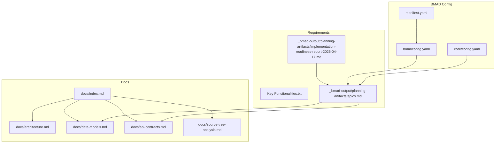
```mermaid
graph TB
subgraph "Docs"
IDX["docs/index.md"]
ARCH["docs/architecture.md"]
DM["docs/data-models.md"]
API["docs/api-contracts.md"]
STA["docs/source-tree-analysis.md"]
end
subgraph "Requirements"
KEY["Key Functionalities.txt"]
EPICS["_bmad-output/planning-artifacts/epics.md"]
IR["_bmad-output/planning-artifacts/implementation-readiness-report-2026-04-17.md"]
end
subgraph "BMAD Config"
BMM["bmm/config.yaml"]
CORE["core/config.yaml"]
MAN["manifest.yaml"]
end
IDX --> ARCH
IDX --> DM
IDX --> API
IDX --> STA
EPICS --> API
EPICS --> DM
IR --> EPICS
BMM --> EPICS
CORE --> EPICS
MAN --> BMM
```

**Diagram sources**
- [docs/index.md:1-41](file://docs/index.md#L1-L41)
- [docs/architecture.md:1-52](file://docs/architecture.md#L1-L52)
- [docs/data-models.md:1-98](file://docs/data-models.md#L1-L98)
- [docs/api-contracts.md:1-109](file://docs/api-contracts.md#L1-L109)
- [docs/source-tree-analysis.md:1-50](file://docs/source-tree-analysis.md#L1-L50)
- [_bmad-output/planning-artifacts/epics.md:1-319](file://_bmad-output/planning-artifacts/epics.md#L1-L319)
- [_bmad-output/planning-artifacts/implementation-readiness-report-2026-04-17.md:1-127](file://_bmad-output/planning-artifacts/implementation-readiness-report-2026-04-17.md#L1-L127)
- [_bmad/bmm/config.yaml:1-17](file://_bmad/bmm/config.yaml#L1-L17)
- [_bmad/core/config.yaml:1-10](file://_bmad/core/config.yaml#L1-L10)
- [_bmad/_config/manifest.yaml:1-25](file://_bmad/_config/manifest.yaml#L1-L25)

**Section sources**
- [docs/index.md:12-32](file://docs/index.md#L12-L32)
- [docs/source-tree-analysis.md:36-50](file://docs/source-tree-analysis.md#L36-L50)

## Core Components
NonCash organizes business capabilities into microservices aligned with functional epics:
- Planning Service: Campaign creation, budgeting, and targets
- Approval Service: Routing and state management for plan reviews
- Distribution Service: Sales, promotions, and inbox delivery
- Usage Service: POS redemption workflow (Lock → Commit/Rollback)
- Identity & Tenant Service: RBAC for UserAccount, multi-tenancy for Brand and Outlet, and Customer profile management
- Settlement Service: Cross-tenant settlement ledger and netting reports
- **Enhanced Credit Service**: Batch-based prepaid credit billing with FIFO consumption, pricing policies, and maker-checker workflows
- Payment Service: Payment gateway integration and transaction management
- Integration Service: Loyalty app partner management and member wallet APIs
- **Email Notification Service**: Comprehensive email logging and audit trail system
- **Business Management Service**: Multi-business support with brand relationships

These services operate under JWT and API Key security, enforce multi-tenancy via BrandID, and use dynamic voucher codes to prevent fraud.

**Section sources**
- [docs/architecture.md:17-26](file://docs/architecture.md#L17-L26)
- [docs/architecture.md:36-41](file://docs/architecture.md#L36-L41)
- [Key Functionalities.txt:70-86](file://Key%20Functionalities.txt#L70-L86)

## Architecture Overview
The system follows a 3-layer SaaS design:
- Frontend (Blazor): Management dashboards and user interactions
- Business Logic (Microservices): Domain services orchestrating workflows
- Data Access (PostgreSQL via EF Core): Repository pattern and migrations

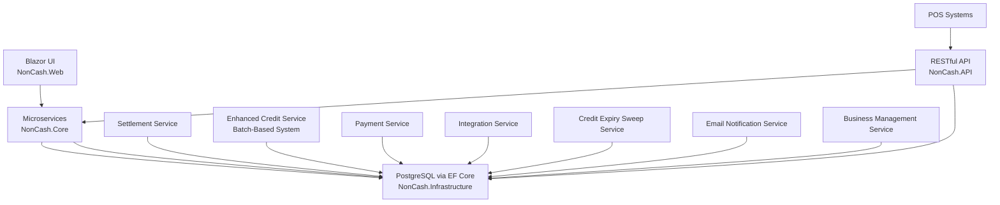
```mermaid
graph TB
UI["Blazor UI<br/>NonCash.Web"] --> BLL["Microservices<br/>NonCash.Core"]
BLL --> DAL["PostgreSQL via EF Core<br/>NonCash.Infrastructure"]
POS["POS Systems"] --> API["RESTful API<br/>NonCash.API"]
API --> BLL
API --> DAL
BLL --> DAL
SETTLEMENT["Settlement Service"] --> DAL
CREDIT["Enhanced Credit Service<br/>Batch-Based System"] --> DAL
PAYMENT["Payment Service"] --> DAL
INTEGRATION["Integration Service"] --> DAL
EXPIRY["Credit Expiry Sweep Service"] --> DAL
EMAIL["Email Notification Service"] --> DAL
BUSINESS["Business Management Service"] --> DAL
```

**Diagram sources**
- [docs/architecture.md:9-34](file://docs/architecture.md#L9-L34)
- [docs/source-tree-analysis.md:19-28](file://docs/source-tree-analysis.md#L19-L28)

**Section sources**
- [docs/architecture.md:5-52](file://docs/architecture.md#L5-L52)
- [docs/source-tree-analysis.md:36-50](file://docs/source-tree-analysis.md#L36-L50)

## Detailed Component Analysis

### Production Planning and Approval Workflow
Production planning centers on VoucherPlanHeader and VoucherPlanDetail. The process includes:
- Plan creation with attributes such as brand, type, face/net values, expiry/publish dates, sales range, and targets
- Approval routing with state transitions (Pending → Approved/Rejected)
- Plan versioning and adjustments after rejection
- Generation of VoucherPlanDetail records with dynamic codes and ownership assignment

```mermaid
flowchart TD
Start(["Create Plan Header"]) --> Validate["Validate Inputs<br/>and Targets"]
Validate --> SaveHeader["Save VoucherPlanHeader<br/>with Pending Approval"]
SaveHeader --> Submit["Submit for Approval"]
Submit --> Review{"Approve or Reject?"}
Review --> |Approve| Publish["Set Publish Date<br/>and Activate"]
Review --> |Reject| Adjust["Clone/Adjust Plan<br/>and Resubmit"]
Publish --> Generate["Generate VoucherPlanDetail<br/>with Dynamic Codes"]
Adjust --> Generate
Generate --> End(["Ready for Distribution"])
```

**Diagram sources**
- [docs/data-models.md:11-43](file://docs/data-models.md#L11-L43)
- [docs/data-models.md:34-43](file://docs/data-models.md#L34-L43)
- [Key Functionalities.txt:70-86](file://Key%20Functionalities.txt#L70-L86)
- [_bmad-output/planning-artifacts/epics.md:139-197](file://_bmad-output/planning-artifacts/epics.md#L139-L197)

**Section sources**
- [Key Functionalities.txt:7-68](file://Key%20Functionalities.txt#L7-L68)
- [_bmad-output/planning-artifacts/epics.md:139-197](file://_bmad-output/planning-artifacts/epics.md#L139-L197)
- [docs/data-models.md:11-43](file://docs/data-models.md#L11-L43)

### Multi-Channel Distribution Strategies
NonCash supports multiple distribution channels:
- Self-purchase (Sale): Members buy vouchers directly; ownership assigned to MemberID; logged in VoucherDistribution
- Batch promotion: Import phone numbers or MemberIDs; system creates and delivers vouchers to inboxes; logged as Promotion method
- Gifting/transfer: Owners initiate transfers; recipients confirm; logged as Transfer method

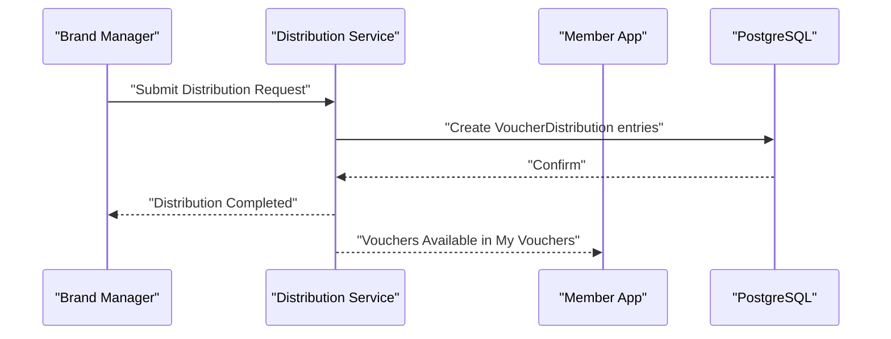
```mermaid
sequenceDiagram
participant Brand as "Brand Manager"
participant Dist as "Distribution Service"
participant Mem as "Member App"
participant DB as "PostgreSQL"
Brand->>Dist : "Submit Distribution Request"
Dist->>DB : "Create VoucherDistribution entries"
DB-->>Dist : "Confirm"
Dist-->>Brand : "Distribution Completed"
Dist-->>Mem : "Vouchers Available in My Vouchers"
```

**Diagram sources**
- [_bmad-output/planning-artifacts/epics.md:199-257](file://_bmad-output/planning-artifacts/epics.md#L199-L257)
- [docs/data-models.md:55-62](file://docs/data-models.md#L55-62)

**Section sources**
- [Key Functionalities.txt:87-134](file://Key%20Functionalities.txt#L87-L134)
- [_bmad-output/planning-artifacts/epics.md:199-257](file://_bmad-output/planning-artifacts/epics.md#L199-L257)
- [docs/data-models.md:55-62](file://docs/data-models.md#L55-L62)

### POS Redemption Security and Transaction Lifecycle
POS redemption enforces transaction integrity with lock/commit/rollback, now enhanced with settlement processing and Epic 10 batch-based credit consumption:
- Verify: Check validity without changing state
- Lock: Transition to In-Use and bind to a transaction context
- Commit: Finalize usage, persist VoucherUsage, mark Complete, create settlement entry if cross-tenant, consume credit from FIFO batch
- Rollback: Release lock, revert to Pending

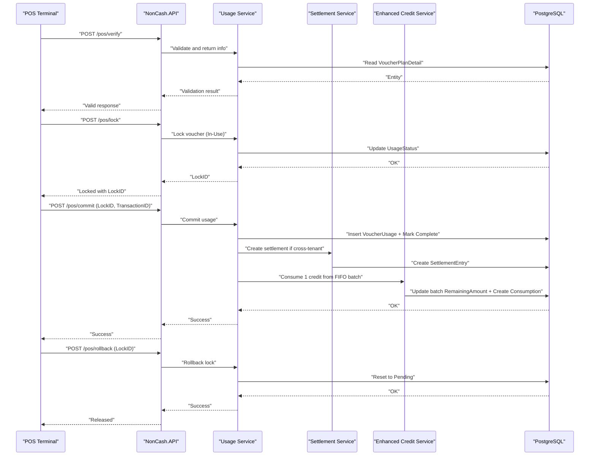
```mermaid
sequenceDiagram
participant POS as "POS Terminal"
participant API as "NonCash.API"
participant SVC as "Usage Service"
participant SETTLE as "Settlement Service"
participant CREDIT as "Enhanced Credit Service"
participant DB as "PostgreSQL"
POS->>API : "POST /pos/verify"
API->>SVC : "Validate and return info"
SVC->>DB : "Read VoucherPlanDetail"
DB-->>SVC : "Entity"
SVC-->>API : "Validation result"
API-->>POS : "Valid response"
POS->>API : "POST /pos/lock"
API->>SVC : "Lock voucher (In-Use)"
SVC->>DB : "Update UsageStatus"
DB-->>SVC : "OK"
SVC-->>API : "LockID"
API-->>POS : "Locked with LockID"
POS->>API : "POST /pos/commit (LockID, TransactionID)"
API->>SVC : "Commit usage"
SVC->>DB : "Insert VoucherUsage + Mark Complete"
SVC->>SETTLE : "Create settlement if cross-tenant"
SETTLE->>DB : "Create SettlementEntry"
SVC->>CREDIT : "Consume 1 credit from FIFO batch"
CREDIT->>DB : "Update batch RemainingAmount + Create Consumption"
DB-->>SVC : "OK"
SVC-->>API : "Success"
API-->>POS : "Success"
POS->>API : "POST /pos/rollback (LockID)"
API->>SVC : "Rollback lock"
SVC->>DB : "Reset to Pending"
DB-->>SVC : "OK"
SVC-->>API : "Success"
API-->>POS : "Released"
```

**Diagram sources**
- [docs/api-contracts.md:14-87](file://docs/api-contracts.md#L14-L87)
- [docs/data-models.md:46-54](file://docs/data-models.md#L46-L54)
- [docs/data-models.md:34-43](file://docs/data-models.md#L34-L43)
- [src/NonCash.Infrastructure/Services/SettlementService.cs:20-48](file://src/NonCash.Infrastructure/Services/SettlementService.cs#L20-L48)
- [src/NonCash.Infrastructure/Services/CreditService.cs:43-109](file://src/NonCash.Infrastructure/Services/CreditService.cs#L43-L109)

**Section sources**
- [Key Functionalities.txt:135-156](file://Key%20Functionalities.txt#L135-L156)
- [docs/api-contracts.md:14-87](file://docs/api-contracts.md#L14-L87)
- [docs/data-models.md:46-54](file://docs/data-models.md#L46-L54)

### Approval and Publication Workflow
Approval involves:
- Submission of a plan with Pending status
- Review by an approver with Approve/Reject actions
- Optional adjustment and resubmission after rejection
- Activation upon approval with Publish Date enforcement

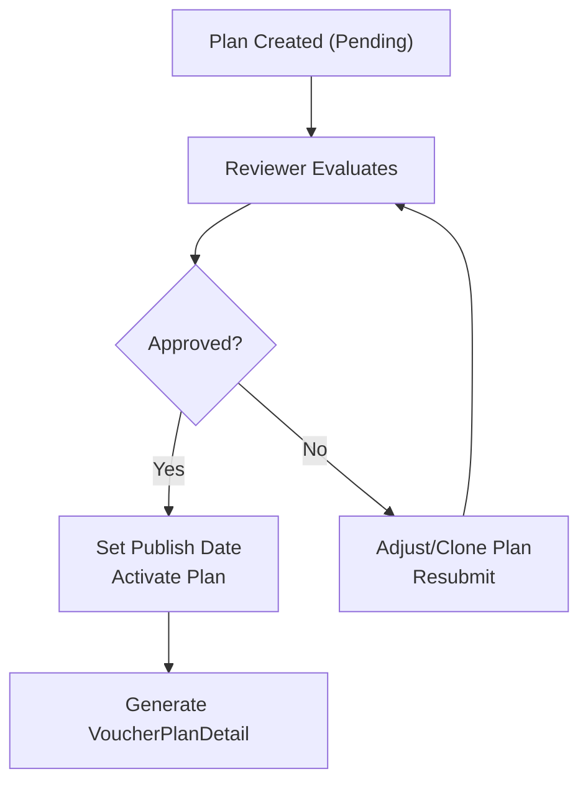
```mermaid
flowchart TD
P["Plan Created (Pending)"] --> R["Reviewer Evaluates"]
R --> A{"Approved?"}
A --> |Yes| Pub["Set Publish Date<br/>Activate Plan"]
A --> |No| Revise["Adjust/Clone Plan<br/>Resubmit"]
Revise --> R
Pub --> Gen["Generate VoucherPlanDetail"]
```

**Diagram sources**
- [Key Functionalities.txt:70-86](file://Key%20Functionalities.txt#L70-L86)
- [_bmad-output/planning-artifacts/epics.md:171-197](file://_bmad-output/planning-artifacts/epics.md#L171-L197)

**Section sources**
- [Key Functionalities.txt:70-86](file://Key%20Functionalities.txt#L70-L86)
- [_bmad-output/planning-artifacts/epics.md:171-197](file://_bmad-output/planning-artifacts/epics.md#L171-L197)

### Reporting Dashboard and Audit Trails
- Distribution tracking dashboard aggregates VoucherDistribution logs and compares actual versus target metrics
- POS usage audit trail stored in VoucherUsage with POSID, TransactionID, and timestamps
- Plan approval history preserved for traceability
- Settlement ledger provides financial reconciliation between brands
- **Enhanced credit ledger tracks batch-based credit consumption, adjustments, and expiry events**
- **Email notification audit trail tracks all outbound communications with success/failure status**

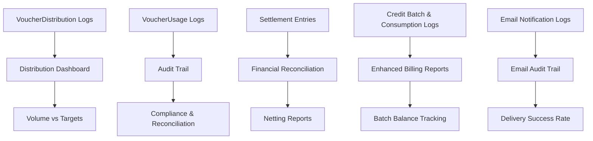
```mermaid
flowchart TD
DistLogs["VoucherDistribution Logs"] --> Dash["Distribution Dashboard"]
UsageLogs["VoucherUsage Logs"] --> Audit["Audit Trail"]
SettlementLogs["Settlement Entries"] --> Financial["Financial Reconciliation"]
CreditLogs["Credit Batch & Consumption Logs"] --> Billing["Enhanced Billing Reports"]
EmailLogs["Email Notification Logs"] --> EmailAudit["Email Audit Trail"]
Dash --> Metrics["Volume vs Targets"]
Audit --> Compliance["Compliance & Reconciliation"]
Financial --> Netting["Netting Reports"]
Billing --> Balance["Batch Balance Tracking"]
EmailAudit --> Delivery["Delivery Success Rate"]
```

**Diagram sources**
- [_bmad-output/planning-artifacts/epics.md:244-256](file://_bmad-output/planning-artifacts/epics.md#L244-L256)
- [docs/data-models.md:46-62](file://docs/data-models.md#L46-L62)
- [src/NonCash.Core/Entities/SettlementEntry.cs:1-49](file://src/NonCash.Core/Entities/SettlementEntry.cs#L1-L49)
- [src/NonCash.Core/Entities/CreditBatch.cs:1-71](file://src/NonCash.Core/Entities/CreditBatch.cs#L1-L71)
- [src/NonCash.Core/Entities/CreditConsumption.cs:1-23](file://src/NonCash.Core/Entities/CreditConsumption.cs#L1-L23)
- [src/NonCash.Core/Entities/EmailLog.cs:1-24](file://src/NonCash.Core/Entities/EmailLog.cs#L1-L24)

**Section sources**
- [_bmad-output/planning-artifacts/epics.md:244-256](file://_bmad-output/planning-artifacts/epics.md#L244-L256)
- [docs/data-models.md:46-62](file://docs/data-models.md#L46-L62)

## Epic 10 Batch-Based Credit System

**Updated** Major architectural shift from simple ledger model to sophisticated batch-based credit system with FIFO consumption, pricing policies, and automated lifecycle management.

The Epic 10 credit system replaces the previous simple ledger approach with a comprehensive batch-based model where each credit top-up creates a separate batch with its own price, expiry, and lifecycle. Balance calculation sums remaining amounts across all non-expired batches, while consumption drains credits FIFO from the oldest available batch.

### Credit Batch Model
Each credit batch represents a distinct credit acquisition event with:
- **Batch Type**: Purchase, WelcomeGrant, Grant, Compensation, Correction, Clawback, or Reinstatement
- **Original Amount**: Credits granted by this batch (negative for clawbacks)
- **Remaining Amount**: Credits still available (0..OriginalAmount)
- **Price Per Credit**: Unit price snapshot at purchase time (0 for free grants)
- **Total Paid VND**: Actual amount paid (Purchase only)
- **Expires At**: When remaining credits expire (null = never expires)
- **Evidence Image URL**: Supporting documentation for manual operations
- **WelcomePolicyId**: Reference to the welcome grant policy that created this batch (for WelcomeGrant type)

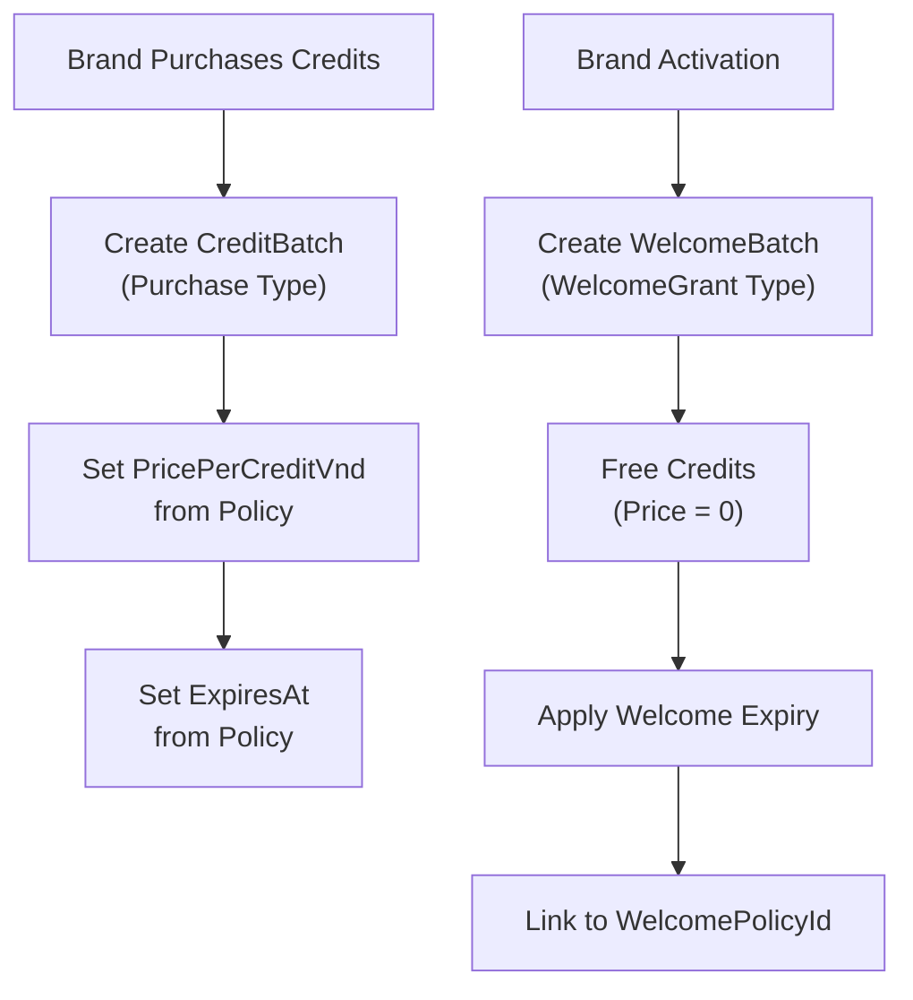
```mermaid
flowchart TD
Purchase["Brand Purchases Credits"] --> CreateBatch["Create CreditBatch<br/>(Purchase Type)"]
CreateBatch --> SetPrice["Set PricePerCreditVnd<br/>from Policy"]
SetPrice --> SetExpiry["Set ExpiresAt<br/>from Policy"]
Welcome["Brand Activation"] --> WelcomeBatch["Create WelcomeBatch<br/>(WelcomeGrant Type)"]
WelcomeBatch --> FreePrice["Free Credits<br/>(Price = 0)"]
FreePrice --> WelcomeExpiry["Apply Welcome Expiry"]
WelcomeExpiry --> LinkPolicy["Link to WelcomePolicyId"]
```

**Diagram sources**
- [src/NonCash.Core/Entities/CreditBatch.cs:1-75](file://src/NonCash.Core/Entities/CreditBatch.cs#L1-L75)
- [src/NonCash.Infrastructure/Services/CreditService.cs:111-173](file://src/NonCash.Infrastructure/Services/CreditService.cs#L111-L173)

### FIFO Consumption Algorithm
Credit consumption follows strict FIFO (First-In-First-Out) principles:
- Consumption queries for oldest non-expired batch with remaining credits
- Grace overdraft allows newest batch to go negative when no valid batches exist
- Idempotent per voucher detail ID (enforced by unique index)
- Each voucher consumes exactly 1 credit regardless of batch size

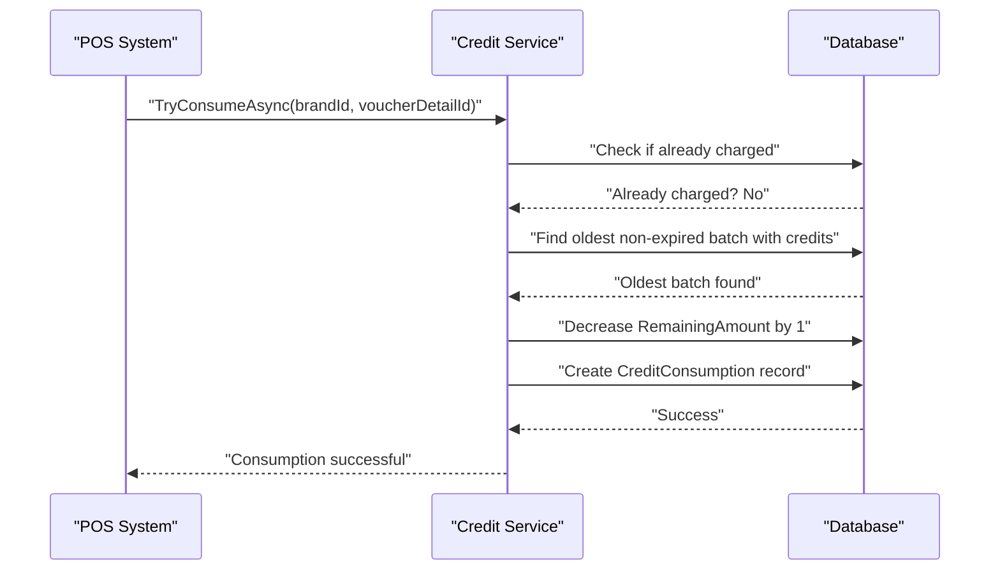
```mermaid
sequenceDiagram
participant POS as "POS System"
participant CREDIT as "Credit Service"
participant DB as "Database"
POS->>CREDIT : "TryConsumeAsync(brandId, voucherDetailId)"
CREDIT->>DB : "Check if already charged"
DB-->>CREDIT : "Already charged? No"
CREDIT->>DB : "Find oldest non-expired batch with credits"
DB-->>CREDIT : "Oldest batch found"
CREDIT->>DB : "Decrease RemainingAmount by 1"
CREDIT->>DB : "Create CreditConsumption record"
DB-->>CREDIT : "Success"
CREDIT-->>POS : "Consumption successful"
```

**Diagram sources**
- [src/NonCash.Infrastructure/Services/CreditService.cs:43-109](file://src/NonCash.Infrastructure/Services/CreditService.cs#L43-L109)

**Section sources**
- [src/NonCash.Core/Entities/CreditBatch.cs:1-75](file://src/NonCash.Core/Entities/CreditBatch.cs#L1-L75)
- [src/NonCash.Core/Entities/CreditConsumption.cs:1-23](file://src/NonCash.Core/Entities/CreditConsumption.cs#L1-L23)
- [src/NonCash.Infrastructure/Services/CreditService.cs:1-200](file://src/NonCash.Infrastructure/Services/CreditService.cs#L1-L200)

## Credit Pricing Policy Management

**New** Comprehensive pricing policy system with scope-based resolution and time-bound effectiveness.

Credit pricing policies define unit prices, expiry rules, welcome credits, and approval thresholds. Policies can be scoped globally, to brand groups, or to individual brands, with resolution priority following Brand → BrandGroup → Global hierarchy.

### Policy Resolution Engine
The policy resolution engine implements sophisticated scoping logic:
- **Brand-scoped policies**: Override all other policies for specific brands
- **BrandGroup-scoped policies**: Apply to all brands within a group
- **Global policies**: Default policies when no specific scope matches
- **Time-bound effectiveness**: Policies have EffectiveFrom and EffectiveTo dates
- **Fallback mechanism**: Falls back to CreditConfig defaults when no DB policy matches

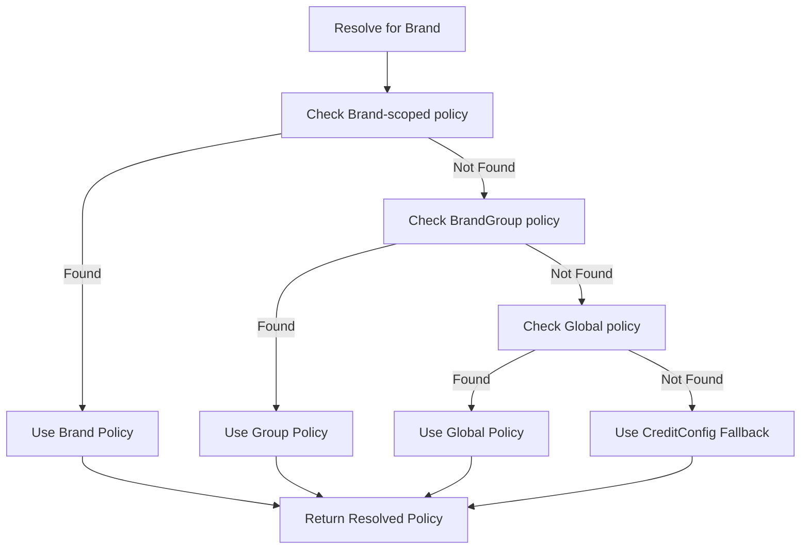
```mermaid
flowchart TD
BrandQuery["Resolve for Brand"] --> CheckBrand["Check Brand-scoped policy"]
CheckBrand --> |Found| UseBrand["Use Brand Policy"]
CheckBrand --> |Not Found| CheckGroup["Check BrandGroup policy"]
CheckGroup --> |Found| UseGroup["Use Group Policy"]
CheckGroup --> |Not Found| CheckGlobal["Check Global policy"]
CheckGlobal --> |Found| UseGlobal["Use Global Policy"]
CheckGlobal --> |Not Found| UseConfig["Use CreditConfig Fallback"]
UseBrand --> Resolve["Return Resolved Policy"]
UseGroup --> Resolve
UseGlobal --> Resolve
UseConfig --> Resolve
```

**Diagram sources**
- [src/NonCash.Infrastructure/Services/CreditPolicyService.cs:25-60](file://src/NonCash.Infrastructure/Services/CreditPolicyService.cs#L25-L60)

### Policy Configuration Options
Policies support comprehensive configuration options:
- **Price Per Credit VND**: Flat unit price for purchased credits
- **Credit Expiry Months**: Months until purchased credits expire (null = never)
- **Low Balance Warning**: Percentage threshold for balance warnings
- **Expiry Warning Days**: Days before batch expiry to send warnings
- **Adjustment Approval Threshold**: Amount requiring FinancialController approval

**Section sources**
- [src/NonCash.Core/Entities/CreditPricingPolicy.cs:1-65](file://src/NonCash.Core/Entities/CreditPricingPolicy.cs#L1-L65)
- [src/NonCash.Core/Interfaces/ICreditPolicyService.cs:1-23](file://src/NonCash.Core/Interfaces/ICreditPolicyService.cs#L1-L23)
- [src/NonCash.Infrastructure/Services/CreditPolicyService.cs:1-149](file://src/NonCash.Infrastructure/Services/CreditPolicyService.cs#L1-L149)
- [src/NonCash.API/Controllers/CreditPoliciesController.cs:1-204](file://src/NonCash.API/Controllers/CreditPoliciesController.cs#L1-L204)

## Business-Scoped Welcome Credit Policies

**Updated** Welcome credit system now uses business-scoped policies instead of brand-scoped configuration. Migration transforms existing brand-level welcome credits to business-level policies with 'Migrated:' prefix preservation.

Welcome credits are now managed through dedicated business-scoped policies rather than being embedded in credit pricing policies. This change allows businesses to negotiate uniform welcome credit terms that apply to all brands they launch, providing better commercial flexibility and contract management.

### Welcome Grant Policy Model
Business-scoped welcome grant policies provide versioned, time-bound welcome credit configurations:
- **BusinessId**: Links policy to specific business for commercial agreements
- **WelcomeCredits**: Number of free credits granted to each new brand under this business
- **WelcomeCreditExpiryMonths**: Expiry period for welcome credits (default 12 months)
- **EffectiveFrom/EffectiveTo**: Time-bound policy periods for contract management
- **IsActive**: Soft delete capability for policy lifecycle management
- **CreatedBy**: Audit trail for policy creation

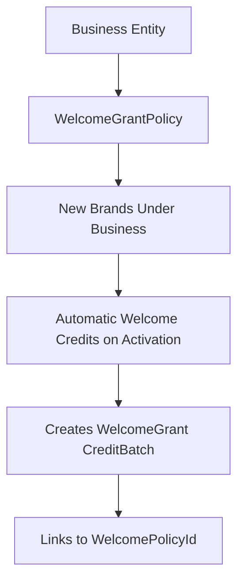
```mermaid
flowchart TD
Business["Business Entity"] --> WelcomePolicy["WelcomeGrantPolicy"]
WelcomePolicy --> NewBrands["New Brands Under Business"]
NewBrands --> AutoGrant["Automatic Welcome Credits on Activation"]
AutoGrant --> CreditBatch["Creates WelcomeGrant CreditBatch"]
CreditBatch --> LinkPolicy["Links to WelcomePolicyId"]
```

**Diagram sources**
- [src/NonCash.Core/Entities/WelcomeGrantPolicy.cs:1-36](file://src/NonCash.Core/Entities/WelcomeGrantPolicy.cs#L1-L36)
- [src/NonCash.Core/Entities/CreditBatch.cs:34-35](file://src/NonCash.Core/Entities/CreditBatch.cs#L34-L35)

### Policy Resolution Engine
The welcome policy resolution engine implements business-scoped resolution with fallback mechanisms:
- **Business-scoped policies**: Most recent active policy for the specific business
- **CreditConfig fallback**: Default welcome credits when no business policy exists
- **Version precedence**: Newest effective policy wins within business scope
- **Time-bound validation**: Only active policies within effective date ranges

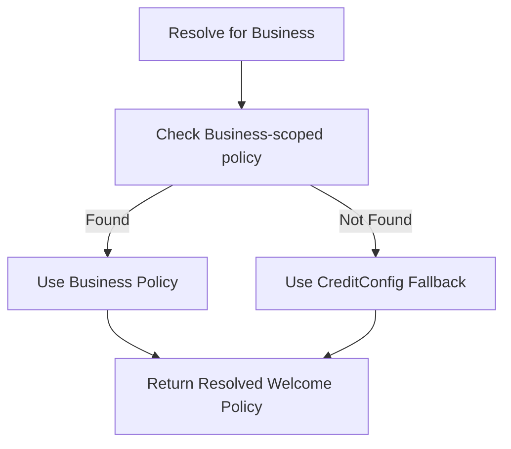
```mermaid
flowchart TD
BusinessQuery["Resolve for Business"] --> CheckBusiness["Check Business-scoped policy"]
CheckBusiness --> |Found| UseBusiness["Use Business Policy"]
CheckBusiness --> |Not Found| UseConfig["Use CreditConfig Fallback"]
UseBusiness --> Resolve["Return Resolved Welcome Policy"]
UseConfig --> Resolve
```

**Diagram sources**
- [src/NonCash.Infrastructure/Services/WelcomePolicyService.cs:25-52](file://src/NonCash.Infrastructure/Services/WelcomePolicyService.cs#L25-L52)

### Migration Process
The migration automatically transforms existing brand-scoped welcome credits to business-scoped policies:
- **Data Preservation**: Existing brand-level welcome credits are migrated to business-level policies
- **'Migrated:' Prefix**: Migrated policies are prefixed with 'Migrated:' for identification
- **Business Mapping**: Brand-to-business relationships are used to map policies correctly
- **Column Removal**: Welcome credit columns are removed from credit_pricing_policies table

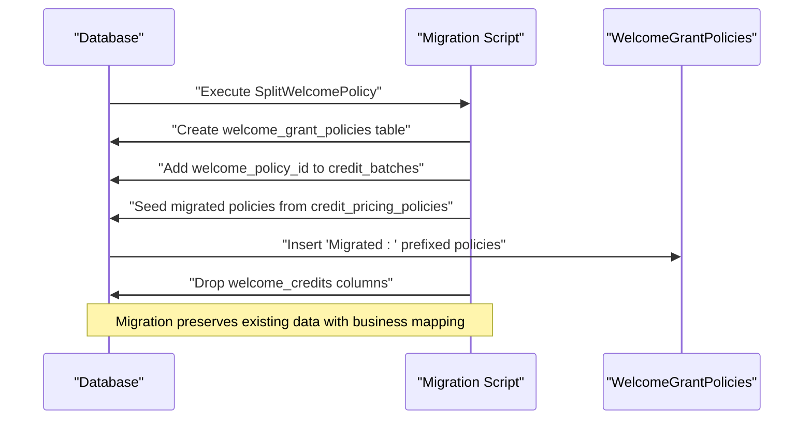
```mermaid
sequenceDiagram
participant DB as "Database"
participant Migration as "Migration Script"
participant Policy as "WelcomeGrantPolicies"
DB->>Migration : "Execute SplitWelcomePolicy"
Migration->>DB : "Create welcome_grant_policies table"
Migration->>DB : "Add welcome_policy_id to credit_batches"
Migration->>DB : "Seed migrated policies from credit_pricing_policies"
DB->>Policy : "Insert 'Migrated : ' prefixed policies"
Migration->>DB : "Drop welcome_credits columns"
Note over Migration,DB : Migration preserves existing data with business mapping
```

**Diagram sources**
- [src/NonCash.Infrastructure/Migrations/20260814050918_SplitWelcomePolicy.cs:74-99](file://src/NonCash.Infrastructure/Migrations/20260814050918_SplitWelcomePolicy.cs#L74-L99)

### API Management
New admin endpoints provide comprehensive welcome policy management:
- **GET /api/v1/welcome-policies/businesses**: List businesses for policy targeting
- **GET /api/v1/welcome-policies**: Retrieve all welcome policies
- **POST /api/v1/welcome-policies**: Create new welcome policy
- **PUT /api/v1/welcome-policies/{id}**: Update existing policy
- **DELETE /api/v1/welcome-policies/{id}/deactivate**: Deactivate policy
- **GET /api/v1/welcome-policies/resolve**: Resolve effective policy for business

**Section sources**
- [src/NonCash.Core/Entities/WelcomeGrantPolicy.cs:1-36](file://src/NonCash.Core/Entities/WelcomeGrantPolicy.cs#L1-L36)
- [src/NonCash.Core/Interfaces/IWelcomePolicyService.cs:1-38](file://src/NonCash.Core/Interfaces/IWelcomePolicyService.cs#L1-L38)
- [src/NonCash.Infrastructure/Services/WelcomePolicyService.cs:1-128](file://src/NonCash.Infrastructure/Services/WelcomePolicyService.cs#L1-L128)
- [src/NonCash.API/Controllers/WelcomePoliciesController.cs:1-177](file://src/NonCash.API/Controllers/WelcomePoliciesController.cs#L1-L177)
- [src/NonCash.Infrastructure/Migrations/20260814050918_SplitWelcomePolicy.cs:1-153](file://src/NonCash.Infrastructure/Migrations/20260814050918_SplitWelcomePolicy.cs#L1-L153)

## Enhanced Email Logging System

**New** Comprehensive email logging system that provides complete audit trails for all outbound email notifications with retry mechanisms and error tracking.

The email logging system captures every email send attempt, whether successful or failed, providing detailed audit trails for compliance and troubleshooting purposes.

### Email Log Entity Structure
The EmailLog entity provides comprehensive tracking of email notifications:
- **ToAddress**: Recipient email address
- **Subject**: Email subject line
- **TemplateName**: Template used for email generation
- **NotificationType**: Category of notification (e.g., "PlanReviewed", "AdjustmentPending")
- **RelatedEntityId**: Optional reference to related business entity
- **Success**: Boolean indicating send success/failure
- **ErrorMessage**: Detailed error information for failed sends
- **RetryCount**: Number of retry attempts made
- **SentAt**: Timestamp when email was sent or attempted

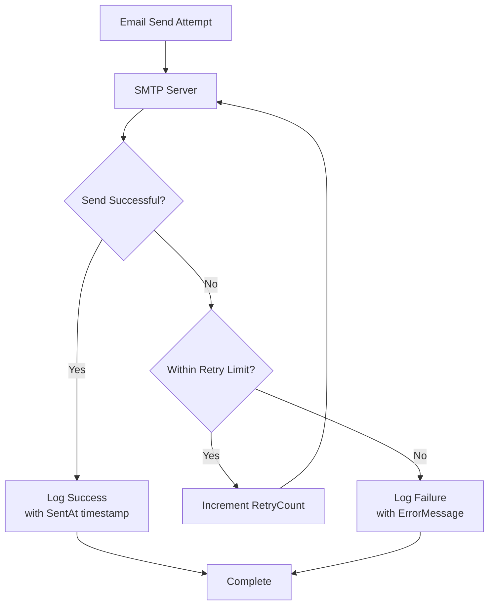
```mermaid
flowchart TD
EmailSend["Email Send Attempt"] --> SMTP["SMTP Server"]
SMTP --> Success{"Send Successful?"}
Success --> |Yes| LogSuccess["Log Success<br/>with SentAt timestamp"]
Success --> |No| Retry{"Within Retry Limit?"}
Retry --> |Yes| IncrementRetry["Increment RetryCount"]
IncrementRetry --> SMTP
Retry --> |No| LogFailure["Log Failure<br/>with ErrorMessage"]
LogSuccess --> Complete["Complete"]
LogFailure --> Complete
```

**Diagram sources**
- [src/NonCash.Core/Entities/EmailLog.cs:1-24](file://src/NonCash.Core/Entities/EmailLog.cs#L1-L24)
- [src/NonCash.Infrastructure/Services/EmailNotificationService.cs:392-416](file://src/NonCash.Infrastructure/Services/EmailNotificationService.cs#L392-L416)

### Email Notification Service Integration
The EmailNotificationService integrates with all notification flows to ensure complete audit coverage:
- **Admin Registration Notifications**: New business registration alerts
- **Credit Expiry Warnings**: Automated warnings for expiring credits
- **Welcome Credit Grants**: Notifications for new brand activations
- **Credit Purchase Receipts**: Confirmation emails for credit purchases
- **Low Balance Alerts**: Proactive warnings for low credit balances
- **Credits Forfeited Notifications**: Alerts for expired credit batches

### Retry Mechanism and Error Handling
The system implements robust retry logic with exponential backoff:
- **Maximum Retries**: Up to 3 retry attempts for transient failures
- **Transient Error Detection**: Automatic detection of temporary SMTP issues
- **Error Truncation**: Error messages limited to 2000 characters to prevent database bloat
- **Logging Isolation**: Email logging failures don't break notification flows

**Section sources**
- [src/NonCash.Core/Entities/EmailLog.cs:1-24](file://src/NonCash.Core/Entities/EmailLog.cs#L1-L24)
- [src/NonCash.Infrastructure/Services/EmailNotificationService.cs:1-427](file://src/NonCash.Infrastructure/Services/EmailNotificationService.cs#L1-L427)
- [src/NonCash.Infrastructure/Migrations/20260814110418_AddEmailLog.cs:1-65](file://src/NonCash.Infrastructure/Migrations/20260814110418_AddEmailLog.cs#L1-L65)

## Business Management Capabilities

**New** Comprehensive business management system supporting multi-business organizations with brand relationships and administrative controls.

The business management system enables organizations to manage multiple legal entities (businesses) that can own multiple brands, providing a hierarchical structure for enterprise deployments.

### Business Entity Structure
The Business entity provides core organizational information:
- **BusinessName**: Legal company name
- **TaxCode**: Unique tax identification number
- **Address**: Physical business address
- **ContactEmail**: Primary contact email for business communications
- **PhoneNumber**: Business contact phone number
- **IsActive**: Business status for soft deletion
- **Brands**: Collection of brands owned by the business

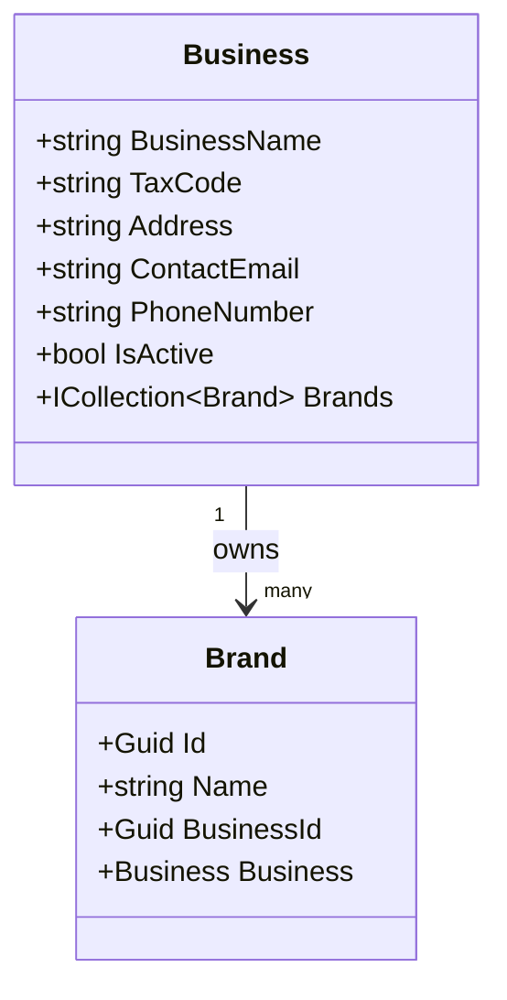
```mermaid
classDiagram
class Business {
+string BusinessName
+string TaxCode
+string Address
+string ContactEmail
+string PhoneNumber
+bool IsActive
+ICollection~Brand~ Brands
}
class Brand {
+Guid Id
+string Name
+Guid BusinessId
+Business Business
}
Business "1" --> "many" Brand : owns
```

**Diagram sources**
- [src/NonCash.Core/Entities/Business.cs:1-18](file://src/NonCash.Core/Entities/Business.cs#L1-L18)
- [src/NonCash.Core/Entities/Brand.cs:1-50](file://src/NonCash.Core/Entities/Brand.cs#L1-L50)

### Business Management API
Comprehensive REST API endpoints for business administration:
- **GET /api/v1/businesses**: List all businesses with brand counts
- **GET /api/v1/businesses/{id}**: Get specific business details
- **POST /api/v1/businesses**: Create new business with validation
- **PUT /api/v1/businesses/{id}**: Update business information
- **Tax Code Validation**: Ensures unique tax codes across system

### Brand Relationship Management
Business-brand relationships are automatically tracked:
- **Brand Count Integration**: API responses include brand count per business
- **Cascade Operations**: Business status affects brand availability
- **Administrative Controls**: Admin-only access to business management

**Section sources**
- [src/NonCash.Core/Entities/Business.cs:1-18](file://src/NonCash.Core/Entities/Business.cs#L1-L18)
- [src/NonCash.API/Controllers/BusinessesController.cs:1-123](file://src/NonCash.API/Controllers/BusinessesController.cs#L1-L123)
- [src/NonCash.API/DTOs/BusinessDtos.cs:1-31](file://src/NonCash.API/DTOs/BusinessDtos.cs#L1-L31)
- [src/NonCash.Infrastructure/Repositories/BusinessRepository.cs:1-26](file://src/NonCash.Infrastructure/Repositories/BusinessRepository.cs#L1-L26)

## Enhanced Customer Management

**Updated** Enhanced customer management system with improved blacklist functionality, search capabilities, and integration with email logging system.

The customer management system provides comprehensive customer record management with advanced filtering, blacklist controls, and integration points for promotional campaigns.

### Customer Entity Enhancements
The Customer entity includes enhanced status management:
- **CustomerStatus Enum**: Active and Blacklisted states
- **Phone Number Normalization**: Automatic digit extraction for uniqueness
- **Email Integration**: Support for email-based communications
- **Search Optimization**: Indexed fields for efficient querying

### Blacklist Management Features
Advanced blacklist functionality with full audit trail:
- **Blacklist/Unblacklist Operations**: Status toggling with validation
- **Integration Points**: Blacklisted customers excluded from promotions
- **Search Filtering**: Filter customers by blacklist status
- **Bulk Operations**: Support for batch status updates

### Search and Query Capabilities
Enhanced search functionality with multiple filter options:
- **Multi-field Search**: Phone number, name, email, and status filtering
- **Phone Number Normalization**: Automatic normalization during search
- **Pagination Support**: Efficient handling of large customer datasets
- **Status-based Filtering**: Real-time blacklist status filtering

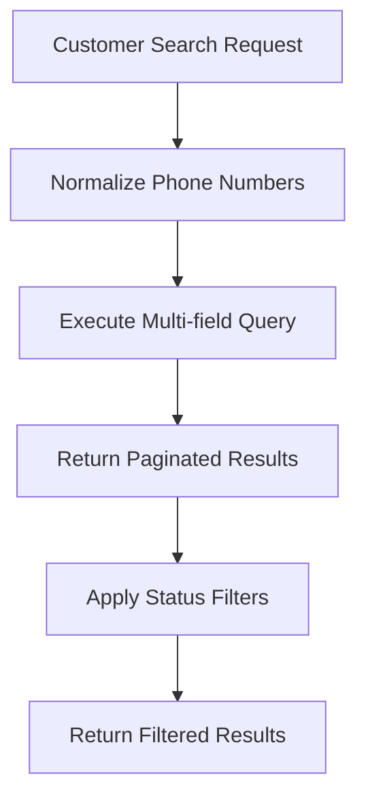
```mermaid
flowchart TD
CustomerSearch["Customer Search Request"] --> Normalize["Normalize Phone Numbers"]
Normalize --> Query["Execute Multi-field Query"]
Query --> Results["Return Paginated Results"]
Results --> Filter["Apply Status Filters"]
Filter --> Response["Return Filtered Results"]
```

**Diagram sources**
- [src/NonCash.Core/Entities/Customer.cs:1-21](file://src/NonCash.Core/Entities/Customer.cs#L1-L21)
- [src/NonCash.Core/Services/CustomerService.cs:61-96](file://src/NonCash.Core/Services/CustomerService.cs#L61-L96)

### Integration with Email System
Customer management integrates with the email logging system:
- **Contact Information Tracking**: Email addresses linked to customer records
- **Communication History**: Email logs associated with customer activities
- **Notification Preferences**: Support for customer communication preferences

**Section sources**
- [src/NonCash.Core/Entities/Customer.cs:1-21](file://src/NonCash.Core/Entities/Customer.cs#L1-L21)
- [src/NonCash.Core/Services/CustomerService.cs:61-96](file://src/NonCash.Core/Services/CustomerService.cs#L61-L96)

## Maker-Checker Adjustment Workflow

**New** Sophisticated maker-checker approval workflow for credit adjustments with threshold-based authorization.

The maker-checker system ensures proper authorization for credit adjustments through a two-person control mechanism where requests are created by makers and approved by checkers (FinancialControllers).

### Adjustment Types and Approval Matrix
Different adjustment types follow specific approval requirements:
- **Always Approval Required**: Correction, Clawback, Reinstatement (always need approval)
- **Threshold-Based Approval**: Grant, Compensation (approval required when amount ≥ threshold)
- **No Approval Needed**: Purchase, WelcomeGrant (handled through separate flows)
- **Self-Approval Prevention**: Requester cannot approve their own requests

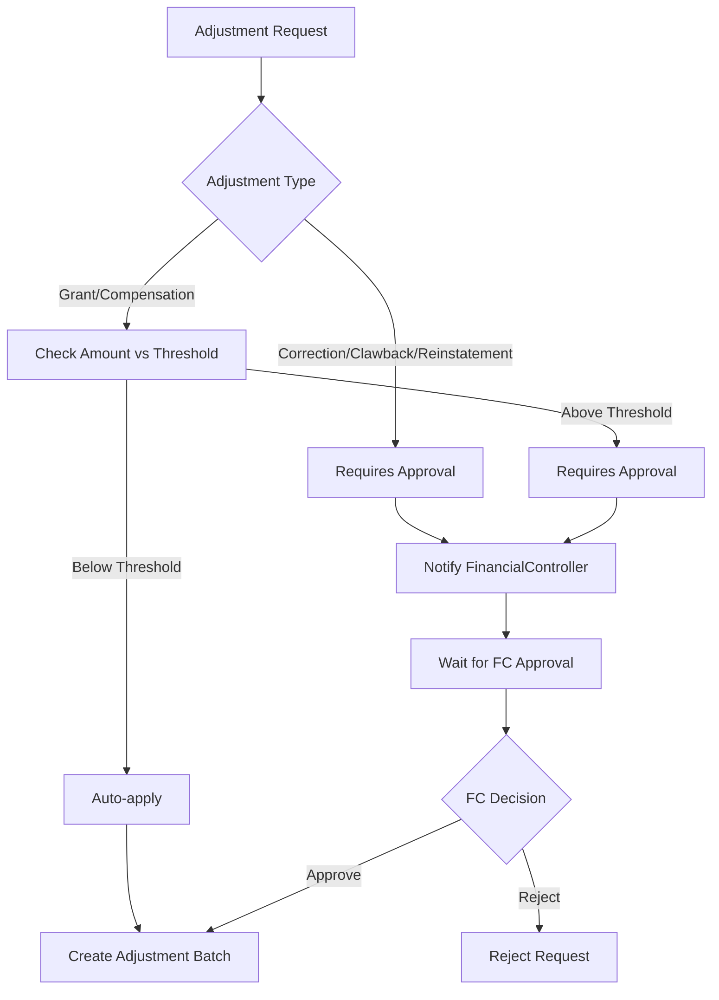
```mermaid
flowchart TD
Request["Adjustment Request"] --> CheckType{"Adjustment Type"}
CheckType --> |Correction/Clawback/Reinstatement| AlwaysApprove["Requires Approval"]
CheckType --> |Grant/Compensation| CheckThreshold["Check Amount vs Threshold"]
CheckThreshold --> |Above Threshold| RequiresApprove["Requires Approval"]
CheckThreshold --> |Below Threshold| AutoApply["Auto-apply"]
AlwaysApprove --> NotifyFC["Notify FinancialController"]
RequiresApprove --> NotifyFC
AutoApply --> CreateBatch["Create Adjustment Batch"]
NotifyFC --> WaitApproval["Wait for FC Approval"]
WaitApproval --> Approve{"FC Decision"}
Approve --> |Approve| CreateBatch
Approve --> |Reject| RejectFlow["Reject Request"]
```

**Diagram sources**
- [src/NonCash.Infrastructure/Services/CreditAdjustmentService.cs:16-24](file://src/NonCash.Infrastructure/Services/CreditAdjustmentService.cs#L16-L24)
- [src/NonCash.Infrastructure/Services/CreditAdjustmentService.cs:46-107](file://src/NonCash.Infrastructure/Services/CreditAdjustmentService.cs#L46-L107)

### Adjustment Request Lifecycle
Adjustment requests follow a complete lifecycle with full audit trail:
- **PendingApproval**: Initial state after request creation
- **Approved**: FinancialController has approved the request
- **Rejected**: FinancialController has rejected with mandatory review note
- **Applied**: Adjustment has been applied and resulting batch created

**Section sources**
- [src/NonCash.Core/Entities/CreditAdjustmentRequest.cs:1-71](file://src/NonCash.Core/Entities/CreditAdjustmentRequest.cs#L1-L71)
- [src/NonCash.Infrastructure/Services/CreditAdjustmentService.cs:1-250](file://src/NonCash.Infrastructure/Services/CreditAdjustmentService.cs#L1-L250)
- [src/NonCash.API/Controllers/CreditAdjustmentsController.cs:1-167](file://src/NonCash.API/Controllers/CreditAdjustmentsController.cs#L1-L167)

## Automated Credit Expiry Management

**New** Background service that automatically manages credit batch expiry with warning notifications.

The CreditExpirySweepService runs daily to handle credit batch expiry management, including zeroing out expired batches and sending advance warnings to brands.

### Expiry Processing
The sweep service performs two main functions:
- **Batch Expiration**: Zeroes out remaining credits in batches past their ExpiresAt date
- **Warning Notifications**: Sends one-time expiry warnings based on policy-defined warning periods

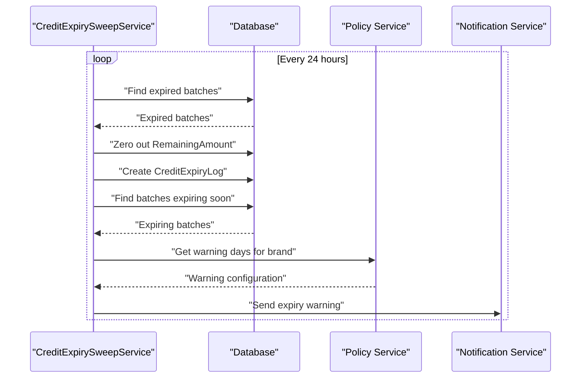
```mermaid
sequenceDiagram
participant SWEEP as "CreditExpirySweepService"
participant DB as "Database"
participant POLICY as "Policy Service"
participant NOTIFY as "Notification Service"
loop Every 24 hours
SWEEP->>DB : "Find expired batches"
DB-->>SWEEP : "Expired batches"
SWEEP->>DB : "Zero out RemainingAmount"
SWEEP->>DB : "Create CreditExpiryLog"
SWEEP->>DB : "Find batches expiring soon"
DB-->>SWEEP : "Expiring batches"
SWEEP->>POLICY : "Get warning days for brand"
POLICY-->>SWEEP : "Warning configuration"
SWEEP->>NOTIFY : "Send expiry warning"
end
```

**Diagram sources**
- [src/NonCash.API/HostedServices/CreditExpirySweepService.cs:25-107](file://src/NonCash.API/HostedServices/CreditExpirySweepService.cs#L25-L107)

### Expiry Logging and Audit
Every expired batch generates a CreditExpiryLog record containing:
- **BatchId**: Reference to the expired batch
- **BrandId**: Brand that owns the expired credits
- **ExpiredCredits**: Number of credits forfeited
- **ExpiredAt**: Timestamp when expiry was processed

**Section sources**
- [src/NonCash.API/HostedServices/CreditExpirySweepService.cs:1-107](file://src/NonCash.API/HostedServices/CreditExpirySweepService.cs#L1-L107)
- [src/NonCash.Core/Entities/CreditExpiryLog.cs:1-22](file://src/NonCash.Core/Entities/CreditExpiryLog.cs#L1-L22)

## Cross-Tenant Settlement Processing
Cross-tenant settlement processing automatically tracks financial obligations when vouchers sponsored by one brand are redeemed at another brand's outlet. The system creates settlement entries that record who owes whom and how much, enabling automatic financial reconciliation between sponsoring and redeeming brands.

### Settlement Entry Creation
When a voucher from a cross-tenant plan (where SponsorBrandID differs from RedeemBrandID) is successfully redeemed and committed, the system automatically creates a SettlementEntry record containing:
- SponsorBrandId: The brand that sponsored the voucher campaign
- IssuingBrandId: The brand that issued the voucher (owner of the plan)
- RedeemBrandId: The brand at whose outlet the voucher was redeemed
- RedeemOutletId: The specific outlet where redemption occurred
- FaceValue: The value of the voucher at time of redemption
- Status: Initial state set to Pending for manual settlement processing

### Settlement Lifecycle Management
Settlement entries follow a clear lifecycle:
- **Pending**: Automatically created after successful cross-tenant redemption
- **Settled**: Manually marked by administrators after off-platform payment between brands
- **Tracking**: Each settlement includes SettledAt timestamp and SettledBy user identification

### Settlement Ledger and Reporting
The settlement ledger provides comprehensive filtering and reporting capabilities:
- Filter by sponsor brand, redeem brand, date range, and settlement status
- Paginated results for large datasets
- Manual settlement marking through dedicated API endpoints
- Netting reports that compute net amounts between all sponsor/redeemer brand pairs within specified date ranges

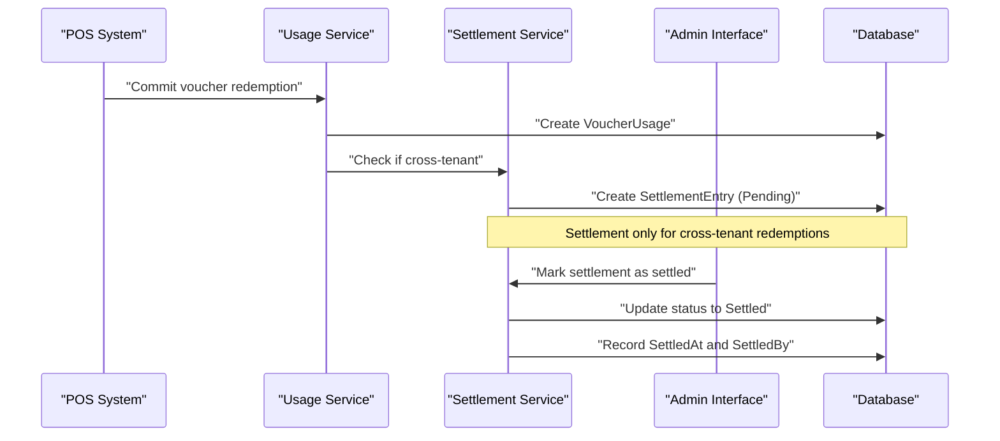
```mermaid
sequenceDiagram
participant POS as "POS System"
participant USAGE as "Usage Service"
participant SETTLE as "Settlement Service"
participant ADMIN as "Admin Interface"
participant DB as "Database"
POS->>USAGE : "Commit voucher redemption"
USAGE->>DB : "Create VoucherUsage"
USAGE->>SETTLE : "Check if cross-tenant"
SETTLE->>DB : "Create SettlementEntry (Pending)"
Note over SETTLE,DB : Settlement only for cross-tenant redemptions
ADMIN->>SETTLE : "Mark settlement as settled"
SETTLE->>DB : "Update status to Settled"
SETTLE->>DB : "Record SettledAt and SettledBy"
```

**Diagram sources**
- [src/NonCash.Infrastructure/Services/SettlementService.cs:20-48](file://src/NonCash.Infrastructure/Services/SettlementService.cs#L20-L48)
- [src/NonCash.API/Controllers/SettlementsController.cs:22-84](file://src/NonCash.API/Controllers/SettlementsController.cs#L22-L84)
- [src/NonCash.Core/Entities/SettlementEntry.cs:1-49](file://src/NonCash.Core/Entities/SettlementEntry.cs#L1-L49)

**Section sources**
- [src/NonCash.Core/Entities/SettlementEntry.cs:1-49](file://src/NonCash.Core/Entities/SettlementEntry.cs#L1-L49)
- [src/NonCash.Core/Interfaces/ISettlementService.cs:1-50](file://src/NonCash.Core/Interfaces/ISettlementService.cs#L1-L50)
- [src/NonCash.API/Controllers/SettlementsController.cs:1-138](file://src/NonCash.API/Controllers/SettlementsController.cs#L1-L138)
- [src/NonCash.Infrastructure/Services/SettlementService.cs:1-123](file://src/NonCash.Infrastructure/Services/SettlementService.cs#L1-L123)

## Payment Processing Integration
Payment processing integration enables members to purchase vouchers using external payment gateways, with full lifecycle management from order creation to fulfillment.

### ZaloPay Integration
The system integrates with ZaloPay payment gateway for secure payment processing:
- **Payment session creation**: Generates payment URLs for member checkout flows
- **Webhook handling**: Processes server-side payment confirmations securely
- **Return URL handling**: Provides user-friendly redirection after payment completion
- **Transaction tracking**: Maintains complete payment history with gateway details

### Payment Lifecycle Management
Payment transactions follow a structured lifecycle:
- **Pending**: Initial state when payment session is created
- **Success**: Confirmed through webhook verification
- **Failed**: Payment declined or cancelled
- **Cancelled**: User-initiated cancellation
- **Refunded**: Post-payment refund processing

### Order Fulfillment Integration
Successful payments trigger automated order fulfillment:
- Payment webhook updates transaction status
- Successful payments automatically confirm pending orders
- Order status transitions from PendingPayment to confirmed states
- Error handling ensures fulfillment failures don't affect payment processing

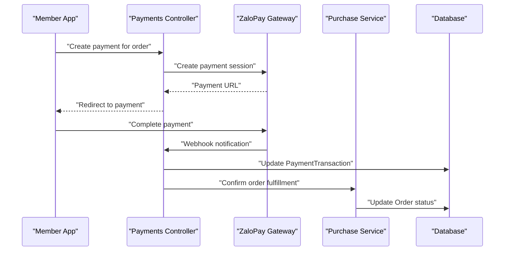
```mermaid
sequenceDiagram
participant Member as "Member App"
participant API as "Payments Controller"
participant ZALOPAY as "ZaloPay Gateway"
participant PURCHASE as "Purchase Service"
participant DB as "Database"
Member->>API : "Create payment for order"
API->>ZALOPAY : "Create payment session"
ZALOPAY-->>API : "Payment URL"
API-->>Member : "Redirect to payment"
Member->>ZALOPAY : "Complete payment"
ZALOPAY->>API : "Webhook notification"
API->>DB : "Update PaymentTransaction"
API->>PURCHASE : "Confirm order fulfillment"
PURCHASE->>DB : "Update Order status"
```

**Diagram sources**
- [src/NonCash.API/Controllers/PaymentsController.cs:47-163](file://src/NonCash.API/Controllers/PaymentsController.cs#L47-L163)
- [src/NonCash.Core/Entities/PaymentTransaction.cs:1-30](file://src/NonCash.Core/Entities/PaymentTransaction.cs#L1-L30)

**Section sources**
- [src/NonCash.API/Controllers/PaymentsController.cs:1-244](file://src/NonCash.API/Controllers/PaymentsController.cs#L1-L244)
- [src/NonCash.Core/Entities/PaymentTransaction.cs:1-30](file://src/NonCash.Core/Entities/PaymentTransaction.cs#L1-L30)

## Loyalty App Integrations
Loyalty app integrations enable external systems like mall apps and CRM platforms to interact with NonCash for voucher distribution, member wallet management, and event tracking.

### Partner Onboarding and Management
Integration partners are managed through a dedicated entity structure:
- **Partner registration**: External systems register with API keys and callback URLs
- **Brand authorization**: Partners are authorized to operate on specific brands
- **Security**: HMAC-SHA256 webhook signatures and API key authentication
- **Lifecycle management**: Active/inactive partner status control

### Member Wallet APIs
Partners can query member voucher wallets and lifecycle events:
- **Wallet queries**: Retrieve current voucher holdings across authorized brands
- **Event history**: Access complete lifecycle event history for analytics and notifications
- **Brand scoping**: Only returns vouchers from partner-authorized brands
- **Privacy protection**: Returns empty arrays for unknown members to prevent enumeration attacks

### Webhook Event Delivery
Real-time event notifications are delivered to partner systems:
- **Event types**: Distributed, Redeemed, Transferred (sent/received), Expired, Cancelled
- **Payload structure**: Includes event details, voucher information, and timestamps
- **Reliability**: Retry mechanisms and signature verification ensure delivery integrity

```mermaid
sequenceDiagram
participant Partner as "Loyalty App"
participant INTEGRATION as "Integration Service"
participant MEMBER as "Member Service"
participant DB as "Database"
Partner->>INTEGRATION : "Query member wallet"
INTEGRATION->>DB : "Check partner-brand authorization"
INTEGRATION->>MEMBER : "Get member vouchers"
MEMBER->>DB : "Query vouchers for member"
DB-->>MEMBER : "Voucher data"
MEMBER-->>INTEGRATION : "Filtered vouchers"
INTEGRATION-->>Partner : "Authorized vouchers only"
```

**Diagram sources**
- [src/NonCash.Core/Entities/IntegrationPartner.cs:1-46](file://src/NonCash.Core/Entities/IntegrationPartner.cs#L1-L46)

**Section sources**
- [src/NonCash.Core/Entities/IntegrationPartner.cs:1-46](file://src/NonCash.Core/Entities/IntegrationPartner.cs#L1-L46)

## Enhanced Display Data Handling
Enhanced display data handling provides centralized formatting for voucher values, status badges, and expiry information across all client interfaces.

### Value Formatting
The VoucherDisplayHelper provides consistent value formatting:
- **Percentage values**: Formatted as "20% OFF"
- **Monetary values**: Formatted with currency symbols and localization
- **Culture support**: Adapts formatting based on regional settings

### Status Badge Computation
Automatic status badge generation based on voucher state:
- **Used**: Completed vouchers
- **In Use**: Currently being processed
- **Expired**: Past expiry date
- **Expiring Soon**: Within 3 days of expiry
- **Active**: Valid and available for use

### Expiry Display
Human-friendly expiry date formatting:
- **Relative time**: "5 days left", "Expires today"
- **Past dates**: "Expired"
- **Localized**: Adapts to regional date formats

```mermaid
flowchart TD
VoucherData["Voucher Data"] --> Helper["VoucherDisplayHelper"]
Helper --> FormatValue["Format Value<br/>(Currency/Percentage)"]
Helper --> ComputeStatus["Compute Status Badge"]
Helper --> ComputeExpiry["Compute Expiry Display"]
FormatValue --> UI["Client Interfaces"]
ComputeStatus --> UI
ComputeExpiry --> UI
```

**Diagram sources**
- [src/NonCash.Shared/Helpers/VoucherDisplayHelper.cs:1-86](file://src/NonCash.Shared/Helpers/VoucherDisplayHelper.cs#L1-L86)

**Section sources**
- [src/NonCash.Shared/Helpers/VoucherDisplayHelper.cs:1-86](file://src/NonCash.Shared/Helpers/VoucherDisplayHelper.cs#L1-L86)

## Dependency Analysis
The system's dependencies align with the 3-layer architecture and microservices:

```mermaid
graph LR
Web["NonCash.Web"] --> Core["NonCash.Core"]
API["NonCash.API"] --> Core
Core --> Infra["NonCash.Infrastructure"]
Infra --> DB["PostgreSQL"]
API --> DB
Core --> DB
SETTLEMENT["Settlement Service"] --> DB
CREDIT["Enhanced Credit Service"] --> DB
PAYMENT["Payment Service"] --> DB
INTEGRATION["Integration Service"] --> DB
EXPIRY["Credit Expiry Sweep"] --> DB
EMAIL["Email Notification Service"] --> DB
BUSINESS["Business Management Service"] --> DB
```

**Diagram sources**
- [docs/source-tree-analysis.md:19-28](file://docs/source-tree-analysis.md#L19-L28)
- [docs/architecture.md:28-34](file://docs/architecture.md#L28-L34)

**Section sources**
- [docs/source-tree-analysis.md:36-50](file://docs/source-tree-analysis.md#L36-L50)
- [docs/architecture.md:28-34](file://docs/architecture.md#L28-L34)

## Performance Considerations
- Use dynamic voucher codes to minimize replay risk and reduce validation overhead
- Enforce multi-tenancy via BrandID to avoid cross-tenant scans and queries
- Apply transaction boundaries around POS redemption steps to ensure atomicity
- Index frequently queried fields (e.g., VoucherCode, MemberID, OutletID) in PostgreSQL
- Cache non-sensitive metadata (e.g., brand and outlet info) at the API gateway level
- Implement pagination for settlement, credit batch, and adjustment queries to handle large datasets
- Use async/await patterns throughout to maximize throughput
- Optimize database queries with proper indexing and query optimization
- **Optimize FIFO credit consumption queries with appropriate indexes on CreatedAt and ExpiresAt**
- **Implement efficient policy resolution caching to reduce database queries**
- **Optimize welcome policy resolution queries with composite indexes on BusinessId, IsActive, and EffectiveFrom**
- **Index email log tables on notification_type, sent_at, and success for efficient querying**
- **Implement connection pooling for email SMTP connections to improve performance**
- **Cache business-brand relationships to reduce database queries during brand lookups**

## Troubleshooting Guide
Common issues and resolutions:
- Voucher invalid or expired: Verify expiry and publish dates; ensure plan is approved and published
- Double-spending attempts: Confirm lock acquisition succeeded and the voucher remains In-Use until commit
- Rollback not releasing lock: Ensure rollback endpoint is invoked with the correct LockID
- Distribution failures: Check VoucherDistribution logs and reconcile with plan detail generation
- Blacklisted customer errors: Validate customer status before transfer or purchase
- Settlement discrepancies: Verify cross-tenant detection logic and settlement entry creation
- **Credit balance issues**: Check credit batch RemainingAmount calculations and FIFO consumption logic
- **Adjustment approval failures**: Verify maker-checker workflow and self-approval prevention
- **Expiry warning not sent**: Check CreditExpirySweepService execution and policy configuration
- Payment webhook failures: Verify webhook signatures and retry failed deliveries
- Integration partner access: Confirm partner-brand authorization and API key validity
- **Policy resolution conflicts**: Check effective date ranges and scope precedence
- **Welcome policy migration issues**: Verify business-brand mappings and 'Migrated:' policy prefixes
- **Welcome grant not applied**: Check business-scoped welcome policy resolution and CreditConfig fallback
- **Email delivery failures**: Check EmailLog entries for error messages and retry counts
- **Business management errors**: Verify tax code uniqueness and business status
- **Customer search performance**: Check phone number normalization and index usage
- **Email notification timeouts**: Verify SMTP configuration and network connectivity

**Section sources**
- [Key Functionalities.txt:135-156](file://Key%20Functionalities.txt#L135-L156)
- [docs/api-contracts.md:14-87](file://docs/api-contracts.md#L14-L87)
- [docs/data-models.md:46-62](file://docs/data-models.md#L46-L62)

## Conclusion
NonCash provides a secure, scalable SaaS platform for voucher production and redemption with significantly enhanced capabilities through the Epic 10 batch-based credit system. The major architectural shift introduces sophisticated credit management with batch lifecycle, pricing policies, maker-checker approval workflows, and automated expiry handling. Combined with cross-tenant settlement processing, payment processing integration, loyalty app integrations, comprehensive email logging, and enhanced business management, the system offers robust financial reconciliation and seamless third-party integrations. Its 3-layer architecture, microservices design, and comprehensive API contracts enable reliable production planning, multi-channel distribution, POS redemption with strong transaction integrity, enhanced credit management, operational automation, and complete audit trails for compliance and troubleshooting.

## Appendices

### Practical Examples and Edge Cases
- Example: Batch promotion with 1,000 recipients
  - Validate plan approval and publish date
  - Upload phone numbers; system maps to MemberIDs and generates plan details
  - Log entries created in VoucherDistribution with Promotion method
- Edge: Rejected plan revision
  - Clone the rejected plan; adjust targets and resubmit; preserve historical approval records
- Edge: POS rollback scenario
  - If a transaction fails, call rollback to release the lock and restore Pending state
- Edge: Blacklisted customer transfer
  - Prevent transfer initiation if the recipient is blacklisted; notify sender accordingly
- Edge: Cross-tenant settlement
  - When a voucher sponsored by Brand A is redeemed at Brand B's outlet, automatically create settlement entry for financial reconciliation
- **Edge: Credit batch exhaustion**
  - When all credit batches are exhausted, grace overdraft allows newest batch to go negative while maintaining FIFO consumption order
- **Edge: Adjustment approval threshold**
  - Grant/Compensation adjustments below threshold auto-apply; above threshold require FinancialController approval
- **Edge: Policy scope conflict**
  - Brand-scoped policies override BrandGroup and Global policies; resolve using effective date ranges
- **Edge: Credit expiry during consumption**
  - FIFO algorithm prioritizes oldest non-expired batches; expired batches are skipped automatically
- **Edge: Maker-checker self-approval**
  - System prevents users from approving their own adjustment requests regardless of role
- **Edge: Payment webhook processing**
  - Idempotent webhook processing prevents duplicate order fulfillment on network retries
- **Edge: Integration partner brand scoping**
  - Only return vouchers from brands explicitly authorized to the integration partner
- **Edge: Welcome policy migration**
  - Existing brand-scoped welcome credits are automatically migrated to business-scoped policies with 'Migrated:' prefix
- **Edge: Welcome grant idempotency**
  - Each brand receives welcome credits only once; subsequent activations are ignored
- **Edge: Business policy resolution**
  - Welcome policy resolution falls back to CreditConfig when no business-specific policy exists
- **Edge: Email delivery failure handling**
  - System retries failed email sends up to 3 times with exponential backoff; failures are logged with detailed error information
- **Edge: Business tax code conflicts**
  - System prevents creation of businesses with duplicate tax codes; returns conflict error with guidance
- **Edge: Customer blacklist cascade effects**
  - Blacklisted customers are automatically excluded from batch promotions and self-purchase flows
- **Edge: Email log storage limits**
  - Error messages are truncated to 2000 characters to prevent database bloat; consider log rotation strategies

**Section sources**
- [_bmad-output/planning-artifacts/epics.md:205-243](file://_bmad-output/planning-artifacts/epics.md#L205-L243)
- [Key Functionalities.txt:135-156](file://Key%20Functionalities.txt#L135-L156)
- [src/NonCash.Infrastructure/Services/SettlementService.cs:20-48](file://src/NonCash.Infrastructure/Services/SettlementService.cs#L20-L48)
- [src/NonCash.Infrastructure/Services/CreditService.cs:43-109](file://src/NonCash.Infrastructure/Services/CreditService.cs#L43-L109)
- [src/NonCash.Infrastructure/Services/CreditAdjustmentService.cs:46-107](file://src/NonCash.Infrastructure/Services/CreditAdjustmentService.cs#L46-L107)
- [src/NonCash.API/Controllers/PaymentsController.cs:108-163](file://src/NonCash.API/Controllers/PaymentsController.cs#L108-L163)
- [src/NonCash.Infrastructure/Migrations/20260814050918_SplitWelcomePolicy.cs:74-99](file://src/NonCash.Infrastructure/Migrations/20260814050918_SplitWelcomePolicy.cs#L74-L99)
- [src/NonCash.Infrastructure/Services/WelcomePolicyService.cs:25-52](file://src/NonCash.Infrastructure/Services/WelcomePolicyService.cs#L25-L52)
- [src/NonCash.Infrastructure/Services/EmailNotificationService.cs:367-385](file://src/NonCash.Infrastructure/Services/EmailNotificationService.cs#L367-L385)
- [src/NonCash.API/Controllers/BusinessesController.cs:50-79](file://src/NonCash.API/Controllers/BusinessesController.cs#L50-L79)
- [src/NonCash.Core/Services/CustomerService.cs:61-78](file://src/NonCash.Core/Services/CustomerService.cs#L61-L78)