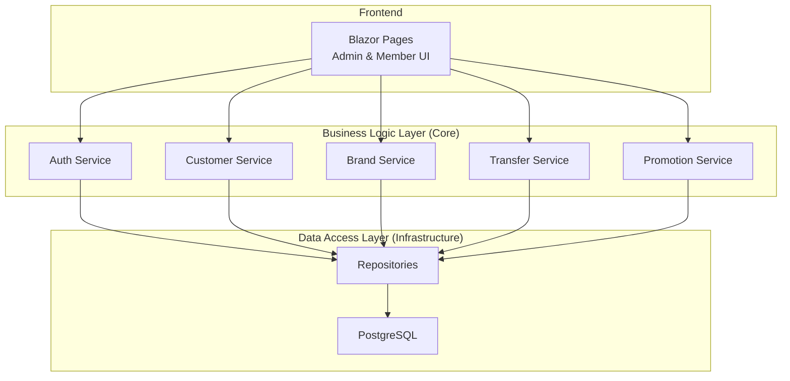
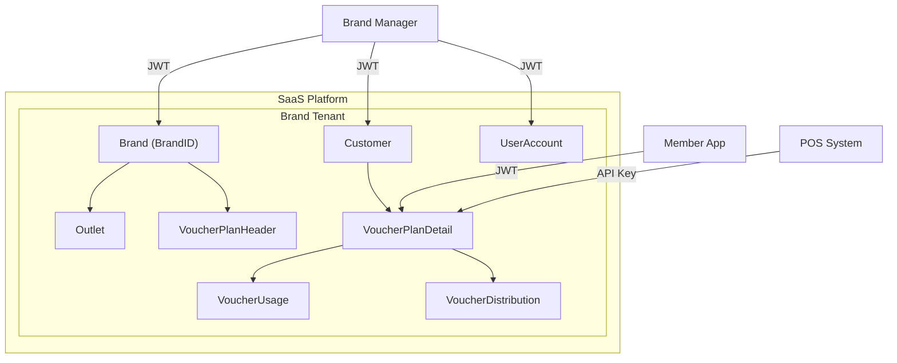
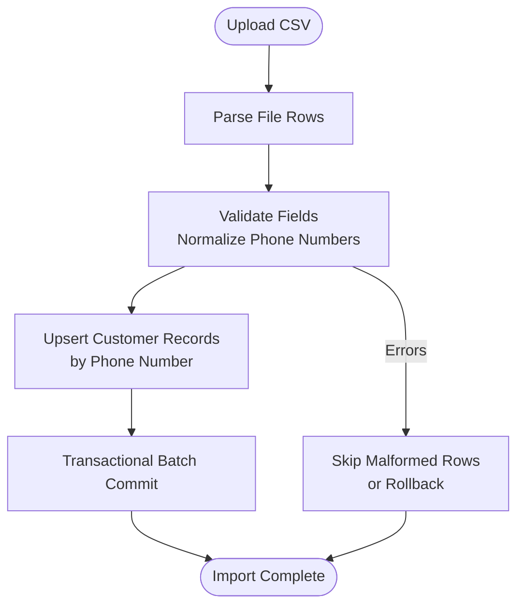
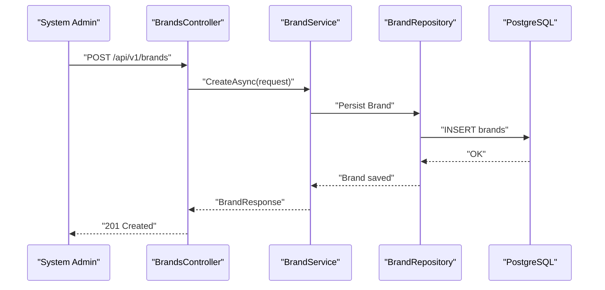
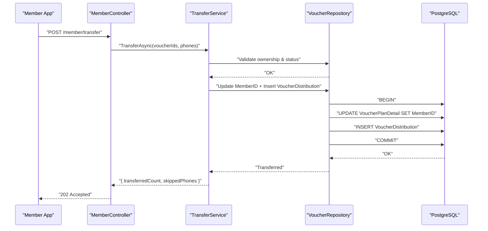
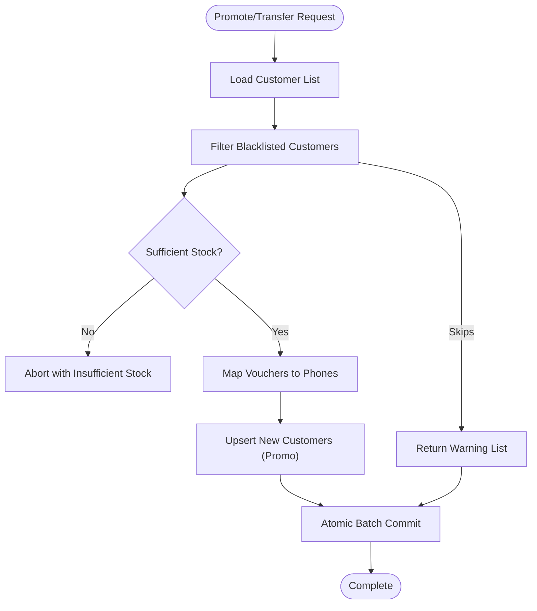
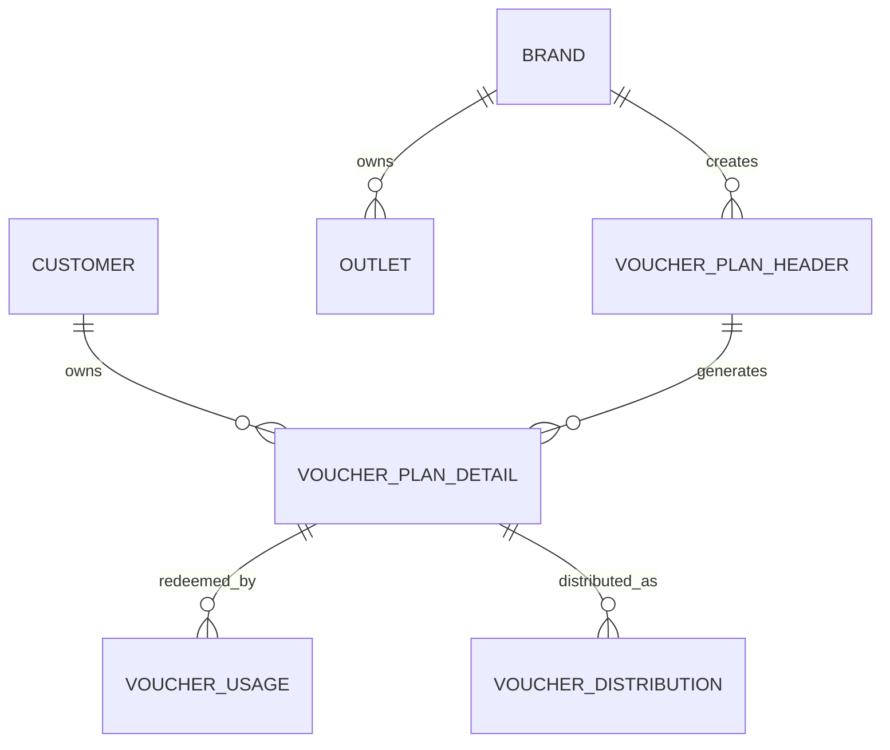
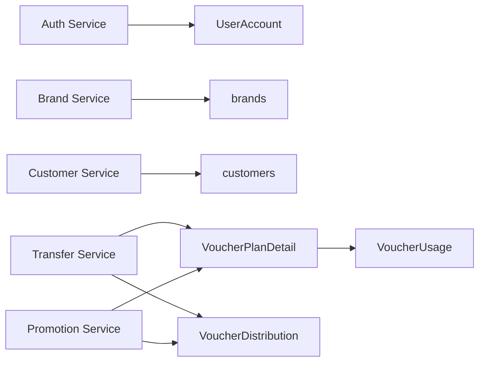

# Customer and Business Management

<cite>
**Referenced Files in This Document**
- [docs/index.md](file://docs/index.md)
- [docs/architecture.md](file://docs/architecture.md)
- [docs/data-models.md](file://docs/data-models.md)
- [docs/api-contracts.md](file://docs/api-contracts.md)
- [Key Functionalities.txt](file://Key Functionalities.txt)
- [BMAD_STRUCTURE.md](file://BMAD_STRUCTURE.md)
- [_bmad-output/implementation-artifacts/1-1-brand-setup.md](file://_bmad-output/implementation-artifacts/1-1-brand-setup.md)
- [_bmad-output/implementation-artifacts/1-3-customer-record-management.md](file://_bmad-output/implementation-artifacts/1-3-customer-record-management.md)
- [_bmad-output/implementation-artifacts/1-4-staff-accounts-rbac.md](file://_bmad-output/implementation-artifacts/1-4-staff-accounts-rbac.md)
- [_bmad-output/implementation-artifacts/3-1-batch-promotion-distribution.md](file://_bmad-output/implementation-artifacts/3-1-batch-promotion-distribution.md)
- [_bmad-output/implementation-artifacts/3-3-gifting-batch-transfer.md](file://_bmad-output/implementation-artifacts/3-3-gifting-batch-transfer.md)
</cite>

## Table of Contents
1. [Introduction](#introduction)
2. [Project Structure](#project-structure)
3. [Core Components](#core-components)
4. [Architecture Overview](#architecture-overview)
5. [Detailed Component Analysis](#detailed-component-analysis)
6. [Dependency Analysis](#dependency-analysis)
7. [Performance Considerations](#performance-considerations)
8. [Troubleshooting Guide](#troubleshooting-guide)
9. [Conclusion](#conclusion)
10. [Appendices](#appendices)

## Introduction
This document explains the customer and business management functionality for the NonCash voucher platform. It covers:
- Customer profile management, membership tracking, and blacklist controls
- Business (tenant) management and multi-tenant data isolation
- Member ID system for individuals and organizations
- Blacklist management to prevent problematic users from participating in voucher activities
- Privacy and data protection considerations integrated with the multi-tenant architecture
- The relationship between customer profiles and voucher ownership tracking, including transfer and redemption history

## Project Structure
The NonCash platform follows a 3-layer SaaS architecture with clear separation of concerns:
- Frontend (Blazor)
- Business Logic Layer (Core microservices)
- Data Access Layer (Infrastructure with PostgreSQL)

The documentation index and architecture overview define the system’s scope and layered design. The data models and API contracts provide the canonical definitions for entities and interactions.

**Diagram sources**
- [docs/architecture.md:17-35](file://docs/architecture.md#L17-L35)
- [docs/index.md:18-26](file://docs/index.md#L18-L26)

**Section sources**
- [docs/index.md:12-32](file://docs/index.md#L12-L32)
- [docs/architecture.md:5-52](file://docs/architecture.md#L5-L52)

## Core Components
This section summarizes the core components relevant to customer and business management.

- Identity and Tenant Management
  - Brand (tenant) entity and multi-tenancy enforcement
  - Staff accounts with RBAC and JWT-based authentication
- Customer Management
  - Customer entity, creation, search, import, and blacklist controls
- Voucher Ownership and Distribution
  - VoucherPlanDetail ownership tracking via MemberID
  - Distribution logs for sales, promotions, and transfers
  - Redemption tracking via VoucherUsage

**Section sources**
- [docs/data-models.md:63-98](file://docs/data-models.md#L63-L98)
- [docs/api-contracts.md:9-109](file://docs/api-contracts.md#L9-L109)
- [Key Functionalities.txt:158-166](file://Key Functionalities.txt#L158-L166)

## Architecture Overview
The NonCash platform is a SaaS system with:
- Multi-tenancy enforced by BrandID
- JWT-based authentication for staff and member app
- Dynamic, rotating voucher codes for POS usage
- POS integration via API keys scoped to approved ranges

**Diagram sources**
- [docs/architecture.md:36-41](file://docs/architecture.md#L36-L41)
- [docs/data-models.md:9-98](file://docs/data-models.md#L9-L98)

**Section sources**
- [docs/architecture.md:36-41](file://docs/architecture.md#L36-L41)
- [docs/data-models.md:9-98](file://docs/data-models.md#L9-L98)

## Detailed Component Analysis

### Customer Management System
Customer management encompasses profile lifecycle, blacklist controls, and bulk import capabilities.

- Profile Management
  - Unique phone number requirement and normalization
  - Full name and email fields
  - Status tracking (Active, Blacklisted)
- Blacklist Functionality
  - Brand managers can mark customers as Blacklisted
  - Blacklisted customers are excluded from future promotions and self-purchases
  - Service exposes a method to check blacklist status for downstream services
- Bulk Import
  - CSV/Excel upload with upsert logic on phone number
  - Transactional processing to avoid partial commits
  - UI with progress indication for large files

**Diagram sources**
- [_bmad-output/implementation-artifacts/1-3-customer-record-management.md:25-30](file://_bmad-output/implementation-artifacts/1-3-customer-record-management.md#L25-L30)
- [_bmad-output/implementation-artifacts/1-3-customer-record-management.md:52-57](file://_bmad-output/implementation-artifacts/1-3-customer-record-management.md#L52-L57)

**Section sources**
- [_bmad-output/implementation-artifacts/1-3-customer-record-management.md:11-41](file://_bmad-output/implementation-artifacts/1-3-customer-record-management.md#L11-L41)
- [_bmad-output/implementation-artifacts/1-3-customer-record-management.md:70-106](file://_bmad-output/implementation-artifacts/1-3-customer-record-management.md#L70-L106)
- [docs/data-models.md:91-98](file://docs/data-models.md#L91-L98)

### Business Management and Multi-Tenant Isolation
Business management establishes and maintains tenant boundaries.

- Brand Creation and Maintenance
  - Unique tax code constraint
  - Immutable tax code when linked entities exist
  - Status management (Active, Suspended)
- Multi-Tenancy Enforcement
  - All tenant-scoped operations filtered by BrandID
  - JWT carries BrandID for scope enforcement
  - Cross-tenant access attempts rejected

**Diagram sources**
- [_bmad-output/implementation-artifacts/1-1-brand-setup.md:40-54](file://_bmad-output/implementation-artifacts/1-1-brand-setup.md#L40-L54)
- [_bmad-output/implementation-artifacts/1-1-brand-setup.md:65-81](file://_bmad-output/implementation-artifacts/1-1-brand-setup.md#L65-L81)

**Section sources**
- [_bmad-output/implementation-artifacts/1-1-brand-setup.md:11-39](file://_bmad-output/implementation-artifacts/1-1-brand-setup.md#L11-L39)
- [_bmad-output/implementation-artifacts/1-1-brand-setup.md:65-96](file://_bmad-output/implementation-artifacts/1-1-brand-setup.md#L65-L96)
- [docs/architecture.md:38](file://docs/architecture.md#L38)

### Member ID System and Account Linking
Member ID enables ownership tracking across individuals and organizations.

- Individual Members
  - MemberID corresponds to CustomerID
  - Ownership tracked via VoucherPlanDetail.MemberID
- Business Organizations
  - MemberID concept extends to organizations (as described in functional requirements)
  - Ownership linkage occurs similarly via MemberID on VoucherPlanDetail
- Registration and Linking
  - Self-purchase flow assigns MemberID upon purchase
  - Batch promotions auto-create customers and assign MemberID
  - Transfers reassign MemberID atomically with audit trail

**Diagram sources**
- [_bmad-output/implementation-artifacts/3-3-gifting-batch-transfer.md:44-54](file://_bmad-output/implementation-artifacts/3-3-gifting-batch-transfer.md#L44-L54)
- [docs/api-contracts.md:98-109](file://docs/api-contracts.md#L98-L109)

**Section sources**
- [Key Functionalities.txt:97-133](file://Key Functionalities.txt#L97-L133)
- [_bmad-output/implementation-artifacts/3-3-gifting-batch-transfer.md:11-41](file://_bmad-output/implementation-artifacts/3-3-gifting-batch-transfer.md#L11-L41)
- [docs/data-models.md:34-62](file://docs/data-models.md#L34-L62)

### Blacklist Management and Voucher Activities
Blacklist controls participation in voucher activities.

- Promotion Exclusion
  - Batch promotions exclude Blacklisted customers
  - Skipped records reported with warnings
- Transfer Controls
  - Recipients linked to Blacklisted customers are skipped during transfer
  - Warning returned for skipped mappings
- Purchase Controls
  - Blacklisted customers excluded from self-purchases

**Diagram sources**
- [_bmad-output/implementation-artifacts/3-1-batch-promotion-distribution.md:36-41](file://_bmad-output/implementation-artifacts/3-1-batch-promotion-distribution.md#L36-L41)
- [_bmad-output/implementation-artifacts/3-3-gifting-batch-transfer.md:32-37](file://_bmad-output/implementation-artifacts/3-3-gifting-batch-transfer.md#L32-L37)

**Section sources**
- [_bmad-output/implementation-artifacts/3-1-batch-promotion-distribution.md:11-45](file://_bmad-output/implementation-artifacts/3-1-batch-promotion-distribution.md#L11-L45)
- [_bmad-output/implementation-artifacts/3-3-gifting-batch-transfer.md:11-41](file://_bmad-output/implementation-artifacts/3-3-gifting-batch-transfer.md#L11-L41)

### Voucher Ownership Tracking and Redemption History
Ownership tracking and history maintenance tie customer profiles to voucher lifecycle events.

- Ownership Tracking
  - VoucherPlanDetail.MemberID links ownership to MemberID
  - VoucherDistribution records method (Sale, Promotion, Transfer) and timestamps
- Redemption History
  - VoucherUsage captures POS redemptions with POSID, TransactionID, and AmountUsed
- Member App Integration
  - GET /member/vouchers lists owned vouchers
  - Transfer endpoint initiates ownership reassignment

**Diagram sources**
- [docs/data-models.md:9-62](file://docs/data-models.md#L9-L62)
- [docs/api-contracts.md:93-109](file://docs/api-contracts.md#L93-L109)

**Section sources**
- [docs/data-models.md:9-62](file://docs/data-models.md#L9-L62)
- [docs/api-contracts.md:93-109](file://docs/api-contracts.md#L93-L109)

## Dependency Analysis
The following diagram shows key dependencies among components relevant to customer and business management.

**Diagram sources**
- [_bmad-output/implementation-artifacts/1-4-staff-accounts-rbac.md:47-64](file://_bmad-output/implementation-artifacts/1-4-staff-accounts-rbac.md#L47-L64)
- [_bmad-output/implementation-artifacts/1-1-brand-setup.md:40-54](file://_bmad-output/implementation-artifacts/1-1-brand-setup.md#L40-L54)
- [_bmad-output/implementation-artifacts/1-3-customer-record-management.md:48-60](file://_bmad-output/implementation-artifacts/1-3-customer-record-management.md#L48-L60)
- [_bmad-output/implementation-artifacts/3-3-gifting-batch-transfer.md:44-54](file://_bmad-output/implementation-artifacts/3-3-gifting-batch-transfer.md#L44-L54)
- [_bmad-output/implementation-artifacts/3-1-batch-promotion-distribution.md:18-29](file://_bmad-output/implementation-artifacts/3-1-batch-promotion-distribution.md#L18-L29)
- [docs/data-models.md:9-62](file://docs/data-models.md#L9-L62)

**Section sources**
- [_bmad-output/implementation-artifacts/1-4-staff-accounts-rbac.md:47-64](file://_bmad-output/implementation-artifacts/1-4-staff-accounts-rbac.md#L47-L64)
- [_bmad-output/implementation-artifacts/1-1-brand-setup.md:40-54](file://_bmad-output/implementation-artifacts/1-1-brand-setup.md#L40-L54)
- [_bmad-output/implementation-artifacts/1-3-customer-record-management.md:48-60](file://_bmad-output/implementation-artifacts/1-3-customer-record-management.md#L48-L60)
- [_bmad-output/implementation-artifacts/3-3-gifting-batch-transfer.md:44-54](file://_bmad-output/implementation-artifacts/3-3-gifting-batch-transfer.md#L44-L54)
- [_bmad-output/implementation-artifacts/3-1-batch-promotion-distribution.md:18-29](file://_bmad-output/implementation-artifacts/3-1-batch-promotion-distribution.md#L18-L29)
- [docs/data-models.md:9-62](file://docs/data-models.md#L9-L62)

## Performance Considerations
- Use pagination and indexing for customer search and listing
- Normalize phone numbers to reduce duplicate entries and improve lookup performance
- Batch process large CSV imports with chunked transactions to avoid long-running sessions
- Enforce tenant filters at the repository level to prevent accidental cross-tenant scans
- Keep blacklist checks short-circuiting to minimize overhead during transfer and promotion flows

## Troubleshooting Guide
Common issues and resolutions:
- Duplicate Phone Numbers During Import
  - Use upsert logic keyed by normalized phone number
  - Validate and log skipped rows with clear reasons
- Blacklist Conflicts
  - Ensure blacklist checks occur before assignment or transfer
  - Return explicit warnings for skipped recipients or customers
- Cross-Tenant Access
  - Verify BrandID in JWT and enforce repository-level tenant filters
  - Reject attempts to access data outside the user’s Brand scope
- Transaction Failures
  - Wrap transfer and promotion operations in atomic transactions
  - Roll back on errors to maintain consistency

**Section sources**
- [_bmad-output/implementation-artifacts/1-3-customer-record-management.md:70-76](file://_bmad-output/implementation-artifacts/1-3-customer-record-management.md#L70-L76)
- [_bmad-output/implementation-artifacts/3-1-batch-promotion-distribution.md:30-35](file://_bmad-output/implementation-artifacts/3-1-batch-promotion-distribution.md#L30-L35)
- [_bmad-output/implementation-artifacts/3-3-gifting-batch-transfer.md:47-50](file://_bmad-output/implementation-artifacts/3-3-gifting-batch-transfer.md#L47-L50)
- [_bmad-output/implementation-artifacts/1-4-staff-accounts-rbac.md:40-44](file://_bmad-output/implementation-artifacts/1-4-staff-accounts-rbac.md#L40-L44)

## Conclusion
The NonCash platform provides a robust foundation for customer and business management through:
- Strong multi-tenant isolation using BrandID
- Comprehensive customer lifecycle management with blacklist controls
- Clear ownership tracking via MemberID and VoucherPlanDetail
- Audit trails for promotions, transfers, and redemptions
- Secure authentication and authorization for staff and POS integrations

These capabilities enable brands to manage customer participation, enforce compliance, and maintain data integrity across a SaaS environment.

## Appendices
- Data Privacy and Protection
  - Enforce RBAC and tenant scoping to limit data exposure
  - Use JWT for session-bound access and API keys for POS systems
  - Normalize sensitive identifiers (e.g., phone numbers) to support deduplication without exposing PII unnecessarily
- Integration Notes
  - Member App endpoints for listing vouchers and initiating transfers are defined in the API contracts
  - POS endpoints for verification, locking, and redemption are documented separately

**Section sources**
- [docs/architecture.md:36-41](file://docs/architecture.md#L36-L41)
- [docs/api-contracts.md:9-109](file://docs/api-contracts.md#L9-L109)
- [Key Functionalities.txt:158-166](file://Key Functionalities.txt#L158-L166)