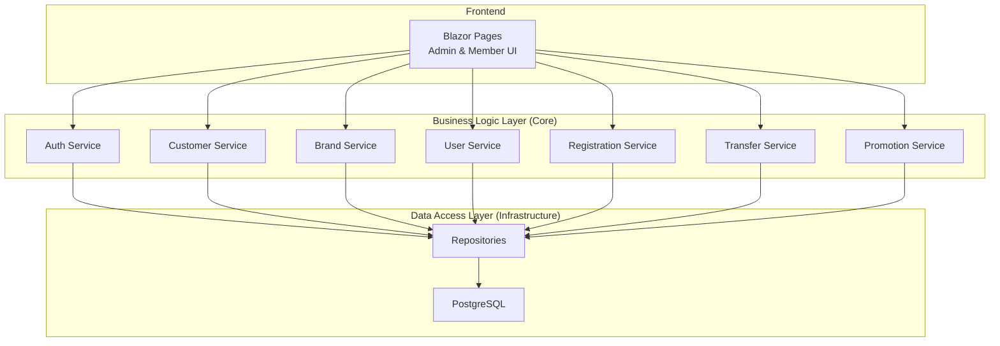
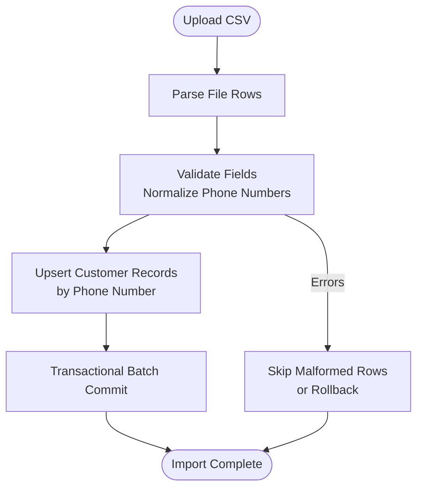
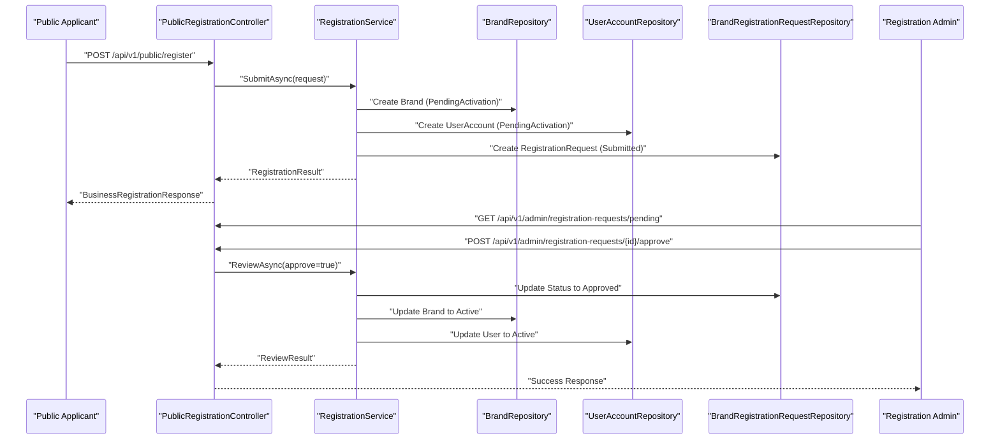
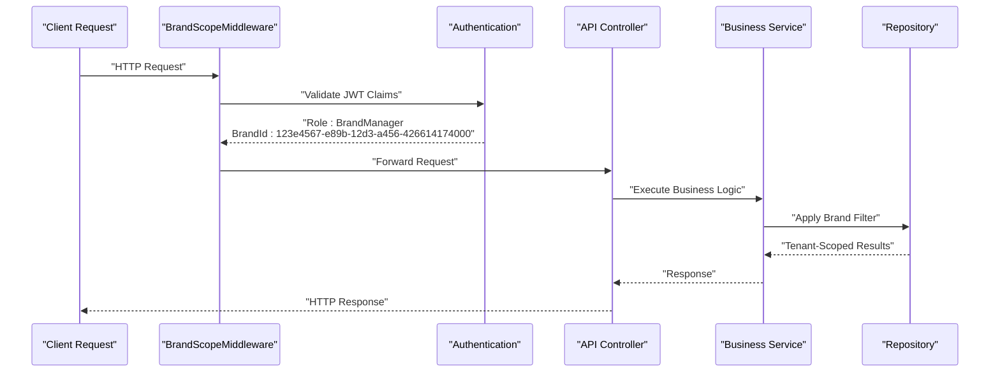
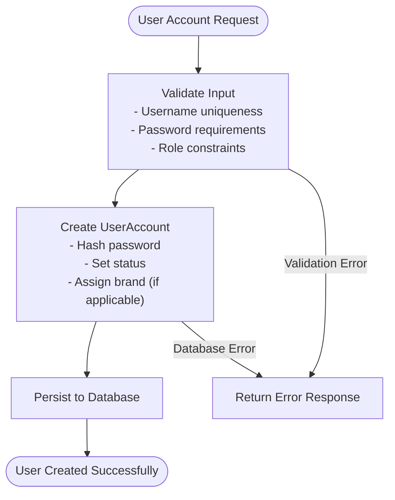
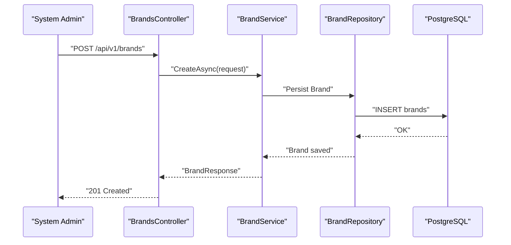
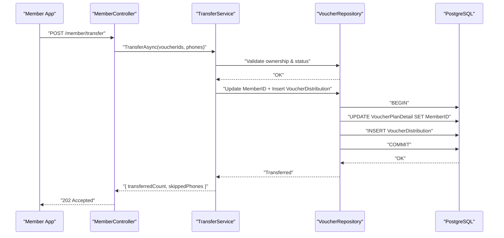
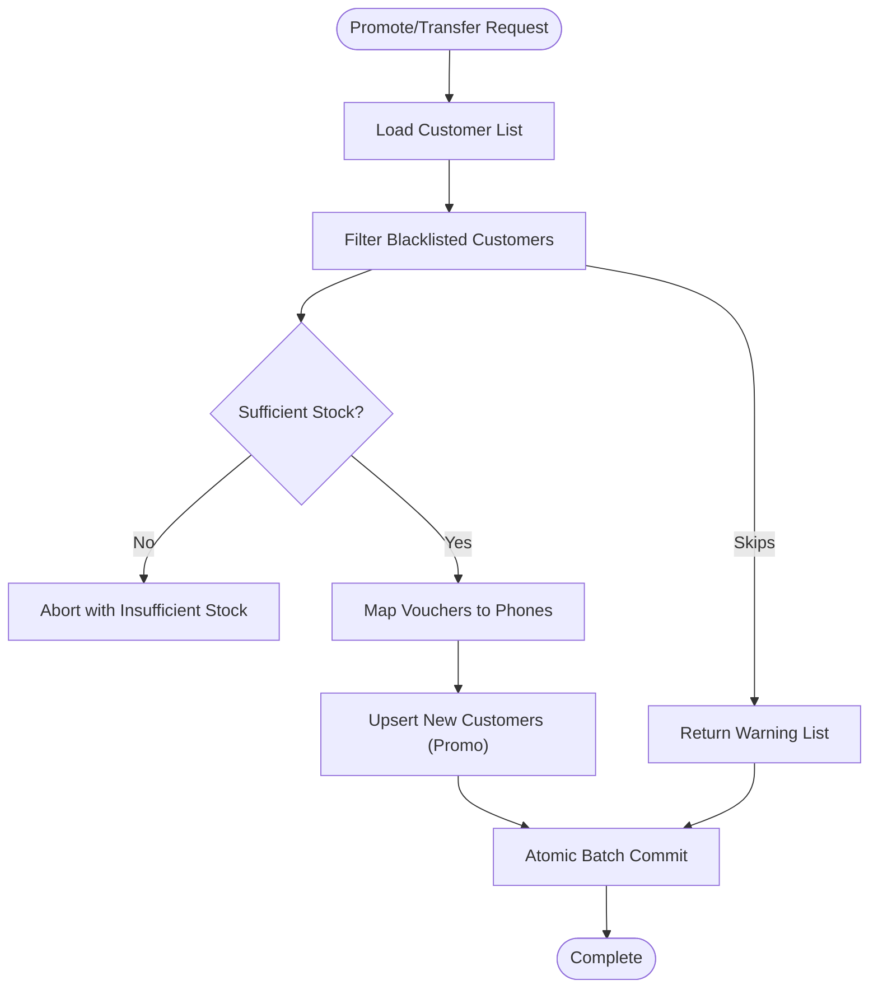
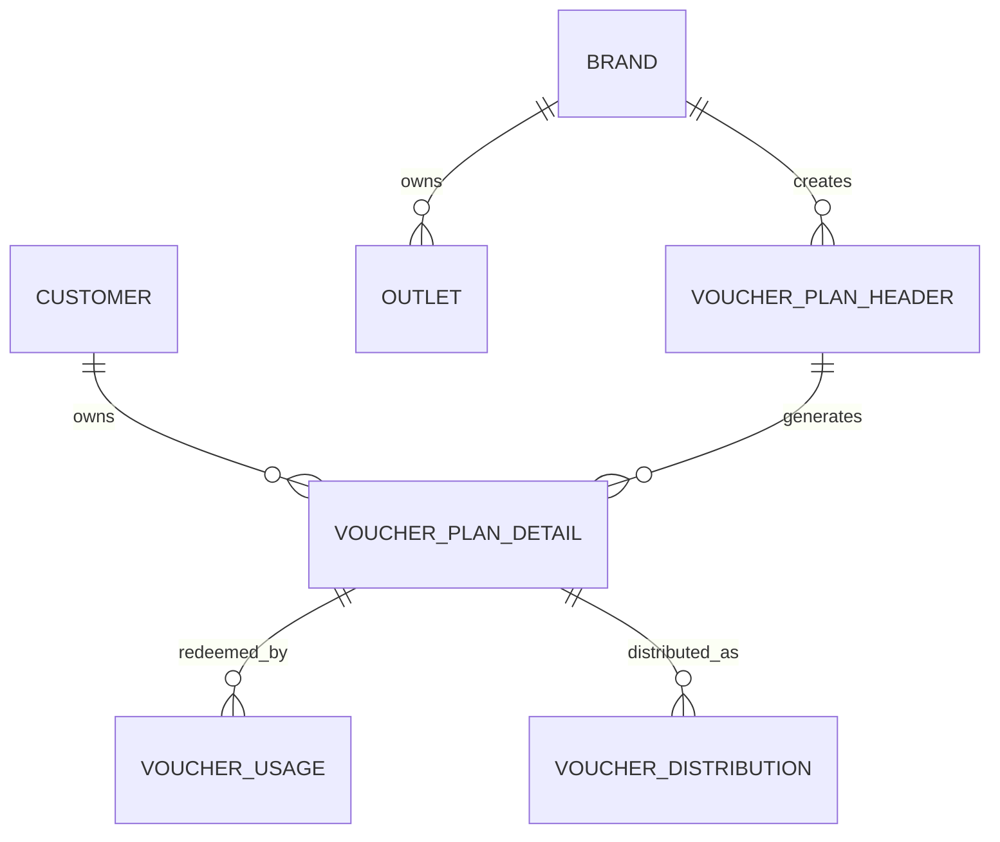
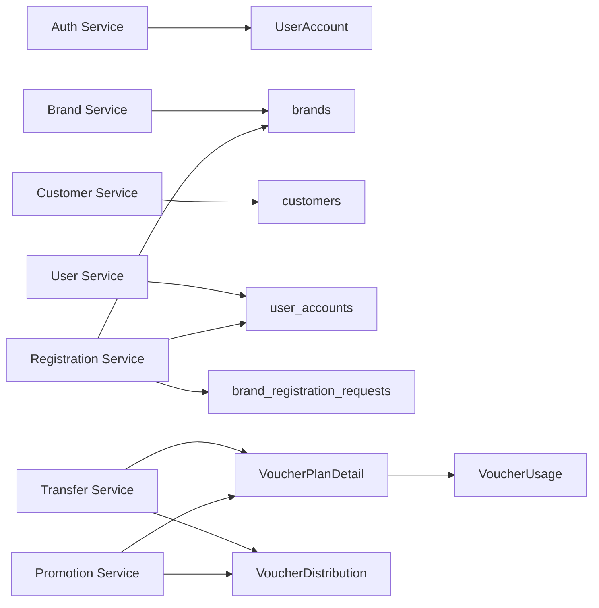

# Customer and Business Management

<cite>
**Referenced Files in This Document**
- [docs/index.md](file://docs/index.md)
- [docs/architecture.md](file://docs/architecture.md)
- [docs/data-models.md](file://docs/data-models.md)
- [docs/api-contracts.md](file://docs/api-contracts.md)
- [Key Functionalities.txt](file://Key Functionalities.txt)
- [BMAD_STRUCTURE.md](file://BMAD_STRUCTURE.md)
- [_bmad-output/implementation-artifacts/1-1-brand-setup.md](file://_bmad-output/implementation-artifacts/1-1-brand-setup.md)
- [_bmad-output/implementation-artifacts/1-3-customer-record-management.md](file://_bmad-output/implementation-artifacts/1-3-customer-record-management.md)
- [_bmad-output/implementation-artifacts/1-4-staff-accounts-rbac.md](file://_bmad-output/implementation-artifacts/1-4-staff-accounts-rbac.md)
- [_bmad-output/implementation-artifacts/1-5-business-self-registration.md](file://_bmad-output/implementation-artifacts/1-5-business-self-registration.md)
- [_bmad-output/implementation-artifacts/1-6-business-registration-approval.md](file://_bmad-output/implementation-artifacts/1-6-business-registration-approval.md)
- [_bmad-output/implementation-artifacts/3-1-batch-promotion-distribution.md](file://_bmad-output/implementation-artifacts/3-1-batch-promotion-distribution.md)
- [_bmad-output/implementation-artifacts/3-3-gifting-batch-transfer.md](file://_bmad-output/implementation-artifacts/3-3-gifting-batch-transfer.md)
- [src/NonCash.Core/Services/BrandService.cs](file://src/NonCash.Core/Services/BrandService.cs)
- [src/NonCash.Core/Services/CustomerService.cs](file://src/NonCash.Core/Services/CustomerService.cs)
- [src/NonCash.Core/Services/UserService.cs](file://src/NonCash.Core/Services/UserService.cs)
- [src/NonCash.Core/Services/RegistrationService.cs](file://src/NonCash.Core/Services/RegistrationService.cs)
- [src/NonCash.Core/Entities/UserAccount.cs](file://src/NonCash.Core/Entities/UserAccount.cs)
- [src/NonCash.Core/Entities/BrandRegistrationRequest.cs](file://src/NonCash.Core/Entities/BrandRegistrationRequest.cs)
- [src/NonCash.Core/Interfaces/IBrandScoped.cs](file://src/NonCash.Core/Interfaces/IBrandScoped.cs)
- [src/NonCash.API/Middleware/BrandScopeMiddleware.cs](file://src/NonCash.API/Middleware/BrandScopeMiddleware.cs)
- [src/NonCash.API/Controllers/PublicRegistrationController.cs](file://src/NonCash.API/Controllers/PublicRegistrationController.cs)
- [src/NonCash.API/Controllers/RegistrationReviewController.cs](file://src/NonCash.API/Controllers/RegistrationReviewController.cs)
- [src/NonCash.Infrastructure/Services/CsvCustomerImportService.cs](file://src/NonCash.Infrastructure/Services/CsvCustomerImportService.cs)
- [src/NonCash.Core/Interfaces/ICustomerImportService.cs](file://src/NonCash.Core/Interfaces/ICustomerImportService.cs)
</cite>

## Update Summary
**Changes Made**
- Added comprehensive business registration and approval workflow documentation
- Enhanced customer import functionality with CSV processing capabilities
- Expanded multi-tenant architecture support with brand scoping middleware
- Added new user account management capabilities with role-based access control
- Integrated new BrandRegistrationRequest entity and related services
- Enhanced customer service with improved import and validation logic

## Table of Contents
1. [Introduction](#introduction)
2. [Project Structure](#project-structure)
3. [Core Components](#core-components)
4. [Architecture Overview](#architecture-overview)
5. [Detailed Component Analysis](#detailed-component-analysis)
6. [Dependency Analysis](#dependency-analysis)
7. [Performance Considerations](#performance-considerations)
8. [Troubleshooting Guide](#troubleshooting-guide)
9. [Conclusion](#conclusion)
10. [Appendices](#appendices)

## Introduction
This document explains the customer and business management functionality for the NonCash voucher platform. It covers:
- Customer profile management, membership tracking, and blacklist controls
- Business (tenant) management and multi-tenant data isolation
- Member ID system for individuals and organizations
- Blacklist management to prevent problematic users from participating in voucher activities
- **New**: Business registration and approval workflows for self-service tenant onboarding
- **New**: Enhanced customer import functionality with CSV processing capabilities
- **New**: Advanced multi-tenant architecture support with brand scoping middleware
- **New**: Comprehensive user account management with role-based access control
- Privacy and data protection considerations integrated with the multi-tenant architecture
- The relationship between customer profiles and voucher ownership tracking, including transfer and redemption history

## Project Structure
The NonCash platform follows a 3-layer SaaS architecture with clear separation of concerns:
- Frontend (Blazor)
- Business Logic Layer (Core microservices)
- Data Access Layer (Infrastructure with PostgreSQL)

The documentation index and architecture overview define the system's scope and layered design. The data models and API contracts provide the canonical definitions for entities and interactions.

```mermaid
graph TB
subgraph "Frontend"
UI["Blazor Pages<br/>Admin & Member UI"]
end
subgraph "Business Logic Layer (Core)"
AUTH["Auth Service"]
CUSTOMER["Customer Service"]
BRAND["Brand Service"]
USER["User Service"]
REGISTRATION["Registration Service"]
TRANSFER["Transfer Service"]
PROMO["Promotion Service"]
end
subgraph "Data Access Layer (Infrastructure)"
REPO["Repositories"]
DB["PostgreSQL"]
end
UI --> AUTH
UI --> CUSTOMER
UI --> BRAND
UI --> USER
UI --> REGISTRATION
UI --> TRANSFER
UI --> PROMO
AUTH --> REPO
CUSTOMER --> REPO
BRAND --> REPO
USER --> REPO
REGISTRATION --> REPO
TRANSFER --> REPO
PROMO --> REPO
REPO --> DB
```

**Diagram sources**
- [docs/architecture.md:17-35](file://docs/architecture.md#L17-L35)
- [docs/index.md:18-26](file://docs/index.md#L18-L26)

**Section sources**
- [docs/index.md:12-32](file://docs/index.md#L12-L32)
- [docs/architecture.md:5-52](file://docs/architecture.md#L5-L52)

## Core Components
This section summarizes the core components relevant to customer and business management.

- Identity and Tenant Management
  - Brand (tenant) entity and multi-tenancy enforcement
  - Staff accounts with RBAC and JWT-based authentication
  - **New**: Brand registration workflow with approval process
  - **New**: Brand scoping middleware for tenant isolation
- Customer Management
  - Customer entity, creation, search, import, and blacklist controls
  - **Enhanced**: CSV-based customer import with validation and upsert logic
- Voucher Ownership and Distribution
  - VoucherPlanDetail ownership tracking via MemberID
  - Distribution logs for sales, promotions, and transfers
  - Redemption tracking via VoucherUsage

**Section sources**
- [docs/data-models.md:63-98](file://docs/data-models.md#L63-L98)
- [docs/api-contracts.md:9-109](file://docs/api-contracts.md#L9-L109)
- [Key Functionalities.txt:158-166](file://Key Functionalities.txt#L158-L166)

## Architecture Overview
The NonCash platform is a SaaS system with:
- Multi-tenancy enforced by BrandID
- JWT-based authentication for staff and member app
- Dynamic, rotating voucher codes for POS usage
- POS integration via API keys scoped to approved ranges
- **New**: Brand registration approval workflow with admin oversight
- **New**: Enhanced user account management with role-based permissions

```mermaid
graph TB
subgraph "SaaS Platform"
subgraph "Brand Tenant"
BRAND["Brand (BrandID)"]
OUTLET["Outlet"]
PLAN["VoucherPlanHeader"]
DETAIL["VoucherPlanDetail"]
USAGE["VoucherUsage"]
DIST["VoucherDistribution"]
CUSTOMER["Customer"]
USER["UserAccount"]
REG_REQUEST["BrandRegistrationRequest"]
END
END
POS["POS System"] --> |"API Key"| DETAIL
MEMBER["Member App"] --> |"JWT"| DETAIL
ADMIN["Brand Manager"] --> |"JWT"| USER
ADMIN --> |"JWT"| CUSTOMER
ADMIN --> |"JWT"| BRAND
REG_ADMIN["Registration Admin"] --> |"JWT"| REG_REQUEST
REG_ADMIN --> |"JWT"| BRAND
DETAIL --> USAGE
DETAIL --> DIST
CUSTOMER --> DETAIL
BRAND --> OUTLET
BRAND --> PLAN
BRAND --> REG_REQUEST
```

**Diagram sources**
- [docs/architecture.md:36-41](file://docs/architecture.md#L36-L41)
- [docs/data-models.md:9-98](file://docs/data-models.md#L9-L98)

**Section sources**
- [docs/architecture.md:36-41](file://docs/architecture.md#L36-L41)
- [docs/data-models.md:9-98](file://docs/data-models.md#L9-L98)

## Detailed Component Analysis

### Customer Management System
Customer management encompasses profile lifecycle, blacklist controls, and enhanced bulk import capabilities.

- Profile Management
  - Unique phone number requirement and normalization
  - Full name and email fields
  - Status tracking (Active, Blacklisted)
- Blacklist Functionality
  - Brand managers can mark customers as Blacklisted
  - Blacklisted customers are excluded from future promotions and self-purchases
  - Service exposes a method to check blacklist status for downstream services
- Enhanced Bulk Import
  - **New**: CSV/Excel upload with upsert logic on phone number
  - **New**: Transactional processing to avoid partial commits
  - **New**: UI with progress indication for large files
  - **New**: CSV helper integration for structured data processing

```mermaid
flowchart TD
Start(["Upload CSV"]) --> Parse["Parse File Rows"]
Parse --> Validate["Validate Fields<br/>Normalize Phone Numbers"]
Validate --> Upsert["Upsert Customer Records<br/>by Phone Number"]
Upsert --> Txn["Transactional Batch Commit"]
Txn --> Done(["Import Complete"])
Validate --> |Errors| Skip["Skip Malformed Rows<br/>or Rollback"]
Skip --> Done
```

**Diagram sources**
- [_bmad-output/implementation-artifacts/1-3-customer-record-management.md:25-30](file://_bmad-output/implementation-artifacts/1-3-customer-record-management.md#L25-L30)
- [_bmad-output/implementation-artifacts/1-3-customer-record-management.md:52-57](file://_bmad-output/implementation-artifacts/1-3-customer-record-management.md#L52-L57)

**Section sources**
- [_bmad-output/implementation-artifacts/1-3-customer-record-management.md:11-41](file://_bmad-output/implementation-artifacts/1-3-customer-record-management.md#L11-L41)
- [_bmad-output/implementation-artifacts/1-3-customer-record-management.md:70-106](file://_bmad-output/implementation-artifacts/1-3-customer-record-management.md#L70-L106)
- [docs/data-models.md:91-98](file://docs/data-models.md#L91-L98)
- [src/NonCash.Infrastructure/Services/CsvCustomerImportService.cs:18-37](file://src/NonCash.Infrastructure/Services/CsvCustomerImportService.cs#L18-L37)

### Business Registration and Approval Workflow
**New** comprehensive business registration system enabling self-service tenant onboarding with admin approval.

- Registration Process
  - Public self-registration with company details and representative information
  - Automatic creation of brand with PendingActivation status
  - Linked user account creation with PendingActivation status
  - Registration request tracking with Submitted status
- Approval Workflow
  - Admin review interface for pending registration requests
  - Approval or rejection with optional review notes
  - Atomic status updates across brand, user account, and registration request
  - Automated notifications to business representatives
- Status Management
  - RegistrationStatus enum: Submitted, UnderReview, Approved, Rejected
  - BrandStatus and UserStatus synchronization with approval decisions
  - Immutable audit trail for all review actions

```mermaid
sequenceDiagram
participant Public as "Public Applicant"
participant API as "PublicRegistrationController"
participant Service as "RegistrationService"
participant BrandRepo as "BrandRepository"
participant UserRepo as "UserAccountRepository"
participant RequestRepo as "BrandRegistrationRequestRepository"
participant Admin as "Registration Admin"
Public->>API : "POST /api/v1/public/register"
API->>Service : "SubmitAsync(request)"
Service->>BrandRepo : "Create Brand (PendingActivation)"
Service->>UserRepo : "Create UserAccount (PendingActivation)"
Service->>RequestRepo : "Create RegistrationRequest (Submitted)"
Service-->>API : "RegistrationResult"
API-->>Public : "BusinessRegistrationResponse"
Admin->>API : "GET /api/v1/admin/registration-requests/pending"
Admin->>API : "POST /api/v1/admin/registration-requests/{id}/approve"
API->>Service : "ReviewAsync(approve=true)"
Service->>RequestRepo : "Update Status to Approved"
Service->>BrandRepo : "Update Brand to Active"
Service->>UserRepo : "Update User to Active"
Service-->>API : "ReviewResult"
API-->>Admin : "Success Response"
```

**Diagram sources**
- [_bmad-output/implementation-artifacts/1-5-business-self-registration.md:41-76](file://_bmad-output/implementation-artifacts/1-5-business-self-registration.md#L41-L76)
- [_bmad-output/implementation-artifacts/1-6-business-registration-approval.md:13-55](file://_bmad-output/implementation-artifacts/1-6-business-registration-approval.md#L13-L55)

**Section sources**
- [_bmad-output/implementation-artifacts/1-5-business-self-registration.md:41-76](file://_bmad-output/implementation-artifacts/1-5-business-self-registration.md#L41-L76)
- [_bmad-output/implementation-artifacts/1-6-business-registration-approval.md:13-55](file://_bmad-output/implementation-artifacts/1-6-business-registration-approval.md#L13-L55)
- [src/NonCash.Core/Services/RegistrationService.cs:95-161](file://src/NonCash.Core/Services/RegistrationService.cs#L95-L161)
- [src/NonCash.Core/Services/RegistrationService.cs:188-228](file://src/NonCash.Core/Services/RegistrationService.cs#L188-L228)

### Enhanced Multi-Tenant Architecture Support
**New** advanced multi-tenant isolation with brand scoping middleware and enhanced tenant management.

- Brand Scoping Middleware
  - Validates JWT claims for proper tenant assignment
  - Allows Admin users to operate across all brands
  - Restricts non-admin users to their assigned brand scope
  - Returns 403 Forbidden for unauthorized cross-tenant access
- Brand Interface Implementation
  - IBrandScoped interface for tenant-aware entities
  - Consistent BrandId property across all tenant-scoped models
  - Repository-level filtering for automatic tenant isolation
- Enhanced Tenant Management
  - BrandService with comprehensive CRUD operations
  - Advanced filtering by name and status
  - Pagination support for large tenant lists
  - Business rule enforcement for tax code immutability

```mermaid
sequenceDiagram
participant Client as "Client Request"
participant Middleware as "BrandScopeMiddleware"
participant Auth as "Authentication"
participant Controller as "API Controller"
participant Service as "Business Service"
participant Repo as "Repository"
Client->>Middleware : "HTTP Request"
Middleware->>Auth : "Validate JWT Claims"
Auth-->>Middleware : "Role : BrandManager<br/>BrandId : 123e4567-e89b-12d3-a456-426614174000"
Middleware->>Controller : "Forward Request"
Controller->>Service : "Execute Business Logic"
Service->>Repo : "Apply Brand Filter"
Repo-->>Service : "Tenant-Scoped Results"
Service-->>Controller : "Response"
Controller-->>Client : "HTTP Response"
```

**Diagram sources**
- [src/NonCash.API/Middleware/BrandScopeMiddleware.cs:14-32](file://src/NonCash.API/Middleware/BrandScopeMiddleware.cs#L14-L32)
- [src/NonCash.Core/Interfaces/IBrandScoped.cs:3-6](file://src/NonCash.Core/Interfaces/IBrandScoped.cs#L3-L6)

**Section sources**
- [src/NonCash.API/Middleware/BrandScopeMiddleware.cs:14-32](file://src/NonCash.API/Middleware/BrandScopeMiddleware.cs#L14-L32)
- [src/NonCash.Core/Interfaces/IBrandScoped.cs:3-6](file://src/NonCash.Core/Interfaces/IBrandScoped.cs#L3-L6)
- [src/NonCash.Core/Services/BrandService.cs:62-98](file://src/NonCash.Core/Services/BrandService.cs#L62-L98)

### User Account Management and RBAC
**New** comprehensive user account management system with role-based access control and enhanced security.

- User Account Lifecycle
  - Create, lock, unlock, and list operations for user accounts
  - Username uniqueness validation across all brands
  - Password hashing with minimum length requirements
  - Role-based permission enforcement
- Role-Based Access Control
  - UserRole enum: Admin, BrandManager, Planner, Approver
  - UserStatus enum: PendingActivation, Active, Locked
  - Brand-specific user assignments for non-admin roles
  - Admin privileges override brand scoping restrictions
- Enhanced Security Features
  - Mandatory brand assignment for non-admin users
  - Atomic user creation with validation
  - Comprehensive error handling and validation

```mermaid
flowchart TD
Start(["User Account Request"]) --> Validate["Validate Input<br/>- Username uniqueness<br/>- Password requirements<br/>- Role constraints"]
Validate --> Create["Create UserAccount<br/>- Hash password<br/>- Set status<br/>- Assign brand (if applicable)"]
Create --> Persist["Persist to Database"]
Persist --> Success(["User Created Successfully"])
Validate --> |Validation Error| Error["Return Error Response"]
Create --> |Database Error| Error
```

**Diagram sources**
- [src/NonCash.Core/Services/UserService.cs:17-47](file://src/NonCash.Core/Services/UserService.cs#L17-L47)
- [src/NonCash.Core/Entities/UserAccount.cs:3-28](file://src/NonCash.Core/Entities/UserAccount.cs#L3-L28)

**Section sources**
- [src/NonCash.Core/Services/UserService.cs:17-84](file://src/NonCash.Core/Services/UserService.cs#L17-L84)
- [src/NonCash.Core/Entities/UserAccount.cs:3-28](file://src/NonCash.Core/Entities/UserAccount.cs#L3-L28)

### Business Management and Multi-Tenant Isolation
Business management establishes and maintains tenant boundaries with enhanced security and workflow capabilities.

- Brand Creation and Maintenance
  - Unique tax code constraint with business rule enforcement
  - Immutable tax code when linked entities exist
  - Status management (Active, Suspended, PendingActivation)
  - Comprehensive CRUD operations with filtering and pagination
- Multi-Tenancy Enforcement
  - All tenant-scoped operations filtered by BrandID
  - JWT carries BrandID for scope enforcement
  - Cross-tenant access attempts rejected
  - **Enhanced**: Brand scoping middleware validates tenant assignments

```mermaid
sequenceDiagram
participant Admin as "System Admin"
participant API as "BrandsController"
participant Service as "BrandService"
participant Repo as "BrandRepository"
participant DB as "PostgreSQL"
Admin->>API : "POST /api/v1/brands"
API->>Service : "CreateAsync(request)"
Service->>Repo : "Persist Brand"
Repo->>DB : "INSERT brands"
DB-->>Repo : "OK"
Repo-->>Service : "Brand saved"
Service-->>API : "BrandResponse"
API-->>Admin : "201 Created"
```

**Diagram sources**
- [_bmad-output/implementation-artifacts/1-1-brand-setup.md:40-54](file://_bmad-output/implementation-artifacts/1-1-brand-setup.md#L40-L54)
- [_bmad-output/implementation-artifacts/1-1-brand-setup.md:65-81](file://_bmad-output/implementation-artifacts/1-1-brand-setup.md#L65-L81)

**Section sources**
- [_bmad-output/implementation-artifacts/1-1-brand-setup.md:11-39](file://_bmad-output/implementation-artifacts/1-1-brand-setup.md#L11-L39)
- [_bmad-output/implementation-artifacts/1-1-brand-setup.md:65-96](file://_bmad-output/implementation-artifacts/1-1-brand-setup.md#L65-L96)
- [docs/architecture.md:38](file://docs/architecture.md#L38)

### Member ID System and Account Linking
Member ID enables ownership tracking across individuals and organizations.

- Individual Members
  - MemberID corresponds to CustomerID
  - Ownership tracked via VoucherPlanDetail.MemberID
- Business Organizations
  - MemberID concept extends to organizations (as described in functional requirements)
  - Ownership linkage occurs similarly via MemberID on VoucherPlanDetail
- Registration and Linking
  - Self-purchase flow assigns MemberID upon purchase
  - Batch promotions auto-create customers and assign MemberID
  - Transfers reassign MemberID atomically with audit trail

```mermaid
sequenceDiagram
participant Member as "Member App"
participant API as "MemberController"
participant Service as "TransferService"
participant Repo as "VoucherRepository"
participant DB as "PostgreSQL"
Member->>API : "POST /member/transfer"
API->>Service : "TransferAsync(voucherIds, phones)"
Service->>Repo : "Validate ownership & status"
Repo-->>Service : "OK"
Service->>Repo : "Update MemberID + Insert VoucherDistribution"
Repo->>DB : "BEGIN"
Repo->>DB : "UPDATE VoucherPlanDetail SET MemberID"
Repo->>DB : "INSERT VoucherDistribution"
Repo->>DB : "COMMIT"
DB-->>Repo : "OK"
Repo-->>Service : "Transferred"
Service-->>API : "{ transferredCount, skippedPhones }"
API-->>Member : "202 Accepted"
```

**Diagram sources**
- [_bmad-output/implementation-artifacts/3-3-gifting-batch-transfer.md:44-54](file://_bmad-output/implementation-artifacts/3-3-gifting-batch-transfer.md#L44-L54)
- [docs/api-contracts.md:98-109](file://docs/api-contracts.md#L98-L109)

**Section sources**
- [Key Functionalities.txt:97-133](file://Key Functionalities.txt#L97-L133)
- [_bmad-output/implementation-artifacts/3-3-gifting-batch-transfer.md:11-41](file://_bmad-output/implementation-artifacts/3-3-gifting-batch-transfer.md#L11-L41)
- [docs/data-models.md:34-62](file://docs/data-models.md#L34-L62)

### Blacklist Management and Voucher Activities
Blacklist controls participation in voucher activities.

- Promotion Exclusion
  - Batch promotions exclude Blacklisted customers
  - Skipped records reported with warnings
- Transfer Controls
  - Recipients linked to Blacklisted customers are skipped during transfer
  - Warning returned for skipped mappings
- Purchase Controls
  - Blacklisted customers excluded from self-purchases

```mermaid
flowchart TD
Start(["Promote/Transfer Request"]) --> Load["Load Customer List"]
Load --> Filter["Filter Blacklisted Customers"]
Filter --> Count{"Sufficient Stock?"}
Count --> |No| Abort["Abort with Insufficient Stock"]
Count --> |Yes| Map["Map Vouchers to Phones"]
Map --> Upsert["Upsert New Customers (Promo)"]
Upsert --> Txn["Atomic Batch Commit"]
Txn --> Done(["Complete"])
Filter --> |Skips| Warn["Return Warning List"]
Warn --> Txn
```

**Diagram sources**
- [_bmad-output/implementation-artifacts/3-1-batch-promotion-distribution.md:36-41](file://_bmad-output/implementation-artifacts/3-1-batch-promotion-distribution.md#L36-L41)
- [_bmad-output/implementation-artifacts/3-3-gifting-batch-transfer.md:32-37](file://_bmad-output/implementation-artifacts/3-3-gifting-batch-transfer.md#L32-L37)

**Section sources**
- [_bmad-output/implementation-artifacts/3-1-batch-promotion-distribution.md:11-45](file://_bmad-output/implementation-artifacts/3-1-batch-promotion-distribution.md#L11-L45)
- [_bmad-output/implementation-artifacts/3-3-gifting-batch-transfer.md:11-41](file://_bmad-output/implementation-artifacts/3-3-gifting-batch-transfer.md#L11-L41)

### Voucher Ownership Tracking and Redemption History
Ownership tracking and history maintenance tie customer profiles to voucher lifecycle events.

- Ownership Tracking
  - VoucherPlanDetail.MemberID links ownership to MemberID
  - VoucherDistribution records method (Sale, Promotion, Transfer) and timestamps
- Redemption History
  - VoucherUsage captures POS redemptions with POSID, TransactionID, and AmountUsed
- Member App Integration
  - GET /member/vouchers lists owned vouchers
  - Transfer endpoint initiates ownership reassignment

```mermaid
erDiagram
CUSTOMER ||--o{ VOUCHER_PLAN_DETAIL : "owns"
BRAND ||--o{ OUTLET : "owns"
BRAND ||--o{ VOUCHER_PLAN_HEADER : "creates"
VOUCHER_PLAN_HEADER ||--o{ VOUCHER_PLAN_DETAIL : "generates"
VOUCHER_PLAN_DETAIL ||--o{ VOUCHER_USAGE : "redeemed_by"
VOUCHER_PLAN_DETAIL ||--o{ VOUCHER_DISTRIBUTION : "distributed_as"
```

**Diagram sources**
- [docs/data-models.md:9-62](file://docs/data-models.md#L9-L62)
- [docs/api-contracts.md:93-109](file://docs/api-contracts.md#L93-L109)

**Section sources**
- [docs/data-models.md:9-62](file://docs/data-models.md#L9-L62)
- [docs/api-contracts.md:93-109](file://docs/api-contracts.md#L93-L109)

## Dependency Analysis
The following diagram shows key dependencies among components relevant to customer and business management.

```mermaid
graph LR
AUTH["Auth Service"] --> USER["UserAccount"]
BRAND["Brand Service"] --> BRAND_TBL["brands"]
CUSTOMER["Customer Service"] --> CUSTOMER_TBL["customers"]
USER_SERVICE["User Service"] --> USER_TBL["user_accounts"]
REG_SERVICE["Registration Service"] --> REG_REQUEST_TBL["brand_registration_requests"]
REG_SERVICE --> BRAND_TBL
REG_SERVICE --> USER_TBL
TRANSFER["Transfer Service"] --> DETAIL["VoucherPlanDetail"]
TRANSFER --> DIST["VoucherDistribution"]
PROMO["Promotion Service"] --> DETAIL
PROMO --> DIST
DETAIL --> USAGE["VoucherUsage"]
```

**Diagram sources**
- [_bmad-output/implementation-artifacts/1-4-staff-accounts-rbac.md:47-64](file://_bmad-output/implementation-artifacts/1-4-staff-accounts-rbac.md#L47-L64)
- [_bmad-output/implementation-artifacts/1-1-brand-setup.md:40-54](file://_bmad-output/implementation-artifacts/1-1-brand-setup.md#L40-L54)
- [_bmad-output/implementation-artifacts/1-3-customer-record-management.md:48-60](file://_bmad-output/implementation-artifacts/1-3-customer-record-management.md#L48-L60)
- [_bmad-output/implementation-artifacts/3-3-gifting-batch-transfer.md:44-54](file://_bmad-output/implementation-artifacts/3-3-gifting-batch-transfer.md#L44-L54)
- [_bmad-output/implementation-artifacts/3-1-batch-promotion-distribution.md:18-29](file://_bmad-output/implementation-artifacts/3-1-batch-promotion-distribution.md#L18-L29)
- [docs/data-models.md:9-62](file://docs/data-models.md#L9-L62)

**Section sources**
- [_bmad-output/implementation-artifacts/1-4-staff-accounts-rbac.md:47-64](file://_bmad-output/implementation-artifacts/1-4-staff-accounts-rbac.md#L47-L64)
- [_bmad-output/implementation-artifacts/1-1-brand-setup.md:40-54](file://_bmad-output/implementation-artifacts/1-1-brand-setup.md#L40-L54)
- [_bmad-output/implementation-artifacts/1-3-customer-record-management.md:48-60](file://_bmad-output/implementation-artifacts/1-3-customer-record-management.md#L48-L60)
- [_bmad-output/implementation-artifacts/3-3-gifting-batch-transfer.md:44-54](file://_bmad-output/implementation-artifacts/3-3-gifting-batch-transfer.md#L44-L54)
- [_bmad-output/implementation-artifacts/3-1-batch-promotion-distribution.md:18-29](file://_bmad-output/implementation-artifacts/3-1-batch-promotion-distribution.md#L18-L29)
- [docs/data-models.md:9-62](file://docs/data-models.md#L9-L62)

## Performance Considerations
- Use pagination and indexing for customer search and listing
- Normalize phone numbers to reduce duplicate entries and improve lookup performance
- **New**: Batch process large CSV imports with chunked transactions to avoid long-running sessions
- Enforce tenant filters at the repository level to prevent accidental cross-tenant scans
- **New**: Implement brand scoping middleware for efficient tenant isolation
- Keep blacklist checks short-circuiting to minimize overhead during transfer and promotion flows
- **New**: Optimize registration workflow with asynchronous processing for better scalability

## Troubleshooting Guide
Common issues and resolutions:
- Duplicate Phone Numbers During Import
  - Use upsert logic keyed by normalized phone number
  - Validate and log skipped rows with clear reasons
- Blacklist Conflicts
  - Ensure blacklist checks occur before assignment or transfer
  - Return explicit warnings for skipped recipients or customers
- Cross-Tenant Access
  - Verify BrandID in JWT and enforce repository-level tenant filters
  - **New**: Check brand scoping middleware configuration for proper tenant isolation
  - Reject attempts to access data outside the user's Brand scope
- Transaction Failures
  - Wrap transfer and promotion operations in atomic transactions
  - Roll back on errors to maintain consistency
- **New**: Registration Workflow Issues
  - Verify tax code uniqueness against existing brands
  - Check username availability for representative accounts
  - Ensure proper role assignment for user accounts
- **New**: User Account Management Problems
  - Validate brand assignment for non-admin users
  - Check password complexity requirements
  - Verify username uniqueness across all brands

**Section sources**
- [_bmad-output/implementation-artifacts/1-3-customer-record-management.md:70-76](file://_bmad-output/implementation-artifacts/1-3-customer-record-management.md#L70-L76)
- [_bmad-output/implementation-artifacts/3-1-batch-promotion-distribution.md:30-35](file://_bmad-output/implementation-artifacts/3-1-batch-promotion-distribution.md#L30-L35)
- [_bmad-output/implementation-artifacts/3-3-gifting-batch-transfer.md:47-50](file://_bmad-output/implementation-artifacts/3-3-gifting-batch-transfer.md#L47-L50)
- [_bmad-output/implementation-artifacts/1-4-staff-accounts-rbac.md:40-44](file://_bmad-output/implementation-artifacts/1-4-staff-accounts-rbac.md#L40-L44)
- [src/NonCash.API/Middleware/BrandScopeMiddleware.cs:21-28](file://src/NonCash.API/Middleware/BrandScopeMiddleware.cs#L21-L28)

## Conclusion
The NonCash platform provides a robust foundation for customer and business management through:
- Strong multi-tenant isolation using BrandID with enhanced brand scoping middleware
- Comprehensive customer lifecycle management with blacklist controls and enhanced import capabilities
- **New**: Complete business registration and approval workflow with self-service onboarding
- **New**: Advanced user account management with role-based access control and security enforcement
- Clear ownership tracking via MemberID and VoucherPlanDetail
- Audit trails for promotions, transfers, and redemptions
- Secure authentication and authorization for staff and POS integrations
- **New**: Scalable registration processing with asynchronous workflows and comprehensive validation

These capabilities enable brands to manage customer participation, enforce compliance, maintain data integrity across a SaaS environment, and support efficient tenant onboarding with proper governance controls.

## Appendices
- Data Privacy and Protection
  - Enforce RBAC and tenant scoping to limit data exposure
  - Use JWT for session-bound access and API keys for POS systems
  - Normalize sensitive identifiers (e.g., phone numbers) to support deduplication without exposing PII unnecessarily
  - **New**: Implement comprehensive audit trails for all registration and approval activities
- Integration Notes
  - Member App endpoints for listing vouchers and initiating transfers are defined in the API contracts
  - POS endpoints for verification, locking, and redemption are documented separately
  - **New**: Public registration endpoints for self-service business onboarding
  - **New**: Admin registration review endpoints for governance and approval workflows
- **New**: Technical Specifications
  - BrandRegistrationRequest entity supports complete registration lifecycle tracking
  - CSV import service handles large-scale customer data processing efficiently
  - Brand scoping middleware ensures automatic tenant isolation at the application layer

**Section sources**
- [docs/architecture.md:36-41](file://docs/architecture.md#L36-L41)
- [docs/api-contracts.md:9-109](file://docs/api-contracts.md#L9-L109)
- [Key Functionalities.txt:158-166](file://Key Functionalities.txt#L158-L166)
- [src/NonCash.Core/Entities/BrandRegistrationRequest.cs:11-24](file://src/NonCash.Core/Entities/BrandRegistrationRequest.cs#L11-L24)
- [src/NonCash.Infrastructure/Services/CsvCustomerImportService.cs:18-37](file://src/NonCash.Infrastructure/Services/CsvCustomerImportService.cs#L18-L37)