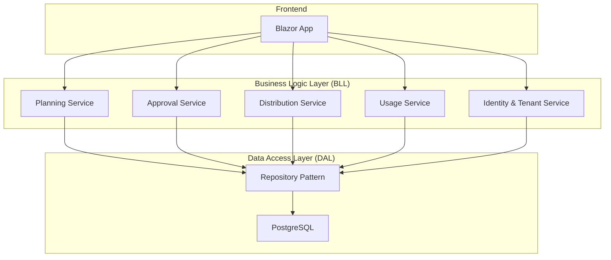
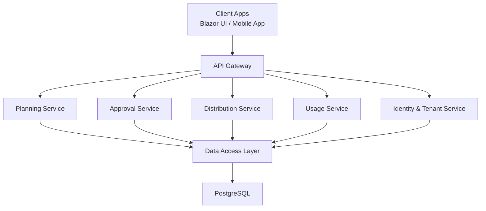
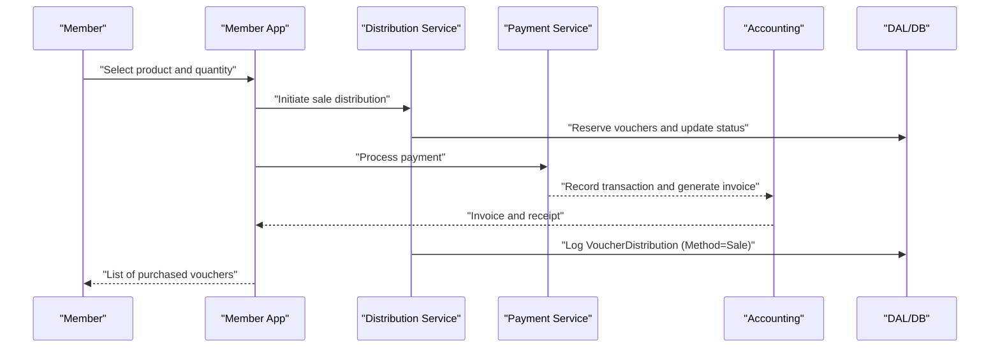
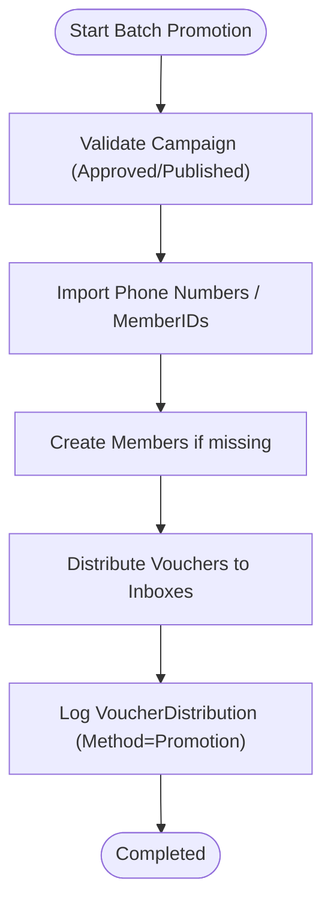
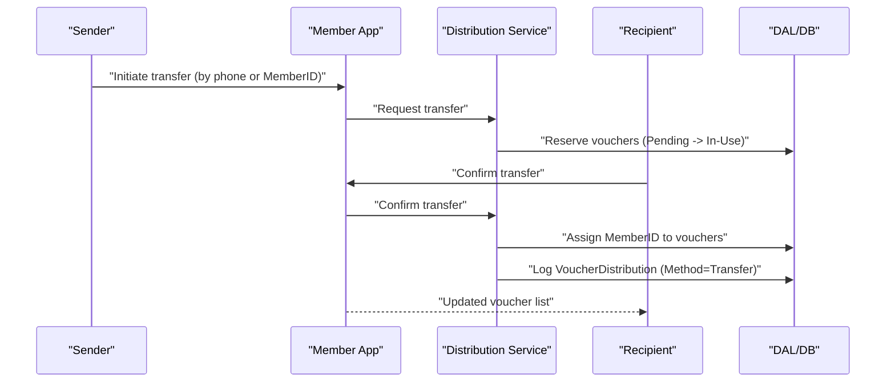
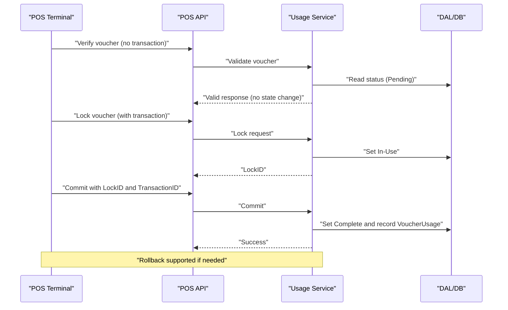
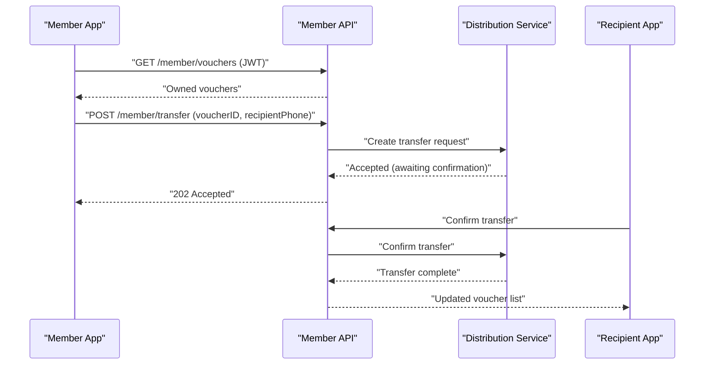
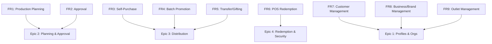

# Multi-Channel Distribution System

<cite>
**Referenced Files in This Document**
- [BMAD_STRUCTURE.md](file://BMAD_STRUCTURE.md)
- [Key Functionalities.txt](file://Key Functionalities.txt)
- [description.txt](file://description.txt)
- [architecture.md](file://docs/architecture.md)
- [data-models.md](file://docs/data-models.md)
- [api-contracts.md](file://docs/api-contracts.md)
- [epics.md](file://_bmad-output/planning-artifacts/epics.md)
- [ux-design-specification.md](file://_bmad-output/planning-artifacts/ux-design-specification.md)
- [implementation-readiness-report-2026-04-17.md](file://_bmad-output/planning-artifacts/implementation-readiness-report-2026-04-17.md)
- [config.yaml](file://_bmad/bmm/config.yaml)
- [core_config.yaml](file://_bmad/core/config.yaml)
</cite>

## Table of Contents
1. [Introduction](#introduction)
2. [Project Structure](#project-structure)
3. [Core Components](#core-components)
4. [Architecture Overview](#architecture-overview)
5. [Detailed Component Analysis](#detailed-component-analysis)
6. [Dependency Analysis](#dependency-analysis)
7. [Performance Considerations](#performance-considerations)
8. [Troubleshooting Guide](#troubleshooting-guide)
9. [Conclusion](#conclusion)
10. [Appendices](#appendices)

## Introduction
This document describes the multi-channel distribution system for a SaaS voucher platform. It covers both sale/purchase and promotion channels, including customer registration and account management, payment processing, invoice generation, promotion mechanisms for batch distribution and member inbox management, gift/transfer workflows, payment management for voucher sales, order management for production tracking, POS redemption security, and restrictions on payment within transfer/gifting transactions. Practical examples and integration points are provided to help implementers and stakeholders understand how the system operates end-to-end.

## Project Structure
The project is organized around a three-layer SaaS architecture with modular planning and documentation artifacts. The distribution system spans planning, approval, distribution, usage, identity, and POS integration domains.

**Diagram sources**
- [architecture.md: 9-35:9-35](file://docs/architecture.md#L9-L35)
- [data-models.md: 1-98:1-98](file://docs/data-models.md#L1-L98)

**Section sources**
- [architecture.md: 5-52:5-52](file://docs/architecture.md#L5-L52)
- [description.txt: 16-31:16-31](file://description.txt#L16-L31)
- [BMAD_STRUCTURE.md: 37-82:37-82](file://BMAD_STRUCTURE.md#L37-L82)

## Core Components
- Planning Service: Creates and manages voucher production plans, budgets, and targets.
- Approval Service: Routes and manages plan approvals with a single-level review.
- Distribution Service: Handles sale, promotion, and transfer distributions; logs to VoucherDistribution.
- Usage Service: Orchestrates POS redemption with lock/commit/rollback semantics.
- Identity & Tenant Service: Manages multi-tenancy (Brand/Outlet), user accounts, and customer profiles.
- Data Models: VoucherPlanHeader/Detail, VoucherUsage, VoucherDistribution, Brand, Outlet, UserAccount, Customer.

**Section sources**
- [architecture.md: 17-26:17-26](file://docs/architecture.md#L17-L26)
- [data-models.md: 9-98:9-98](file://docs/data-models.md#L9-L98)
- [BMAD_STRUCTURE.md: 17-36:17-36](file://BMAD_STRUCTURE.md#L17-L36)

## Architecture Overview
The system is a SaaS platform with:
- GUI built with Blazor for business admins and marketing staff.
- Microservices in the BLL for planning, approval, distribution, usage, and identity.
- PostgreSQL-backed DAL with repository pattern and transactional integrity for POS usage.
- Security via API keys and JWT tokens; dynamic security for voucher codes.

**Diagram sources**
- [architecture.md: 9-35:9-35](file://docs/architecture.md#L9-L35)
- [api-contracts.md: 5-8:5-8](file://docs/api-contracts.md#L5-L8)

**Section sources**
- [architecture.md: 36-52:36-52](file://docs/architecture.md#L36-L52)
- [description.txt: 11-25:11-25](file://description.txt#L11-L25)

## Detailed Component Analysis

### Direct Sale Channel (Self-Purchase)
The sale channel enables members (customers or organizations) to purchase vouchers directly, with optional payment processing and invoice generation recorded in the system.

- Customer Registration and Account Management:
  - Customer records include phone number, full name, email, and status.
  - Members are identified by a unique MemberID and can own vouchers.
- Payment Processing:
  - Payment management supports processing payments for voucher sales, recording transaction details, and generating invoices and receipts.
- Invoice Generation:
  - Invoices and receipts are generated upon successful payment completion.
- Order Management:
  - Orders are created for voucher production, assigned to production plans, and tracked; each transaction logs to VoucherUsage and updates Plan Detail.

**Diagram sources**
- [Key Functionalities.txt: 87-111:87-111](file://Key Functionalities.txt#L87-L111)
- [Key Functionalities.txt: 148-156:148-156](file://Key Functionalities.txt#L148-L156)
- [data-models.md: 55-62:55-62](file://docs/data-models.md#L55-L62)

**Section sources**
- [Key Functionalities.txt: 87-111:87-111](file://Key Functionalities.txt#L87-L111)
- [Key Functionalities.txt: 148-156:148-156](file://Key Functionalities.txt#L148-L156)
- [data-models.md: 91-98:91-98](file://docs/data-models.md#L91-L98)

### Promotion Channel (Batch Distribution and Member Inbox)
Promotion allows brands to distribute vouchers to members via inbox delivery, including batch promotion workflows for importing phone numbers or MemberIDs.

- Member Inbox Management:
  - Vouchers are delivered into member inboxes after approval and publication.
  - New members must log in to load their voucher lists from inbox.
- Batch Promotion Workflows:
  - Import lists of phone numbers; system creates members if needed and sends vouchers to each inbox.
- Distribution Logging:
  - Each distribution is logged in VoucherDistribution with Method = Promotion.

**Diagram sources**
- [epics.md: 205-217:205-217](file://_bmad-output/planning-artifacts/epics.md#L205-L217)
- [Key Functionalities.txt: 118-124:118-124](file://Key Functionalities.txt#L118-L124)
- [data-models.md: 55-62:55-62](file://docs/data-models.md#L55-L62)

**Section sources**
- [epics.md: 205-217:205-217](file://_bmad-output/planning-artifacts/epics.md#L205-L217)
- [Key Functionalities.txt: 118-124:118-124](file://Key Functionalities.txt#L118-L124)
- [data-models.md: 55-62:55-62](file://docs/data-models.md#L55-L62)

### Gifting and Transfer Functionality
Transfer allows voucher ownership to be transferred between individuals and organizations via phone numbers or MemberIDs. Transfers require two-way confirmation and disallow payment within transfer/gifting transactions.

- Two-Way Confirmation:
  - Initiator requests transfer; recipient must confirm.
- Ownership Transfer:
  - Transferred vouchers map to the recipient’s MemberID and are logged in VoucherDistribution with Method = Transfer.
- Payment Restriction:
  - The platform does not permit payment within transfer/gifting transactions.

**Diagram sources**
- [epics.md: 231-243:231-243](file://_bmad-output/planning-artifacts/epics.md#L231-L243)
- [Key Functionalities.txt: 127-134:127-134](file://Key Functionalities.txt#L127-L134)
- [data-models.md: 55-62:55-62](file://docs/data-models.md#L55-L62)

**Section sources**
- [epics.md: 231-243:231-243](file://_bmad-output/planning-artifacts/epics.md#L231-L243)
- [Key Functionalities.txt: 127-134:127-134](file://Key Functionalities.txt#L127-L134)
- [data-models.md: 55-62:55-62](file://docs/data-models.md#L55-L62)

### POS Redemption and Security
POS redemption follows a strict workflow to ensure transaction integrity and prevent double-spending.

- Verify Voucher:
  - POS queries backend to check validity without changing status.
- Lock Voucher:
  - On successful verification with a transaction context, the voucher is locked to prevent reuse.
- Redeem Voucher (Commit):
  - After successful transaction, POS commits to finalize usage.
- Rollback Lock:
  - If the transaction fails, the lock is released.

**Diagram sources**
- [api-contracts.md: 14-87:14-87](file://docs/api-contracts.md#L14-L87)
- [epics.md: 265-303:265-303](file://_bmad-output/planning-artifacts/epics.md#L265-L303)
- [data-models.md: 46-54:46-54](file://docs/data-models.md#L46-L54)

**Section sources**
- [api-contracts.md: 14-87:14-87](file://docs/api-contracts.md#L14-L87)
- [epics.md: 265-303:265-303](file://_bmad-output/planning-artifacts/epics.md#L265-L303)
- [data-models.md: 46-54:46-54](file://docs/data-models.md#L46-L54)

### Member App API Integration
The member app integrates with the platform to manage personal voucher holdings and initiate transfers.

- List My Vouchers:
  - Retrieves owned vouchers using a JWT-protected endpoint.
- Transfer Voucher:
  - Initiates a transfer to another member via phone number; requires recipient confirmation.

**Diagram sources**
- [api-contracts.md: 89-109:89-109](file://docs/api-contracts.md#L89-L109)
- [epics.md: 231-243:231-243](file://_bmad-output/planning-artifacts/epics.md#L231-L243)

**Section sources**
- [api-contracts.md: 89-109:89-109](file://docs/api-contracts.md#L89-L109)

## Dependency Analysis
The system’s functional coverage is validated across nine requirements, with all features covered by epics and stories. The distribution system depends on planning, approval, identity, and POS services for end-to-end operation.

**Diagram sources**
- [implementation-readiness-report-2026-04-17.md: 53-89:53-89](file://_bmad-output/planning-artifacts/implementation-readiness-report-2026-04-17.md#L53-L89)

**Section sources**
- [implementation-readiness-report-2026-04-17.md: 53-89:53-89](file://_bmad-output/planning-artifacts/implementation-readiness-report-2026-04-17.md#L53-L89)

## Performance Considerations
- Use PostgreSQL for transactional integrity, especially for POS usage and distribution logging.
- Employ repository pattern and dependency injection to decouple DAL from BLL for scalability.
- Implement microservices to enable independent scaling of planning, distribution, and usage services.
- Optimize POS API calls with minimal payload and caching of static voucher metadata where appropriate.
- Ensure proper indexing on MemberID, VoucherCode, and transaction identifiers to reduce latency.

[No sources needed since this section provides general guidance]

## Troubleshooting Guide
Common issues and resolutions:
- Voucher Double-Spending Prevention:
  - Ensure lock/commit/rollback sequences are followed; revert to rollback if POS transaction fails.
- Transfer Confirmation Failures:
  - Verify recipient confirmation flow and that MemberIDs are correctly mapped.
- Batch Promotion Errors:
  - Validate campaign status (approved/published) and import list formatting.
- Payment in Transfer/Gifting:
  - Enforce policy to disallow payment within transfer/gifting; log attempts for audit.

**Section sources**
- [epics.md: 278-303:278-303](file://_bmad-output/planning-artifacts/epics.md#L278-L303)
- [Key Functionalities.txt: 127-134:127-134](file://Key Functionalities.txt#L127-L134)

## Conclusion
The multi-channel distribution system integrates planning, approval, sale/purchase, promotion, and transfer channels with robust POS redemption and security controls. The modular architecture, clear data models, and documented API contracts provide a solid foundation for building and extending the platform while maintaining compliance and operational integrity.

[No sources needed since this section summarizes without analyzing specific files]

## Appendices

### Practical Examples and Integration Points
- Example: Self-Purchase B2C/B2B
  - Member selects product, completes payment, receives invoice, and vouchers appear in “My Vouchers.”
  - Integration points: Member App API, Payment Service, Distribution Service, Accounting.
- Example: Batch Promotion
  - Brand imports phone numbers; system creates members and distributes vouchers to inboxes.
  - Integration points: Distribution Service, Identity Service, Member App.
- Example: Transfer/Gifting
  - Sender initiates transfer; recipient confirms; ownership updates in Member App.
  - Integration points: Member App API, Distribution Service, Identity Service.

**Section sources**
- [epics.md: 218-243:218-243](file://_bmad-output/planning-artifacts/epics.md#L218-L243)
- [api-contracts.md: 89-109:89-109](file://docs/api-contracts.md#L89-L109)