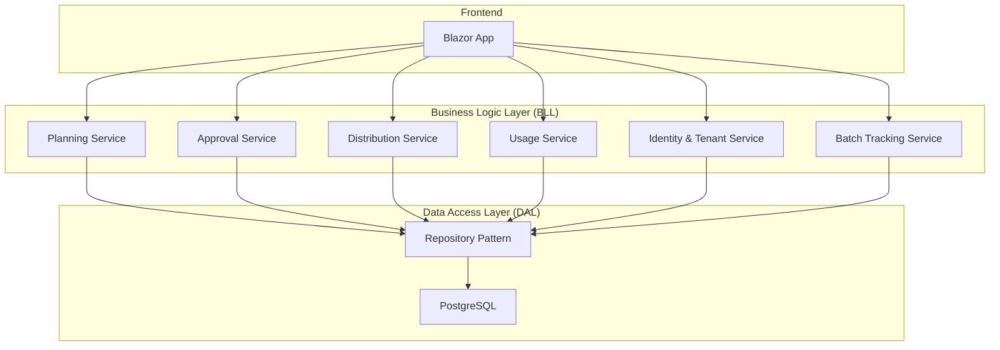
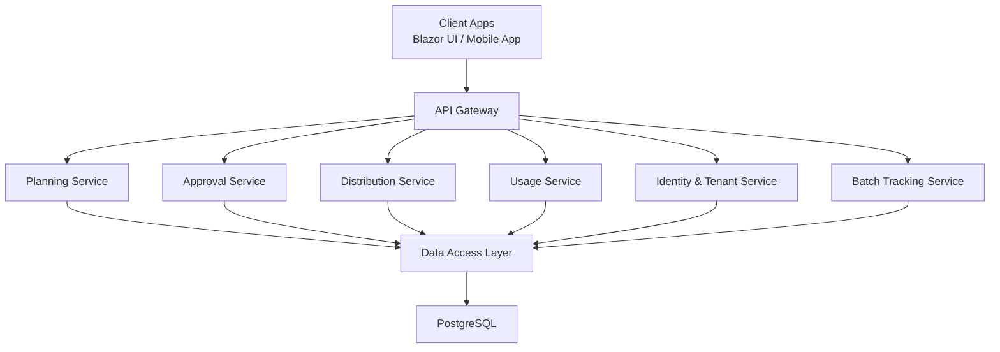
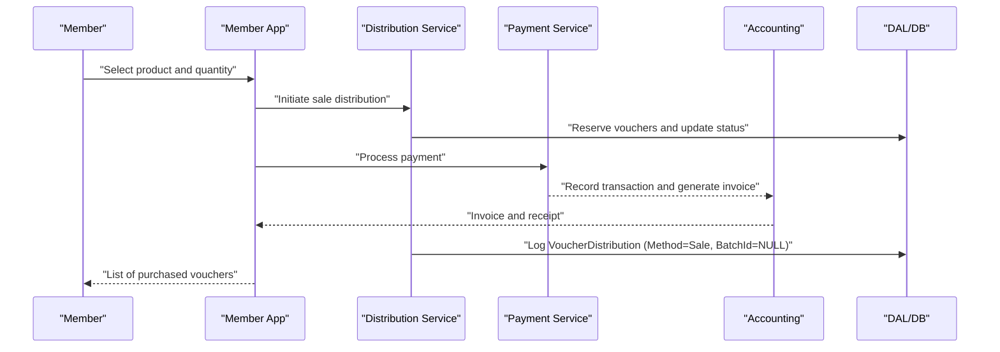
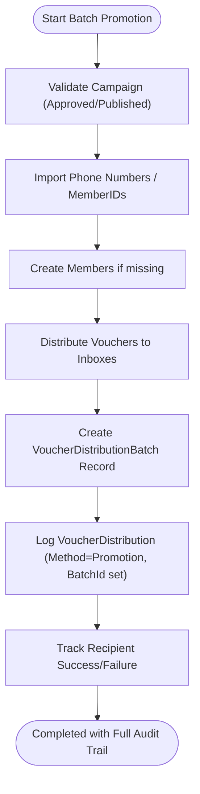
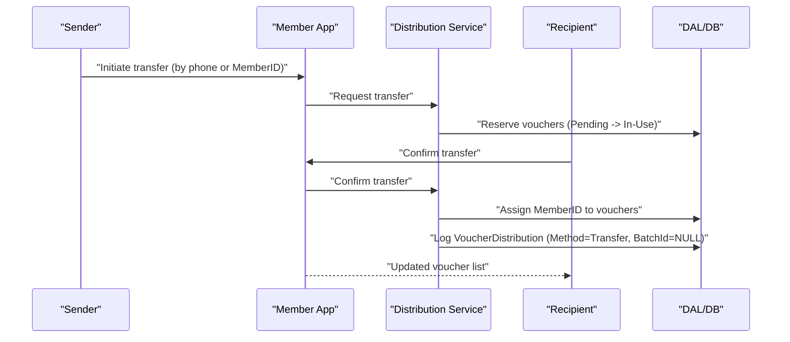
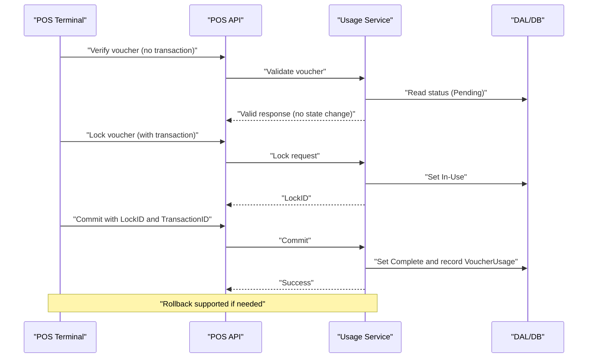
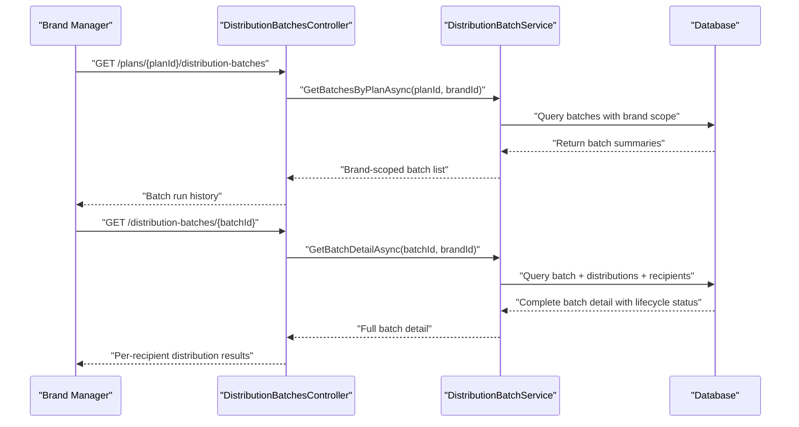
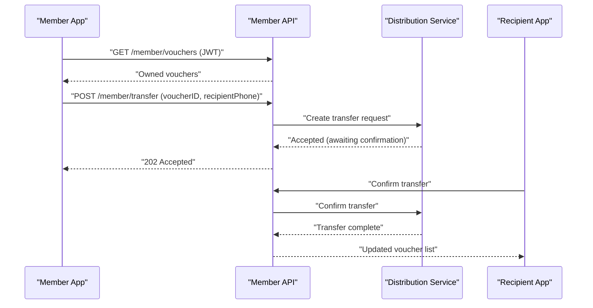
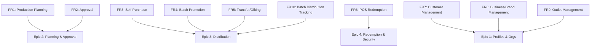

# Multi-Channel Distribution System

<cite>
**Referenced Files in This Document**
- [BMAD_STRUCTURE.md](file://BMAD_STRUCTURE.md)
- [Key Functionalities.txt](file://Key Functionalities.txt)
- [description.txt](file://description.txt)
- [architecture.md](file://docs/architecture.md)
- [data-models.md](file://docs/data-models.md)
- [api-contracts.md](file://docs/api-contracts.md)
- [epics.md](file://_bmad-output/planning-artifacts/epics.md)
- [ux-design-specification.md](file://_bmad-output/planning-artifacts/ux-design-specification.md)
- [implementation-readiness-report-2026-04-17.md](file://_bmad-output/planning-artifacts/implementation-readiness-report-2026-04-17.md)
- [config.yaml](file://_bmad/bmm/config.yaml)
- [core_config.yaml](file://_bmad/core/config.yaml)
- [VoucherDistributionBatch.cs](file://src/NonCash.Core/Entities/VoucherDistributionBatch.cs)
- [VoucherDistribution.cs](file://src/NonCash.Core/Entities/VoucherDistribution.cs)
- [IDistributionBatchService.cs](file://src/NonCash.Core/Interfaces/IDistributionBatchService.cs)
- [DistributionBatchService.cs](file://src/NonCash.Core/Services/DistributionBatchService.cs)
- [DistributionBatchesController.cs](file://src/NonCash.API/Controllers/DistributionBatchesController.cs)
- [20260905085731_AddVoucherDistributionBatches.cs](file://src/NonCash.Infrastructure/Migrations/20260905085731_AddVoucherDistributionBatches.cs)
- [VoucherDistributionBatchConfiguration.cs](file://src/NonCash.Infrastructure/Data/Configurations/VoucherDistributionBatchConfiguration.cs)
- [DistributionReport.razor](file://src/NonCash.Web/Components/Pages/BrandManager/DistributionReport.razor)
- [DistributionBatchHistory.razor](file://src/NonCash.Web/Components/Shared/DistributionBatchHistory.razor)
- [session-log-2026-09-05.md](file://_bmad-output/session-log-2026-09-05.md)
</cite>

## Update Summary
**Changes Made**
- Added comprehensive distribution batch tracking system documentation via VoucherDistributionBatch entity
- Updated promotion channel section with batch distribution workflows and traceability features
- Added new API endpoints for batch distribution management (DistributionBatchesController)
- Enhanced brand-scoped queries documentation for distribution history review
- Added voucher lifecycle status derivation and per-recipient details functionality
- Updated database schema documentation with new batch tracking tables and relationships

## Table of Contents
1. [Introduction](#introduction)
2. [Project Structure](#project-structure)
3. [Core Components](#core-components)
4. [Architecture Overview](#architecture-overview)
5. [Detailed Component Analysis](#detailed-component-analysis)
6. [Dependency Analysis](#dependency-analysis)
7. [Performance Considerations](#performance-considerations)
8. [Troubleshooting Guide](#troubleshooting-guide)
9. [Conclusion](#conclusion)
10. [Appendices](#appendices)

## Introduction
This document describes the multi-channel distribution system for a SaaS voucher platform. It covers both sale/purchase and promotion channels, including customer registration and account management, payment processing, invoice generation, promotion mechanisms for batch distribution and member inbox management, gift/transfer workflows, payment management for voucher sales, order management for production tracking, POS redemption security, and restrictions on payment within transfer/gifting transactions. The system now includes comprehensive distribution batch tracking providing full traceability of voucher distribution runs with brand-scoped queries for reviewing distribution history including per-recipient details and voucher lifecycle status derivation.

## Project Structure
The project is organized around a three-layer SaaS architecture with modular planning and documentation artifacts. The distribution system spans planning, approval, distribution, usage, identity, and POS integration domains with enhanced batch tracking capabilities.

```mermaid
graph TB
subgraph "Frontend"
UI["Blazor App"]
end
subgraph "Business Logic Layer (BLL)"
Planning["Planning Service"]
Approval["Approval Service"]
Distribution["Distribution Service"]
Usage["Usage Service"]
Identity["Identity & Tenant Service"]
BatchTracking["Batch Tracking Service"]
end
subgraph "Data Access Layer (DAL)"
Repo["Repository Pattern"]
DB["PostgreSQL"]
end
UI --> Planning
UI --> Approval
UI --> Distribution
UI --> Usage
UI --> Identity
UI --> BatchTracking
Planning --> Repo
Approval --> Repo
Distribution --> Repo
Usage --> Repo
Identity --> Repo
BatchTracking --> Repo
Repo --> DB
```

**Diagram sources**
- [architecture.md: 9-35:9-35](file://docs/architecture.md#L9-L35)
- [data-models.md: 1-98:1-98](file://docs/data-models.md#L1-L98)

**Section sources**
- [architecture.md: 5-52:5-52](file://docs/architecture.md#L5-L52)
- [description.txt: 16-31:16-31](file://description.txt#L16-L31)
- [BMAD_STRUCTURE.md: 37-82:37-82](file://BMAD_STRUCTURE.md#L37-L82)

## Core Components
- Planning Service: Creates and manages voucher production plans, budgets, and targets.
- Approval Service: Routes and manages plan approvals with a single-level review.
- Distribution Service: Handles sale, promotion, and transfer distributions; logs to VoucherDistribution.
- Usage Service: Orchestrates POS redemption with lock/commit/rollback semantics.
- Identity & Tenant Service: Manages multi-tenancy (Brand/Outlet), user accounts, and customer profiles.
- **Batch Tracking Service**: Provides comprehensive distribution batch tracking with brand-scoped queries and voucher lifecycle status derivation.
- Data Models: VoucherPlanHeader/Detail, VoucherUsage, VoucherDistribution, VoucherDistributionBatch, Brand, Outlet, UserAccount, Customer.

**Section sources**
- [architecture.md: 17-26:17-26](file://docs/architecture.md#L17-L26)
- [data-models.md: 9-98:9-98](file://docs/data-models.md#L9-L98)
- [BMAD_STRUCTURE.md: 17-36:17-36](file://BMAD_STRUCTURE.md#L17-L36)

## Architecture Overview
The system is a SaaS platform with:
- GUI built with Blazor for business admins and marketing staff.
- Microservices in the BLL for planning, approval, distribution, usage, identity, and batch tracking.
- PostgreSQL-backed DAL with repository pattern and transactional integrity for POS usage.
- Security via API keys and JWT tokens; dynamic security for voucher codes.
- **Enhanced batch tracking with brand-scoped access control and comprehensive audit trails.**

```mermaid
graph TB
Client["Client Apps<br/>Blazor UI / Mobile App"] --> APIGW["API Gateway"]
APIGW --> PlanningSvc["Planning Service"]
APIGW --> ApprovalSvc["Approval Service"]
APIGW --> DistSvc["Distribution Service"]
APIGW --> UsageSvc["Usage Service"]
APIGW --> IdentitySvc["Identity & Tenant Service"]
APIGW --> BatchSvc["Batch Tracking Service"]
PlanningSvc --> DAL["Data Access Layer"]
ApprovalSvc --> DAL
DistSvc --> DAL
UsageSvc --> DAL
IdentitySvc --> DAL
BatchSvc --> DAL
DAL --> PG["PostgreSQL"]
```

**Diagram sources**
- [architecture.md: 9-35:9-35](file://docs/architecture.md#L9-L35)
- [api-contracts.md: 5-8:5-8](file://docs/api-contracts.md#L5-L8)

**Section sources**
- [architecture.md: 36-52:36-52](file://docs/architecture.md#L36-L52)
- [description.txt: 11-25:11-25](file://description.txt#L11-L25)

## Detailed Component Analysis

### Direct Sale Channel (Self-Purchase)
The sale channel enables members (customers or organizations) to purchase vouchers directly, with optional payment processing and invoice generation recorded in the system.

- Customer Registration and Account Management:
  - Customer records include phone number, full name, email, and status.
  - Members are identified by a unique MemberID and can own vouchers.
- Payment Processing:
  - Payment management supports processing payments for voucher sales, recording transaction details, and generating invoices and receipts.
- Invoice Generation:
  - Invoices and receipts are generated upon successful payment completion.
- Order Management:
  - Orders are created for voucher production, assigned to production plans, and tracked; each transaction logs to VoucherUsage and updates Plan Detail.
- **Batch Tracking Integration**: Single-voucher flows (sale, transfer) do NOT create batch rows, maintaining clear separation between individual transactions and bulk operations.

```mermaid
sequenceDiagram
participant Member as "Member"
participant App as "Member App"
participant Dist as "Distribution Service"
participant Pay as "Payment Service"
participant Acc as "Accounting"
participant DB as "DAL/DB"
Member->>App : "Select product and quantity"
App->>Dist : "Initiate sale distribution"
Dist->>DB : "Reserve vouchers and update status"
App->>Pay : "Process payment"
Pay-->>Acc : "Record transaction and generate invoice"
Acc-->>App : "Invoice and receipt"
Dist->>DB : "Log VoucherDistribution (Method=Sale, BatchId=NULL)"
App-->>Member : "List of purchased vouchers"
```

**Diagram sources**
- [Key Functionalities.txt: 87-111:87-111](file://Key Functionalities.txt#L87-L111)
- [Key Functionalities.txt: 148-156:148-156](file://Key Functionalities.txt#L148-L156)
- [data-models.md: 55-62:55-62](file://docs/data-models.md#L55-L62)

**Section sources**
- [Key Functionalities.txt: 87-111:87-111](file://Key Functionalities.txt#L87-L111)
- [Key Functionalities.txt: 148-156:148-156](file://Key Functionalities.txt#L148-L156)
- [data-models.md: 91-98:91-98](file://docs/data-models.md#L91-L98)

### Promotion Channel (Batch Distribution and Member Inbox)
Promotion allows brands to distribute vouchers to members via inbox delivery, including batch promotion workflows for importing phone numbers or MemberIDs with comprehensive tracking and audit capabilities.

- Member Inbox Management:
  - Vouchers are delivered into member inboxes after approval and publication.
  - New members must log in to load their voucher lists from inbox.
- **Enhanced Batch Promotion Workflows**:
  - Import lists of phone numbers; system creates members if needed and sends vouchers to each inbox.
  - Each promotion run creates exactly one batch row for complete traceability.
  - Batch includes recipient count, distributed count, skipped count, and detailed skip reasons.
- **Brand-Scoped Distribution History**:
  - All queries are brand-scoped; cross-brand access returns empty/not-found rather than leaking data.
  - Per-recipient details include voucher lifecycle status derivation (InStock → Distributed → Redeeming → Redeemed → Expired).
- Distribution Logging:
  - Each distribution is logged in VoucherDistribution with Method = Promotion and linked to its batch via BatchId.

```mermaid
flowchart TD
Start(["Start Batch Promotion"]) --> Validate["Validate Campaign (Approved/Published)"]
Validate --> Import["Import Phone Numbers / MemberIDs"]
Import --> CreateMembers["Create Members if missing"]
CreateMembers --> Distribute["Distribute Vouchers to Inboxes"]
Distribute --> CreateBatch["Create VoucherDistributionBatch Record"]
CreateBatch --> Log["Log VoucherDistribution (Method=Promotion, BatchId set)"]
Log --> Track["Track Recipient Success/Failure"]
Track --> End(["Completed with Full Audit Trail"])
```

**Diagram sources**
- [epics.md: 205-217:205-217](file://_bmad-output/planning-artifacts/epics.md#L205-L217)
- [Key Functionalities.txt: 118-124:118-124](file://Key Functionalities.txt#L118-L124)
- [data-models.md: 55-62:55-62](file://docs/data-models.md#L55-L62)

**Section sources**
- [epics.md: 205-217:205-217](file://_bmad-output/planning-artifacts/epics.md#L205-L217)
- [Key Functionalities.txt: 118-124:118-124](file://Key Functionalities.txt#L118-L124)
- [data-models.md: 55-62:55-62](file://docs/data-models.md#L55-L62)

### Gifting and Transfer Functionality
Transfer allows voucher ownership to be transferred between individuals and organizations via phone numbers or MemberIDs. Transfers require two-way confirmation and disallow payment within transfer/gifting transactions.

- Two-Way Confirmation:
  - Initiator requests transfer; recipient must confirm.
- Ownership Transfer:
  - Transferred vouchers map to the recipient's MemberID and are logged in VoucherDistribution with Method = Transfer.
- **Batch Tracking Integration**: Single-voucher flows (sale, transfer) do NOT create batch rows, maintaining clear separation between individual transactions and bulk operations.
- Payment Restriction:
  - The platform does not permit payment within transfer/gifting transactions.

```mermaid
sequenceDiagram
participant Sender as "Sender"
participant App as "Member App"
participant Dist as "Distribution Service"
participant Recipient as "Recipient"
participant DB as "DAL/DB"
Sender->>App : "Initiate transfer (by phone or MemberID)"
App->>Dist : "Request transfer"
Dist->>DB : "Reserve vouchers (Pending -> In-Use)"
Recipient->>App : "Confirm transfer"
App->>Dist : "Confirm transfer"
Dist->>DB : "Assign MemberID to vouchers"
Dist->>DB : "Log VoucherDistribution (Method=Transfer, BatchId=NULL)"
App-->>Recipient : "Updated voucher list"
```

**Diagram sources**
- [epics.md: 231-243:231-243](file://_bmad-output/planning-artifacts/epics.md#L231-L243)
- [Key Functionalities.txt: 127-134:127-134](file://Key Functionalities.txt#L127-L134)
- [data-models.md: 55-62:55-62](file://docs/data-models.md#L55-L62)

**Section sources**
- [epics.md: 231-243:231-243](file://_bmad-output/planning-artifacts/epics.md#L231-L243)
- [Key Functionalities.txt: 127-134:127-134](file://Key Functionalities.txt#L127-L134)
- [data-models.md: 55-62:55-62](file://docs/data-models.md#L55-L62)

### POS Redemption and Security
POS redemption follows a strict workflow to ensure transaction integrity and prevent double-spending.

- Verify Voucher:
  - POS queries backend to check validity without changing status.
- Lock Voucher:
  - On successful verification with a transaction context, the voucher is locked to prevent reuse.
- Redeem Voucher (Commit):
  - After successful transaction, POS commits to finalize usage.
- Rollback Lock:
  - If the transaction fails, the lock is released.

```mermaid
sequenceDiagram
participant POS as "POS Terminal"
participant API as "POS API"
participant SVC as "Usage Service"
participant DB as "DAL/DB"
POS->>API : "Verify voucher (no transaction)"
API->>SVC : "Validate voucher"
SVC->>DB : "Read status (Pending)"
SVC-->>API : "Valid response (no state change)"
POS->>API : "Lock voucher (with transaction)"
API->>SVC : "Lock request"
SVC->>DB : "Set In-Use"
SVC-->>API : "LockID"
POS->>API : "Commit with LockID and TransactionID"
API->>SVC : "Commit"
SVC->>DB : "Set Complete and record VoucherUsage"
SVC-->>API : "Success"
Note over POS,SVC : "Rollback supported if needed"
```

**Diagram sources**
- [api-contracts.md: 14-87:14-87](file://docs/api-contracts.md#L14-L87)
- [epics.md: 265-303:265-303](file://_bmad-output/planning-artifacts/epics.md#L265-L303)
- [data-models.md: 46-54:46-54](file://docs/data-models.md#L46-L54)

**Section sources**
- [api-contracts.md: 14-87:14-87](file://docs/api-contracts.md#L14-L87)
- [epics.md: 265-303:265-303](file://_bmad-output/planning-artifacts/epics.md#L265-L303)
- [data-models.md: 46-54:46-54](file://docs/data-models.md#L46-L54)

### Distribution Batch Tracking System
**New Feature** The system now includes comprehensive distribution batch tracking providing full traceability of voucher distribution runs with brand-scoped queries for reviewing distribution history.

- **Batch Entity Structure**:
  - VoucherDistributionBatch tracks plan execution with PlanId, BrandId, CreatedById, NotifyChannel, RecipientCount, DistributedCount, SkippedCount, and SkippedRecords.
  - Each promotion run creates exactly one batch row for complete audit trail.
  - Individual voucher rows link back via VoucherDistribution.BatchId.
- **Brand-Scoped Queries**:
  - All queries are brand-scoped; cross-brand access returns empty/not-found rather than leaking data.
  - Brand managers can review results of each batch distribute run and full lifecycle of every voucher received.
- **Voucher Lifecycle Status Derivation**:
  - Status derived dynamically: InStock (unassigned) → Distributed → Redeeming (POS-locked) → Redeemed → Expired (past plan expiry).
  - No stored status field; calculated from UsageStatus and plan expiry date.
- **Per-Recipient Details**:
  - Batch detail includes skipped recipients with phone/email token and reason.
  - Delivered recipients show voucher serial number, recipient info, method, distribution date, and usage date.

```mermaid
sequenceDiagram
participant BrandMgr as "Brand Manager"
participant API as "DistributionBatchesController"
participant Service as "DistributionBatchService"
participant DB as "Database"
BrandMgr->>API : "GET /plans/{planId}/distribution-batches"
API->>Service : "GetBatchesByPlanAsync(planId, brandId)"
Service->>DB : "Query batches with brand scope"
DB-->>Service : "Return batch summaries"
Service-->>API : "Brand-scoped batch list"
API-->>BrandMgr : "Batch run history"
BrandMgr->>API : "GET /distribution-batches/{batchId}"
API->>Service : "GetBatchDetailAsync(batchId, brandId)"
Service->>DB : "Query batch + distributions + recipients"
DB-->>Service : "Complete batch detail with lifecycle status"
Service-->>API : "Full batch detail"
API-->>BrandMgr : "Per-recipient distribution results"
```

**Diagram sources**
- [DistributionBatchesController.cs: 24-47:24-47](file://src/NonCash.API/Controllers/DistributionBatchesController.cs#L24-L47)
- [DistributionBatchService.cs: 37-103:37-103](file://src/NonCash.Core/Services/DistributionBatchService.cs#L37-L103)
- [VoucherDistributionBatch.cs: 11-37:11-37](file://src/NonCash.Core/Entities/VoucherDistributionBatch.cs#L11-L37)

**Section sources**
- [VoucherDistributionBatch.cs: 11-37:11-37](file://src/NonCash.Core/Entities/VoucherDistributionBatch.cs#L11-L37)
- [IDistributionBatchService.cs: 13-29:13-29](file://src/NonCash.Core/Interfaces/IDistributionBatchService.cs#L13-L29)
- [DistributionBatchService.cs: 37-103:37-103](file://src/NonCash.Core/Services/DistributionBatchService.cs#L37-L103)
- [20260905085731_AddVoucherDistributionBatches.cs: 21-55:21-55](file://src/NonCash.Infrastructure/Migrations/20260905085731_AddVoucherDistributionBatches.cs#L21-L55)

### Member App API Integration
The member app integrates with the platform to manage personal voucher holdings and initiate transfers.

- List My Vouchers:
  - Retrieves owned vouchers using a JWT-protected endpoint.
- Transfer Voucher:
  - Initiates a transfer to another member via phone number; requires recipient confirmation.

```mermaid
sequenceDiagram
participant App as "Member App"
participant API as "Member API"
participant Dist as "Distribution Service"
participant Recipient as "Recipient App"
App->>API : "GET /member/vouchers (JWT)"
API-->>App : "Owned vouchers"
App->>API : "POST /member/transfer (voucherID, recipientPhone)"
API->>Dist : "Create transfer request"
Dist-->>API : "Accepted (awaiting confirmation)"
API-->>App : "202 Accepted"
Recipient->>API : "Confirm transfer"
API->>Dist : "Confirm transfer"
Dist-->>API : "Transfer complete"
API-->>Recipient : "Updated voucher list"
```

**Diagram sources**
- [api-contracts.md: 89-109:89-109](file://docs/api-contracts.md#L89-L109)
- [epics.md: 231-243:231-243](file://_bmad-output/planning-artifacts/epics.md#L231-L243)

**Section sources**
- [api-contracts.md: 89-109:89-109](file://docs/api-contracts.md#L89-L109)

## Dependency Analysis
The system's functional coverage is validated across nine requirements, with all features covered by epics and stories. The distribution system depends on planning, approval, identity, POS services, and the new batch tracking service for end-to-end operation.

```mermaid
graph TB
FR1["FR1: Production Planning"] --> Epic2["Epic 2: Planning & Approval"]
FR2["FR2: Approval"] --> Epic2
FR3["FR3: Self-Purchase"] --> Epic3["Epic 3: Distribution"]
FR4["FR4: Batch Promotion"] --> Epic3
FR5["FR5: Transfer/Gifting"] --> Epic3
FR6["FR6: POS Redemption"] --> Epic4["Epic 4: Redemption & Security"]
FR7["FR7: Customer Management"] --> Epic1["Epic 1: Profiles & Orgs"]
FR8["FR8: Business/Brand Management"] --> Epic1
FR9["FR9: Outlet Management"] --> Epic1
FR10["FR10: Batch Distribution Tracking"] --> Epic3
```

**Diagram sources**
- [implementation-readiness-report-2026-04-17.md: 53-89:53-89](file://_bmad-output/planning-artifacts/implementation-readiness-report-2026-04-17.md#L53-L89)

**Section sources**
- [implementation-readiness-report-2026-04-17.md: 53-89:53-89](file://_bmad-output/planning-artifacts/implementation-readiness-report-2026-04-17.md#L53-L89)

## Performance Considerations
- Use PostgreSQL for transactional integrity, especially for POS usage and distribution logging.
- Employ repository pattern and dependency injection to decouple DAL from BLL for scalability.
- Implement microservices to enable independent scaling of planning, distribution, and usage services.
- Optimize POS API calls with minimal payload and caching of static voucher metadata where appropriate.
- Ensure proper indexing on MemberID, VoucherCode, and transaction identifiers to reduce latency.
- **Batch Query Optimization**: Brand-scoped queries use efficient filtering and avoid cross-brand data leakage through proper WHERE clauses and foreign key constraints.
- **JSON Storage**: SkippedRecords stored as JSONB for flexible error tracking without schema changes.

## Troubleshooting Guide
Common issues and resolutions:
- Voucher Double-Spending Prevention:
  - Ensure lock/commit/rollback sequences are followed; revert to rollback if POS transaction fails.
- Transfer Confirmation Failures:
  - Verify recipient confirmation flow and that MemberIDs are correctly mapped.
- Batch Promotion Errors:
  - Validate campaign status (approved/published) and import list formatting.
- Payment in Transfer/Gifting:
  - Enforce policy to disallow payment within transfer/gifting; log attempts for audit.
- **Batch Tracking Issues**:
  - Verify brand-scoped access control; cross-brand queries return empty results intentionally.
  - Check batch creation timing - only promotion runs create batch rows, not individual sales/transfers.
  - Review skipped records for failed recipient validation (invalid phone, blacklisted, brand-blocked).

**Section sources**
- [epics.md: 278-303:278-303](file://_bmad-output/planning-artifacts/epics.md#L278-L303)
- [Key Functionalities.txt: 127-134:127-134](file://Key Functionalities.txt#L127-L134)

## Conclusion
The multi-channel distribution system integrates planning, approval, sale/purchase, promotion, and transfer channels with robust POS redemption and security controls. The enhanced batch tracking system provides comprehensive audit trails for promotion runs with brand-scoped queries, per-recipient details, and voucher lifecycle status derivation. The modular architecture, clear data models, and documented API contracts provide a solid foundation for building and extending the platform while maintaining compliance and operational integrity.

## Appendices

### Practical Examples and Integration Points
- Example: Self-Purchase B2C/B2B
  - Member selects product, completes payment, receives invoice, and vouchers appear in "My Vouchers."
  - Integration points: Member App API, Payment Service, Distribution Service, Accounting.
- Example: Batch Promotion
  - Brand imports phone numbers; system creates members and distributes vouchers to inboxes.
  - **Enhanced**: Each run creates a batch record with full audit trail including success/failure tracking.
  - Integration points: Distribution Service, Identity Service, Member App, Batch Tracking Service.
- Example: Transfer/Gifting
  - Sender initiates transfer; recipient confirms; ownership updates in Member App.
  - Integration points: Member App API, Distribution Service, Identity Service.
- **Example: Batch Distribution Review**
  - Brand manager views distribution run history with per-recipient details and voucher lifecycle status.
  - Integration points: DistributionBatchesController, DistributionBatchService, Brand Manager UI.

**Section sources**
- [epics.md: 218-243:218-243](file://_bmad-output/planning-artifacts/epics.md#L218-L243)
- [api-contracts.md: 89-109:89-109](file://docs/api-contracts.md#L89-L109)

### Database Schema Updates
The distribution batch tracking system introduces the following database changes:

- **New Table**: `voucher_distribution_batches`
  - Tracks each promotion run with plan association, brand scoping, and execution metrics
  - Includes JSONB column for skipped recipient details with reason codes
- **Enhanced Table**: `voucher_distributions`
  - Added `batch_id` column linking distributions to their parent batch
  - Foreign key constraint ensures referential integrity
- **Indexes**: Optimized for brand-scoped queries and batch lookups

**Section sources**
- [20260905085731_AddVoucherDistributionBatches.cs: 21-55:21-55](file://src/NonCash.Infrastructure/Migrations/20260905085731_AddVoucherDistributionBatches.cs#L21-L55)
- [VoucherDistributionBatchConfiguration.cs: 10-24:10-24](file://src/NonCash.Infrastructure/Data/Configurations/VoucherDistributionBatchConfiguration.cs#L10-L24)

### API Endpoints for Batch Distribution Management
**New Endpoints**:
- `GET api/v1/plans/{planId}/distribution-batches` - Lists all batch runs for a plan (brand-scoped)
- `GET api/v1/distribution-batches/{batchId}` - Gets detailed information about a specific batch run

**Security**: Requires BrandManager or Admin role with brand context validation.

**Section sources**
- [DistributionBatchesController.cs: 24-47:24-47](file://src/NonCash.API/Controllers/DistributionBatchesController.cs#L24-L47)
- [IDistributionBatchService.cs: 15-28:15-28](file://src/NonCash.Core/Interfaces/IDistributionBatchService.cs#L15-L28)