# POS Redemption and Security Mechanisms

<cite>
**Referenced Files in This Document**
- [Key Functionalities.txt](file://Key%20Functionalities.txt)
- [description.txt](file://description.txt)
- [docs/index.md](file://docs/index.md)
- [docs/architecture.md](file://docs/architecture.md)
- [docs/data-models.md](file://docs/data-models.md)
- [docs/api-contracts.md](file://docs/api-contracts.md)
- [_bmad-output/implementation-artifacts/4-1-check-for-information.md](file://_bmad-output/implementation-artifacts/4-1-check-for-information.md)
- [_bmad-output/implementation-artifacts/4-2-prepare-and-lock.md](file://_bmad-output/implementation-artifacts/4-2-prepare-and-lock.md)
- [_bmad-output/implementation-artifacts/4-3-commit-and-log.md](file://_bmad-output/implementation-artifacts/4-3-commit-and-log.md)
- [_bmad-output/implementation-artifacts/4-4-rollback-mechanism.md](file://_bmad-output/implementation-artifacts/4-4-rollback-mechanism.md)
- [_bmad-output/planning-artifacts/epics.md](file://_bmad-output/planning-artifacts/epics.md)
</cite>

## Table of Contents
1. [Introduction](#introduction)
2. [Project Structure](#project-structure)
3. [Core Components](#core-components)
4. [Architecture Overview](#architecture-overview)
5. [Detailed Component Analysis](#detailed-component-analysis)
6. [Dependency Analysis](#dependency-analysis)
7. [Performance Considerations](#performance-considerations)
8. [Troubleshooting Guide](#troubleshooting-guide)
9. [Conclusion](#conclusion)
10. [Appendices](#appendices)

## Introduction
This document explains the POS redemption system and its security mechanisms. It covers the complete transaction lifecycle: voucher verification, locking to prevent double spending, and the three-phase approval-like workflow (verification, pre-commit lock, final commit). It also documents transaction management using Begin/Commit/Rollback semantics to ensure data integrity, dynamic code generation for security, and the POS operator workflow from voucher scanning to final transaction completion. Error handling, rollback scenarios, and security breach prevention are addressed alongside the technical implementation of transaction state management and POS integration points.

## Project Structure
The repository organizes the POS redemption domain across:
- Business requirement and workflow documentation
- Technical architecture and data models
- API contracts for POS integration
- Implementation and planning artifacts detailing the three-phase POS flow and security controls

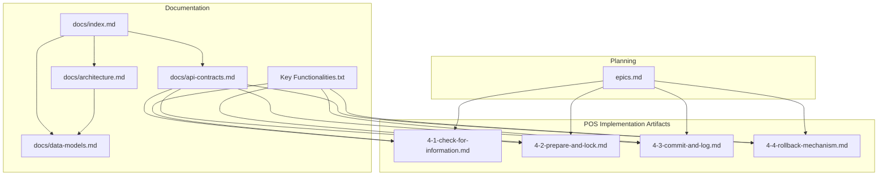

**Diagram sources**
- [docs/index.md:1-41](file://docs/index.md#L1-L41)
- [docs/architecture.md:1-52](file://docs/architecture.md#L1-L52)
- [docs/data-models.md:1-98](file://docs/data-models.md#L1-L98)
- [docs/api-contracts.md:1-109](file://docs/api-contracts.md#L1-L109)
- [Key Functionalities.txt:135-147](file://Key%20Functionalities.txt#L135-L147)
- [_bmad-output/implementation-artifacts/4-1-check-for-information.md:1-116](file://_bmad-output/implementation-artifacts/4-1-check-for-information.md#L1-L116)
- [_bmad-output/implementation-artifacts/4-2-prepare-and-lock.md:1-115](file://_bmad-output/implementation-artifacts/4-2-prepare-and-lock.md#L1-L115)
- [_bmad-output/implementation-artifacts/4-3-commit-and-log.md:1-116](file://_bmad-output/implementation-artifacts/4-3-commit-and-log.md#L1-L116)
- [_bmad-output/implementation-artifacts/4-4-rollback-mechanism.md:1-112](file://_bmad-output/implementation-artifacts/4-4-rollback-mechanism.md#L1-L112)
- [_bmad-output/planning-artifacts/epics.md:271-319](file://_bmad-output/planning-artifacts/epics.md#L271-L319)

**Section sources**
- [docs/index.md:12-32](file://docs/index.md#L12-L32)
- [description.txt:16-31](file://description.txt#L16-L31)

## Core Components
- POS Verification: Stateless read-only check returning face value and validity without changing state.
- Lock (Pre-commit): Atomic state transition to In-Use with a LockID token; prevents double spending and supports idempotency.
- Commit (Finalization): Atomic permanent state change to Complete; logs usage record; invalidates LockID.
- Rollback: Atomic reversal from In-Use back to Pending; clears lock fields; no usage record created.
- Transaction Integrity: All three operations are guarded by database transactions and strict validation to ensure atomicity and consistency.
- Security Controls: API Key authentication for POS endpoints, dynamic code validation for voucher authenticity, and multi-tenancy enforcement.

**Section sources**
- [docs/api-contracts.md:14-87](file://docs/api-contracts.md#L14-L87)
- [_bmad-output/implementation-artifacts/4-1-check-for-information.md:13-43](file://_bmad-output/implementation-artifacts/4-1-check-for-information.md#L13-L43)
- [_bmad-output/implementation-artifacts/4-2-prepare-and-lock.md:13-46](file://_bmad-output/implementation-artifacts/4-2-prepare-and-lock.md#L13-L46)
- [_bmad-output/implementation-artifacts/4-3-commit-and-log.md:13-50](file://_bmad-output/implementation-artifacts/4-3-commit-and-log.md#L13-L50)
- [_bmad-output/implementation-artifacts/4-4-rollback-mechanism.md:13-52](file://_bmad-output/implementation-artifacts/4-4-rollback-mechanism.md#L13-L52)
- [docs/architecture.md:36-41](file://docs/architecture.md#L36-L41)

## Architecture Overview
The POS redemption flow integrates with the 3-layer SaaS architecture:
- Frontend (Blazor) for admin and marketing tasks
- Business Logic Layer (microservices) orchestrating POS workflows
- Data Access Layer (PostgreSQL via Entity Framework) enforcing transactional integrity

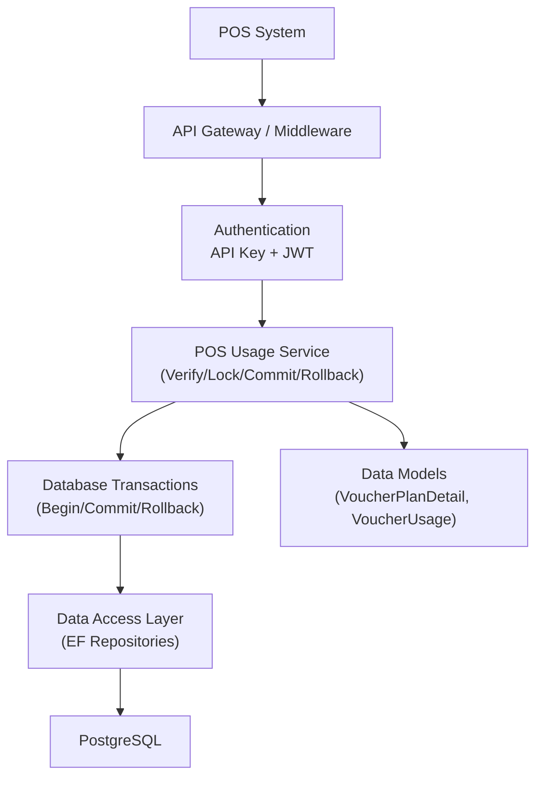

**Diagram sources**
- [docs/architecture.md:5-52](file://docs/architecture.md#L5-L52)
- [docs/data-models.md:9-98](file://docs/data-models.md#L9-L98)
- [docs/api-contracts.md:6-8](file://docs/api-contracts.md#L6-L8)

**Section sources**
- [docs/architecture.md:17-35](file://docs/architecture.md#L17-L35)
- [docs/data-models.md:46-54](file://docs/data-models.md#L46-L54)

## Detailed Component Analysis

### POS Operator Workflow
The POS operator follows a deterministic workflow:
1. Verify: Scan voucher to confirm validity and face value without changing state.
2. Lock: Request a lock with BillNumber to reserve the voucher for the transaction.
3. Apply Payment: Process payment in POS.
4. Commit: Finalize the transaction to mark the voucher as used and log usage.
5. Rollback (if needed): Release the lock if the transaction fails or is canceled.

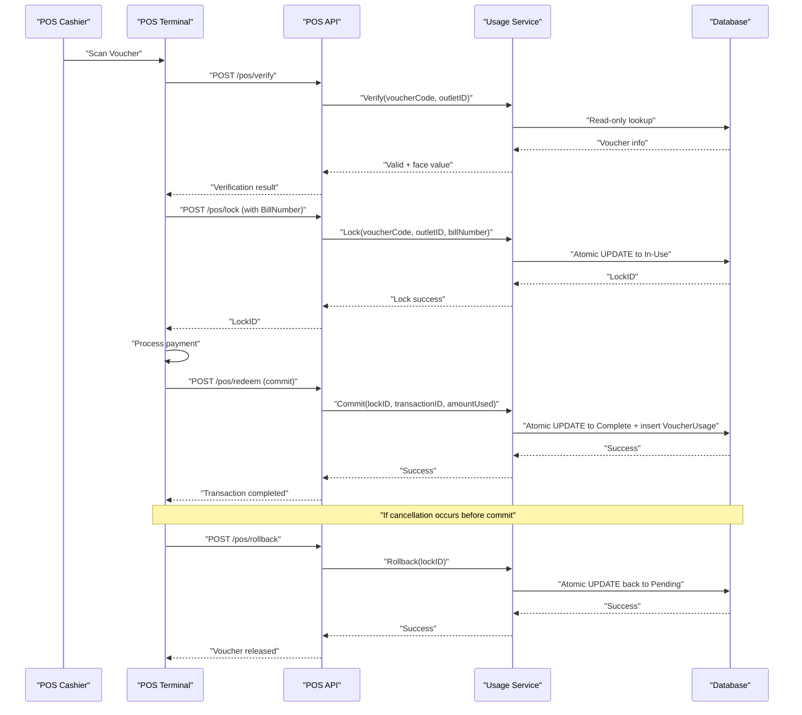

**Diagram sources**
- [docs/api-contracts.md:14-87](file://docs/api-contracts.md#L14-L87)
- [_bmad-output/implementation-artifacts/4-1-check-for-information.md:13-43](file://_bmad-output/implementation-artifacts/4-1-check-for-information.md#L13-L43)
- [_bmad-output/implementation-artifacts/4-2-prepare-and-lock.md:13-46](file://_bmad-output/implementation-artifacts/4-2-prepare-and-lock.md#L13-L46)
- [_bmad-output/implementation-artifacts/4-3-commit-and-log.md:13-50](file://_bmad-output/implementation-artifacts/4-3-commit-and-log.md#L13-L50)
- [_bmad-output/implementation-artifacts/4-4-rollback-mechanism.md:13-52](file://_bmad-output/implementation-artifacts/4-4-rollback-mechanism.md#L13-L52)

**Section sources**
- [Key Functionalities.txt:135-147](file://Key Functionalities.txt#L135-L147)
- [docs/api-contracts.md:14-87](file://docs/api-contracts.md#L14-L87)

### POS Verification (Phase 1)
Purpose: Stateless read-only check to confirm validity and face value prior to locking.

Key behaviors:
- Validates dynamic voucher code signature and expiry
- Confirms outlet scope and time window constraints
- Returns face value and brand without mutating state
- HTTP 200 for invalid responses to avoid POS error confusion

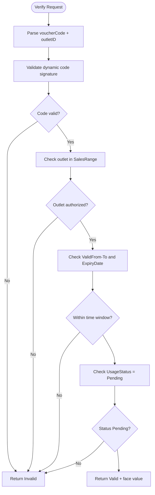

**Diagram sources**
- [_bmad-output/implementation-artifacts/4-1-check-for-information.md:13-43](file://_bmad-output/implementation-artifacts/4-1-check-for-information.md#L13-L43)

**Section sources**
- [_bmad-output/implementation-artifacts/4-1-check-for-information.md:13-43](file://_bmad-output/implementation-artifacts/4-1-check-for-information.md#L13-L43)
- [docs/api-contracts.md:14-34](file://docs/api-contracts.md#L14-L34)

### Lock (Pre-commit) (Phase 2)
Purpose: Reserve a voucher for a specific transaction to prevent double spending.

Key behaviors:
- Atomic UPDATE from Pending to In-Use with LockID generation
- Enforces uniqueness: only one lock per voucher at a time
- Supports idempotency: repeated requests with same (voucher, outlet, billNumber) return the same LockID
- Optional expiry: auto-release after a period if not committed or rolled back

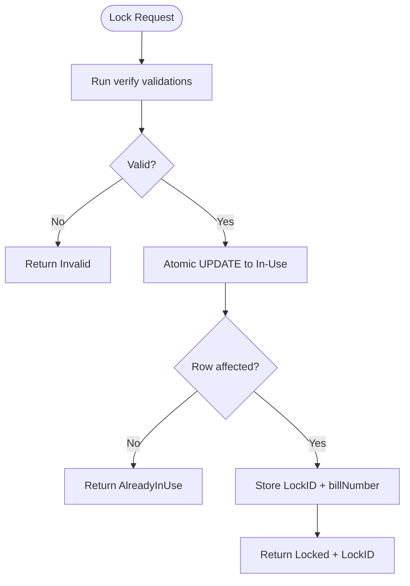

**Diagram sources**
- [_bmad-output/implementation-artifacts/4-2-prepare-and-lock.md:13-46](file://_bmad-output/implementation-artifacts/4-2-prepare-and-lock.md#L13-L46)

**Section sources**
- [_bmad-output/implementation-artifacts/4-2-prepare-and-lock.md:13-46](file://_bmad-output/implementation-artifacts/4-2-prepare-and-lock.md#L13-L46)
- [docs/api-contracts.md:36-52](file://docs/api-contracts.md#L36-L52)

### Commit (Finalization) (Phase 3)
Purpose: Permanently mark the voucher as used and log the transaction.

Key behaviors:
- Validates LockID exists, matches the voucher, and is not expired
- Atomic UPDATE to Complete and clear LockID
- Inserts a VoucherUsage record with POSID, TransactionID, UsageDate, and AmountUsed
- Idempotent: duplicate commits by TransactionID are safe

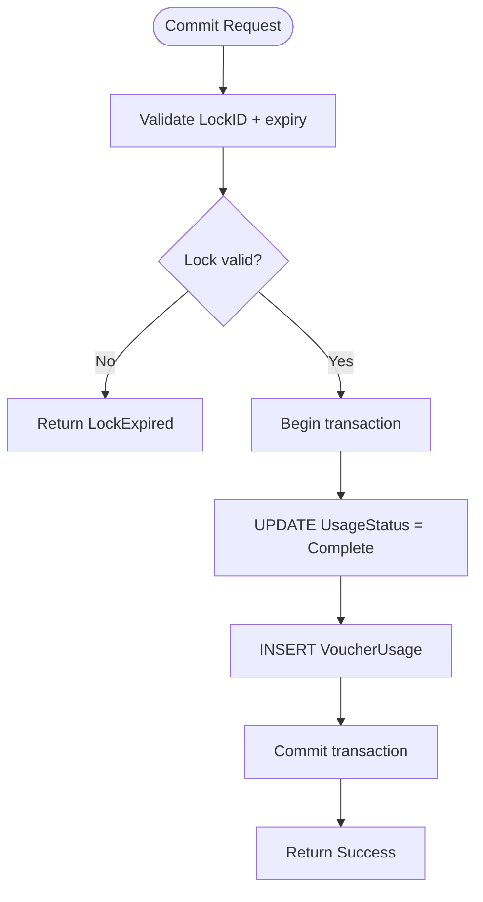

**Diagram sources**
- [_bmad-output/implementation-artifacts/4-3-commit-and-log.md:13-50](file://_bmad-output/implementation-artifacts/4-3-commit-and-log.md#L13-L50)

**Section sources**
- [_bmad-output/implementation-artifacts/4-3-commit-and-log.md:13-50](file://_bmad-output/implementation-artifacts/4-3-commit-and-log.md#L13-L50)
- [docs/api-contracts.md:54-70](file://docs/api-contracts.md#L54-L70)

### Rollback (Compensating Action)
Purpose: Release a reserved voucher if the transaction fails or is canceled.

Key behaviors:
- Validates LockID exists and matches an In-Use voucher
- Atomic UPDATE back to Pending and clears LockID, LockedAt, and BillNumber
- Rejects rollback attempts on already Complete vouchers
- Gracefully handles expired locks (already released)

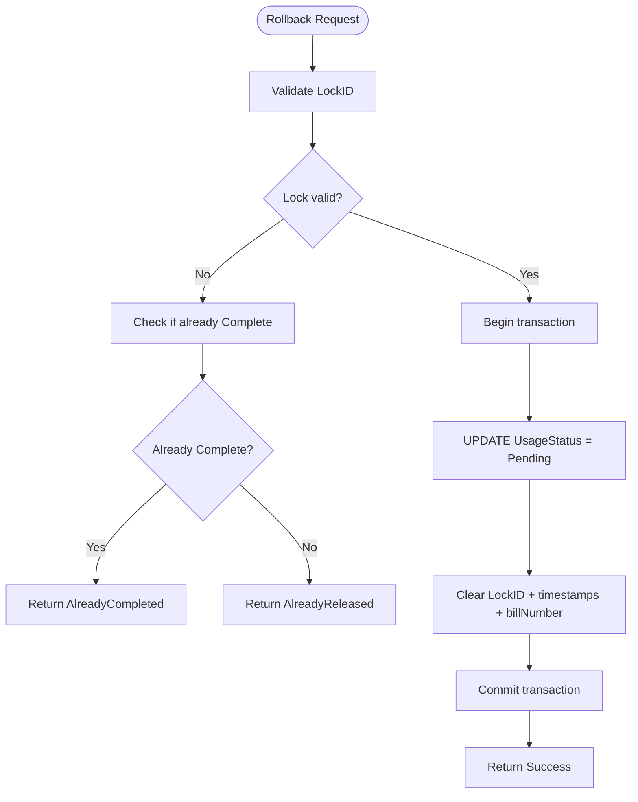

**Diagram sources**
- [_bmad-output/implementation-artifacts/4-4-rollback-mechanism.md:13-52](file://_bmad-output/implementation-artifacts/4-4-rollback-mechanism.md#L13-L52)

**Section sources**
- [_bmad-output/implementation-artifacts/4-4-rollback-mechanism.md:13-52](file://_bmad-output/implementation-artifacts/4-4-rollback-mechanism.md#L13-L52)
- [docs/api-contracts.md:72-87](file://docs/api-contracts.md#L72-L87)

### Transaction State Management
The system enforces strict state transitions and integrity:
- Pending → In-Use (Lock)
- In-Use → Complete (Commit) or In-Use → Pending (Rollback)
- LockID acts as a distributed transaction token for commit/rollback
- All state changes occur inside database transactions to guarantee atomicity

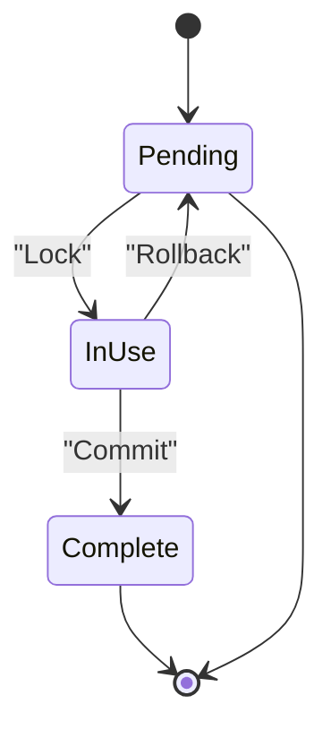

**Diagram sources**
- [_bmad-output/implementation-artifacts/4-2-prepare-and-lock.md:64-67](file://_bmad-output/implementation-artifacts/4-2-prepare-and-lock.md#L64-L67)
- [_bmad-output/implementation-artifacts/4-3-commit-and-log.md:64-68](file://_bmad-output/implementation-artifacts/4-3-commit-and-log.md#L64-L68)
- [_bmad-output/implementation-artifacts/4-4-rollback-mechanism.md:64-68](file://_bmad-output/implementation-artifacts/4-4-rollback-mechanism.md#L64-L68)

**Section sources**
- [_bmad-output/implementation-artifacts/4-2-prepare-and-lock.md:64-67](file://_bmad-output/implementation-artifacts/4-2-prepare-and-lock.md#L64-L67)
- [_bmad-output/implementation-artifacts/4-3-commit-and-log.md:64-68](file://_bmad-output/implementation-artifacts/4-3-commit-and-log.md#L64-L68)
- [_bmad-output/implementation-artifacts/4-4-rollback-mechanism.md:64-68](file://_bmad-output/implementation-artifacts/4-4-rollback-mechanism.md#L64-L68)

### Security Validation Processes
- API Key Authentication: POS endpoints require API Key headers; JWT is used elsewhere in the system.
- Dynamic Code Generation: Voucher codes are dynamic (similar to JWT) to prevent static reuse and copying.
- Multi-tenancy: Outlet scope validation ensures POS systems only operate within their authorized Brand/Outlet ranges.
- Concurrency Control: Atomic conditional updates and row-level locking prevent race conditions during lock acquisition.
- Idempotency: Lock and commit endpoints handle duplicate requests safely to tolerate network retries.

**Section sources**
- [docs/api-contracts.md:7-8](file://docs/api-contracts.md#L7-L8)
- [docs/architecture.md:36-41](file://docs/architecture.md#L36-L41)
- [_bmad-output/implementation-artifacts/4-1-check-for-information.md:92-96](file://_bmad-output/implementation-artifacts/4-1-check-for-information.md#L92-L96)
- [_bmad-output/implementation-artifacts/4-2-prepare-and-lock.md:91-95](file://_bmad-output/implementation-artifacts/4-2-prepare-and-lock.md#L91-L95)
- [_bmad-output/implementation-artifacts/4-3-commit-and-log.md:92-96](file://_bmad-output/implementation-artifacts/4-3-commit-and-log.md#L92-L96)
- [_bmad-output/implementation-artifacts/4-4-rollback-mechanism.md:89-92](file://_bmad-output/implementation-artifacts/4-4-rollback-mechanism.md#L89-L92)

### POS Integration Points
- Verify: GET/POST endpoints for read-only validation
- Lock: POST endpoint to reserve a voucher with LockID
- Redeem (Commit): POST endpoint to finalize usage
- Rollback: POST endpoint to cancel and release reservation

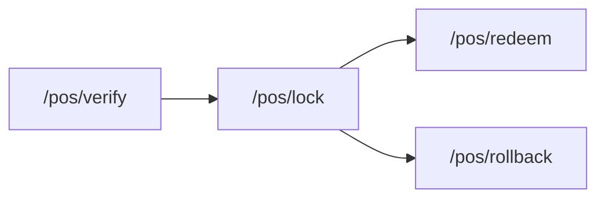

**Diagram sources**
- [docs/api-contracts.md:14-87](file://docs/api-contracts.md#L14-L87)

**Section sources**
- [docs/api-contracts.md:14-87](file://docs/api-contracts.md#L14-L87)

## Dependency Analysis
The POS redemption domain depends on:
- API contracts defining endpoint semantics and payloads
- Data models specifying entities and relationships
- Implementation artifacts detailing acceptance criteria and tasks
- Planning artifacts anchoring acceptance criteria to user stories

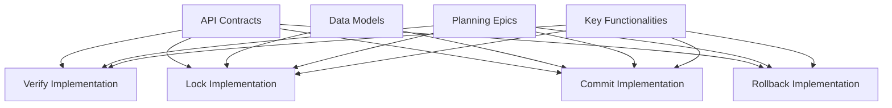

**Diagram sources**
- [docs/api-contracts.md:1-109](file://docs/api-contracts.md#L1-L109)
- [docs/data-models.md:9-98](file://docs/data-models.md#L9-L98)
- [_bmad-output/planning-artifacts/epics.md:271-319](file://_bmad-output/planning-artifacts/epics.md#L271-L319)
- [Key Functionalities.txt:135-147](file://Key Functionalities.txt#L135-L147)

**Section sources**
- [docs/data-models.md:46-54](file://docs/data-models.md#L46-L54)
- [_bmad-output/implementation-artifacts/4-2-prepare-and-lock.md:78-82](file://_bmad-output/implementation-artifacts/4-2-prepare-and-lock.md#L78-L82)
- [_bmad-output/implementation-artifacts/4-3-commit-and-log.md:79-83](file://_bmad-output/implementation-artifacts/4-3-commit-and-log.md#L79-L83)

## Performance Considerations
- Concurrent Locking: Load testing with many parallel lock requests on the same voucher must yield exactly one success and the rest failures or AlreadyInUse.
- Idempotency: Duplicate requests must be handled efficiently without unnecessary database work.
- Lock Expiry: Background cleanup or query-time filtering should promptly release stale locks to free resources.
- Transaction Boundaries: Keep transactions short; perform validation before entering the transaction to minimize lock contention.

[No sources needed since this section provides general guidance]

## Troubleshooting Guide
Common scenarios and resolutions:
- Lock Conflict: If a voucher is already In-Use, return AlreadyInUse and advise retry after the previous transaction resolves.
- Expired Lock: If commit is attempted with an expired lock, return LockExpired and instruct POS to re-verify and re-lock.
- Already Completed: Attempting rollback on a Complete voucher should return AlreadyCompleted; no changes are made.
- Idempotent Commits/Rollbacks: Duplicate requests must succeed without side effects.
- Verify Mutations: Verify must never mutate state; repeated calls should keep UsageStatus Pending.

**Section sources**
- [_bmad-output/implementation-artifacts/4-2-prepare-and-lock.md:22-32](file://_bmad-output/implementation-artifacts/4-2-prepare-and-lock.md#L22-L32)
- [_bmad-output/implementation-artifacts/4-3-commit-and-log.md:32-42](file://_bmad-output/implementation-artifacts/4-3-commit-and-log.md#L32-L42)
- [_bmad-output/implementation-artifacts/4-4-rollback-mechanism.md:21-31](file://_bmad-output/implementation-artifacts/4-4-rollback-mechanism.md#L21-L31)

## Conclusion
The POS redemption system implements a secure, transactionally consistent workflow across three phases: verification, pre-commit lock, and final commit. Robust concurrency controls, dynamic code validation, and strict transaction boundaries ensure integrity and prevent fraud. The documented integration points and troubleshooting guidance support reliable POS operations and maintain system trustworthiness.

[No sources needed since this section summarizes without analyzing specific files]

## Appendices

### Data Model Overview
Core entities involved in POS redemption:
- VoucherPlanDetail: Holds UsageStatus, LockID, LockedAt, BillNumber, and links to VoucherPlanHeader
- VoucherUsage: Records POSID, TransactionID, UsageDate, and AmountUsed upon successful commit

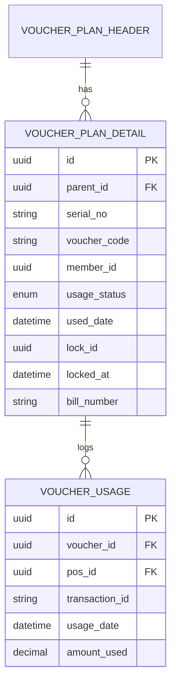

**Diagram sources**
- [docs/data-models.md:34-43](file://docs/data-models.md#L34-L43)
- [docs/data-models.md:46-54](file://docs/data-models.md#L46-L54)

**Section sources**
- [docs/data-models.md:34-43](file://docs/data-models.md#L34-L43)
- [docs/data-models.md:46-54](file://docs/data-models.md#L46-L54)