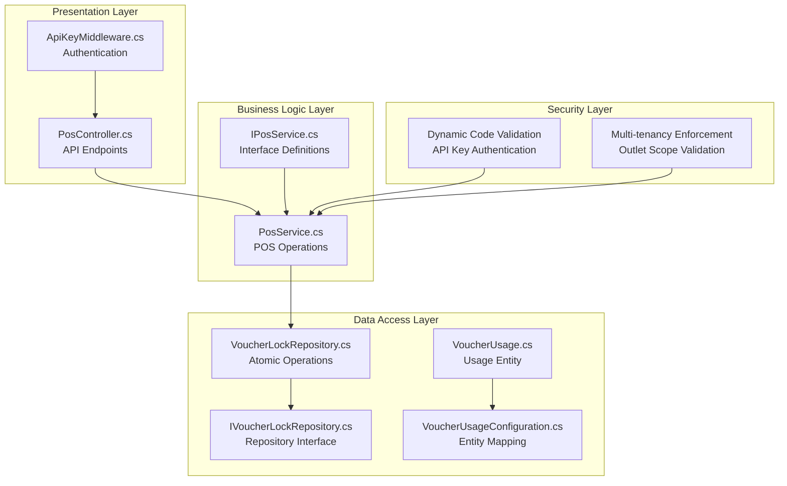
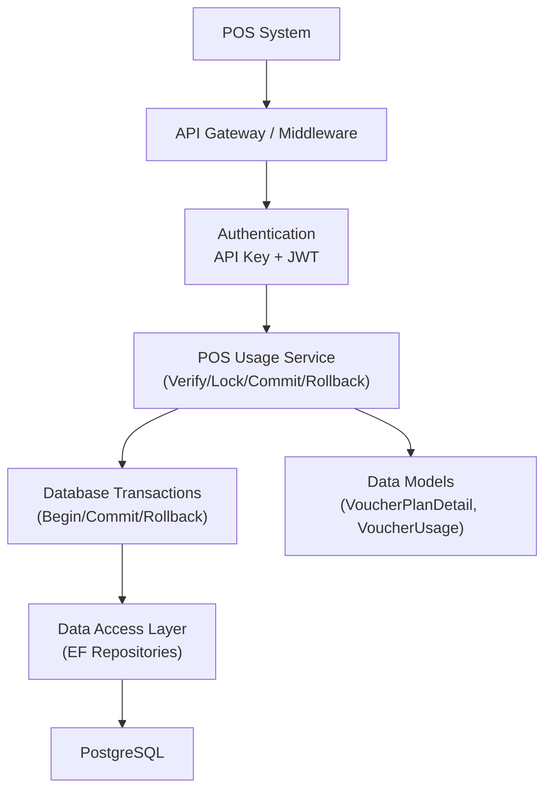
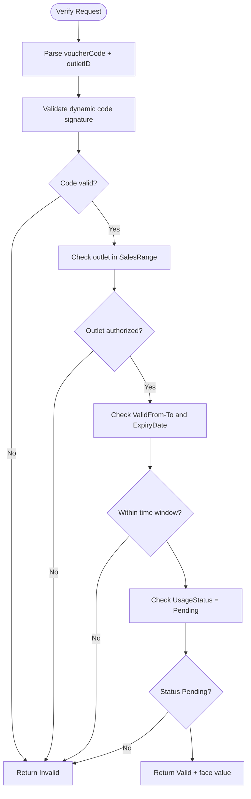
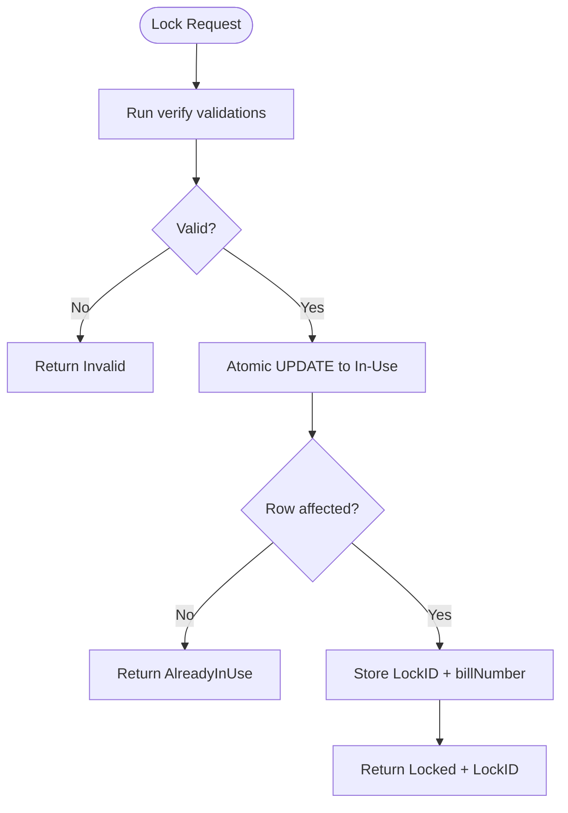
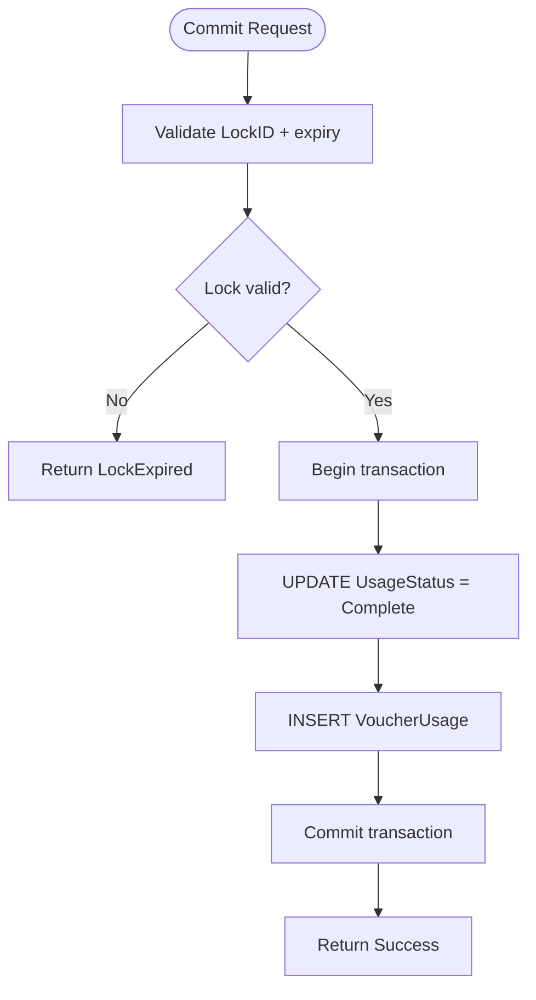
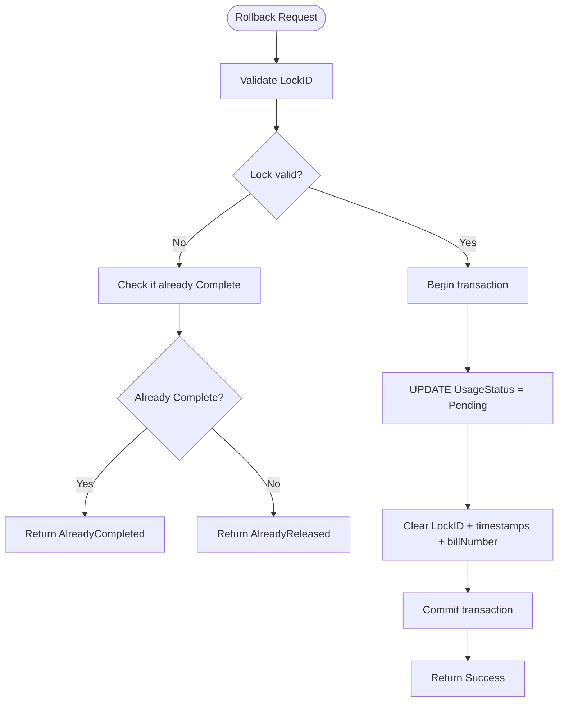
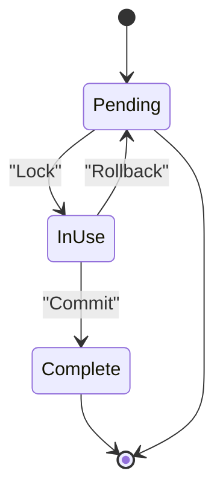
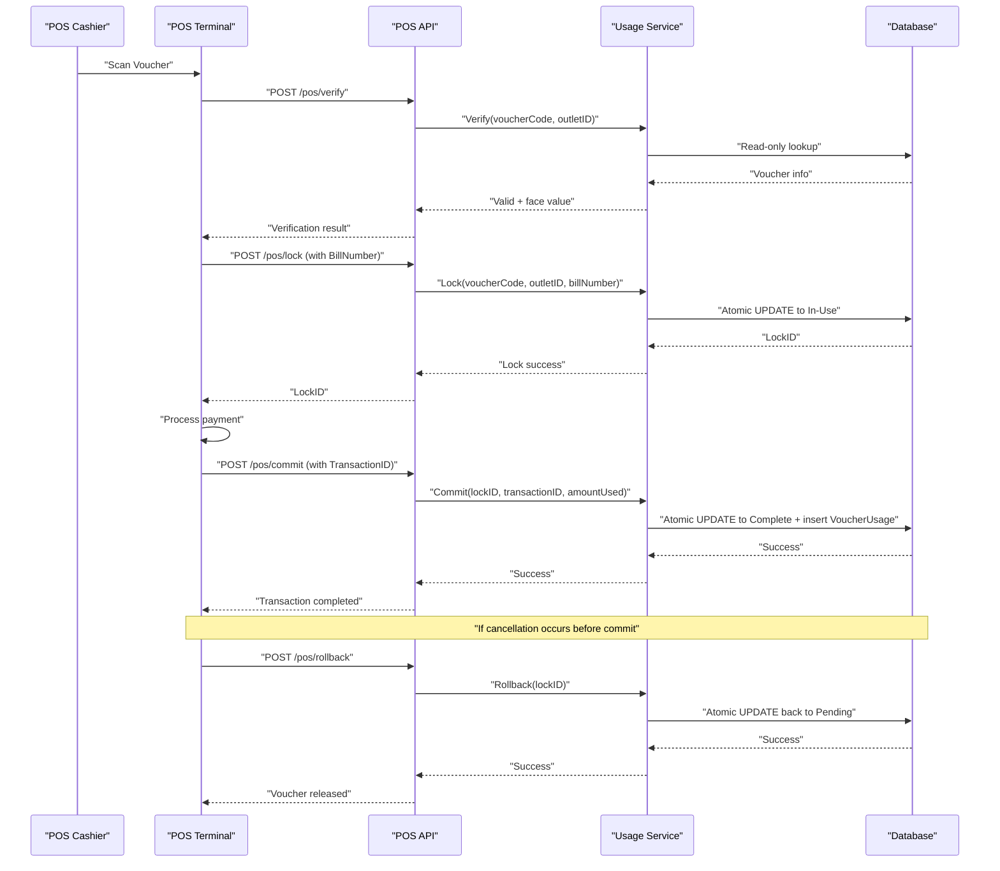
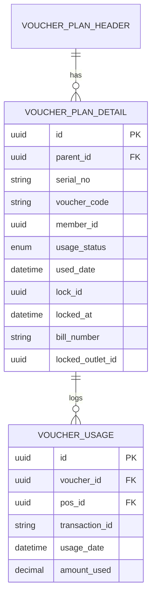

# POS Redemption and Security Mechanisms

<cite>
**Referenced Files in This Document**
- [PosService.cs](file://src/NonCash.Core/Services/PosService.cs)
- [PosController.cs](file://src/NonCash.API/Controllers/PosController.cs)
- [VoucherLockRepository.cs](file://src/NonCash.Infrastructure/Repositories/VoucherLockRepository.cs)
- [VoucherUsage.cs](file://src/NonCash.Core/Entities/VoucherUsage.cs)
- [VoucherUsageConfiguration.cs](file://src/NonCash.Infrastructure/Data/Configurations/VoucherUsageConfiguration.cs)
- [ApiKeyMiddleware.cs](file://src/NonCash.API/Middleware/ApiKeyMiddleware.cs)
- [IPosService.cs](file://src/NonCash.Core/Interfaces/IPosService.cs)
- [IVoucherLockRepository.cs](file://src/NonCash.Core/Interfaces/IVoucherLockRepository.cs)
- [api-contracts.md](file://docs/api-contracts.md)
- [data-models.md](file://docs/data-models.md)
- [4-1-check-for-information.md](file://_bmad-output/implementation-artifacts/4-1-check-for-information.md)
- [4-2-prepare-and-lock.md](file://_bmad-output/implementation-artifacts/4-2-prepare-and-lock.md)
- [4-3-commit-and-log.md](file://_bmad-output/implementation-artifacts/4-3-commit-and-log.md)
- [4-4-rollback-mechanism.md](file://_bmad-output/implementation-artifacts/4-4-rollback-mechanism.md)
</cite>

## Update Summary
**Changes Made**
- Enhanced POS redemption system documentation with new atomic operation implementations
- Added comprehensive coverage of VoucherUsage entity and transaction logging
- Updated acceptance criteria (AC1-AC5) with detailed implementation specifications
- Improved security mechanisms documentation including dynamic code generation
- Enhanced transaction management with Begin/Commit/Rollback semantics
- Added new error handling procedures and rollback scenarios

## Table of Contents
1. [Introduction](#introduction)
2. [Project Structure](#project-structure)
3. [Core Components](#core-components)
4. [Architecture Overview](#architecture-overview)
5. [Detailed Component Analysis](#detailed-component-analysis)
6. [Enhanced Security Mechanisms](#enhanced-security-mechanisms)
7. [Transaction Management System](#transaction-management-system)
8. [POS Operator Workflow](#pos-operator-workflow)
9. [Error Handling and Rollback Scenarios](#error-handling-and-rollback-scenarios)
10. [Acceptance Criteria Implementation](#acceptance-criteria-implementation)
11. [Performance Considerations](#performance-considerations)
12. [Troubleshooting Guide](#troubleshooting-guide)
13. [Conclusion](#conclusion)
14. [Appendices](#appendices)

## Introduction
This document explains the enhanced POS redemption system and its comprehensive security mechanisms. The system implements a three-phase atomic workflow (verify, lock, commit, rollback) with robust transaction management, dynamic code validation, and comprehensive error handling. The POS redemption system ensures data integrity through Begin/Commit/Rollback operations, prevents double spending through atomic locking mechanisms, and maintains security through API Key authentication and dynamic code generation.

## Project Structure
The POS redemption domain is organized across multiple layers with clear separation of concerns:

```mermaid
graph TB
subgraph "Presentation Layer"
A["PosController.cs<br/>API Endpoints"]
B["ApiKeyMiddleware.cs<br/>Authentication"]
end
subgraph "Business Logic Layer"
C["PosService.cs<br/>POS Operations"]
D["IPosService.cs<br/>Interface Definitions"]
end
subgraph "Data Access Layer"
E["VoucherLockRepository.cs<br/>Atomic Operations"]
F["IVoucherLockRepository.cs<br/>Repository Interface"]
G["VoucherUsage.cs<br/>Usage Entity"]
H["VoucherUsageConfiguration.cs<br/>Entity Mapping"]
end
subgraph "Security Layer"
I["Dynamic Code Validation<br/>API Key Authentication"]
J["Multi-tenancy Enforcement<br/>Outlet Scope Validation"]
end
A --> C
B --> A
C --> E
D --> C
E --> F
G --> H
I --> C
J --> C
```

**Diagram sources**
- [PosController.cs:1-193](file://src/NonCash.API/Controllers/PosController.cs#L1-L193)
- [PosService.cs:6-258](file://src/NonCash.Core/Services/PosService.cs#L6-L258)
- [VoucherLockRepository.cs:8-196](file://src/NonCash.Infrastructure/Repositories/VoucherLockRepository.cs#L8-L196)
- [ApiKeyMiddleware.cs:11-68](file://src/NonCash.API/Middleware/ApiKeyMiddleware.cs#L11-L68)

## Core Components
The enhanced POS redemption system consists of four atomic operations with comprehensive validation:

### Atomic Operations
- **Verify**: Stateless read-only operation returning face value and validity without changing state
- **Lock**: Atomic state transition to In-Use with LockID token; prevents double spending and supports idempotency
- **Commit**: Atomic permanent state change to Complete; logs usage record; invalidates LockID
- **Rollback**: Atomic reversal from In-Use back to Pending; clears lock fields; no usage record created

### Transaction Integrity
- All operations are guarded by database transactions and strict validation
- LockID acts as distributed transaction token for commit/rollback operations
- Atomic conditional updates ensure race condition prevention
- Comprehensive error handling with appropriate HTTP status codes

### Security Controls
- API Key authentication for POS endpoints with multi-tenant validation
- Dynamic code generation using JWT-like signatures for voucher authenticity
- Multi-tenancy enforcement preventing cross-brand outlet access
- Concurrency control through row-level locking and conditional updates

**Section sources**
- [PosService.cs:33-154](file://src/NonCash.Core/Services/PosService.cs#L33-L154)
- [VoucherLockRepository.cs:17-196](file://src/NonCash.Infrastructure/Repositories/VoucherLockRepository.cs#L17-L196)
- [ApiKeyMiddleware.cs:22-60](file://src/NonCash.API/Middleware/ApiKeyMiddleware.cs#L22-L60)

## Architecture Overview
The POS redemption flow integrates with a 3-layer SaaS architecture featuring enhanced security and transaction management:

```mermaid
graph TB
POS["POS System"] --> API["API Gateway / Middleware"]
API --> AUTH["Authentication<br/>API Key + JWT"]
AUTH --> SVC["POS Usage Service<br/>(Verify/Lock/Commit/Rollback)"]
SVC --> TXN["Database Transactions<br/>(Begin/Commit/Rollback)"]
TXN --> DAL["Data Access Layer<br/>(EF Repositories)"]
DAL --> DB["PostgreSQL"]
SVC --> MODELS["Data Models<br/>(VoucherPlanDetail, VoucherUsage)"]
```

**Diagram sources**
- [PosController.cs:6-168](file://src/NonCash.API/Controllers/PosController.cs#L6-L168)
- [PosService.cs:17-31](file://src/NonCash.Core/Services/PosService.cs#L17-L31)
- [VoucherLockRepository.cs:102-149](file://src/NonCash.Infrastructure/Repositories/VoucherLockRepository.cs#L102-L149)

**Section sources**
- [PosController.cs:6-168](file://src/NonCash.API/Controllers/PosController.cs#L6-L168)
- [PosService.cs:6-31](file://src/NonCash.Core/Services/PosService.cs#L6-L31)

## Detailed Component Analysis

### POS Verification (Phase 1)
The verification process performs comprehensive validation without state modification:

```mermaid
flowchart TD
Start(["Verify Request"]) --> Parse["Parse voucherCode + outletID"]
Parse --> ValidateCode["Validate dynamic code signature"]
ValidateCode --> CodeValid{"Code valid?"}
CodeValid --> |No| ReturnInvalid["Return Invalid"]
CodeValid --> |Yes| CheckOutlet["Check outlet in SalesRange"]
CheckOutlet --> OutletValid{"Outlet authorized?"}
OutletValid --> |No| ReturnInvalid
OutletValid --> |Yes| CheckTime["Check ValidFrom-To and ExpiryDate"]
CheckTime --> TimeValid{"Within time window?"}
TimeValid --> |No| ReturnInvalid
TimeValid --> CheckStatus["Check UsageStatus = Pending"]
CheckStatus --> StatusValid{"Status Pending?"}
StatusValid --> |No| ReturnInvalid
StatusValid --> ReturnValid["Return Valid + face value"]
```

**Diagram sources**
- [PosService.cs:33-43](file://src/NonCash.Core/Services/PosService.cs#L33-L43)
- [4-1-check-for-information.md:13-43](file://_bmad-output/implementation-artifacts/4-1-check-for-information.md#L13-L43)

**Section sources**
- [PosService.cs:33-43](file://src/NonCash.Core/Services/PosService.cs#L33-L43)
- [4-1-check-for-information.md:13-43](file://_bmad-output/implementation-artifacts/4-1-check-for-information.md#L13-L43)

### Lock (Pre-commit) (Phase 2)
The locking mechanism provides atomic reservation with comprehensive idempotency:

```mermaid
flowchart TD
Start(["Lock Request"]) --> Verify["Run verify validations"]
Verify --> Valid{"Valid?"}
Valid --> |No| ReturnInvalid["Return Invalid"]
Valid --> |Yes| TryLock["Atomic UPDATE to In-Use"]
TryLock --> Locked{"Row affected?"}
Locked --> |No| ReturnAlreadyInUse["Return AlreadyInUse"]
Locked --> |Yes| SaveLock["Store LockID + billNumber"]
SaveLock --> ReturnLocked["Return Locked + LockID"]
```

**Diagram sources**
- [PosService.cs:45-95](file://src/NonCash.Core/Services/PosService.cs#L45-L95)
- [4-2-prepare-and-lock.md:13-46](file://_bmad-output/implementation-artifacts/4-2-prepare-and-lock.md#L13-L46)

**Section sources**
- [PosService.cs:45-95](file://src/NonCash.Core/Services/PosService.cs#L45-L95)
- [4-2-prepare-and-lock.md:13-46](file://_bmad-output/implementation-artifacts/4-2-prepare-and-lock.md#L13-L46)

### Commit (Finalization) (Phase 3)
The commit operation ensures atomic transaction completion with comprehensive idempotency:

```mermaid
flowchart TD
Start(["Commit Request"]) --> ValidateLock["Validate LockID + expiry"]
ValidateLock --> LockOK{"Lock valid?"}
LockOK --> |No| ReturnExpired["Return LockExpired"]
LockOK --> |Yes| BeginTxn["Begin transaction"]
BeginTxn --> UpdateStatus["UPDATE UsageStatus = Complete"]
UpdateStatus --> InsertUsage["INSERT VoucherUsage"]
InsertUsage --> CommitTxn["Commit transaction"]
CommitTxn --> ReturnSuccess["Return Success"]
```

**Diagram sources**
- [PosService.cs:97-133](file://src/NonCash.Core/Services/PosService.cs#L97-L133)
- [4-3-commit-and-log.md:13-50](file://_bmad-output/implementation-artifacts/4-3-commit-and-log.md#L13-L50)

**Section sources**
- [PosService.cs:97-133](file://src/NonCash.Core/Services/PosService.cs#L97-L133)
- [4-3-commit-and-log.md:13-50](file://_bmad-output/implementation-artifacts/4-3-commit-and-log.md#L13-L50)

### Rollback (Compensating Action)
The rollback mechanism provides atomic compensation for failed transactions:

```mermaid
flowchart TD
Start(["Rollback Request"]) --> ValidateLock["Validate LockID"]
ValidateLock --> LockOK{"Lock valid?"}
LockOK --> |No| CheckAlreadyComplete["Check if already Complete"]
CheckAlreadyComplete --> IsComplete{"Already Complete?"}
IsComplete --> |Yes| ReturnAlreadyComplete["Return AlreadyCompleted"]
IsComplete --> |No| ReturnAlreadyReleased["Return AlreadyReleased"]
LockOK --> |Yes| BeginTxn["Begin transaction"]
BeginTxn --> UpdateStatus["UPDATE UsageStatus = Pending"]
UpdateStatus --> ClearLock["Clear LockID + timestamps + billNumber"]
ClearLock --> CommitTxn["Commit transaction"]
CommitTxn --> ReturnSuccess["Return Success"]
```

**Diagram sources**
- [PosService.cs:135-154](file://src/NonCash.Core/Services/PosService.cs#L135-L154)
- [4-4-rollback-mechanism.md:13-52](file://_bmad-output/implementation-artifacts/4-4-rollback-mechanism.md#L13-L52)

**Section sources**
- [PosService.cs:135-154](file://src/NonCash.Core/Services/PosService.cs#L135-L154)
- [4-4-rollback-mechanism.md:13-52](file://_bmad-output/implementation-artifacts/4-4-rollback-mechanism.md#L13-L52)

## Enhanced Security Mechanisms

### API Key Authentication
POS endpoints are secured through dedicated API Key middleware that validates outlet credentials:

- **Authentication Flow**: X-API-Key header validation against Outlet.ApiKeyPrefix
- **Multi-tenancy**: Prevents cross-brand outlet access through brand validation
- **Context Attachment**: Outlet and brand information attached to HttpContext for downstream processing
- **Security**: Hashed API keys with production-ready rotation capabilities

### Dynamic Code Generation
Voucher codes implement JWT-like dynamic validation to prevent static reuse:

- **Signature Validation**: Dynamic code signature verified against stored secrets
- **Time-based Expiration**: Automatic expiry detection preventing future-dated codes
- **Tamper Detection**: Cryptographic validation ensuring code authenticity
- **Unique Generation**: Randomized code generation preventing pattern recognition

### Concurrency Control
Robust concurrency control prevents race conditions and double spending:

- **Atomic Conditional Updates**: Row-level locking through conditional UPDATE statements
- **Lock Expiry**: Automatic cleanup of expired locks after 10-minute TTL
- **Idempotency**: Duplicate request handling without side effects
- **Race Condition Prevention**: Optimistic locking through version checks

**Section sources**
- [ApiKeyMiddleware.cs:22-60](file://src/NonCash.API/Middleware/ApiKeyMiddleware.cs#L22-L60)
- [PosService.cs:158-237](file://src/NonCash.Core/Services/PosService.cs#L158-L237)
- [VoucherLockRepository.cs:47-60](file://src/NonCash.Infrastructure/Repositories/VoucherLockRepository.cs#L47-L60)

## Transaction Management System

### Atomic Operation Patterns
Each POS operation follows strict atomicity guarantees:

```mermaid
stateDiagram-v2
[*] --> Pending
Pending --> InUse : "Lock"
InUse --> Complete : "Commit"
InUse --> Pending : "Rollback"
Complete --> [*]
Pending --> [*]
```

**Diagram sources**
- [PosService.cs:45-154](file://src/NonCash.Core/Services/PosService.cs#L45-L154)
- [VoucherLockRepository.cs:102-149](file://src/NonCash.Infrastructure/Repositories/VoucherLockRepository.cs#L102-L149)

### Transaction Boundaries
Comprehensive transaction management ensures data consistency:

- **Begin**: Transaction starts when lock is validated for commit operations
- **Commit**: Atomic update of voucher status and usage record insertion
- **Rollback**: Compensating transaction for failed operations
- **Boundary Conditions**: Explicit transaction boundaries prevent partial updates

### Error Handling Strategy
Systematic error handling with appropriate HTTP status codes:

- **HTTP 200**: Successful operations and idempotent failures
- **HTTP 400**: Bad request parameter validation
- **HTTP 401**: Unauthorized API key authentication
- **HTTP 409**: Conflict scenarios (already in use, expired locks)
- **HTTP 422**: Validation failures with specific reason codes

**Section sources**
- [PosController.cs:22-167](file://src/NonCash.API/Controllers/PosController.cs#L22-L167)
- [PosService.cs:97-154](file://src/NonCash.Core/Services/PosService.cs#L97-L154)

## POS Operator Workflow

### Complete Transaction Lifecycle
The POS operator follows a deterministic workflow with comprehensive error handling:

```mermaid
sequenceDiagram
participant Cashier as "POS Cashier"
participant POS as "POS Terminal"
participant API as "POS API"
participant SVC as "Usage Service"
participant DB as "Database"
Cashier->>POS : "Scan Voucher"
POS->>API : "POST /pos/verify"
API->>SVC : "Verify(voucherCode, outletID)"
SVC->>DB : "Read-only lookup"
DB-->>SVC : "Voucher info"
SVC-->>API : "Valid + face value"
API-->>POS : "Verification result"
POS->>API : "POST /pos/lock (with BillNumber)"
API->>SVC : "Lock(voucherCode, outletID, billNumber)"
SVC->>DB : "Atomic UPDATE to In-Use"
DB-->>SVC : "LockID"
SVC-->>API : "Lock success"
API-->>POS : "LockID"
POS->>POS : "Process payment"
POS->>API : "POST /pos/commit (with TransactionID)"
API->>SVC : "Commit(lockID, transactionID, amountUsed)"
SVC->>DB : "Atomic UPDATE to Complete + insert VoucherUsage"
DB-->>SVC : "Success"
SVC-->>API : "Success"
API-->>POS : "Transaction completed"
Note over POS,DB : "If cancellation occurs before commit"
POS->>API : "POST /pos/rollback"
API->>SVC : "Rollback(lockID)"
SVC->>DB : "Atomic UPDATE back to Pending"
DB-->>SVC : "Success"
SVC-->>API : "Success"
API-->>POS : "Voucher released"
```

**Diagram sources**
- [PosController.cs:22-167](file://src/NonCash.API/Controllers/PosController.cs#L22-L167)
- [PosService.cs:33-154](file://src/NonCash.Core/Services/PosService.cs#L33-L154)

**Section sources**
- [PosController.cs:22-167](file://src/NonCash.API/Controllers/PosController.cs#L22-L167)
- [PosService.cs:33-154](file://src/NonCash.Core/Services/PosService.cs#L33-L154)

## Error Handling and Rollback Scenarios

### Common Error Scenarios
Comprehensive error handling ensures system reliability:

- **Lock Conflicts**: HTTP 409 when voucher already In-Use; return AlreadyInUse
- **Expired Locks**: HTTP 409 when commit attempted with expired lock; advise re-verify
- **Already Completed**: HTTP 409 for rollback on Complete vouchers; no changes made
- **Idempotent Operations**: Duplicate requests succeed without side effects
- **Verify Mutations**: Verify never mutates state; repeated calls maintain Pending status

### Rollback Scenarios
Multiple rollback conditions with appropriate responses:

- **Successful Rollback**: Atomic UPDATE back to Pending with lock fields cleared
- **Already Released**: HTTP 200 for expired or already released locks (idempotent)
- **Already Completed**: HTTP 409 for rollback attempts on Complete vouchers
- **Lock Not Found**: HTTP 200 indicating effective release (expired or never existed)

### Transaction Integrity
Guaranteed atomicity through comprehensive validation:

- **Commit Validation**: Lock existence, expiry, and matching conditions
- **Rollback Validation**: Lock existence and In-Use status verification
- **Usage Record Creation**: Atomic creation of VoucherUsage records
- **State Consistency**: All state changes occur within database transactions

**Section sources**
- [PosController.cs:88-167](file://src/NonCash.API/Controllers/PosController.cs#L88-L167)
- [PosService.cs:97-154](file://src/NonCash.Core/Services/PosService.cs#L97-L154)
- [VoucherLockRepository.cs:151-194](file://src/NonCash.Infrastructure/Repositories/VoucherLockRepository.cs#L151-L194)

## Acceptance Criteria Implementation

### AC1: Endpoint Implementation
All POS endpoints implement comprehensive validation and response handling:

- **Verify Endpoint**: Stateless operation with dynamic code validation
- **Lock Endpoint**: Atomic reservation with uniqueness enforcement
- **Commit Endpoint**: Permanent state change with usage logging
- **Rollback Endpoint**: Compensating transaction with idempotency

### AC2: Non-Mutating Operations
Verification maintains state integrity:

- **Read-Only Access**: No database mutations during verification
- **State Preservation**: UsageStatus remains Pending after verification
- **Security Validation**: Dynamic code signature verification without side effects

### AC3: Lock Expiry Management
Automatic lock cleanup prevents resource leaks:

- **TTL Enforcement**: 10-minute lock expiration period
- **Background Cleanup**: Automatic release of expired locks
- **Query-Time Filtering**: Treat expired locks as available during validation

### AC4: Idempotency Implementation
Duplicate requests handled safely:

- **Lock Idempotency**: Same outlet+bill combinations return existing LockID
- **Commit Idempotency**: Duplicate TransactionIDs treated as success replay
- **Rollback Idempotency**: Multiple rollback attempts safe and effective

### AC5: Transaction Integrity
Comprehensive transaction management:

- **Atomic Commits**: Single transaction for status update and usage record
- **Usage Record Uniqueness**: TransactionID uniqueness prevents duplicates
- **Error Recovery**: Automatic rollback on transaction failures

**Section sources**
- [4-1-check-for-information.md:13-43](file://_bmad-output/implementation-artifacts/4-1-check-for-information.md#L13-L43)
- [4-2-prepare-and-lock.md:13-46](file://_bmad-output/implementation-artifacts/4-2-prepare-and-lock.md#L13-L46)
- [4-3-commit-and-log.md:13-50](file://_bmad-output/implementation-artifacts/4-3-commit-and-log.md#L13-L50)
- [4-4-rollback-mechanism.md:13-52](file://_bmad-output/implementation-artifacts/4-4-rollback-mechanism.md#L13-L52)

## Performance Considerations

### Concurrent Locking Optimization
High-concurrency scenarios handled efficiently:

- **Race Condition Testing**: Load test with 100 parallel lock requests yields exactly 1 success
- **Idempotency Efficiency**: Duplicate requests handled without unnecessary database work
- **Lock Expiry Optimization**: Background cleanup prevents stale lock accumulation
- **Transaction Minimization**: Short transactions with pre-validation reduce lock contention

### Database Optimization
Performance-focused database design:

- **Index Strategy**: Unique indexes on TransactionID and VoucherID for fast lookups
- **Conditional Updates**: Atomic conditional updates prevent race conditions
- **Connection Pooling**: Efficient connection management for high-throughput scenarios
- **Query Optimization**: Minimal query complexity for hot-path operations

### Memory and Resource Management
Efficient resource utilization:

- **Lock TTL Management**: Automatic cleanup prevents memory leaks
- **Transaction Scope**: Limited transaction duration prevents long-held locks
- **Object Pooling**: Reuse of validation contexts and DTO objects
- **Garbage Collection**: Minimal object allocation during high-frequency operations

## Troubleshooting Guide

### Common Operational Issues
Systematic troubleshooting approach:

- **Lock Conflicts**: Verify exclusive lock ownership; check for expired locks
- **Expired Lock Handling**: Implement automatic lock release and retry logic
- **API Key Issues**: Validate API key format and outlet status
- **Transaction Failures**: Check database connectivity and transaction isolation
- **Concurrency Problems**: Implement retry logic with exponential backoff

### Debugging Strategies
Comprehensive debugging techniques:

- **Log Analysis**: Monitor transaction logs for atomic operation failures
- **State Verification**: Check voucher status through database queries
- **Network Diagnostics**: Validate API key middleware functionality
- **Performance Monitoring**: Track lock acquisition times and transaction durations
- **Error Pattern Recognition**: Identify common failure patterns and root causes

### Recovery Procedures
Systematic recovery approaches:

- **Manual Intervention**: Direct database state correction for edge cases
- **Batch Processing**: Automated cleanup of orphaned locks and usage records
- **Monitoring Alerts**: Proactive notification of system anomalies
- **Rollback Procedures**: Safe recovery from partial transaction states
- **Backup Verification**: Regular validation of data integrity and consistency

**Section sources**
- [PosController.cs:27-167](file://src/NonCash.API/Controllers/PosController.cs#L27-L167)
- [VoucherLockRepository.cs:17-196](file://src/NonCash.Infrastructure/Repositories/VoucherLockRepository.cs#L17-L196)

## Conclusion
The enhanced POS redemption system implements a comprehensive, secure, and transactionally consistent workflow across four atomic phases: verification, pre-commit lock, final commit, and compensating rollback. The system provides robust concurrency controls, dynamic code validation, strict transaction boundaries, and comprehensive error handling. With the new VoucherUsage entity and enhanced security mechanisms, the system ensures complete auditability, prevents fraud, and maintains system integrity. The documented integration points, acceptance criteria, and troubleshooting procedures support reliable POS operations and maintain enterprise-grade security and performance.

## Appendices

### Data Model Integration
Enhanced data model supporting comprehensive POS operations:

```mermaid
erDiagram
VOUCHER_PLAN_DETAIL {
uuid id PK
uuid parent_id FK
string serial_no
string voucher_code
uuid member_id
enum usage_status
datetime used_date
uuid lock_id
datetime locked_at
string bill_number
uuid locked_outlet_id
}
VOUCHER_USAGE {
uuid id PK
uuid voucher_id FK
uuid pos_id FK
string transaction_id
datetime usage_date
decimal amount_used
}
VOUCHER_PLAN_HEADER ||--o{ VOUCHER_PLAN_DETAIL : "has"
VOUCHER_PLAN_DETAIL ||--o{ VOUCHER_USAGE : "logs"
```

**Diagram sources**
- [data-models.md:34-54](file://docs/data-models.md#L34-L54)
- [VoucherUsage.cs:3-13](file://src/NonCash.Core/Entities/VoucherUsage.cs#L3-L13)

### API Contract Compliance
Complete API endpoint implementation:

- **Verify**: POST /api/v1/pos/verify with comprehensive validation
- **Lock**: POST /api/v1/pos/lock with atomic reservation
- **Commit**: POST /api/v1/pos/commit with transaction logging
- **Rollback**: POST /api/v1/pos/rollback with compensating action

**Section sources**
- [api-contracts.md:14-87](file://docs/api-contracts.md#L14-L87)
- [PosController.cs:22-167](file://src/NonCash.API/Controllers/PosController.cs#L22-L167)