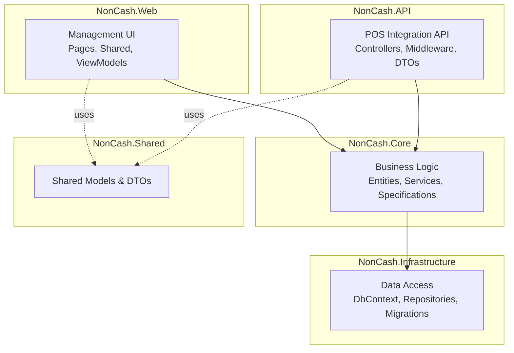
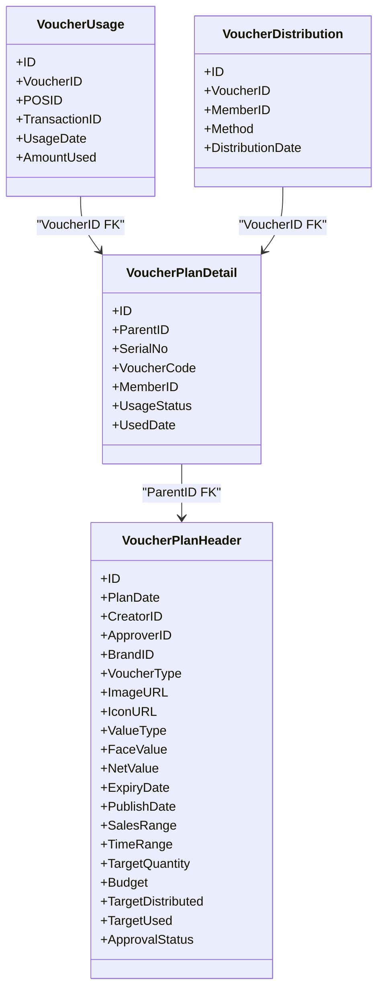
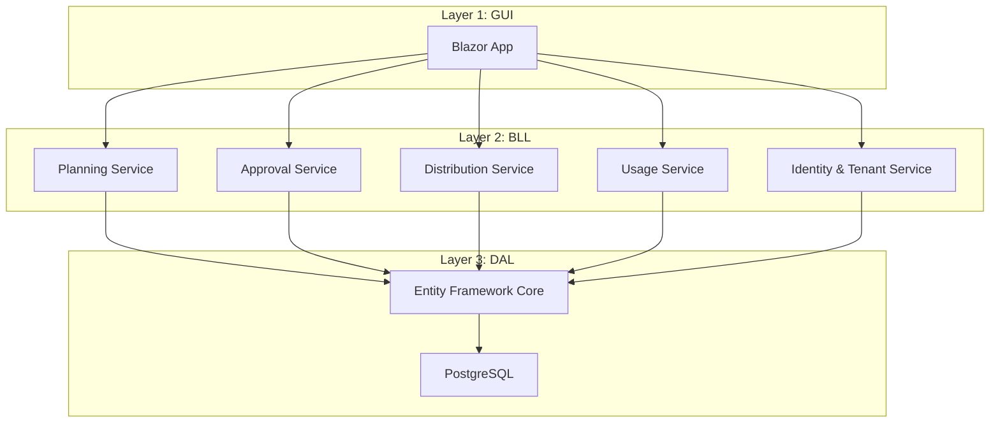
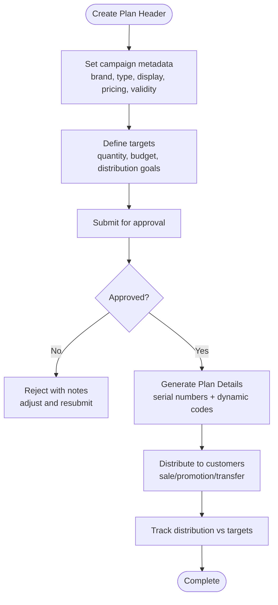
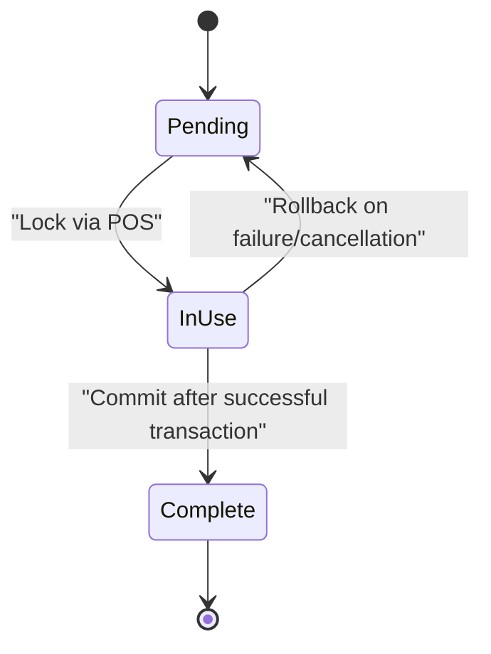
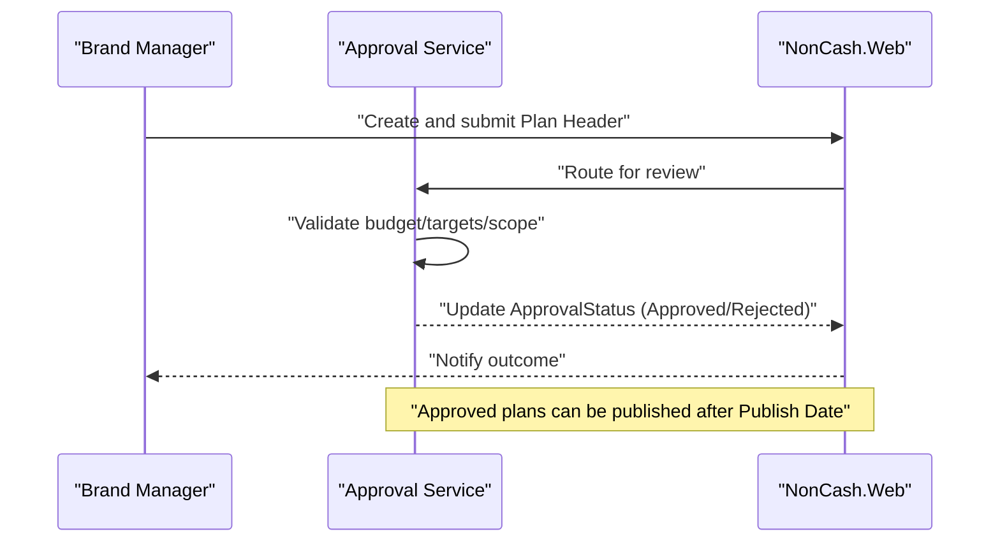
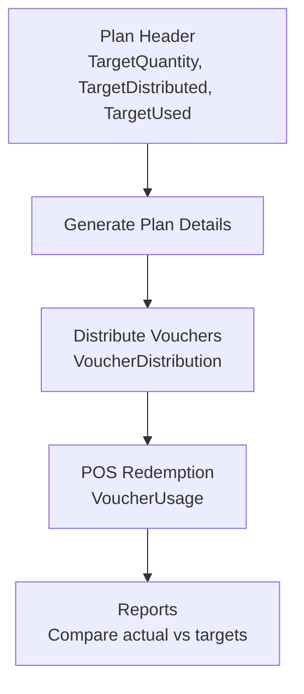
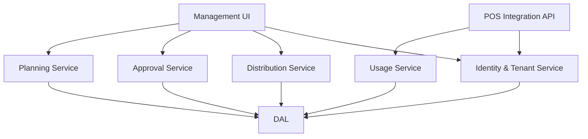

# Production Planning and Campaign Management

<cite>
**Referenced Files in This Document**
- [Key Functionalities.txt](file://Key Functionalities.txt)
- [BMAD_STRUCTURE.md](file://BMAD_STRUCTURE.md)
- [description.txt](file://description.txt)
- [docs/index.md](file://docs/index.md)
- [docs/architecture.md](file://docs/architecture.md)
- [docs/data-models.md](file://docs/data-models.md)
- [docs/api-contracts.md](file://docs/api-contracts.md)
- [docs/source-tree-analysis.md](file://docs/source-tree-analysis.md)
- [_bmad-output/planning-artifacts/epics.md](file://_bmad-output/planning-artifacts/epics.md)
</cite>

## Table of Contents
1. [Introduction](#introduction)
2. [Project Structure](#project-structure)
3. [Core Components](#core-components)
4. [Architecture Overview](#architecture-overview)
5. [Detailed Component Analysis](#detailed-component-analysis)
6. [Dependency Analysis](#dependency-analysis)
7. [Performance Considerations](#performance-considerations)
8. [Troubleshooting Guide](#troubleshooting-guide)
9. [Conclusion](#conclusion)
10. [Appendices](#appendices)

## Introduction
This document explains the production planning and campaign management workflow for the NonCash voucher platform. It covers how campaigns are defined, how production schedules are created and tracked, how approvals are enforced, and how the planned quantity relates to actual distribution and usage. It also documents the two-tier plan structure (Plan Header and Plan Detail), the lifecycle of vouchers, and the security mechanisms that protect dynamic voucher codes. Practical examples illustrate campaign creation, approval processes, and monitoring production progress.

## Project Structure
The NonCash project follows a 3-layer SaaS architecture with microservices supporting planning, approval, distribution, usage, identity, and tenant management. The relevant parts of the source tree include:
- NonCash.Web: Management UI for planning and approvals
- NonCash.API: POS integration REST endpoints
- NonCash.Core: Business logic and domain entities
- NonCash.Infrastructure: Data access via Entity Framework and PostgreSQL
- NonCash.Shared: Shared DTOs and models

**Diagram sources**
- [docs/source-tree-analysis.md:7-34](file://docs/source-tree-analysis.md#L7-L34)

**Section sources**
- [docs/source-tree-analysis.md:1-50](file://docs/source-tree-analysis.md#L1-L50)

## Core Components
This section documents the two-tier plan structure and related entities that underpin production planning and campaign management.

- VoucherPlanHeader (Plan Header)
  - Campaign metadata and global settings for a production plan
  - Includes brand, voucher type, display properties, pricing model, validity periods, sales range, and targets
  - Tracks approval status and budget
- VoucherPlanDetail (Plan Detail)
  - Individual voucher records generated after approval
  - Contains serial number, dynamic code, owner reference, and lifecycle state
- Supporting entities
  - VoucherUsage: Redemption logs at POS
  - VoucherDistribution: Distribution events (sale, promotion, transfer)
  - Brand, Outlet, UserAccount, Customer: Identity and operational contexts

**Diagram sources**
- [docs/data-models.md:11-62](file://docs/data-models.md#L11-L62)

**Section sources**
- [docs/data-models.md:9-62](file://docs/data-models.md#L9-L62)
- [Key Functionalities.txt:15-68](file://Key Functionalities.txt#L15-L68)

## Architecture Overview
The NonCash platform is a SaaS solution structured as a 3-layer system:
- GUI (Blazor): Management portal for planning and approvals
- BLL (.NET Core microservices): Planning, Approval, Distribution, Usage, Identity & Tenant
- DAL (Entity Framework, PostgreSQL): Repository pattern and migrations

Security highlights:
- Multi-tenancy via BrandID
- Dynamic voucher code generation (JWT-like rotation) to prevent reuse and fraud
- API Key authentication for POS and JWT for user sessions

**Diagram sources**
- [docs/architecture.md:9-35](file://docs/architecture.md#L9-L35)

**Section sources**
- [docs/architecture.md:1-52](file://docs/architecture.md#L1-L52)
- [description.txt:16-31](file://description.txt#L16-L31)

## Detailed Component Analysis

### Two-Tier Plan Structure: Header and Detail
- Plan Header (VoucherPlanHeader)
  - Captures campaign-wide attributes: brand, voucher type, display assets, value model, validity windows, sales range, and targets
  - Maintains approval status and budget
- Plan Detail (VoucherPlanDetail)
  - Generated upon approval; each record corresponds to a single voucher
  - Includes dynamic code, serial number, owner reference, and lifecycle state

**Diagram sources**
- [docs/data-models.md:11-42](file://docs/data-models.md#L11-L42)
- [Key Functionalities.txt:17-85](file://Key Functionalities.txt#L17-L85)
- [_bmad-output/planning-artifacts/epics.md:145-196](file://_bmad-output/planning-artifacts/epics.md#L145-L196)

**Section sources**
- [docs/data-models.md:11-42](file://docs/data-models.md#L11-L42)
- [Key Functionalities.txt:17-85](file://Key Functionalities.txt#L17-L85)
- [_bmad-output/planning-artifacts/epics.md:145-196](file://_bmad-output/planning-artifacts/epics.md#L145-L196)

### Voucher Lifecycle States and Security
- Lifecycle states
  - Pending: Available for use
  - In-Use: Locked during a POS transaction attempt
  - Complete: Successfully redeemed
- Security mechanisms
  - Dynamic voucher code rotates periodically (JWT-like logic) to prevent reuse and copying
  - POS integration enforces lock/commit/rollback semantics to ensure transactional integrity

**Diagram sources**
- [Key Functionalities.txt:59-64](file://Key Functionalities.txt#L59-L64)
- [docs/architecture.md:36-41](file://docs/architecture.md#L36-L41)
- [docs/api-contracts.md:14-87](file://docs/api-contracts.md#L14-L87)

**Section sources**
- [Key Functionalities.txt:59-64](file://Key Functionalities.txt#L59-L64)
- [docs/architecture.md:36-41](file://docs/architecture.md#L36-L41)
- [docs/api-contracts.md:14-87](file://docs/api-contracts.md#L14-L87)

### Approval Workflow and Publication
- Submission and review
  - Plan submitted with Pending status
  - Approver validates budget, targets, and scope
  - Approval updates status and approver identity
- Publication
  - Approved plans become publishable on or after Publish Date
  - Rejected plans can be cloned/adjusted and resubmitted

**Diagram sources**
- [_bmad-output/planning-artifacts/epics.md:171-183](file://_bmad-output/planning-artifacts/epics.md#L171-L183)
- [Key Functionalities.txt:70-85](file://Key Functionalities.txt#L70-L85)

**Section sources**
- [_bmad-output/planning-artifacts/epics.md:171-183](file://_bmad-output/planning-artifacts/epics.md#L171-L183)
- [Key Functionalities.txt:70-85](file://Key Functionalities.txt#L70-L85)

### Production Tracking and Relationship Between Planned Quantity and Actual Distribution
- Targets
  - TargetQuantity: Expected production volume
  - TargetDistributed: Goal for customer acquisition/distribution
  - TargetUsed: Goal for POS usage
- Tracking
  - VoucherDistribution logs all distribution events (sale, promotion, transfer)
  - VoucherUsage logs all redemptions at POS
  - Reports compare actual distribution and usage against targets

**Diagram sources**
- [docs/data-models.md:28-32](file://docs/data-models.md#L28-L32)
- [docs/data-models.md:55-61](file://docs/data-models.md#L55-L61)
- [docs/data-models.md:46-53](file://docs/data-models.md#L46-L53)
- [Key Functionalities.txt:43-46](file://Key Functionalities.txt#L43-L46)

**Section sources**
- [docs/data-models.md:28-32](file://docs/data-models.md#L28-L32)
- [docs/data-models.md:46-61](file://docs/data-models.md#L46-L61)
- [Key Functionalities.txt:43-46](file://Key Functionalities.txt#L43-L46)

### Practical Examples

#### Example 1: Creating a Campaign and Aligning Targets with Business Objectives
- Objective: Increase customer acquisition and revenue growth
- Steps:
  - Create Plan Header with:
    - Brand and voucher type aligned to target segment
    - Pricing model and face value to drive conversion
    - SalesRange limited to high-performing Outlets
    - TimeRange and PublishDate to coordinate marketing
    - Budget and TargetDistributed set to meet acquisition goals
    - TargetUsed set to estimate POS redemption
  - Submit for approval; upon approval, generate Plan Details
  - Publish and distribute via sale or promotion

**Section sources**
- [Key Functionalities.txt:10-12](file://Key Functionalities.txt#L10-L12)
- [docs/data-models.md:11-32](file://docs/data-models.md#L11-L32)
- [_bmad-output/planning-artifacts/epics.md:145-156](file://_bmad-output/planning-artifacts/epics.md#L145-L156)

#### Example 2: Approval Process and Plan Adjustment
- Scenario: Initial plan rejected due to budget overrun
- Steps:
  - Review rejection notes
  - Adjust pricing, sales range, or targets
  - Clone or create a new version of the plan
  - Resubmit for approval

**Section sources**
- [_bmad-output/planning-artifacts/epics.md:184-196](file://_bmad-output/planning-artifacts/epics.md#L184-L196)
- [Key Functionalities.txt:83-85](file://Key Functionalities.txt#L83-L85)

#### Example 3: Monitoring Production Progress
- Steps:
  - Track VoucherDistribution events against TargetDistributed
  - Monitor VoucherUsage trends against TargetUsed
  - Use reporting dashboards to compare actual vs targets and adjust future campaigns

**Section sources**
- [docs/data-models.md:55-61](file://docs/data-models.md#L55-L61)
- [_bmad-output/planning-artifacts/epics.md:244-256](file://_bmad-output/planning-artifacts/epics.md#L244-L256)

## Dependency Analysis
The system’s microservices encapsulate responsibilities and communicate via internal APIs. The POS integration relies on API Key authentication and JWT for user sessions. The dynamic voucher code logic is embedded in the Usage Service to ensure secure redemption.

**Diagram sources**
- [docs/architecture.md:17-26](file://docs/architecture.md#L17-L26)
- [docs/api-contracts.md:6-8](file://docs/api-contracts.md#L6-L8)

**Section sources**
- [docs/architecture.md:17-26](file://docs/architecture.md#L17-L26)
- [docs/api-contracts.md:6-8](file://docs/api-contracts.md#L6-L8)

## Performance Considerations
- Use batch generation for Plan Details to minimize overhead during approval
- Employ indexing on frequently queried fields (e.g., BrandID, OutletID, MemberID) to optimize distribution and usage queries
- Implement asynchronous distribution pipelines for large-scale promotions
- Ensure transaction boundaries around POS redemption to maintain consistency and reduce contention

## Troubleshooting Guide
Common issues and resolutions:
- Voucher not redeemable
  - Verify approval status and Publish Date
  - Confirm voucher state is Pending or In-Use appropriately
  - Check POS lock/commit/rollback sequences
- Distribution discrepancies
  - Compare VoucherDistribution logs with TargetDistributed
  - Investigate missing MemberID assignments or invalid recipients
- Approval conflicts
  - Review rejection notes and re-adjust plan parameters
  - Clone and resubmit rejected plans

**Section sources**
- [Key Functionalities.txt:83-85](file://Key Functionalities.txt#L83-L85)
- [docs/data-models.md:55-61](file://docs/data-models.md#L55-L61)
- [docs/api-contracts.md:14-87](file://docs/api-contracts.md#L14-L87)

## Conclusion
The NonCash platform provides a robust framework for production planning and campaign management. The two-tier plan structure (Header and Detail) enables precise targeting and control, while the approval workflow ensures governance and compliance. Dynamic voucher codes and POS lock/commit/rollback mechanisms enforce security and transactional integrity. By aligning targets with business objectives and leveraging distribution and usage tracking, organizations can effectively manage voucher campaigns from planning to redemption.

## Appendices

### Appendix A: Business Objectives and Alignment
- Revenue growth: Set pricing model and face value to maximize perceived value and conversion
- Customer acquisition: Configure TargetDistributed and SalesRange to focus on high-value segments
- Operational efficiency: Use batch distribution and automated generation to streamline production

**Section sources**
- [Key Functionalities.txt:10-12](file://Key Functionalities.txt#L10-L12)
- [docs/data-models.md:28-32](file://docs/data-models.md#L28-L32)

### Appendix B: Security and Compliance Highlights
- Multi-tenancy isolation via BrandID
- Dynamic voucher code prevents reuse and fraud
- API Key authentication for POS and JWT for user sessions
- Transactional redemption at POS maintains audit trails

**Section sources**
- [docs/architecture.md:36-41](file://docs/architecture.md#L36-L41)
- [docs/api-contracts.md:6-8](file://docs/api-contracts.md#L6-L8)