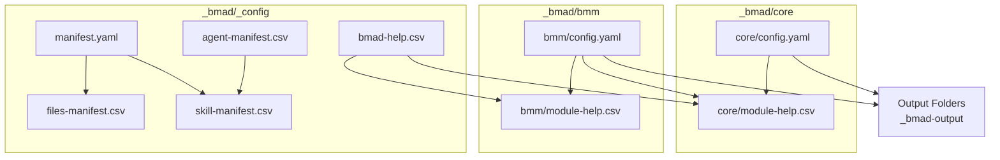
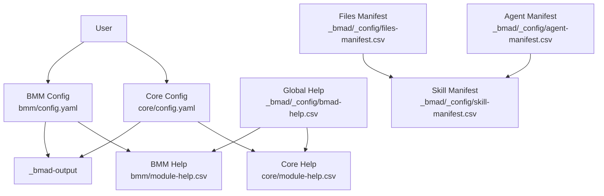
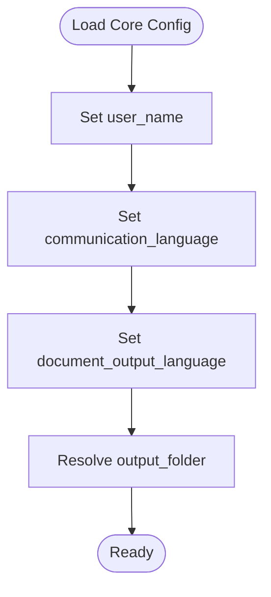
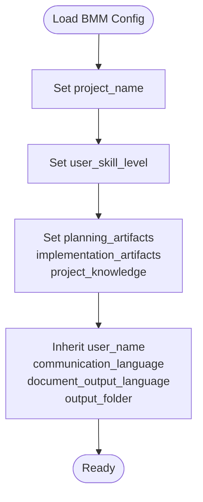
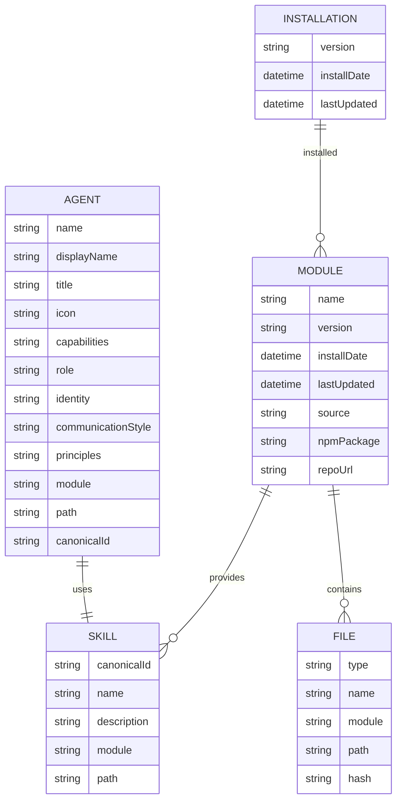
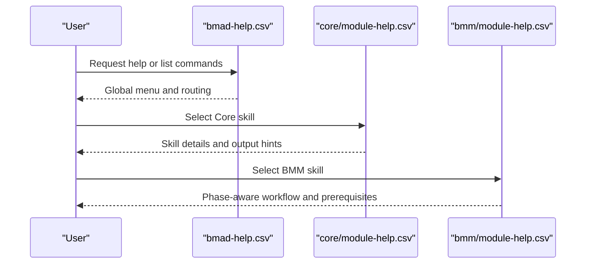
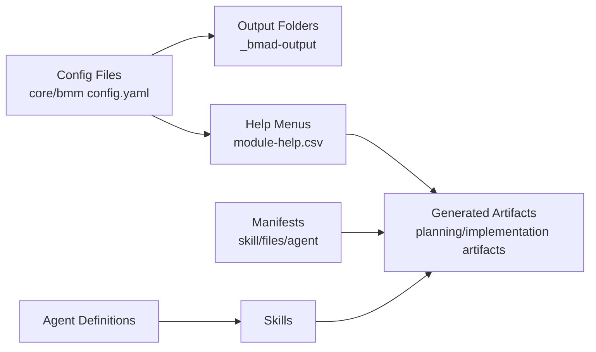
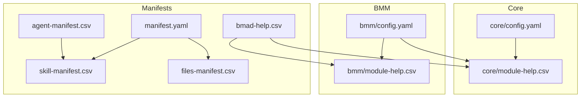

# BMAD Configuration Management

<cite>
**Referenced Files in This Document**
- [core/config.yaml](file://_bmad/core/config.yaml)
- [bmm/config.yaml](file://_bmad/bmm/config.yaml)
- [manifest.yaml](file://_bmad/_config/manifest.yaml)
- [skill-manifest.csv](file://_bmad/_config/skill-manifest.csv)
- [files-manifest.csv](file://_bmad/_config/files-manifest.csv)
- [agent-manifest.csv](file://_bmad/_config/agent-manifest.csv)
- [bmad-help.csv](file://_bmad/_config/bmad-help.csv)
- [core/module-help.csv](file://_bmad/core/module-help.csv)
- [bmm/module-help.csv](file://_bmad/bmm/module-help.csv)
- [BMAD_STRUCTURE.md](file://BMAD_STRUCTURE.md)
</cite>

## Table of Contents
1. [Introduction](#introduction)
2. [Project Structure](#project-structure)
3. [Core Components](#core-components)
4. [Architecture Overview](#architecture-overview)
5. [Detailed Component Analysis](#detailed-component-analysis)
6. [Dependency Analysis](#dependency-analysis)
7. [Performance Considerations](#performance-considerations)
8. [Troubleshooting Guide](#troubleshooting-guide)
9. [Conclusion](#conclusion)
10. [Appendices](#appendices)

## Introduction
This document explains the BMAD configuration management for the NonCash platform, focusing on how the core module, BMM (Business Model Management), agents, manifests, and help systems are configured and how they influence generated artifacts. It covers output folder settings, user management, language preferences, planning workflows, module help systems, skill manifests, agent configuration, and module dependencies. It also provides configuration validation guidance, troubleshooting common setup issues, and best practices for maintaining configuration consistency across environments.

## Project Structure
The BMAD configuration is organized into three primary areas:
- Core module configuration and help system
- BMM module configuration and help system
- Centralized manifests and agent definitions

**Diagram sources**
- [_bmad/core/config.yaml](file://_bmad/core/config.yaml)
- [_bmad/bmm/config.yaml](file://_bmad/bmm/config.yaml)
- [_bmad/_config/manifest.yaml](file://_bmad/_config/manifest.yaml)
- [_bmad/_config/skill-manifest.csv](file://_bmad/_config/skill-manifest.csv)
- [_bmad/_config/files-manifest.csv](file://_bmad/_config/files-manifest.csv)
- [_bmad/_config/agent-manifest.csv](file://_bmad/_config/agent-manifest.csv)
- [_bmad/_config/bmad-help.csv](file://_bmad/_config/bmad-help.csv)
- [_bmad/core/module-help.csv](file://_bmad/core/module-help.csv)
- [_bmad/bmm/module-help.csv](file://_bmad/bmm/module-help.csv)

**Section sources**
- [_bmad/core/config.yaml](file://_bmad/core/config.yaml)
- [_bmad/bmm/config.yaml](file://_bmad/bmm/config.yaml)
- [_bmad/_config/manifest.yaml](file://_bmad/_config/manifest.yaml)
- [_bmad/_config/skill-manifest.csv](file://_bmad/_config/skill-manifest.csv)
- [_bmad/_config/files-manifest.csv](file://_bmad/_config/files-manifest.csv)
- [_bmad/_config/agent-manifest.csv](file://_bmad/_config/agent-manifest.csv)
- [_bmad/_config/bmad-help.csv](file://_bmad/_config/bmad-help.csv)
- [_bmad/core/module-help.csv](file://_bmad/core/module-help.csv)
- [_bmad/bmm/module-help.csv](file://_bmad/bmm/module-help.csv)

## Core Components
This section documents the core configuration and help systems that define user identity, language preferences, output locations, and the skill/help menu for the Core module.

- Core module configuration
  - User identity and language preferences
  - Output folder resolution
- Core module help system
  - Menu entries and routing for skills
  - Output location hints and required artifacts

Key configuration values and their roles:
- user_name: Identifies the user across modules
- communication_language: Language used for agent communication
- document_output_language: Language for generated documents
- output_folder: Base path for generated artifacts; supports project-root placeholder

Help system highlights:
- Menu code mapping and phase gating
- Required outputs and postconditions
- Output location hints for generated artifacts

**Section sources**
- [_bmad/core/config.yaml](file://_bmad/core/config.yaml)
- [_bmad/core/module-help.csv](file://_bmad/core/module-help.csv)

## Architecture Overview
The BMAD configuration architecture ties together:
- Core and BMM modules via shared output folders and help systems
- Manifests that enumerate skills, files, and agents
- Agent definitions that map to skills and capabilities
- Help manifests that define menu entries and routing

**Diagram sources**
- [_bmad/core/config.yaml](file://_bmad/core/config.yaml)
- [_bmad/bmm/config.yaml](file://_bmad/bmm/config.yaml)
- [_bmad/core/module-help.csv](file://_bmad/core/module-help.csv)
- [_bmad/bmm/module-help.csv](file://_bmad/bmm/module-help.csv)
- [_bmad/_config/bmad-help.csv](file://_bmad/_config/bmad-help.csv)
- [_bmad/_config/agent-manifest.csv](file://_bmad/_config/agent-manifest.csv)
- [_bmad/_config/skill-manifest.csv](file://_bmad/_config/skill-manifest.csv)
- [_bmad/_config/files-manifest.csv](file://_bmad/_config/files-manifest.csv)

## Detailed Component Analysis

### Core Module Configuration
The Core module defines user identity, language preferences, and the base output folder. These settings propagate to help menus and artifact generation.

- User identity
  - user_name influences agent interactions and logging
- Language preferences
  - communication_language affects agent communication style
  - document_output_language controls generated document language
- Output folder
  - output_folder resolves to a project-relative path; used by Core help entries for output location hints

**Diagram sources**
- [_bmad/core/config.yaml](file://_bmad/core/config.yaml)

**Section sources**
- [_bmad/core/config.yaml](file://_bmad/core/config.yaml)

### BMM Module Configuration
The BMM module extends core settings with project-specific paths and planning/implementation artifact locations. It also inherits core user and language preferences.

- Project metadata
  - project_name identifies the project context
  - user_skill_level indicates baseline capability for workflows
- Artifact paths
  - planning_artifacts: Path for planning-phase outputs
  - implementation_artifacts: Path for implementation-phase outputs
  - project_knowledge: Path to project knowledge base
- Inherited values
  - user_name, communication_language, document_output_language, output_folder

**Diagram sources**
- [_bmad/bmm/config.yaml](file://_bmad/bmm/config.yaml)

**Section sources**
- [_bmad/bmm/config.yaml](file://_bmad/bmm/config.yaml)

### Manifests and Agent Configuration
Manifests centralize the definition of skills, files, and agents that power BMAD workflows.

- Installation manifest
  - Tracks installed modules, versions, and installation metadata
- Skill manifest
  - Lists canonical skill identifiers, names, descriptions, modules, and file paths
- Files manifest
  - Enumerates CSV, YAML, JSON, MD, and Python assets with type, name, module, path, and hash
- Agent manifest
  - Defines agent identities, roles, capabilities, and module/path associations

**Diagram sources**
- [_bmad/_config/manifest.yaml](file://_bmad/_config/manifest.yaml)
- [_bmad/_config/skill-manifest.csv](file://_bmad/_config/skill-manifest.csv)
- [_bmad/_config/files-manifest.csv](file://_bmad/_config/files-manifest.csv)
- [_bmad/_config/agent-manifest.csv](file://_bmad/_config/agent-manifest.csv)

**Section sources**
- [_bmad/_config/manifest.yaml](file://_bmad/_config/manifest.yaml)
- [_bmad/_config/skill-manifest.csv](file://_bmad/_config/skill-manifest.csv)
- [_bmad/_config/files-manifest.csv](file://_bmad/_config/files-manifest.csv)
- [_bmad/_config/agent-manifest.csv](file://_bmad/_config/agent-manifest.csv)

### Help Systems and Workflows
The help manifests define menu entries, command routing, and required artifacts for both Core and BMM modules.

- Global help manifest
  - Provides cross-module navigation and command mappings
- Core help manifest
  - Lists Core skills, menu codes, descriptions, phases, and output locations
- BMM help manifest
  - Lists BMM skills, phases (analysis, planning, solutioning, implementation), required prerequisites, and outputs

**Diagram sources**
- [_bmad/_config/bmad-help.csv](file://_bmad/_config/bmad-help.csv)
- [_bmad/core/module-help.csv](file://_bmad/core/module-help.csv)
- [_bmad/bmm/module-help.csv](file://_bmad/bmm/module-help.csv)

**Section sources**
- [_bmad/_config/bmad-help.csv](file://_bmad/_config/bmad-help.csv)
- [_bmad/core/module-help.csv](file://_bmad/core/module-help.csv)
- [_bmad/bmm/module-help.csv](file://_bmad/bmm/module-help.csv)

### Relationship Between Configuration Files and Generated Artifacts
Configuration files influence generated artifacts through:
- Output folder resolution and phase-specific paths
- Skill and file manifests that define templates and assets
- Agent manifests that connect capabilities to skills

**Diagram sources**
- [_bmad/core/config.yaml](file://_bmad/core/config.yaml)
- [_bmad/bmm/config.yaml](file://_bmad/bmm/config.yaml)
- [_bmad/core/module-help.csv](file://_bmad/core/module-help.csv)
- [_bmad/bmm/module-help.csv](file://_bmad/bmm/module-help.csv)
- [_bmad/_config/skill-manifest.csv](file://_bmad/_config/skill-manifest.csv)
- [_bmad/_config/files-manifest.csv](file://_bmad/_config/files-manifest.csv)
- [_bmad/_config/agent-manifest.csv](file://_bmad/_config/agent-manifest.csv)

**Section sources**
- [_bmad/core/config.yaml](file://_bmad/core/config.yaml)
- [_bmad/bmm/config.yaml](file://_bmad/bmm/config.yaml)
- [_bmad/core/module-help.csv](file://_bmad/core/module-help.csv)
- [_bmad/bmm/module-help.csv](file://_bmad/bmm/module-help.csv)
- [_bmad/_config/skill-manifest.csv](file://_bmad/_config/skill-manifest.csv)
- [_bmad/_config/files-manifest.csv](file://_bmad/_config/files-manifest.csv)
- [_bmad/_config/agent-manifest.csv](file://_bmad/_config/agent-manifest.csv)

## Dependency Analysis
This section maps dependencies among configuration components and their impact on workflows.

**Diagram sources**
- [_bmad/core/config.yaml](file://_bmad/core/config.yaml)
- [_bmad/bmm/config.yaml](file://_bmad/bmm/config.yaml)
- [_bmad/_config/manifest.yaml](file://_bmad/_config/manifest.yaml)
- [_bmad/_config/skill-manifest.csv](file://_bmad/_config/skill-manifest.csv)
- [_bmad/_config/files-manifest.csv](file://_bmad/_config/files-manifest.csv)
- [_bmad/_config/agent-manifest.csv](file://_bmad/_config/agent-manifest.csv)
- [_bmad/_config/bmad-help.csv](file://_bmad/_config/bmad-help.csv)
- [_bmad/core/module-help.csv](file://_bmad/core/module-help.csv)
- [_bmad/bmm/module-help.csv](file://_bmad/bmm/module-help.csv)

**Section sources**
- [_bmad/core/config.yaml](file://_bmad/core/config.yaml)
- [_bmad/bmm/config.yaml](file://_bmad/bmm/config.yaml)
- [_bmad/_config/manifest.yaml](file://_bmad/_config/manifest.yaml)
- [_bmad/_config/skill-manifest.csv](file://_bmad/_config/skill-manifest.csv)
- [_bmad/_config/files-manifest.csv](file://_bmad/_config/files-manifest.csv)
- [_bmad/_config/agent-manifest.csv](file://_bmad/_config/agent-manifest.csv)
- [_bmad/_config/bmad-help.csv](file://_bmad/_config/bmad-help.csv)
- [_bmad/core/module-help.csv](file://_bmad/core/module-help.csv)
- [_bmad/bmm/module-help.csv](file://_bmad/bmm/module-help.csv)

## Performance Considerations
- Prefer relative paths with placeholders (e.g., project-root) to avoid hardcoding absolute paths
- Keep manifests concise and validated to reduce load overhead
- Use the files manifest to track hashes for integrity checks and cache invalidation
- Limit the number of concurrent help menu evaluations during interactive sessions

## Troubleshooting Guide
Common BMAD setup issues and resolutions:

- Output folder not found or inaccessible
  - Verify output_folder resolution and permissions
  - Ensure planning_artifacts and implementation_artifacts are writable
- Language preference mismatches
  - Confirm communication_language and document_output_language align with agent capabilities
- Missing or outdated manifests
  - Re-run installation manifest to refresh module metadata
  - Validate skill-manifest.csv and files-manifest.csv entries
- Agent capability mismatch
  - Check agent-manifest.csv for correct capabilities and module assignments
- Help menu routing errors
  - Validate bmad-help.csv, core/module-help.csv, and bmm/module-help.csv entries
  - Ensure required prerequisites and output locations are set correctly

Best practices for configuration consistency:
- Use version-controlled configuration files with clear comments
- Standardize naming conventions for skills, agents, and artifacts
- Maintain separate environments with environment-specific overrides
- Regularly validate manifests and hashes to detect drift

**Section sources**
- [_bmad/core/config.yaml](file://_bmad/core/config.yaml)
- [_bmad/bmm/config.yaml](file://_bmad/bmm/config.yaml)
- [_bmad/_config/manifest.yaml](file://_bmad/_config/manifest.yaml)
- [_bmad/_config/skill-manifest.csv](file://_bmad/_config/skill-manifest.csv)
- [_bmad/_config/files-manifest.csv](file://_bmad/_config/files-manifest.csv)
- [_bmad/_config/agent-manifest.csv](file://_bmad/_config/agent-manifest.csv)
- [_bmad/_config/bmad-help.csv](file://_bmad/_config/bmad-help.csv)
- [_bmad/core/module-help.csv](file://_bmad/core/module-help.csv)
- [_bmad/bmm/module-help.csv](file://_bmad/bmm/module-help.csv)

## Conclusion
BMAD configuration in NonCash is centered around modular YAML configs, comprehensive manifests, and structured help systems. Proper configuration of user identity, language preferences, and output folders ensures consistent artifact generation across planning and implementation phases. The manifests and agent definitions provide a robust foundation for skills, files, and capabilities, while the help systems guide users through workflows with clear prerequisites and outputs.

## Appendices
- Additional project context and architecture overview are documented in BMAD_STRUCTURE.md for broader understanding of the platform’s business and technical foundations.

**Section sources**
- [BMAD_STRUCTURE.md](file://BMAD_STRUCTURE.md)