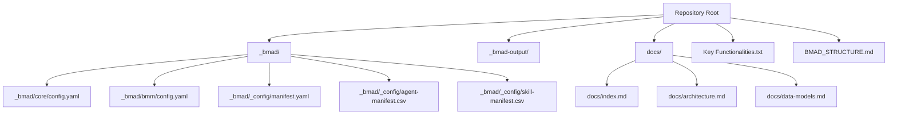
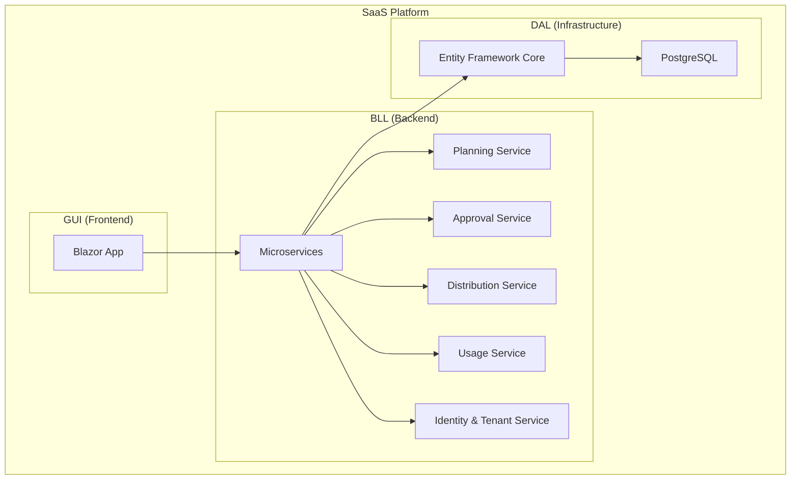
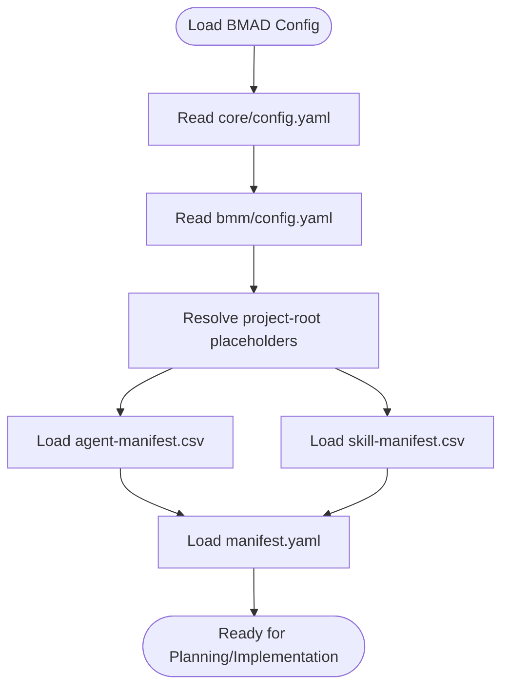
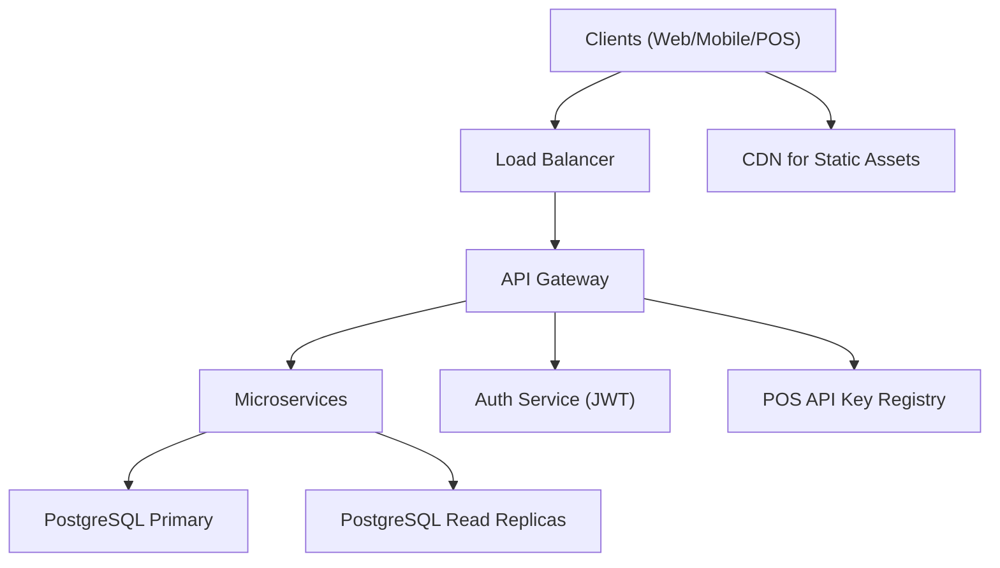
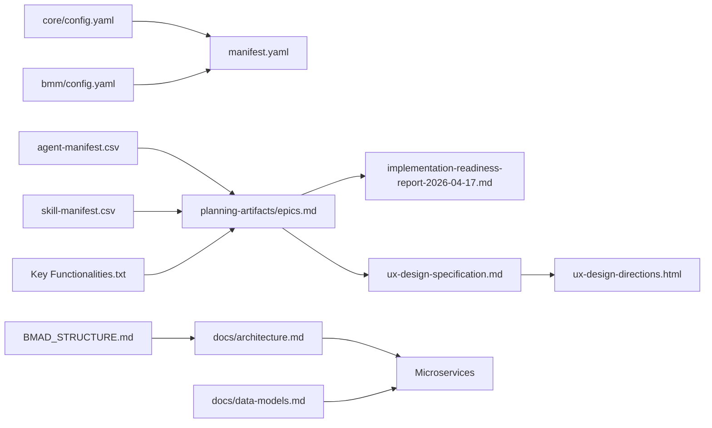
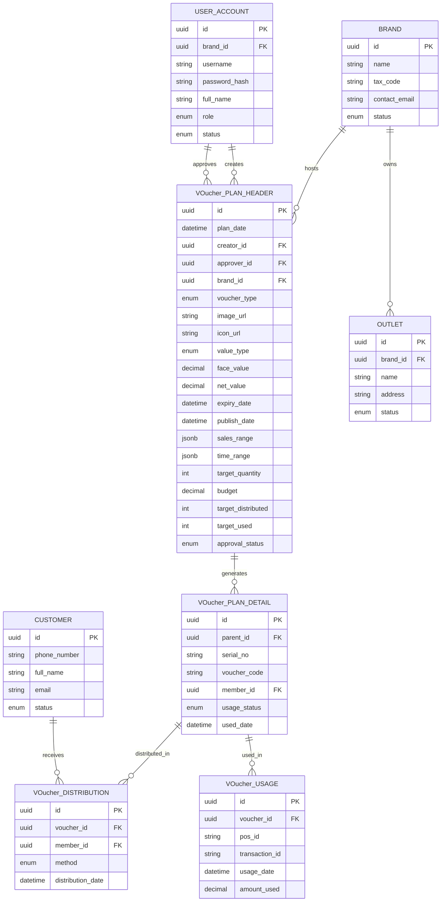

# Configuration and Deployment

<cite>
**Referenced Files in This Document**
- [BMAD_STRUCTURE.md](file://BMAD_STRUCTURE.md)
- [Key Functionalities.txt](file://Key Functionalities.txt)
- [_bmad/core/config.yaml](file://_bmad/core/config.yaml)
- [_bmad/bmm/config.yaml](file://_bmad/bmm/config.yaml)
- [_bmad/_config/manifest.yaml](file://_bmad/_config/manifest.yaml)
- [_bmad/_config/agent-manifest.csv](file://_bmad/_config/agent-manifest.csv)
- [_bmad/_config/skill-manifest.csv](file://_bmad/_config/skill-manifest.csv)
- [_bmad-output/planning-artifacts/epics.md](file://_bmad-output/planning-artifacts/epics.md)
- [_bmad-output/planning-artifacts/implementation-readiness-report-2026-04-17.md](file://_bmad-output/planning-artifacts/implementation-readiness-report-2026-04-17.md)
- [_bmad-output/planning-artifacts/ux-design-specification.md](file://_bmad-output/planning-artifacts/ux-design-specification.md)
- [_bmad-output/planning-artifacts/ux-design-directions.html](file://_bmad-output/planning-artifacts/ux-design-directions.html)
- [docs/index.md](file://docs/index.md)
- [docs/architecture.md](file://docs/architecture.md)
- [docs/data-models.md](file://docs/data-models.md)
</cite>

## Table of Contents
1. [Introduction](#introduction)
2. [Project Structure](#project-structure)
3. [Core Components](#core-components)
4. [Architecture Overview](#architecture-overview)
5. [Detailed Component Analysis](#detailed-component-analysis)
6. [Dependency Analysis](#dependency-analysis)
7. [Performance Considerations](#performance-considerations)
8. [Troubleshooting Guide](#troubleshooting-guide)
9. [Conclusion](#conclusion)
10. [Appendices](#appendices)

## Introduction
This document provides comprehensive configuration and deployment guidance for the NonCash SaaS platform, grounded in the BMAD methodology and aligned with the project’s three-layer architecture. It covers BMAD configuration management (core module settings, BMM planning configuration, agent manifests), environment setup, database migration strategies, and SaaS deployment topology. It also outlines containerization approaches, CI/CD pipeline configuration, infrastructure provisioning, scaling and load balancing strategies, disaster recovery planning, environment-specific configuration management, secrets management, deployment checklists, monitoring setup, maintenance procedures, and troubleshooting for common deployment issues.

## Project Structure
The repository organizes BMAD artifacts under the _bmad directory, with configuration files for core and BMM modules, agent and skill manifests, and planning/implementation outputs under _bmad-output. Documentation resides under docs, and the BMAD structure and functional specifications are captured in BMAD_STRUCTURE.md and Key Functionalities.txt.

**Diagram sources**
- [BMAD_STRUCTURE.md](file://BMAD_STRUCTURE.md)
- [Key Functionalities.txt](file://Key Functionalities.txt)
- [_bmad/core/config.yaml](file://_bmad/core/config.yaml)
- [_bmad/bmm/config.yaml](file://_bmad/bmm/config.yaml)
- [_bmad/_config/manifest.yaml](file://_bmad/_config/manifest.yaml)
- [_bmad/_config/agent-manifest.csv](file://_bmad/_config/agent-manifest.csv)
- [_bmad/_config/skill-manifest.csv](file://_bmad/_config/skill-manifest.csv)
- [docs/index.md](file://docs/index.md)
- [docs/architecture.md](file://docs/architecture.md)
- [docs/data-models.md](file://docs/data-models.md)

**Section sources**
- [BMAD_STRUCTURE.md](file://BMAD_STRUCTURE.md)
- [docs/index.md](file://docs/index.md)

## Core Components
This section documents the BMAD configuration components and their roles in SaaS deployment.

- Core Module Configuration
  - Purpose: Defines baseline BMAD runtime settings for the core module.
  - Key settings: user_name, communication_language, document_output_language, output_folder.
  - Notes: output_folder uses a placeholder for project-root, suitable for environment substitution during deployment.

- BMM Module Configuration
  - Purpose: Defines BMM planning and implementation settings, including project metadata and artifact paths.
  - Key settings: project_name, user_skill_level, planning_artifacts, implementation_artifacts, project_knowledge, plus inherited core settings.
  - Notes: Artifact paths reference placeholders for project-root, enabling flexible deployment environments.

- BMAD Installation Manifest
  - Purpose: Tracks installed modules, versions, installation/update timestamps, and supported IDEs.
  - Modules: core, bmm (both marked as built-in).
  - Notes: Supports multiple IDEs for authoring and planning.

- Agent Manifest
  - Purpose: Describes BMAD agents participating in planning and implementation.
  - Fields: name, displayName, title, icon, capabilities, role, identity, communicationStyle, principles, module, path, canonicalId.
  - Notes: Aligns agent roles with BMM phases (analysis, planning, solutioning, implementation).

- Skill Manifest
  - Purpose: Lists available BMAD skills/modules mapped to BMAD phases and file paths.
  - Notes: Enables orchestration of planning, UX design, architecture, and implementation tasks.

**Section sources**
- [_bmad/core/config.yaml](file://_bmad/core/config.yaml)
- [_bmad/bmm/config.yaml](file://_bmad/bmm/config.yaml)
- [_bmad/_config/manifest.yaml](file://_bmad/_config/manifest.yaml)
- [_bmad/_config/agent-manifest.csv](file://_bmad/_config/agent-manifest.csv)
- [_bmad/_config/skill-manifest.csv](file://_bmad/_config/skill-manifest.csv)

## Architecture Overview
NonCash adopts a three-layer SaaS architecture: GUI (Blazor), BLL (microservices), and DAL (PostgreSQL via Entity Framework). Security relies on JWT and API keys, with multi-tenancy enforced by BrandID. The system emphasizes transactional integrity for POS redemption and dynamic voucher code generation.

**Diagram sources**
- [docs/architecture.md](file://docs/architecture.md)
- [docs/data-models.md](file://docs/data-models.md)

**Section sources**
- [docs/architecture.md](file://docs/architecture.md)
- [docs/data-models.md](file://docs/data-models.md)

## Detailed Component Analysis

### BMAD Configuration Management
- Core Module Settings
  - Configure user context and output localization.
  - output_folder uses a placeholder for project-root, enabling environment-specific overrides.
- BMM Planning Configuration
  - Define project metadata, skill level, and artifact directories.
  - Ensure planning_artifacts and implementation_artifacts are environment-resolved paths.
- Agent and Skill Orchestration
  - Use agent-manifest.csv to align roles with BMM phases.
  - Use skill-manifest.csv to select appropriate skills for planning, UX, architecture, and implementation.

**Diagram sources**
- [_bmad/core/config.yaml](file://_bmad/core/config.yaml)
- [_bmad/bmm/config.yaml](file://_bmad/bmm/config.yaml)
- [_bmad/_config/agent-manifest.csv](file://_bmad/_config/agent-manifest.csv)
- [_bmad/_config/skill-manifest.csv](file://_bmad/_config/skill-manifest.csv)
- [_bmad/_config/manifest.yaml](file://_bmad/_config/manifest.yaml)

**Section sources**
- [_bmad/core/config.yaml](file://_bmad/core/config.yaml)
- [_bmad/bmm/config.yaml](file://_bmad/bmm/config.yaml)
- [_bmad/_config/agent-manifest.csv](file://_bmad/_config/agent-manifest.csv)
- [_bmad/_config/skill-manifest.csv](file://_bmad/_config/skill-manifest.csv)
- [_bmad/_config/manifest.yaml](file://_bmad/_config/manifest.yaml)

### SaaS Deployment Topology
- Multi-tenant Isolation
  - Enforce BrandID-based tenant isolation across services.
- Service Mesh and Microservices
  - Deploy microservices behind a reverse proxy/load balancer.
- Database Tier
  - PostgreSQL primary with read replicas for reporting and background jobs.
- API Gateways and Authentication
  - JWT for user sessions; API keys for POS devices.
- CDN and Static Assets
  - Serve Blazor static assets via CDN for global low-latency access.

[No sources needed since this diagram shows conceptual workflow, not actual code structure]

### Containerization Approaches
- Container Images
  - Build lightweight images per microservice using multi-stage builds.
  - Use distroless base images where applicable for reduced attack surface.
- Orchestration
  - Kubernetes: Deploy workloads with HPA for autoscaling, PodDisruptionBudgets for availability, and NetworkPolicies for east-west traffic segmentation.
- Secrets Management
  - Store secrets in Kubernetes Secrets or HashiCorp Vault; mount as env vars or ephemeral volumes.
- Persistent Storage
  - Use PVCs for logs and ephemeral caches; rely on PostgreSQL for durable state.

[No sources needed since this section provides general guidance]

### CI/CD Pipeline Configuration
- Stages
  - Build: Compile, lint, unit test, and package artifacts.
  - Test: Run integration and E2E tests against ephemeral environments.
  - Release: Tag and push container images; publish SBOMs.
  - Deploy: Apply manifests to target clusters; run smoke tests.
- Branching and Policies
  - Feature branches -> Pull Requests -> Main merges via squash/rebase.
  - Require approvals for production deployments.
- Observability
  - Capture logs, traces, and metrics; enforce quality gates.

[No sources needed since this section provides general guidance]

### Infrastructure Provisioning
- IaC
  - Use Terraform to provision networking, databases, and cluster resources.
- Cluster Setup
  - Managed Kubernetes with node auto-scaling and pod security policies.
- Networking
  - Private clusters with NAT gateways; restrict ingress via WAF/CloudArmor.
- Backup and DR
  - Automated backups with point-in-time recovery; cross-region replication for DR.

[No sources needed since this section provides general guidance]

### Scaling and Load Balancing Strategies
- Horizontal Scaling
  - Scale microservices pods based on CPU/memory and custom metrics.
- Load Balancing
  - Use cluster ingress with health checks; enable connection draining.
- Database Scaling
  - Use read replicas for analytical queries; apply connection pooling.
- Caching
  - Redis for session state and short-lived caches; CDN for static assets.

[No sources needed since this section provides general guidance]

### Disaster Recovery Planning
- Backup Strategy
  - Automated daily logical backups; retain weekly/monthly snapshots.
- Recovery Procedures
  - DR drills quarterly; documented RTO/RPO targets per service.
- Multi-region
  - Cross-region failover for critical components; keep warm standby regions.

[No sources needed since this section provides general guidance]

### Environment Configuration Management
- Development
  - Local containers or minikube; ephemeral databases; verbose logging.
- Staging
  - Dedicated cluster with realistic sizing; shared secrets vault; automated testing.
- Production
  - Hardened clusters; strict RBAC; audit logging; immutable deployments.

[No sources needed since this section provides general guidance]

### Secrets Management
- Secret Rotation
  - Rotate API keys and database credentials on schedule; automate revocation.
- Least Privilege
  - Grant least privilege per environment and service account.
- Audit
  - Log secret access and changes; alert on anomalies.

[No sources needed since this section provides general guidance]

### Deployment Checklists
- Pre-deploy
  - Verify manifests, image digests, and secrets.
  - Confirm DB migrations and schema versions.
- Deploy
  - Canary rollout; monitor health checks and latency.
- Post-deploy
  - Smoke tests; confirm metrics and logs.
- Rollback
  - Keep previous revision ready; automate rollback on failure.

[No sources needed since this section provides general guidance]

### Monitoring Setup
- Metrics
  - Collect service-level metrics (latency, error rate, throughput).
- Logs
  - Centralized logging with structured JSON; searchable by trace ID.
- Traces
  - Distributed tracing for end-to-end visibility.
- Alerts
  - Define SLO-based alerts; notify on incidents.

[No sources needed since this section provides general guidance]

### Maintenance Procedures
- Patching
  - Schedule OS/runtime patches; validate in staging first.
- Capacity Planning
  - Monitor growth trends; adjust autoscaling and resource limits.
- Database Maintenance
  - Vacuum/analyze, index tuning, and long-running job optimization.

[No sources needed since this section provides general guidance]

### Troubleshooting Guides
- Common Deployment Issues
  - Image pull failures: verify registry credentials and image digests.
  - Secret mounting errors: confirm key names and namespaces.
  - Health check failures: inspect readiness probes and startup delays.
- Database Connectivity
  - Validate connection strings, firewall rules, and replica lag.
- POS Redemption Failures
  - Confirm API key validity, signature verification, and transaction boundaries.

[No sources needed since this section provides general guidance]

## Dependency Analysis
The BMAD configuration and planning artifacts define the project’s strategic and tactical dependencies. The architecture documentation and data models provide the technical dependencies for backend services and database design.

**Diagram sources**
- [_bmad/core/config.yaml](file://_bmad/core/config.yaml)
- [_bmad/bmm/config.yaml](file://_bmad/bmm/config.yaml)
- [_bmad/_config/manifest.yaml](file://_bmad/_config/manifest.yaml)
- [_bmad/_config/agent-manifest.csv](file://_bmad/_config/agent-manifest.csv)
- [_bmad/_config/skill-manifest.csv](file://_bmad/_config/skill-manifest.csv)
- [_bmad-output/planning-artifacts/epics.md](file://_bmad-output/planning-artifacts/epics.md)
- [_bmad-output/planning-artifacts/implementation-readiness-report-2026-04-17.md](file://_bmad-output/planning-artifacts/implementation-readiness-report-2026-04-17.md)
- [_bmad-output/planning-artifacts/ux-design-specification.md](file://_bmad-output/planning-artifacts/ux-design-specification.md)
- [_bmad-output/planning-artifacts/ux-design-directions.html](file://_bmad-output/planning-artifacts/ux-design-directions.html)
- [docs/architecture.md](file://docs/architecture.md)
- [docs/data-models.md](file://docs/data-models.md)
- [BMAD_STRUCTURE.md](file://BMAD_STRUCTURE.md)
- [Key Functionalities.txt](file://Key Functionalities.txt)

**Section sources**
- [_bmad/core/config.yaml](file://_bmad/core/config.yaml)
- [_bmad/bmm/config.yaml](file://_bmad/bmm/config.yaml)
- [_bmad/_config/manifest.yaml](file://_bmad/_config/manifest.yaml)
- [_bmad/_config/agent-manifest.csv](file://_bmad/_config/agent-manifest.csv)
- [_bmad/_config/skill-manifest.csv](file://_bmad/_config/skill-manifest.csv)
- [_bmad-output/planning-artifacts/epics.md](file://_bmad-output/planning-artifacts/epics.md)
- [_bmad-output/planning-artifacts/implementation-readiness-report-2026-04-17.md](file://_bmad-output/planning-artifacts/implementation-readiness-report-2026-04-17.md)
- [_bmad-output/planning-artifacts/ux-design-specification.md](file://_bmad-output/planning-artifacts/ux-design-specification.md)
- [_bmad-output/planning-artifacts/ux-design-directions.html](file://_bmad-output/planning-artifacts/ux-design-directions.html)
- [docs/architecture.md](file://docs/architecture.md)
- [docs/data-models.md](file://docs/data-models.md)
- [BMAD_STRUCTURE.md](file://BMAD_STRUCTURE.md)
- [Key Functionalities.txt](file://Key Functionalities.txt)

## Performance Considerations
- Database Performance
  - Use read replicas for analytical queries; optimize indexes based on data models.
- API Latency
  - Implement request timeouts and retries; cache frequently accessed configurations.
- Frontend Responsiveness
  - Minimize bundle sizes; leverage lazy loading and CDN delivery.

[No sources needed since this section provides general guidance]

## Troubleshooting Guide
- Configuration Resolution
  - Ensure project-root placeholders in core/bmm configs resolve to environment-specific paths.
- Planning Artifacts
  - Validate that epics and readiness reports reflect current architecture and data models.
- UX Alignment
  - Confirm UX specifications match backend capabilities and security constraints.

**Section sources**
- [_bmad/core/config.yaml](file://_bmad/core/config.yaml)
- [_bmad/bmm/config.yaml](file://_bmad/bmm/config.yaml)
- [_bmad-output/planning-artifacts/epics.md](file://_bmad-output/planning-artifacts/epics.md)
- [_bmad-output/planning-artifacts/implementation-readiness-report-2026-04-17.md](file://_bmad-output/planning-artifacts/implementation-readiness-report-2026-04-17.md)
- [_bmad-output/planning-artifacts/ux-design-specification.md](file://_bmad-output/planning-artifacts/ux-design-specification.md)

## Conclusion
This document consolidates BMAD configuration and SaaS deployment strategies for NonCash. By leveraging core and BMM configurations, agent and skill manifests, and the documented architecture and data models, teams can establish robust environments, secure deployments, and scalable operations. The guidance covers environment-specific configuration, secrets management, CI/CD, infrastructure provisioning, scaling, DR, monitoring, and troubleshooting to ensure reliable SaaS delivery.

## Appendices
- Data Model Overview
  - Entities: VoucherPlanHeader, VoucherPlanDetail, VoucherUsage, VoucherDistribution, Brand, Outlet, UserAccount, Customer.
  - Relationships: Tenant isolation via BrandID; POS redemption via API keys; dynamic voucher code generation for security.

**Diagram sources**
- [docs/data-models.md](file://docs/data-models.md)