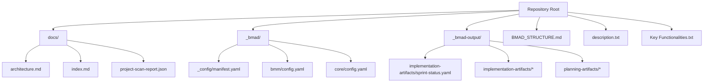
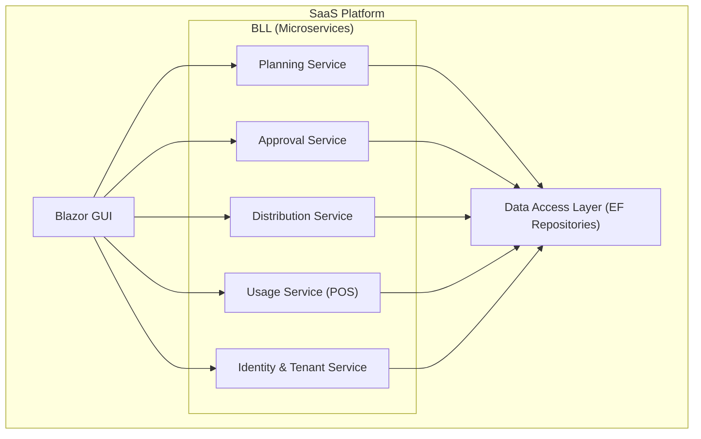
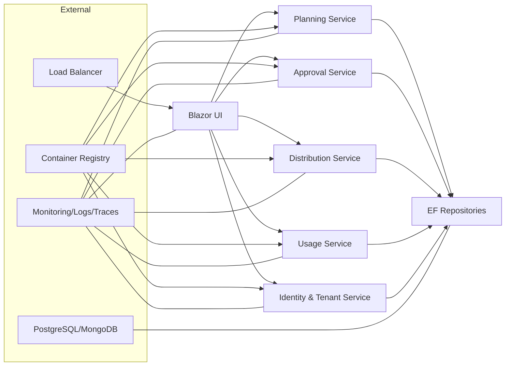
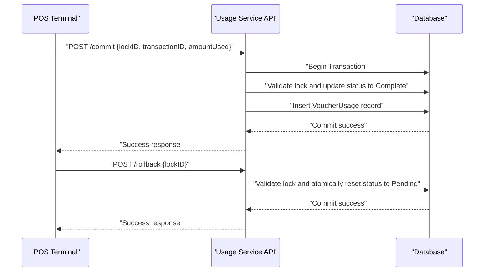

# Deployment Strategies and Infrastructure

<cite>
**Referenced Files in This Document**
- [BMAD_STRUCTURE.md](file://BMAD_STRUCTURE.md)
- [description.txt](file://description.txt)
- [docs/architecture.md](file://docs/architecture.md)
- [docs/index.md](file://docs/index.md)
- [docs/project-scan-report.json](file://docs/project-scan-report.json)
- [_bmad/_config/manifest.yaml](file://_bmad/_config/manifest.yaml)
- [_bmad/bmm/config.yaml](file://_bmad/bmm/config.yaml)
- [_bmad/core/config.yaml](file://_bmad/core/config.yaml)
- [_bmad-output/implementation-artifacts/sprint-status.yaml](file://_bmad-output/implementation-artifacts/sprint-status.yaml)
- [_bmad-output/implementation-artifacts/4-4-rollback-mechanism.md](file://_bmad-output/implementation-artifacts/4-4-rollback-mechanism.md)
- [_bmad-output/implementation-artifacts/4-3-commit-and-log.md](file://_bmad-output/implementation-artifacts/4-3-commit-and-log.md)
- [_bmad-output/planning-artifacts/epics.md](file://_bmad-output/planning-artifacts/epics.md)
</cite>

## Table of Contents
1. [Introduction](#introduction)
2. [Project Structure](#project-structure)
3. [Core Components](#core-components)
4. [Architecture Overview](#architecture-overview)
5. [Detailed Component Analysis](#detailed-component-analysis)
6. [Dependency Analysis](#dependency-analysis)
7. [Performance Considerations](#performance-considerations)
8. [Troubleshooting Guide](#troubleshooting-guide)
9. [Conclusion](#conclusion)
10. [Appendices](#appendices)

## Introduction
This document defines a comprehensive deployment strategy for the NonCash SaaS platform. It covers cloud providers (Azure, AWS), on-premises infrastructure, containerization and orchestration (Docker, Kubernetes), microservices deployment patterns, CI/CD and infrastructure-as-code (IaC), high availability, load balancing, auto-scaling, database migration and zero-downtime deployment, rollback procedures, and production monitoring/logging/alerting. The guidance is grounded in the project’s documented architecture and implementation artifacts.

## Project Structure
The repository includes:
- Architectural and planning documentation under docs/
- BMAD configuration and planning artifacts under _bmad/ and _bmad-output/
- A project scan report indicating a backend-focused conceptual monolith classification
- Implementation-ready stories for core services (planning, approval, distribution, usage, identity/tenant)

**Diagram sources**
- [BMAD_STRUCTURE.md:1-82](file://BMAD_STRUCTURE.md#L1-L82)
- [description.txt:1-31](file://description.txt#L1-L31)
- [docs/architecture.md:1-26](file://docs/architecture.md#L1-L26)
- [docs/project-scan-report.json:1-23](file://docs/project-scan-report.json#L1-L23)
- [_bmad/_config/manifest.yaml:1-25](file://_bmad/_config/manifest.yaml#L1-L25)
- [_bmad/bmm/config.yaml:1-17](file://_bmad/bmm/config.yaml#L1-L17)
- [_bmad/core/config.yaml:1-10](file://_bmad/core/config.yaml#L1-L10)
- [_bmad-output/implementation-artifacts/sprint-status.yaml:1-81](file://_bmad-output/implementation-artifacts/sprint-status.yaml#L1-L81)

**Section sources**
- [BMAD_STRUCTURE.md:1-82](file://BMAD_STRUCTURE.md#L1-L82)
- [description.txt:1-31](file://description.txt#L1-L31)
- [docs/architecture.md:1-26](file://docs/architecture.md#L1-L26)
- [docs/project-scan-report.json:1-23](file://docs/project-scan-report.json#L1-L23)
- [_bmad/_config/manifest.yaml:1-25](file://_bmad/_config/manifest.yaml#L1-L25)
- [_bmad/bmm/config.yaml:1-17](file://_bmad/bmm/config.yaml#L1-L17)
- [_bmad/core/config.yaml:1-10](file://_bmad/core/config.yaml#L1-L10)
- [_bmad-output/implementation-artifacts/sprint-status.yaml:1-81](file://_bmad-output/implementation-artifacts/sprint-status.yaml#L1-L81)

## Core Components
- Three-layer SaaS architecture with a GUI (Blazor), BLL (microservices), and DAL (Entity Framework repositories).
- Microservices identified by implementation artifacts: Planning, Approval, Distribution, Usage (POS), Identity & Tenant.
- Database choice: PostgreSQL or MongoDB (PostgreSQL preferred).
- Security: API Key Authentication and JWT Token Management.
- SaaS deployment model with web accessibility.

These components inform deployment decisions around service boundaries, data persistence, authentication, and runtime scaling.

**Section sources**
- [BMAD_STRUCTURE.md:37-78](file://BMAD_STRUCTURE.md#L37-L78)
- [description.txt:11-27](file://description.txt#L11-L27)
- [docs/architecture.md:5-26](file://docs/architecture.md#L5-L26)
- [_bmad-output/implementation-artifacts/sprint-status.yaml:44-81](file://_bmad-output/implementation-artifacts/sprint-status.yaml#L44-L81)

## Architecture Overview
The NonCash platform is a SaaS with a 3-layer architecture and microservices in the BLL. The Usage service orchestrates POS redemption with explicit commit/rollback semantics, while other services handle planning, approvals, distribution, and identity/tenant management.

**Diagram sources**
- [docs/architecture.md:9-26](file://docs/architecture.md#L9-L26)
- [BMAD_STRUCTURE.md:39-56](file://BMAD_STRUCTURE.md#L39-L56)

**Section sources**
- [docs/architecture.md:1-26](file://docs/architecture.md#L1-L26)
- [BMAD_STRUCTURE.md:37-56](file://BMAD_STRUCTURE.md#L37-L56)

## Detailed Component Analysis

### Cloud Deployment Options
- Azure
  - Use Azure Kubernetes Service (AKS) for managed Kubernetes, Azure Container Registry (ACR) for image storage, Azure SQL or Managed PostgreSQL for databases, Application Gateway or Azure Front Door for load balancing, and Azure Monitor for observability.
  - Enable auto-scaling via Horizontal Pod Autoscaler (HPA) and cluster auto-scaler.
- AWS
  - Use Amazon EKS for managed Kubernetes, Amazon ECR for images, RDS or Amazon DocumentDB for databases, Application Load Balancer for traffic, and CloudWatch for monitoring.
  - Enable auto-scaling with HPA and Cluster Autoscaler.
- On-Premises
  - Deploy self-managed Kubernetes (kubeadm, RKE, or Rancher RKE2) with private registry, on-premises PostgreSQL, and hardware load balancers.
  - Ensure redundant control planes, etcd, and worker nodes for HA.

### Containerization and Orchestration
- Build images per microservice with multi-stage builds to minimize attack surface.
- Use Helm charts or Kustomize for declarative deployments.
- Enforce pod anti-affinity, topology spread constraints, and resource requests/limits.
- Persist stateful workloads (PostgreSQL) with PersistentVolumes and backups.

### CI/CD Pipeline and Infrastructure as Code
- IaC: Terraform (AzureRM/AWS provider) or ARM/Terraform for AWS to provision clusters, registries, databases, and networking.
- CI/CD: GitHub Actions/Azure Pipelines/Jenkins to build/test/publish images, apply manifests via ArgoCD/Flux, and gate releases.
- GitOps: Track deployments in a separate repo; use pull requests for changes; enforce policy checks.

### High Availability, Load Balancing, and Auto-Scaling
- LB: Ingress controllers (NGINX/KIC) or cloud-native ALB/Front Door.
- HPA: Scale microservices based on CPU/memory or custom metrics.
- Cluster autoscaler: Add/remove nodes based on pod resource requests.
- Anti-affinity and topology constraints to distribute pods across zones/nodes.

### Database Migration and Zero-Downtime Deployments
- Use rolling updates with readiness probes to avoid dropping connections.
- For schema changes:
  - Use idempotent migrations and versioned scripts.
  - Prefer additive-only changes where possible; soft-deprecate fields with backward compatibility.
  - For breaking changes, deploy alongside old logic and switch traffic gradually.
- PostgreSQL: Leverage logical replication or read replicas for read scaling; use citus or Citus Data for horizontal scaling if needed.
- MongoDB: Use replica sets for HA; sharding for scale.

### Rollback Procedures
- Maintain immutable images tagged by semantic versions; rollback by redeploying previous tag.
- For database changes, keep reversible migrations and snapshot backups.
- Use blue/green or canary deployments to limit blast radius; roll back on health probe failures.

### Monitoring, Logging, and Alerting
- Observability stack: Prometheus/Grafana or cloud-native alternatives; Loki for logs; Tempo for traces.
- Centralized structured logging with correlation IDs; include tenant and outlet context.
- Alerting on latency p95, error rates, saturation, and critical events.

**Section sources**
- [docs/architecture.md:5-26](file://docs/architecture.md#L5-L26)
- [BMAD_STRUCTURE.md:59-78](file://BMAD_STRUCTURE.md#L59-L78)
- [_bmad-output/implementation-artifacts/4-3-commit-and-log.md:79-99](file://_bmad-output/implementation-artifacts/4-3-commit-and-log.md#L79-L99)
- [_bmad-output/implementation-artifacts/4-4-rollback-mechanism.md:13-43](file://_bmad-output/implementation-artifacts/4-4-rollback-mechanism.md#L13-L43)

## Dependency Analysis
The project’s architecture and artifacts indicate a microservices-based BLL with clear service boundaries. The Usage service depends on transactional integrity and POS integration, while others depend on shared repositories and authentication.

**Diagram sources**
- [docs/architecture.md:9-26](file://docs/architecture.md#L9-L26)
- [BMAD_STRUCTURE.md:39-56](file://BMAD_STRUCTURE.md#L39-L56)

**Section sources**
- [docs/architecture.md:1-26](file://docs/architecture.md#L1-L26)
- [BMAD_STRUCTURE.md:37-56](file://BMAD_STRUCTURE.md#L37-L56)

## Performance Considerations
- Optimize queries and use connection pooling; prefer async patterns in the BLL.
- Cache hot data (e.g., brand/outlet metadata) with short TTLs; invalidate on changes.
- Use circuit breakers and bulkheads for resilience; implement idempotency keys for POS endpoints.
- Right-size containers and enable vertical pod autoscaling for bursty loads.

## Troubleshooting Guide
Common operational issues and resolutions:
- POS commit/rollback failures
  - Validate lock existence and expiration; ensure atomic transaction boundaries; confirm idempotency constraints.
  - Use audit logs to trace transactionID collisions and expired locks.
- Rollback not releasing voucher
  - Confirm rollback endpoint validation and atomic update; ensure expired locks are handled gracefully.
- Database migration errors
  - Run reversible migrations; test in staging; rollback to previous version if needed.
- Health and readiness probes failing
  - Increase timeouts; adjust thresholds; verify DB connectivity and secrets mounting.

**Section sources**
- [_bmad-output/implementation-artifacts/4-3-commit-and-log.md:62-99](file://_bmad-output/implementation-artifacts/4-3-commit-and-log.md#L62-L99)
- [_bmad-output/implementation-artifacts/4-4-rollback-mechanism.md:62-100](file://_bmad-output/implementation-artifacts/4-4-rollback-mechanism.md#L62-L100)

## Conclusion
The NonCash platform is architected for SaaS delivery with clear microservices boundaries and transactional rigor in the POS workflow. The deployment strategy should emphasize containerization, managed Kubernetes, GitOps, and robust observability. Adhering to zero-downtime deployment practices, careful database migrations, and strong rollback procedures will ensure reliable production operations across Azure, AWS, or on-premises environments.

## Appendices

### Appendix A: Microservices Inventory
- Planning Service
- Approval Service
- Distribution Service
- Usage Service (POS)
- Identity & Tenant Service

**Section sources**
- [docs/architecture.md:17-26](file://docs/architecture.md#L17-L26)
- [_bmad-output/implementation-artifacts/sprint-status.yaml:44-81](file://_bmad-output/implementation-artifacts/sprint-status.yaml#L44-L81)

### Appendix B: Database and Security Notes
- Database: PostgreSQL or MongoDB (PostgreSQL preferred).
- Security: API Key Authentication and JWT Token Management.

**Section sources**
- [BMAD_STRUCTURE.md:59-78](file://BMAD_STRUCTURE.md#L59-L78)
- [description.txt:22-24](file://description.txt#L22-L24)

### Appendix C: POS Transaction Flow (Commit/Rollback)

**Diagram sources**
- [_bmad-output/implementation-artifacts/4-3-commit-and-log.md:43-99](file://_bmad-output/implementation-artifacts/4-3-commit-and-log.md#L43-L99)
- [_bmad-output/implementation-artifacts/4-4-rollback-mechanism.md:13-43](file://_bmad-output/implementation-artifacts/4-4-rollback-mechanism.md#L13-L43)