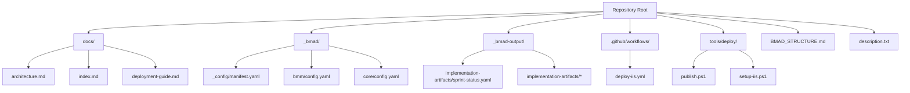
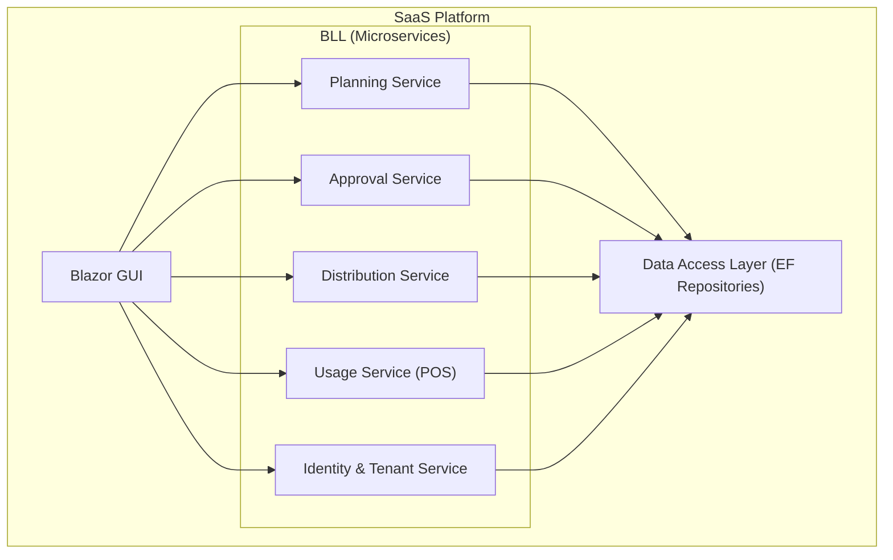
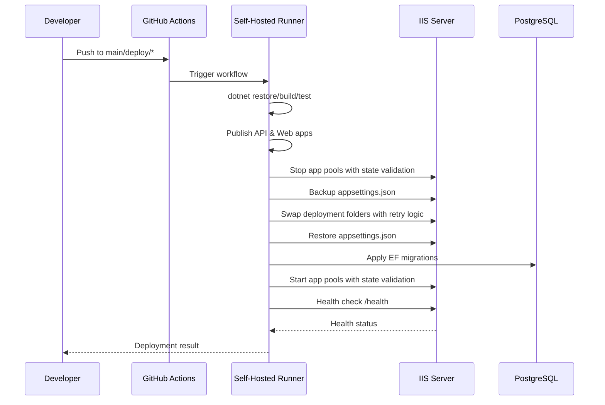
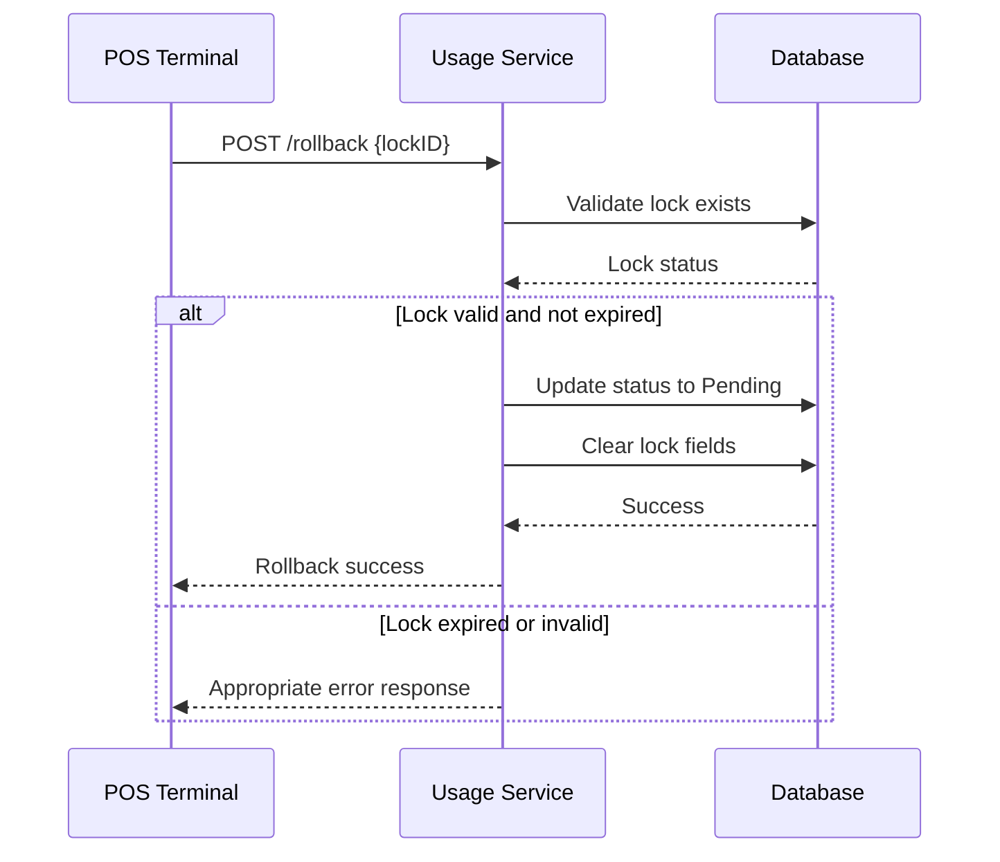
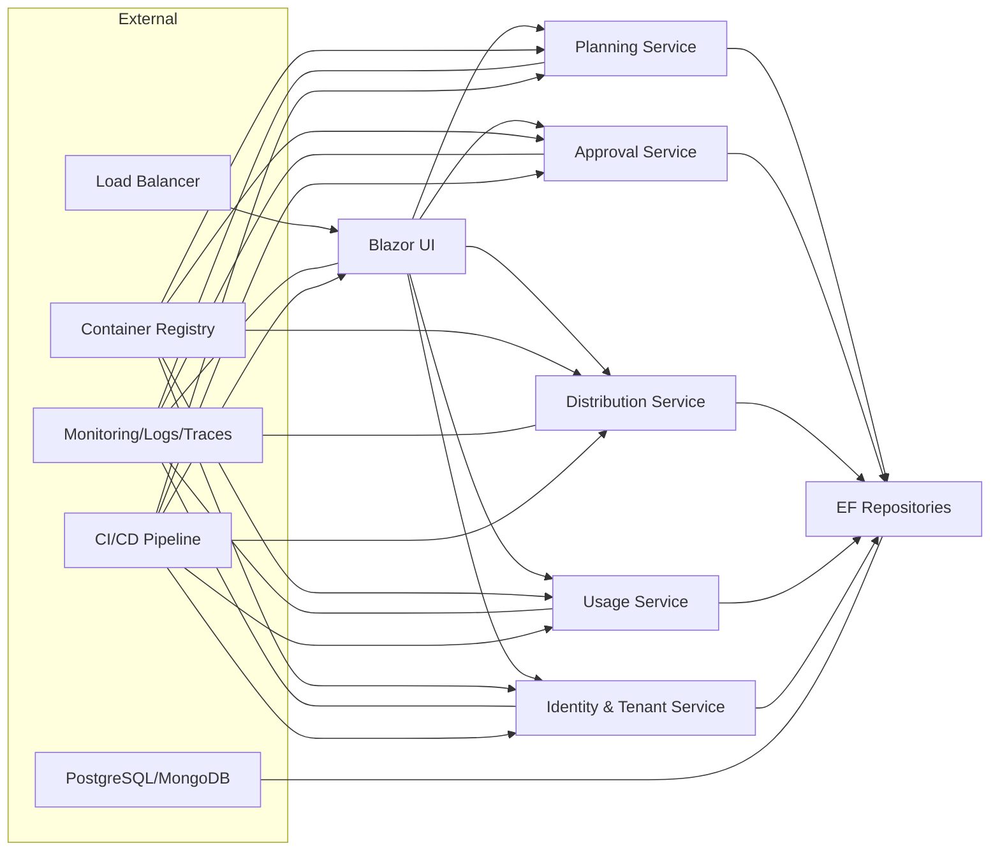
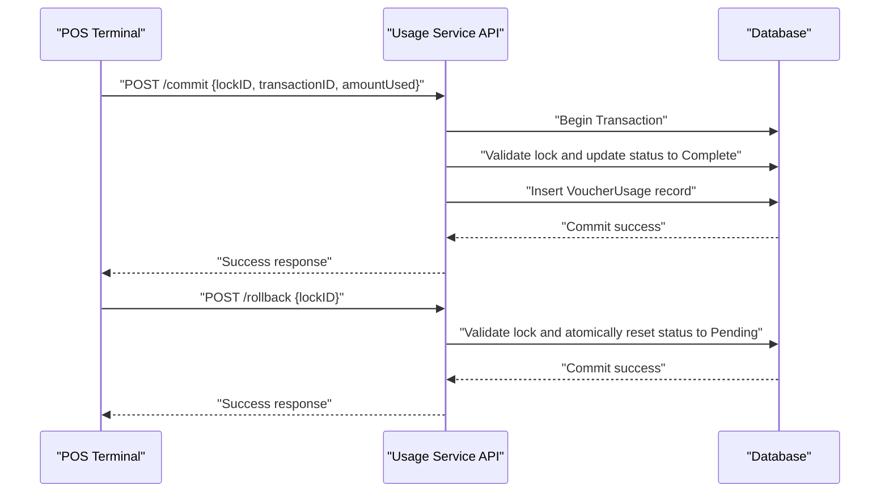
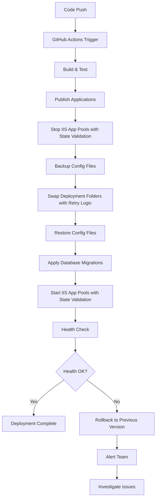

# Deployment Strategies and Infrastructure

<cite>
**Referenced Files in This Document**
- [BMAD_STRUCTURE.md](file://BMAD_STRUCTURE.md)
- [description.txt](file://description.txt)
- [docs/architecture.md](file://docs/architecture.md)
- [docs/index.md](file://docs/index.md)
- [docs/project-scan-report.json](file://docs/project-scan-report.json)
- [_bmad/_config/manifest.yaml](file://_bmad/_config/manifest.yaml)
- [_bmad/bmm/config.yaml](file://_bmad/bmm/config.yaml)
- [_bmad/core/config.yaml](file://_bmad/core/config.yaml)
- [_bmad-output/implementation-artifacts/sprint-status.yaml](file://_bmad-output/implementation-artifacts/sprint-status.yaml)
- [_bmad-output/implementation-artifacts/4-4-rollback-mechanism.md](file://_bmad-output/implementation-artifacts/4-4-rollback-mechanism.md)
- [_bmad-output/implementation-artifacts/4-3-commit-and-log.md](file://_bmad-output/implementation-artifacts/4-3-commit-and-log.md)
- [_bmad-output/planning-artifacts/epics.md](file://_bmad-output/planning-artifacts/epics.md)
- [.github/workflows/deploy-iis.yml](file://.github/workflows/deploy-iis.yml)
- [tools/deploy/publish.ps1](file://tools/deploy/publish.ps1)
- [tools/deploy/setup-iis.ps1](file://tools/deploy/setup-iis.ps1)
- [docs/deployment-guide.md](file://docs/deployment-guide.md)
</cite>

## Update Summary
**Changes Made**
- Enhanced CI/CD pipeline with comprehensive backup/restore mechanisms for production configuration files
- Improved rollback capabilities with automatic previous version preservation
- Better directory structure organization for deployment artifacts
- Updated GitHub Actions workflow with enhanced operational procedures
- Added comprehensive production deployment guide with security hardening measures
- **Updated**: Enhanced IIS deployment workflow with improved state management, retry logic for file operations, simplified .NET setup, and better error handling

## Table of Contents
1. [Introduction](#introduction)
2. [Project Structure](#project-structure)
3. [Core Components](#core-components)
4. [Architecture Overview](#architecture-overview)
5. [Detailed Component Analysis](#detailed-component-analysis)
6. [Enhanced CI/CD Pipeline](#enhanced-cicd-pipeline)
7. [Production Deployment Procedures](#production-deployment-procedures)
8. [Backup and Restore Mechanisms](#backup-and-restore-mechanisms)
9. [Rollback Capabilities](#rollback-capabilities)
10. [Dependency Analysis](#dependency-analysis)
11. [Performance Considerations](#performance-considerations)
12. [Troubleshooting Guide](#troubleshooting-guide)
13. [Conclusion](#conclusion)
14. [Appendices](#appendices)

## Introduction
This document defines a comprehensive deployment strategy for the NonCash SaaS platform with enhanced CI/CD capabilities. It covers cloud providers (Azure, AWS), on-premises infrastructure, containerization and orchestration (Docker, Kubernetes), microservices deployment patterns, advanced CI/CD pipelines with automated backup/restore, high availability, load balancing, auto-scaling, database migration and zero-downtime deployment, sophisticated rollback procedures, and production monitoring/logging/alerting. The guidance is grounded in the project's documented architecture and implementation artifacts, with significant enhancements to deployment automation and operational procedures.

## Project Structure
The repository includes:
- Architectural and planning documentation under docs/
- BMAD configuration and planning artifacts under _bmad/ and _bmad-output/
- Enhanced CI/CD workflows under .github/workflows/
- Comprehensive deployment tools under tools/deploy/
- A project scan report indicating a backend-focused conceptual monolith classification
- Implementation-ready stories for core services (planning, approval, distribution, usage, identity/tenant)


```mermaid
graph TB
A["Repository Root"] --> B["docs/"]
A --> C["_bmad/"]
A --> D["_bmad-output/"]
A --> E[".github/workflows/"]
A --> F["tools/deploy/"]
A --> G["BMAD_STRUCTURE.md"]
A --> H["description.txt"]
B --> B1["architecture.md"]
B --> B2["index.md"]
B --> B3["deployment-guide.md"]
C --> C1["_config/manifest.yaml"]
C --> C2["bmm/config.yaml"]
C --> C3["core/config.yaml"]
D --> D1["implementation-artifacts/sprint-status.yaml"]
D --> D2["implementation-artifacts/*"]
E --> E1["deploy-iis.yml"]
F --> F1["publish.ps1"]
F --> F2["setup-iis.ps1"]
```

**Diagram sources**
- [BMAD_STRUCTURE.md:1-82](file://BMAD_STRUCTURE.md#L1-L82)
- [description.txt:1-31](file://description.txt#L1-L31)
- [docs/architecture.md:1-26](file://docs/architecture.md#L1-L26)
- [docs/project-scan-report.json:1-23](file://docs/project-scan-report.json#L1-L23)
- [_bmad/_config/manifest.yaml:1-25](file://_bmad/_config/manifest.yaml#L1-L25)
- [_bmad/bmm/config.yaml:1-17](file://_bmad/bmm/config.yaml#L1-L17)
- [_bmad/core/config.yaml:1-10](file://_bmad/core/config.yaml#L1-L10)
- [_bmad-output/implementation-artifacts/sprint-status.yaml:1-81](file://_bmad-output/implementation-artifacts/sprint-status.yaml#L1-L81)
- [.github/workflows/deploy-iis.yml:1-175](file://.github/workflows/deploy-iis.yml#L1-L175)
- [tools/deploy/publish.ps1:1-56](file://tools/deploy/publish.ps1#L1-L56)
- [tools/deploy/setup-iis.ps1:1-68](file://tools/deploy/setup-iis.ps1#L1-L68)

**Section sources**
- [BMAD_STRUCTURE.md:1-82](file://BMAD_STRUCTURE.md#L1-L82)
- [description.txt:1-31](file://description.txt#L1-L31)
- [docs/architecture.md:1-26](file://docs/architecture.md#L1-L26)
- [docs/project-scan-report.json:1-23](file://docs/project-scan-report.json#L1-L23)
- [_bmad/_config/manifest.yaml:1-25](file://_bmad/_config/manifest.yaml#L1-L25)
- [_bmad/bmm/config.yaml:1-17](file://_bmad/bmm/config.yaml#L1-L17)
- [_bmad/core/config.yaml:1-10](file://_bmad/core/config.yaml#L1-L10)
- [_bmad-output/implementation-artifacts/sprint-status.yaml:1-81](file://_bmad-output/implementation-artifacts/sprint-status.yaml#L1-L81)

## Core Components
- Three-layer SaaS architecture with a GUI (Blazor), BLL (microservices), and DAL (Entity Framework repositories).
- Microservices identified by implementation artifacts: Planning, Approval, Distribution, Usage (POS), Identity & Tenant.
- Database choice: PostgreSQL or MongoDB (PostgreSQL preferred).
- Security: API Key Authentication and JWT Token Management.
- SaaS deployment model with web accessibility.
- **Enhanced**: Automated CI/CD pipeline with backup/restore capabilities and rollback mechanisms.

These components inform deployment decisions around service boundaries, data persistence, authentication, runtime scaling, and automated deployment operations.

**Section sources**
- [BMAD_STRUCTURE.md:37-78](file://BMAD_STRUCTURE.md#L37-L78)
- [description.txt:11-27](file://description.txt#L11-L27)
- [docs/architecture.md:5-26](file://docs/architecture.md#L5-L26)
- [_bmad-output/implementation-artifacts/sprint-status.yaml:44-81](file://_bmad-output/implementation-artifacts/sprint-status.yaml#L44-L81)

## Architecture Overview
The NonCash platform is a SaaS with a 3-layer architecture and microservices in the BLL. The Usage service orchestrates POS redemption with explicit commit/rollback semantics, while other services handle planning, approvals, distribution, and identity/tenant management.


```mermaid
graph TB
subgraph "SaaS Platform"
UI["Blazor GUI"]
subgraph "BLL (Microservices)"
P["Planning Service"]
A["Approval Service"]
D["Distribution Service"]
U["Usage Service (POS)"]
I["Identity & Tenant Service"]
end
DAL["Data Access Layer (EF Repositories)"]
end
UI --> P
UI --> A
UI --> D
UI --> U
UI --> I
P --> DAL
A --> DAL
D --> DAL
U --> DAL
I --> DAL
```

**Diagram sources**
- [docs/architecture.md:9-26](file://docs/architecture.md#L9-L26)
- [BMAD_STRUCTURE.md:39-56](file://BMAD_STRUCTURE.md#L39-L56)

**Section sources**
- [docs/architecture.md:1-26](file://docs/architecture.md#L1-L26)
- [BMAD_STRUCTURE.md:37-56](file://BMAD_STRUCTURE.md#L37-L56)

## Detailed Component Analysis

### Cloud Deployment Options
- Azure
  - Use Azure Kubernetes Service (AKS) for managed Kubernetes, Azure Container Registry (ACR) for image storage, Azure SQL or Managed PostgreSQL for databases, Application Gateway or Azure Front Door for load balancing, and Azure Monitor for observability.
  - Enable auto-scaling via Horizontal Pod Autoscaler (HPA) and cluster auto-scaler.
- AWS
  - Use Amazon EKS for managed Kubernetes, Amazon ECR for images, RDS or Amazon DocumentDB for databases, Application Load Balancer for traffic, and CloudWatch for monitoring.
  - Enable auto-scaling with HPA and Cluster Autoscaler.
- On-Premises
  - Deploy self-managed Kubernetes (kubeadm, RKE, or Rancher RKE2) with private registry, on-premises PostgreSQL, and hardware load balancers.
  - Ensure redundant control planes, etcd, and worker nodes for HA.
  - **Enhanced**: Support for Windows Server with IIS deployment using automated scripts and GitHub Actions.

### Containerization and Orchestration
- Build images per microservice with multi-stage builds to minimize attack surface.
- Use Helm charts or Kustomize for declarative deployments.
- Enforce pod anti-affinity, topology spread constraints, and resource requests/limits.
- Persist stateful workloads (PostgreSQL) with PersistentVolumes and backups.
- **Enhanced**: Dual deployment support for both containerized environments and traditional IIS hosting.

### CI/CD Pipeline and Infrastructure as Code
- IaC: Terraform (AzureRM/AWS provider) or ARM/Terraform for AWS to provision clusters, registries, databases, and networking.
- CI/CD: GitHub Actions/Azure Pipelines/Jenkins to build/test/publish images, apply manifests via ArgoCD/Flux, and gate releases.
- GitOps: Track deployments in a separate repo; use pull requests for changes; enforce policy checks.
- **Enhanced**: Comprehensive GitHub Actions workflow with automated backup/restore, health checks, and rollback capabilities.

### High Availability, Load Balancing, and Auto-Scaling
- LB: Ingress controllers (NGINX/KIC) or cloud-native ALB/Front Door.
- HPA: Scale microservices based on CPU/memory or custom metrics.
- Cluster autoscaler: Add/remove nodes based on pod resource requests.
- Anti-affinity and topology constraints to distribute pods across zones/nodes.
- **Enhanced**: IIS app pool recycling and health monitoring for traditional deployments.

### Database Migration and Zero-Downtime Deployments
- Use rolling updates with readiness probes to avoid dropping connections.
- For schema changes:
  - Use idempotent migrations and versioned scripts.
  - Prefer additive-only changes where possible; soft-deprecate fields with backward compatibility.
  - For breaking changes, deploy alongside old logic and switch traffic gradually.
- PostgreSQL: Leverage logical replication or read replicas for read scaling; use citus or Citus Data for horizontal scaling if needed.
- MongoDB: Use replica sets for HA; sharding for scale.
- **Enhanced**: Automated EF Core migration execution with connection string secrets management.

### Rollback Procedures
- Maintain immutable images tagged by semantic versions; rollback by redeploying previous tag.
- For database changes, keep reversible migrations and snapshot backups.
- Use blue/green or canary deployments to limit blast radius; roll back on health probe failures.
- **Enhanced**: Automatic previous version preservation with `_prev` folder naming convention and one-click rollback capability.

### Monitoring, Logging, and Alerting
- Observability stack: Prometheus/Grafana or cloud-native alternatives; Loki for logs; Tempo for traces.
- Centralized structured logging with correlation IDs; include tenant and outlet context.
- Alerting on latency p95, error rates, saturation, and critical events.
- **Enhanced**: Health check endpoints and smoke testing integrated into deployment pipeline.

**Section sources**
- [docs/architecture.md:5-26](file://docs/architecture.md#L5-L26)
- [BMAD_STRUCTURE.md:59-78](file://BMAD_STRUCTURE.md#L59-L78)
- [_bmad-output/implementation-artifacts/4-3-commit-and-log.md:79-99](file://_bmad-output/implementation-artifacts/4-3-commit-and-log.md#L79-L99)
- [_bmad-output/implementation-artifacts/4-4-rollback-mechanism.md:13-43](file://_bmad-output/implementation-artifacts/4-4-rollback-mechanism.md#L13-L43)

## Enhanced CI/CD Pipeline

The NonCash platform features a sophisticated CI/CD pipeline built with GitHub Actions that provides comprehensive deployment automation with enhanced backup/restore capabilities and rollback mechanisms.

### GitHub Actions Workflow Features

The `.github/workflows/deploy-iis.yml` workflow implements a complete deployment pipeline with the following enhanced capabilities:

#### Automated Backup and Restore
- **Pre-deployment backup**: Automatically backs up production `appsettings.json` files before deployment
- **Configuration preservation**: Maintains sensitive production configurations across deployments
- **Automatic restoration**: Restores backed-up configuration files after deployment completes
- **Backup location**: Creates backup files at `{APP_PATH}_appsettings.json` format

#### Intelligent Deployment Process
- **Staging area**: Uses temporary staging directory (`C:\Projects\_stage`) for safe deployment
- **Atomic swaps**: Implements atomic file system operations to prevent partial deployments
- **Previous version preservation**: Automatically creates `_prev` folders for rollback capability
- **App pool management**: Gracefully stops and restarts IIS application pools during deployment

#### Enhanced State Management and Error Handling
- **Improved state tracking**: Better monitoring of IIS site and app pool states before operations
- **Retry logic for file operations**: Robust retry mechanism with 3 attempts for critical file operations
- **Simplified .NET setup**: Skips dotnet SDK installation to avoid permission errors on server
- **Comprehensive error handling**: Detailed exception handling with informative error messages
- **Graceful degradation**: Continues deployment even if health checks fail (with warnings)

#### Environment Configuration
- **Self-hosted runner**: Runs directly on target Windows Server for direct IIS access
- **Secret management**: Uses GitHub Secrets for database connection strings
- **Environment variables**: Configures deployment paths and health check endpoints


```mermaid
sequenceDiagram
participant Dev as Developer
participant GH as GitHub Actions
participant Runner as Self-Hosted Runner
participant IIS as IIS Server
participant DB as PostgreSQL
Dev->>GH : Push to main/deploy/*
GH->>Runner : Trigger workflow
Runner->>Runner : dotnet restore/build/test
Runner->>Runner : Publish API & Web apps
Runner->>IIS : Stop app pools with state validation
Runner->>IIS : Backup appsettings.json
Runner->>IIS : Swap deployment folders with retry logic
Runner->>IIS : Restore appsettings.json
Runner->>DB : Apply EF migrations
Runner->>IIS : Start app pools with state validation
Runner->>IIS : Health check /health
IIS-->>Runner : Health status
Runner-->>Dev : Deployment result
```

**Diagram sources**
- [.github/workflows/deploy-iis.yml:31-175](file://.github/workflows/deploy-iis.yml#L31-L175)

**Section sources**
- [.github/workflows/deploy-iis.yml:1-175](file://.github/workflows/deploy-iis.yml#L1-L175)

## Production Deployment Procedures

### Prerequisites and Setup

#### Server Requirements
- **Operating System**: Windows Server with IIS installed
- **.NET Runtime**: .NET 9 Hosting Bundle (includes ASP.NET Core Module)
- **Database**: PostgreSQL with `noncash` database
- **Permissions**: Service account with IIS and database access rights

#### One-Time Server Preparation
1. **Install IIS**: Server Manager → Web Server (IIS)
2. **Install .NET 9 Hosting Bundle**: Includes ASP.NET Core Module for IIS integration
3. **Configure App Pools**: Create `NonCashAPI` and `NonCashWeb` with No Managed Code
4. **Create Sites**: Set up physical paths and HTTPS bindings
5. **Set Permissions**: Grant Read & Execute permissions to IIS app pool identities
6. **Database Setup**: Ensure PostgreSQL is running and accessible

#### GitHub Actions Setup
1. **Install Self-Hosted Runner**: Download and configure Windows runner on server
2. **Register Runner**: Add labels `self-hosted, windows` or custom label
3. **Install as Service**: Run `svc.cmd install` and `svc.cmd start`
4. **Configure Secrets**: Add `NONCASH_DB_CONNECTION` secret to repository

### Deployment Methods

#### Method 1: GitHub Actions (Recommended)
Push to `main` branch or any branch matching `deploy/*` pattern:

```bash
git checkout -b deploy/2026-08-18
# Make your changes and commit
git push origin deploy/2026-08-18
```

The workflow automatically handles the entire deployment process including backup, deployment, migration, and health checks.

#### Method 2: Manual Scripted Deployment
For initial setup or manual deployments:

```powershell
# Publish applications
.\tools\deploy\publish.ps1 -DeployRoot "C:\inetpub\noncash"

# Apply database migrations
dotnet ef database update --project src\NonCash.Infrastructure --startup-project src\NonCash.API --connection "YourConnectionString"

# Recycle app pools
Import-Module WebAdministration
Restart-WebAppPool NonCashAPI, NonCashWeb
```

### Post-Deployment Verification

#### Health Checks
- **API Health**: `https://api.yourdomain.com/health`
- **Web Interface**: Verify login functionality and API connectivity
- **Email Notifications**: Test email delivery through `email_logs` table
- **Database Connectivity**: Confirm migrations applied successfully

#### Monitoring and Logging
- **Windows Event Log**: Check for startup errors and application events
- **Application Logs**: Review stdout logs for detailed debugging information
- **Database Logs**: Monitor PostgreSQL logs for query performance and errors

**Section sources**
- [docs/deployment-guide.md:1-228](file://docs/deployment-guide.md#L1-L228)
- [tools/deploy/publish.ps1:1-56](file://tools/deploy/publish.ps1#L1-L56)
- [tools/deploy/setup-iis.ps1:1-68](file://tools/deploy/setup-iis.ps1#L1-L68)

## Backup and Restore Mechanisms

### Automated Configuration Backup

The deployment pipeline implements comprehensive backup and restore mechanisms to protect production configurations:

#### Pre-Deployment Backup Process
1. **Detection**: Scans for existing `appsettings.json` files in deployment directories
2. **Backup Creation**: Creates timestamped backup files with `_appsettings.json` suffix
3. **Verification**: Confirms backup files were created successfully
4. **Logging**: Records backup operations for audit trail

#### Post-Deployment Restore Process
1. **Automatic Restoration**: Restores backed-up configuration files after deployment
2. **Validation**: Verifies restored files are intact and readable
3. **Error Handling**: Continues deployment even if restore fails (with warnings)
4. **Cleanup**: Removes temporary backup files after successful restore

#### Configuration File Locations
- **API Configuration**: `C:\Projects\NonCashAPI\appsettings.json`
- **Web Configuration**: `C:\Projects\NonCashWeb\appsettings.json`
- **Backup Files**: `C:\Projects\NonCashAPI_appsettings.json`, `C:\Projects\NonCashWeb_appsettings.json`

### Database Backup Strategy

#### Migration-Based Approach
- **Idempotent Migrations**: All EF Core migrations are designed to be safely re-run
- **Version Tracking**: EF tracks applied migrations in `__EFMigrationsHistory` table
- **Rollback Capability**: Previous migration states preserved for rollback scenarios

#### Manual Backup Procedures
```sql
-- Full database backup
pg_dump -U postgres noncash > noncash_backup_$(date +%Y%m%d_%H%M%S).sql

-- Schema-only backup
pg_dump -U postgres -s noncash > schema_backup_$(date +%Y%m%d_%H%M%S).sql

-- Data-only backup
pg_dump -U postgres -a noncash > data_backup_$(date +%Y%m%d_%H%M%S).sql
```

**Section sources**
- [.github/workflows/deploy-iis.yml:74-136](file://.github/workflows/deploy-iis.yml#L74-L136)
- [docs/deployment-guide.md:108-148](file://docs/deployment-guide.md#L108-L148)

## Rollback Capabilities

### Application-Level Rollback

The deployment system implements robust rollback capabilities through automatic version preservation:

#### Automatic Version Preservation
- **Previous Version Storage**: Each deployment preserves the previous version in `_prev` folders
- **Atomic Swaps**: Uses file system rename operations for instant rollback capability
- **Directory Structure**: 
  - Current: `C:\Projects\NonCashAPI`, `C:\Projects\NonCashWeb`
  - Previous: `C:\Projects\NonCashAPI_prev`, `C:\Projects\NonCashWeb_prev`

#### Manual Rollback Procedure
```powershell
# Quick rollback to previous version
Remove-Item "C:\Projects\NonCashAPI" -Recurse -Force
Rename-Item "C:\Projects\NonCashAPI_prev" "C:\Projects\NonCashAPI"
Remove-Item "C:\Projects\NonCashWeb" -Recurse -Force
Rename-Item "C:\Projects\NonCashWeb_prev" "C:\Projects\NonCashWeb"

# Restart applications
Import-Module WebAdministration
Restart-WebAppPool NonCashAPI, NonCashWeb
```

### Database Rollback Strategy

#### Migration Rollback
```powershell
# Rollback to specific migration
dotnet ef database update <MigrationName> --project src\NonCash.Infrastructure --startup-project src\NonCash.API --connection "YourConnectionString"

# Rollback all migrations (use with caution)
dotnet ef database drop --project src\NonCash.Infrastructure --startup-project src\NonCash.API --connection "YourConnectionString"
```

#### Point-in-Time Recovery
- **Database Backups**: Regular PostgreSQL backups enable point-in-time recovery
- **Transaction Logs**: WAL archiving allows recovery to specific timestamps
- **Testing**: Always test rollback procedures in staging environment first

### POS Transaction Rollback

The platform includes sophisticated rollback mechanisms for POS transactions:

#### Voucher Rollback Endpoint
- **Endpoint**: `POST /api/v1/pos/rollback`
- **Functionality**: Releases locked vouchers back to pending status
- **Safety**: Validates lock existence, expiration, and transaction integrity
- **Idempotency**: Safe to call multiple times without side effects

#### Rollback Scenarios
1. **Successful Rollback**: Voucher returns to `Pending` status
2. **Already Complete**: Returns 409 conflict if voucher already used
3. **Expired Lock**: Handles gracefully if lock has expired
4. **Invalid Lock**: Returns appropriate error for non-existent locks


```mermaid
sequenceDiagram
participant POS as POS Terminal
participant API as Usage Service
participant DB as Database
POS->>API : POST /rollback {lockID}
API->>DB : Validate lock exists
DB-->>API : Lock status
alt Lock valid and not expired
API->>DB : Update status to Pending
API->>DB : Clear lock fields
DB-->>API : Success
API-->>POS : Rollback success
else Lock expired or invalid
API-->>POS : Appropriate error response
end
```

**Diagram sources**
- [_bmad-output/implementation-artifacts/4-4-rollback-mechanism.md:13-43](file://_bmad-output/implementation-artifacts/4-4-rollback-mechanism.md#L13-L43)

**Section sources**
- [.github/workflows/deploy-iis.yml:87-123](file://.github/workflows/deploy-iis.yml#L87-L123)
- [_bmad-output/implementation-artifacts/4-4-rollback-mechanism.md:1-112](file://_bmad-output/implementation-artifacts/4-4-rollback-mechanism.md#L1-L112)
- [docs/deployment-guide.md:199-203](file://docs/deployment-guide.md#L199-L203)

## Dependency Analysis
The project's architecture and artifacts indicate a microservices-based BLL with clear service boundaries. The Usage service depends on transactional integrity and POS integration, while others depend on shared repositories and authentication.


```mermaid
graph LR
UI["Blazor UI"] --> P["Planning Service"]
UI --> A["Approval Service"]
UI --> D["Distribution Service"]
UI --> U["Usage Service"]
UI --> I["Identity & Tenant Service"]
P --> DAL["EF Repositories"]
A --> DAL
D --> DAL
U --> DAL
I --> DAL
subgraph "External"
LB["Load Balancer"]
REG["Container Registry"]
DB["PostgreSQL/MongoDB"]
MON["Monitoring/Logs/Traces"]
CI["CI/CD Pipeline"]
end
LB --> UI
REG --> P
REG --> A
REG --> D
REG --> U
REG --> I
DB --- DAL
MON --- UI
MON --- P
MON --- A
MON --- D
MON --- U
MON --- I
CI --> UI
CI --> P
CI --> A
CI --> D
CI --> U
CI --> I
```

**Diagram sources**
- [docs/architecture.md:9-26](file://docs/architecture.md#L9-L26)
- [BMAD_STRUCTURE.md:39-56](file://BMAD_STRUCTURE.md#L39-L56)
- [.github/workflows/deploy-iis.yml:31-175](file://.github/workflows/deploy-iis.yml#L31-L175)

**Section sources**
- [docs/architecture.md:1-26](file://docs/architecture.md#L1-L26)
- [BMAD_STRUCTURE.md:37-56](file://BMAD_STRUCTURE.md#L37-L56)

## Performance Considerations
- Optimize queries and use connection pooling; prefer async patterns in the BLL.
- Cache hot data (e.g., brand/outlet metadata) with short TTLs; invalidate on changes.
- Use circuit breakers and bulkheads for resilience; implement idempotency keys for POS endpoints.
- Right-size containers and enable vertical pod autoscaling for bursty loads.
- **Enhanced**: Implement connection pooling for database connections and optimize IIS app pool settings for concurrent request handling.

## Troubleshooting Guide
Common operational issues and resolutions:
- POS commit/rollback failures
  - Validate lock existence and expiration; ensure atomic transaction boundaries; confirm idempotency constraints.
  - Use audit logs to trace transactionID collisions and expired locks.
- Rollback not releasing voucher
  - Confirm rollback endpoint validation and atomic update; ensure expired locks are handled gracefully.
- Database migration errors
  - Run reversible migrations; test in staging; rollback to previous version if needed.
- Health and readiness probes failing
  - Increase timeouts; adjust thresholds; verify DB connectivity and secrets mounting.
- **Enhanced**: Deployment failures
  - Check GitHub Actions workflow logs for detailed error messages
  - Verify IIS app pool status and application event logs
  - Validate database connectivity and migration status
  - Review backup/restore operations for configuration issues
  - **New**: File operation failures - Check for file locks and retry logic effectiveness
  - **New**: Permission errors - Verify runner service account has proper IIS and file system permissions

**Section sources**
- [_bmad-output/implementation-artifacts/4-3-commit-and-log.md:62-99](file://_bmad-output/implementation-artifacts/4-3-commit-and-log.md#L62-L99)
- [_bmad-output/implementation-artifacts/4-4-rollback-mechanism.md:62-100](file://_bmad-output/implementation-artifacts/4-4-rollback-mechanism.md#L62-L100)
- [docs/deployment-guide.md:190-228](file://docs/deployment-guide.md#L190-L228)

## Conclusion
The NonCash platform is architected for SaaS delivery with clear microservices boundaries and transactional rigor in the POS workflow. The enhanced deployment strategy emphasizes containerization, managed Kubernetes, GitOps, and robust observability, with significant improvements to CI/CD automation, backup/restore mechanisms, and rollback capabilities. Adhering to zero-downtime deployment practices, careful database migrations, and strong rollback procedures will ensure reliable production operations across Azure, AWS, or on-premises environments. The enhanced GitHub Actions workflow provides comprehensive deployment automation with built-in safety mechanisms and operational procedures for production deployments.

## Appendices

### Appendix A: Microservices Inventory
- Planning Service
- Approval Service
- Distribution Service
- Usage Service (POS)
- Identity & Tenant Service

**Section sources**
- [docs/architecture.md:17-26](file://docs/architecture.md#L17-L26)
- [_bmad-output/implementation-artifacts/sprint-status.yaml:44-81](file://_bmad-output/implementation-artifacts/sprint-status.yaml#L44-L81)

### Appendix B: Database and Security Notes
- Database: PostgreSQL or MongoDB (PostgreSQL preferred).
- Security: API Key Authentication and JWT Token Management.
- **Enhanced**: Production configuration management with secure backup/restore procedures.

**Section sources**
- [BMAD_STRUCTURE.md:59-78](file://BMAD_STRUCTURE.md#L59-L78)
- [description.txt:22-24](file://description.txt#L22-L24)

### Appendix C: POS Transaction Flow (Commit/Rollback)

```mermaid
sequenceDiagram
participant POS as "POS Terminal"
participant API as "Usage Service API"
participant DB as "Database"
POS->>API : "POST /commit {lockID, transactionID, amountUsed}"
API->>DB : "Begin Transaction"
API->>DB : "Validate lock and update status to Complete"
API->>DB : "Insert VoucherUsage record"
DB-->>API : "Commit success"
API-->>POS : "Success response"
POS->>API : "POST /rollback {lockID}"
API->>DB : "Validate lock and atomically reset status to Pending"
DB-->>API : "Commit success"
API-->>POS : "Success response"
```

**Diagram sources**
- [_bmad-output/implementation-artifacts/4-3-commit-and-log.md:43-99](file://_bmad-output/implementation-artifacts/4-3-commit-and-log.md#L43-L99)
- [_bmad-output/implementation-artifacts/4-4-rollback-mechanism.md:13-43](file://_bmad-output/implementation-artifacts/4-4-rollback-mechanism.md#L13-L43)

### Appendix D: Enhanced Deployment Workflow

```mermaid
flowchart TD
A[Code Push] --> B[GitHub Actions Trigger]
B --> C[Build & Test]
C --> D[Publish Applications]
D --> E[Stop IIS App Pools with State Validation]
E --> F[Backup Config Files]
F --> G[Swap Deployment Folders with Retry Logic]
G --> H[Restore Config Files]
H --> I[Apply Database Migrations]
I --> J[Start IIS App Pools with State Validation]
J --> K[Health Check]
K --> L{Health OK?}
L --> |Yes| M[Deployment Complete]
L --> |No| N[Rollback to Previous Version]
N --> O[Alert Team]
O --> P[Investigate Issues]
```

**Diagram sources**
- [.github/workflows/deploy-iis.yml:31-175](file://.github/workflows/deploy-iis.yml#L31-L175)