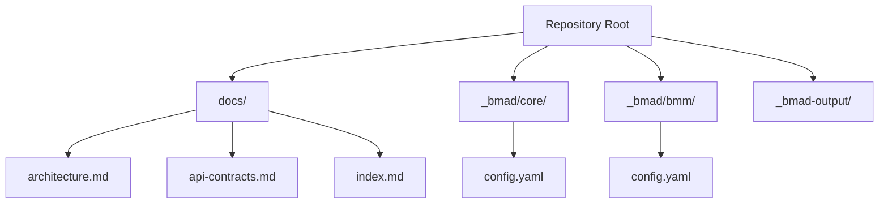
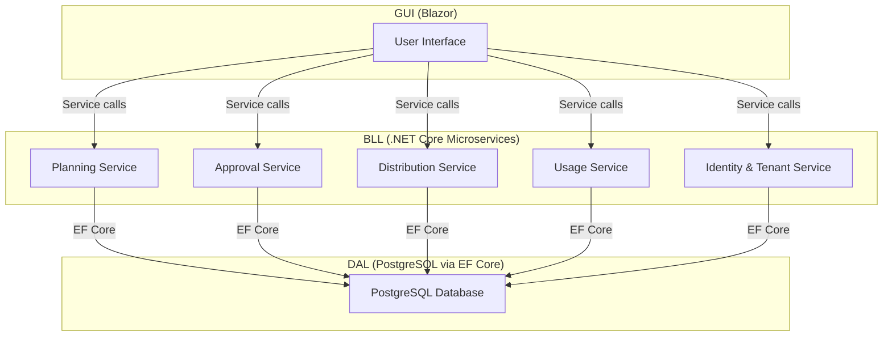
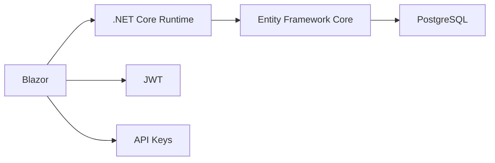

# Environment Setup and Requirements

<cite>
**Referenced Files in This Document**
- [docs/index.md](file://docs/index.md)
- [docs/architecture.md](file://docs/architecture.md)
- [docs/api-contracts.md](file://docs/api-contracts.md)
- [_bmad/core/config.yaml](file://_bmad/core/config.yaml)
- [_bmad/bmm/config.yaml](file://_bmad/bmm/config.yaml)
- [BMAD_STRUCTURE.md](file://BMAD_STRUCTURE.md)
</cite>

## Table of Contents
1. [Introduction](#introduction)
2. [Project Structure](#project-structure)
3. [Core Components](#core-components)
4. [Architecture Overview](#architecture-overview)
5. [Detailed Component Analysis](#detailed-component-analysis)
6. [Dependency Analysis](#dependency-analysis)
7. [Performance Considerations](#performance-considerations)
8. [Troubleshooting Guide](#troubleshooting-guide)
9. [Conclusion](#conclusion)
10. [Appendices](#appendices)

## Introduction
This document provides a comprehensive environment setup guide for deploying the NonCash platform. It consolidates system requirements, prerequisites, and configuration steps derived from the repository’s documentation and configuration files. The platform follows a 3-layer architecture with a C#/.NET Core backend, Blazor frontend, and PostgreSQL as the primary database. Security is enforced via JWT and API keys, and the system emphasizes multi-tenancy and dynamic voucher code logic.

## Project Structure
The repository organizes documentation and BMAD-related configuration under dedicated folders. The most relevant materials for environment setup are:
- docs: High-level architecture, API contracts, and system overview
- _bmad: BMAD configuration files for planning and implementation artifacts
- BMAD_STRUCTURE.md: Describes the three-layer architecture, ORM choice, and security measures

**Diagram sources**
- [docs/index.md:1-41](file://docs/index.md#L1-L41)
- [docs/architecture.md:1-52](file://docs/architecture.md#L1-L52)
- [docs/api-contracts.md:1-109](file://docs/api-contracts.md#L1-L109)
- [_bmad/core/config.yaml:1-10](file://_bmad/core/config.yaml#L1-L10)
- [_bmad/bmm/config.yaml:1-17](file://_bmad/bmm/config.yaml#L1-L17)

**Section sources**
- [docs/index.md:1-41](file://docs/index.md#L1-L41)
- [docs/architecture.md:1-52](file://docs/architecture.md#L1-L52)
- [_bmad/core/config.yaml:1-10](file://_bmad/core/config.yaml#L1-L10)
- [_bmad/bmm/config.yaml:1-17](file://_bmad/bmm/config.yaml#L1-L17)

## Core Components
- Backend runtime and framework: C# / .NET Core (as documented in the architecture)
- Database: PostgreSQL (as documented in the architecture)
- ORM: Entity Framework Core (as documented in the architecture)
- Frontend: Blazor (as documented in the architecture)
- Security: JWT and API Keys (as documented in the architecture and API contracts)
- OS support: Linux and Windows (as documented in the architecture)

These components define the baseline for installing SDKs, databases, and runtime dependencies.

**Section sources**
- [docs/architecture.md:17-52](file://docs/architecture.md#L17-L52)
- [docs/api-contracts.md:5-10](file://docs/api-contracts.md#L5-L10)

## Architecture Overview
The NonCash platform uses a 3-layer architecture:
- GUI (Blazor): User interactions and dashboards
- BLL (C#/.NET Core microservices): Business logic and orchestration
- DAL (PostgreSQL via EF Core): Data persistence and abstraction

Security is enforced with JWT and API Keys, and multi-tenancy is implemented via BrandID.

**Diagram sources**
- [docs/architecture.md:9-35](file://docs/architecture.md#L9-L35)

**Section sources**
- [docs/architecture.md:5-52](file://docs/architecture.md#L5-L52)

## Detailed Component Analysis

### System Requirements
- Backend runtime: C# / .NET Core (version aligned with project’s microservices)
- Database: PostgreSQL (primary choice; MongoDB considered but PostgreSQL preferred)
- ORM: Entity Framework Core
- Frontend: Blazor (Server or WebAssembly)
- OS: Linux and Windows supported

These requirements are derived from the architecture and BMAD structure documents.

**Section sources**
- [docs/architecture.md:17-52](file://docs/architecture.md#L17-L52)
- [BMAD_STRUCTURE.md:59-61](file://BMAD_STRUCTURE.md#L59-L61)

### Prerequisite Tools and SDK Installations
- Install the .NET SDK matching the project’s backend runtime requirement
- Install PostgreSQL server and client tools
- Install a modern IDE with C# and Blazor support (e.g., Visual Studio, VS Code)
- Install Git for version control

Note: Specific SDK versions are not enumerated in the repository; align with the .NET version used by the backend microservices.

**Section sources**
- [docs/architecture.md:17-19](file://docs/architecture.md#L17-L19)

### Development Environment Configuration
- IDE setup: Configure C# and Blazor projects; enable diagnostics and IntelliSense
- Project layout: Follow the 3-layer architecture (Core, Infrastructure, Web/API) as outlined in the documentation
- Local database: Provision a PostgreSQL instance locally for development and testing

**Section sources**
- [docs/index.md:34-37](file://docs/index.md#L34-L37)
- [docs/architecture.md:28-35](file://docs/architecture.md#L28-L35)

### Environment Variables and Secret Management
- Authentication: API Key header and JWT bearer tokens are used for external integrations and member app interactions
- Secret management: Store sensitive values (e.g., connection strings, API keys) using environment variables or secure secret stores
- Credential setup: Define credentials per deployment stage (development, staging, production) with appropriate isolation

**Section sources**
- [docs/api-contracts.md:5-10](file://docs/api-contracts.md#L5-L10)

### Local Database Provisioning
- Provision PostgreSQL locally for development
- Use EF Core migrations to initialize and update the schema
- Ensure database connectivity from the backend microservices

**Section sources**
- [docs/architecture.md:28-35](file://docs/architecture.md#L28-L35)

### Deployment Stages and Configuration
- Development: Local PostgreSQL, minimal secrets, debug builds
- Staging: Dedicated PostgreSQL, environment-specific secrets, test deployments
- Production: Managed PostgreSQL, hardened secrets, CI/CD pipeline, monitoring

**Section sources**
- [docs/architecture.md:36-41](file://docs/architecture.md#L36-L41)

### Windows Setup (Step-by-Step)
1. Install .NET SDK matching the backend runtime requirement
2. Install PostgreSQL and configure a local database
3. Install an IDE (e.g., Visual Studio or VS Code) with C# and Blazor extensions
4. Clone the repository and restore dependencies
5. Configure environment variables for database connection and API keys
6. Run EF Core migrations to provision the schema
7. Launch the backend microservices and frontend application
8. Validate endpoints using the API contracts

**Section sources**
- [docs/architecture.md:17-52](file://docs/architecture.md#L17-L52)
- [docs/api-contracts.md:5-10](file://docs/api-contracts.md#L5-L10)

### Linux Setup (Step-by-Step)
1. Install .NET SDK and PostgreSQL server
2. Configure PostgreSQL and create a development database
3. Set up an IDE or editor with C# and Blazor support
4. Clone the repository and restore packages
5. Configure environment variables for secrets and database connection
6. Apply EF Core migrations
7. Start backend microservices and frontend
8. Test API endpoints as defined in the API contracts

**Section sources**
- [docs/architecture.md:17-52](file://docs/architecture.md#L17-L52)
- [docs/api-contracts.md:5-10](file://docs/api-contracts.md#L5-L10)

### macOS Setup (Step-by-Step)
1. Install .NET SDK and PostgreSQL via Homebrew or official installer
2. Initialize PostgreSQL and create a development database
3. Install an IDE with C# and Blazor support
4. Clone the repository and restore dependencies
5. Configure environment variables for secrets and database connectivity
6. Run EF Core migrations
7. Start backend microservices and frontend
8. Validate API endpoints using the API contracts

**Section sources**
- [docs/architecture.md:17-52](file://docs/architecture.md#L17-L52)
- [docs/api-contracts.md:5-10](file://docs/api-contracts.md#L5-L10)

## Dependency Analysis
The platform’s dependencies are primarily defined by the 3-layer architecture and security model:
- Backend depends on .NET Core and EF Core
- Database depends on PostgreSQL
- Frontend depends on Blazor
- Security depends on JWT and API Keys

**Diagram sources**
- [docs/architecture.md:17-52](file://docs/architecture.md#L17-L52)
- [docs/api-contracts.md:5-10](file://docs/api-contracts.md#L5-L10)

**Section sources**
- [docs/architecture.md:17-52](file://docs/architecture.md#L17-L52)
- [docs/api-contracts.md:5-10](file://docs/api-contracts.md#L5-L10)

## Performance Considerations
- Use PostgreSQL tuning for high-concurrency scenarios (e.g., POS redemptions)
- Optimize EF Core queries and consider connection pooling
- Monitor API latency and throughput for POS verification and redemption endpoints
- Scale microservices independently based on load

[No sources needed since this section provides general guidance]

## Troubleshooting Guide
- Database connectivity failures: Verify PostgreSQL is running, credentials are correct, and the connection string matches environment variables
- API authentication errors: Confirm API Key header and JWT bearer token are set correctly per the API contracts
- Migration issues: Re-run EF Core migrations and ensure the target database is reachable
- Cross-platform differences: Align .NET SDK versions across Windows, Linux, and macOS

**Section sources**
- [docs/api-contracts.md:5-10](file://docs/api-contracts.md#L5-L10)
- [docs/architecture.md:28-35](file://docs/architecture.md#L28-L35)

## Conclusion
The NonCash platform requires a .NET Core backend, PostgreSQL database, EF Core ORM, and a Blazor frontend. Security is enforced via JWT and API Keys, and the system supports multi-tenancy. By following the environment setup steps for Windows, Linux, and macOS, configuring environment variables and secrets, and validating API endpoints, teams can establish a reliable development and deployment environment aligned with the documented architecture.

[No sources needed since this section summarizes without analyzing specific files]

## Appendices
- BMAD configuration references:
  - Core module configuration
  - BMM module configuration

**Section sources**
- [_bmad/core/config.yaml:1-10](file://_bmad/core/config.yaml#L1-L10)
- [_bmad/bmm/config.yaml:1-17](file://_bmad/bmm/config.yaml#L1-L17)