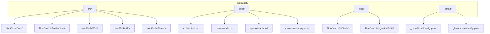
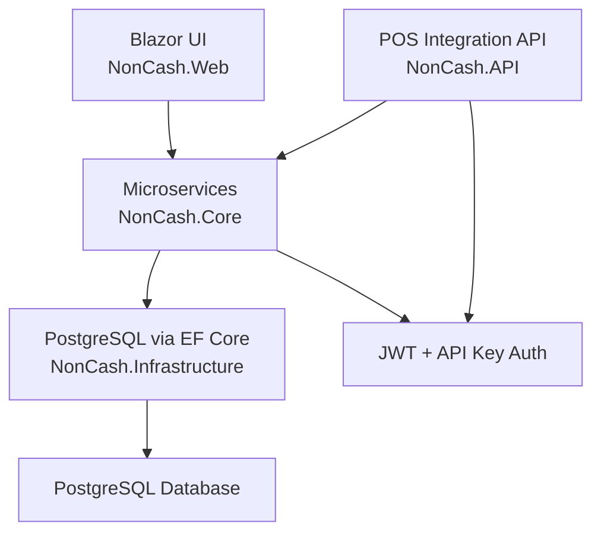
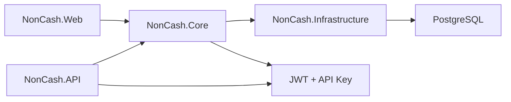
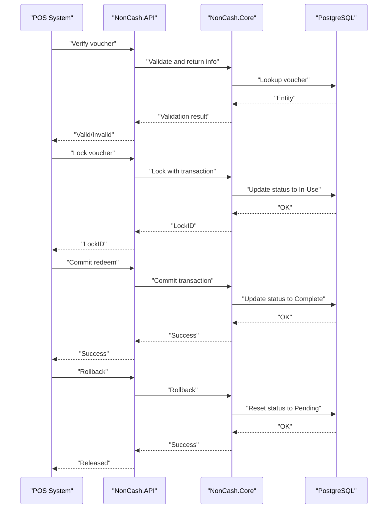
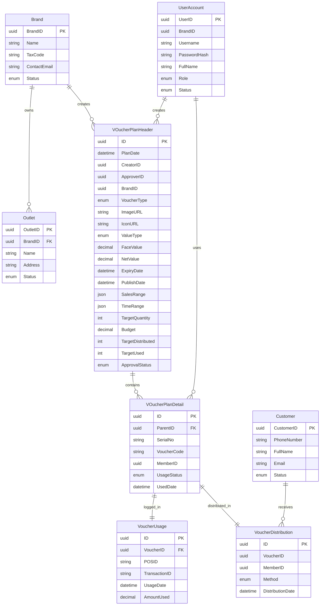

# Operational Procedures and Maintenance

<cite>
**Referenced Files in This Document**
- [BMAD_STRUCTURE.md](file://BMAD_STRUCTURE.md)
- [Key Functionalities.txt](file://Key Functionalities.txt)
- [description.txt](file://description.txt)
- [docs/index.md](file://docs/index.md)
- [docs/architecture.md](file://docs/architecture.md)
- [docs/data-models.md](file://docs/data-models.md)
- [docs/api-contracts.md](file://docs/api-contracts.md)
- [docs/source-tree-analysis.md](file://docs/source-tree-analysis.md)
- [_bmad-output/planning-artifacts/epics.md](file://_bmad-output/planning-artifacts/epics.md)
- [_bmad-output/planning-artifacts/implementation-readiness-report-2026-04-17.md](file://_bmad-output/planning-artifacts/implementation-readiness-report-2026-04-17.md)
- [_bmad/core/config.yaml](file://_bmad/core/config.yaml)
- [_bmad/bmm/config.yaml](file://_bmad/bmm/config.yaml)
</cite>

## Table of Contents
1. [Introduction](#introduction)
2. [Project Structure](#project-structure)
3. [Core Components](#core-components)
4. [Architecture Overview](#architecture-overview)
5. [Detailed Component Analysis](#detailed-component-analysis)
6. [Dependency Analysis](#dependency-analysis)
7. [Performance Considerations](#performance-considerations)
8. [Troubleshooting Guide](#troubleshooting-guide)
9. [Conclusion](#conclusion)
10. [Appendices](#appendices)

## Introduction
This document provides operational procedures and maintenance guidance for the NonCash platform. It consolidates the system’s architecture, data models, API contracts, and implementation artifacts to define routine maintenance, backup and recovery, monitoring, incident response, performance tuning, capacity planning, user and access control management, audit trails, update and patch management, hotfix deployment, change management, troubleshooting, and escalation procedures.

## Project Structure
The NonCash project is structured around a three-layer SaaS architecture with microservices. The target source tree organizes responsibilities across core business logic, data access, web UI, API integration, and shared models. This structure supports clear separation of concerns and operational isolation for maintenance and updates.

**Diagram sources**
- [docs/source-tree-analysis.md:1-50](file://docs/source-tree-analysis.md#L1-L50)
- [docs/architecture.md:1-52](file://docs/architecture.md#L1-L52)
- [docs/data-models.md:1-98](file://docs/data-models.md#L1-L98)
- [docs/api-contracts.md:1-109](file://docs/api-contracts.md#L1-L109)

**Section sources**
- [docs/source-tree-analysis.md:1-50](file://docs/source-tree-analysis.md#L1-L50)
- [docs/index.md:1-41](file://docs/index.md#L1-L41)

## Core Components
- Business Logic Layer (NonCash.Core): Houses domain entities, services, and business rules. Supports microservices for planning, approval, distribution, usage, identity, and tenant management.
- Data Access Layer (NonCash.Infrastructure): Implements repository pattern with Entity Framework Core and PostgreSQL, including migrations.
- User Interface (NonCash.Web): Blazor-based management portal for staff and marketers.
- API Layer (NonCash.API): RESTful endpoints for POS integration and member app interactions, secured with JWT and API keys.
- Shared Library (NonCash.Shared): Cross-cutting models and constants used by Web and API.

These components align with the documented 3-layer architecture and microservices organization.

**Section sources**
- [docs/architecture.md:17-52](file://docs/architecture.md#L17-L52)
- [docs/source-tree-analysis.md:7-34](file://docs/source-tree-analysis.md#L7-L34)

## Architecture Overview
The NonCash platform is a SaaS solution with:
- Frontend: Blazor App
- Backend: C#/.NET Core microservices
- Database: PostgreSQL
- ORM: Entity Framework Core
- Security: JWT and API Keys
- Multi-tenancy: BrandID isolation

**Diagram sources**
- [docs/architecture.md:9-52](file://docs/architecture.md#L9-L52)
- [docs/api-contracts.md:5-10](file://docs/api-contracts.md#L5-L10)

**Section sources**
- [docs/architecture.md:5-52](file://docs/architecture.md#L5-L52)
- [docs/api-contracts.md:5-10](file://docs/api-contracts.md#L5-L10)

## Detailed Component Analysis

### Routine Maintenance Tasks
- Database maintenance:
  - Schema migrations via EF Core migrations folder.
  - Vacuum/analyze and index maintenance on PostgreSQL.
- Backend service maintenance:
  - Restart microservices after configuration changes.
  - Rotate secrets and refresh API keys per brand/outlet.
- Frontend maintenance:
  - Update Blazor components and re-deploy static assets.
- API maintenance:
  - Validate endpoint contracts and update rate limits as needed.

**Section sources**
- [docs/source-tree-analysis.md:15-28](file://docs/source-tree-analysis.md#L15-L28)
- [docs/architecture.md:28-35](file://docs/architecture.md#L28-L35)

### Backup and Recovery Procedures
- Database backups:
  - Schedule regular logical backups of PostgreSQL databases.
  - Test restore procedures monthly and document recovery time objectives.
- Application artifacts:
  - Back up EF Core migration scripts and shared models.
- Recovery steps:
  - Restore DB from latest backup.
  - Recreate services from deployment manifests.
  - Validate API endpoints and UI access.

**Section sources**
- [docs/architecture.md:28-35](file://docs/architecture.md#L28-L35)
- [docs/data-models.md:1-98](file://docs/data-models.md#L1-L98)

### System Monitoring Protocols
- Metrics and logs:
  - Collect application logs, database query performance, and API latency.
  - Monitor POS redemption throughput and error rates.
- Health checks:
  - Implement readiness/liveness probes for microservices.
- Alerts:
  - Configure thresholds for CPU/memory/disk and database connection pool exhaustion.

**Section sources**
- [docs/architecture.md:17-26](file://docs/architecture.md#L17-L26)
- [docs/api-contracts.md:5-10](file://docs/api-contracts.md#L5-L10)

### Incident Response Procedures
- Classification:
  - P0: POS system down or mass voucher double-spending.
  - P1: Core service outage affecting planning/approval/distribution.
  - P2: UI access or minor API degradation.
- Escalation:
  - P0/P1: immediate on-call rotation, stakeholder notify, postmortem required.
  - P2: team triage within 2 hours, SLA remediation.
- Playbooks:
  - Isolate affected microservice, rollback recent changes, scale replicas, validate POS API connectivity.

**Section sources**
- [Key Functionalities.txt:135-147](file://Key Functionalities.txt#L135-L147)
- [docs/api-contracts.md:14-88](file://docs/api-contracts.md#L14-L88)

### Performance Tuning Guidelines
- Database:
  - Optimize queries used in POS verification/locking/redeeming.
  - Maintain statistics and adjust connection pool sizes.
- Backend:
  - Profile microservices under load; enable distributed tracing.
- Frontend:
  - Minimize payload sizes and leverage caching for dashboards.

**Section sources**
- [docs/architecture.md:28-35](file://docs/architecture.md#L28-L35)
- [docs/data-models.md:46-62](file://docs/data-models.md#L46-L62)

### Capacity Planning Strategies
- Forecast growth in:
  - Voucher issuance volume, POS redemption rate, concurrent users.
- Scale:
  - Horizontal pod scaling for microservices, read replicas for reporting, auto-scaling for Blazor UI.
- Storage:
  - Plan for historical VoucherUsage and VoucherDistribution tables growth.

**Section sources**
- [docs/data-models.md:46-62](file://docs/data-models.md#L46-L62)
- [docs/architecture.md:17-26](file://docs/architecture.md#L17-L26)

### User Management Procedures
- Create/update/delete staff accounts with explicit BrandID and roles.
- Enforce role-based access controls (RBAC) for planner/approver/admin.
- Audit account lifecycle events (creation, lock, deletion).

**Section sources**
- [Key Functionalities.txt:104-134](file://Key Functionalities.txt#L104-L134)
- [_bmad-output/planning-artifacts/epics.md:124-136](file://_bmad-output/planning-artifacts/epics.md#L124-L136)

### Access Control Updates
- Rotate API keys per outlet/brand.
- Regenerate JWT secrets periodically.
- Review and revoke permissions for terminated users.

**Section sources**
- [docs/api-contracts.md:7-8](file://docs/api-contracts.md#L7-L8)
- [docs/architecture.md:36-41](file://docs/architecture.md#L36-L41)

### Audit Trail Management
- Track:
  - Plan approvals, distribution events, POS redemptions, and user actions.
- Retention:
  - Define retention periods per jurisdiction and compliance needs.
- Reporting:
  - Generate compliance reports from VoucherUsage and VoucherDistribution.

**Section sources**
- [docs/data-models.md:46-62](file://docs/data-models.md#L46-L62)
- [docs/data-models.md:11-43](file://docs/data-models.md#L11-L43)

### Update and Patch Management Processes
- Change categorization:
  - Critical: security patches, POS safety fixes.
  - Standard: feature updates, performance improvements.
- Release cadence:
  - Weekly critical patches; bi-weekly standard releases.
- Rollout:
  - Staged rollout to pre-production, smoke tests, gradual traffic shift.

**Section sources**
- [docs/architecture.md:17-26](file://docs/architecture.md#L17-L26)
- [_bmad-output/planning-artifacts/implementation-readiness-report-2026-04-17.md:120-127](file://_bmad-output/planning-artifacts/implementation-readiness-report-2026-04-17.md#L120-L127)

### Hotfix Deployment Procedures
- Trigger:
  - P0 incidents or confirmed data integrity risks.
- Process:
  - Freeze new deployments, deploy hotfix, validate POS and UI, monitor alerts, document change.

**Section sources**
- [Key Functionalities.txt:135-147](file://Key Functionalities.txt#L135-L147)
- [docs/api-contracts.md:14-88](file://docs/api-contracts.md#L14-L88)

### Change Management Workflows
- Request:
  - Submit RFC with impact analysis and test plan.
- Review:
  - Architectural and security review.
- Approval:
  - Authorized approvers sign off.
- Execution:
  - Deploy during maintenance window; monitor post-deploy.

**Section sources**
- [_bmad-output/planning-artifacts/implementation-readiness-report-2026-04-17.md:85-103](file://_bmad-output/planning-artifacts/implementation-readiness-report-2026-04-17.md#L85-L103)
- [_bmad/bmm/config.yaml:1-17](file://_bmad/bmm/config.yaml#L1-L17)

### Troubleshooting Common Operational Issues
- POS verification failures:
  - Validate API key and outlet configuration; confirm plan publish date and validity range.
- Voucher double-spending risk:
  - Ensure lock/commit sequence is followed; investigate rollback anomalies.
- UI access problems:
  - Check JWT token validity and RBAC permissions; verify BrandID isolation.
- Database performance:
  - Review slow queries, missing indexes, and connection pool saturation.

**Section sources**
- [docs/api-contracts.md:14-88](file://docs/api-contracts.md#L14-L88)
- [docs/data-models.md:46-62](file://docs/data-models.md#L46-L62)
- [Key Functionalities.txt:135-147](file://Key Functionalities.txt#L135-L147)

### System Health Monitoring
- Health endpoints:
  - Implement service health checks for each microservice.
- Observability:
  - Centralize logs and metrics; set up dashboards for key indicators.

**Section sources**
- [docs/architecture.md:17-26](file://docs/architecture.md#L17-L26)

### Maintenance Schedules and Operational Checklists
- Daily:
  - Review alert logs, database connection pool status, and recent API errors.
- Weekly:
  - Run vacuum/analyze, review audit logs, rotate non-critical secrets.
- Monthly:
  - Validate backups, test restore, and update disaster recovery playbooks.
- Quarterly:
  - Capacity planning review and performance benchmarking.

**Section sources**
- [docs/architecture.md:28-35](file://docs/architecture.md#L28-L35)
- [docs/data-models.md:46-62](file://docs/data-models.md#L46-L62)

### Escalation Procedures for Critical Incidents
- P0/P1:
  - Notify on-call lead, stakeholders, and document incident in real time.
  - Conduct postmortem and publish remediation steps.

**Section sources**
- [Key Functionalities.txt:135-147](file://Key Functionalities.txt#L135-L147)

## Dependency Analysis
The system’s dependencies are primarily layered: UI depends on BLL services, API depends on BLL and authenticates via JWT/API Key, and BLL depends on DAL for persistence. The diagram below reflects the documented architecture.

**Diagram sources**
- [docs/architecture.md:9-52](file://docs/architecture.md#L9-L52)
- [docs/source-tree-analysis.md:7-34](file://docs/source-tree-analysis.md#L7-L34)

**Section sources**
- [docs/architecture.md:9-52](file://docs/architecture.md#L9-L52)
- [docs/source-tree-analysis.md:7-34](file://docs/source-tree-analysis.md#L7-L34)

## Performance Considerations
- Database optimization:
  - Indexes on frequently queried fields (e.g., VoucherCode, MemberID, OutletID).
  - Partition large audit tables (VoucherUsage, VoucherDistribution) by date.
- Backend optimization:
  - Enable async processing for batch promotions and transfers.
  - Use connection pooling and circuit breakers for external integrations.
- Frontend optimization:
  - Lazy-load dashboard components; cache static assets.

**Section sources**
- [docs/data-models.md:11-62](file://docs/data-models.md#L11-L62)
- [docs/architecture.md:28-35](file://docs/architecture.md#L28-L35)

## Troubleshooting Guide
- POS Redemption Flow

**Diagram sources**
- [docs/api-contracts.md:14-88](file://docs/api-contracts.md#L14-L88)
- [docs/data-models.md:46-62](file://docs/data-models.md#L46-L62)

**Section sources**
- [docs/api-contracts.md:14-88](file://docs/api-contracts.md#L14-L88)
- [Key Functionalities.txt:135-147](file://Key Functionalities.txt#L135-L147)

## Conclusion
This operational guide consolidates NonCash’s architecture, data models, and API contracts into actionable maintenance and operations procedures. By following the outlined processes—monitoring, backups, incident response, performance tuning, capacity planning, access control, audit trails, and change management—the platform can maintain reliability, security, and scalability in production.

## Appendices

### Appendix A: Data Models Overview

**Diagram sources**
- [docs/data-models.md:11-98](file://docs/data-models.md#L11-L98)

**Section sources**
- [docs/data-models.md:11-98](file://docs/data-models.md#L11-L98)

### Appendix B: Implementation Artifacts and Planning
- Epics and stories outline operational workflows for profiles, planning, distribution, redemption, and social engagement.
- Implementation readiness report validates coverage and highlights minor gaps.

**Section sources**
- [_bmad-output/planning-artifacts/epics.md:55-76](file://_bmad-output/planning-artifacts/epics.md#L55-L76)
- [_bmad-output/planning-artifacts/implementation-readiness-report-2026-04-17.md:53-84](file://_bmad-output/planning-artifacts/implementation-readiness-report-2026-04-17.md#L53-L84)