# Approval Service

<cite>
**Referenced Files in This Document**
- [docs/architecture.md](file://docs/architecture.md)
- [docs/data-models.md](file://docs/data-models.md)
- [docs/api-contracts.md](file://docs/api-contracts.md)
- [docs/index.md](file://docs/index.md)
- [Key Functionalities.txt](file://Key Functionalities.txt)
- [_bmad-output/planning-artifacts/epics.md](file://_bmad-output/planning-artifacts/epics.md)
</cite>

## Table of Contents
1. [Introduction](#introduction)
2. [Project Structure](#project-structure)
3. [Core Components](#core-components)
4. [Architecture Overview](#architecture-overview)
5. [Detailed Component Analysis](#detailed-component-analysis)
6. [Dependency Analysis](#dependency-analysis)
7. [Performance Considerations](#performance-considerations)
8. [Troubleshooting Guide](#troubleshooting-guide)
9. [Conclusion](#conclusion)
10. [Appendices](#appendices)

## Introduction
This document provides comprehensive guidance for the Approval Service within the NonCash voucher platform. It focuses on workflow orchestration and state management for voucher plan approvals, covering multi-level review processes, approval routing logic, state transitions, notifications, audit trails, and integration touchpoints with the Planning Service and Distribution Service. It also addresses concurrency control, approval timeouts, rollbacks, customization of workflows, and extension of approval criteria.

## Project Structure
The Approval Service is part of the Business Logic Layer (BLL) microservices and collaborates with the Planning Service (plan submission) and the Distribution Service (approved plan activation). The system follows a 3-layer SaaS architecture with C#/.NET Core backend, PostgreSQL data access, and JWT/API Key security.

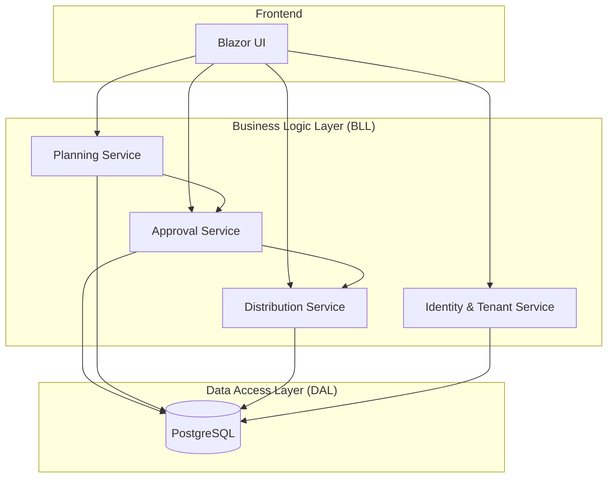

**Diagram sources**
- [docs/architecture.md:17-26](file://docs/architecture.md#L17-L26)

**Section sources**
- [docs/architecture.md:17-26](file://docs/architecture.md#L17-L26)
- [docs/index.md:18-22](file://docs/index.md#L18-L22)

## Core Components
- Planning Service: Manages voucher plan creation, budgets, and targets; submits plans for approval.
- Approval Service: Routes and manages plan reviews, enforces single-level approval, updates state, records audit, and triggers downstream actions.
- Distribution Service: Activates approved plans for distribution according to publish dates and distribution methods.
- Identity & Tenant Service: Provides RBAC for UserAccount, multi-tenancy for Brand and Outlet, and profile management for Customer.

**Section sources**
- [docs/architecture.md:20-25](file://docs/architecture.md#L20-L25)
- [docs/data-models.md:81-89](file://docs/data-models.md#L81-L89)

## Architecture Overview
The Approval Service orchestrates plan approvals and integrates with upstream and downstream services. The Planning Service creates and submits plans; the Approval Service evaluates and transitions state; upon approval, the Distribution Service activates the plan for distribution.

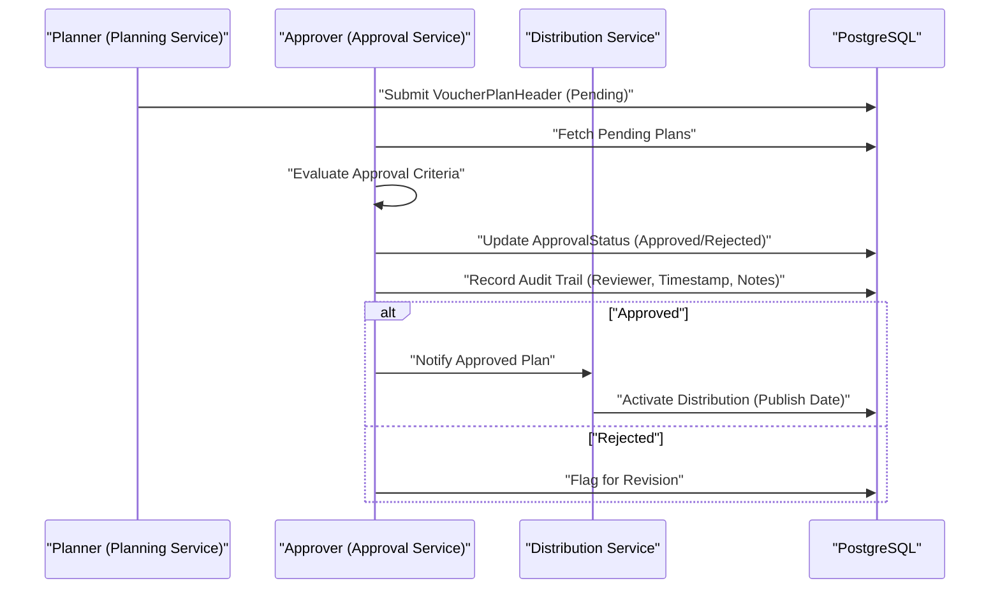

**Diagram sources**
- [docs/architecture.md:20-25](file://docs/architecture.md#L20-L25)
- [docs/data-models.md:11-42](file://docs/data-models.md#L11-L42)
- [Key Functionalities.txt:70-85](file://Key Functionalities.txt#L70-L85)

## Detailed Component Analysis

### Approval Workflow Orchestration
- Single-level approval: The system supports a single approval level per plan submission.
- Routing logic: Plans transition to Pending upon submission and are routed to approvers based on roles and tenant context.
- Decision outcomes:
  - Approve: Updates ApprovalStatus to Approved, records ApproverID, and triggers downstream activation.
  - Reject: Updates ApprovalStatus to Rejected, requires revision and resubmission, and maintains audit trail for traceability.
- Publish date adjustment: Approver may adjust PublishDate during approval.

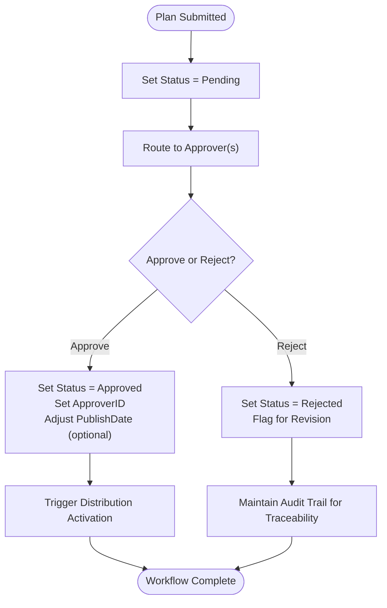

**Diagram sources**
- [Key Functionalities.txt:70-85](file://Key Functionalities.txt#L70-L85)
- [docs/data-models.md:32](file://docs/data-models.md#L32)

**Section sources**
- [Key Functionalities.txt:70-85](file://Key Functionalities.txt#L70-L85)
- [docs/data-models.md:32](file://docs/data-models.md#L32)

### State Transition Management
- VoucherPlanHeader ApprovalStatus transitions:
  - Pending → Approved or Rejected based on reviewer action.
  - Rejected plans remain traceable for audit and re-submission.
- Usage lifecycle of VoucherPlanDetail:
  - Pending → In-Use → Complete (or rollback to Pending).
- POS usage workflow:
  - Verify → Lock → Redeem (Commit) or Rollback.

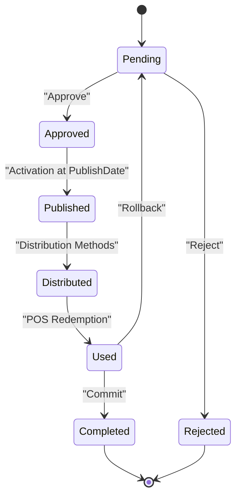

**Diagram sources**
- [docs/data-models.md:32](file://docs/data-models.md#L32)
- [docs/data-models.md:46-53](file://docs/data-models.md#L46-L53)
- [docs/api-contracts.md:14-87](file://docs/api-contracts.md#L14-L87)

**Section sources**
- [docs/data-models.md:32](file://docs/data-models.md#L32)
- [docs/data-models.md:46-53](file://docs/data-models.md#L46-L53)
- [docs/api-contracts.md:14-87](file://docs/api-contracts.md#L14-L87)

### Notification Mechanisms
- Audit trail generation: Each approval action records reviewer identity, timestamp, and notes for traceability.
- Downstream notifications:
  - Approved plans trigger Distribution Service activation.
  - Rejected plans flag the plan for revision while preserving historical audit.

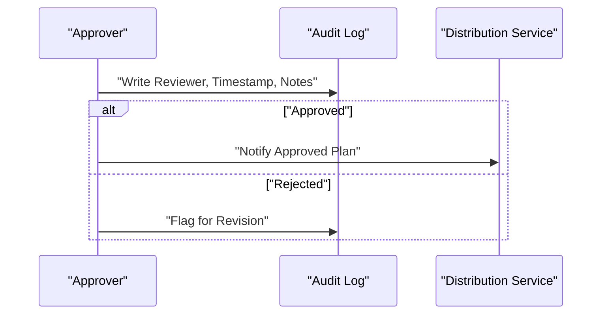

**Diagram sources**
- [Key Functionalities.txt:74-83](file://Key Functionalities.txt#L74-L83)
- [docs/data-models.md:32](file://docs/data-models.md#L32)

**Section sources**
- [Key Functionalities.txt:74-83](file://Key Functionalities.txt#L74-L83)
- [docs/data-models.md:32](file://docs/data-models.md#L32)

### Integration with Planning Service (Submission)
- Submission flow: Planning Service persists VoucherPlanHeader with initial state Pending.
- Approval Service fetches Pending plans and applies routing and evaluation logic.
- Post-approval: Approval Service updates state and triggers downstream activation.

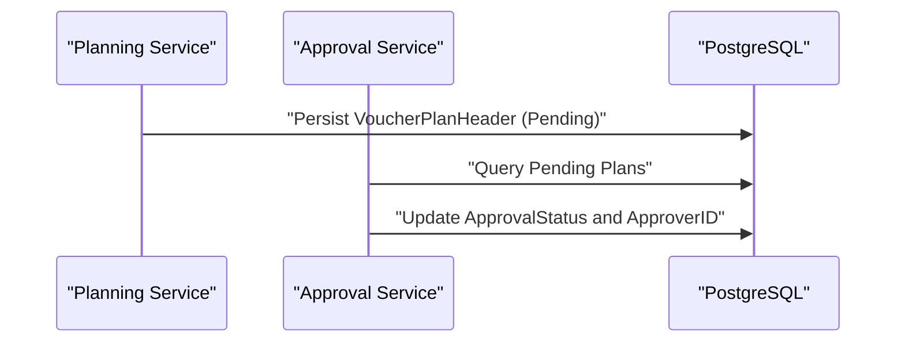

**Diagram sources**
- [docs/architecture.md:21](file://docs/architecture.md#L21)
- [docs/data-models.md:11-32](file://docs/data-models.md#L11-L32)

**Section sources**
- [docs/architecture.md:21](file://docs/architecture.md#L21)
- [docs/data-models.md:11-32](file://docs/data-models.md#L11-L32)

### Integration with Distribution Service (Activation)
- Activation trigger: Approved plans initiate distribution activation aligned with PublishDate.
- Distribution methods:
  - Self-purchase (Sale)
  - Batch promotion (Promotion)
  - Transfer (Gifting)
- Tracking: VoucherDistribution logs method and timestamps for reporting.

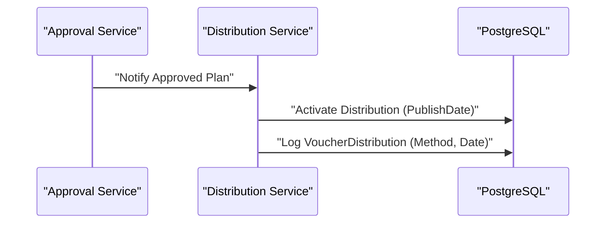

**Diagram sources**
- [docs/architecture.md:23](file://docs/architecture.md#L23)
- [_bmad-output/planning-artifacts/epics.md:205-243](file://_bmad-output/planning-artifacts/epics.md#L205-L243)
- [docs/data-models.md:55-61](file://docs/data-models.md#L55-L61)

**Section sources**
- [docs/architecture.md:23](file://docs/architecture.md#L23)
- [_bmad-output/planning-artifacts/epics.md:205-243](file://_bmad-output/planning-artifacts/epics.md#L205-L243)
- [docs/data-models.md:55-61](file://docs/data-models.md#L55-L61)

### Concurrency Control
- Multi-tenant isolation: BrandID ensures data separation between tenants.
- Role-based access: UserAccount roles (Admin, Planner, Approver) govern visibility and actions.
- Transactional consistency: DAL uses EF Core with PostgreSQL to maintain consistency for POS usage and distribution logs.

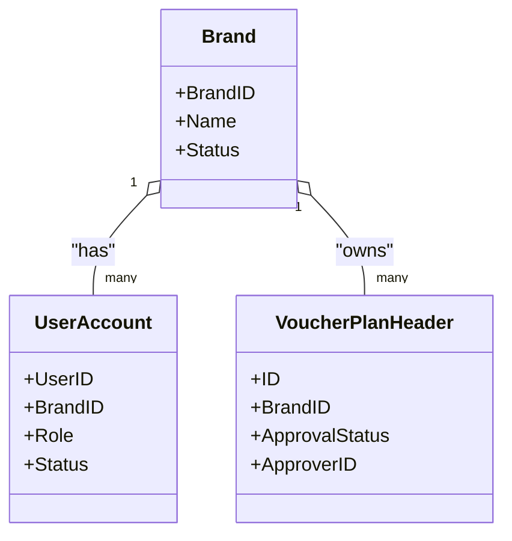

**Diagram sources**
- [docs/data-models.md:65-71](file://docs/data-models.md#L65-L71)
- [docs/data-models.md:81-89](file://docs/data-models.md#L81-L89)
- [docs/data-models.md:11-32](file://docs/data-models.md#L11-L32)

**Section sources**
- [docs/data-models.md:65-71](file://docs/data-models.md#L65-L71)
- [docs/data-models.md:81-89](file://docs/data-models.md#L81-L89)
- [docs/data-models.md:11-32](file://docs/data-models.md#L11-L32)

### Approval Timeout Handling and Rollback Mechanisms
- Timeout handling: While not explicitly defined in the current documents, recommended practice is to implement a configurable timeout window for Pending approvals with escalation to higher authority or auto-rejection after threshold.
- Rollback mechanisms:
  - POS usage rollback: Rollback endpoint releases locks if a transaction fails.
  - Plan rejection: Rejected plans remain traceable; use cloning/versioning to iterate and resubmit.

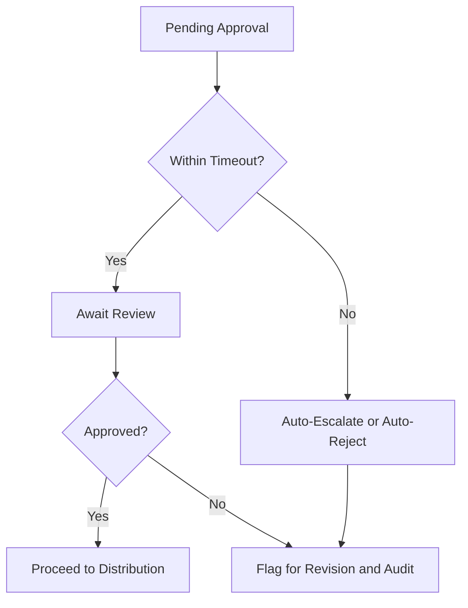

**Diagram sources**
- [docs/api-contracts.md:72-87](file://docs/api-contracts.md#L72-L87)
- [Key Functionalities.txt:74-83](file://Key Functionalities.txt#L74-L83)

**Section sources**
- [docs/api-contracts.md:72-87](file://docs/api-contracts.md#L72-L87)
- [Key Functionalities.txt:74-83](file://Key Functionalities.txt#L74-L83)

### Customization and Extensibility of Approval Workflows
- Cloning and versioning: After rejection, clone or create a new version to preserve audit history while iterating on the plan.
- Approval criteria extension: Approval criteria can be extended to include budget thresholds, brand-specific rules, or multi-stage approvals by evolving the evaluation logic in the Approval Service.

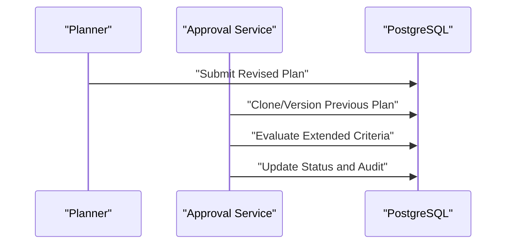

**Diagram sources**
- [_bmad-output/planning-artifacts/epics.md:184-196](file://_bmad-output/planning-artifacts/epics.md#L184-L196)
- [docs/data-models.md:11-32](file://docs/data-models.md#L11-L32)

**Section sources**
- [_bmad-output/planning-artifacts/epics.md:184-196](file://_bmad-output/planning-artifacts/epics.md#L184-L196)
- [docs/data-models.md:11-32](file://docs/data-models.md#L11-L32)

## Dependency Analysis
The Approval Service depends on:
- Planning Service for plan submission and initial state.
- Distribution Service for post-approval activation.
- Identity & Tenant Service for RBAC and multi-tenancy.
- PostgreSQL via EF Core for persistence and transactional integrity.

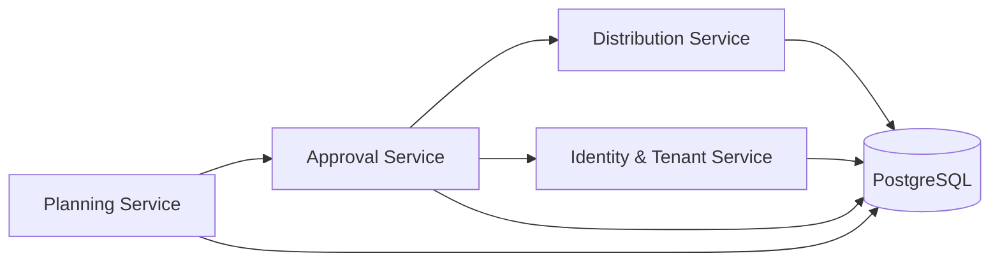

**Diagram sources**
- [docs/architecture.md:20-25](file://docs/architecture.md#L20-L25)

**Section sources**
- [docs/architecture.md:20-25](file://docs/architecture.md#L20-L25)

## Performance Considerations
- Minimize long-running approval sessions; implement timeouts and escalations.
- Use indexing on ApprovalStatus, BrandID, and ApproverID for efficient querying.
- Batch operations for distribution activation to reduce latency.
- Maintain audit logs asynchronously to avoid blocking primary approval flow.

## Troubleshooting Guide
- Audit trail verification: Confirm reviewer identity, timestamp, and notes recorded for every approval action.
- Rejected plan iteration: Use cloning/versioning to preserve history and re-evaluate with adjusted criteria.
- POS rollback: Utilize rollback endpoint to release locks when transactions fail.
- Multi-tenancy checks: Ensure BrandID isolation and role-based access align with business requirements.

**Section sources**
- [Key Functionalities.txt:74-83](file://Key Functionalities.txt#L74-L83)
- [docs/api-contracts.md:72-87](file://docs/api-contracts.md#L72-L87)
- [docs/data-models.md:32](file://docs/data-models.md#L32)

## Conclusion
The Approval Service centralizes voucher plan governance with a streamlined single-level approval workflow, robust audit trails, and clear integration points with Planning and Distribution Services. By leveraging multi-tenancy, role-based access, and transactional persistence, it ensures secure, traceable, and extensible approval processes suitable for iterative business needs.

## Appendices
- API Contracts: POS verification, locking, redemption, and rollback endpoints support the usage lifecycle and complement approval workflows.
- Data Models: Entities and relationships underpin approval state transitions and downstream distribution logging.

**Section sources**
- [docs/api-contracts.md:14-87](file://docs/api-contracts.md#L14-L87)
- [docs/data-models.md:11-61](file://docs/data-models.md#L11-L61)