# Approval Service

<cite>
**Referenced Files in This Document**
- [src/NonCash.Core/Services/ApprovalService.cs](file://src/NonCash.Core/Services/ApprovalService.cs)
- [src/NonCash.Core/Interfaces/IApprovalService.cs](file://src/NonCash.Core/Interfaces/IApprovalService.cs)
- [src/NonCash.Core/Interfaces/ICreditService.cs](file://src/NonCash.Core/Interfaces/ICreditService.cs)
- [src/NonCash.Core/Services/VoucherGenerationService.cs](file://src/NonCash.Core/Services/VoucherGenerationService.cs)
- [src/NonCash.API/Controllers/ApprovalsController.cs](file://src/NonCash.API/Controllers/ApprovalsController.cs)
- [src/NonCash.Core/Entities/CreditConsumption.cs](file://src/NonCash.Core/Entities/CreditConsumption.cs)
- [src/NonCash.Infrastructure/Services/CreditService.cs](file://src/NonCash.Infrastructure/Services/CreditService.cs)
- [docs/architecture.md](file://docs/architecture.md)
- [docs/data-models.md](file://docs/data-models.md)
- [docs/api-contracts.md](file://docs/api-contracts.md)
- [Key Functionalities.txt](file://Key Functionalities.txt)
</cite>

## Update Summary
**Changes Made**
- Added comprehensive credit consumption integration at plan approval time with idempotent charging
- Integrated optional voucher generation service during approval workflow
- Enhanced approval workflow with funding pre-check capabilities
- Updated state transition management to include credit consumption tracking
- Added new API endpoints for funding validation and approval-time voucher generation

## Table of Contents
1. [Introduction](#introduction)
2. [Project Structure](#project-structure)
3. [Core Components](#core-components)
4. [Architecture Overview](#architecture-overview)
5. [Detailed Component Analysis](#detailed-component-analysis)
6. [Credit Consumption Integration](#credit-consumption-integration)
7. [Voucher Generation Integration](#voucher-generation-integration)
8. [Dependency Analysis](#dependency-analysis)
9. [Performance Considerations](#performance-considerations)
10. [Troubleshooting Guide](#troubleshooting-guide)
11. [Conclusion](#conclusion)
12. [Appendices](#appendices)

## Introduction
This document provides comprehensive guidance for the Approval Service within the NonCash voucher platform. It focuses on workflow orchestration and state management for voucher plan approvals, covering multi-level review processes, approval routing logic, state transitions, notifications, audit trails, and integration touchpoints with the Planning Service and Distribution Service. The service now includes integrated credit consumption at approval time with idempotent charging and optional voucher generation during the approval workflow.

## Project Structure
The Approval Service is part of the Business Logic Layer (BLL) microservices and collaborates with the Planning Service (plan submission), Credit Service (consumption management), and Distribution Service (approved plan activation). The system follows a 3-layer SaaS architecture with C#/.NET Core backend, PostgreSQL data access, and JWT/API Key security.

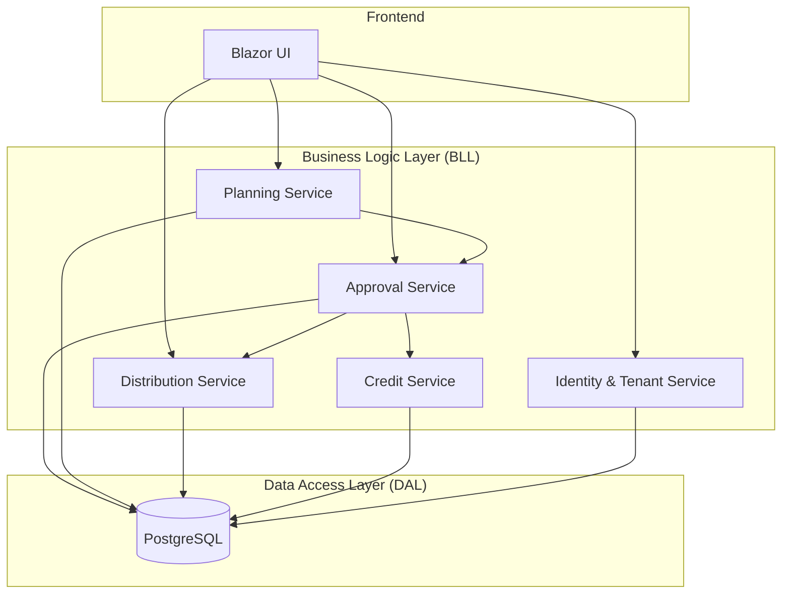
```mermaid
graph TB
subgraph "Frontend"
UI["Blazor UI"]
end
subgraph "Business Logic Layer (BLL)"
PlanningSvc["Planning Service"]
ApprovalSvc["Approval Service"]
DistributionSvc["Distribution Service"]
CreditSvc["Credit Service"]
IdentitySvc["Identity & Tenant Service"]
end
subgraph "Data Access Layer (DAL)"
DB[("PostgreSQL")]
end
UI --> PlanningSvc
UI --> ApprovalSvc
UI --> DistributionSvc
UI --> IdentitySvc
PlanningSvc --> ApprovalSvc
ApprovalSvc --> DistributionSvc
ApprovalSvc --> CreditSvc
ApprovalSvc --> DB
PlanningSvc --> DB
DistributionSvc --> DB
CreditSvc --> DB
IdentitySvc --> DB
```

**Diagram sources**
- [docs/architecture.md:17-26](file://docs/architecture.md#L17-L26)

**Section sources**
- [docs/architecture.md:17-26](file://docs/architecture.md#L17-L26)

## Core Components
- **Planning Service**: Manages voucher plan creation, budgets, and targets; submits plans for approval.
- **Approval Service**: Routes and manages plan reviews, enforces single-level approval, consumes credits at approval, updates state, records audit, and triggers downstream actions.
- **Credit Service**: Provides credit consumption management with idempotent plan-level charging and funding evaluation.
- **Voucher Generation Service**: Optional service for materializing approved quotas as voucher detail rows during approval.
- **Distribution Service**: Activates approved plans for distribution according to publish dates and distribution methods.
- **Identity & Tenant Service**: Provides RBAC for UserAccount, multi-tenancy for Brand and Outlet, and profile management for Customer.

**Section sources**
- [docs/architecture.md:20-25](file://docs/architecture.md#L20-L25)
- [docs/data-models.md:81-89](file://docs/data-models.md#L81-L89)

## Architecture Overview
The Approval Service orchestrates plan approvals with integrated credit consumption and optional voucher generation. The Planning Service creates and submits plans; the Approval Service evaluates criteria, consumes credits, transitions state; upon approval, the Distribution Service activates the plan for distribution.

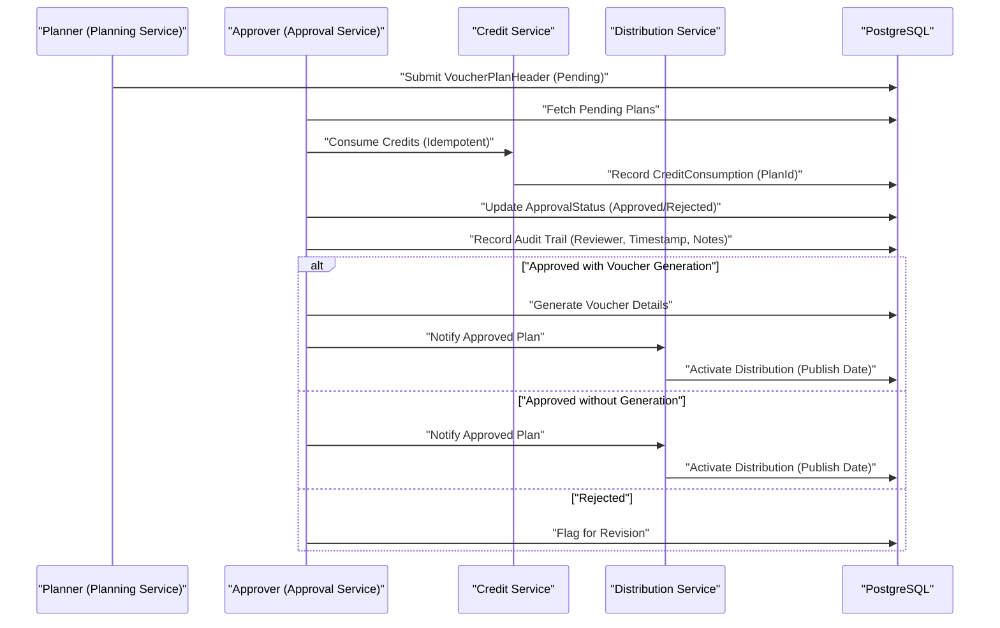
```mermaid
sequenceDiagram
participant Planner as "Planner (Planning Service)"
participant Approver as "Approver (Approval Service)"
participant Credit as "Credit Service"
participant Dist as "Distribution Service"
participant DB as "PostgreSQL"
Planner->>DB : "Submit VoucherPlanHeader (Pending)"
Approver->>DB : "Fetch Pending Plans"
Approver->>Credit : "Consume Credits (Idempotent)"
Credit->>DB : "Record CreditConsumption (PlanId)"
Approver->>DB : "Update ApprovalStatus (Approved/Rejected)"
Approver->>DB : "Record Audit Trail (Reviewer, Timestamp, Notes)"
alt "Approved with Voucher Generation"
Approver->>DB : "Generate Voucher Details"
Approver->>Dist : "Notify Approved Plan"
Dist->>DB : "Activate Distribution (Publish Date)"
else "Approved without Generation"
Approver->>Dist : "Notify Approved Plan"
Dist->>DB : "Activate Distribution (Publish Date)"
else "Rejected"
Approver->>DB : "Flag for Revision"
end
```

**Diagram sources**
- [src/NonCash.Core/Services/ApprovalService.cs:34-98](file://src/NonCash.Core/Services/ApprovalService.cs#L34-L98)
- [src/NonCash.Infrastructure/Services/CreditService.cs:129-190](file://src/NonCash.Infrastructure/Services/CreditService.cs#L129-L190)

## Detailed Component Analysis

### Approval Workflow Orchestration
- **Single-level approval**: The system supports a single approval level per plan submission.
- **Routing logic**: Plans transition to Pending upon submission and are routed to approvers based on roles and tenant context.
- **Decision outcomes**:
  - **Approve**: Consumes credits idempotently, updates ApprovalStatus to Approved, records ApproverID, and triggers downstream activation.
  - **Reject**: Updates ApprovalStatus to Rejected, requires revision and resubmission, and maintains audit trail for traceability.
- **Publish date adjustment**: Approver may adjust PublishDate during approval.
- **Optional voucher generation**: Can generate voucher details during approval or defer to later.

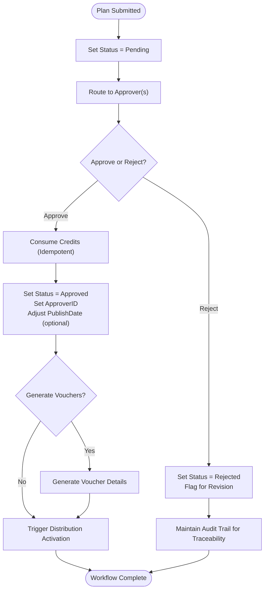
```mermaid
flowchart TD
Start(["Plan Submitted"]) --> Pending["Set Status = Pending"]
Pending --> Route["Route to Approver(s)"]
Route --> Decide{"Approve or Reject?"}
Decide --> |Approve| Charge["Consume Credits (Idempotent)"]
Charge --> Approved["Set Status = Approved<br/>Set ApproverID<br/>Adjust PublishDate (optional)"]
Decide --> |Reject| Rejected["Set Status = Rejected<br/>Flag for Revision"]
Approved --> GenCheck{"Generate Vouchers?"}
GenCheck --> |Yes| Generate["Generate Voucher Details"]
GenCheck --> |No| Activate["Trigger Distribution Activation"]
Generate --> Activate
Rejected --> Track["Maintain Audit Trail for Traceability"]
Activate --> End(["Workflow Complete"])
Track --> End
```

**Diagram sources**
- [src/NonCash.Core/Services/ApprovalService.cs:34-98](file://src/NonCash.Core/Services/ApprovalService.cs#L34-L98)

**Section sources**
- [src/NonCash.Core/Services/ApprovalService.cs:34-98](file://src/NonCash.Core/Services/ApprovalService.cs#L34-L98)

### State Transition Management
- **VoucherPlanHeader ApprovalStatus transitions**:
  - Pending → Approved or Rejected based on reviewer action.
  - Rejected plans remain traceable for audit and re-submission.
- **Credit Consumption tracking**: Each approved plan records a CreditConsumption entry with PlanId for audit purposes.
- **Usage lifecycle of VoucherPlanDetail**:
  - Pending → In-Use → Complete (or rollback to Pending).
- **POS usage workflow**:
  - Verify → Lock → Redeem (Commit) or Rollback.

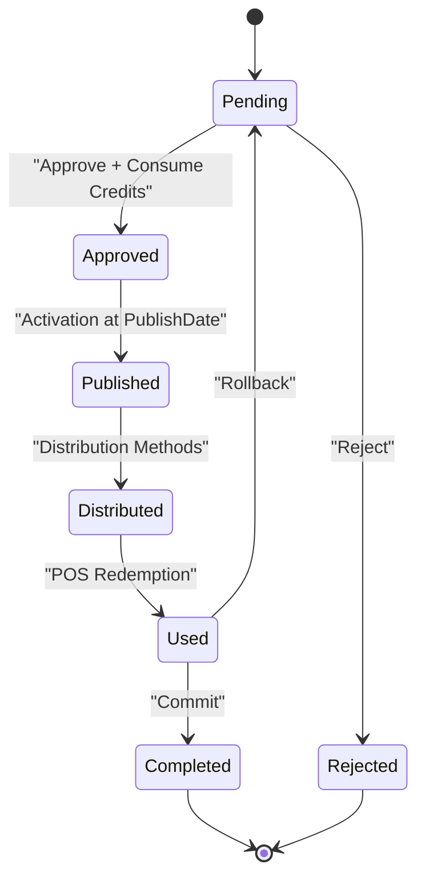
```mermaid
stateDiagram-v2
[*] --> Pending
Pending --> Approved : "Approve + Consume Credits"
Pending --> Rejected : "Reject"
Approved --> Published : "Activation at PublishDate"
Published --> Distributed : "Distribution Methods"
Distributed --> Used : "POS Redemption"
Used --> Completed : "Commit"
Used --> Pending : "Rollback"
Completed --> [*]
Rejected --> [*]
```

**Diagram sources**
- [src/NonCash.Core/Services/ApprovalService.cs:61-78](file://src/NonCash.Core/Services/ApprovalService.cs#L61-L78)
- [src/NonCash.Core/Entities/CreditConsumption.cs:3-31](file://src/NonCash.Core/Entities/CreditConsumption.cs#L3-L31)

**Section sources**
- [src/NonCash.Core/Services/ApprovalService.cs:61-78](file://src/NonCash.Core/Services/ApprovalService.cs#L61-L78)
- [src/NonCash.Core/Entities/CreditConsumption.cs:3-31](file://src/NonCash.Core/Entities/CreditConsumption.cs#L3-L31)

### Notification Mechanisms
- **Audit trail generation**: Each approval action records reviewer identity, timestamp, and notes for traceability.
- **Credit consumption logging**: All credit charges are recorded with references for financial auditing.
- **Downstream notifications**:
  - Approved plans trigger Distribution Service activation.
  - Rejected plans flag the plan for revision while preserving historical audit.

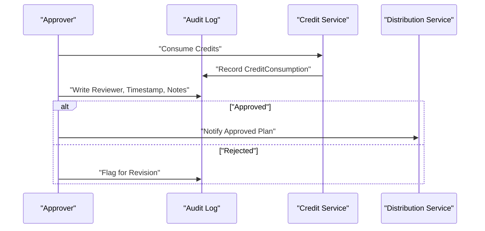
```mermaid
sequenceDiagram
participant Approver as "Approver"
participant Audit as "Audit Log"
participant Credit as "Credit Service"
participant Dist as "Distribution Service"
Approver->>Credit : "Consume Credits"
Credit->>Audit : "Record CreditConsumption"
Approver->>Audit : "Write Reviewer, Timestamp, Notes"
alt "Approved"
Approver->>Dist : "Notify Approved Plan"
else "Rejected"
Approver->>Audit : "Flag for Revision"
end
```

**Diagram sources**
- [src/NonCash.Core/Services/ApprovalService.cs:80-98](file://src/NonCash.Core/Services/ApprovalService.cs#L80-L98)
- [src/NonCash.Infrastructure/Services/CreditService.cs:166-176](file://src/NonCash.Infrastructure/Services/CreditService.cs#L166-L176)

**Section sources**
- [src/NonCash.Core/Services/ApprovalService.cs:80-98](file://src/NonCash.Core/Services/ApprovalService.cs#L80-L98)

### Integration with Planning Service (Submission)
- **Submission flow**: Planning Service persists VoucherPlanHeader with initial state Pending.
- **Approval Service fetches Pending plans and applies routing and evaluation logic**.
- **Post-approval**: Approval Service updates state, consumes credits, and triggers downstream activation.

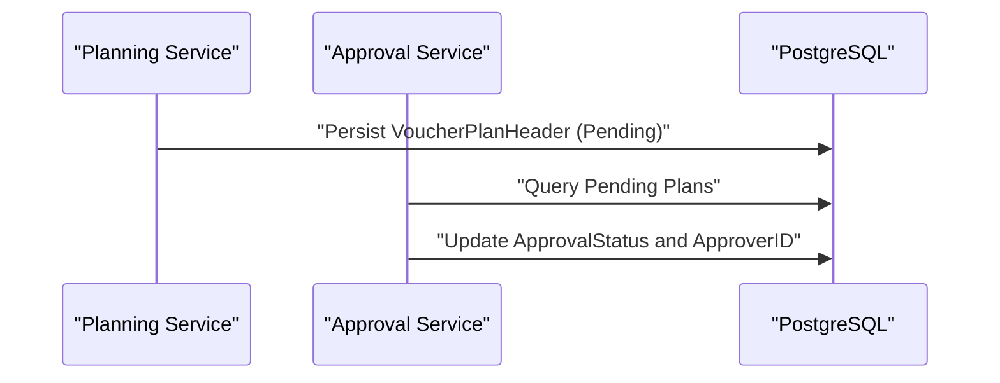
```mermaid
sequenceDiagram
participant Planning as "Planning Service"
participant Approval as "Approval Service"
participant DB as "PostgreSQL"
Planning->>DB : "Persist VoucherPlanHeader (Pending)"
Approval->>DB : "Query Pending Plans"
Approval->>DB : "Update ApprovalStatus and ApproverID"
```

**Diagram sources**
- [docs/architecture.md:21](file://docs/architecture.md#L21)

**Section sources**
- [docs/architecture.md:21](file://docs/architecture.md#L21)

### Integration with Distribution Service (Activation)
- **Activation trigger**: Approved plans initiate distribution activation aligned with PublishDate.
- **Distribution methods**:
  - Self-purchase (Sale)
  - Batch promotion (Promotion)
  - Transfer (Gifting)
- **Tracking**: VoucherDistribution logs method and timestamps for reporting.

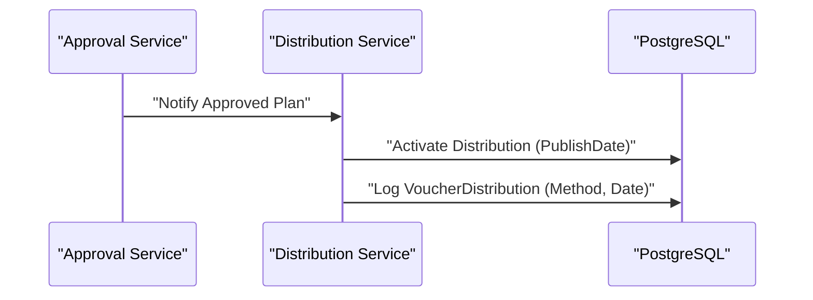
```mermaid
sequenceDiagram
participant Approval as "Approval Service"
participant Dist as "Distribution Service"
participant DB as "PostgreSQL"
Approval->>Dist : "Notify Approved Plan"
Dist->>DB : "Activate Distribution (PublishDate)"
Dist->>DB : "Log VoucherDistribution (Method, Date)"
```

**Diagram sources**
- [docs/architecture.md:23](file://docs/architecture.md#L23)

**Section sources**
- [docs/architecture.md:23](file://docs/architecture.md#L23)

## Credit Consumption Integration

### Idempotent Credit Charging
The Approval Service now integrates with ICreditService to consume credits at plan approval time with idempotent behavior:

- **Pre-approval funding check**: `GetPlanFundingAsync` allows clients to validate sufficient credits before attempting approval.
- **Idempotent consumption**: `TryConsumeForPlanAsync` ensures each plan is charged exactly once, preventing double-charging on retry scenarios.
- **Atomic operation**: Credit consumption occurs before state change, ensuring consistency.
- **Failure handling**: Insufficient credits result in rejection without state changes.

### Credit Consumption Flow
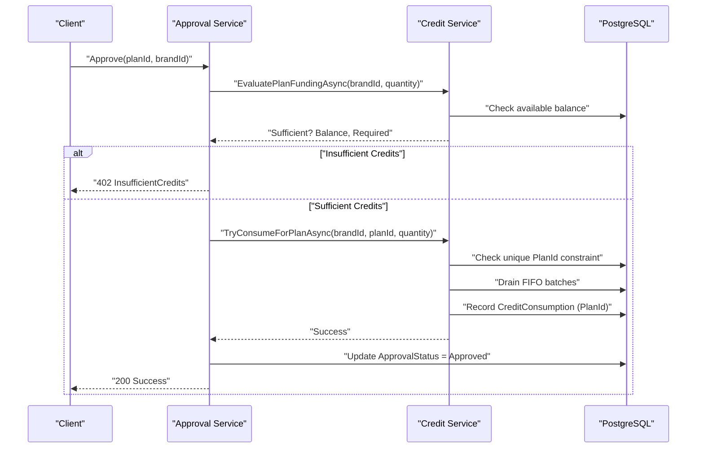
```mermaid
sequenceDiagram
participant Client as "Client"
participant Approval as "Approval Service"
participant Credit as "Credit Service"
participant DB as "PostgreSQL"
Client->>Approval : "Approve(planId, brandId)"
Approval->>Credit : "EvaluatePlanFundingAsync(brandId, quantity)"
Credit->>DB : "Check available balance"
Credit-->>Approval : "Sufficient? Balance, Required"
alt "Insufficient Credits"
Approval-->>Client : "402 InsufficientCredits"
else "Sufficient Credits"
Approval->>Credit : "TryConsumeForPlanAsync(brandId, planId, quantity)"
Credit->>DB : "Check unique PlanId constraint"
Credit->>DB : "Drain FIFO batches"
Credit->>DB : "Record CreditConsumption (PlanId)"
Credit-->>Approval : "Success"
Approval->>DB : "Update ApprovalStatus = Approved"
Approval-->>Client : "200 Success"
end
```

**Diagram sources**
- [src/NonCash.Core/Services/ApprovalService.cs:52-58](file://src/NonCash.Core/Services/ApprovalService.cs#L52-L58)
- [src/NonCash.Infrastructure/Services/CreditService.cs:129-190](file://src/NonCash.Infrastructure/Services/CreditService.cs#L129-L190)

### Funding Validation API
The service provides a dedicated endpoint for pre-approval funding validation:

- **Endpoint**: `GET api/v1/plans/{planId}/funding`
- **Response**: `{ Sufficient, Balance, Required }`
- **Purpose**: Allows clients to validate credit availability before attempting approval
- **Security**: Requires valid brand context and ownership verification

**Section sources**
- [src/NonCash.Core/Services/ApprovalService.cs:170-178](file://src/NonCash.Core/Services/ApprovalService.cs#L170-L178)
- [src/NonCash.API/Controllers/ApprovalsController.cs:67-80](file://src/NonCash.API/Controllers/ApprovalsController.cs#L67-L80)
- [src/NonCash.Infrastructure/Services/CreditService.cs:129-190](file://src/NonCash.Infrastructure/Services/CreditService.cs#L129-L190)

## Voucher Generation Integration

### Optional Voucher Materialization
The Approval Service integrates with IVoucherGenerationService for optional voucher generation during approval:

- **Opt-in feature**: Controlled by `generateVouchers` parameter in approval request
- **Post-commit execution**: Generation occurs after approval commits, never rolling back successful approvals
- **Graceful degradation**: Generation failures return warnings but don't affect approval success
- **Batch limits**: Enforces maximum batch size of 10,000 vouchers per request

### Voucher Generation Process
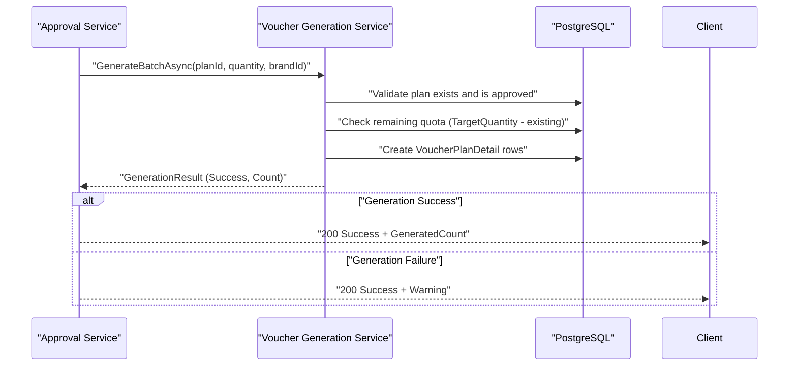
```mermaid
sequenceDiagram
participant Approval as "Approval Service"
participant Generation as "Voucher Generation Service"
participant DB as "PostgreSQL"
Approval->>Generation : "GenerateBatchAsync(planId, quantity, brandId)"
Generation->>DB : "Validate plan exists and is approved"
Generation->>DB : "Check remaining quota (TargetQuantity - existing)"
Generation->>DB : "Create VoucherPlanDetail rows"
Generation-->>Approval : "GenerationResult (Success, Count)"
alt "Generation Success"
Approval-->>Client : "200 Success + GeneratedCount"
else "Generation Failure"
Approval-->>Client : "200 Success + Warning"
end
```

**Diagram sources**
- [src/NonCash.Core/Services/VoucherGenerationService.cs:30-87](file://src/NonCash.Core/Services/VoucherGenerationService.cs#L30-L87)
- [src/NonCash.Core/Services/ApprovalService.cs:82-95](file://src/NonCash.Core/Services/ApprovalService.cs#L82-L95)

### Generation Result Handling
The approval response includes generation metadata:

- **GeneratedCount**: Number of vouchers successfully generated
- **Warning**: Present when generation fails but approval succeeds
- **Success**: Always true if approval succeeds, regardless of generation outcome

**Section sources**
- [src/NonCash.Core/Services/VoucherGenerationService.cs:30-87](file://src/NonCash.Core/Services/VoucherGenerationService.cs#L30-L87)
- [src/NonCash.Core/Services/ApprovalService.cs:82-95](file://src/NonCash.Core/Services/ApprovalService.cs#L82-L95)

### Customization and Extensibility of Approval Workflows
- **Cloning and versioning**: After rejection, clone or create a new version to preserve audit history while iterating on the plan.
- **Approval criteria extension**: Approval criteria can be extended to include budget thresholds, brand-specific rules, or multi-stage approvals by evolving the evaluation logic in the Approval Service.
- **Credit policy integration**: Credit consumption respects FIFO ordering and batch expiry policies.

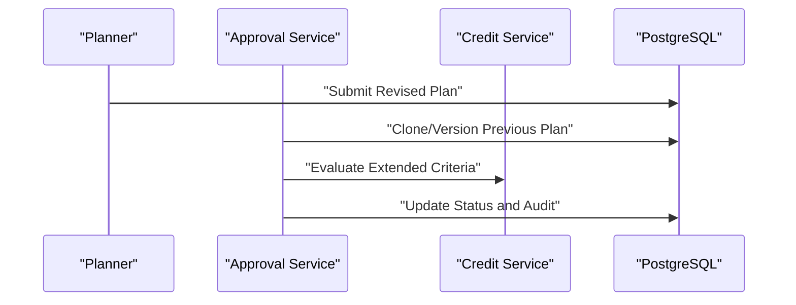
```mermaid
sequenceDiagram
participant Planner as "Planner"
participant Approval as "Approval Service"
participant Credit as "Credit Service"
participant DB as "PostgreSQL"
Planner->>DB : "Submit Revised Plan"
Approval->>DB : "Clone/Version Previous Plan"
Approval->>Credit : "Evaluate Extended Criteria"
Approval->>DB : "Update Status and Audit"
```

**Diagram sources**
- [_bmad-output/planning-artifacts/epics.md:184-196](file://_bmad-output/planning-artifacts/epics.md#L184-L196)

**Section sources**
- [_bmad-output/planning-artifacts/epics.md:184-196](file://_bmad-output/planning-artifacts/epics.md#L184-L196)

## Dependency Analysis
The Approval Service depends on:
- **Planning Service** for plan submission and initial state.
- **Credit Service** for consumption management and funding evaluation.
- **Voucher Generation Service** for optional voucher materialization.
- **Distribution Service** for post-approval activation.
- **Identity & Tenant Service** for RBAC and multi-tenancy.
- **PostgreSQL via EF Core** for persistence and transactional integrity.

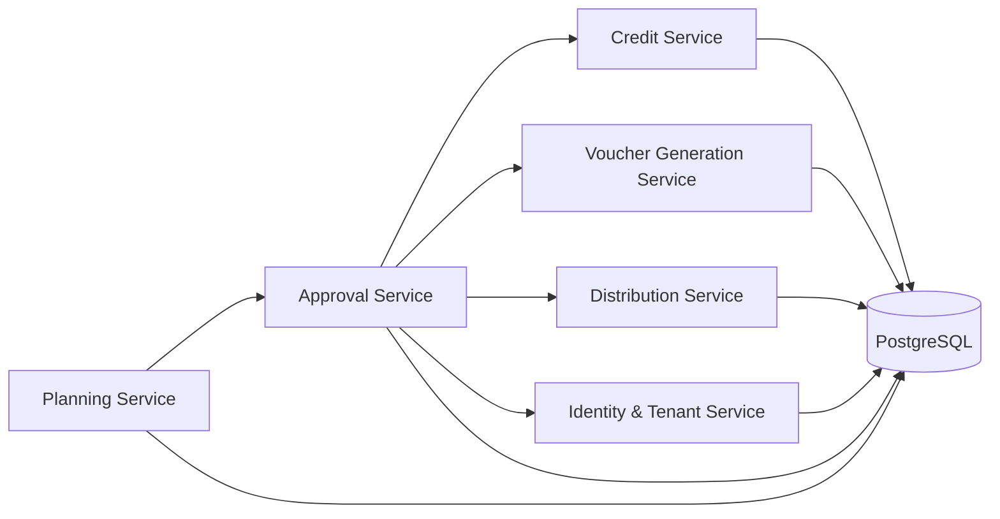
```mermaid
graph LR
PlanningSvc["Planning Service"] --> ApprovalSvc["Approval Service"]
ApprovalSvc --> CreditSvc["Credit Service"]
ApprovalSvc --> GenerationSvc["Voucher Generation Service"]
ApprovalSvc --> DistributionSvc["Distribution Service"]
ApprovalSvc --> IdentitySvc["Identity & Tenant Service"]
ApprovalSvc --> DB[("PostgreSQL")]
PlanningSvc --> DB
CreditSvc --> DB
GenerationSvc --> DB
DistributionSvc --> DB
IdentitySvc --> DB
```

**Diagram sources**
- [docs/architecture.md:20-25](file://docs/architecture.md#L20-L25)

**Section sources**
- [docs/architecture.md:20-25](file://docs/architecture.md#L20-L25)

## Performance Considerations
- **Minimize long-running approval sessions**: Implement timeouts and escalations.
- **Use indexing on ApprovalStatus, BrandID, and ApproverID**: For efficient querying.
- **Batch operations for distribution activation**: To reduce latency.
- **Maintain audit logs asynchronously**: To avoid blocking primary approval flow.
- **Idempotent credit consumption**: Prevents duplicate charges on retries.
- **FIFO credit draining**: Optimizes credit usage across expiring batches.
- **Voucher generation batching**: Supports up to 10,000 vouchers per request.

## Troubleshooting Guide
- **Audit trail verification**: Confirm reviewer identity, timestamp, and notes recorded for every approval action.
- **Credit consumption audit**: Check CreditConsumption table for plan-level charges with PlanId references.
- **Rejected plan iteration**: Use cloning/versioning to preserve history and re-evaluate with adjusted criteria.
- **POS rollback**: Utilize rollback endpoint to release locks when transactions fail.
- **Multi-tenancy checks**: Ensure BrandID isolation and role-based access align with business requirements.
- **Funding validation issues**: Use `/funding` endpoint to diagnose credit availability problems.
- **Voucher generation failures**: Check warning messages in approval responses for generation issues.

**Section sources**
- [src/NonCash.Core/Entities/CreditConsumption.cs:3-31](file://src/NonCash.Core/Entities/CreditConsumption.cs#L3-L31)
- [src/NonCash.API/Controllers/ApprovalsController.cs:67-80](file://src/NonCash.API/Controllers/ApprovalsController.cs#L67-L80)

## Conclusion
The Approval Service centralizes voucher plan governance with a streamlined single-level approval workflow, robust audit trails, integrated credit consumption with idempotent charging, optional voucher generation, and clear integration points with Planning and Distribution Services. By leveraging multi-tenancy, role-based access, transactional persistence, and credit policy enforcement, it ensures secure, traceable, and extensible approval processes suitable for iterative business needs.

## Appendices
- **API Contracts**: POS verification, locking, redemption, and rollback endpoints support the usage lifecycle and complement approval workflows.
- **Data Models**: Entities and relationships underpin approval state transitions and downstream distribution logging.
- **Credit Consumption Model**: Plan-level charges use aggregate CreditConsumption entries with PlanId uniqueness for idempotency.
- **Voucher Generation Limits**: Maximum 10,000 vouchers per generation request with sequential numbering.

**Section sources**
- [docs/api-contracts.md:14-87](file://docs/api-contracts.md#L14-L87)
- [docs/data-models.md:11-61](file://docs/data-models.md#L11-L61)
- [src/NonCash.Core/Entities/CreditConsumption.cs:3-31](file://src/NonCash.Core/Entities/CreditConsumption.cs#L3-L31)
- [src/NonCash.Core/Services/VoucherGenerationService.cs:35-36](file://src/NonCash.Core/Services/VoucherGenerationService.cs#L35-L36)