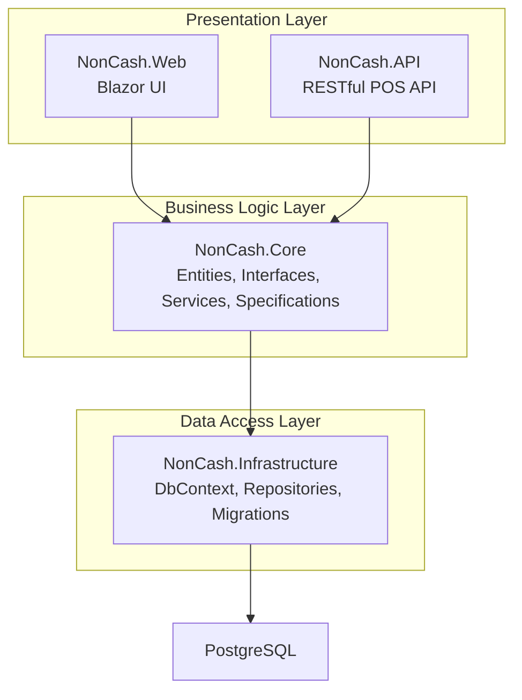
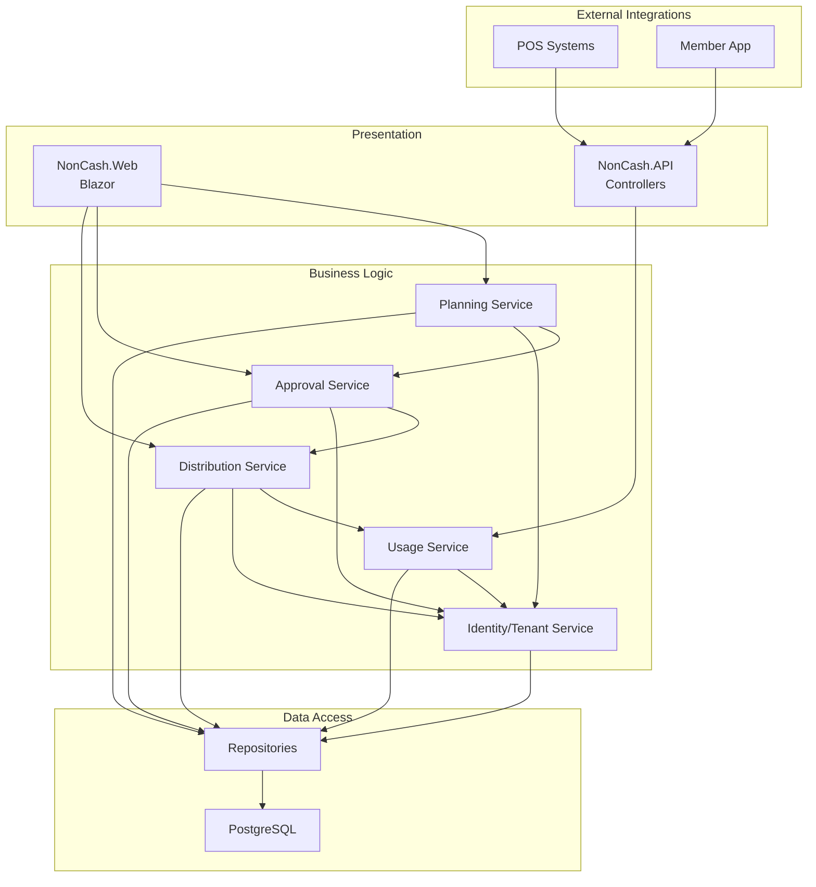
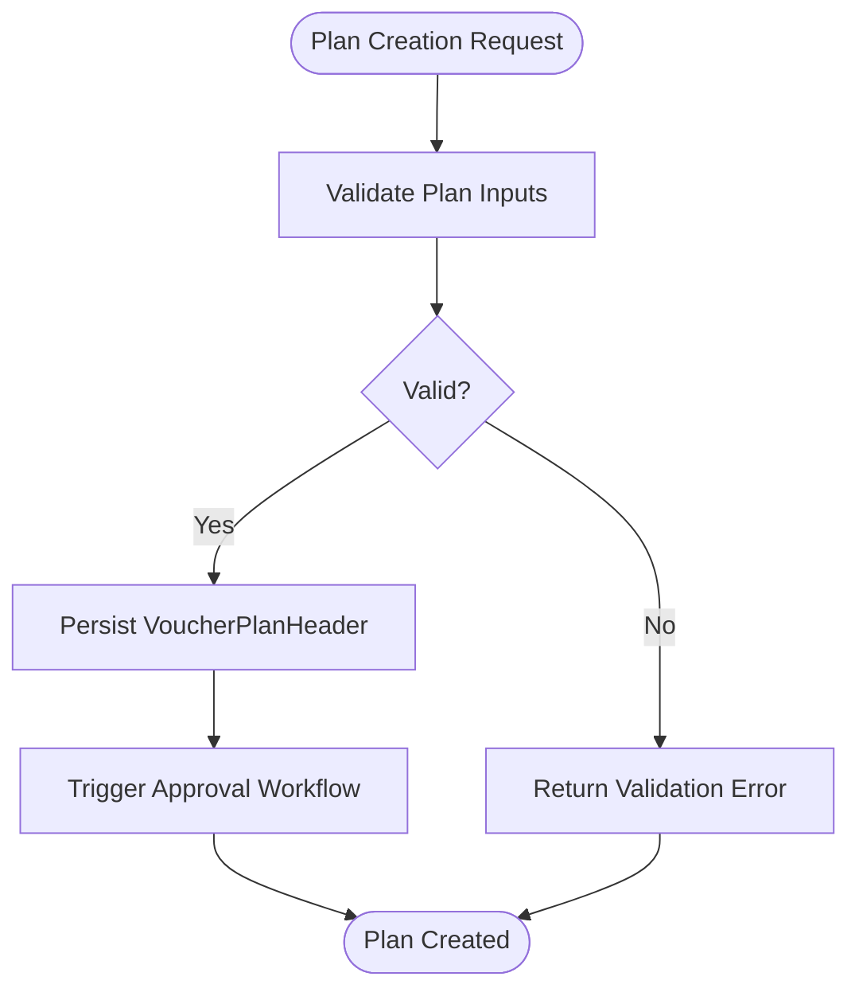
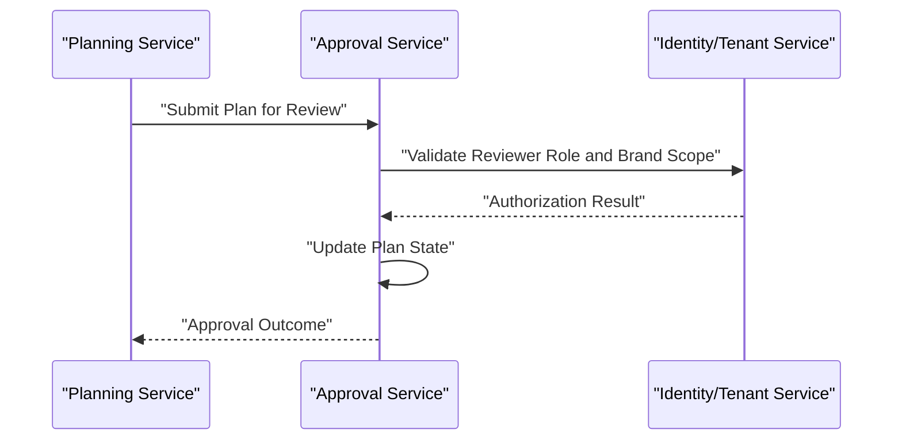
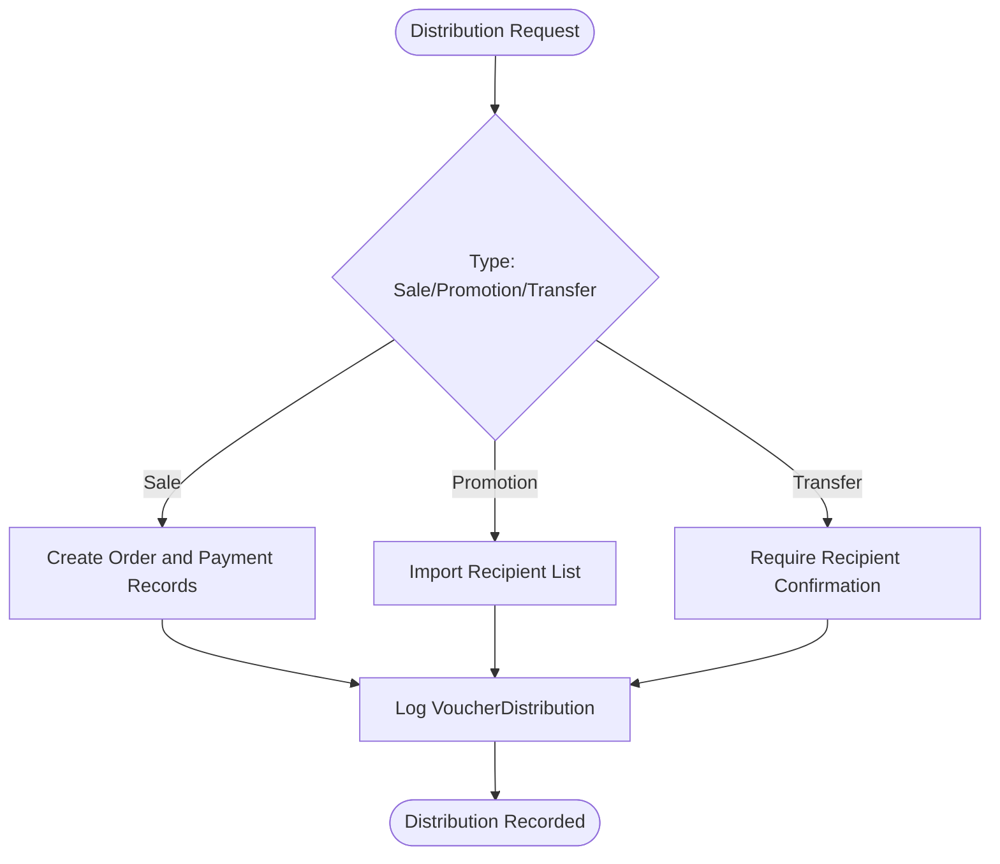
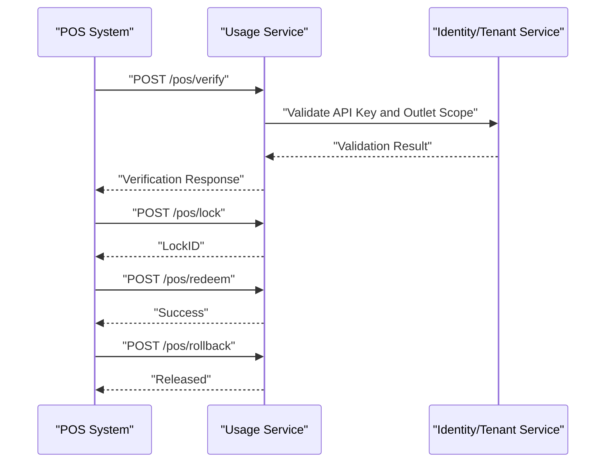
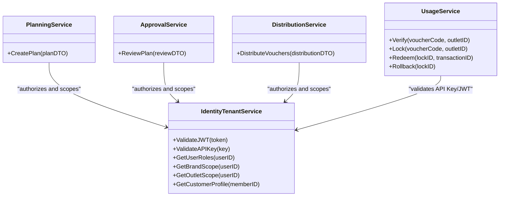
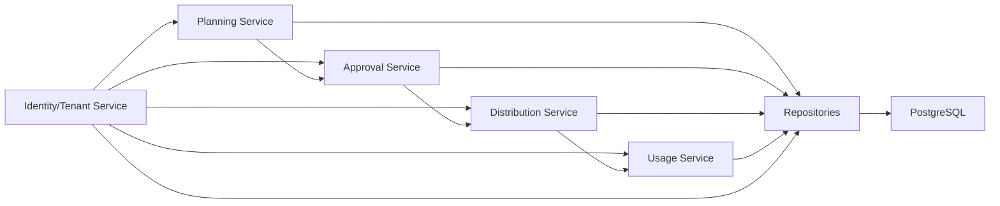

# Core Services Implementation

<cite>
**Referenced Files in This Document**
- [architecture.md](file://docs/architecture.md)
- [data-models.md](file://docs/data-models.md)
- [api-contracts.md](file://docs/api-contracts.md)
- [source-tree-analysis.md](file://docs/source-tree-analysis.md)
- [Key Functionalities.txt](file://Key Functionalities.txt)
- [description.txt](file://description.txt)
- [epics.md](file://_bmad-output/planning-artifacts/epics.md)
- [config.yaml](file://_bmad/core/config.yaml)
- [bmm-config.yaml](file://_bmad/bmm/config.yaml)
- [manifest.yaml](file://_bmad/_config/manifest.yaml)
</cite>

## Table of Contents
1. [Introduction](#introduction)
2. [Project Structure](#project-structure)
3. [Core Components](#core-components)
4. [Architecture Overview](#architecture-overview)
5. [Detailed Component Analysis](#detailed-component-analysis)
6. [Dependency Analysis](#dependency-analysis)
7. [Performance Considerations](#performance-considerations)
8. [Troubleshooting Guide](#troubleshooting-guide)
9. [Conclusion](#conclusion)
10. [Appendices](#appendices)

## Introduction
This document details the core services implementation for the NonCash SaaS platform, focusing on the five microservices: Planning Service, Approval Service, Distribution Service, Usage Service, and Identity/Tenant Service. It explains responsibilities, implementation patterns, invocation relationships, and integration points across the 3-layer architecture. It also covers data exchange mechanisms, error handling strategies, and operational concerns such as scalability, fault tolerance, and monitoring. The content is grounded in the repository’s architecture, data models, API contracts, and functional specifications.

## Project Structure
The NonCash project follows a 3-layer SaaS architecture with a clear separation of concerns:
- Business Logic Layer (BLL): Implemented as microservices under NonCash.Core.Services.
- Data Access Layer (DAL): Implemented via NonCash.Infrastructure with Entity Framework Core and PostgreSQL.
- Presentation Layer: NonCash.Web (Blazor) for management staff and NonCash.API (RESTful) for POS integrations.
- Shared Contracts: NonCash.Shared for cross-cutting models and constants.

**Diagram sources**
- [source-tree-analysis.md:10-28](file://docs/source-tree-analysis.md#L10-L28)
- [architecture.md:17-34](file://docs/architecture.md#L17-L34)

**Section sources**
- [source-tree-analysis.md:1-50](file://docs/source-tree-analysis.md#L1-L50)
- [architecture.md:1-52](file://docs/architecture.md#L1-L52)

## Core Components
This section maps each microservice to its responsibilities, boundary definitions, and integration patterns with other layers and services.

- Planning Service
  - Responsibilities: Create and manage voucher plan headers and details, define budgets, targets, validity ranges, and outlet acceptance lists. Coordinate with Approval Service for routing and state transitions.
  - Boundaries: Operates on entities such as VoucherPlanHeader and VoucherPlanDetail; integrates with Identity/Tenant Service for brand and user context.
  - Integration: Invoked by Web UI for plan creation and by Approval Service for review workflows.

- Approval Service
  - Responsibilities: Route plans for review, manage approval state transitions, and record reviewer actions with notes and timestamps.
  - Boundaries: Maintains plan lifecycle state machine and collaborates with Identity/Tenant Service for role-based access checks.
  - Integration: Receives requests from Planning Service and emits notifications/state updates to Planning Service.

- Distribution Service
  - Responsibilities: Handle sales, promotions, and inbox deliveries; track distribution events and member ownership; support transfer workflows.
  - Boundaries: Works with VoucherDistribution and VoucherPlanDetail; enforces multi-tenancy via BrandID and Outlet constraints.
  - Integration: Consumes Planning/Approval outcomes and supports Member App interactions.

- Usage Service
  - Responsibilities: Orchestrates POS redemption via Verify/Lock/Redeem/Rollback workflows; maintains transactional integrity for usage events.
  - Boundaries: Manages VoucherPlanDetail usage status and VoucherUsage records; validates outlet permissions and plan publication dates.
  - Integration: Exposes REST endpoints consumed by POS systems; integrates with Identity/Tenant Service for API Key and JWT validation.

- Identity/Tenant Service
  - Responsibilities: Enforce RBAC for UserAccount roles, manage multi-tenancy via BrandID and Outlet scoping, and maintain Customer profiles.
  - Boundaries: Provides identity and tenant context to all services; validates JWT tokens and API keys for external integrations.
  - Integration: Supplies tenant-aware context to Planning/Approval/Distribution/Usage services; secures API endpoints.

**Section sources**
- [architecture.md:17-26](file://docs/architecture.md#L17-L26)
- [data-models.md:9-98](file://docs/data-models.md#L9-L98)
- [api-contracts.md:1-109](file://docs/api-contracts.md#L1-L109)
- [Key Functionalities.txt:7-167](file://Key Functionalities.txt#L7-L167)

## Architecture Overview
The microservices collaborate across layers with explicit data exchange and security controls:

**Diagram sources**
- [architecture.md:9-34](file://docs/architecture.md#L9-L34)
- [source-tree-analysis.md:10-28](file://docs/source-tree-analysis.md#L10-L28)
- [data-models.md:9-98](file://docs/data-models.md#L9-L98)

## Detailed Component Analysis

### Planning Service
- Responsibilities
  - Create and update VoucherPlanHeader with budget, targets, validity ranges, and outlet lists.
  - Generate VoucherPlanDetail entries upon approval.
  - Track plan progress and maintain audit trails.
- Implementation patterns
  - Domain-driven design with Entities and Specifications.
  - Repository pattern for persistence via NonCash.Infrastructure.
  - Tenant scoping via BrandID from Identity/Tenant Service context.
- Invocation relationships
  - Called by Web UI for plan creation and updates.
  - Triggers Approval Service for review routing.
- Data exchange
  - Uses DTOs for plan creation/update; persists via repositories.
- Error handling
  - Validates input constraints and plan eligibility; returns structured errors to caller.
- Scalability and monitoring
  - Stateless service; scale out horizontally; monitor plan throughput and approval latency.

**Diagram sources**
- [Key Functionalities.txt:7-86](file://Key Functionalities.txt#L7-L86)
- [data-models.md:9-43](file://docs/data-models.md#L9-L43)

**Section sources**
- [Key Functionalities.txt:7-86](file://Key Functionalities.txt#L7-L86)
- [data-models.md:9-43](file://docs/data-models.md#L9-L43)
- [architecture.md:17-26](file://docs/architecture.md#L17-L26)

### Approval Service
- Responsibilities
  - Route plans for review, enforce single-level approval process, and record reviewer actions.
  - Update plan state to Approved/Rejected and adjust publish date as needed.
- Implementation patterns
  - State machine for plan lifecycle; repository-backed persistence.
  - Role-based access checks via Identity/Tenant Service.
- Invocation relationships
  - Receives requests from Planning Service; notifies downstream services on state change.
- Data exchange
  - Accepts review decisions and returns updated plan state.
- Error handling
  - Rejects invalid reviewers or out-of-scope brands; logs review actions.
- Scalability and monitoring
  - Stateless; scale out; monitor approval rate and reviewer response time.

**Diagram sources**
- [architecture.md:20-26](file://docs/architecture.md#L20-L26)
- [Key Functionalities.txt:70-86](file://Key Functionalities.txt#L70-L86)

**Section sources**
- [Key Functionalities.txt:70-86](file://Key Functionalities.txt#L70-L86)
- [architecture.md:20-26](file://docs/architecture.md#L20-L26)

### Distribution Service
- Responsibilities
  - Process sales, promotions, and inbox deliveries.
  - Track distribution events and member ownership.
  - Support transfer workflows between members.
- Implementation patterns
  - Event-driven updates to VoucherPlanDetail and VoucherDistribution.
  - Multi-tenancy enforcement via BrandID and Outlet constraints.
- Invocation relationships
  - Consumes approved plan outcomes; supports Member App queries.
- Data exchange
  - Creates distribution records and updates ownership metadata.
- Error handling
  - Validates member existence and transfer eligibility; handles batch promotion imports.
- Scalability and monitoring
  - Stateless; scale out; monitor distribution throughput and transfer confirmations.

**Diagram sources**
- [Key Functionalities.txt:87-134](file://Key Functionalities.txt#L87-L134)
- [data-models.md:44-62](file://docs/data-models.md#L44-L62)

**Section sources**
- [Key Functionalities.txt:87-134](file://Key Functionalities.txt#L87-L134)
- [data-models.md:44-62](file://docs/data-models.md#L44-L62)

### Usage Service
- Responsibilities
  - POS redemption orchestration: Verify, Lock, Redeem, and Rollback.
  - Maintain transactional integrity for usage events.
- Implementation patterns
  - RESTful controllers for POS endpoints; repository-backed usage tracking.
  - Dynamic voucher code validation aligned with security requirements.
- Invocation relationships
  - POS systems call Usage Service endpoints; returns lock identifiers and status.
- Data exchange
  - Uses API DTOs for verify/lock/redeem/rollback; writes VoucherUsage records.
- Error handling
  - Validates outlet permissions, plan publish date, and lock ownership; supports rollback on failure.
- Scalability and monitoring
  - Stateless; scale out; monitor redemption latency and lock timeouts.

**Diagram sources**
- [api-contracts.md:10-88](file://docs/api-contracts.md#L10-L88)
- [data-models.md:46-54](file://docs/data-models.md#L46-L54)
- [architecture.md:36-40](file://docs/architecture.md#L36-L40)

**Section sources**
- [api-contracts.md:10-88](file://docs/api-contracts.md#L10-L88)
- [data-models.md:46-54](file://docs/data-models.md#L46-L54)
- [architecture.md:36-40](file://docs/architecture.md#L36-L40)

### Identity/Tenant Service
- Responsibilities
  - RBAC for UserAccount roles (Admin, Planner, Approver).
  - Multi-tenancy via BrandID and Outlet scoping.
  - Profile management for Customer and JWT token issuance.
- Implementation patterns
  - Centralized identity provider; integrates with Planning/Approval/Distribution/Usage services.
- Invocation relationships
  - All services call into Identity/Tenant Service for authorization and tenant context.
- Data exchange
  - Provides user roles, brand/outlet scopes, and customer profiles.
- Error handling
  - Rejects unauthorized access attempts; logs security events.
- Scalability and monitoring
  - Stateless; scale out; monitor auth failures and token validation rates.

**Diagram sources**
- [architecture.md:20-26](file://docs/architecture.md#L20-L26)
- [data-models.md:63-98](file://docs/data-models.md#L63-L98)

**Section sources**
- [architecture.md:20-26](file://docs/architecture.md#L20-L26)
- [data-models.md:63-98](file://docs/data-models.md#L63-L98)

## Dependency Analysis
The services exhibit low coupling and high cohesion, with clear dependency directions:

**Diagram sources**
- [architecture.md:17-34](file://docs/architecture.md#L17-L34)
- [source-tree-analysis.md:10-28](file://docs/source-tree-analysis.md#L10-L28)

**Section sources**
- [architecture.md:17-34](file://docs/architecture.md#L17-L34)
- [source-tree-analysis.md:10-28](file://docs/source-tree-analysis.md#L10-L28)

## Performance Considerations
- Horizontal scaling
  - All services are stateless and can be scaled independently based on workload.
- Data consistency
  - Use database transactions for POS usage operations to ensure atomicity.
- Caching
  - Cache frequently accessed plan and outlet metadata; invalidate on plan changes.
- Monitoring
  - Track service latency, error rates, and throughput; instrument cross-service calls.
- Resilience
  - Implement circuit breakers and retries for inter-service calls; use idempotent operations where possible.

## Troubleshooting Guide
- Authorization failures
  - Verify JWT/API Key validity and tenant scope; check user roles and brand/outlet associations.
- POS redemption issues
  - Confirm plan publish date, outlet permissions, and lock ownership; handle rollback on failures.
- Distribution errors
  - Validate member existence and transfer eligibility; review batch import logs.
- Audit and tracing
  - Enable structured logging and correlation IDs for end-to-end tracing across services.

**Section sources**
- [architecture.md:36-40](file://docs/architecture.md#L36-L40)
- [Key Functionalities.txt:135-156](file://Key Functionalities.txt#L135-L156)

## Conclusion
The NonCash platform’s microservices are designed for scalability, security, and maintainability within a 3-layer SaaS architecture. Planning, Approval, Distribution, Usage, and Identity/Tenant Services each encapsulate distinct responsibilities, communicate via well-defined contracts, and integrate with PostgreSQL through a robust repository pattern. By adhering to the documented boundaries, data models, and API contracts, teams can implement resilient, observable, and extensible solutions.

## Appendices
- Security and compliance
  - Multi-tenancy enforced via BrandID; dynamic voucher codes mitigate reuse; API Key and JWT used for external integrations.
- Operational guidelines
  - Follow 3-layer architecture; keep services stateless; leverage shared models in NonCash.Shared; monitor and alert on SLIs/SLOs.

**Section sources**
- [description.txt:22-31](file://description.txt#L22-L31)
- [epics.md:26-37](file://_bmad-output/planning-artifacts/epics.md#L26-L37)
- [manifest.yaml:1-25](file://_bmad/_config/manifest.yaml#L1-L25)
- [bmm-config.yaml:1-17](file://_bmad/bmm/config.yaml#L1-L17)
- [config.yaml:1-10](file://_bmad/core/config.yaml#L1-L10)