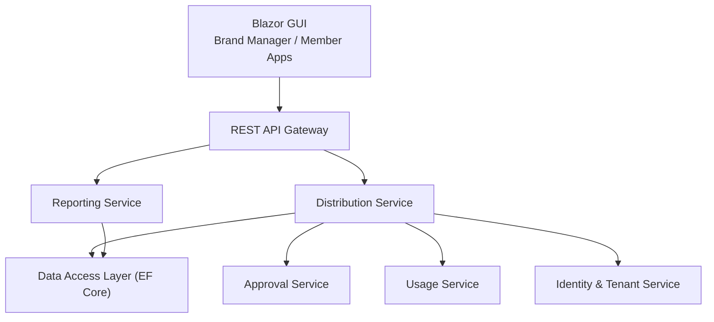
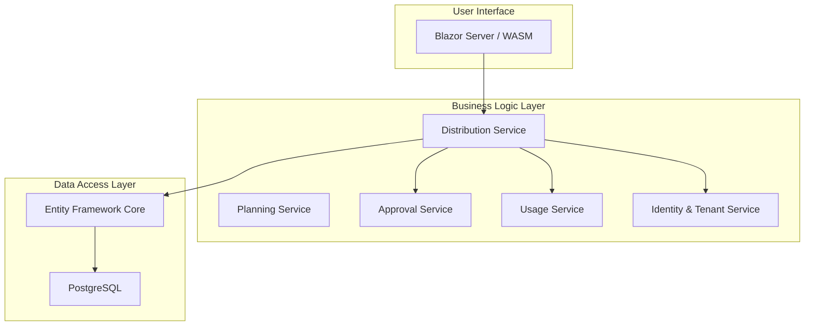
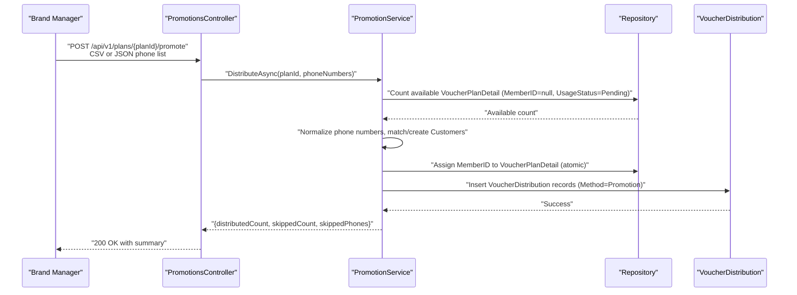
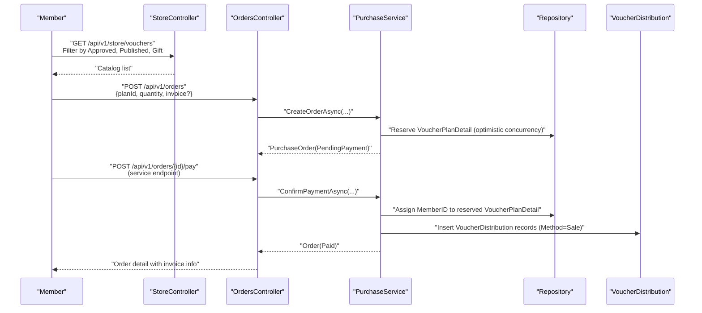
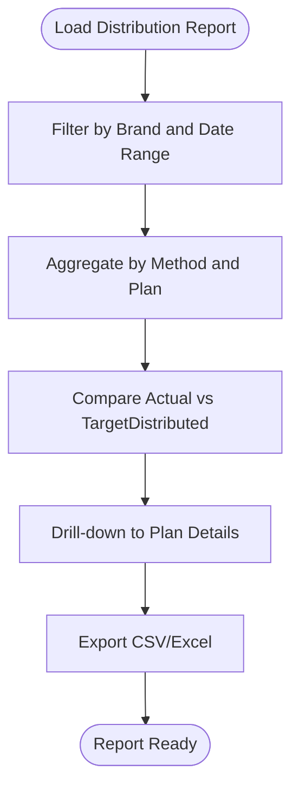
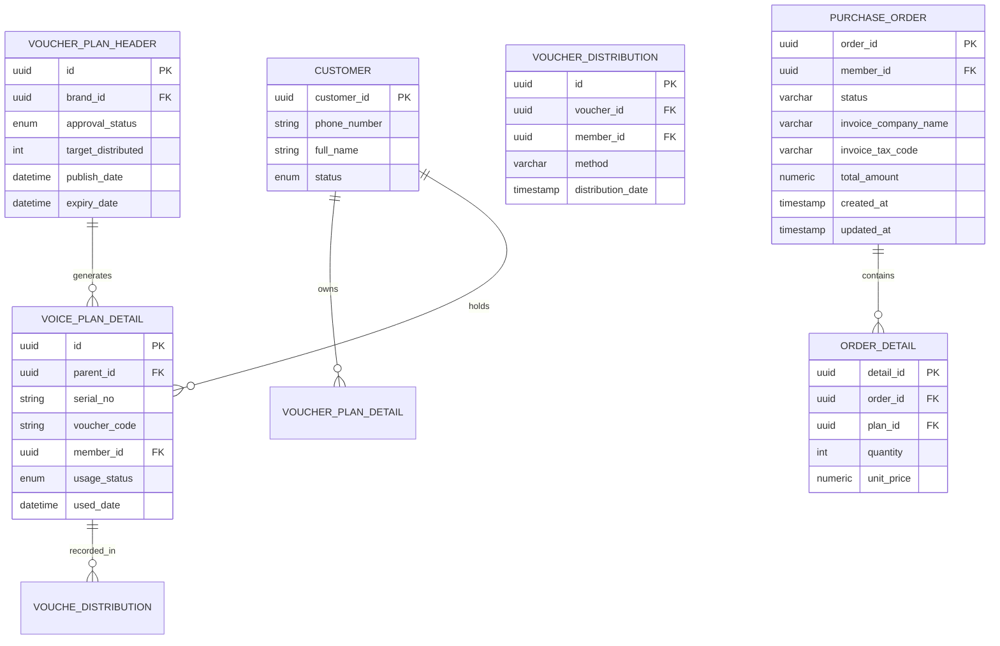
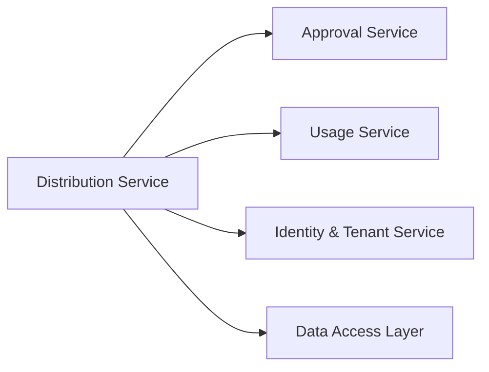

# Distribution Service

<cite>
**Referenced Files in This Document**
- [architecture.md](file://docs/architecture.md)
- [data-models.md](file://docs/data-models.md)
- [api-contracts.md](file://docs/api-contracts.md)
- [epics.md](file://_bmad-output/planning-artifacts/epics.md)
- [Key Functionalities.txt](file://Key Functionalities.txt)
- [3-1-batch-promotion-distribution.md](file://_bmad-output/implementation-artifacts/3-1-batch-promotion-distribution.md)
- [3-2-self-purchase-b2c-b2b.md](file://_bmad-output/implementation-artifacts/3-2-self-purchase-b2c-b2b.md)
- [3-3-gifting-batch-transfer.md](file://_bmad-output/implementation-artifacts/3-3-gifting-batch-transfer.md)
- [3-4-distribution-tracking-dashboard.md](file://_bmad-output/implementation-artifacts/3-4-distribution-tracking-dashboard.md)
</cite>

## Table of Contents
1. [Introduction](#introduction)
2. [Project Structure](#project-structure)
3. [Core Components](#core-components)
4. [Architecture Overview](#architecture-overview)
5. [Detailed Component Analysis](#detailed-component-analysis)
6. [Dependency Analysis](#dependency-analysis)
7. [Performance Considerations](#performance-considerations)
8. [Troubleshooting Guide](#troubleshooting-guide)
9. [Conclusion](#conclusion)
10. [Appendices](#appendices)

## Introduction
This document provides comprehensive documentation for the Distribution Service within the NonCash platform. The service orchestrates multi-channel voucher distribution mechanisms, including direct sales, batch promotions, social gifting, and inbox delivery. It manages distribution channels, enforces real-time availability and eligibility checks, and maintains a canonical audit trail of all distribution events. The documentation also covers integration patterns with the Approval Service for activated plans and with the Usage Service for tracking distribution effectiveness, along with performance optimization strategies, error handling, analytics reporting, and guidance for configuring new distribution channels and customizing distribution rules.

## Project Structure
The Distribution Service is part of the Business Logic Layer (BLL) microservices and integrates with the Data Access Layer (DAL) and the User Interface (GUI). It collaborates with:
- Approval Service: to validate plan status (Approved/Published) before distribution
- Usage Service: to record and track distribution effectiveness via POS redemption logs
- Identity & Tenant Service: for role-based access control and brand isolation



**Diagram sources**
- [architecture.md: 17-26:17-26](file://docs/architecture.md#L17-L26)

**Section sources**
- [architecture.md: 17-26:17-26](file://docs/architecture.md#L17-L26)

## Core Components
The Distribution Service is composed of the following core components:
- Promotion Service: handles batch promotions and inbox delivery
- Purchase Service: supports direct sales (B2C/B2B) via a purchase order lifecycle
- Transfer Service: enables social gifting and batch ownership reassignment
- Distribution Reporting Service: aggregates distribution activity for analytics and dashboards
- Supporting entities and enums: VoucherPlanDetail, VoucherDistribution, DistributionMethod, PurchaseOrder, OrderStatus

Key responsibilities:
- Enforce distribution eligibility (plan status, publish date, stock availability)
- Maintain atomic distribution operations with rollback capability
- Record canonical distribution events for auditing and reporting
- Integrate with Approval Service for plan activation and with Usage Service for redemption tracking

**Section sources**
- [3-1-batch-promotion-distribution.md: 47-91:47-91](file://_bmad-output/implementation-artifacts/3-1-batch-promotion-distribution.md#L47-L91)
- [3-2-self-purchase-b2c-b2b.md: 48-94:48-94](file://_bmad-output/implementation-artifacts/3-2-self-purchase-b2c-b2b.md#L48-L94)
- [3-3-gifting-batch-transfer.md: 43-76:43-76](file://_bmad-output/implementation-artifacts/3-3-gifting-batch-transfer.md#L43-L76)
- [3-4-distribution-tracking-dashboard.md: 41-75:41-75](file://_bmad-output/implementation-artifacts/3-4-distribution-tracking-dashboard.md#L41-L75)
- [data-models.md: 34-61:34-61](file://docs/data-models.md#L34-L61)

## Architecture Overview
The Distribution Service operates within a 3-layer SaaS architecture:
- Business Logic Layer (BLL): Microservices including Planning, Approval, Distribution, Usage, and Identity services
- Data Access Layer (DAL): EF Core with PostgreSQL, using repository pattern
- User Interface (GUI): Blazor applications for admin and member experiences



**Diagram sources**
- [architecture.md: 5-26:5-26](file://docs/architecture.md#L5-L26)

**Section sources**
- [architecture.md: 5-26:5-26](file://docs/architecture.md#L5-L26)

## Detailed Component Analysis

### Promotion Service (Batch Promotion Distribution)
Promotion Service automates sending vouchers to members’ inboxes via batch uploads. It validates plan eligibility, checks stock availability, normalizes phone numbers, auto-creates customers when needed, and records distribution events.



**Diagram sources**
- [3-1-batch-promotion-distribution.md: 47-115:47-115](file://_bmad-output/implementation-artifacts/3-1-batch-promotion-distribution.md#L47-L115)

Key behaviors:
- Eligibility: plan must be Approved or Published; Publish Date must be effective
- Stock: all-or-nothing allocation; insufficient stock returns 400
- Customer matching: normalize phone numbers; upsert unknown customers
- Audit: each assignment creates a VoucherDistribution record with Method=Promotion
- Security: brand isolation and role gating for execution

**Section sources**
- [3-1-batch-promotion-distribution.md: 11-46:11-46](file://_bmad-output/implementation-artifacts/3-1-batch-promotion-distribution.md#L11-L46)
- [3-1-batch-promotion-distribution.md: 77-115:77-115](file://_bmad-output/implementation-artifacts/3-1-batch-promotion-distribution.md#L77-L115)
- [data-models.md: 55-61:55-61](file://docs/data-models.md#L55-L61)

### Purchase Service (Direct Sales)
Purchase Service supports B2C/B2B self-purchase via a purchase order lifecycle. It validates stock availability, reserves inventory, and allocates vouchers upon payment confirmation.



**Diagram sources**
- [3-2-self-purchase-b2c-b2b.md: 48-118:48-118](file://_bmad-output/implementation-artifacts/3-2-self-purchase-b2c-b2b.md#L48-L118)

Key behaviors:
- Catalog visibility: filter by VoucherType=Gift, ApprovalStatus=Approved, PublishDate, ExpiryDate
- Stock: optimistic allocation at payment confirmation; InsufficientStock on conflict
- Payment: simulated/manual confirmation endpoint; payment processing out of scope for MVP
- Audit: Method=Sale in VoucherDistribution

**Section sources**
- [3-2-self-purchase-b2c-b2b.md: 11-47:11-47](file://_bmad-output/implementation-artifacts/3-2-self-purchase-b2c-b2b.md#L11-L47)
- [3-2-self-purchase-b2c-b2b.md: 76-118:76-118](file://_bmad-output/implementation-artifacts/3-2-self-purchase-b2c-b2b.md#L76-L118)
- [data-models.md: 55-61:55-61](file://docs/data-models.md#L55-L61)

### Transfer Service (Social Gifting)
Transfer Service enables ownership reassignment of vouchers among members. It validates ownership and status, maps vouchers to recipients, and records distribution events.

```mermaid
sequenceDiagram
participant Member as "Member"
participant API as "MemberVouchersController"
participant Trans as "TransferService"
participant Repo as "Repository"
participant Dist as "VoucherDistribution"
Member->>API : "POST /api/v1/member/vouchers/transfer"<br/>{voucherIds[], recipientPhones[]}
API->>Trans : "TransferAsync(fromMemberId, voucherIds, recipientPhones)"
Trans->>Trans : "Validate ownership and UsageStatus=Pending"
Trans->>Repo : "Match phones to Customers; skip blacklisted"
Trans->>Repo : "Assign MemberID to each VoucherPlanDetail (atomic)"
Trans->>Dist : "Insert VoucherDistribution records (Method=Transfer)"
Dist-->>Trans : "Success"
Trans-->>API : "{transferredCount, skippedPhones[]}"
API-->>Member : "200 OK with summary"
```

**Diagram sources**
- [3-3-gifting-batch-transfer.md: 43-96:43-96](file://_bmad-output/implementation-artifacts/3-3-gifting-batch-transfer.md#L43-L96)

Key behaviors:
- Ownership: only vouchers owned by the caller can be transferred
- Validation: strict 1-to-1 mapping; mismatched counts return 400
- Recipients: auto-create customers for unknown phones; skip blacklisted entries
- Audit: Method=Transfer in VoucherDistribution

**Section sources**
- [3-3-gifting-batch-transfer.md: 11-42:11-42](file://_bmad-output/implementation-artifacts/3-3-gifting-batch-transfer.md#L11-L42)
- [3-3-gifting-batch-transfer.md: 64-96:64-96](file://_bmad-output/implementation-artifacts/3-3-gifting-batch-transfer.md#L64-L96)
- [data-models.md: 55-61:55-61](file://docs/data-models.md#L55-L61)

### Distribution Reporting Service
Distribution Reporting Service aggregates distribution activity for dashboards and analytics, enabling brand managers to compare actual versus target distribution.



**Diagram sources**
- [3-4-distribution-tracking-dashboard.md: 41-91:41-91](file://_bmad-output/implementation-artifacts/3-4-distribution-tracking-dashboard.md#L41-L91)

Key behaviors:
- Aggregation: totals, by method (Sale/Promotion/Transfer), by plan, by date range
- Target comparison: compute percentage vs TargetDistributed
- Drill-down: view detail records per plan
- Export: generate CSV/Excel for current filters

**Section sources**
- [3-4-distribution-tracking-dashboard.md: 11-40:11-40](file://_bmad-output/implementation-artifacts/3-4-distribution-tracking-dashboard.md#L11-L40)
- [3-4-distribution-tracking-dashboard.md: 61-91:61-91](file://_bmad-output/implementation-artifacts/3-4-distribution-tracking-dashboard.md#L61-L91)

### Data Models and Relationships
Core entities supporting distribution:
- VoucherPlanHeader: campaign-level plan definition and targets
- VoucherPlanDetail: individual voucher instances with MemberID and UsageStatus
- VoucherDistribution: canonical audit trail of distribution events
- PurchaseOrder and OrderDetail: B2C/B2B purchase lifecycle
- Customer: end-user identity for ownership and notifications



**Diagram sources**
- [data-models.md: 11-61:11-61](file://docs/data-models.md#L11-L61)

**Section sources**
- [data-models.md: 11-61:11-61](file://docs/data-models.md#L11-L61)

## Dependency Analysis
Distribution Service depends on:
- Approval Service: ensures plans are Approved or Published and live per PublishDate
- Usage Service: provides redemption context and POS integration for effectiveness tracking
- Identity & Tenant Service: enforces brand isolation and role-based access
- DAL: repository pattern for data consistency and transaction boundaries



**Diagram sources**
- [architecture.md: 17-26:17-26](file://docs/architecture.md#L17-L26)

**Section sources**
- [architecture.md: 17-26:17-26](file://docs/architecture.md#L17-L26)
- [epics.md: 171-204:171-204](file://_bmad-output/planning-artifacts/epics.md#L171-L204)

## Performance Considerations
High-volume distribution events:
- Batch promotion: consider background processing for large lists (>1000) using hosted services or queue-based approaches; synchronous processing with timeouts is acceptable for MVP
- Stock checks: pre-validate available stock and enforce all-or-nothing allocation to minimize partial writes
- Optimistic concurrency: for purchase allocation, validate stock at payment confirmation; implement retries on conflicts
- Reporting: use raw SQL or Dapper for aggregation if EF GroupBy performance is insufficient; avoid over-optimization until measured
- Transactions: wrap distribution operations to ensure atomicity; rollback MemberID updates on downstream failures

[No sources needed since this section provides general guidance]

## Troubleshooting Guide
Common issues and resolutions:
- Promotion failures due to insufficient stock: ensure stock count equals requested quantity; all-or-nothing policy prevents partial allocations
- Blacklist exclusions: verify blacklist logic and return warnings with skipped records
- Purchase allocation conflicts: concurrent buyers competing for the last voucher; one succeeds, the other receives InsufficientStock
- Transfer validation errors: confirm 1-to-1 mapping of voucherIds and recipientPhones; verify ownership and UsageStatus=Pending
- Reporting discrepancies: validate date range filters and brand scoping joins to VoucherPlanHeader

**Section sources**
- [3-1-batch-promotion-distribution.md: 30-41:30-41](file://_bmad-output/implementation-artifacts/3-1-batch-promotion-distribution.md#L30-L41)
- [3-2-self-purchase-b2c-b2b.md: 43-47:43-47](file://_bmad-output/implementation-artifacts/3-2-self-purchase-b2c-b2b.md#L43-L47)
- [3-3-gifting-batch-transfer.md: 26-31:26-31](file://_bmad-output/implementation-artifacts/3-3-gifting-batch-transfer.md#L26-L31)
- [3-4-distribution-tracking-dashboard.md: 61-67:61-67](file://_bmad-output/implementation-artifacts/3-4-distribution-tracking-dashboard.md#L61-L67)

## Conclusion
The Distribution Service provides a robust, auditable, and scalable foundation for multi-channel voucher distribution. By enforcing plan eligibility, maintaining real-time availability, and recording canonical distribution events, it enables accurate analytics and compliance. Integrations with the Approval Service and Usage Service ensure that distribution aligns with activated plans and tracks redemption effectiveness. With careful attention to performance, error handling, and reporting, the service supports high-volume distribution events and evolving business needs.

[No sources needed since this section summarizes without analyzing specific files]

## Appendices

### Integration Patterns
- Approval Service: validate plan status and publish date before distribution
- Usage Service: leverage POS redemption logs for distribution effectiveness reporting
- Identity & Tenant Service: enforce brand isolation and role-based access controls

**Section sources**
- [architecture.md: 17-26:17-26](file://docs/architecture.md#L17-L26)
- [epics.md: 171-204:171-204](file://_bmad-output/planning-artifacts/epics.md#L171-L204)

### API Contracts (Distribution)
- Promotion endpoint: POST /api/v1/plans/{planId}/promote (multipart or JSON)
- Purchase endpoints: GET /api/v1/store/vouchers, POST /api/v1/orders, POST /api/v1/orders/{orderId}/pay
- Transfer endpoint: POST /api/v1/member/vouchers/transfer
- Reporting endpoints: GET /api/v1/reports/distribution, GET /api/v1/reports/distribution/{planId}/details

**Section sources**
- [3-1-batch-promotion-distribution.md: 62-102:62-102](file://_bmad-output/implementation-artifacts/3-1-batch-promotion-distribution.md#L62-L102)
- [3-2-self-purchase-b2c-b2b.md: 61-106:61-106](file://_bmad-output/implementation-artifacts/3-2-self-purchase-b2c-b2b.md#L61-L106)
- [3-3-gifting-batch-transfer.md: 50-86:50-86](file://_bmad-output/implementation-artifacts/3-3-gifting-batch-transfer.md#L50-L86)
- [3-4-distribution-tracking-dashboard.md: 47-80:47-80](file://_bmad-output/implementation-artifacts/3-4-distribution-tracking-dashboard.md#L47-L80)

### Configuring New Distribution Channels and Customizing Rules
- New channel development: define DistributionMethod enum values and update PromotionService, PurchaseService, and TransferService to honor new methods
- Eligibility rules: extend plan status and publish date checks; integrate blacklist exclusion logic
- Inventory rules: adjust stock validation and allocation strategies (reservation vs immediate assignment)
- Reporting rules: add new aggregation dimensions and KPIs in Distribution Reporting Service

**Section sources**
- [3-1-batch-promotion-distribution.md: 59-61:59-61](file://_bmad-output/implementation-artifacts/3-1-batch-promotion-distribution.md#L59-L61)
- [3-2-self-purchase-b2c-b2b.md: 52-54:52-54](file://_bmad-output/implementation-artifacts/3-2-self-purchase-b2c-b2b.md#L52-L54)
- [3-3-gifting-batch-transfer.md: 78-79:78-79](file://_bmad-output/implementation-artifacts/3-3-gifting-batch-transfer.md#L78-L79)
- [3-4-distribution-tracking-dashboard.md: 63-67:63-67](file://_bmad-output/implementation-artifacts/3-4-distribution-tracking-dashboard.md#L63-L67)