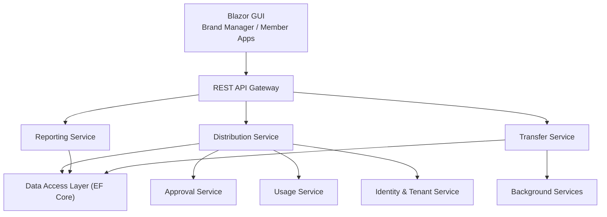
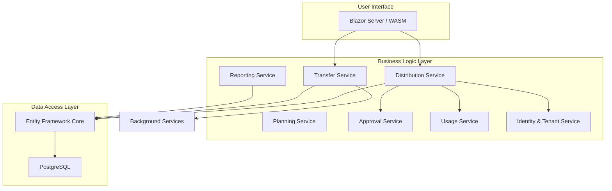
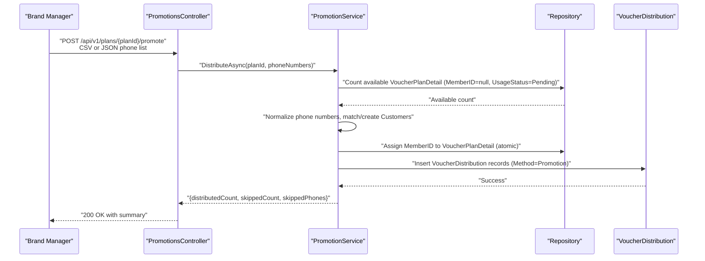
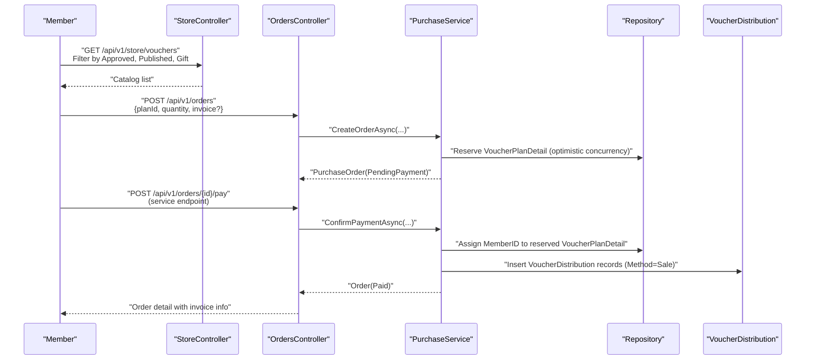
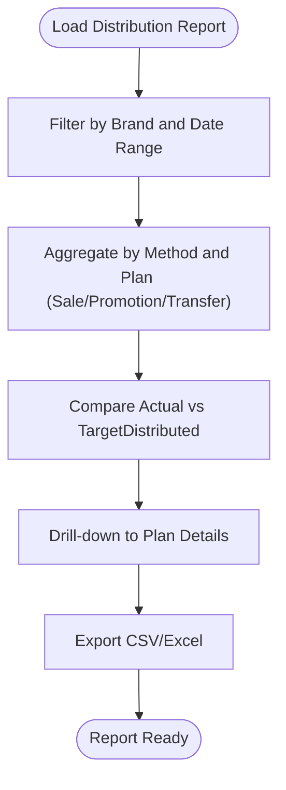
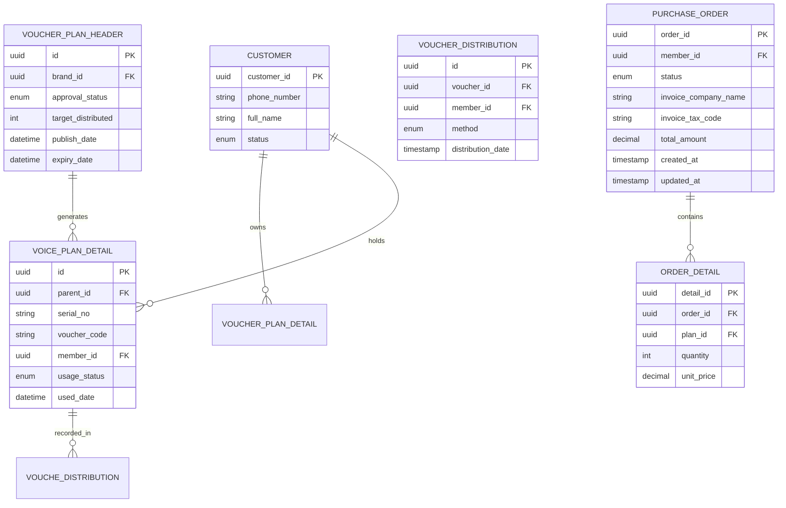
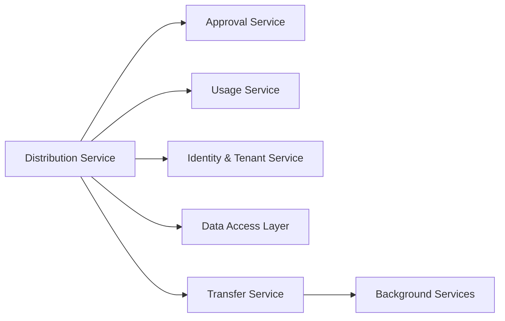

# Distribution Service

<cite>
**Referenced Files in This Document**
- [architecture.md](file://docs/architecture.md)
- [data-models.md](file://docs/data-models.md)
- [api-contracts.md](file://docs/api-contracts.md)
- [epics.md](file://_bmad-output/planning-artifacts/epics.md)
- [Key Functionalities.txt](file://Key Functionalities.txt)
- [3-1-batch-promotion-distribution.md](file://_bmad-output/implementation-artifacts/3-1-batch-promotion-distribution.md)
- [3-2-self-purchase-b2c-b2b.md](file://_bmad-output/implementation-artifacts/3-2-self-purchase-b2c-b2b.md)
- [3-3-gifting-batch-transfer.md](file://_bmad-output/implementation-artifacts/3-3-gifting-batch-transfer.md)
- [3-4-distribution-tracking-dashboard.md](file://_bmad-output/implementation-artifacts/3-4-distribution-tracking-dashboard.md)
- [TransferService.cs](file://src/NonCash.Core/Services/TransferService.cs)
- [PurchaseService.cs](file://src/NonCash.Core/Services/PurchaseService.cs)
- [DistributionReportService.cs](file://src/NonCash.Core/Services/DistributionReportService.cs)
- [ITransferService.cs](file://src/NonCash.Core/Interfaces/ITransferService.cs)
- [MemberVouchersController.cs](file://src/NonCash.API/Controllers/MemberVouchersController.cs)
- [ReportsController.cs](file://src/NonCash.API/Controllers/ReportsController.cs)
- [VoucherDistribution.cs](file://src/NonCash.Core/Entities/VoucherDistribution.cs)
- [DistributionReport.razor](file://src/NonCash.Web/Components/Pages/BrandManager/DistributionReport.razor)
- [LockCleanupService.cs](file://src/NonCash.API/HostedServices/LockCleanupService.cs)
- [session-log-2026-04-27.md](file://_bmad-output/session-log-2026-04-27.md)
</cite>

## Update Summary
**Changes Made**
- Enhanced TransferService with comprehensive social gifting capabilities including batch transfers, recipient validation, and transfer history tracking
- Improved PurchaseService with advanced inventory management and order lifecycle handling
- Expanded distribution tracking capabilities with Transfer method support in reporting
- Added new API endpoints for transfer initiation, recipient confirmation, and transfer history
- Integrated TransferService with new transfer-related UI components and background services

## Table of Contents
1. [Introduction](#introduction)
2. [Project Structure](#project-structure)
3. [Core Components](#core-components)
4. [Architecture Overview](#architecture-overview)
5. [Detailed Component Analysis](#detailed-component-analysis)
6. [Dependency Analysis](#dependency-analysis)
7. [Performance Considerations](#performance-considerations)
8. [Troubleshooting Guide](#troubleshooting-guide)
9. [Conclusion](#conclusion)
10. [Appendices](#appendices)

## Introduction
This document provides comprehensive documentation for the Distribution Service within the NonCash platform. The service orchestrates multi-channel voucher distribution mechanisms, including direct sales, batch promotions, social gifting, and inbox delivery. It manages distribution channels, enforces real-time availability and eligibility checks, and maintains a canonical audit trail of all distribution events. The documentation also covers integration patterns with the Approval Service for activated plans and with the Usage Service for tracking distribution effectiveness, along with performance optimization strategies, error handling, analytics reporting, and guidance for configuring new distribution channels and customizing distribution rules.

**Updated** Enhanced with new TransferService implementation for social gifting, improved PurchaseService with advanced inventory management, and expanded distribution tracking capabilities with Transfer method support.

## Project Structure
The Distribution Service is part of the Business Logic Layer (BLL) microservices and integrates with the Data Access Layer (DAL) and the User Interface (GUI). It collaborates with:
- Approval Service: to validate plan status (Approved/Published) before distribution
- Usage Service: to record and track distribution effectiveness via POS redemption logs
- Identity & Tenant Service: for role-based access control and brand isolation
- Transfer Service: for peer-to-peer social gifting functionality

```mermaid
graph TB
UI["Blazor GUI<br/>Brand Manager / Member Apps"] --> API["REST API Gateway"]
API --> DistSvc["Distribution Service"]
API --> ReportsSvc["Reporting Service"]
API --> TransferSvc["Transfer Service"]
DistSvc --> DAL["Data Access Layer (EF Core)"]
ReportsSvc --> DAL
TransferSvc --> DAL
DistSvc --> ApprovalSvc["Approval Service"]
DistSvc --> UsageSvc["Usage Service"]
DistSvc --> IdentitySvc["Identity & Tenant Service"]
TransferSvc --> BackgroundSvc["Background Services"]
```

**Diagram sources**
- [architecture.md: 17-26:17-26](file://docs/architecture.md#L17-L26)
- [LockCleanupService.cs: 10-58:10-58](file://src/NonCash.API/HostedServices/LockCleanupService.cs#L10-L58)

**Section sources**
- [architecture.md: 17-26:17-26](file://docs/architecture.md#L17-L26)

## Core Components
The Distribution Service is composed of the following core components:
- Promotion Service: handles batch promotions and inbox delivery
- Purchase Service: supports direct sales (B2C/B2B) via a purchase order lifecycle with advanced inventory management
- Transfer Service: enables social gifting and batch ownership reassignment with comprehensive validation and history tracking
- Distribution Reporting Service: aggregates distribution activity including Transfer method for analytics and dashboards
- Supporting entities and enums: VoucherPlanDetail, VoucherDistribution with DistributionMethod enum, PurchaseOrder, OrderStatus

Key responsibilities:
- Enforce distribution eligibility (plan status, publish date, stock availability)
- Maintain atomic distribution operations with rollback capability
- Record canonical distribution events for auditing and reporting
- Integrate with Approval Service for plan activation and with Usage Service for redemption tracking
- Support social gifting with recipient validation and transfer history

**Updated** Added comprehensive TransferService capabilities including batch transfers, recipient validation, and transfer history tracking.

**Section sources**
- [3-1-batch-promotion-distribution.md: 47-91:47-91](file://_bmad-output/implementation-artifacts/3-1-batch-promotion-distribution.md#L47-L91)
- [3-2-self-purchase-b2c-b2b.md: 48-94:48-94](file://_bmad-output/implementation-artifacts/3-2-self-purchase-b2c-b2b.md#L48-L94)
- [3-3-gifting-batch-transfer.md: 43-76:43-76](file://_bmad-output/implementation-artifacts/3-3-gifting-batch-transfer.md#L43-L76)
- [3-4-distribution-tracking-dashboard.md: 41-75:41-75](file://_bmad-output/implementation-artifacts/3-4-distribution-tracking-dashboard.md#L41-L75)
- [data-models.md: 34-61:34-61](file://docs/data-models.md#L34-L61)
- [TransferService.cs: 6-192:6-192](file://src/NonCash.Core/Services/TransferService.cs#L6-L192)
- [PurchaseService.cs: 6-197:6-197](file://src/NonCash.Core/Services/PurchaseService.cs#L6-L197)
- [DistributionReportService.cs: 6-160:6-160](file://src/NonCash.Core/Services/DistributionReportService.cs#L6-L160)

## Architecture Overview
The Distribution Service operates within a 3-layer SaaS architecture:
- Business Logic Layer (BLL): Microservices including Planning, Approval, Distribution, Usage, and Identity services
- Data Access Layer (DAL): EF Core with PostgreSQL, using repository pattern
- User Interface (GUI): Blazor applications for admin and member experiences

```mermaid
graph TB
subgraph "Business Logic Layer"
Planning["Planning Service"]
Approval["Approval Service"]
Distribution["Distribution Service"]
Usage["Usage Service"]
Identity["Identity & Tenant Service"]
Transfer["Transfer Service"]
Reports["Reporting Service"]
end
subgraph "Data Access Layer"
EF["Entity Framework Core"]
PG["PostgreSQL"]
end
subgraph "User Interface"
Blazor["Blazor Server / WASM"]
end
Blazor --> Distribution
Blazor --> Transfer
Distribution --> Approval
Distribution --> Usage
Distribution --> Identity
Transfer --> BackgroundServices["Background Services"]
Distribution --> EF
Transfer --> EF
Reports --> EF
EF --> PG
```

**Diagram sources**
- [architecture.md: 5-26:5-26](file://docs/architecture.md#L5-L26)

**Section sources**
- [architecture.md: 5-26:5-26](file://docs/architecture.md#L5-L26)

## Detailed Component Analysis

### Promotion Service (Batch Promotion Distribution)
Promotion Service automates sending vouchers to members' inboxes via batch uploads. It validates plan eligibility, checks stock availability, normalizes phone numbers, auto-creates customers when needed, and records distribution events.

```mermaid
sequenceDiagram
participant BM as "Brand Manager"
participant API as "PromotionsController"
participant Promo as "PromotionService"
participant Repo as "Repository"
participant Dist as "VoucherDistribution"
BM->>API : "POST /api/v1/plans/{planId}/promote"<br/>CSV or JSON phone list
API->>Promo : "DistributeAsync(planId, phoneNumbers)"
Promo->>Repo : "Count available VoucherPlanDetail (MemberID=null, UsageStatus=Pending)"
Repo-->>Promo : "Available count"
Promo->>Promo : "Normalize phone numbers, match/create Customers"
Promo->>Repo : "Assign MemberID to VoucherPlanDetail (atomic)"
Promo->>Dist : "Insert VoucherDistribution records (Method=Promotion)"
Dist-->>Promo : "Success"
Promo-->>API : "{distributedCount, skippedCount, skippedPhones}"
API-->>BM : "200 OK with summary"
```

**Diagram sources**
- [3-1-batch-promotion-distribution.md: 47-115:47-115](file://_bmad-output/implementation-artifacts/3-1-batch-promotion-distribution.md#L47-L115)

Key behaviors:
- Eligibility: plan must be Approved or Published; Publish Date must be effective
- Stock: all-or-nothing allocation; insufficient stock returns 400
- Customer matching: normalize phone numbers; upsert unknown customers
- Audit: each assignment creates a VoucherDistribution record with Method=Promotion
- Security: brand isolation and role gating for execution

**Section sources**
- [3-1-batch-promotion-distribution.md: 11-46:11-46](file://_bmad-output/implementation-artifacts/3-1-batch-promotion-distribution.md#L11-L46)
- [3-1-batch-promotion-distribution.md: 77-115:77-115](file://_bmad-output/implementation-artifacts/3-1-batch-promotion-distribution.md#L77-L115)
- [data-models.md: 55-61:55-61](file://docs/data-models.md#L55-L61)

### Purchase Service (Direct Sales)
Purchase Service supports B2C/B2B self-purchase via a purchase order lifecycle. It validates stock availability, reserves inventory, and allocates vouchers upon payment confirmation with advanced inventory management.

```mermaid
sequenceDiagram
participant Member as "Member"
participant StoreAPI as "StoreController"
participant OrdersAPI as "OrdersController"
participant Purc as "PurchaseService"
participant Repo as "Repository"
participant Dist as "VoucherDistribution"
Member->>StoreAPI : "GET /api/v1/store/vouchers"<br/>Filter by Approved, Published, Gift
StoreAPI-->>Member : "Catalog list"
Member->>OrdersAPI : "POST /api/v1/orders"<br/>{planId, quantity, invoice?}
OrdersAPI->>Purc : "CreateOrderAsync(...)"
Purc->>Repo : "Reserve VoucherPlanDetail (optimistic concurrency)"
Purc-->>OrdersAPI : "PurchaseOrder(PendingPayment)"
Member->>OrdersAPI : "POST /api/v1/orders/{id}/pay"<br/>(service endpoint)
OrdersAPI->>Purc : "ConfirmPaymentAsync(...)"
Purc->>Repo : "Assign MemberID to reserved VoucherPlanDetail"
Purc->>Dist : "Insert VoucherDistribution records (Method=Sale)"
Purc-->>OrdersAPI : "Order(Paid)"
OrdersAPI-->>Member : "Order detail with invoice info"
```

**Diagram sources**
- [3-2-self-purchase-b2c-b2b.md: 48-118:48-118](file://_bmad-output/implementation-artifacts/3-2-self-purchase-b2c-b2b.md#L48-L118)

Key behaviors:
- Catalog visibility: filter by VoucherType=Gift, ApprovalStatus=Approved, PublishDate, ExpiryDate
- Stock: optimistic allocation at payment confirmation; InsufficientStock on conflict
- Payment: simulated/manual confirmation endpoint; payment processing out of scope for MVP
- Audit: Method=Sale in VoucherDistribution
- Advanced inventory: pre-order stock validation and final allocation confirmation

**Updated** Enhanced with advanced inventory management including pre-order stock validation and final allocation confirmation.

**Section sources**
- [3-2-self-purchase-b2c-b2b.md: 11-47:11-47](file://_bmad-output/implementation-artifacts/3-2-self-purchase-b2c-b2b.md#L11-L47)
- [3-2-self-purchase-b2c-b2b.md: 76-118:76-118](file://_bmad-output/implementation-artifacts/3-2-self-purchase-b2c-b2b.md#L76-L118)
- [data-models.md: 55-61:55-61](file://docs/data-models.md#L55-L61)
- [PurchaseService.cs: 45-100:45-100](file://src/NonCash.Core/Services/PurchaseService.cs#L45-L100)

### Transfer Service (Social Gifting)
Transfer Service enables ownership reassignment of vouchers among members with comprehensive validation, recipient management, and transfer history tracking. It validates ownership and status, maps vouchers to recipients, and records distribution events.

```mermaid
sequenceDiagram
participant Member as "Member"
participant API as "MemberVouchersController"
participant Trans as "TransferService"
participant Repo as "Repository"
participant Dist as "VoucherDistribution"
Member->>API : "POST /api/v1/member/vouchers/transfer"<br/>{fromMemberId, voucherIds[], recipientPhones[]}
API->>Trans : "TransferAsync(fromMemberId, voucherIds, recipientPhones)"
Trans->>Trans : "Validate ownership and UsageStatus=Pending"
Trans->>Repo : "Match phones to Customers; skip blacklisted"
Trans->>Repo : "Assign MemberID to each VoucherPlanDetail (atomic)"
Trans->>Dist : "Insert VoucherDistribution records (Method=Transfer)"
Dist-->>Trans : "Success"
Trans-->>API : "{transferredCount, skippedCount, skippedRecords}"
API-->>Member : "200 OK with summary"
```

**Diagram sources**
- [3-3-gifting-batch-transfer.md: 43-96:43-96](file://_bmad-output/implementation-artifacts/3-3-gifting-batch-transfer.md#L43-L96)

Key behaviors:
- Ownership: only vouchers owned by the caller can be transferred
- Validation: strict 1-to-1 mapping; mismatched counts return 400
- Recipients: auto-create customers for unknown phones; skip blacklisted entries
- Audit: Method=Transfer in VoucherDistribution
- History: comprehensive transfer history tracking for outgoing transfers
- Error handling: detailed error codes and skipped records for troubleshooting

**Updated** Completely redesigned TransferService with comprehensive social gifting capabilities including batch transfers, recipient validation, transfer history tracking, and detailed error handling.

**Section sources**
- [3-3-gifting-batch-transfer.md: 11-42:11-42](file://_bmad-output/implementation-artifacts/3-3-gifting-batch-transfer.md#L11-L42)
- [3-3-gifting-batch-transfer.md: 64-96:64-96](file://_bmad-output/implementation-artifacts/3-3-gifting-batch-transfer.md#L64-L96)
- [data-models.md: 55-61:55-61](file://docs/data-models.md#L55-L61)
- [TransferService.cs: 22-138:22-138](file://src/NonCash.Core/Services/TransferService.cs#L22-L138)
- [ITransferService.cs: 5-32:5-32](file://src/NonCash.Core/Interfaces/ITransferService.cs#L5-L32)
- [MemberVouchersController.cs: 19-63:19-63](file://src/NonCash.API/Controllers/MemberVouchersController.cs#L19-L63)

### Distribution Reporting Service
Distribution Reporting Service aggregates distribution activity for dashboards and analytics, enabling brand managers to compare actual versus target distribution across all distribution methods including Transfer.

```mermaid
flowchart TD
Start(["Load Distribution Report"]) --> Scope["Filter by Brand and Date Range"]
Scope --> Aggregate["Aggregate by Method and Plan (Sale/Promotion/Transfer)"]
Aggregate --> Compare["Compare Actual vs TargetDistributed"]
Compare --> Drill["Drill-down to Plan Details"]
Drill --> Export["Export CSV/Excel"]
Export --> End(["Report Ready"])
```

**Diagram sources**
- [3-4-distribution-tracking-dashboard.md: 41-91:41-91](file://_bmad-output/implementation-artifacts/3-4-distribution-tracking-dashboard.md#L41-L91)

Key behaviors:
- Aggregation: totals, by method (Sale/Promotion/Transfer), by plan, by date range
- Target comparison: compute percentage vs TargetDistributed
- Drill-down: view detail records per plan
- Export: generate CSV/Excel for current filters
- Real-time tracking: includes Transfer method in distribution analytics

**Updated** Enhanced to support Transfer method in distribution tracking and reporting.

**Section sources**
- [3-4-distribution-tracking-dashboard.md: 11-40:11-40](file://_bmad-output/implementation-artifacts/3-4-distribution-tracking-dashboard.md#L11-L40)
- [3-4-distribution-tracking-dashboard.md: 61-91:61-91](file://_bmad-output/implementation-artifacts/3-4-distribution-tracking-dashboard.md#L61-L91)
- [DistributionReportService.cs: 25-106:25-106](file://src/NonCash.Core/Services/DistributionReportService.cs#L25-L106)
- [ReportsController.cs: 26-102:26-102](file://src/NonCash.API/Controllers/ReportsController.cs#L26-L102)

### Data Models and Relationships
Core entities supporting distribution:
- VoucherPlanHeader: campaign-level plan definition and targets
- VoucherPlanDetail: individual voucher instances with MemberID and UsageStatus
- VoucherDistribution: canonical audit trail of distribution events with DistributionMethod enum
- PurchaseOrder and OrderDetail: B2C/B2B purchase lifecycle
- Customer: end-user identity for ownership and notifications

```mermaid
erDiagram
VOUCHER_PLAN_HEADER {
uuid id PK
uuid brand_id FK
enum approval_status
int target_distributed
datetime publish_date
datetime expiry_date
}
VOICE_PLAN_DETAIL {
uuid id PK
uuid parent_id FK
string serial_no
string voucher_code
uuid member_id FK
enum usage_status
datetime used_date
}
CUSTOMER {
uuid customer_id PK
string phone_number
string full_name
enum status
}
VOUCHER_DISTRIBUTION {
uuid id PK
uuid voucher_id FK
uuid member_id FK
enum method
timestamp distribution_date
}
PURCHASE_ORDER {
uuid order_id PK
uuid member_id FK
enum status
string invoice_company_name
string invoice_tax_code
decimal total_amount
timestamp created_at
timestamp updated_at
}
ORDER_DETAIL {
uuid detail_id PK
uuid order_id FK
uuid plan_id FK
int quantity
decimal unit_price
}
CUSTOMER ||--o{ VOUCHER_PLAN_DETAIL : "owns"
CUSTOMER ||--o{ VOICE_PLAN_DETAIL : "holds"
VOUCHER_PLAN_HEADER ||--o{ VOICE_PLAN_DETAIL : "generates"
VOICE_PLAN_DETAIL ||--o{ VOUCHE_DISTRIBUTION : "recorded_in"
PURCHASE_ORDER ||--o{ ORDER_DETAIL : "contains"
```

**Diagram sources**
- [data-models.md: 11-61:11-61](file://docs/data-models.md#L11-L61)

**Section sources**
- [data-models.md: 11-61:11-61](file://docs/data-models.md#L11-L61)
- [VoucherDistribution.cs: 3-21:3-21](file://src/NonCash.Core/Entities/VoucherDistribution.cs#L3-L21)

## Dependency Analysis
Distribution Service depends on:
- Approval Service: ensures plans are Approved or Published and live per PublishDate
- Usage Service: provides redemption context and POS integration for effectiveness tracking
- Identity & Tenant Service: enforces brand isolation and role-based access
- DAL: repository pattern for data consistency and transaction boundaries
- Transfer Service: for peer-to-peer social gifting functionality
- Background Services: for periodic cleanup and maintenance tasks

**Updated** Added Transfer Service and Background Services dependencies.

```mermaid
graph LR
DistSvc["Distribution Service"] --> ApprovalSvc["Approval Service"]
DistSvc --> UsageSvc["Usage Service"]
DistSvc --> IdentitySvc["Identity & Tenant Service"]
DistSvc --> DAL["Data Access Layer"]
DistSvc --> TransferSvc["Transfer Service"]
TransferSvc --> BackgroundSvc["Background Services"]
```

**Diagram sources**
- [architecture.md: 17-26:17-26](file://docs/architecture.md#L17-L26)
- [LockCleanupService.cs: 10-58:10-58](file://src/NonCash.API/HostedServices/LockCleanupService.cs#L10-L58)

**Section sources**
- [architecture.md: 17-26:17-26](file://docs/architecture.md#L17-L26)
- [epics.md: 171-204:171-204](file://_bmad-output/planning-artifacts/epics.md#L171-L204)
- [session-log-2026-04-27.md: 161-167:161-167](file://_bmad-output/session-log-2026-04-27.md#L161-L167)

## Performance Considerations
High-volume distribution events:
- Batch promotion: consider background processing for large lists (>1000) using hosted services or queue-based approaches; synchronous processing with timeouts is acceptable for MVP
- Stock checks: pre-validate available stock and enforce all-or-nothing allocation to minimize partial writes
- Optimistic concurrency: for purchase allocation, validate stock at payment confirmation; implement retries on conflicts
- Reporting: use raw SQL or Dapper for aggregation if EF GroupBy performance is insufficient; avoid over-optimization until measured
- Transactions: wrap distribution operations to ensure atomicity; rollback MemberID updates on downstream failures
- Transfer operations: batch processing for large transfer requests; optimize recipient lookup and validation
- Background services: scheduled cleanup for expired transfers and locks to prevent database bloat

**Updated** Added performance considerations for TransferService operations and background services.

[No sources needed since this section provides general guidance]

## Troubleshooting Guide
Common issues and resolutions:
- Promotion failures due to insufficient stock: ensure stock count equals requested quantity; all-or-nothing policy prevents partial allocations
- Blacklist exclusions: verify blacklist logic and return warnings with skipped records
- Purchase allocation conflicts: concurrent buyers competing for the last voucher; one succeeds, the other receives InsufficientStock
- Transfer validation errors: confirm 1-to-1 mapping of voucherIds and recipientPhones; verify ownership and UsageStatus=Pending
- Transfer recipient issues: invalid phone numbers, blacklisted recipients, or self-transfer attempts are rejected with specific error codes
- Reporting discrepancies: validate date range filters and brand scoping joins to VoucherPlanHeader
- Transfer history accuracy: verify transfer ownership tracking and recipient phone resolution

**Updated** Added TransferService-specific troubleshooting guidance.

**Section sources**
- [3-1-batch-promotion-distribution.md: 30-41:30-41](file://_bmad-output/implementation-artifacts/3-1-batch-promotion-distribution.md#L30-L41)
- [3-2-self-purchase-b2c-b2b.md: 43-47:43-47](file://_bmad-output/implementation-artifacts/3-2-self-purchase-b2c-b2b.md#L43-L47)
- [3-3-gifting-batch-transfer.md: 26-31:26-31](file://_bmad-output/implementation-artifacts/3-3-gifting-batch-transfer.md#L26-L31)
- [3-4-distribution-tracking-dashboard.md: 61-67:61-67](file://_bmad-output/implementation-artifacts/3-4-distribution-tracking-dashboard.md#L61-L67)
- [TransferService.cs: 28-56:28-56](file://src/NonCash.Core/Services/TransferService.cs#L28-L56)

## Conclusion
The Distribution Service provides a robust, auditable, and scalable foundation for multi-channel voucher distribution. By enforcing plan eligibility, maintaining real-time availability, and recording canonical distribution events, it enables accurate analytics and compliance. Integrations with the Approval Service and Usage Service ensure that distribution aligns with activated plans and tracks redemption effectiveness. With careful attention to performance, error handling, and reporting, the service supports high-volume distribution events and evolving business needs.

**Updated** Enhanced with comprehensive TransferService capabilities for social gifting, improved PurchaseService with advanced inventory management, and expanded distribution tracking with Transfer method support.

[No sources needed since this section summarizes without analyzing specific files]

## Appendices

### Integration Patterns
- Approval Service: validate plan status and publish date before distribution
- Usage Service: leverage POS redemption logs for distribution effectiveness reporting
- Identity & Tenant Service: enforce brand isolation and role-based access controls
- Transfer Service: enable peer-to-peer social gifting with recipient validation
- Background Services: periodic cleanup for expired transfers and locks

**Updated** Added Transfer Service and Background Services integration patterns.

**Section sources**
- [architecture.md: 17-26:17-26](file://docs/architecture.md#L17-L26)
- [epics.md: 171-204:171-204](file://_bmad-output/planning-artifacts/epics.md#L171-L204)
- [session-log-2026-04-27.md: 161-167:161-167](file://_bmad-output/session-log-2026-04-27.md#L161-L167)

### API Contracts (Distribution)
- Promotion endpoint: POST /api/v1/plans/{planId}/promote (multipart or JSON)
- Purchase endpoints: GET /api/v1/store/vouchers, POST /api/v1/orders, POST /api/v1/orders/{orderId}/pay, POST /api/v1/orders/{orderId}/cancel
- Transfer endpoints: POST /api/v1/member/vouchers/transfer, GET /api/v1/member/vouchers/transfer-history/{memberId}
- Reporting endpoints: GET /api/v1/reports/distribution, GET /api/v1/reports/distribution/{planId}/details, GET /api/v1/reports/distribution/export

**Updated** Added TransferService endpoints and enhanced PurchaseService endpoints.

**Section sources**
- [3-1-batch-promotion-distribution.md: 62-102:62-102](file://_bmad-output/implementation-artifacts/3-1-batch-promotion-distribution.md#L62-L102)
- [3-2-self-purchase-b2c-b2b.md: 61-106:61-106](file://_bmad-output/implementation-artifacts/3-2-self-purchase-b2c-b2b.md#L61-L106)
- [3-3-gifting-batch-transfer.md: 50-86:50-86](file://_bmad-output/implementation-artifacts/3-3-gifting-batch-transfer.md#L50-L86)
- [3-4-distribution-tracking-dashboard.md: 47-80:47-80](file://_bmad-output/implementation-artifacts/3-4-distribution-tracking-dashboard.md#L47-L80)
- [MemberVouchersController.cs: 19-63:19-63](file://src/NonCash.API/Controllers/MemberVouchersController.cs#L19-L63)
- [ReportsController.cs: 26-102:26-102](file://src/NonCash.API/Controllers/ReportsController.cs#L26-L102)

### Configuring New Distribution Channels and Customizing Rules
- New channel development: define DistributionMethod enum values and update PromotionService, PurchaseService, and TransferService to honor new methods
- Eligibility rules: extend plan status and publish date checks; integrate blacklist exclusion logic
- Inventory rules: adjust stock validation and allocation strategies (reservation vs immediate assignment)
- Reporting rules: add new aggregation dimensions and KPIs in Distribution Reporting Service
- Transfer rules: configure recipient validation, blacklist management, and transfer history retention policies

**Updated** Added TransferService configuration guidelines.

**Section sources**
- [3-1-batch-promotion-distribution.md: 59-61:59-61](file://_bmad-output/implementation-artifacts/3-1-batch-promotion-distribution.md#L59-L61)
- [3-2-self-purchase-b2c-b2b.md: 52-54:52-54](file://_bmad-output/implementation-artifacts/3-2-self-purchase-b2c-b2b.md#L52-L54)
- [3-3-gifting-batch-transfer.md: 78-79:78-79](file://_bmad-output/implementation-artifacts/3-3-gifting-batch-transfer.md#L78-L79)
- [3-4-distribution-tracking-dashboard.md: 63-67:63-67](file://_bmad-output/implementation-artifacts/3-4-distribution-tracking-dashboard.md#L63-L67)
- [TransferService.cs: 140-190:140-190](file://src/NonCash.Core/Services/TransferService.cs#L140-L190)

### Transfer Service Implementation Details
The TransferService provides comprehensive social gifting capabilities with the following key features:
- Batch transfer processing with 1-to-1 mapping validation
- Recipient phone normalization and customer auto-onboarding
- Blacklist validation and self-transfer prevention
- Comprehensive transfer history tracking
- Detailed error handling with specific error codes
- Atomic transaction processing for data consistency

**Section sources**
- [TransferService.cs: 6-192:6-192](file://src/NonCash.Core/Services/TransferService.cs#L6-L192)
- [ITransferService.cs: 5-32:5-32](file://src/NonCash.Core/Interfaces/ITransferService.cs#L5-L32)
- [MemberVouchersController.cs: 19-63:19-63](file://src/NonCash.API/Controllers/MemberVouchersController.cs#L19-L63)