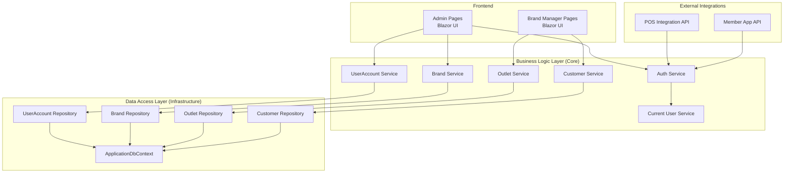
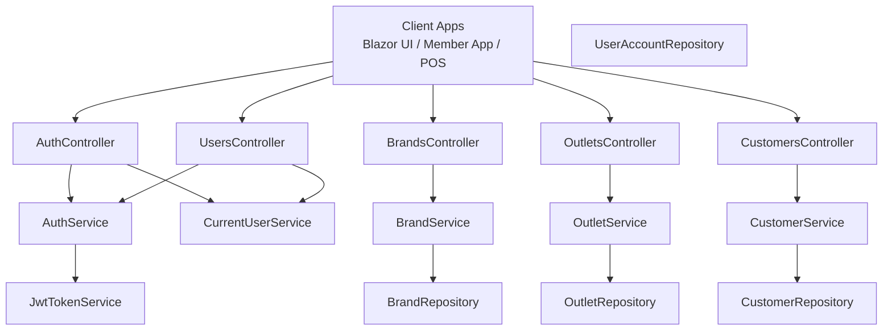
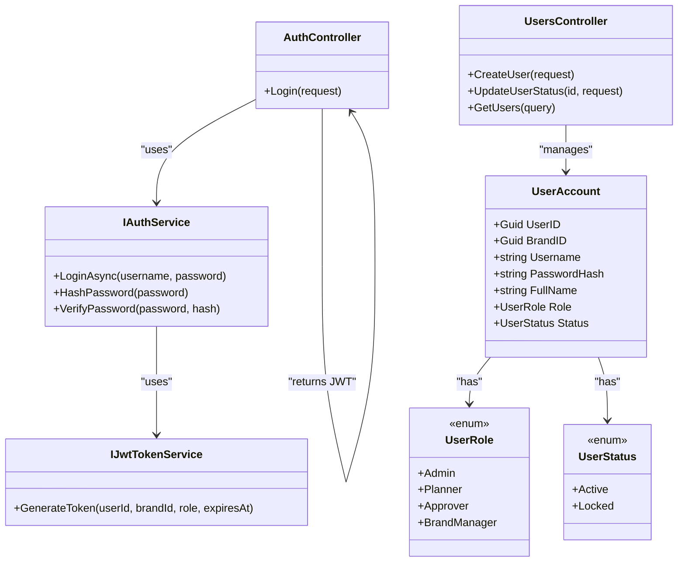
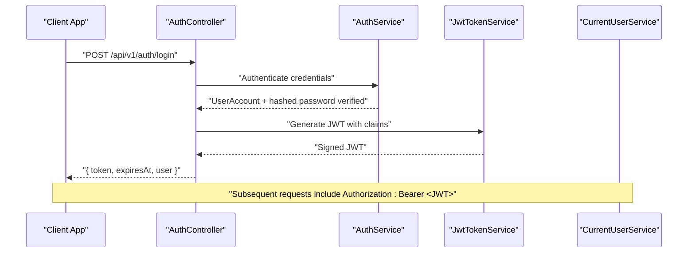
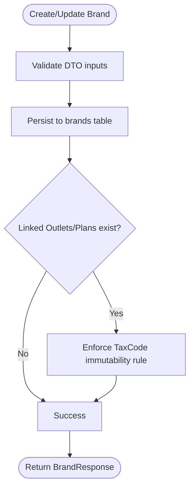
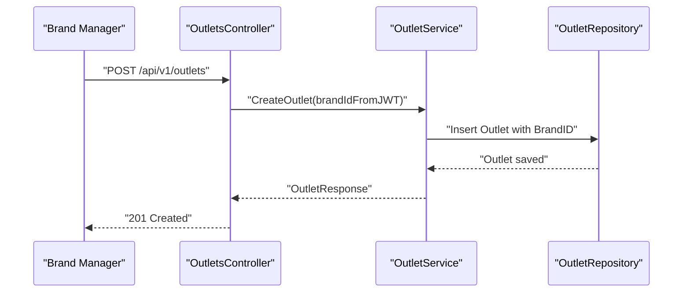
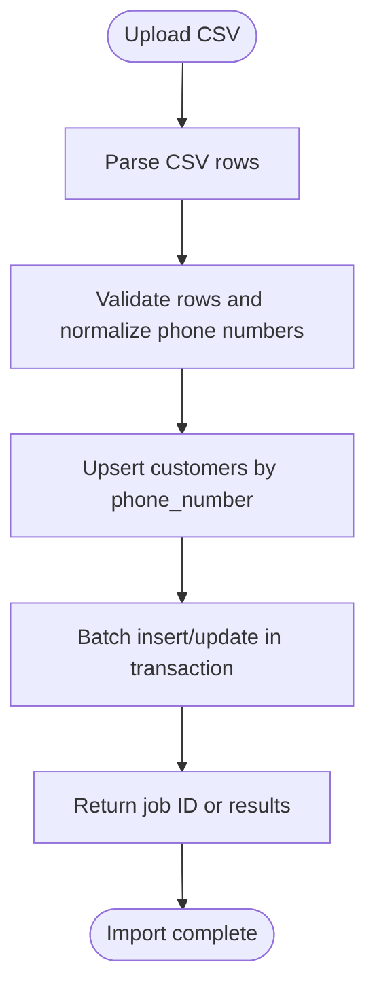
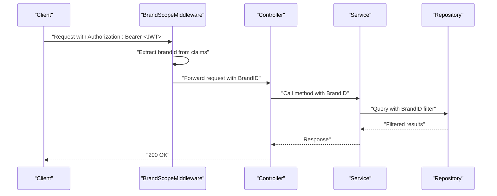
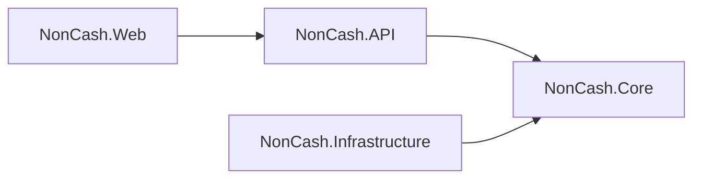

# Identity & Tenant Service

<cite>
**Referenced Files in This Document**
- [docs/index.md](file://docs/index.md)
- [docs/architecture.md](file://docs/architecture.md)
- [docs/data-models.md](file://docs/data-models.md)
- [docs/api-contracts.md](file://docs/api-contracts.md)
- [Key Functionalities.txt](file://Key Functionalities.txt)
- [description.txt](file://description.txt)
- [1-4-staff-accounts-rbac.md](file://_bmad-output/implementation-artifacts/1-4-staff-accounts-rbac.md)
- [1-1-brand-setup.md](file://_bmad-output/implementation-artifacts/1-1-brand-setup.md)
- [1-2-outlet-configuration.md](file://_bmad-output/implementation-artifacts/1-2-outlet-configuration.md)
- [1-3-customer-record-management.md](file://_bmad-output/implementation-artifacts/1-3-customer-record-management.md)
</cite>

## Table of Contents
1. [Introduction](#introduction)
2. [Project Structure](#project-structure)
3. [Core Components](#core-components)
4. [Architecture Overview](#architecture-overview)
5. [Detailed Component Analysis](#detailed-component-analysis)
6. [Dependency Analysis](#dependency-analysis)
7. [Performance Considerations](#performance-considerations)
8. [Troubleshooting Guide](#troubleshooting-guide)
9. [Conclusion](#conclusion)
10. [Appendices](#appendices)

## Introduction
This document provides comprehensive documentation for the Identity & Tenant Service within the NonCash SaaS platform. The service is responsible for multi-tenant identity and access management across Brands (organizations), Outlets (stores), UserAccounts (back-office staff), and Customer profiles. It implements role-based access control (RBAC), enforces tenant isolation via BrandID, and manages user authentication flows using JWT. The documentation explains responsibilities for managing UserAccounts, Brand multi-tenancy, Outlet configurations, and Customer profiles, along with RBAC policies, tenant isolation mechanisms, and integration patterns with other services for authorization, tenant validation, and profile management. Security considerations for multi-tenant data isolation, session management, and audit logging are addressed, alongside practical guidance for user onboarding, role customization, and tenant administration procedures.

## Project Structure
The NonCash project follows a 3-layer architecture (Frontend GUI, Business Logic Layer, Data Access Layer) and organizes features into microservices. The Identity & Tenant Service is implemented as part of the Business Logic Layer and integrates with the Data Access Layer and the Frontend. The service’s responsibilities include:
- Managing UserAccounts with roles scoped to Brands
- Creating and maintaining Brand and Outlet multi-tenancy boundaries
- Maintaining Customer profiles with blacklist controls
- Enforcing RBAC and tenant isolation across all operations
- Providing authentication and authorization endpoints

**Diagram sources**
- [docs/architecture.md:17-31](file://docs/architecture.md#L17-L31)
- [docs/data-models.md:63-98](file://docs/data-models.md#L63-L98)
- [1-4-staff-accounts-rbac.md:84-99](file://_bmad-output/implementation-artifacts/1-4-staff-accounts-rbac.md#L84-L99)
- [1-1-brand-setup.md:72-81](file://_bmad-output/implementation-artifacts/1-1-brand-setup.md#L72-L81)
- [1-2-outlet-configuration.md:72-82](file://_bmad-output/implementation-artifacts/1-2-outlet-configuration.md#L72-L82)
- [1-3-customer-record-management.md:77-87](file://_bmad-output/implementation-artifacts/1-3-customer-record-management.md#L77-L87)

**Section sources**
- [docs/architecture.md:5-52](file://docs/architecture.md#L5-L52)
- [docs/index.md:12-32](file://docs/index.md#L12-L32)

## Core Components
The Identity & Tenant Service comprises the following core components:

- UserAccount Management
  - Entities, roles, and status management for back-office users
  - Authentication service with password hashing and JWT issuance
  - Authorization enforcement via role-based policies and tenant scoping

- Brand Multi-Tenancy
  - Brand entity and lifecycle management
  - Tenant isolation enforcement across all Brand-scoped operations
  - Brand list retrieval, filtering, and update rules

- Outlet Configuration
  - Outlet entity bound to a Brand with status and API key prefix
  - Brand-scoped listing and update operations
  - Soft-close semantics preserving historical references

- Customer Profile Management
  - Customer entity with unique phone number and blacklist controls
  - Bulk import capabilities and search/filtering
  - Cross-Brand visibility constraints

- Authorization and Session Management
  - JWT-based authentication with role and BrandID claims
  - Middleware enforcing BrandID scoping on every request
  - Session invalidation upon account lock/unlock

**Section sources**
- [docs/data-models.md:63-98](file://docs/data-models.md#L63-L98)
- [1-4-staff-accounts-rbac.md:13-45](file://_bmad-output/implementation-artifacts/1-4-staff-accounts-rbac.md#L13-L45)
- [1-1-brand-setup.md:13-39](file://_bmad-output/implementation-artifacts/1-1-brand-setup.md#L13-L39)
- [1-2-outlet-configuration.md:13-40](file://_bmad-output/implementation-artifacts/1-2-outlet-configuration.md#L13-L40)
- [1-3-customer-record-management.md:13-41](file://_bmad-output/implementation-artifacts/1-3-customer-record-management.md#L13-L41)

## Architecture Overview
The Identity & Tenant Service adheres to the NonCash 3-layer architecture and microservices pattern. It centralizes identity and multi-tenancy concerns and exposes REST endpoints for administrative and operational tasks. The service enforces:
- Multi-tenancy via BrandID across all tenant-scoped entities
- RBAC via role-based authorization attributes and middleware
- JWT-based authentication with secure token issuance and validation
- Strong separation of concerns between Core, Infrastructure, and API/UI layers

**Diagram sources**
- [docs/architecture.md:17-31](file://docs/architecture.md#L17-L31)
- [1-4-staff-accounts-rbac.md:93-96](file://_bmad-output/implementation-artifacts/1-4-staff-accounts-rbac.md#L93-L96)
- [1-1-brand-setup.md:77-79](file://_bmad-output/implementation-artifacts/1-1-brand-setup.md#L77-L79)
- [1-2-outlet-configuration.md:79-81](file://_bmad-output/implementation-artifacts/1-2-outlet-configuration.md#L79-L81)
- [1-3-customer-record-management.md:83-86](file://_bmad-output/implementation-artifacts/1-3-customer-record-management.md#L83-L86)

## Detailed Component Analysis

### UserAccount Management and RBAC
The UserAccount component manages staff users, roles, and authentication. It includes:
- UserAccount entity with BrandID (nullable for system super-admins), role enumeration, and status
- Authentication service with password hashing and JWT token generation
- Authorization infrastructure with role-based attributes and middleware enforcing BrandID scoping
- Controllers for login and user management with proper DTO validation

**Diagram sources**
- [1-4-staff-accounts-rbac.md:48-56](file://_bmad-output/implementation-artifacts/1-4-staff-accounts-rbac.md#L48-L56)
- [1-4-staff-accounts-rbac.md:93-94](file://_bmad-output/implementation-artifacts/1-4-staff-accounts-rbac.md#L93-L94)
- [docs/data-models.md:81-89](file://docs/data-models.md#L81-L89)

**Diagram sources**
- [1-4-staff-accounts-rbac.md:28-32](file://_bmad-output/implementation-artifacts/1-4-staff-accounts-rbac.md#L28-L32)
- [1-4-staff-accounts-rbac.md:107-111](file://_bmad-output/implementation-artifacts/1-4-staff-accounts-rbac.md#L107-L111)

**Section sources**
- [1-4-staff-accounts-rbac.md:13-45](file://_bmad-output/implementation-artifacts/1-4-staff-accounts-rbac.md#L13-L45)
- [1-4-staff-accounts-rbac.md:107-111](file://_bmad-output/implementation-artifacts/1-4-staff-accounts-rbac.md#L107-L111)
- [docs/data-models.md:81-89](file://docs/data-models.md#L81-L89)

### Brand Multi-Tenancy
Brand management establishes the root tenant boundary. Responsibilities include:
- Creating and updating Brand records with integrity constraints
- Listing and filtering Brands with pagination
- Enforcing business rules such as immutable TaxCode when linked entities exist
- Ensuring all Brand-scoped operations filter by BrandID

**Diagram sources**
- [1-1-brand-setup.md:29-34](file://_bmad-output/implementation-artifacts/1-1-brand-setup.md#L29-L34)
- [1-1-brand-setup.md:83-87](file://_bmad-output/implementation-artifacts/1-1-brand-setup.md#L83-L87)

**Section sources**
- [1-1-brand-setup.md:13-39](file://_bmad-output/implementation-artifacts/1-1-brand-setup.md#L13-L39)
- [1-1-brand-setup.md:83-92](file://_bmad-output/implementation-artifacts/1-1-brand-setup.md#L83-L92)
- [docs/data-models.md:65-72](file://docs/data-models.md#L65-L72)

### Outlet Configuration
Outlet configuration enables Brand Managers to manage store locations:
- Create Outlets tied to the current BrandID
- List and filter Outlets by status with pagination
- Update Outlet details and soft-close by changing status
- Generate API key prefixes for POS integration

**Diagram sources**
- [1-2-outlet-configuration.md:13-18](file://_bmad-output/implementation-artifacts/1-2-outlet-configuration.md#L13-L18)
- [1-2-outlet-configuration.md:51-54](file://_bmad-output/implementation-artifacts/1-2-outlet-configuration.md#L51-L54)
- [1-2-outlet-configuration.md:84-88](file://_bmad-output/implementation-artifacts/1-2-outlet-configuration.md#L84-L88)

**Section sources**
- [1-2-outlet-configuration.md:13-40](file://_bmad-output/implementation-artifacts/1-2-outlet-configuration.md#L13-L40)
- [1-2-outlet-configuration.md:84-94](file://_bmad-output/implementation-artifacts/1-2-outlet-configuration.md#L84-L94)
- [docs/data-models.md:73-79](file://docs/data-models.md#L73-L79)

### Customer Profile Management
Customer management supports creation, blacklist controls, and bulk import:
- Create Customer records with unique phone number
- Blacklist management affecting eligibility for promotions and purchases
- Import via CSV with upsert logic and transactional safety
- Search and list with filtering and pagination

**Diagram sources**
- [1-3-customer-record-management.md:52-57](file://_bmad-output/implementation-artifacts/1-3-customer-record-management.md#L52-L57)
- [1-3-customer-record-management.md:89-92](file://_bmad-output/implementation-artifacts/1-3-customer-record-management.md#L89-L92)

**Section sources**
- [1-3-customer-record-management.md:13-41](file://_bmad-output/implementation-artifacts/1-3-customer-record-management.md#L13-L41)
- [1-3-customer-record-management.md:89-98](file://_bmad-output/implementation-artifacts/1-3-customer-record-management.md#L89-L98)
- [docs/data-models.md:91-98](file://docs/data-models.md#L91-L98)

### Tenant Isolation and RBAC Enforcement
Tenant isolation and RBAC enforcement are implemented across the service:
- JWT contains sub (UserID), brandId, role, and exp claims
- Middleware enforces BrandID scoping on every request
- Controllers apply role-based authorization attributes
- Repository queries filter by BrandID derived from JWT claims

**Diagram sources**
- [1-4-staff-accounts-rbac.md:40-44](file://_bmad-output/implementation-artifacts/1-4-staff-accounts-rbac.md#L40-L44)
- [1-4-staff-accounts-rbac.md:57-60](file://_bmad-output/implementation-artifacts/1-4-staff-accounts-rbac.md#L57-L60)
- [docs/architecture.md:36-41](file://docs/architecture.md#L36-L41)

**Section sources**
- [1-4-staff-accounts-rbac.md:19-27](file://_bmad-output/implementation-artifacts/1-4-staff-accounts-rbac.md#L19-L27)
- [1-4-staff-accounts-rbac.md:40-44](file://_bmad-output/implementation-artifacts/1-4-staff-accounts-rbac.md#L40-L44)
- [docs/architecture.md:36-41](file://docs/architecture.md#L36-L41)

## Dependency Analysis
The Identity & Tenant Service exhibits strong cohesion within the Core layer and clear separation of concerns across layers. Dependencies include:
- Core abstractions (interfaces) consumed by API and Infrastructure
- Infrastructure repositories implementing Core interfaces
- API controllers depending on Core services and DTOs
- Frontend pages consuming API endpoints

**Diagram sources**
- [docs/architecture.md:17-31](file://docs/architecture.md#L17-L31)
- [1-4-staff-accounts-rbac.md:84-99](file://_bmad-output/implementation-artifacts/1-4-staff-accounts-rbac.md#L84-L99)

**Section sources**
- [docs/architecture.md:17-31](file://docs/architecture.md#L17-L31)
- [1-4-staff-accounts-rbac.md:84-99](file://_bmad-output/implementation-artifacts/1-4-staff-accounts-rbac.md#L84-L99)

## Performance Considerations
- Use indexed columns for BrandID and unique identifiers (e.g., Username, PhoneNumber) to optimize queries
- Apply pagination and filtering on list endpoints to reduce payload sizes
- Cache frequently accessed role and permission metadata per tenant
- Minimize round-trips by batching operations where feasible
- Ensure database transactions are used for bulk imports and critical updates

## Troubleshooting Guide
Common issues and resolutions:
- Authentication failures
  - Verify JWT secret configuration and token signing
  - Confirm password hashing algorithm and stored hashes
  - Check account status (Active/Locked) and invalidate sessions on status change

- Cross-tenant access errors
  - Ensure middleware extracts BrandID from JWT claims and applies filters
  - Validate that controllers do not accept BrandID from request bodies for creation operations

- Data integrity violations
  - Confirm unique constraints on Username and PhoneNumber
  - Enforce TaxCode immutability when linked entities exist

- API contract mismatches
  - Align request/response DTOs with documented contracts
  - Validate authentication headers (Bearer JWT) and API Key for POS endpoints

**Section sources**
- [1-4-staff-accounts-rbac.md:34-39](file://_bmad-output/implementation-artifacts/1-4-staff-accounts-rbac.md#L34-L39)
- [1-1-brand-setup.md:29-34](file://_bmad-output/implementation-artifacts/1-1-brand-setup.md#L29-L34)
- [docs/api-contracts.md:5-109](file://docs/api-contracts.md#L5-L109)

## Conclusion
The Identity & Tenant Service provides a robust foundation for multi-tenant identity and access management in the NonCash platform. By enforcing strict tenant isolation via BrandID, implementing comprehensive RBAC policies, and offering secure authentication flows, the service ensures data privacy and operational control across diverse business partners. The documented components, flows, and integration patterns enable consistent development, testing, and deployment practices while supporting future enhancements.

## Appendices

### API Contracts Overview
- Authentication
  - POST /api/v1/auth/login returns a JWT with claims: sub, brandId, role, exp
  - All endpoints require Authorization: Bearer <JWT> except public login

- User Management
  - POST /api/v1/users for creating UserAccounts
  - PUT /api/v1/users/{id}/status for locking/unlocking accounts
  - GET /api/v1/users for listing users

- Brand Management
  - GET /api/v1/brands, POST /api/v1/brands, PUT /api/v1/brands/{id}, GET /api/v1/brands/{id}

- Outlet Management
  - GET /api/v1/outlets, POST /api/v1/outlets, PUT /api/v1/outlets/{id}, GET /api/v1/outlets/{id}

- Customer Management
  - POST /api/v1/customers, PUT /api/v1/customers/{id}/blacklist, GET /api/v1/customers, POST /api/v1/customers/import

**Section sources**
- [1-4-staff-accounts-rbac.md:107-111](file://_bmad-output/implementation-artifacts/1-4-staff-accounts-rbac.md#L107-L111)
- [1-1-brand-setup.md:88-92](file://_bmad-output/implementation-artifacts/1-1-brand-setup.md#L88-L92)
- [1-2-outlet-configuration.md:90-94](file://_bmad-output/implementation-artifacts/1-2-outlet-configuration.md#L90-L94)
- [1-3-customer-record-management.md:94-98](file://_bmad-output/implementation-artifacts/1-3-customer-record-management.md#L94-L98)
- [docs/api-contracts.md:5-109](file://docs/api-contracts.md#L5-L109)