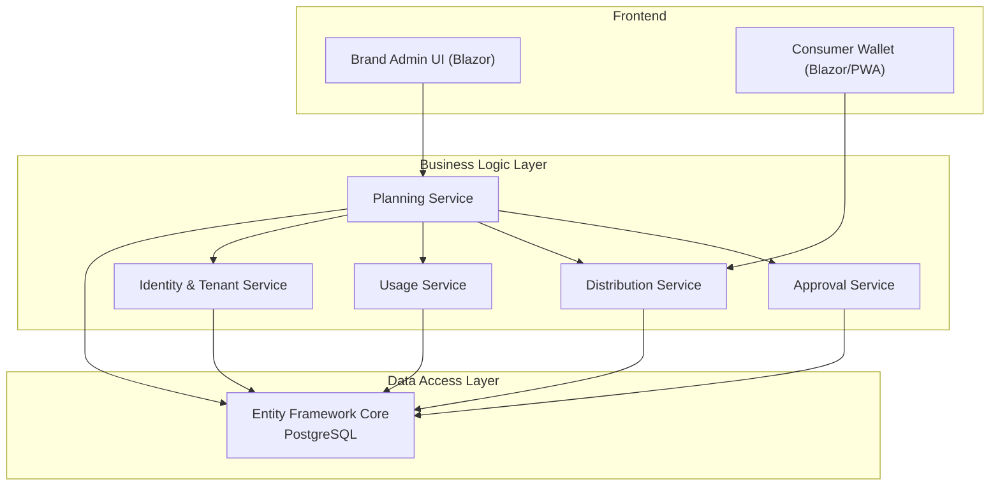
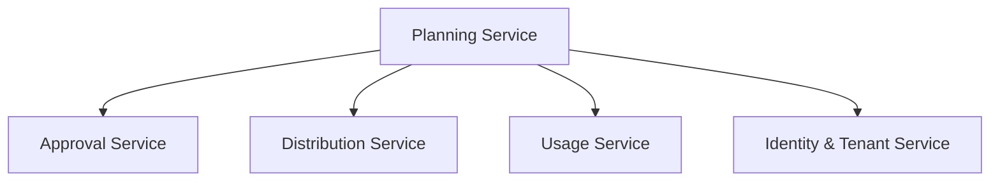
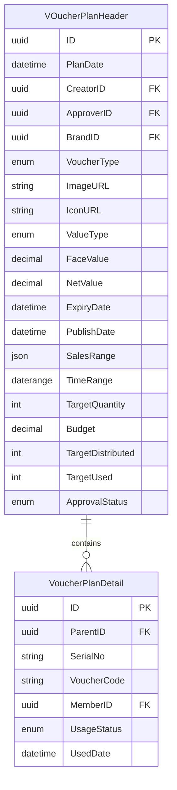
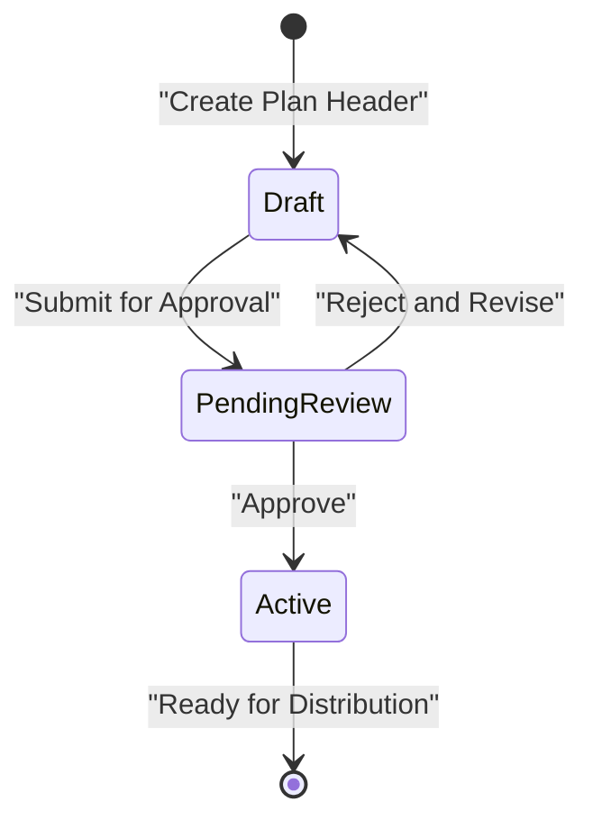
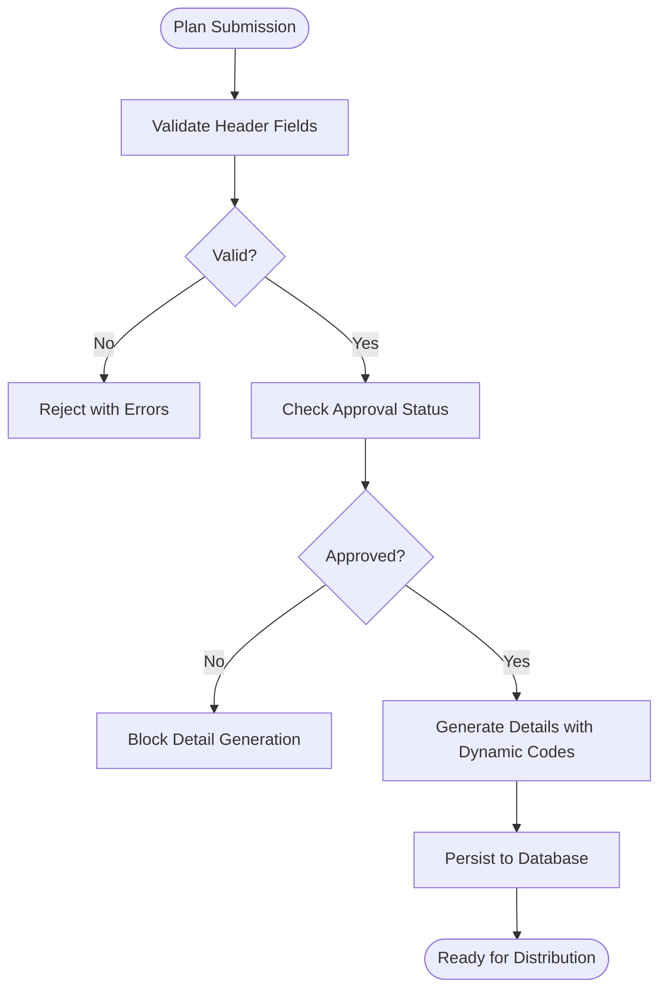
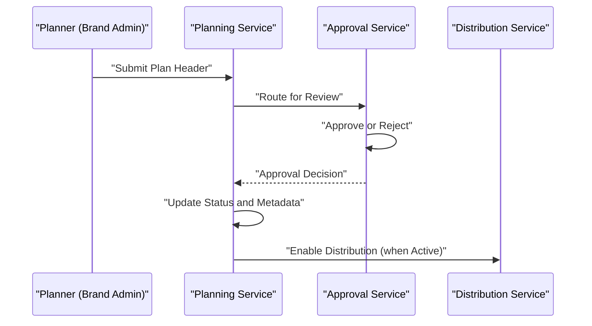
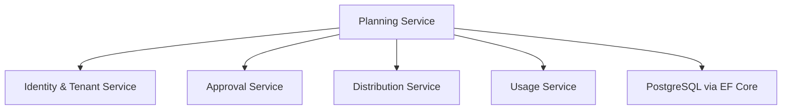

# Planning Service

<cite>
**Referenced Files in This Document**
- [architecture.md](file://docs/architecture.md)
- [data-models.md](file://docs/data-models.md)
- [api-contracts.md](file://docs/api-contracts.md)
- [index.md](file://docs/index.md)
- [epics.md](file://_bmad-output/planning-artifacts/epics.md)
- [implementation-readiness-report-2026-04-17.md](file://_bmad-output/planning-artifacts/implementation-readiness-report-2026-04-17.md)
- [ux-design-specification.md](file://_bmad-output/planning-artifacts/ux-design-specification.md)
- [Key Functionalities.txt](file://Key Functionalities.txt)
- [sprint-status.yaml](file://_bmad-output/implementation-artifacts/sprint-status.yaml)
- [manifest.yaml](file://_bmad/_config/manifest.yaml)
- [config.yaml (BMM)](file://_bmad/bmm/config.yaml)
- [config.yaml (CORE)](file://_bmad/core/config.yaml)
</cite>

## Table of Contents
1. [Introduction](#introduction)
2. [Project Structure](#project-structure)
3. [Core Components](#core-components)
4. [Architecture Overview](#architecture-overview)
5. [Detailed Component Analysis](#detailed-component-analysis)
6. [Dependency Analysis](#dependency-analysis)
7. [Performance Considerations](#performance-considerations)
8. [Troubleshooting Guide](#troubleshooting-guide)
9. [Conclusion](#conclusion)
10. [Appendices](#appendices)

## Introduction
This document provides comprehensive documentation for the Planning Service within the NonCash SaaS voucher platform. The Planning Service is responsible for managing the lifecycle of voucher campaigns, including plan creation, budget and target configuration, approval workflows, and version management. It ensures that voucher plans are created with accurate business rules, validated against multi-tenancy constraints, and prepared for downstream services such as Distribution and Usage.

The Planning Service operates as part of a 3-layer SaaS architecture with microservices, adheres to strict RBAC and multi-tenancy policies, and integrates with other services for distribution and POS redemption. This document explains the plan header and detail entities, their relationships, validation rules, and business-enforced constraints. It also covers approval workflows, versioning, transaction management, error handling, and performance considerations for bulk operations and concurrent creation.

## Project Structure
The NonCash project is organized around three primary layers and several supporting artifacts:
- Frontend: Blazor applications for admin and consumer experiences
- Business Logic Layer (BLL): Microservices including Planning, Approval, Distribution, Usage, and Identity & Tenant
- Data Access Layer (DAL): PostgreSQL with Entity Framework Core and repository pattern

The Planning Service focuses on:
- VoucherPlanHeader (plan header) and VoucherPlanDetail (plan details)
- Budget allocation, target settings, and campaign configuration
- Approval workflow and version management
- Integration with Approval, Distribution, and Usage services

**Diagram sources**
- [architecture.md:17-35](file://docs/architecture.md#L17-L35)

**Section sources**
- [architecture.md:1-52](file://docs/architecture.md#L1-L52)
- [index.md:12-22](file://docs/index.md#L12-L22)

## Core Components
The Planning Service orchestrates the creation and management of voucher campaigns through two primary entities:

- VoucherPlanHeader (Plan Header)
  - Represents the overall strategy for a voucher campaign
  - Includes identifiers, creator/approver, brand association, type and value configuration, expiry and publish dates, applicable outlets, time range, quantity and budget targets, and approval status
  - Enforces multi-tenancy via BrandID and RBAC via CreatorID/Approvers

- VoucherPlanDetail (Plan Detail)
  - Represents individual vouchers generated after a plan is approved
  - Links to the parent plan header, serial number, dynamic voucher code, assigned member, usage status, and used date
  - Supports dynamic code generation aligned with security requirements

These entities are defined and related in the data models documentation, and their lifecycle is governed by the Planning Service’s workflows.

**Section sources**
- [data-models.md:11-43](file://docs/data-models.md#L11-L43)
- [Key Functionalities.txt:7-68](file://Key Functionalities.txt#L7-L68)

## Architecture Overview
The Planning Service participates in a 3-layer SaaS architecture with microservices. It collaborates with:
- Approval Service for review and state transitions
- Distribution Service for generating and distributing plan details
- Usage Service for POS redemption workflows
- Identity & Tenant Service for RBAC and multi-tenancy enforcement

**Diagram sources**
- [architecture.md:17-26](file://docs/architecture.md#L17-L26)

**Section sources**
- [architecture.md:17-35](file://docs/architecture.md#L17-L35)

## Detailed Component Analysis

### Voucher Plan Header and Detail Entities
The Planning Service manages two core entities with explicit relationships and constraints:
- VoucherPlanHeader: central configuration for campaign attributes, targets, and approval status
- VoucherPlanDetail: per-voucher records derived from approved headers, including dynamic codes and usage lifecycle

**Diagram sources**
- [data-models.md:11-43](file://docs/data-models.md#L11-L43)

**Section sources**
- [data-models.md:11-43](file://docs/data-models.md#L11-L43)
- [Key Functionalities.txt:15-68](file://Key Functionalities.txt#L15-L68)

### Plan Creation Workflows
The Planning Service supports two primary creation modes:
- Batch generation: create many details in the background while maintaining UI responsiveness
- On-demand generation: create details as needed, gated by approval status

**Diagram sources**
- [epics.md:145-196](file://_bmad-output/planning-artifacts/epics.md#L145-L196)

**Section sources**
- [epics.md:145-196](file://_bmad-output/planning-artifacts/epics.md#L145-L196)

### Validation Rules and Data Integrity Checks
The Planning Service enforces the following validation rules:
- Multi-tenancy: BrandID isolation ensures data segregation across tenants
- Approval gating: Details cannot be generated until the plan is approved
- Dynamic code integrity: Voucher codes are dynamic and rotate periodically to prevent reuse and fraud
- Outlet applicability: SalesRange restricts usage to configured outlets
- Time-bound validity: ExpiryDate and TimeRange define usable windows
- Budget and target controls: Budget and targets constrain campaign scale and financial expectations

**Diagram sources**
- [epics.md:145-196](file://_bmad-output/planning-artifacts/epics.md#L145-L196)
- [data-models.md:11-43](file://docs/data-models.md#L11-L43)

**Section sources**
- [epics.md:145-196](file://_bmad-output/planning-artifacts/epics.md#L145-L196)
- [data-models.md:11-43](file://docs/data-models.md#L11-L43)

### Approval Workflows and Version Management
The Planning Service integrates with the Approval Service to manage plan review and publication:
- PendingReview: awaiting approver action
- Approved: plan becomes active and eligible for distribution
- Rejected: plan can be revised and resubmitted; versioning preserves historical approvals

**Diagram sources**
- [epics.md:171-196](file://_bmad-output/planning-artifacts/epics.md#L171-L196)

**Section sources**
- [epics.md:171-196](file://_bmad-output/planning-artifacts/epics.md#L171-L196)

### Integration Patterns with Other Services
- Approval Service: routes plan headers for review and updates approval status
- Distribution Service: generates and distributes plan details after approval and publish date
- Usage Service: consumes plan details for POS redemption with lock/commit/rollback semantics
- Identity & Tenant Service: enforces RBAC and multi-tenancy via BrandID and roles

**Diagram sources**
- [architecture.md:17-26](file://docs/architecture.md#L17-L26)

**Section sources**
- [architecture.md:17-35](file://docs/architecture.md#L17-L35)

### Error Handling Strategies
Common error scenarios and handling:
- Invalid submission: validation failures return structured errors to the client
- Approval rejections: rejected plans remain draft for revision; metadata preserved for audit
- Out-of-range validity: ExpiryDate overrides TimeRange when earlier; enforce earliest publish date
- Multi-tenancy violations: requests outside BrandID scope are blocked
- Dynamic code generation failures: retries or fallbacks to secure generation logic

**Section sources**
- [epics.md:145-196](file://_bmad-output/planning-artifacts/epics.md#L145-L196)
- [data-models.md:11-43](file://docs/data-models.md#L11-L43)

### Transaction Management
- Database consistency: EF Core repository pattern ensures transactional integrity for plan writes
- POS safety: Usage Service coordinates lock/commit/rollback to guarantee transactional redemption
- Cross-service coordination: Planning Service coordinates with Approval/Distribution to maintain state consistency

**Section sources**
- [architecture.md:28-35](file://docs/architecture.md#L28-L35)
- [api-contracts.md:14-87](file://docs/api-contracts.md#L14-L87)

## Dependency Analysis
The Planning Service depends on:
- Identity & Tenant Service for RBAC and multi-tenancy
- Approval Service for state transitions
- Distribution Service for detail generation and distribution
- Usage Service for POS redemption lifecycle
- DAL for persistence and transaction management

**Diagram sources**
- [architecture.md:17-35](file://docs/architecture.md#L17-L35)

**Section sources**
- [architecture.md:17-35](file://docs/architecture.md#L17-L35)

## Performance Considerations
- Bulk plan operations: use asynchronous background workers to generate large batches of details without blocking the UI
- Concurrent creation: implement optimistic concurrency and idempotent operations to avoid race conditions
- Scalability: leverage microservice boundaries and horizontal scaling for high-throughput scenarios
- Real-time updates: employ real-time signaling for immediate UI feedback post-generation and approval
- Database throughput: optimize queries and indexing on BrandID, ApprovalStatus, and PublishDate for efficient filtering and reporting

**Section sources**
- [ux-design-specification.md:242-261](file://_bmad-output/planning-artifacts/ux-design-specification.md#L242-L261)
- [implementation-readiness-report-2026-04-17.md:120-123](file://_bmad-output/planning-artifacts/implementation-readiness-report-2026-04-17.md#L120-L123)

## Troubleshooting Guide
- Plan not generating details: verify approval status and publish date; ensure plan is Active and within TimeRange
- Multi-tenancy errors: confirm BrandID matches the authenticated user’s tenant
- Dynamic code issues: check rotation logic and token validity windows
- Approval rejections: inspect rejection notes and revise plan accordingly; create a new version for resubmission
- POS redemption anomalies: validate lock/commit/rollback sequences and outlet permissions

**Section sources**
- [epics.md:145-196](file://_bmad-output/planning-artifacts/epics.md#L145-L196)
- [data-models.md:11-43](file://docs/data-models.md#L11-L43)

## Conclusion
The Planning Service is central to NonCash’s voucher campaign lifecycle, ensuring robust plan creation, strict validation, and seamless integration with approval, distribution, and usage services. By enforcing multi-tenancy, RBAC, and dynamic code security, it maintains data integrity and operational safety. The documented workflows, validation rules, and performance strategies provide a solid foundation for building scalable and reliable campaign management capabilities.

## Appendices

### Appendix A: Sprint and Implementation Artifacts
- Implementation readiness confirms 100% coverage of functional requirements and microservices architecture
- Sprint status indicates planned stories for Planning Service workflows (setup, generation, approval, versioning)

**Section sources**
- [implementation-readiness-report-2026-04-17.md:53-72](file://_bmad-output/planning-artifacts/implementation-readiness-report-2026-04-17.md#L53-L72)
- [sprint-status.yaml:58-64](file://_bmad-output/implementation-artifacts/sprint-status.yaml#L58-L64)

### Appendix B: Configuration References
- B-MAD configuration files define project metadata and artifact locations

**Section sources**
- [manifest.yaml:1-25](file://_bmad/_config/manifest.yaml#L1-L25)
- [config.yaml (BMM):6-16](file://_bmad/bmm/config.yaml#L6-L16)
- [config.yaml (CORE):6-9](file://_bmad/core/config.yaml#L6-L9)