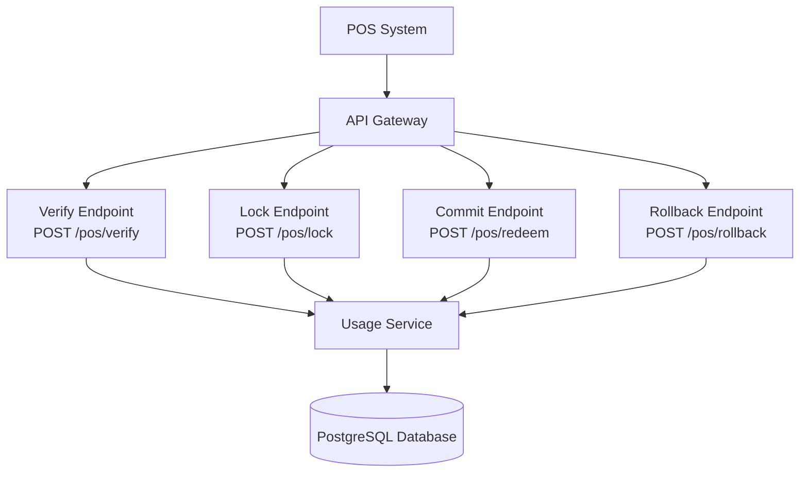
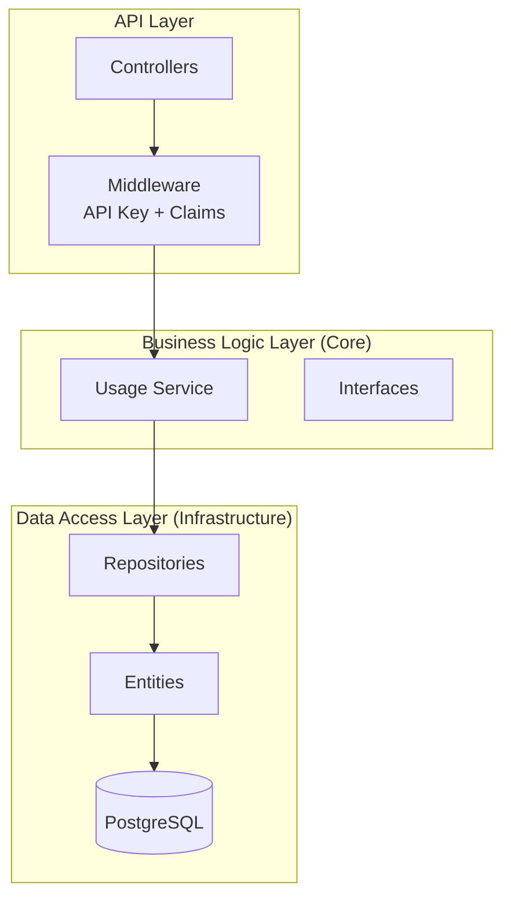
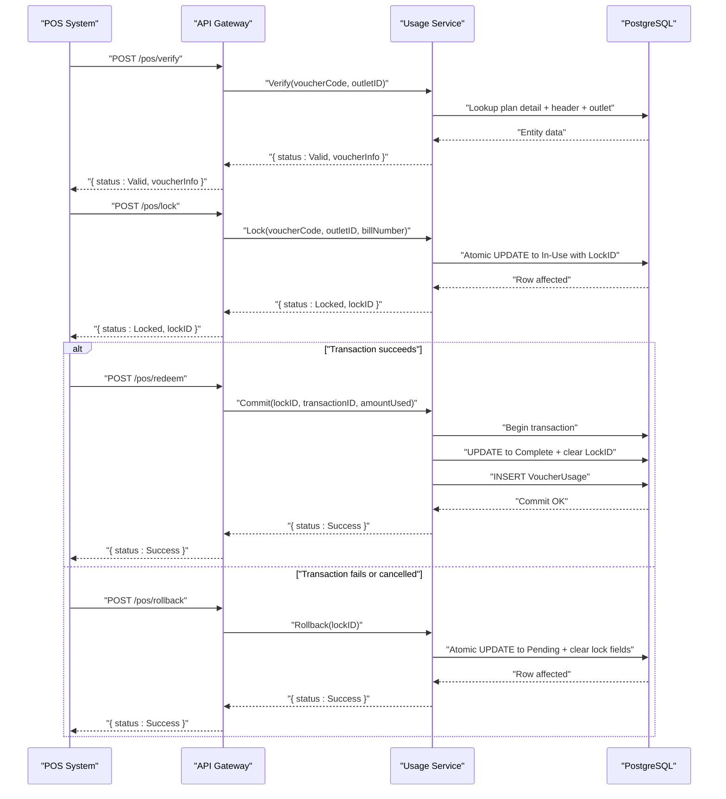
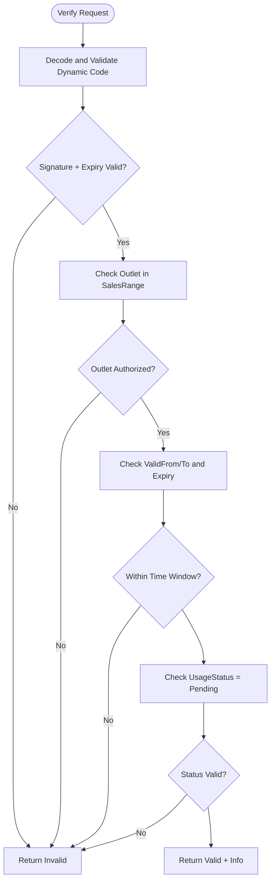
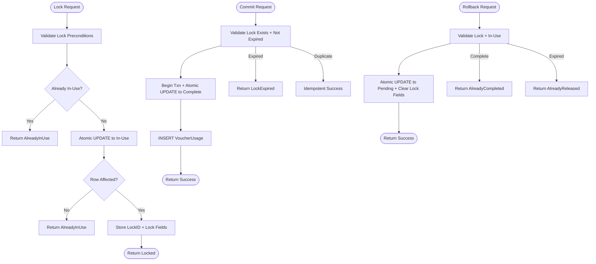
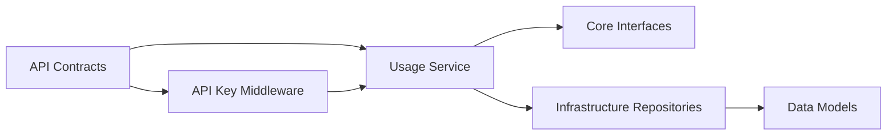

# Usage Service

<cite>
**Referenced Files in This Document**
- [api-contracts.md](file://docs/api-contracts.md)
- [architecture.md](file://docs/architecture.md)
- [data-models.md](file://docs/data-models.md)
- [Key Functionalities.txt](file://Key Functionalities.txt)
- [4-1-check-for-information.md](file://_bmad-output/implementation-artifacts/4-1-check-for-information.md)
- [4-2-prepare-and-lock.md](file://_bmad-output/implementation-artifacts/4-2-prepare-and-lock.md)
- [4-3-commit-and-log.md](file://_bmad-output/implementation-artifacts/4-3-commit-and-log.md)
- [4-4-rollback-mechanism.md](file://_bmad-output/implementation-artifacts/4-4-rollback-mechanism.md)
</cite>

## Table of Contents
1. [Introduction](#introduction)
2. [Project Structure](#project-structure)
3. [Core Components](#core-components)
4. [Architecture Overview](#architecture-overview)
5. [Detailed Component Analysis](#detailed-component-analysis)
6. [Dependency Analysis](#dependency-analysis)
7. [Performance Considerations](#performance-considerations)
8. [Troubleshooting Guide](#troubleshooting-guide)
9. [Conclusion](#conclusion)
10. [Appendices](#appendices)

## Introduction
This document provides comprehensive guidance for the Usage Service focused on POS redemption engine and transaction lifecycle management. It explains the lock-commit-rollback mechanism, security validation processes, and POS system integration patterns. It documents voucher verification, dynamic code generation, and transaction logging, and includes concrete POS redemption workflows, security validation steps, and error recovery procedures. It also covers integration with external POS systems via API keys, transaction state management, audit trail maintenance, performance considerations for high-throughput redemption scenarios, concurrent transaction handling, distributed transaction coordination, POS onboarding guidance, security configuration, and troubleshooting.

## Project Structure
The Usage Service orchestrates POS redemption through four primary endpoints:
- Verify: Stateless check of voucher validity and availability.
- Lock: Atomically reserves a voucher for a transaction.
- Commit: Permanently marks usage and logs the transaction.
- Rollback: Releases a reservation without recording usage.

**Diagram sources**
- [api-contracts.md:10-87](file://docs/api-contracts.md#L10-L87)
- [4-2-prepare-and-lock.md:13-20](file://_bmad-output/implementation-artifacts/4-2-prepare-and-lock.md#L13-L20)
- [4-3-commit-and-log.md:13-19](file://_bmad-output/implementation-artifacts/4-3-commit-and-log.md#L13-L19)
- [4-4-rollback-mechanism.md:13-19](file://_bmad-output/implementation-artifacts/4-4-rollback-mechanism.md#L13-L19)

**Section sources**
- [api-contracts.md:10-87](file://docs/api-contracts.md#L10-L87)
- [architecture.md:17-34](file://docs/architecture.md#L17-L34)

## Core Components
- Verify Voucher: Validates dynamic code, outlet scope, time windows, and status without mutating state.
- Lock Voucher: Atomically transitions a voucher to In-Use and returns a LockID for the transaction.
- Commit/Redeem: Finalizes usage within a single transaction, persists usage record, and clears LockID.
- Rollback: Releases a lock back to Pending without creating a usage record.

Key data models:
- VoucherPlanDetail: Holds serial number, dynamic code, usage status, timestamps, and lock metadata.
- VoucherUsage: Records POS transaction linkage, amount used, and usage date.

Security and identity:
- API Key authentication for POS endpoints.
- Dynamic voucher code generation and validation (short-lived tokens).
- Multi-tenant isolation via BrandID and outlet scoping.

**Section sources**
- [4-1-check-for-information.md:13-26](file://_bmad-output/implementation-artifacts/4-1-check-for-information.md#L13-L26)
- [4-2-prepare-and-lock.md:13-20](file://_bmad-output/implementation-artifacts/4-2-prepare-and-lock.md#L13-L20)
- [4-3-commit-and-log.md:13-19](file://_bmad-output/implementation-artifacts/4-3-commit-and-log.md#L13-L19)
- [4-4-rollback-mechanism.md:13-19](file://_bmad-output/implementation-artifacts/4-4-rollback-mechanism.md#L13-L19)
- [data-models.md:34-98](file://docs/data-models.md#L34-L98)
- [architecture.md:36-52](file://docs/architecture.md#L36-L52)

## Architecture Overview
The Usage Service follows a 3-layer SaaS architecture:
- Business Logic Layer (Core): Orchestrates POS redemption workflows and enforces transaction integrity.
- Data Access Layer (Infrastructure): Implements repository pattern with PostgreSQL and EF Core.
- API Layer: Exposes REST endpoints with API Key authentication and integrates middleware for outlet context.

**Diagram sources**
- [architecture.md:5-34](file://docs/architecture.md#L5-L34)
- [4-2-prepare-and-lock.md:70-76](file://_bmad-output/implementation-artifacts/4-2-prepare-and-lock.md#L70-L76)
- [4-3-commit-and-log.md:70-76](file://_bmad-output/implementation-artifacts/4-3-commit-and-log.md#L70-L76)
- [4-4-rollback-mechanism.md:70-75](file://_bmad-output/implementation-artifacts/4-4-rollback-mechanism.md#L70-L75)

**Section sources**
- [architecture.md:5-34](file://docs/architecture.md#L5-L34)

## Detailed Component Analysis

### POS Redemption Workflow (Verify → Lock → Commit/Rollback)
This sequence ensures transaction integrity and prevents double-spending.

**Diagram sources**
- [api-contracts.md:14-87](file://docs/api-contracts.md#L14-L87)
- [4-1-check-for-information.md:13-26](file://_bmad-output/implementation-artifacts/4-1-check-for-information.md#L13-L26)
- [4-2-prepare-and-lock.md:13-20](file://_bmad-output/implementation-artifacts/4-2-prepare-and-lock.md#L13-L20)
- [4-3-commit-and-log.md:13-19](file://_bmad-output/implementation-artifacts/4-3-commit-and-log.md#L13-L19)
- [4-4-rollback-mechanism.md:13-19](file://_bmad-output/implementation-artifacts/4-4-rollback-mechanism.md#L13-L19)

**Section sources**
- [api-contracts.md:14-87](file://docs/api-contracts.md#L14-L87)
- [Key Functionalities.txt:135-156](file://Key Functionalities.txt#L135-L156)

### Security Validation Processes
- Dynamic Voucher Code Validation: Short-lived signed tokens validated by the backend; expiry enforced and signature verified.
- Outlet Scope Validation: Ensures the POS outlet belongs to the plan’s sales range.
- Time Window Validation: Enforces validity period and hard expiry dates.
- API Key Authentication: POS endpoints require API Key header; middleware attaches outlet claims for downstream use.
- Multi-Tenant Isolation: BrandID scope restricts access to authorized tenants.

**Diagram sources**
- [4-1-check-for-information.md:13-26](file://_bmad-output/implementation-artifacts/4-1-check-for-information.md#L13-L26)
- [4-2-prepare-and-lock.md:17-18](file://_bmad-output/implementation-artifacts/4-2-prepare-and-lock.md#L17-L18)
- [4-3-commit-and-log.md:16-16](file://_bmad-output/implementation-artifacts/4-3-commit-and-log.md#L16-L16)
- [4-4-rollback-mechanism.md:16-16](file://_bmad-output/implementation-artifacts/4-4-rollback-mechanism.md#L16-L16)

**Section sources**
- [4-1-check-for-information.md:13-26](file://_bmad-output/implementation-artifacts/4-1-check-for-information.md#L13-L26)
- [architecture.md:36-52](file://docs/architecture.md#L36-L52)

### Lock-Commit-Rollback Transaction Lifecycle
- Lock: Atomic state transition to In-Use with LockID; idempotent for same billNumber; optional expiry with background cleanup.
- Commit: Single-transaction boundary around state update and usage record insertion; idempotent by transactionID; rejects expired locks.
- Rollback: Atomic revert to Pending; guards against rolling back Completed; handles expired locks gracefully.

**Diagram sources**
- [4-2-prepare-and-lock.md:13-38](file://_bmad-output/implementation-artifacts/4-2-prepare-and-lock.md#L13-L38)
- [4-3-commit-and-log.md:13-42](file://_bmad-output/implementation-artifacts/4-3-commit-and-log.md#L13-L42)
- [4-4-rollback-mechanism.md:13-38](file://_bmad-output/implementation-artifacts/4-4-rollback-mechanism.md#L13-L38)

**Section sources**
- [4-2-prepare-and-lock.md:13-38](file://_bmad-output/implementation-artifacts/4-2-prepare-and-lock.md#L13-L38)
- [4-3-commit-and-log.md:13-42](file://_bmad-output/implementation-artifacts/4-3-commit-and-log.md#L13-L42)
- [4-4-rollback-mechanism.md:13-38](file://_bmad-output/implementation-artifacts/4-4-rollback-mechanism.md#L13-L38)

### POS System Integration Patterns
- API Key Authentication: All POS endpoints require X-API-Key header; middleware validates and attaches outlet context.
- Idempotency: Lock and Commit endpoints must tolerate retries; enforce idempotency via billNumber and transactionID.
- Distributed Transaction Token: LockID acts as a distributed transaction token for commit/rollback.
- Partial Redemption: AmountUsed may be less than face value; store actual amount used.

**Section sources**
- [4-1-check-for-information.md:52-58](file://_bmad-output/implementation-artifacts/4-1-check-for-information.md#L52-L58)
- [4-2-prepare-and-lock.md:34-38](file://_bmad-output/implementation-artifacts/4-2-prepare-and-lock.md#L34-L38)
- [4-3-commit-and-log.md:38-42](file://_bmad-output/implementation-artifacts/4-3-commit-and-log.md#L38-L42)
- [4-3-commit-and-log.md:67-68](file://_bmad-output/implementation-artifacts/4-3-commit-and-log.md#L67-L68)

### Voucher Verification and Dynamic Code Generation
- Dynamic Code: Short-lived signed token (e.g., JWT-style) with payload including voucher identifier, issued-at, and expiry.
- Generation: Per-detail or per-brand secret; signing key rotation supported.
- Validation: Backend verifies signature and expiry; POS displays current code by fetching from API.

**Section sources**
- [2-2-generate-plan-details.md:36-42](file://_bmad-output/implementation-artifacts/2-2-generate-plan-details.md#L36-L42)
- [2-2-generate-plan-details.md:49-53](file://_bmad-output/implementation-artifacts/2-2-generate-plan-details.md#L49-L53)
- [2-2-generate-plan-details.md:97-100](file://_bmad-output/implementation-artifacts/2-2-generate-plan-details.md#L97-L100)

### Transaction Logging and Audit Trail
- VoucherUsage: Persisted upon commit with POSID, TransactionID, UsageDate, and AmountUsed.
- Unique Constraints: TransactionID uniqueness prevents duplicate logging.
- Optional Audit Trail: Rollback may optionally create an audit log record for traceability.

**Section sources**
- [4-3-commit-and-log.md:21-24](file://_bmad-output/implementation-artifacts/4-3-commit-and-log.md#L21-L24)
- [4-3-commit-and-log.md:79-82](file://_bmad-output/implementation-artifacts/4-3-commit-and-log.md#L79-L82)
- [4-4-rollback-mechanism.md:39-43](file://_bmad-output/implementation-artifacts/4-4-rollback-mechanism.md#L39-L43)

## Dependency Analysis
- API Contracts define endpoint semantics and authentication.
- Usage Service depends on Core interfaces and Infrastructure repositories.
- Data models define entity relationships and constraints.
- Middleware enforces API Key and outlet scoping.

**Diagram sources**
- [api-contracts.md:5-9](file://docs/api-contracts.md#L5-L9)
- [4-2-prepare-and-lock.md:70-76](file://_bmad-output/implementation-artifacts/4-2-prepare-and-lock.md#L70-L76)
- [4-3-commit-and-log.md:70-76](file://_bmad-output/implementation-artifacts/4-3-commit-and-log.md#L70-L76)
- [4-4-rollback-mechanism.md:70-75](file://_bmad-output/implementation-artifacts/4-4-rollback-mechanism.md#L70-L75)
- [data-models.md:5-98](file://docs/data-models.md#L5-L98)

**Section sources**
- [api-contracts.md:5-9](file://docs/api-contracts.md#L5-L9)
- [data-models.md:5-98](file://docs/data-models.md#L5-L98)

## Performance Considerations
- Concurrency Control: Use atomic conditional updates and row-level locking to prevent race conditions during lock acquisition.
- Idempotency: Enforce idempotency at the application boundary to handle network retries safely.
- Transaction Boundaries: Keep commit/rollback transactions minimal and fast; avoid long-running work inside transactions.
- Indexing: Ensure unique indexes on TransactionID and efficient lookups on voucher identifiers.
- Background Cleanup: Implement periodic lock cleanup to release expired locks and reduce contention.
- Load Testing: Validate lock uniqueness under high concurrency and confirm rollback/commit idempotency.

[No sources needed since this section provides general guidance]

## Troubleshooting Guide
Common issues and recovery procedures:
- Duplicate Lock Requests: Expect AlreadyInUse; ensure POS deduplicates by billNumber.
- Expired Lock: Commit fails with LockExpired; POS must re-verify and re-lock.
- Commit After Rollback: If POS attempts commit after rollback, backend will reject with AlreadyCompleted.
- Rollback After Commit: Attempting rollback after completion returns AlreadyCompleted; usage record remains intact.
- Verify Without Mutation: Calling verify multiple times should not change UsageStatus; confirm no writes occur.
- API Key Issues: Unauthorized or missing API Key leads to rejection; rotate keys and reconfigure POS.

**Section sources**
- [4-2-prepare-and-lock.md:22-26](file://_bmad-output/implementation-artifacts/4-2-prepare-and-lock.md#L22-L26)
- [4-3-commit-and-log.md:32-36](file://_bmad-output/implementation-artifacts/4-3-commit-and-log.md#L32-L36)
- [4-3-commit-and-log.md:38-42](file://_bmad-output/implementation-artifacts/4-3-commit-and-log.md#L38-L42)
- [4-4-rollback-mechanism.md:21-25](file://_bmad-output/implementation-artifacts/4-4-rollback-mechanism.md#L21-L25)
- [4-4-rollback-mechanism.md:27-31](file://_bmad-output/implementation-artifacts/4-4-rollback-mechanism.md#L27-L31)
- [4-1-check-for-information.md:21-26](file://_bmad-output/implementation-artifacts/4-1-check-for-information.md#L21-L26)

## Conclusion
The Usage Service provides a robust, secure, and high-integrity POS redemption engine. By enforcing atomic lock/commit/rollback semantics, validating dynamic codes and outlet scopes, and maintaining precise transaction logging, it ensures accurate audit trails and strong fraud prevention. Proper API Key configuration, idempotency handling, and background cleanup support high-throughput, reliable operations across POS systems.

[No sources needed since this section summarizes without analyzing specific files]

## Appendices

### POS Redemption Workflows (Step-by-Step)
- Verify: POS sends voucherCode and outletID; backend validates dynamic code, outlet scope, time window, and status; returns Valid or Invalid.
- Lock: POS requests lock with voucherCode, outletID, and billNumber; backend atomically transitions to In-Use and returns LockID.
- Commit: POS submits lockID and transactionID after successful payment; backend commits within a single transaction and logs usage.
- Rollback: POS cancels transaction; backend releases lock back to Pending without logging usage.

**Section sources**
- [api-contracts.md:14-87](file://docs/api-contracts.md#L14-L87)
- [4-1-check-for-information.md:13-26](file://_bmad-output/implementation-artifacts/4-1-check-for-information.md#L13-L26)
- [4-2-prepare-and-lock.md:13-20](file://_bmad-output/implementation-artifacts/4-2-prepare-and-lock.md#L13-L20)
- [4-3-commit-and-log.md:13-19](file://_bmad-output/implementation-artifacts/4-3-commit-and-log.md#L13-L19)
- [4-4-rollback-mechanism.md:13-19](file://_bmad-output/implementation-artifacts/4-4-rollback-mechanism.md#L13-L19)

### Security Configuration Guidance
- API Key Rotation: Rotate outlet API keys periodically; store hashed keys, not plaintext.
- Dynamic Code Secrets: Maintain per-detail or per-brand secrets; support revocation and rotation.
- Multi-Tenant Controls: Enforce BrandID and outlet scope at the API boundary.
- JWT Management: Ensure proper token lifetimes and signature validation.

**Section sources**
- [4-1-check-for-information.md:95-95](file://_bmad-output/implementation-artifacts/4-1-check-for-information.md#L95-L95)
- [2-2-generate-plan-details.md:102-105](file://_bmad-output/implementation-artifacts/2-2-generate-plan-details.md#L102-L105)
- [architecture.md:36-52](file://docs/architecture.md#L36-L52)