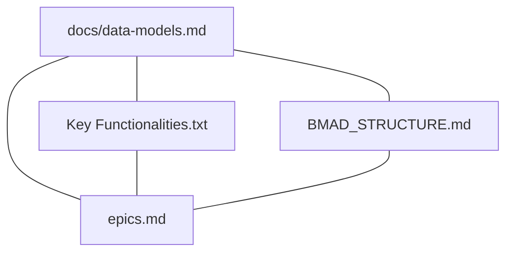
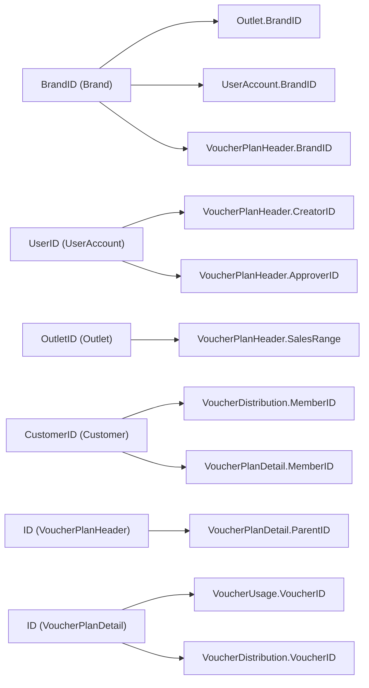

# Core Business Entities

<cite>
**Referenced Files in This Document**
- [data-models.md](file://docs/data-models.md)
- [Key Functionalities.txt](file://Key Functionalities.txt)
- [BMAD_STRUCTURE.md](file://BMAD_STRUCTURE.md)
- [epics.md](file://_bmad-output/planning-artifacts/epics.md)
</cite>

## Table of Contents
1. [Introduction](#introduction)
2. [Project Structure](#project-structure)
3. [Core Components](#core-components)
4. [Architecture Overview](#architecture-overview)
5. [Detailed Component Analysis](#detailed-component-analysis)
6. [Dependency Analysis](#dependency-analysis)
7. [Performance Considerations](#performance-considerations)
8. [Troubleshooting Guide](#troubleshooting-guide)
9. [Conclusion](#conclusion)
10. [Appendices](#appendices)

## Introduction
This document defines the core business entities that underpin the NonCash platform’s voucher lifecycle and tenant-aware operations. It focuses on:
- VoucherPlanHeader (campaign master)
- VoucherPlanDetail (individual voucher records)
- Brand (multi-tenant organization)
- Outlet (POS locations)
- UserAccount (back-office users)
- Customer (end-users)

It documents field definitions, data types, primary keys, foreign key relationships, business constraints, and validation rules derived from the repository’s data model and functional specifications.

## Project Structure
The data model and business context are primarily documented in:
- docs/data-models.md: Defines the core entities and their attributes
- Key Functionalities.txt: Describes production planning and distribution workflows
- BMAD_STRUCTURE.md: Outlines business objectives and target users
- _bmad-output/planning-artifacts/epics.md: Captures epics and acceptance criteria related to Brand, Outlet, and Customer management



**Diagram sources**
- [data-models.md:1-98](file://docs/data-models.md#L1-L98)
- [Key Functionalities.txt:1-29](file://Key Functionalities.txt#L1-L29)
- [BMAD_STRUCTURE.md:1-35](file://BMAD_STRUCTURE.md#L1-L35)
- [epics.md](file://_bmad-output/planning-artifacts/epics.md)

**Section sources**
- [data-models.md:1-98](file://docs/data-models.md#L1-L98)
- [Key Functionalities.txt:1-29](file://Key Functionalities.txt#L1-L29)
- [BMAD_STRUCTURE.md:1-35](file://BMAD_STRUCTURE.md#L1-L35)
- [epics.md](file://_bmad-output/planning-artifacts/epics.md)

## Core Components
This section summarizes each entity’s purpose, attributes, and constraints as defined in the repository materials.

- VoucherPlanHeader (Plan Header)
  - Purpose: Campaign-level definition of a voucher plan including type, value, validity, budget, and approval metadata.
  - Primary Key: ID (GUID)
  - Foreign Keys: CreatorID (UserAccount), ApproverID (UserAccount), BrandID (Brand)
  - Attributes and Types: PlanDate (DateTime), VoucherType (Enum), ImageURL/IconURL (String), ValueType (Enum), FaceValue/NetValue (Decimal), ExpiryDate/PublishDate (DateTime), SalesRange (List<OutletID>), TimeRange (DateRange), TargetQuantity/Budget (Integer/Decimal), TargetDistributed/TargetUsed (Integer), ApprovalStatus (Enum)
  - Business Constraints:
    - ApprovalStatus governs lifecycle transitions (Pending → Approved/Rejected)
    - SalesRange restricts usage to specific Outlets per Brand
    - PublishDate controls availability; ExpiryDate enforces hard expiry
    - Budget constrains total cost; TargetQuantity/Budget align with financial goals

- VoucherPlanDetail (Voucher Detail)
  - Purpose: Individual voucher record generated post-approval; tracks ownership and usage state.
  - Primary Key: ID (GUID)
  - Foreign Key: ParentID (VoucherPlanHeader)
  - Attributes and Types: SerialNo (String), VoucherCode (String), MemberID (GUID?), UsageStatus (Enum), UsedDate (DateTime?)
  - Business Constraints:
    - UsageStatus drives lifecycle (Pending → In-Use → Complete)
    - MemberID links to a Customer when assigned
    - VoucherCode is a dynamic code for redemption

- VoucherUsage
  - Purpose: Redemption history at POS.
  - Attributes and Types: ID (GUID), VoucherID (GUID), POSID (String), TransactionID (String), UsageDate (DateTime), AmountUsed (Decimal)
  - Business Constraints:
    - Links a VoucherPlanDetail to a specific POS and transaction
    - AmountUsed reflects the applied amount during redemption

- VoucherDistribution
  - Purpose: Tracks how vouchers reached customers.
  - Attributes and Types: ID (GUID), VoucherID (GUID), MemberID (GUID), Method (Enum), DistributionDate (DateTime)
  - Business Constraints:
    - Method indicates origin (Sale/Promotion/Transfer)
    - Links VoucherPlanDetail to a Customer

- Brand (Organization / Tenant)
  - Purpose: Multi-tenant tenant representing a business unit.
  - Primary Key: BrandID (GUID)
  - Attributes and Types: Name (String), TaxCode (String), ContactEmail (String), Status (Enum)
  - Business Constraints:
    - Status governs active/suspended state
    - Outlet and UserAccount are scoped to BrandID

- Outlet (Point of Sale / Store)
  - Purpose: Physical or digital store under a Brand eligible to accept vouchers.
  - Primary Key: OutletID (GUID)
  - Foreign Key: BrandID (Brand)
  - Attributes and Types: Name (String), Address (String), Status (Enum)
  - Business Constraints:
    - Status governs Active/Closed state
    - VoucherPlanHeader.SalesRange references OutletIDs

- UserAccount (Back-office Users)
  - Purpose: Platform users with roles for planning, reviewing, and approving plans.
  - Primary Key: UserID (GUID)
  - Foreign Key: BrandID (Brand), nullable for system super-admins
  - Attributes and Types: Username (String), PasswordHash (String), FullName (String), Role (Enum), Status (Enum)
  - Business Constraints:
    - Role determines access rights (Admin/Planner/Approver)
    - Status governs Active/Locked state

- Customer (End-User / App Member)
  - Purpose: End-user who receives and redeems vouchers.
  - Primary Key: CustomerID (GUID)
  - Attributes and Types: PhoneNumber (String), FullName (String), Email (String), Status (Enum)
  - Business Constraints:
    - PhoneNumber is the primary identifier for transfers/logins
    - Status governs Active/Blacklisted state

**Section sources**
- [data-models.md:9-97](file://docs/data-models.md#L9-L97)
- [Key Functionalities.txt:7-29](file://Key Functionalities.txt#L7-L29)
- [BMAD_STRUCTURE.md:5-16](file://BMAD_STRUCTURE.md#L5-L16)
- [epics.md](file://_bmad-output/planning-artifacts/epics.md)

## Architecture Overview
The entities form a cohesive domain model supporting multi-tenancy and voucher lifecycle management.

```mermaid
erDiagram
BRAND {
guid BrandID PK
string Name
string TaxCode
string ContactEmail
enum Status
}
OUTLET {
guid OutletID PK
guid BrandID FK
string Name
string Address
enum Status
}
USERACCOUNT {
guid UserID PK
guid BrandID FK
string Username
string PasswordHash
string FullName
enum Role
enum Status
}
CUSTOMER {
guid CustomerID PK
string PhoneNumber
string FullName
string Email
enum Status
}
VOUCHERPLANHEADER {
guid ID PK
datetime PlanDate
guid CreatorID FK
guid ApproverID FK
guid BrandID FK
enum VoucherType
string ImageURL
string IconURL
enum ValueType
decimal FaceValue
decimal NetValue
datetime ExpiryDate
datetime PublishDate
list OutletIDs SalesRange
daterange TimeRange
int TargetQuantity
decimal Budget
int TargetDistributed
int TargetUsed
enum ApprovalStatus
}
VOUCHERPLANDetail {
guid ID PK
guid ParentID FK
string SerialNo
string VoucherCode
guid MemberID FK
enum UsageStatus
datetime UsedDate
}
VOUCHERUSAGE {
guid ID PK
guid VoucherID FK
string POSID
string TransactionID
datetime UsageDate
decimal AmountUsed
}
VOUCHERDISTRIBUTION {
guid ID PK
guid VoucherID FK
guid MemberID FK
enum Method
datetime DistributionDate
}
VOUCHERPLANHEADER ||--o{ VOUCHERPLANDetail : "generates"
VOUCHERPLANDetail ||--o{ VOUCHERUSAGE : "redeemed_by"
VOUCHERPLANDetail ||--o{ VOUCHERDISTRIBUTION : "distributed_to"
BRAND ||--o{ OUTLET : "owns"
BRAND ||--o{ USERACCOUNT : "employs"
BRAND ||--o{ VOUCHERPLANHEADER : "creates"
CUSTOMER ||--o{ VOUCHERDISTRIBUTION : "receives"
CUSTOMER ||--o{ VOUCHERPLANDetail : "owns"
```

**Diagram sources**
- [data-models.md:9-97](file://docs/data-models.md#L9-L97)

## Detailed Component Analysis

### VoucherPlanHeader (Campaign Master)
- Purpose: Defines the strategic and operational blueprint for a voucher campaign.
- Key Fields:
  - ID (Primary Key)
  - CreatorID/ApproverID (Foreign Keys to UserAccount)
  - BrandID (Foreign Key to Brand)
  - VoucherType (Enum), ValueType (Enum)
  - FaceValue/NetValue (Decimal)
  - ExpiryDate/PublishDate (DateTime)
  - SalesRange (List<OutletID>)
  - TimeRange (DateRange)
  - TargetQuantity/Budget (Integer/Decimal)
  - TargetDistributed/TargetUsed (Integer)
  - ApprovalStatus (Enum)
- Business Logic:
  - ApprovalStatus governs whether a plan can proceed to generation of VoucherPlanDetail instances.
  - SalesRange and TimeRange constrain where and when vouchers can be used.
  - PublishDate and ExpiryDate enforce availability windows.
  - Budget and TargetQuantity/Budget support financial planning and volume goals.

Validation Rules:
- CreatorID must reference an existing UserAccount
- ApproverID must reference an existing UserAccount (nullable)
- BrandID must reference an existing Brand
- SalesRange must reference existing Outlets owned by BrandID
- ExpiryDate ≥ PublishDate
- TargetQuantity ≥ TargetDistributed ≥ 0
- Budget ≥ 0

Sample Data Example:
- ID: [GUID]
- PlanDate: [DateTime]
- CreatorID: [GUID]
- ApproverID: [GUID or null]
- BrandID: [GUID]
- VoucherType: Complimentary or Gift
- ValueType: Value or Percentage
- FaceValue: [Decimal]
- NetValue: [Decimal]
- ExpiryDate: [DateTime]
- PublishDate: [DateTime]
- SalesRange: ["[OutletID1, OutletID2, ...]"]
- TimeRange: ["[From: DateTime, To: DateTime]"]
- TargetQuantity: [Integer]
- Budget: [Decimal]
- TargetDistributed: [Integer]
- TargetUsed: [Integer]
- ApprovalStatus: Pending or Approved or Rejected

**Section sources**
- [data-models.md:11-32](file://docs/data-models.md#L11-L32)
- [Key Functionalities.txt:15-29](file://Key Functionalities.txt#L15-L29)

### VoucherPlanDetail (Individual Voucher Records)
- Purpose: Represents a single voucher instance produced from an approved plan.
- Key Fields:
  - ID (Primary Key)
  - ParentID (Foreign Key to VoucherPlanHeader)
  - SerialNo (Unique external ID)
  - VoucherCode (Dynamic code for usage)
  - MemberID (Foreign Key to Customer, nullable)
  - UsageStatus (Enum), UsedDate (DateTime?)
- Business Logic:
  - Lifecycle: Pending → In-Use → Complete based on UsageStatus
  - MemberID assignment links ownership to a Customer
  - VoucherCode enables secure redemption

Validation Rules:
- ParentID must reference an existing VoucherPlanHeader
- MemberID must reference an existing Customer (when assigned)
- UsageStatus must be Pending/In-Use/Complete
- UsedDate must be present when UsageStatus is Complete

Sample Data Example:
- ID: [GUID]
- ParentID: [GUID]
- SerialNo: "[Unique String]"
- VoucherCode: "[Dynamic Code]"
- MemberID: [GUID or null]
- UsageStatus: Pending or In-Use or Complete
- UsedDate: [DateTime or null]

**Section sources**
- [data-models.md:34-43](file://docs/data-models.md#L34-L43)

### VoucherUsage (POS Redemption History)
- Purpose: Records each redemption event at POS.
- Key Fields:
  - ID (Primary Key)
  - VoucherID (Foreign Key to VoucherPlanDetail)
  - POSID (Redemption location)
  - TransactionID (Link to POS transaction)
  - UsageDate (DateTime)
  - AmountUsed (Decimal)
- Business Logic:
  - Associates a VoucherPlanDetail with a specific POS and transaction
  - Tracks the amount applied during redemption

Validation Rules:
- VoucherID must reference an existing VoucherPlanDetail
- AmountUsed must be positive and consistent with voucher face value/net value

Sample Data Example:
- ID: [GUID]
- VoucherID: [GUID]
- POSID: "[StoreID]"
- TransactionID: "[TransactionRef]"
- UsageDate: [DateTime]
- AmountUsed: [Decimal]

**Section sources**
- [data-models.md:46-53](file://docs/data-models.md#L46-L53)

### VoucherDistribution (Customer Distribution Tracking)
- Purpose: Tracks how vouchers were delivered to customers.
- Key Fields:
  - ID (Primary Key)
  - VoucherID (Foreign Key to VoucherPlanDetail)
  - MemberID (Foreign Key to Customer)
  - Method (Enum), DistributionDate (DateTime)
- Business Logic:
  - Method indicates origin: Sale, Promotion, or Transfer
  - Links a VoucherPlanDetail to a Customer

Validation Rules:
- VoucherID must reference an existing VoucherPlanDetail
- MemberID must reference an existing Customer
- Method must be one of Sale/Promotion/Transfer

Sample Data Example:
- ID: [GUID]
- VoucherID: [GUID]
- MemberID: [GUID]
- Method: Sale or Promotion or Transfer
- DistributionDate: [DateTime]

**Section sources**
- [data-models.md:55-61](file://docs/data-models.md#L55-L61)

### Brand (Multi-Tenant Organization)
- Purpose: Represents a tenant/business unit operating within the platform.
- Key Fields:
  - BrandID (Primary Key)
  - Name, TaxCode, ContactEmail
  - Status (Enum)
- Business Logic:
  - Scopes Outlets, UserAccounts, and VoucherPlans to a single Brand
  - Status governs whether the tenant is active

Validation Rules:
- Status must be Active/Suspended

Sample Data Example:
- BrandID: [GUID]
- Name: "[Business Name]"
- TaxCode: "[Tax Identifier]"
- ContactEmail: "[Email]"
- Status: Active or Suspended

**Section sources**
- [data-models.md:65-71](file://docs/data-models.md#L65-L71)

### Outlet (POS Locations)
- Purpose: Represents stores/locations under a Brand eligible to accept vouchers.
- Key Fields:
  - OutletID (Primary Key)
  - BrandID (Foreign Key to Brand)
  - Name, Address
  - Status (Enum)
- Business Logic:
  - OutletIDs are included in VoucherPlanHeader.SalesRange
  - Status governs Active/Closed state

Validation Rules:
- BrandID must reference an existing Brand
- Status must be Active/Closed

Sample Data Example:
- OutletID: [GUID]
- BrandID: [GUID]
- Name: "[Store Name]"
- Address: "[Full Address]"
- Status: Active or Closed

**Section sources**
- [data-models.md:73-79](file://docs/data-models.md#L73-L79)

### UserAccount (Back-Office Users)
- Purpose: Back-office users with roles to create, review, and approve plans.
- Key Fields:
  - UserID (Primary Key)
  - BrandID (Foreign Key to Brand, nullable for super-admins)
  - Username, PasswordHash, FullName
  - Role (Enum), Status (Enum)
- Business Logic:
  - Role determines access rights
  - BrandID scopes users to a tenant (nullable for system-wide roles)

Validation Rules:
- Role must be Admin/Planner/Approver
- Status must be Active/Locked
- CreatorID/ApproverID in VoucherPlanHeader must reference existing UserAccounts

Sample Data Example:
- UserID: [GUID]
- BrandID: [GUID or null]
- Username: "[Unique Username]"
- PasswordHash: "[Hashed Value]"
- FullName: "[Full Name]"
- Role: Admin or Planner or Approver
- Status: Active or Locked

**Section sources**
- [data-models.md:81-89](file://docs/data-models.md#L81-L89)

### Customer (End-Users)
- Purpose: End-users who receive and redeem vouchers.
- Key Fields:
  - CustomerID (Primary Key)
  - PhoneNumber (Primary identifier), FullName, Email
  - Status (Enum)
- Business Logic:
  - PhoneNumber is the primary identifier for transfers and logins
  - Status governs Active/Blacklisted state

Validation Rules:
- Status must be Active/Blacklisted

Sample Data Example:
- CustomerID: [GUID]
- PhoneNumber: "[Phone Number]"
- FullName: "[Full Name]"
- Email: "[Email]"
- Status: Active or Blacklisted

**Section sources**
- [data-models.md:91-97](file://docs/data-models.md#L91-L97)

## Dependency Analysis
Entity relationships and referential integrity constraints:



**Diagram sources**
- [data-models.md:11-97](file://docs/data-models.md#L11-L97)

**Section sources**
- [data-models.md:11-97](file://docs/data-models.md#L11-L97)

## Performance Considerations
- Indexing Recommendations:
  - VoucherPlanHeader: BrandID, ApprovalStatus, PublishDate, ExpiryDate
  - VoucherPlanDetail: ParentID, MemberID, UsageStatus
  - VoucherUsage: VoucherID, POSID, UsageDate
  - VoucherDistribution: VoucherID, MemberID, DistributionDate
  - Outlet: BrandID, Status
  - UserAccount: BrandID, Role, Status
  - Customer: PhoneNumber, Status
- Query Patterns:
  - Campaign reporting by Brand and time range
  - Redemption analytics by Outlet and POS
  - Distribution funnel analysis by Method
- Data Partitioning:
  - Consider partitioning by BrandID for multi-tenancy isolation and performance

[No sources needed since this section provides general guidance]

## Troubleshooting Guide
Common issues and resolutions:
- Invalid ApprovalStatus Transition
  - Symptom: Plan cannot proceed beyond Pending
  - Resolution: Ensure ApproverID references a valid UserAccount and ApprovalStatus is Approved
- Voucher Outside SalesRange
  - Symptom: Redemption rejected at POS
  - Resolution: Confirm OutletID exists and is included in VoucherPlanHeader.SalesRange
- ExpiryDate Before PublishDate
  - Symptom: Plan invalid
  - Resolution: Set ExpiryDate ≥ PublishDate
- Customer Blacklisted
  - Symptom: Distribution or redemption blocked
  - Resolution: Verify Customer.Status is Active
- Missing Outlet in SalesRange
  - Symptom: Voucher cannot be used at a valid POS
  - Resolution: Add OutletID to VoucherPlanHeader.SalesRange

**Section sources**
- [data-models.md:11-97](file://docs/data-models.md#L11-L97)
- [Key Functionalities.txt:15-29](file://Key Functionalities.txt#L15-L29)

## Conclusion
The NonCash platform’s core entities define a robust, multi-tenant domain model for voucher lifecycle management. VoucherPlanHeader and VoucherPlanDetail capture campaign strategy and individual issuance, while Brand, Outlet, UserAccount, and Customer provide the operational and identity foundation. Enforcing referential integrity, validation rules, and business constraints ensures data consistency and supports accurate reporting and compliance.

[No sources needed since this section summarizes without analyzing specific files]

## Appendices
- Business Objectives and Scope
  - Primary objectives include enabling businesses to produce and distribute vouchers for promotions and sales, with multi-tenancy and POS redemption tracking.
- Acceptance Criteria References
  - Epics and stories outline Brand setup, Outlet configuration, and Customer management capabilities.

**Section sources**
- [BMAD_STRUCTURE.md:5-16](file://BMAD_STRUCTURE.md#L5-L16)
- [epics.md](file://_bmad-output/planning-artifacts/epics.md)