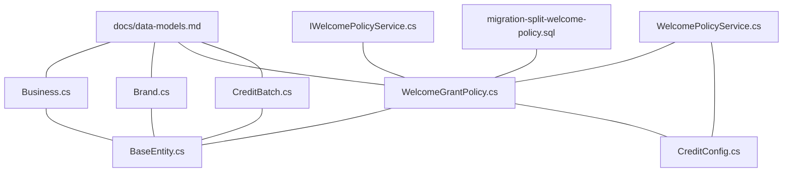
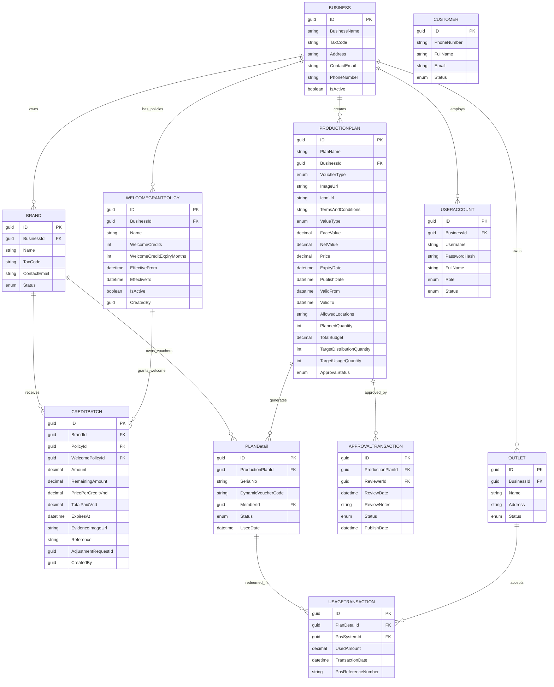
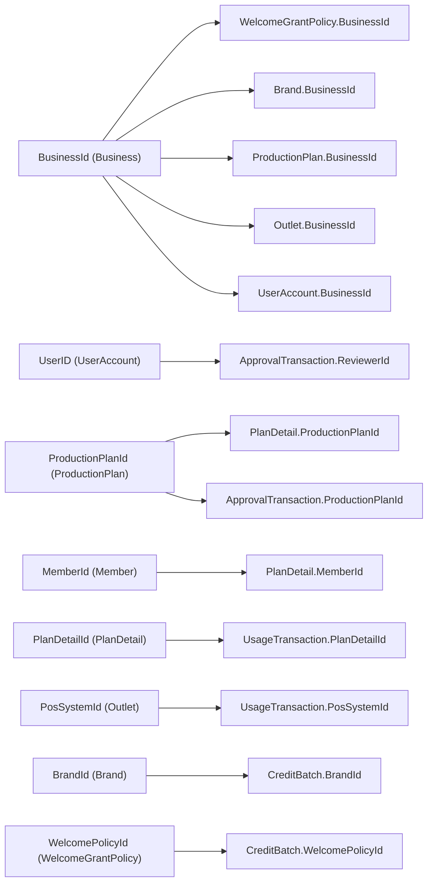

# Core Business Entities

<cite>
**Referenced Files in This Document**
- [data-models.md](file://docs/data-models.md)
- [Business.cs](file://src/NonCash.Core/Entities/Business.cs)
- [Brand.cs](file://src/NonCash.Core/Entities/Brand.cs)
- [WelcomeGrantPolicy.cs](file://src/NonCash.Core/Entities/WelcomeGrantPolicy.cs)
- [CreditBatch.cs](file://src/NonCash.Core/Entities/CreditBatch.cs)
- [CreditConfig.cs](file://src/NonCash.Core/Configuration/CreditConfig.cs)
- [IWelcomePolicyService.cs](file://src/NonCash.Core/Interfaces/IWelcomePolicyService.cs)
- [WelcomePolicyService.cs](file://src/NonCash.Infrastructure/Services/WelcomePolicyService.cs)
- [migration-split-welcome-policy.sql](file://tools/migration-split-welcome-policy.sql)
- [20260814050918_SplitWelcomePolicy.cs](file://src/NonCash.Infrastructure/Migrations/20260814050918_SplitWelcomePolicy.cs)
- [BaseEntity.cs](file://src/NonCash.Core/Entities/Base/BaseEntity.cs)
</cite>

## Update Summary
**Changes Made**
- Added new WelcomeGrantPolicy entity for business-scoped welcome credit policies
- Updated CreditBatch entity with welcome_policy_id foreign key relationship
- Enhanced Business entity with comprehensive tenant management capabilities
- Introduced time-based policy activation system with effective date ranges
- Migrated from brand-scoped to business-scoped welcome credit policies
- Added comprehensive policy resolution service with configuration fallback

## Table of Contents
1. [Introduction](#introduction)
2. [Project Structure](#project-structure)
3. [Core Components](#core-components)
4. [Architecture Overview](#architecture-overview)
5. [Detailed Component Analysis](#detailed-component-analysis)
6. [Dependency Analysis](#dependency-analysis)
7. [Performance Considerations](#performance-considerations)
8. [Troubleshooting Guide](#troubleshooting-guide)
9. [Conclusion](#conclusion)
10. [Appendices](#appendices)

## Introduction
This document defines the core business entities that underpin the NonCash platform's enhanced voucher lifecycle and tenant-aware operations. The platform now features an improved production planning model with detailed approval workflows, comprehensive member-based voucher management, and sophisticated welcome credit policy management. The core entities include:

- **Business** (Multi-tenant organization)
- **Brand** (Organization within a business)
- **WelcomeGrantPolicy** (Business-scoped welcome credit policies)
- **CreditBatch** (Prepaid credit batches with policy tracking)
- **ProductionPlan** (Enhanced Production Planning)
- **PlanDetail** (Individual Voucher Records)
- **ApprovalTransaction** (Approval workflow tracking)
- **UsageTransaction** (POS redemption tracking)
- **Outlet** (POS locations)
- **UserAccount** (back-office users)
- **Customer** (end-users)

These entities document field definitions, data types, primary keys, foreign key relationships, business constraints, and validation rules derived from the repository's enhanced data model and functional specifications.

## Project Structure
The enhanced data model and business context are documented across multiple files:

- **docs/data-models.md**: Defines the core entities and their attributes
- **src/NonCash.Core/Entities/**: Contains all entity definitions with navigation properties
- **src/NonCash.Core/Configuration/**: Configuration classes including CreditConfig
- **src/NonCash.Core/Interfaces/**: Service interfaces including IWelcomePolicyService
- **src/NonCash.Infrastructure/Services/**: Service implementations including WelcomePolicyService
- **tools/**: Database migration scripts including welcome policy migration
- **src/NonCash.Infrastructure/Migrations/**: Entity Framework migrations

```mermaid
graph TB
DM["docs/data-models.md"]
BE["Business.cs"]
BR["Brand.cs"]
WGP["WelcomeGrantPolicy.cs"]
CB["CreditBatch.cs"]
CC["CreditConfig.cs"]
IWS["IWelcomePolicyService.cs"]
WPS["WelcomePolicyService.cs"]
MIG["migration-split-welcome-policy.sql"]
BASE["BaseEntity.cs"]
DM --- BE
DM --- BR
DM --- WGP
DM --- CB
BE --- BASE
BR --- BASE
WGP --- BASE
CB --- BASE
WGP --- CC
IWS --- WGP
WPS --- WGP
WPS --- CC
MIG --- WGP
```

**Diagram sources**
- [data-models.md:1-113](file://docs/data-models.md#L1-L113)
- [Business.cs:1-18](file://src/NonCash.Core/Entities/Business.cs#L1-L18)
- [Brand.cs:1-19](file://src/NonCash.Core/Entities/Brand.cs#L1-L19)
- [WelcomeGrantPolicy.cs:1-37](file://src/NonCash.Core/Entities/WelcomeGrantPolicy.cs#L1-L37)
- [CreditBatch.cs:55-74](file://src/NonCash.Core/Entities/CreditBatch.cs#L55-L74)
- [CreditConfig.cs:1-35](file://src/NonCash.Core/Configuration/CreditConfig.cs#L1-L35)
- [IWelcomePolicyService.cs:1-37](file://src/NonCash.Core/Interfaces/IWelcomePolicyService.cs#L1-L37)
- [WelcomePolicyService.cs:1-75](file://src/NonCash.Infrastructure/Services/WelcomePolicyService.cs#L1-L75)
- [migration-split-welcome-policy.sql:1-62](file://tools/migration-split-welcome-policy.sql#L1-L62)

**Section sources**
- [data-models.md:1-113](file://docs/data-models.md#L1-L113)
- [Business.cs:1-18](file://src/NonCash.Core/Entities/Business.cs#L1-L18)
- [Brand.cs:1-19](file://src/NonCash.Core/Entities/Brand.cs#L1-L19)
- [WelcomeGrantPolicy.cs:1-37](file://src/NonCash.Core/Entities/WelcomeGrantPolicy.cs#L1-L37)
- [CreditBatch.cs:55-74](file://src/NonCash.Core/Entities/CreditBatch.cs#L55-L74)
- [CreditConfig.cs:1-35](file://src/NonCash.Core/Configuration/CreditConfig.cs#L1-L35)
- [IWelcomePolicyService.cs:1-37](file://src/NonCash.Core/Interfaces/IWelcomePolicyService.cs#L1-L37)
- [WelcomePolicyService.cs:1-75](file://src/NonCash.Infrastructure/Services/WelcomePolicyService.cs#L1-L75)
- [migration-split-welcome-policy.sql:1-62](file://tools/migration-split-welcome-policy.sql#L1-L62)

## Core Components
This section summarizes each entity's purpose, attributes, and constraints as defined in the enhanced repository materials.

### Welcome Grant Policy System

**WelcomeGrantPolicy** (Business-Scoped Welcome Credit Policies)
- **Purpose**: Versioned, time-bound welcome-grant policy attached to a Business for managing welcome credits for new brands
- **Primary Key**: Id (GUID)
- **Foreign Key**: BusinessId (Business)
- **Attributes and Types**: Name (String), BusinessId (GUID), WelcomeCredits (Integer), WelcomeCreditExpiryMonths (Integer?), EffectiveFrom (DateTime), EffectiveTo (DateTime?), IsActive (Boolean), CreatedBy (GUID?)
- **Business Constraints**:
  - Time-based activation with EffectiveFrom and EffectiveTo date ranges
  - Business-scoped policies apply uniformly to all brands under a business
  - Most recent active policy takes precedence based on EffectiveFrom ordering
  - Fallback to CreditConfig defaults when no matching policy exists
  - Supports versioning through multiple policy records per business

**Updated** New entity introduced to replace brand-scoped welcome credits with business-scoped approach

Validation Rules:
- BusinessId must reference an existing Business
- WelcomeCredits must be non-negative integer
- WelcomeCreditExpiryMonths must be positive or null (never expires)
- EffectiveFrom must be before EffectiveTo (when both provided)
- IsActive controls policy availability
- EffectiveFrom defaults to current UTC time

Sample Data Example:
- Id: [GUID]
- Name: "[Policy Name]"
- BusinessId: [GUID]
- WelcomeCredits: [Integer]
- WelcomeCreditExpiryMonths: [Integer or null]
- EffectiveFrom: [DateTime]
- EffectiveTo: [DateTime or null]
- IsActive: true or false
- CreatedBy: [GUID or null]

**Section sources**
- [WelcomeGrantPolicy.cs:11-36](file://src/NonCash.Core/Entities/WelcomeGrantPolicy.cs#L11-L36)

**ResolvedWelcomePolicy** (Policy Resolution Result)
- **Purpose**: Resolved welcome policy values after applying business policy → CreditConfig fallback logic
- **Type**: Record with PolicyId, Name, WelcomeCredits, WelcomeCreditExpiryMonths
- **Business Logic**: Represents the effective policy values for a business at a given time

**New Type** Added to encapsulate resolved policy values for consumption

**Section sources**
- [IWelcomePolicyService.cs:28-37](file://src/NonCash.Core/Interfaces/IWelcomePolicyService.cs#L28-L37)

### Enhanced Business Management

**Business** (Multi-Tenant Organization)
- **Purpose**: Enhanced tenant representation with comprehensive business information and brand management
- **Primary Key**: Id (GUID)
- **Attributes and Types**: BusinessName (String), TaxCode (String), Address (String), ContactEmail (String?), PhoneNumber (String?), IsActive (Boolean)
- **Navigation Properties**: Brands (ICollection<Brand>)
- **Business Constraints**:
  - Controls tenant activation and deactivation via IsActive flag
  - Supports multi-tenant isolation and resource management
  - Provides business contact and identification information
  - Serves as parent entity for Brand hierarchy

**Updated** Enhanced from original Business entity with comprehensive business information fields

Validation Rules:
- BusinessName must be non-empty
- TaxCode must be unique per tenant
- IsActive must be boolean value
- Email format validation (when provided)

Sample Data Example:
- Id: [GUID]
- BusinessName: "[Business Name]"
- TaxCode: "[Tax Identifier]"
- Address: "[Business Address]"
- ContactEmail: "[Email Address]"
- PhoneNumber: "[Phone Number]"
- IsActive: true or false

**Section sources**
- [Business.cs:6-16](file://src/NonCash.Core/Entities/Business.cs#L6-L16)

**Brand** (Organization within Business)
- **Purpose**: Individual organizations within a business that receive welcome credits based on business policies
- **Primary Key**: Id (GUID)
- **Foreign Key**: BusinessId (Business)
- **Attributes and Types**: Name (String), TaxCode (String), ContactEmail (String?), Status (Enum: PendingActivation, Active, Suspended)
- **Navigation Properties**: Business (Business)
- **Business Constraints**:
  - Belongs to a parent Business entity
  - Status governs activation state
  - Receives welcome credits based on business-level policies

**Updated** Enhanced from Brand entity with business relationship and status management

Validation Rules:
- BusinessId must reference an existing Business
- TaxCode must be unique within business scope
- Status must be PendingActivation, Active, or Suspended

Sample Data Example:
- Id: [GUID]
- BusinessId: [GUID]
- Name: "[Brand Name]"
- TaxCode: "[Tax Code]"
- ContactEmail: "[Email Address]"
- Status: PendingActivation or Active or Suspended

**Section sources**
- [Brand.cs:10-19](file://src/NonCash.Core/Entities/Brand.cs#L10-L19)

### Enhanced Credit Management

**CreditBatch** (Prepaid Credit Batches)
- **Purpose**: Prepaid credit batches with support for welcome grants and pricing policies
- **Primary Key**: Id (GUID)
- **Foreign Keys**: BrandId (Brand), PolicyId (CreditPricingPolicy), WelcomePolicyId (WelcomeGrantPolicy), AdjustmentRequestId (CreditAdjustmentRequest)
- **Attributes and Types**: Amount (Decimal), RemainingAmount (Decimal), PricePerCreditVnd (Decimal), TotalPaidVnd (Decimal), ExpiresAt (DateTime?), EvidenceImageUrl (String?), Reference (String?), CreatedBy (GUID?)
- **Navigation Properties**: Brand (Brand), Policy (CreditPricingPolicy), WelcomePolicy (WelcomeGrantPolicy), AdjustmentRequest (CreditAdjustmentRequest)
- **Business Constraints**:
  - Links to either pricing policy or welcome policy (or both)
  - Supports idempotent welcome grants per brand
  - Tracks expiration dates for credit usage
  - Maintains audit trail through CreatedBy field

**Updated** Enhanced with WelcomePolicyId foreign key for welcome grant tracking

Validation Rules:
- BrandId must reference an existing Brand
- Amount must be positive
- RemainingAmount ≤ Amount
- ExpiresAt must be after creation date (when provided)
- WelcomePolicyId must reference an existing WelcomeGrantPolicy (when set)

Sample Data Example:
- Id: [GUID]
- BrandId: [GUID]
- PolicyId: [GUID or null]
- WelcomePolicyId: [GUID or null]
- Amount: [Decimal]
- RemainingAmount: [Decimal]
- PricePerCreditVnd: [Decimal]
- TotalPaidVnd: [Decimal]
- ExpiresAt: [DateTime or null]
- CreatedBy: [GUID or null]

**Section sources**
- [CreditBatch.cs:55-74](file://src/NonCash.Core/Entities/CreditBatch.cs#L55-L74)

**CreditConfig** (Configuration Defaults)
- **Purpose**: Application configuration providing default values when no database policies exist
- **Attributes and Types**: WelcomeCredits (Integer = 500), LowBalanceWarningPercent (Integer = 20), PricePerCreditVnd (Decimal = 5000m), CreditExpiryMonths (Integer? = 12), WelcomeCreditExpiryMonths (Integer? = 12), ExpiryWarningDays (Integer? = 30), AdjustmentApprovalThreshold (Integer? = 1000)
- **Business Logic**: Serves as fallback when no database policy matches for welcome credits

**Updated** Enhanced to serve as fallback for welcome credit policies

Validation Rules:
- WelcomeCredits must be non-negative
- All numeric values must be valid ranges
- Percentage values must be between 0-100

Sample Data Example:
- WelcomeCredits: 500
- LowBalanceWarningPercent: 20
- PricePerCreditVnd: 5000m
- CreditExpiryMonths: 12
- WelcomeCreditExpiryMonths: 12
- ExpiryWarningDays: 30
- AdjustmentApprovalThreshold: 1000

**Section sources**
- [CreditConfig.cs:7-35](file://src/NonCash.Core/Configuration/CreditConfig.cs#L7-L35)

### Core Business Entities

**ProductionPlan** (Enhanced Production Planning)
- **Purpose**: Comprehensive voucher production planning with approval workflows and detailed campaign management
- **Primary Key**: ID (GUID)
- **Foreign Key**: BusinessId (Business)
- **Attributes and Types**: PlanName (String), BusinessId (GUID), VoucherType (Enum), ImageUrl/IconUrl (String), TermsAndConditions (String), ValueType (Enum), FaceValue/NetValue/Price (Decimal), ExpiryDate/PublishDate/ValidFrom/ValidTo (DateTime?), AllowedLocations (String), PlannedQuantity (Integer), TotalBudget (Decimal), TargetDistributionQuantity/TargetUsageQuantity (Integer), ApprovalStatus (Enum)
- **Business Constraints**:
  - ApprovalStatus governs lifecycle transitions (Pending → Approved/Rejected)
  - PublishDate controls availability; ExpiryDate enforces hard expiry
  - Budget and quantity targets support financial planning
  - Navigation properties link to PlanDetail and ApprovalTransaction collections

**Updated** Enhanced from VoucherPlanHeader with comprehensive approval workflow and detailed operational fields

Validation Rules:
- BusinessId must reference an existing Business
- FaceValue ≥ 0, NetValue ≥ 0, Price ≥ 0
- ExpiryDate ≥ PublishDate (when both provided)
- ValidFrom ≤ ValidTo (when both provided)
- PlannedQuantity ≥ 0
- TotalBudget ≥ 0
- TargetDistributionQuantity ≥ 0
- TargetUsageQuantity ≥ 0

Sample Data Example:
- ID: [GUID]
- PlanName: "[Campaign Name]"
- BusinessId: [GUID]
- VoucherType: Complimentary or Gift
- ValueType: Value or Percentage
- FaceValue: [Decimal]
- NetValue: [Decimal]
- Price: [Decimal]
- ExpiryDate: [DateTime or null]
- PublishDate: [DateTime or null]
- ValidFrom: [DateTime or null]
- ValidTo: [DateTime or null]
- AllowedLocations: "[JSON/CSV string]"
- PlannedQuantity: [Integer]
- TotalBudget: [Decimal]
- TargetDistributionQuantity: [Integer]
- TargetUsageQuantity: [Integer]
- ApprovalStatus: Pending or Approved or Rejected

**Section sources**
- [ProductionPlan.cs:8-68](file://src/NonCash.Core/Entities/ProductionPlan.cs#L8-L68)

**PlanDetail** (Individual Voucher Records)
- **Purpose**: Detailed individual voucher instance with comprehensive status tracking and member ownership
- **Primary Key**: ID (GUID)
- **Foreign Keys**: ProductionPlanId (ProductionPlan), MemberId (Member)
- **Attributes and Types**: SerialNo (String), DynamicVoucherCode (String), MemberId (GUID?), Status (Enum), UsedDate (DateTime?)
- **Business Constraints**:
  - Status drives lifecycle (Pending → In-Use → Complete)
  - MemberId links ownership to either Customer or Organization members
  - DynamicVoucherCode enables secure redemption with flexible encoding

**Updated** Enhanced from VoucherPlanDetail with improved status tracking and member ownership

Validation Rules:
- ProductionPlanId must reference an existing ProductionPlan
- MemberId must reference an existing Member (when assigned)
- Status must be Pending/In-Use/Complete
- UsedDate must be present when Status is Complete
- SerialNo must be unique within ProductionPlan scope

Sample Data Example:
- ID: [GUID]
- ProductionPlanId: [GUID]
- SerialNo: "[Unique String]"
- DynamicVoucherCode: "[Dynamic Code]"
- MemberId: [GUID or null]
- Status: Pending or In-Use or Complete
- UsedDate: [DateTime or null]

**Section sources**
- [PlanDetail.cs:7-27](file://src/NonCash.Core/Entities/PlanDetail.cs#L7-L27)

**ApprovalTransaction** (Approval Workflow Tracking)
- **Purpose**: Detailed audit trail of approval decisions and reviewer actions
- **Primary Key**: ID (GUID)
- **Foreign Keys**: ProductionPlanId (ProductionPlan), ReviewerId (UserAccount)
- **Attributes and Types**: ReviewerId (GUID), ReviewDate (DateTime), ReviewNotes (String), Status (Enum), PublishDate (DateTime?)
- **Business Constraints**:
  - Maintains historical record of all approval decisions
  - Supports traceability for rejected plans requiring resubmission
  - Enables audit trail for compliance and reporting

**New Entity** Added to track detailed approval workflows and decision history

Validation Rules:
- ProductionPlanId must reference an existing ProductionPlan
- ReviewerId must reference an existing UserAccount
- ReviewDate defaults to current UTC time
- Status must be Pending/Approved/Rejected
- PublishDate can only be set for Approved statuses

Sample Data Example:
- ID: [GUID]
- ProductionPlanId: [GUID]
- ReviewerId: [GUID]
- ReviewDate: [DateTime]
- ReviewNotes: "[Reviewer comments]"
- Status: Pending or Approved or Rejected
- PublishDate: [DateTime or null]

**Section sources**
- [ApprovalTransaction.cs:7-22](file://src/NonCash.Core/Entities/ApprovalTransaction.cs#L7-L22)

**UsageTransaction** (POS Redemption Tracking)
- **Purpose**: Comprehensive POS transaction logging for redemption monitoring
- **Primary Key**: ID (GUID)
- **Foreign Keys**: PlanDetailId (PlanDetail), PosSystemId (Outlet)
- **Attributes and Types**: PlanDetailId (GUID), PosSystemId (GUID), UsedAmount (Decimal), TransactionDate (DateTime), PosReferenceNumber (String)
- **Business Constraints**:
  - Links POS transactions to specific voucher instances
  - Supports reconciliation and audit requirements
  - Enables real-time redemption monitoring

**New Entity** Added to track detailed POS redemption activities

Validation Rules:
- PlanDetailId must reference an existing PlanDetail
- PosSystemId must reference an existing Outlet
- UsedAmount must be positive and ≤ PlanDetail.FaceValue
- TransactionDate defaults to current UTC time
- PosReferenceNumber must be unique per transaction

Sample Data Example:
- ID: [GUID]
- PlanDetailId: [GUID]
- PosSystemId: [GUID]
- UsedAmount: [Decimal]
- TransactionDate: [DateTime]
- PosReferenceNumber: "[POS Reference]"

**Section sources**
- [UsageTransaction.cs:6-20](file://src/NonCash.Core/Entities/UsageTransaction.cs#L6-L20)

**Outlet** (Point of Sale / Store)
- **Purpose**: Physical or digital store under a Business eligible to accept vouchers
- **Primary Key**: ID (GUID)
- **Foreign Key**: BusinessId (Business)
- **Attributes and Types**: Name (String), Address (String), Status (Enum)
- **Business Constraints**:
  - Status governs Active/Closed state
  - AllowedLocations in ProductionPlan references Outlet IDs for usage restrictions

**Updated** Enhanced from Outlet with improved business association

Validation Rules:
- BusinessId must reference an existing Business
- Status must be Active or Closed
- Name must be non-empty

Sample Data Example:
- ID: [GUID]
- BusinessId: [GUID]
- Name: "[Store Name]"
- Address: "[Full Address]"
- Status: Active or Closed

**Section sources**
- [data-models.md:73-79](file://docs/data-models.md#L73-L79)

**UserAccount** (Back-office Users)
- **Purpose**: Platform users with roles for planning, reviewing, and approving production plans
- **Primary Key**: ID (GUID)
- **Foreign Key**: BusinessId (Business), nullable for system super-admins
- **Attributes and Types**: Username (String), PasswordHash (String), FullName (String), Role (Enum), Status (Enum)
- **Business Constraints**:
  - Role determines access rights (Admin/Planner/Approver)
  - BusinessId scopes users to a tenant (nullable for system-wide roles)

**Updated** Enhanced from UserAccount with improved business scoping

Validation Rules:
- Role must be Admin/Planner/Approver
- Status must be Active/Locked
- Username must be unique
- BusinessId can be null for system administrators

Sample Data Example:
- ID: [GUID]
- BusinessId: [GUID or null]
- Username: "[Unique Username]"
- PasswordHash: "[Hashed Value]"
- FullName: "[Full Name]"
- Role: Admin or Planner or Approver
- Status: Active or Locked

**Section sources**
- [data-models.md:81-89](file://docs/data-models.md#L81-L89)

**Customer** (End-User / App Member)
- **Purpose**: Individual end-users who receive and redeem vouchers
- **Primary Key**: ID (GUID)
- **Attributes and Types**: PhoneNumber (String), FullName (String), Email (String), Status (Enum)
- **Business Constraints**:
  - PhoneNumber is the primary identifier for transfers/logins
  - Status governs Active/Blacklisted state

**Updated** Enhanced from Customer with improved status management

Validation Rules:
- PhoneNumber must be unique
- Status must be Active or Blacklisted

Sample Data Example:
- ID: [GUID]
- PhoneNumber: "[Phone Number]"
- FullName: "[Full Name]"
- Email: "[Email Address]"
- Status: Active or Blacklisted

**Section sources**
- [data-models.md:91-97](file://docs/data-models.md#L91-L97)

## Architecture Overview
The enhanced entities form a comprehensive domain model supporting advanced multi-tenancy, detailed approval workflows, comprehensive voucher lifecycle management, and sophisticated welcome credit policy management.

```mermaid
erDiagram
BUSINESS {
guid ID PK
string BusinessName
string TaxCode
string Address
string ContactEmail
string PhoneNumber
boolean IsActive
}
BRAND {
guid ID PK
guid BusinessId FK
string Name
string TaxCode
string ContactEmail
enum Status
}
WELCOMEGRANTPOLICY {
guid ID PK
guid BusinessId FK
string Name
int WelcomeCredits
int WelcomeCreditExpiryMonths
datetime EffectiveFrom
datetime EffectiveTo
boolean IsActive
guid CreatedBy
}
CREDITBATCH {
guid ID PK
guid BrandId FK
guid PolicyId FK
guid WelcomePolicyId FK
decimal Amount
decimal RemainingAmount
decimal PricePerCreditVnd
decimal TotalPaidVnd
datetime ExpiresAt
string EvidenceImageUrl
string Reference
guid AdjustmentRequestId
guid CreatedBy
}
PRODUCTIONPLAN {
guid ID PK
string PlanName
guid BusinessId FK
enum VoucherType
string ImageUrl
string IconUrl
string TermsAndConditions
enum ValueType
decimal FaceValue
decimal NetValue
decimal Price
datetime ExpiryDate
datetime PublishDate
datetime ValidFrom
datetime ValidTo
string AllowedLocations
int PlannedQuantity
decimal TotalBudget
int TargetDistributionQuantity
int TargetUsageQuantity
enum ApprovalStatus
}
PLANDetail {
guid ID PK
guid ProductionPlanId FK
string SerialNo
string DynamicVoucherCode
guid MemberId FK
enum Status
datetime UsedDate
}
APPROVALTRANSACTION {
guid ID PK
guid ProductionPlanId FK
guid ReviewerId FK
datetime ReviewDate
string ReviewNotes
enum Status
datetime PublishDate
}
USAGETRANSACTION {
guid ID PK
guid PlanDetailId FK
guid PosSystemId FK
decimal UsedAmount
datetime TransactionDate
string PosReferenceNumber
}
OUTLET {
guid ID PK
guid BusinessId FK
string Name
string Address
enum Status
}
USERACCOUNT {
guid ID PK
guid BusinessId FK
string Username
string PasswordHash
string FullName
enum Role
enum Status
}
CUSTOMER {
guid ID PK
string PhoneNumber
string FullName
string Email
enum Status
}
BUSINESS ||--o{ BRAND : "owns"
BUSINESS ||--o{ WELCOMEGRANTPOLICY : "has_policies"
BUSINESS ||--o{ PRODUCTIONPLAN : "creates"
BUSINESS ||--o{ OUTLET : "owns"
BUSINESS ||--o{ USERACCOUNT : "employs"
BRAND ||--o{ CREDITBATCH : "receives"
BRAND ||--o{ PLANDetail : "owns_vouchers"
WELCOMEGRANTPOLICY ||--o{ CREDITBATCH : "grants_welcome"
PRODUCTIONPLAN ||--o{ PLANDetail : "generates"
PRODUCTIONPLAN ||--o{ APPROVALTRANSACTION : "approved_by"
PLANDetail ||--o{ USAGETRANSACTION : "redeemed_in"
OUTLET ||--o{ USAGETRANSACTION : "accepts"
```

**Diagram sources**
- [Business.cs:6-16](file://src/NonCash.Core/Entities/Business.cs#L6-L16)
- [Brand.cs:10-19](file://src/NonCash.Core/Entities/Brand.cs#L10-L19)
- [WelcomeGrantPolicy.cs:11-36](file://src/NonCash.Core/Entities/WelcomeGrantPolicy.cs#L11-L36)
- [CreditBatch.cs:55-74](file://src/NonCash.Core/Entities/CreditBatch.cs#L55-L74)
- [ProductionPlan.cs:8-68](file://src/NonCash.Core/Entities/ProductionPlan.cs#L8-L68)
- [PlanDetail.cs:7-27](file://src/NonCash.Core/Entities/PlanDetail.cs#L7-L27)
- [ApprovalTransaction.cs:7-22](file://src/NonCash.Core/Entities/ApprovalTransaction.cs#L7-L22)
- [UsageTransaction.cs:6-20](file://src/NonCash.Core/Entities/UsageTransaction.cs#L6-L20)

## Detailed Component Analysis

### Welcome Grant Policy System

#### WelcomeGrantPolicy (Business-Scoped Welcome Credit Policies)
- **Purpose**: Versioned, time-bound welcome-grant policy attached to a Business for managing welcome credits for new brands
- **Key Fields**:
  - Id (Primary Key)
  - BusinessId (Foreign Key to Business)
  - Name (Policy description)
  - WelcomeCredits (Free credits granted to each new brand)
  - WelcomeCreditExpiryMonths (Months until welcome batch expires)
  - EffectiveFrom/EffectiveTo (Time-based activation)
  - IsActive (Policy availability flag)
  - CreatedBy (Admin who created the policy)
- **Business Logic**:
  - Business-scoped policies apply uniformly to all brands under a business
  - Time-based activation with effective date ranges
  - Most recent active policy takes precedence based on EffectiveFrom ordering
  - Fallback to CreditConfig defaults when no matching policy exists
  - Supports versioning through multiple policy records per business

**Updated** New entity introduced to replace brand-scoped welcome credits with business-scoped approach

Validation Rules:
- BusinessId must reference an existing Business
- WelcomeCredits must be non-negative integer
- WelcomeCreditExpiryMonths must be positive or null (never expires)
- EffectiveFrom must be before EffectiveTo (when both provided)
- IsActive controls policy availability
- EffectiveFrom defaults to current UTC time

Sample Data Example:
- Id: [GUID]
- Name: "[Policy Name]"
- BusinessId: [GUID]
- WelcomeCredits: [Integer]
- WelcomeCreditExpiryMonths: [Integer or null]
- EffectiveFrom: [DateTime]
- EffectiveTo: [DateTime or null]
- IsActive: true or false
- CreatedBy: [GUID or null]

**Section sources**
- [WelcomeGrantPolicy.cs:11-36](file://src/NonCash.Core/Entities/WelcomeGrantPolicy.cs#L11-L36)

#### WelcomePolicyService (Policy Resolution and Management)
- **Purpose**: Service layer for welcome policy management and resolution logic
- **Methods**: ResolveForBusinessAsync, GetPoliciesAsync, GetPolicyAsync, CreatePolicyAsync, UpdatePolicyAsync, DeactivatePolicyAsync
- **Business Logic**:
  - Resolves most recent active, in-effect policy for a business
  - Falls back to CreditConfig defaults when no DB policy matches
  - Supports CRUD operations for policy management
  - Handles time-based policy activation and deactivation

**New Service** Added to manage welcome policy lifecycle and resolution

Validation Rules:
- Policy resolution follows business policy → CreditConfig fallback pattern
- Time-based queries use EffectiveFrom and EffectiveTo for filtering
- Most recent policy wins based on EffectiveFrom ordering

**Section sources**
- [IWelcomePolicyService.cs:12-37](file://src/NonCash.Core/Interfaces/IWelcomePolicyService.cs#L12-L37)
- [WelcomePolicyService.cs:14-75](file://src/NonCash.Infrastructure/Services/WelcomePolicyService.cs#L14-L75)

### Enhanced Business Management

#### Business (Enhanced Multi-Tenant Organization)
- **Purpose**: Comprehensive tenant representation with business information management and brand hierarchy
- **Key Fields**:
  - Id (Primary Key)
  - BusinessName, TaxCode, Address
  - ContactEmail, PhoneNumber
  - IsActive (Boolean flag)
- **Navigation Properties**: Brands (ICollection<Brand>)
- **Business Logic**:
  - Controls tenant activation and deactivation
  - Supports multi-tenant isolation and resource management
  - Provides business contact and identification information
  - Serves as parent entity for brand hierarchy

**Updated** Enhanced from original Business entity with comprehensive business information fields

Validation Rules:
- BusinessName must be non-empty
- TaxCode must be unique per tenant
- IsActive must be boolean value
- Email format validation (when provided)

Sample Data Example:
- Id: [GUID]
- BusinessName: "[Business Name]"
- TaxCode: "[Tax Identifier]"
- Address: "[Business Address]"
- ContactEmail: "[Email Address]"
- PhoneNumber: "[Phone Number]"
- IsActive: true or false

**Section sources**
- [Business.cs:6-16](file://src/NonCash.Core/Entities/Business.cs#L6-L16)

#### Brand (Organization within Business)
- **Purpose**: Individual organizations within a business that receive welcome credits based on business policies
- **Key Fields**:
  - Id (Primary Key)
  - BusinessId (Foreign Key to Business)
  - Name, TaxCode, ContactEmail
  - Status (Enum: PendingActivation, Active, Suspended)
- **Navigation Properties**: Business (Business)
- **Business Logic**:
  - Belongs to a parent Business entity
  - Status governs activation state
  - Receives welcome credits based on business-level policies

**Updated** Enhanced from Brand entity with business relationship and status management

Validation Rules:
- BusinessId must reference an existing Business
- TaxCode must be unique within business scope
- Status must be PendingActivation, Active, or Suspended

Sample Data Example:
- Id: [GUID]
- BusinessId: [GUID]
- Name: "[Brand Name]"
- TaxCode: "[Tax Code]"
- ContactEmail: "[Email Address]"
- Status: PendingActivation or Active or Suspended

**Section sources**
- [Brand.cs:10-19](file://src/NonCash.Core/Entities/Brand.cs#L10-L19)

### Enhanced Credit Management

#### CreditBatch (Prepaid Credit Batches)
- **Purpose**: Prepaid credit batches with support for welcome grants and pricing policies
- **Key Fields**:
  - Id (Primary Key)
  - BrandId (Foreign Key to Brand)
  - PolicyId (Foreign Key to CreditPricingPolicy)
  - WelcomePolicyId (Foreign Key to WelcomeGrantPolicy)
  - Amount, RemainingAmount, PricePerCreditVnd, TotalPaidVnd
  - ExpiresAt, EvidenceImageUrl, Reference
  - AdjustmentRequestId, CreatedBy
- **Navigation Properties**: Brand, Policy, WelcomePolicy, AdjustmentRequest
- **Business Logic**:
  - Links to either pricing policy or welcome policy (or both)
  - Supports idempotent welcome grants per brand
  - Tracks expiration dates for credit usage
  - Maintains audit trail through CreatedBy field

**Updated** Enhanced with WelcomePolicyId foreign key for welcome grant tracking

Validation Rules:
- BrandId must reference an existing Brand
- Amount must be positive
- RemainingAmount ≤ Amount
- ExpiresAt must be after creation date (when provided)
- WelcomePolicyId must reference an existing WelcomeGrantPolicy (when set)

Sample Data Example:
- Id: [GUID]
- BrandId: [GUID]
- PolicyId: [GUID or null]
- WelcomePolicyId: [GUID or null]
- Amount: [Decimal]
- RemainingAmount: [Decimal]
- PricePerCreditVnd: [Decimal]
- TotalPaidVnd: [Decimal]
- ExpiresAt: [DateTime or null]
- CreatedBy: [GUID or null]

**Section sources**
- [CreditBatch.cs:55-74](file://src/NonCash.Core/Entities/CreditBatch.cs#L55-L74)

#### CreditConfig (Configuration Defaults)
- **Purpose**: Application configuration providing default values when no database policies exist
- **Key Fields**: WelcomeCredits (500), LowBalanceWarningPercent (20), PricePerCreditVnd (5000m), CreditExpiryMonths (12), WelcomeCreditExpiryMonths (12), ExpiryWarningDays (30), AdjustmentApprovalThreshold (1000)
- **Business Logic**: Serves as fallback when no database policy matches for welcome credits

**Updated** Enhanced to serve as fallback for welcome credit policies

Validation Rules:
- WelcomeCredits must be non-negative
- All numeric values must be valid ranges
- Percentage values must be between 0-100

Sample Data Example:
- WelcomeCredits: 500
- LowBalanceWarningPercent: 20
- PricePerCreditVnd: 5000m
- CreditExpiryMonths: 12
- WelcomeCreditExpiryMonths: 12
- ExpiryWarningDays: 30
- AdjustmentApprovalThreshold: 1000

**Section sources**
- [CreditConfig.cs:7-35](file://src/NonCash.Core/Configuration/CreditConfig.cs#L7-L35)

### Core Business Entities

#### ProductionPlan (Enhanced Production Planning)
- **Purpose**: Comprehensive voucher production planning encompassing strategy, approval workflows, and operational details
- **Key Fields**:
  - ID (Primary Key)
  - BusinessId (Foreign Key to Business)
  - PlanName (Unique campaign identifier)
  - VoucherType (Enum: Complimentary, Gift)
  - ValueType (Enum: Value, Percentage)
  - FaceValue/NetValue/Price (Decimal values)
  - ExpiryDate/PublishDate/ValidFrom/ValidTo (DateTime ranges)
  - AllowedLocations (JSON/string containing outlet restrictions)
  - PlannedQuantity/TotalBudget (Integers/Decimals)
  - TargetDistributionQuantity/TargetUsageQuantity (Integers)
  - ApprovalStatus (Enum: Pending, Approved, Rejected)
- **Business Logic**:
  - Central hub for voucher campaign management
  - ApprovalStatus governs plan progression and distribution eligibility
  - Time-based constraints control campaign availability and validity
  - Financial targets support budget planning and ROI tracking
  - Navigation properties enable comprehensive reporting and audit trails

**Updated** Enhanced from VoucherPlanHeader with comprehensive approval workflow and detailed operational fields

Validation Rules:
- BusinessId must reference an existing Business
- FaceValue ≥ 0, NetValue ≥ 0, Price ≥ 0
- ExpiryDate ≥ PublishDate (when both provided)
- ValidFrom ≤ ValidTo (when both provided)
- PlannedQuantity ≥ 0
- TotalBudget ≥ 0
- TargetDistributionQuantity ≥ 0
- TargetUsageQuantity ≥ 0

Sample Data Example:
- ID: [GUID]
- PlanName: "[Campaign Name]"
- BusinessId: [GUID]
- VoucherType: Complimentary or Gift
- ValueType: Value or Percentage
- FaceValue: [Decimal]
- NetValue: [Decimal]
- Price: [Decimal]
- ExpiryDate: [DateTime or null]
- PublishDate: [DateTime or null]
- ValidFrom: [DateTime or null]
- ValidTo: [DateTime or null]
- AllowedLocations: "[JSON/CSV string]"
- PlannedQuantity: [Integer]
- TotalBudget: [Decimal]
- TargetDistributionQuantity: [Integer]
- TargetUsageQuantity: [Integer]
- ApprovalStatus: Pending or Approved or Rejected

**Section sources**
- [ProductionPlan.cs:8-68](file://src/NonCash.Core/Entities/ProductionPlan.cs#L8-L68)

#### PlanDetail (Individual Voucher Records)
- **Purpose**: Detailed individual voucher instance with comprehensive status tracking and member ownership
- **Key Fields**:
  - ID (Primary Key)
  - ProductionPlanId (Foreign Key to ProductionPlan)
  - SerialNo (Unique external identifier)
  - DynamicVoucherCode (Secure dynamic code for redemption)
  - MemberId (Foreign Key to Member, nullable)
  - Status (Enum: Pending, In-Use, Complete)
  - UsedDate (DateTime, nullable)
- **Business Logic**:
  - Lifecycle: Pending → In-Use → Complete based on Status
  - MemberId assignment enables ownership tracking for both customers and organizations
  - DynamicVoucherCode supports secure, time-limited redemption codes
  - Status changes trigger business rule validations and notifications

**Updated** Enhanced from VoucherPlanDetail with improved status tracking and member ownership

Validation Rules:
- ProductionPlanId must reference an existing ProductionPlan
- MemberId must reference an existing Member (when assigned)
- Status must be Pending/In-Use/Complete
- UsedDate must be present when Status is Complete
- SerialNo must be unique within ProductionPlan scope

Sample Data Example:
- ID: [GUID]
- ProductionPlanId: [GUID]
- SerialNo: "[Unique String]"
- DynamicVoucherCode: "[Dynamic Code]"
- MemberId: [GUID or null]
- Status: Pending or In-Use or Complete
- UsedDate: [DateTime or null]

**Section sources**
- [PlanDetail.cs:7-27](file://src/NonCash.Core/Entities/PlanDetail.cs#L7-L27)

#### ApprovalTransaction (Approval Workflow Tracking)
- **Purpose**: Comprehensive audit trail of approval decisions and reviewer actions
- **Key Fields**:
  - ID (Primary Key)
  - ProductionPlanId (Foreign Key to ProductionPlan)
  - ReviewerId (GUID)
  - ReviewDate (DateTime)
  - ReviewNotes (String)
  - Status (Enum: Pending, Approved, Rejected)
  - PublishDate (DateTime, nullable for adjustments)
- **Business Logic**:
  - Maintains immutable approval history for compliance
  - Supports traceability for rejected plans requiring resubmission
  - Enables audit trail for regulatory and internal reviews
  - Allows publish date adjustments for approved plans

**New Entity** Added to track detailed approval workflows and decision history

Validation Rules:
- ProductionPlanId must reference an existing ProductionPlan
- ReviewerId must reference an existing UserAccount
- ReviewDate defaults to current UTC time
- Status must be Pending/Approved/Rejected
- PublishDate can only be set for Approved statuses

Sample Data Example:
- ID: [GUID]
- ProductionPlanId: [GUID]
- ReviewerId: [GUID]
- ReviewDate: [DateTime]
- ReviewNotes: "[Reviewer comments]"
- Status: Pending or Approved or Rejected
- PublishDate: [DateTime or null]

**Section sources**
- [ApprovalTransaction.cs:7-22](file://src/NonCash.Core/Entities/ApprovalTransaction.cs#L7-L22)

#### UsageTransaction (POS Redemption Tracking)
- **Purpose**: Detailed POS transaction logging for comprehensive redemption monitoring
- **Key Fields**:
  - ID (Primary Key)
  - PlanDetailId (Foreign Key to PlanDetail)
  - PosSystemId (GUID)
  - UsedAmount (Decimal)
  - TransactionDate (DateTime)
  - PosReferenceNumber (String)
- **Business Logic**:
  - Links POS transactions to specific voucher instances
  - Supports reconciliation and audit requirements
  - Enables real-time redemption monitoring and reporting
  - Provides POS system integration points

**New Entity** Added to track detailed POS redemption activities

Validation Rules:
- PlanDetailId must reference an existing PlanDetail
- PosSystemId must reference an existing Outlet
- UsedAmount must be positive and ≤ PlanDetail.FaceValue
- TransactionDate defaults to current UTC time
- PosReferenceNumber must be unique per transaction

Sample Data Example:
- ID: [GUID]
- PlanDetailId: [GUID]
- PosSystemId: [GUID]
- UsedAmount: [Decimal]
- TransactionDate: [DateTime]
- PosReferenceNumber: "[POS Reference]"

**Section sources**
- [UsageTransaction.cs:6-20](file://src/NonCash.Core/Entities/UsageTransaction.cs#L6-L20)

#### Outlet (Enhanced POS Locations)
- **Purpose**: Physical or digital store under a Business eligible to accept vouchers
- **Key Fields**:
  - ID (Primary Key)
  - BusinessId (Foreign Key to Business)
  - Name, Address
  - Status (Enum)
- **Business Logic**:
  - Status governs Active/Closed state
  - AllowedLocations in ProductionPlan references Outlet IDs for usage restrictions
  - Supports geographic and operational store management

**Updated** Enhanced from Outlet with improved business association

Validation Rules:
- BusinessId must reference an existing Business
- Status must be Active or Closed
- Name must be non-empty

Sample Data Example:
- ID: [GUID]
- BusinessId: [GUID]
- Name: "[Store Name]"
- Address: "[Full Address]"
- Status: Active or Closed

**Section sources**
- [data-models.md:73-79](file://docs/data-models.md#L73-L79)

#### UserAccount (Enhanced Back-Office Users)
- **Purpose**: Platform users with enhanced roles for planning, reviewing, and approving production plans
- **Key Fields**:
  - ID (Primary Key)
  - BusinessId (Foreign Key to Business, nullable)
  - Username, PasswordHash, FullName
  - Role (Enum), Status (Enum)
- **Business Logic**:
  - Role determines access rights (Admin/Planner/Approver)
  - BusinessId scopes users to a tenant (nullable for system-wide roles)
  - Enhanced security with password hashing and role-based access control

**Updated** Enhanced from UserAccount with improved business scoping

Validation Rules:
- Role must be Admin/Planner/Approver
- Status must be Active/Locked
- Username must be unique
- BusinessId can be null for system administrators

Sample Data Example:
- ID: [GUID]
- BusinessId: [GUID or null]
- Username: "[Unique Username]"
- PasswordHash: "[Hashed Value]"
- FullName: "[Full Name]"
- Role: Admin or Planner or Approver
- Status: Active or Locked

**Section sources**
- [data-models.md:81-89](file://docs/data-models.md#L81-L89)

#### Customer (Enhanced End-Users)
- **Purpose**: Individual end-users who receive and redeem vouchers
- **Key Fields**:
  - ID (Primary Key)
  - PhoneNumber (Primary identifier), FullName, Email
  - Status (Enum)
- **Business Logic**:
  - PhoneNumber is the primary identifier for transfers and logins
  - Status governs Active/Blacklisted state
  - Supports individual customer management and communication

**Updated** Enhanced from Customer with improved status management

Validation Rules:
- PhoneNumber must be unique
- Status must be Active or Blacklisted

Sample Data Example:
- ID: [GUID]
- PhoneNumber: "[Phone Number]"
- FullName: "[Full Name]"
- Email: "[Email Address]"
- Status: Active or Blacklisted

**Section sources**
- [data-models.md:91-97](file://docs/data-models.md#L91-L97)

## Dependency Analysis
Enhanced entity relationships and comprehensive referential integrity constraints including the new welcome policy system:

```mermaid
graph LR
BusinessId["BusinessId (Business)"] --> WelcomePolicyBusiness["WelcomeGrantPolicy.BusinessId"]
BusinessId --> BrandBusiness["Brand.BusinessId"]
BusinessId --> ProductionPlanBusiness["ProductionPlan.BusinessId"]
BusinessId --> OutletBusiness["Outlet.BusinessId"]
BusinessId --> UserAccountBusiness["UserAccount.BusinessId"]
UserID["UserID (UserAccount)"] --> ApprovalTransactionReviewer["ApprovalTransaction.ReviewerId"]
ProductionPlanId["ProductionPlanId (ProductionPlan)"] --> PlanDetailProductionPlan["PlanDetail.ProductionPlanId"]
ProductionPlanId --> ApprovalTransactionProductionPlan["ApprovalTransaction.ProductionPlanId"]
MemberId["MemberId (Member)"] --> PlanDetailMember["PlanDetail.MemberId"]
PlanDetailId["PlanDetailId (PlanDetail)"] --> UsageTransactionPlanDetail["UsageTransaction.PlanDetailId"]
PosSystemId["PosSystemId (Outlet)"] --> UsageTransactionPosSystem["UsageTransaction.PosSystemId"]
BrandId["BrandId (Brand)"] --> CreditBatchBrand["CreditBatch.BrandId"]
WelcomePolicyId["WelcomePolicyId (WelcomeGrantPolicy)"] --> CreditBatchWelcome["CreditBatch.WelcomePolicyId"]
```

**Updated** Enhanced dependency graph to include new welcome policy entities and relationships

**Diagram sources**
- [WelcomeGrantPolicy.cs:15-16](file://src/NonCash.Core/Entities/WelcomeGrantPolicy.cs#L15-L16)
- [Brand.cs:12-13](file://src/NonCash.Core/Entities/Brand.cs#L12-L13)
- [ProductionPlan.cs:14-15](file://src/NonCash.Core/Entities/ProductionPlan.cs#L14-L15)
- [PlanDetail.cs:10-21](file://src/NonCash.Core/Entities/PlanDetail.cs#L10-L21)
- [ApprovalTransaction.cs:9-13](file://src/NonCash.Core/Entities/ApprovalTransaction.cs#L9-L13)
- [UsageTransaction.cs:9-12](file://src/NonCash.Core/Entities/UsageTransaction.cs#L9-L12)
- [CreditBatch.cs:70-72](file://src/NonCash.Core/Entities/CreditBatch.cs#L70-L72)

**Section sources**
- [WelcomeGrantPolicy.cs:11-36](file://src/NonCash.Core/Entities/WelcomeGrantPolicy.cs#L11-L36)
- [Brand.cs:10-19](file://src/NonCash.Core/Entities/Brand.cs#L10-L19)
- [ProductionPlan.cs:8-68](file://src/NonCash.Core/Entities/ProductionPlan.cs#L8-L68)
- [PlanDetail.cs:7-27](file://src/NonCash.Core/Entities/PlanDetail.cs#L7-L27)
- [ApprovalTransaction.cs:7-22](file://src/NonCash.Core/Entities/ApprovalTransaction.cs#L7-L22)
- [UsageTransaction.cs:6-20](file://src/NonCash.Core/Entities/UsageTransaction.cs#L6-L20)
- [CreditBatch.cs:55-74](file://src/NonCash.Core/Entities/CreditBatch.cs#L55-L74)

## Performance Considerations
Enhanced indexing recommendations for the expanded entity model including welcome policy optimizations:

- **WelcomeGrantPolicy**: BusinessId, IsActive, EffectiveFrom, EffectiveTo, CreatedBy
- **CreditBatch**: BrandId, PolicyId, WelcomePolicyId, CreatedAt, ExpiresAt
- **Business**: BusinessName, TaxCode, IsActive
- **Brand**: BusinessId, TaxCode, Status
- **ProductionPlan**: BusinessId, ApprovalStatus, PublishDate, ExpiryDate, VoucherType, ValueType
- **PlanDetail**: ProductionPlanId, MemberId, Status, SerialNo
- **ApprovalTransaction**: ProductionPlanId, ReviewerId, Status, ReviewDate
- **UsageTransaction**: PlanDetailId, PosSystemId, TransactionDate, UsedAmount
- **Outlet**: BusinessId, Status, Name
- **UserAccount**: BusinessId, Role, Status, Username
- **Customer**: PhoneNumber, Status, Name

Query patterns:
- Welcome policy resolution by Business and time range
- Credit batch generation based on welcome policies
- Production plan reporting by Business and time range
- Redemption analytics by Outlet and POS system
- Distribution funnel analysis by Member type and transaction type
- Approval workflow tracking and audit reporting

Data partitioning:
- Consider partitioning by BusinessId for multi-tenant isolation
- Implement time-based partitioning for UsageTransaction historical data
- Separate approval workflow data for compliance retention
- Partition welcome policy history for efficient querying

## Troubleshooting Guide
Enhanced troubleshooting for the expanded entity model including welcome policy issues:

### Welcome Policy Issues
- **No Matching Policy Found**
  - Symptom: Welcome credits not applied to new brand
  - Resolution: Verify WelcomeGrantPolicy exists with correct BusinessId, IsActive=true, and effective date range includes current time
- **Policy Not Taking Effect**
  - Symptom: Wrong welcome credits applied
  - Resolution: Check EffectiveFrom and EffectiveTo dates, ensure most recent policy has highest priority
- **Migration Data Loss**
  - Symptom: Missing welcome policies after migration
  - Resolution: Verify migration script ran successfully and brand-scoped policies were properly migrated

### Business and Brand Issues
- **Invalid Business Association**
  - Symptom: Brand cannot receive welcome credits
  - Resolution: Confirm Business.IsActive and proper BusinessId assignment
- **Duplicate Tax Codes**
  - Symptom: Brand creation fails
  - Resolution: Verify TaxCode uniqueness within business scope

### Credit Batch Issues
- **Welcome Grant Already Exists**
  - Symptom: Duplicate welcome grant prevented
  - Resolution: Check for existing CreditBatch with same BrandId and WelcomePolicyId
- **Policy Resolution Failures**
  - Symptom: Credits not applied correctly
  - Resolution: Verify WelcomePolicyId references valid WelcomeGrantPolicy

### Production Planning Issues
- **Invalid ApprovalStatus Transition**
  - Symptom: Plan cannot proceed beyond Pending
  - Resolution: Ensure ApprovalTransaction exists with Approved status and ReviewDate set
- **Plan Outside AllowedLocations**
  - Symptom: Voucher cannot be used at selected POS
  - Resolution: Verify Outlet ID exists and is included in ProductionPlan.AllowedLocations
- **ExpiryDate Before PublishDate**
  - Symptom: Plan invalid or distribution blocked
  - Resolution: Set ExpiryDate ≥ PublishDate (when both provided)

### Voucher Lifecycle Issues
- **Invalid Status Transition**
  - Symptom: Voucher cannot change state
  - Resolution: Ensure proper ApprovalTransaction approval and valid status progression
- **Member Ownership Conflicts**
  - Symptom: Voucher transfer or redemption blocked
  - Resolution: Verify Member.Type matches intended usage pattern (Customer vs Organization)
- **POS Redemption Failures**
  - Symptom: POS transaction not recorded
  - Resolution: Confirm UsageTransaction.PosReferenceNumber uniqueness and PlanDetail.Status validation

**Section sources**
- [WelcomeGrantPolicy.cs:11-36](file://src/NonCash.Core/Entities/WelcomeGrantPolicy.cs#L11-L36)
- [WelcomePolicyService.cs:25-52](file://src/NonCash.Infrastructure/Services/WelcomePolicyService.cs#L25-L52)
- [migration-split-welcome-policy.sql:31-52](file://tools/migration-split-welcome-policy.sql#L31-L52)
- [Business.cs:6-16](file://src/NonCash.Core/Entities/Business.cs#L6-L16)
- [Brand.cs:10-19](file://src/NonCash.Core/Entities/Brand.cs#L10-L19)
- [CreditBatch.cs:55-74](file://src/NonCash.Core/Entities/CreditBatch.cs#L55-L74)
- [ProductionPlan.cs:8-68](file://src/NonCash.Core/Entities/ProductionPlan.cs#L8-L68)
- [PlanDetail.cs:7-27](file://src/NonCash.Core/Entities/PlanDetail.cs#L7-L27)
- [ApprovalTransaction.cs:7-22](file://src/NonCash.Core/Entities/ApprovalTransaction.cs#L7-L22)
- [UsageTransaction.cs:6-20](file://src/NonCash.Core/Entities/UsageTransaction.cs#L6-L20)

## Conclusion
The NonCash platform's enhanced core entities define a comprehensive, multi-tenant domain model for advanced voucher lifecycle management with sophisticated welcome credit policy management. The new WelcomeGrantPolicy entity provides business-scoped welcome credit policies with time-based activation, replacing the previous brand-scoped approach. The enhanced Business and Brand entities enable unified tenant and customer management with flexible ownership models. The updated CreditBatch entity integrates with the welcome policy system to track welcome credit grants. The comprehensive data model, combined with robust validation rules and business constraints, ensures data consistency, supports accurate reporting, and maintains compliance across all operational aspects of the voucher ecosystem.

## Appendices

### Business Objectives and Scope
- **Enhanced Welcome Policy Management**: Business-scoped welcome credit policies with time-based activation and versioning
- **Advanced Multi-Tenancy**: Comprehensive business and brand hierarchy with isolated resource management
- **Detailed Audit Trails**: Complete approval and transaction tracking for compliance
- **POS Integration**: Real-time redemption monitoring and reconciliation
- **Flexible Credit Management**: Support for both purchased credits and welcome grants with expiration tracking

### Migration Details
The welcome policy migration introduces several key changes:
- **New Table**: `welcome_grant_policies` with business-scoped policy management
- **Schema Changes**: Added `welcome_policy_id` foreign key to `credit_batches` table
- **Data Migration**: Automatic migration of brand-scoped welcome credits to business-scoped policies
- **Index Optimization**: Added indexes for efficient policy resolution queries
- **Constraint Updates**: Foreign key relationships ensure data integrity

### API Integration Examples
The new welcome policy system integrates seamlessly with existing services:

**Welcome Policy APIs**:
- Policy resolution through IWelcomePolicyService.ResolveForBusinessAsync
- CRUD operations for policy management
- Automatic fallback to CreditConfig defaults

**Enhanced Business Logic**:
- Welcome credit grants automatically resolve business policies
- CreditBatch creation tracks which policy generated the grant
- Time-based policy activation ensures correct policy application

**Section sources**
- [IWelcomePolicyService.cs:12-37](file://src/NonCash.Core/Interfaces/IWelcomePolicyService.cs#L12-L37)
- [WelcomePolicyService.cs:14-75](file://src/NonCash.Infrastructure/Services/WelcomePolicyService.cs#L14-L75)
- [migration-split-welcome-policy.sql:1-62](file://tools/migration-split-welcome-policy.sql#L1-L62)
- [20260814050918_SplitWelcomePolicy.cs:27-79](file://src/NonCash.Infrastructure/Migrations/20260814050918_SplitWelcomePolicy.cs#L27-L79)