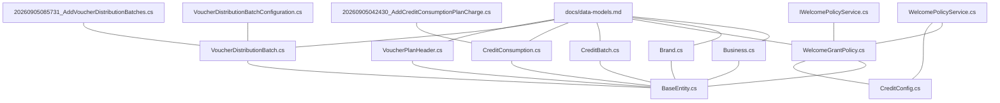
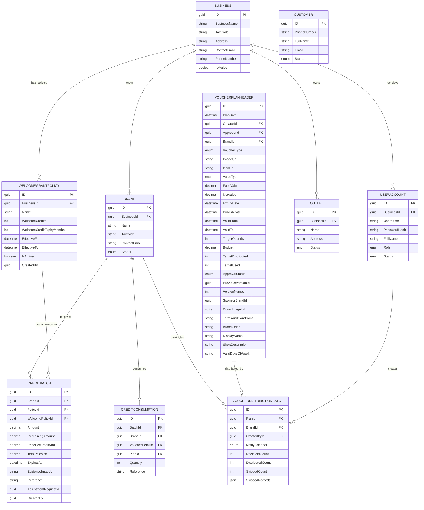
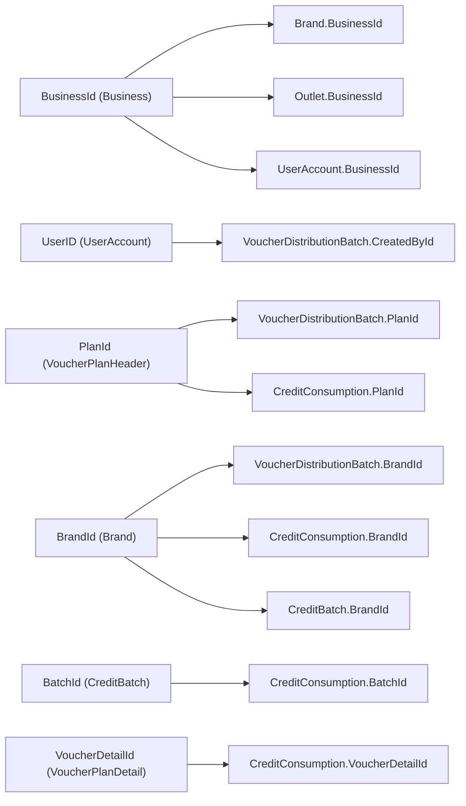

# Core Business Entities

<cite>
**Referenced Files in This Document**
- [data-models.md](file://docs/data-models.md)
- [Business.cs](file://src/NonCash.Core/Entities/Business.cs)
- [Brand.cs](file://src/NonCash.Core/Entities/Brand.cs)
- [WelcomeGrantPolicy.cs](file://src/NonCash.Core/Entities/WelcomeGrantPolicy.cs)
- [CreditBatch.cs](file://src/NonCash.Core/Entities/CreditBatch.cs)
- [CreditConsumption.cs](file://src/NonCash.Core/Entities/CreditConsumption.cs)
- [VoucherDistributionBatch.cs](file://src/NonCash.Core/Entities/VoucherDistributionBatch.cs)
- [VoucherPlanHeader.cs](file://src/NonCash.Core/Entities/VoucherPlanHeader.cs)
- [CreditConfig.cs](file://src/NonCash.Core/Configuration/CreditConfig.cs)
- [IWelcomePolicyService.cs](file://src/NonCash.Core/Interfaces/IWelcomePolicyService.cs)
- [INotificationService.cs](file://src/NonCash.Core/Interfaces/INotificationService.cs)
- [WelcomePolicyService.cs](file://src/NonCash.Infrastructure/Services/WelcomePolicyService.cs)
- [VoucherDistributionBatchConfiguration.cs](file://src/NonCash.Infrastructure/Data/Configurations/VoucherDistributionBatchConfiguration.cs)
- [20260905085731_AddVoucherDistributionBatches.cs](file://src/NonCash.Infrastructure/Migrations/20260905085731_AddVoucherDistributionBatches.cs)
- [20260905042430_AddCreditConsumptionPlanCharge.cs](file://src/NonCash.Infrastructure/Migrations/20260905042430_AddCreditConsumptionPlanCharge.cs)
- [migration-split-welcome-policy.sql](file://tools/migration-split-welcome-policy.sql)
- [BaseEntity.cs](file://src/NonCash.Core/Entities/Base/BaseEntity.cs)
</cite>

## Update Summary
**Changes Made**
- Added new VoucherDistributionBatch entity for batch distribution operation tracking with recipient counts, distributed amounts, and detailed skip reasons stored as JSON
- Enhanced CreditConsumption entity with plan_id and quantity columns for plan-level credit consumption tracking
- Updated entity relationships to support batch distribution workflows and plan-level credit charges
- Added comprehensive audit trail capabilities for voucher distribution operations

## Table of Contents
1. [Introduction](#introduction)
2. [Project Structure](#project-structure)
3. [Core Components](#core-components)
4. [Architecture Overview](#architecture-overview)
5. [Detailed Component Analysis](#detailed-component-analysis)
6. [Dependency Analysis](#dependency-analysis)
7. [Performance Considerations](#performance-considerations)
8. [Troubleshooting Guide](#troubleshooting-guide)
9. [Conclusion](#conclusion)
10. [Appendices](#appendices)

## Introduction
This document defines the core business entities that underpin the NonCash platform's enhanced voucher lifecycle and tenant-aware operations. The platform now features an improved production planning model with detailed approval workflows, comprehensive member-based voucher management, sophisticated welcome credit policy management, and advanced batch distribution tracking. The core entities include:

- **Business** (Multi-tenant organization)
- **Brand** (Organization within a business)
- **VoucherPlanHeader** (Campaign master)
- **VoucherDistributionBatch** (Batch distribution operations)
- **CreditConsumption** (Credit usage tracking with plan-level support)
- **WelcomeGrantPolicy** (Business-scoped welcome credit policies)
- **CreditBatch** (Prepaid credit batches with policy tracking)
- **Outlet** (POS locations)
- **UserAccount** (back-office users)
- **Customer** (end-users)

These entities document field definitions, data types, primary keys, foreign key relationships, business constraints, and validation rules derived from the repository's enhanced data model and functional specifications.

## Project Structure
The enhanced data model and business context are documented across multiple files:

- **docs/data-models.md**: Defines the core entities and their attributes
- **src/NonCash.Core/Entities/**: Contains all entity definitions with navigation properties
- **src/NonCash.Core/Configuration/**: Configuration classes including CreditConfig
- **src/NonCash.Core/Interfaces/**: Service interfaces including IWelcomePolicyService
- **src/NonCash.Infrastructure/Services/**: Service implementations including WelcomePolicyService
- **src/NonCash.Infrastructure/Data/Configurations/**: Entity configurations including VoucherDistributionBatchConfiguration
- **src/NonCash.Infrastructure/Migrations/**: Entity Framework migrations for new entities
- **tools/**: Database migration scripts including welcome policy migration

```mermaid
graph TB
DM["docs/data-models.md"]
BE["Business.cs"]
BR["Brand.cs"]
WGP["WelcomeGrantPolicy.cs"]
CB["CreditBatch.cs"]
CC["CreditConsumption.cs"]
VDB["VoucherDistributionBatch.cs"]
VPH["VoucherPlanHeader.cs"]
CCFG["CreditConfig.cs"]
IWS["IWelcomePolicyService.cs"]
WPS["WelcomePolicyService.cs"]
VDBC["VoucherDistributionBatchConfiguration.cs"]
MIG1["20260905085731_AddVoucherDistributionBatches.cs"]
MIG2["20260905042430_AddCreditConsumptionPlanCharge.cs"]
BASE["BaseEntity.cs"]
DM --- BE
DM --- BR
DM --- WGP
DM --- CB
DM --- CC
DM --- VDB
DM --- VPH
BE --- BASE
BR --- BASE
WGP --- BASE
CB --- BASE
CC --- BASE
VDB --- BASE
VPH --- BASE
WGP --- CCFG
IWS --- WGP
WPS --- WGP
WPS --- CCFG
VDBC --- VDB
MIG1 --- VDB
MIG2 --- CC
```

**Diagram sources**
- [data-models.md:1-113](file://docs/data-models.md#L1-L113)
- [Business.cs:1-18](file://src/NonCash.Core/Entities/Business.cs#L1-L18)
- [Brand.cs:1-19](file://src/NonCash.Core/Entities/Brand.cs#L1-L19)
- [WelcomeGrantPolicy.cs:1-37](file://src/NonCash.Core/Entities/WelcomeGrantPolicy.cs#L1-L37)
- [CreditBatch.cs:55-74](file://src/NonCash.Core/Entities/CreditBatch.cs#L55-L74)
- [CreditConsumption.cs:9-30](file://src/NonCash.Core/Entities/CreditConsumption.cs#L9-L30)
- [VoucherDistributionBatch.cs:11-37](file://src/NonCash.Core/Entities/VoucherDistributionBatch.cs#L11-L37)
- [VoucherPlanHeader.cs:22-72](file://src/NonCash.Core/Entities/VoucherPlanHeader.cs#L22-L72)
- [CreditConfig.cs:1-35](file://src/NonCash.Core/Configuration/CreditConfig.cs#L1-L35)
- [IWelcomePolicyService.cs:1-37](file://src/NonCash.Core/Interfaces/IWelcomePolicyService.cs#L1-L37)
- [WelcomePolicyService.cs:1-75](file://src/NonCash.Infrastructure/Services/WelcomePolicyService.cs#L1-L75)
- [VoucherDistributionBatchConfiguration.cs:10-57](file://src/NonCash.Infrastructure/Data/Configurations/VoucherDistributionBatchConfiguration.cs#L10-L57)
- [20260905085731_AddVoucherDistributionBatches.cs:9-116](file://src/NonCash.Infrastructure/Migrations/20260905085731_AddVoucherDistributionBatches.cs#L9-L116)
- [20260905042430_AddCreditConsumptionPlanCharge.cs:9-123](file://src/NonCash.Infrastructure/Migrations/20260905042430_AddCreditConsumptionPlanCharge.cs#L9-L123)

**Section sources**
- [data-models.md:1-113](file://docs/data-models.md#L1-L113)
- [Business.cs:1-18](file://src/NonCash.Core/Entities/Business.cs#L1-L18)
- [Brand.cs:1-19](file://src/NonCash.Core/Entities/Brand.cs#L1-L19)
- [WelcomeGrantPolicy.cs:1-37](file://src/NonCash.Core/Entities/WelcomeGrantPolicy.cs#L1-L37)
- [CreditBatch.cs:55-74](file://src/NonCash.Core/Entities/CreditBatch.cs#L55-L74)
- [CreditConsumption.cs:9-30](file://src/NonCash.Core/Entities/CreditConsumption.cs#L9-L30)
- [VoucherDistributionBatch.cs:11-37](file://src/NonCash.Core/Entities/VoucherDistributionBatch.cs#L11-L37)
- [VoucherPlanHeader.cs:22-72](file://src/NonCash.Core/Entities/VoucherPlanHeader.cs#L22-L72)
- [CreditConfig.cs:1-35](file://src/NonCash.Core/Configuration/CreditConfig.cs#L1-L35)
- [IWelcomePolicyService.cs:1-37](file://src/NonCash.Core/Interfaces/IWelcomePolicyService.cs#L1-L37)
- [WelcomePolicyService.cs:1-75](file://src/NonCash.Infrastructure/Services/WelcomePolicyService.cs#L1-L75)
- [VoucherDistributionBatchConfiguration.cs:10-57](file://src/NonCash.Infrastructure/Data/Configurations/VoucherDistributionBatchConfiguration.cs#L10-L57)
- [20260905085731_AddVoucherDistributionBatches.cs:9-116](file://src/NonCash.Infrastructure/Migrations/20260905085731_AddVoucherDistributionBatches.cs#L9-L116)
- [20260905042430_AddCreditConsumptionPlanCharge.cs:9-123](file://src/NonCash.Infrastructure/Migrations/20260905042430_AddCreditConsumptionPlanCharge.cs#L9-L123)

## Core Components
This section summarizes each entity's purpose, attributes, and constraints as defined in the enhanced repository materials.

### Batch Distribution Tracking System

**VoucherDistributionBatch** (Batch Distribution Operations)
- **Purpose**: Captures every batch distribution operation with comprehensive audit trail including recipient counts, distributed amounts, and detailed skip reasons
- **Primary Key**: Id (GUID)
- **Foreign Keys**: PlanId (VoucherPlanHeader), BrandId (Brand), CreatedById (UserAccount)
- **Attributes and Types**: 
  - PlanId (GUID) - Reference to the voucher plan being distributed
  - BrandId (GUID) - Brand responsible for the distribution
  - CreatedById (GUID?) - Staff user who executed the run, null for API-triggered runs
  - NotifyChannel (NotificationChannel) - Notification channel requested for this run
  - RecipientCount (Integer) - Number of valid (eligible) recipients attempted
  - DistributedCount (Integer) - Vouchers actually assigned in this run
  - SkippedCount (Integer) - Recipients skipped before distribution
  - SkippedRecords (List<BatchSkippedRecipient>) - Detailed skip reasons stored as JSON
- **Navigation Properties**: Plan (VoucherPlanHeader), CreatedBy (UserAccount)
- **Business Constraints**:
  - One row per batch distribution run for complete auditability
  - Individual voucher rows link back via VoucherDistribution.BatchId
  - Single-voucher flows (sale, transfer) do NOT create batch rows
  - JSON storage of skip records provides flexible failure tracking

**New Entity** Added to capture comprehensive batch distribution operations with detailed audit trail

Validation Rules:
- PlanId must reference an existing VoucherPlanHeader
- BrandId must reference an existing Brand
- CreatedById must reference an existing UserAccount (when provided)
- RecipientCount ≥ 0
- DistributedCount ≤ RecipientCount
- SkippedCount = RecipientCount - DistributedCount
- NotifyChannel must be valid enum value (Email, Zalo, Both, None)

Sample Data Example:
- Id: [GUID]
- PlanId: [GUID]
- BrandId: [GUID]
- CreatedById: [GUID or null]
- NotifyChannel: Email or Zalo or Both or None
- RecipientCount: [Integer]
- DistributedCount: [Integer]
- SkippedCount: [Integer]
- SkippedRecords: [{"PhoneNumber": "[Phone]", "Reason": "[Skip reason]"}]

**Section sources**
- [VoucherDistributionBatch.cs:11-37](file://src/NonCash.Core/Entities/VoucherDistributionBatch.cs#L11-L37)
- [VoucherDistributionBatchConfiguration.cs:28-57](file://src/NonCash.Infrastructure/Data/Configurations/VoucherDistributionBatchConfiguration.cs#L28-L57)
- [20260905085731_AddVoucherDistributionBatches.cs:21-55](file://src/NonCash.Infrastructure/Migrations/20260905085731_AddVoucherDistributionBatches.cs#L21-L55)

**BatchSkippedRecipient** (Skip Record Detail)
- **Purpose**: Represents individual recipients skipped during batch distribution with specific failure reasons
- **Attributes and Types**: PhoneNumber (String), Reason (String)
- **Storage**: Serialized into VoucherDistributionBatch.SkippedRecords as JSON
- **Use Cases**: Invalid phone numbers, blacklisted customers, brand-blocked recipients, etc.

**New Type** Added to provide detailed skip reason tracking for batch distributions

Validation Rules:
- PhoneNumber must be non-empty string
- Reason must be descriptive skip reason (e.g., "Invalid phone", "Blacklisted", "Brand blocked")

Sample Data Example:
- PhoneNumber: "[Phone Number]"
- Reason: "[Skip reason such as 'Invalid phone', 'Blacklisted', 'Brand blocked']"

**Section sources**
- [VoucherDistributionBatch.cs:39-44](file://src/NonCash.Core/Entities/VoucherDistributionBatch.cs#L39-L44)

### Enhanced Credit Consumption Tracking

**CreditConsumption** (Credit Usage with Plan-Level Support)
- **Purpose**: Comprehensive credit charge ledger supporting both per-voucher and plan-level consumption tracking
- **Primary Key**: Id (GUID)
- **Foreign Keys**: BatchId (CreditBatch), BrandId (Brand), VoucherDetailId (nullable), PlanId (nullable)
- **Attributes and Types**: 
  - BatchId (GUID?) - Source credit batch (null for plan-level charges)
  - BrandId (GUID) - Brand consuming credits
  - VoucherDetailId (GUID?) - Per-voucher charge reference (unique when set)
  - PlanId (GUID?) - Plan-level approval charge reference (unique when set)
  - Quantity (Integer) - Credits consumed: 1 for per-voucher, N for plan-level approval
  - Reference (String?) - Context identifier (e.g., "plan-approval", "gift-sold", "complimentary-redeemed")
- **Navigation Properties**: Batch (CreditBatch), Brand (Brand)
- **Business Logic**:
  - Two shapes: Per-voucher (VoucherDetailId set, Quantity=1) and Plan-level (PlanId set, Quantity=N)
  - Unique constraints ensure one charge per voucher detail or per plan
  - FIFO draw spans batches for plan-level charges; balance lives on batches

**Updated** Enhanced with plan_id and quantity columns for plan-level credit consumption tracking

Validation Rules:
- BrandId must reference an existing Brand
- Either VoucherDetailId or PlanId must be set (mutually exclusive)
- VoucherDetailId unique constraint when set
- PlanId unique constraint when set
- Quantity must be positive integer
- BatchId must reference existing CreditBatch (when set)

Sample Data Example:
- Id: [GUID]
- BatchId: [GUID or null]
- BrandId: [GUID]
- VoucherDetailId: [GUID or null]
- PlanId: [GUID or null]
- Quantity: [Integer - 1 for per-voucher, N for plan-level]
- Reference: "[Context like 'plan-approval' or 'gift-sold']"

**Section sources**
- [CreditConsumption.cs:9-30](file://src/NonCash.Core/Entities/CreditConsumption.cs#L9-L30)
- [20260905042430_AddCreditConsumptionPlanCharge.cs:37-67](file://src/NonCash.Infrastructure/Migrations/20260905042430_AddCreditConsumptionPlanCharge.cs#L37-L67)

### Enhanced Business Management

**Business** (Multi-Tenant Organization)
- **Purpose**: Enhanced tenant representation with comprehensive business information and brand management
- **Primary Key**: Id (GUID)
- **Attributes and Types**: BusinessName (String), TaxCode (String), Address (String), ContactEmail (String?), PhoneNumber (String?), IsActive (Boolean)
- **Navigation Properties**: Brands (ICollection<Brand>)
- **Business Constraints**:
  - Controls tenant activation and deactivation via IsActive flag
  - Supports multi-tenant isolation and resource management
  - Provides business contact and identification information
  - Serves as parent entity for Brand hierarchy

**Updated** Enhanced from original Business entity with comprehensive business information fields

Validation Rules:
- BusinessName must be non-empty
- TaxCode must be unique per tenant
- IsActive must be boolean value
- Email format validation (when provided)

Sample Data Example:
- Id: [GUID]
- BusinessName: "[Business Name]"
- TaxCode: "[Tax Identifier]"
- Address: "[Business Address]"
- ContactEmail: "[Email Address]"
- PhoneNumber: "[Phone Number]"
- IsActive: true or false

**Section sources**
- [Business.cs:6-16](file://src/NonCash.Core/Entities/Business.cs#L6-L16)

**Brand** (Organization within Business)
- **Purpose**: Individual organizations within a business that receive welcome credits based on business policies
- **Primary Key**: Id (GUID)
- **Foreign Key**: BusinessId (Business)
- **Attributes and Types**: Name (String), TaxCode (String), ContactEmail (String?), Status (Enum: PendingActivation, Active, Suspended)
- **Navigation Properties**: Business (Business)
- **Business Constraints**:
  - Belongs to a parent Business entity
  - Status governs activation state
  - Receives welcome credits based on business-level policies

**Updated** Enhanced from Brand entity with business relationship and status management

Validation Rules:
- BusinessId must reference an existing Business
- TaxCode must be unique within business scope
- Status must be PendingActivation, Active, or Suspended

Sample Data Example:
- Id: [GUID]
- BusinessId: [GUID]
- Name: "[Brand Name]"
- TaxCode: "[Tax Code]"
- ContactEmail: "[Email Address]"
- Status: PendingActivation or Active or Suspended

**Section sources**
- [Brand.cs:10-19](file://src/NonCash.Core/Entities/Brand.cs#L10-L19)

### Campaign and Distribution Management

**VoucherPlanHeader** (Campaign Master)
- **Purpose**: Central hub for voucher campaign management with versioning, sponsorship, and display configuration
- **Primary Key**: Id (GUID)
- **Foreign Keys**: CreatorId (UserAccount), ApproverId (UserAccount), BrandId (Brand), SponsorBrandId (Brand), PreviousVersionId (VoucherPlanHeader)
- **Attributes and Types**: 
  - PlanDate (DateTime), CreatorId (GUID), ApproverId (GUID?)
  - BrandId (GUID), VoucherType (Enum), ImageUrl/IconUrl (String?)
  - ValueType (Enum), FaceValue/NetValue (Decimal)
  - ExpiryDate/PublishDate/ValidFrom/ValidTo (DateTime?)
  - TargetQuantity (Integer), Budget (Decimal), TargetDistributed/TargetUsed (Integer)
  - ApprovalStatus (Enum), VersionNumber (Integer), PreviousVersionId (GUID?)
  - SponsorBrandId (GUID?), CoverImageUrl/TermsAndConditions/BrandColor/DisplayName/ShortDescription/ValidDaysOfWeek (String?)
  - Scope (VoucherScope) - Hierarchical applicability scope
- **Navigation Properties**: Creator, Approver, Brand, SponsorBrand, PreviousVersion
- **Business Constraints**:
  - Versioning through PreviousVersionId and VersionNumber
  - Cross-tenant sponsorship via SponsorBrandId
  - Display configuration for customer-facing presentation
  - Scope-based applicability control

**Updated** Enhanced with comprehensive campaign management features and display configuration

Validation Rules:
- BrandId must reference an existing Brand
- FaceValue ≥ 0, NetValue ≥ 0
- ExpiryDate ≥ PublishDate (when both provided)
- ValidFrom ≤ ValidTo (when both provided)
- TargetQuantity ≥ 0, Budget ≥ 0
- ApprovalStatus must be Pending/Approved/Rejected

Sample Data Example:
- Id: [GUID]
- PlanDate: [DateTime]
- CreatorId: [GUID]
- BrandId: [GUID]
- VoucherType: Complimentary or Gift
- ValueType: Value or Percentage
- FaceValue: [Decimal]
- NetValue: [Decimal]
- ExpiryDate: [DateTime]
- PublishDate: [DateTime]
- ValidFrom: [DateTime or null]
- ValidTo: [DateTime or null]
- TargetQuantity: [Integer]
- Budget: [Decimal]
- ApprovalStatus: Pending or Approved or Rejected
- VersionNumber: [Integer]

**Section sources**
- [VoucherPlanHeader.cs:22-72](file://src/NonCash.Core/Entities/VoucherPlanHeader.cs#L22-L72)

### Enhanced Credit Management

**CreditBatch** (Prepaid Credit Batches)
- **Purpose**: Prepaid credit batches with support for welcome grants and pricing policies
- **Primary Key**: Id (GUID)
- **Foreign Keys**: BrandId (Brand), PolicyId (CreditPricingPolicy), WelcomePolicyId (WelcomeGrantPolicy), AdjustmentRequestId (CreditAdjustmentRequest)
- **Attributes and Types**: Amount (Decimal), RemainingAmount (Decimal), PricePerCreditVnd (Decimal), TotalPaidVnd (Decimal), ExpiresAt (DateTime?), EvidenceImageUrl (String?), Reference (String?), CreatedBy (GUID?)
- **Navigation Properties**: Brand (Brand), Policy (CreditPricingPolicy), WelcomePolicy (WelcomeGrantPolicy), AdjustmentRequest (CreditAdjustmentRequest)
- **Business Constraints**:
  - Links to either pricing policy or welcome policy (or both)
  - Supports idempotent welcome grants per brand
  - Tracks expiration dates for credit usage
  - Maintains audit trail through CreatedBy field

**Updated** Enhanced with WelcomePolicyId foreign key for welcome grant tracking

Validation Rules:
- BrandId must reference an existing Brand
- Amount must be positive
- RemainingAmount ≤ Amount
- ExpiresAt must be after creation date (when provided)
- WelcomePolicyId must reference an existing WelcomeGrantPolicy (when set)

Sample Data Example:
- Id: [GUID]
- BrandId: [GUID]
- PolicyId: [GUID or null]
- WelcomePolicyId: [GUID or null]
- Amount: [Decimal]
- RemainingAmount: [Decimal]
- PricePerCreditVnd: [Decimal]
- TotalPaidVnd: [Decimal]
- ExpiresAt: [DateTime or null]
- CreatedBy: [GUID or null]

**Section sources**
- [CreditBatch.cs:55-74](file://src/NonCash.Core/Entities/CreditBatch.cs#L55-L74)

**CreditConfig** (Configuration Defaults)
- **Purpose**: Application configuration providing default values when no database policies exist
- **Attributes and Types**: WelcomeCredits (Integer = 500), LowBalanceWarningPercent (Integer = 20), PricePerCreditVnd (Decimal = 5000m), CreditExpiryMonths (Integer? = 12), WelcomeCreditExpiryMonths (Integer? = 12), ExpiryWarningDays (Integer? = 30), AdjustmentApprovalThreshold (Integer? = 1000)
- **Business Logic**: Serves as fallback when no database policy matches for welcome credits

**Updated** Enhanced to serve as fallback for welcome credit policies

Validation Rules:
- WelcomeCredits must be non-negative
- All numeric values must be valid ranges
- Percentage values must be between 0-100

Sample Data Example:
- WelcomeCredits: 500
- LowBalanceWarningPercent: 20
- PricePerCreditVnd: 5000m
- CreditExpiryMonths: 12
- WelcomeCreditExpiryMonths: 12
- ExpiryWarningDays: 30
- AdjustmentApprovalThreshold: 1000

**Section sources**
- [CreditConfig.cs:7-35](file://src/NonCash.Core/Configuration/CreditConfig.cs#L7-L35)

### Core Business Entities

**Outlet** (Point of Sale / Store)
- **Purpose**: Physical or digital store under a Business eligible to accept vouchers
- **Primary Key**: ID (GUID)
- **Foreign Key**: BusinessId (Business)
- **Attributes and Types**: Name (String), Address (String), Status (Enum)
- **Business Constraints**:
  - Status governs Active/Closed state
  - AllowedLocations in ProductionPlan references Outlet IDs for usage restrictions

**Updated** Enhanced from Outlet with improved business association

Validation Rules:
- BusinessId must reference an existing Business
- Status must be Active or Closed
- Name must be non-empty

Sample Data Example:
- ID: [GUID]
- BusinessId: [GUID]
- Name: "[Store Name]"
- Address: "[Full Address]"
- Status: Active or Closed

**Section sources**
- [data-models.md:73-79](file://docs/data-models.md#L73-L79)

**UserAccount** (Back-office Users)
- **Purpose**: Platform users with roles for planning, reviewing, and approving production plans
- **Primary Key**: ID (GUID)
- **Foreign Key**: BusinessId (Business), nullable for system super-admins
- **Attributes and Types**: Username (String), PasswordHash (String), FullName (String), Role (Enum), Status (Enum)
- **Business Constraints**:
  - Role determines access rights (Admin/Planner/Approver)
  - BusinessId scopes users to a tenant (nullable for system-wide roles)

**Updated** Enhanced from UserAccount with improved business scoping

Validation Rules:
- Role must be Admin/Planner/Approver
- Status must be Active/Locked
- Username must be unique
- BusinessId can be null for system administrators

Sample Data Example:
- ID: [GUID]
- BusinessId: [GUID or null]
- Username: "[Unique Username]"
- PasswordHash: "[Hashed Value]"
- FullName: "[Full Name]"
- Role: Admin or Planner or Approver
- Status: Active or Locked

**Section sources**
- [data-models.md:81-89](file://docs/data-models.md#L81-L89)

**Customer** (End-User / App Member)
- **Purpose**: Individual end-users who receive and redeem vouchers
- **Primary Key**: ID (GUID)
- **Attributes and Types**: PhoneNumber (String), FullName (String), Email (String), Status (Enum)
- **Business Constraints**:
  - PhoneNumber is the primary identifier for transfers/logins
  - Status governs Active/Blacklisted state

**Updated** Enhanced from Customer with improved status management

Validation Rules:
- PhoneNumber must be unique
- Status must be Active or Blacklisted

Sample Data Example:
- ID: [GUID]
- PhoneNumber: "[Phone Number]"
- FullName: "[Full Name]"
- Email: "[Email Address]"
- Status: Active or Blacklisted

**Section sources**
- [data-models.md:91-97](file://docs/data-models.md#L91-L97)

## Architecture Overview
The enhanced entities form a comprehensive domain model supporting advanced multi-tenancy, detailed approval workflows, comprehensive voucher lifecycle management, sophisticated welcome credit policy management, and advanced batch distribution tracking.

```mermaid
erDiagram
BUSINESS {
guid ID PK
string BusinessName
string TaxCode
string Address
string ContactEmail
string PhoneNumber
boolean IsActive
}
BRAND {
guid ID PK
guid BusinessId FK
string Name
string TaxCode
string ContactEmail
enum Status
}
WELCOMEGRANTPOLICY {
guid ID PK
guid BusinessId FK
string Name
int WelcomeCredits
int WelcomeCreditExpiryMonths
datetime EffectiveFrom
datetime EffectiveTo
boolean IsActive
guid CreatedBy
}
CREDITBATCH {
guid ID PK
guid BrandId FK
guid PolicyId FK
guid WelcomePolicyId FK
decimal Amount
decimal RemainingAmount
decimal PricePerCreditVnd
decimal TotalPaidVnd
datetime ExpiresAt
string EvidenceImageUrl
string Reference
guid AdjustmentRequestId
guid CreatedBy
}
CREDITCONSUMPTION {
guid ID PK
guid BatchId FK
guid BrandId FK
guid VoucherDetailId FK
guid PlanId FK
int Quantity
string Reference
}
VOUCHERPLANHEADER {
guid ID PK
datetime PlanDate
guid CreatorId FK
guid ApproverId FK
guid BrandId FK
enum VoucherType
string ImageUrl
string IconUrl
enum ValueType
decimal FaceValue
decimal NetValue
datetime ExpiryDate
datetime PublishDate
datetime ValidFrom
datetime ValidTo
int TargetQuantity
decimal Budget
int TargetDistributed
int TargetUsed
enum ApprovalStatus
guid PreviousVersionId
int VersionNumber
guid SponsorBrandId
string CoverImageUrl
string TermsAndConditions
string BrandColor
string DisplayName
string ShortDescription
string ValidDaysOfWeek
}
VOUCHERDISTRIBUTIONBATCH {
guid ID PK
guid PlanId FK
guid BrandId FK
guid CreatedById FK
enum NotifyChannel
int RecipientCount
int DistributedCount
int SkippedCount
json SkippedRecords
}
OUTLET {
guid ID PK
guid BusinessId FK
string Name
string Address
enum Status
}
USERACCOUNT {
guid ID PK
guid BusinessId FK
string Username
string PasswordHash
string FullName
enum Role
enum Status
}
CUSTOMER {
guid ID PK
string PhoneNumber
string FullName
string Email
enum Status
}
BUSINESS ||--o{ BRAND : "owns"
BUSINESS ||--o{ WELCOMEGRANTPOLICY : "has_policies"
BUSINESS ||--o{ OUTLET : "owns"
BUSINESS ||--o{ USERACCOUNT : "employs"
BRAND ||--o{ CREDITBATCH : "receives"
BRAND ||--o{ CREDITCONSUMPTION : "consumes"
BRAND ||--o{ VOUCHERDISTRIBUTIONBATCH : "distributes"
WELCOMEGRANTPOLICY ||--o{ CREDITBATCH : "grants_welcome"
VOUCHERPLANHEADER ||--o{ VOUCHERDISTRIBUTIONBATCH : "distributed_by"
USERACCOUNT ||--o{ VOUCHERDISTRIBUTIONBATCH : "creates"
```

**Diagram sources**
- [Business.cs:6-16](file://src/NonCash.Core/Entities/Business.cs#L6-L16)
- [Brand.cs:10-19](file://src/NonCash.Core/Entities/Brand.cs#L10-L19)
- [WelcomeGrantPolicy.cs:11-36](file://src/NonCash.Core/Entities/WelcomeGrantPolicy.cs#L11-L36)
- [CreditBatch.cs:55-74](file://src/NonCash.Core/Entities/CreditBatch.cs#L55-L74)
- [CreditConsumption.cs:9-30](file://src/NonCash.Core/Entities/CreditConsumption.cs#L9-L30)
- [VoucherPlanHeader.cs:22-72](file://src/NonCash.Core/Entities/VoucherPlanHeader.cs#L22-L72)
- [VoucherDistributionBatch.cs:11-37](file://src/NonCash.Core/Entities/VoucherDistributionBatch.cs#L11-L37)

## Detailed Component Analysis

### Batch Distribution Tracking System

#### VoucherDistributionBatch (Batch Distribution Operations)
- **Purpose**: Captures every batch distribution operation with comprehensive audit trail including recipient counts, distributed amounts, and detailed skip reasons
- **Key Fields**:
  - Id (Primary Key)
  - PlanId (Foreign Key to VoucherPlanHeader)
  - BrandId (Foreign Key to Brand)
  - CreatedById (Foreign Key to UserAccount, nullable)
  - NotifyChannel (NotificationChannel enum)
  - RecipientCount (Integer) - Number of valid recipients attempted
  - DistributedCount (Integer) - Vouchers actually assigned
  - SkippedCount (Integer) - Recipients skipped before distribution
  - SkippedRecords (List<BatchSkippedRecipient>) - JSON array of skip details
- **Navigation Properties**: Plan (VoucherPlanHeader), CreatedBy (UserAccount)
- **Business Logic**:
  - One row per batch distribution run for complete auditability
  - Individual voucher rows link back via VoucherDistribution.BatchId
  - JSON storage of skip records provides flexible failure tracking
  - Supports notification channel selection for batch completion alerts

**New Entity** Added to capture comprehensive batch distribution operations with detailed audit trail

Validation Rules:
- PlanId must reference an existing VoucherPlanHeader
- BrandId must reference an existing Brand
- CreatedById must reference an existing UserAccount (when provided)
- RecipientCount ≥ 0
- DistributedCount ≤ RecipientCount
- SkippedCount = RecipientCount - DistributedCount
- NotifyChannel must be valid enum value (Email, Zalo, Both, None)

Sample Data Example:
- Id: [GUID]
- PlanId: [GUID]
- BrandId: [GUID]
- CreatedById: [GUID or null]
- NotifyChannel: Email or Zalo or Both or None
- RecipientCount: [Integer]
- DistributedCount: [Integer]
- SkippedCount: [Integer]
- SkippedRecords: [{"PhoneNumber": "[Phone]", "Reason": "[Skip reason]"}]

**Section sources**
- [VoucherDistributionBatch.cs:11-37](file://src/NonCash.Core/Entities/VoucherDistributionBatch.cs#L11-L37)
- [VoucherDistributionBatchConfiguration.cs:28-57](file://src/NonCash.Infrastructure/Data/Configurations/VoucherDistributionBatchConfiguration.cs#L28-L57)
- [20260905085731_AddVoucherDistributionBatches.cs:21-55](file://src/NonCash.Infrastructure/Migrations/20260905085731_AddVoucherDistributionBatches.cs#L21-L55)

#### BatchSkippedRecipient (Skip Record Detail)
- **Purpose**: Represents individual recipients skipped during batch distribution with specific failure reasons
- **Key Fields**: PhoneNumber (String), Reason (String)
- **Storage**: Serialized into VoucherDistributionBatch.SkippedRecords as JSON
- **Use Cases**: Invalid phone numbers, blacklisted customers, brand-blocked recipients, etc.

**New Type** Added to provide detailed skip reason tracking for batch distributions

Validation Rules:
- PhoneNumber must be non-empty string
- Reason must be descriptive skip reason (e.g., "Invalid phone", "Blacklisted", "Brand blocked")

Sample Data Example:
- PhoneNumber: "[Phone Number]"
- Reason: "[Skip reason such as 'Invalid phone', 'Blacklisted', 'Brand blocked']"

**Section sources**
- [VoucherDistributionBatch.cs:39-44](file://src/NonCash.Core/Entities/VoucherDistributionBatch.cs#L39-L44)

### Enhanced Credit Consumption Tracking

#### CreditConsumption (Credit Usage with Plan-Level Support)
- **Purpose**: Comprehensive credit charge ledger supporting both per-voucher and plan-level consumption tracking
- **Key Fields**:
  - Id (Primary Key)
  - BatchId (Foreign Key to CreditBatch, nullable)
  - BrandId (Foreign Key to Brand)
  - VoucherDetailId (Foreign Key to VoucherPlanDetail, nullable, unique when set)
  - PlanId (Foreign Key to VoucherPlanHeader, nullable, unique when set)
  - Quantity (Integer) - Credits consumed: 1 for per-voucher, N for plan-level approval
  - Reference (String?) - Context identifier (e.g., "plan-approval", "gift-sold", "complimentary-redeemed")
- **Navigation Properties**: Batch (CreditBatch), Brand (Brand)
- **Business Logic**:
  - Two shapes: Per-voucher (VoucherDetailId set, Quantity=1) and Plan-level (PlanId set, Quantity=N)
  - Unique constraints ensure one charge per voucher detail or per plan
  - FIFO draw spans batches for plan-level charges; balance lives on batches

**Updated** Enhanced with plan_id and quantity columns for plan-level credit consumption tracking

Validation Rules:
- BrandId must reference an existing Brand
- Either VoucherDetailId or PlanId must be set (mutually exclusive)
- VoucherDetailId unique constraint when set
- PlanId unique constraint when set
- Quantity must be positive integer
- BatchId must reference existing CreditBatch (when set)

Sample Data Example:
- Id: [GUID]
- BatchId: [GUID or null]
- BrandId: [GUID]
- VoucherDetailId: [GUID or null]
- PlanId: [GUID or null]
- Quantity: [Integer - 1 for per-voucher, N for plan-level]
- Reference: "[Context like 'plan-approval' or 'gift-sold']"

**Section sources**
- [CreditConsumption.cs:9-30](file://src/NonCash.Core/Entities/CreditConsumption.cs#L9-L30)
- [20260905042430_AddCreditConsumptionPlanCharge.cs:37-67](file://src/NonCash.Infrastructure/Migrations/20260905042430_AddCreditConsumptionPlanCharge.cs#L37-L67)

### Enhanced Business Management

#### Business (Enhanced Multi-Tenant Organization)
- **Purpose**: Comprehensive tenant representation with business information management and brand hierarchy
- **Key Fields**:
  - Id (Primary Key)
  - BusinessName, TaxCode, Address
  - ContactEmail, PhoneNumber
  - IsActive (Boolean flag)
- **Navigation Properties**: Brands (ICollection<Brand>)
- **Business Logic**:
  - Controls tenant activation and deactivation
  - Supports multi-tenant isolation and resource management
  - Provides business contact and identification information
  - Serves as parent entity for brand hierarchy

**Updated** Enhanced from original Business entity with comprehensive business information fields

Validation Rules:
- BusinessName must be non-empty
- TaxCode must be unique per tenant
- IsActive must be boolean value
- Email format validation (when provided)

Sample Data Example:
- Id: [GUID]
- BusinessName: "[Business Name]"
- TaxCode: "[Tax Identifier]"
- Address: "[Business Address]"
- ContactEmail: "[Email Address]"
- PhoneNumber: "[Phone Number]"
- IsActive: true or false

**Section sources**
- [Business.cs:6-16](file://src/NonCash.Core/Entities/Business.cs#L6-L16)

#### Brand (Organization within Business)
- **Purpose**: Individual organizations within a business that receive welcome credits based on business policies
- **Key Fields**:
  - Id (Primary Key)
  - BusinessId (Foreign Key to Business)
  - Name, TaxCode, ContactEmail
  - Status (Enum: PendingActivation, Active, Suspended)
- **Navigation Properties**: Business (Business)
- **Business Logic**:
  - Belongs to a parent Business entity
  - Status governs activation state
  - Receives welcome credits based on business-level policies

**Updated** Enhanced from Brand entity with business relationship and status management

Validation Rules:
- BusinessId must reference an existing Business
- TaxCode must be unique within business scope
- Status must be PendingActivation, Active, or Suspended

Sample Data Example:
- Id: [GUID]
- BusinessId: [GUID]
- Name: "[Brand Name]"
- TaxCode: "[Tax Code]"
- ContactEmail: "[Email Address]"
- Status: PendingActivation or Active or Suspended

**Section sources**
- [Brand.cs:10-19](file://src/NonCash.Core/Entities/Brand.cs#L10-L19)

### Campaign and Distribution Management

#### VoucherPlanHeader (Campaign Master)
- **Purpose**: Central hub for voucher campaign management with versioning, sponsorship, and display configuration
- **Key Fields**:
  - Id (Primary Key)
  - PlanDate (DateTime), CreatorId (GUID), ApproverId (GUID?)
  - BrandId (GUID), VoucherType (Enum), ImageUrl/IconUrl (String?)
  - ValueType (Enum), FaceValue/NetValue (Decimal)
  - ExpiryDate/PublishDate/ValidFrom/ValidTo (DateTime?)
  - TargetQuantity (Integer), Budget (Decimal), TargetDistributed/TargetUsed (Integer)
  - ApprovalStatus (Enum), VersionNumber (Integer), PreviousVersionId (GUID?)
  - SponsorBrandId (GUID?), CoverImageUrl/TermsAndConditions/BrandColor/DisplayName/ShortDescription/ValidDaysOfWeek (String?)
  - Scope (VoucherScope) - Hierarchical applicability scope
- **Navigation Properties**: Creator, Approver, Brand, SponsorBrand, PreviousVersion
- **Business Logic**:
  - Versioning through PreviousVersionId and VersionNumber
  - Cross-tenant sponsorship via SponsorBrandId
  - Display configuration for customer-facing presentation
  - Scope-based applicability control

**Updated** Enhanced with comprehensive campaign management features and display configuration

Validation Rules:
- BrandId must reference an existing Brand
- FaceValue ≥ 0, NetValue ≥ 0
- ExpiryDate ≥ PublishDate (when both provided)
- ValidFrom ≤ ValidTo (when both provided)
- TargetQuantity ≥ 0, Budget ≥ 0
- ApprovalStatus must be Pending/Approved/Rejected

Sample Data Example:
- Id: [GUID]
- PlanDate: [DateTime]
- CreatorId: [GUID]
- BrandId: [GUID]
- VoucherType: Complimentary or Gift
- ValueType: Value or Percentage
- FaceValue: [Decimal]
- NetValue: [Decimal]
- ExpiryDate: [DateTime]
- PublishDate: [DateTime]
- ValidFrom: [DateTime or null]
- ValidTo: [DateTime or null]
- TargetQuantity: [Integer]
- Budget: [Decimal]
- ApprovalStatus: Pending or Approved or Rejected
- VersionNumber: [Integer]

**Section sources**
- [VoucherPlanHeader.cs:22-72](file://src/NonCash.Core/Entities/VoucherPlanHeader.cs#L22-L72)

### Enhanced Credit Management

#### CreditBatch (Prepaid Credit Batches)
- **Purpose**: Prepaid credit batches with support for welcome grants and pricing policies
- **Key Fields**:
  - Id (Primary Key)
  - BrandId (Foreign Key to Brand)
  - PolicyId (Foreign Key to CreditPricingPolicy)
  - WelcomePolicyId (Foreign Key to WelcomeGrantPolicy)
  - Amount, RemainingAmount, PricePerCreditVnd, TotalPaidVnd
  - ExpiresAt, EvidenceImageUrl, Reference
  - AdjustmentRequestId, CreatedBy
- **Navigation Properties**: Brand, Policy, WelcomePolicy, AdjustmentRequest
- **Business Logic**:
  - Links to either pricing policy or welcome policy (or both)
  - Supports idempotent welcome grants per brand
  - Tracks expiration dates for credit usage
  - Maintains audit trail through CreatedBy field

**Updated** Enhanced with WelcomePolicyId foreign key for welcome grant tracking

Validation Rules:
- BrandId must reference an existing Brand
- Amount must be positive
- RemainingAmount ≤ Amount
- ExpiresAt must be after creation date (when provided)
- WelcomePolicyId must reference an existing WelcomeGrantPolicy (when set)

Sample Data Example:
- Id: [GUID]
- BrandId: [GUID]
- PolicyId: [GUID or null]
- WelcomePolicyId: [GUID or null]
- Amount: [Decimal]
- RemainingAmount: [Decimal]
- PricePerCreditVnd: [Decimal]
- TotalPaidVnd: [Decimal]
- ExpiresAt: [DateTime or null]
- CreatedBy: [GUID or null]

**Section sources**
- [CreditBatch.cs:55-74](file://src/NonCash.Core/Entities/CreditBatch.cs#L55-L74)

#### CreditConfig (Configuration Defaults)
- **Purpose**: Application configuration providing default values when no database policies exist
- **Key Fields**: WelcomeCredits (500), LowBalanceWarningPercent (20), PricePerCreditVnd (5000m), CreditExpiryMonths (12), WelcomeCreditExpiryMonths (12), ExpiryWarningDays (30), AdjustmentApprovalThreshold (1000)
- **Business Logic**: Serves as fallback when no database policy matches for welcome credits

**Updated** Enhanced to serve as fallback for welcome credit policies

Validation Rules:
- WelcomeCredits must be non-negative
- All numeric values must be valid ranges
- Percentage values must be between 0-100

Sample Data Example:
- WelcomeCredits: 500
- LowBalanceWarningPercent: 20
- PricePerCreditVnd: 5000m
- CreditExpiryMonths: 12
- WelcomeCreditExpiryMonths: 12
- ExpiryWarningDays: 30
- AdjustmentApprovalThreshold: 1000

**Section sources**
- [CreditConfig.cs:7-35](file://src/NonCash.Core/Configuration/CreditConfig.cs#L7-L35)

### Core Business Entities

#### Outlet (Enhanced POS Locations)
- **Purpose**: Physical or digital store under a Business eligible to accept vouchers
- **Key Fields**:
  - ID (Primary Key)
  - BusinessId (Foreign Key to Business)
  - Name, Address
  - Status (Enum)
- **Business Logic**:
  - Status governs Active/Closed state
  - AllowedLocations in ProductionPlan references Outlet IDs for usage restrictions
  - Supports geographic and operational store management

**Updated** Enhanced from Outlet with improved business association

Validation Rules:
- BusinessId must reference an existing Business
- Status must be Active or Closed
- Name must be non-empty

Sample Data Example:
- ID: [GUID]
- BusinessId: [GUID]
- Name: "[Store Name]"
- Address: "[Full Address]"
- Status: Active or Closed

**Section sources**
- [data-models.md:73-79](file://docs/data-models.md#L73-L79)

#### UserAccount (Enhanced Back-Office Users)
- **Purpose**: Platform users with enhanced roles for planning, reviewing, and approving production plans
- **Key Fields**:
  - ID (Primary Key)
  - BusinessId (Foreign Key to Business, nullable)
  - Username, PasswordHash, FullName
  - Role (Enum), Status (Enum)
- **Business Logic**:
  - Role determines access rights (Admin/Planner/Approver)
  - BusinessId scopes users to a tenant (nullable for system-wide roles)
  - Enhanced security with password hashing and role-based access control

**Updated** Enhanced from UserAccount with improved business scoping

Validation Rules:
- Role must be Admin/Planner/Approver
- Status must be Active/Locked
- Username must be unique
- BusinessId can be null for system administrators

Sample Data Example:
- ID: [GUID]
- BusinessId: [GUID or null]
- Username: "[Unique Username]"
- PasswordHash: "[Hashed Value]"
- FullName: "[Full Name]"
- Role: Admin or Planner or Approver
- Status: Active or Locked

**Section sources**
- [data-models.md:81-89](file://docs/data-models.md#L81-L89)

#### Customer (Enhanced End-Users)
- **Purpose**: Individual end-users who receive and redeem vouchers
- **Key Fields**:
  - ID (Primary Key)
  - PhoneNumber (Primary identifier), FullName, Email
  - Status (Enum)
- **Business Logic**:
  - PhoneNumber is the primary identifier for transfers and logins
  - Status governs Active/Blacklisted state
  - Supports individual customer management and communication

**Updated** Enhanced from Customer with improved status management

Validation Rules:
- PhoneNumber must be unique
- Status must be Active or Blacklisted

Sample Data Example:
- ID: [GUID]
- PhoneNumber: "[Phone Number]"
- FullName: "[Full Name]"
- Email: "[Email Address]"
- Status: Active or Blacklisted

**Section sources**
- [data-models.md:91-97](file://docs/data-models.md#L91-L97)

## Dependency Analysis
Enhanced entity relationships and comprehensive referential integrity constraints including the new batch distribution and credit consumption systems:

```mermaid
graph LR
BusinessId["BusinessId (Business)"] --> BrandBusiness["Brand.BusinessId"]
BusinessId --> OutletBusiness["Outlet.BusinessId"]
BusinessId --> UserAccountBusiness["UserAccount.BusinessId"]
UserID["UserID (UserAccount)"] --> VoucherDistributionCreatedBy["VoucherDistributionBatch.CreatedById"]
PlanId["PlanId (VoucherPlanHeader)"] --> VoucherDistributionPlan["VoucherDistributionBatch.PlanId"]
PlanId --> CreditConsumptionPlan["CreditConsumption.PlanId"]
BrandId["BrandId (Brand)"] --> VoucherDistributionBrand["VoucherDistributionBatch.BrandId"]
BrandId --> CreditConsumptionBrand["CreditConsumption.BrandId"]
BrandId --> CreditBatchBrand["CreditBatch.BrandId"]
BatchId["BatchId (CreditBatch)"] --> CreditConsumptionBatch["CreditConsumption.BatchId"]
VoucherDetailId["VoucherDetailId (VoucherPlanDetail)"] --> CreditConsumptionVoucher["CreditConsumption.VoucherDetailId"]
```

**Updated** Enhanced dependency graph to include new batch distribution and credit consumption entities

**Diagram sources**
- [VoucherDistributionBatch.cs:13-17](file://src/NonCash.Core/Entities/VoucherDistributionBatch.cs#L13-L17)
- [CreditConsumption.cs:11-19](file://src/NonCash.Core/Entities/CreditConsumption.cs#L11-L19)
- [Brand.cs:12-13](file://src/NonCash.Core/Entities/Brand.cs#L12-L13)
- [VoucherPlanHeader.cs:24-27](file://src/NonCash.Core/Entities/VoucherPlanHeader.cs#L24-L27)
- [CreditBatch.cs:55-74](file://src/NonCash.Core/Entities/CreditBatch.cs#L55-L74)

**Section sources**
- [VoucherDistributionBatch.cs:11-37](file://src/NonCash.Core/Entities/VoucherDistributionBatch.cs#L11-L37)
- [CreditConsumption.cs:9-30](file://src/NonCash.Core/Entities/CreditConsumption.cs#L9-L30)
- [Brand.cs:10-19](file://src/NonCash.Core/Entities/Brand.cs#L10-L19)
- [VoucherPlanHeader.cs:22-72](file://src/NonCash.Core/Entities/VoucherPlanHeader.cs#L22-L72)
- [CreditBatch.cs:55-74](file://src/NonCash.Core/Entities/CreditBatch.cs#L55-L74)

## Performance Considerations
Enhanced indexing recommendations for the expanded entity model including batch distribution and credit consumption optimizations:

- **VoucherDistributionBatch**: PlanId, BrandId, CreatedById, NotifyChannel
- **CreditConsumption**: BrandId, PlanId (unique filter), VoucherDetailId (unique filter), BatchId, Reference
- **WelcomeGrantPolicy**: BusinessId, IsActive, EffectiveFrom, EffectiveTo, CreatedBy
- **CreditBatch**: BrandId, PolicyId, WelcomePolicyId, CreatedAt, ExpiresAt
- **Business**: BusinessName, TaxCode, IsActive
- **Brand**: BusinessId, TaxCode, Status
- **VoucherPlanHeader**: BrandId, ApprovalStatus, PublishDate, ExpiryDate, VoucherType, ValueType
- **Outlet**: BusinessId, Status, Name
- **UserAccount**: BusinessId, Role, Status, Username
- **Customer**: PhoneNumber, Status, Name

Query patterns:
- Batch distribution reporting by PlanId and BrandId
- Credit consumption analysis by BrandId and Reference type
- Skip reason analytics from JSON stored in SkippedRecords
- Plan-level credit consumption aggregation using Quantity field
- Distribution funnel analysis comparing RecipientCount vs DistributedCount vs SkippedCount
- Audit trail queries for batch distribution operations

Data partitioning:
- Consider partitioning by BrandId for multi-tenant isolation
- Implement time-based partitioning for VoucherDistributionBatch historical data
- Separate credit consumption data for compliance retention
- Partition batch distribution history for efficient querying

## Troubleshooting Guide
Enhanced troubleshooting for the expanded entity model including batch distribution and credit consumption issues:

### Batch Distribution Issues
- **No Batch Records Created**
  - Symptom: Batch distribution not tracked
  - Resolution: Verify single-voucher flows don't create batch rows; check if flow is batch-based
- **Incorrect Skip Counts**
  - Symptom: SkippedCount doesn't match expected values
  - Resolution: Verify SkippedRecords JSON contains accurate skip reasons and counts
- **JSON Storage Issues**
  - Symptom: SkippedRecords not properly serialized
  - Resolution: Check VoucherDistributionBatchConfiguration JSON converter settings

### Credit Consumption Issues
- **Duplicate Plan Charges**
  - Symptom: Multiple CreditConsumption rows for same PlanId
  - Resolution: Verify unique constraint on PlanId when set; check for duplicate plan approvals
- **Invalid Quantity Values**
  - Symptom: Quantity not matching expected consumption amount
  - Resolution: Ensure Quantity=1 for per-voucher charges, Quantity=N for plan-level charges
- **Missing Batch References**
  - Symptom: Plan-level charges without BatchId
  - Resolution: Verify BatchId is null for plan-level charges; check FIFO draw logic

### Migration and Data Integrity Issues
- **Migration Failures**
  - Symptom: Database schema updates fail
  - Resolution: Verify migration scripts ran successfully; check foreign key constraints
- **Constraint Violations**
  - Symptom: Data insertion fails due to constraints
  - Resolution: Check unique constraints on PlanId and VoucherDetailId; verify mutual exclusivity

### Performance Issues
- **Slow Batch Queries**
  - Symptom: Performance degradation on batch distribution reports
  - Resolution: Verify indexes on PlanId, BrandId, CreatedById; consider query optimization
- **JSON Query Performance**
  - Symptom: Slow queries on SkippedRecords
  - Resolution: Use appropriate JSON operators; consider denormalization for frequent queries

**Section sources**
- [VoucherDistributionBatch.cs:11-37](file://src/NonCash.Core/Entities/VoucherDistributionBatch.cs#L11-L37)
- [CreditConsumption.cs:9-30](file://src/NonCash.Core/Entities/CreditConsumption.cs#L9-L30)
- [VoucherDistributionBatchConfiguration.cs:28-57](file://src/NonCash.Infrastructure/Data/Configurations/VoucherDistributionBatchConfiguration.cs#L28-L57)
- [20260905085731_AddVoucherDistributionBatches.cs:21-55](file://src/NonCash.Infrastructure/Migrations/20260905085731_AddVoucherDistributionBatches.cs#L21-L55)
- [20260905042430_AddCreditConsumptionPlanCharge.cs:37-67](file://src/NonCash.Infrastructure/Migrations/20260905042430_AddCreditConsumptionPlanCharge.cs#L37-L67)

## Conclusion
The NonCash platform's enhanced core entities define a comprehensive, multi-tenant domain model for advanced voucher lifecycle management with sophisticated welcome credit policy management, advanced batch distribution tracking, and enhanced credit consumption monitoring. The new VoucherDistributionBatch entity provides comprehensive audit trail capabilities for batch distribution operations with detailed skip reason tracking stored as JSON. The enhanced CreditConsumption entity supports both per-voucher and plan-level credit consumption tracking with proper quantity management. The updated entity relationships ensure data integrity and support complex business workflows across the entire voucher ecosystem.

## Appendices

### Business Objectives and Scope
- **Advanced Batch Distribution Tracking**: Comprehensive audit trail for batch distribution operations with detailed skip reason tracking
- **Enhanced Credit Consumption Monitoring**: Support for both per-voucher and plan-level credit charges with proper quantity management
- **Sophisticated Welcome Policy Management**: Business-scoped welcome credit policies with time-based activation and versioning
- **Advanced Multi-Tenancy**: Comprehensive business and brand hierarchy with isolated resource management
- **Detailed Audit Trails**: Complete approval and transaction tracking for compliance
- **POS Integration**: Real-time redemption monitoring and reconciliation

### Migration Details
The recent migrations introduce several key changes:

**VoucherDistributionBatch Migration (20260905085731)**:
- **New Table**: `voucher_distribution_batches` with comprehensive batch tracking fields
- **Schema Changes**: Added `batch_id` foreign key to `voucher_distributions` table
- **JSON Storage**: `skipped_records` column stores detailed skip reasons as JSONB
- **Index Optimization**: Added indexes for efficient batch distribution queries
- **Constraint Updates**: Foreign key relationships ensure data integrity

**CreditConsumption Enhancement (20260905042430)**:
- **Schema Changes**: Added `plan_id` and `quantity` columns to `credit_consumptions` table
- **Unique Constraints**: Added unique constraints on PlanId and VoucherDetailId (when set)
- **Data Migration**: Updated existing records to support plan-level consumption tracking
- **Index Optimization**: Added indexes for efficient credit consumption queries

### API Integration Examples
The enhanced entities integrate seamlessly with existing services:

**Batch Distribution APIs**:
- Batch creation through VoucherDistributionBatch entity
- Skip reason tracking via JSON serialization
- Notification channel selection for batch completion alerts

**Credit Consumption APIs**:
- Plan-level credit charges through CreditConsumption with Quantity field
- Per-voucher consumption tracking with proper quantity management
- FIFO draw logic for plan-level charges across multiple batches

**Enhanced Business Logic**:
- Batch distribution operations create comprehensive audit trails
- Credit consumption tracks both individual voucher and plan-level charges
- JSON storage provides flexible skip reason tracking for batch operations

**Section sources**
- [VoucherDistributionBatch.cs:11-37](file://src/NonCash.Core/Entities/VoucherDistributionBatch.cs#L11-L37)
- [CreditConsumption.cs:9-30](file://src/NonCash.Core/Entities/CreditConsumption.cs#L9-L30)
- [VoucherDistributionBatchConfiguration.cs:28-57](file://src/NonCash.Infrastructure/Data/Configurations/VoucherDistributionBatchConfiguration.cs#L28-L57)
- [20260905085731_AddVoucherDistributionBatches.cs:21-55](file://src/NonCash.Infrastructure/Migrations/20260905085731_AddVoucherDistributionBatches.cs#L21-L55)
- [20260905042430_AddCreditConsumptionPlanCharge.cs:37-67](file://src/NonCash.Infrastructure/Migrations/20260905042430_AddCreditConsumptionPlanCharge.cs#L37-L67)