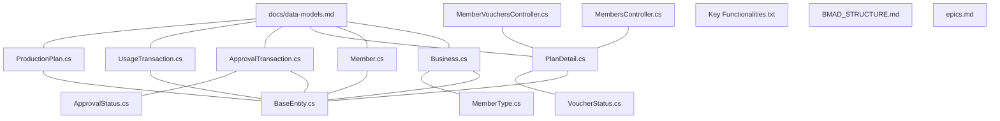
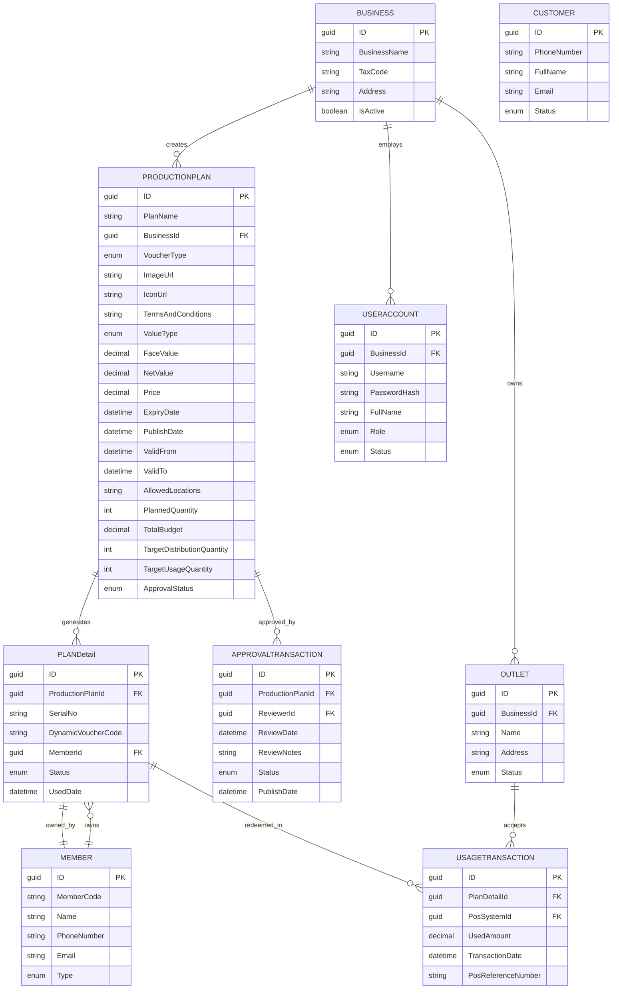
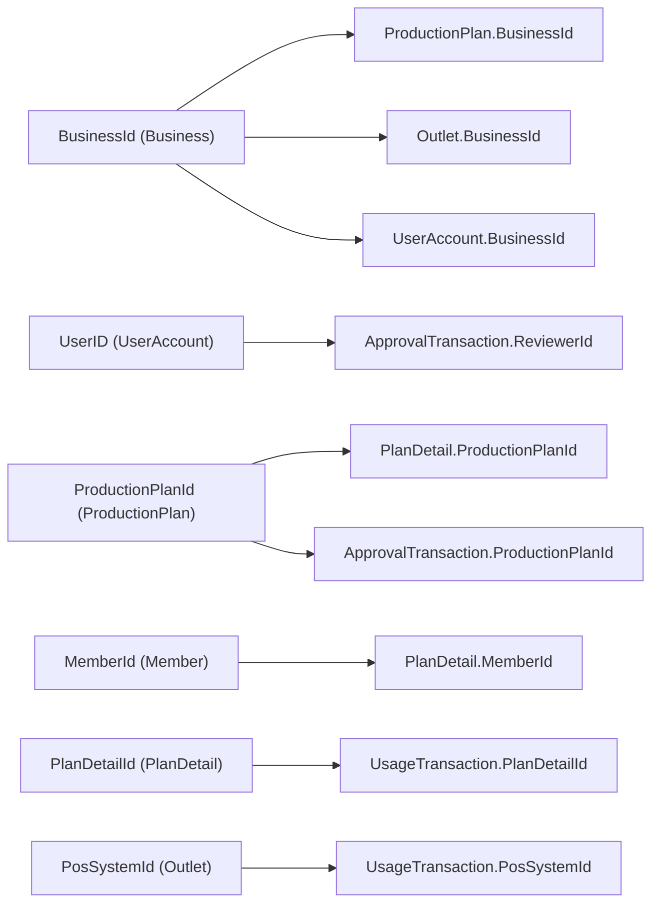

# Core Business Entities

<cite>
**Referenced Files in This Document**
- [data-models.md](file://docs/data-models.md)
- [Business.cs](file://src/NonCash.Core/Entities/Business.cs)
- [Member.cs](file://src/NonCash.Core/Entities/Member.cs)
- [PlanDetail.cs](file://src/NonCash.Core/Entities/PlanDetail.cs)
- [ApprovalTransaction.cs](file://src/NonCash.Core/Entities/ApprovalTransaction.cs)
- [UsageTransaction.cs](file://src/NonCash.Core/Entities/UsageTransaction.cs)
- [ProductionPlan.cs](file://src/NonCash.Core/Entities/ProductionPlan.cs)
- [BaseEntity.cs](file://src/NonCash.Core/Entities/Base/BaseEntity.cs)
- [MemberType.cs](file://src/NonCash.Shared/Enums/MemberType.cs)
- [VoucherStatus.cs](file://src/NonCash.Shared/Enums/VoucherStatus.cs)
- [ApprovalStatus.cs](file://src/NonCash.Shared/Enums/ApprovalStatus.cs)
- [MembersController.cs](file://src/NonCash.API/Controllers/MembersController.cs)
- [MemberVouchersController.cs](file://src/NonCash.API/Controllers/MemberVouchersController.cs)
- [Key Functionalities.txt](file://Key Functionalities.txt)
- [BMAD_STRUCTURE.md](file://BMAD_STRUCTURE.md)
- [epics.md](file://_bmad-output/planning-artifacts/epics.md)
</cite>

## Update Summary
**Changes Made**
- Added new core business entities: Business, Member, PlanDetail, ApprovalTransaction, and UsageTransaction
- Updated production planning model to use ProductionPlan instead of VoucherPlanHeader
- Enhanced voucher lifecycle with detailed status tracking and approval workflows
- Integrated member-based voucher ownership and transfer capabilities
- Added POS transaction tracking for redemption monitoring

## Table of Contents
1. [Introduction](#introduction)
2. [Project Structure](#project-structure)
3. [Core Components](#core-components)
4. [Architecture Overview](#architecture-overview)
5. [Detailed Component Analysis](#detailed-component-analysis)
6. [Dependency Analysis](#dependency-analysis)
7. [Performance Considerations](#performance-considerations)
8. [Troubleshooting Guide](#troubleshooting-guide)
9. [Conclusion](#conclusion)
10. [Appendices](#appendices)

## Introduction
This document defines the core business entities that underpin the NonCash platform's enhanced voucher lifecycle and tenant-aware operations. The platform now features an improved production planning model with detailed approval workflows and comprehensive member-based voucher management. The core entities include:

- **ProductionPlan** (Enhanced Production Planning)
- **PlanDetail** (Individual Voucher Records)
- **Business** (Multi-tenant organization)
- **Member** (Customer/Organization accounts)
- **ApprovalTransaction** (Approval workflow tracking)
- **UsageTransaction** (POS redemption tracking)
- **Outlet** (POS locations)
- **UserAccount** (back-office users)
- **Customer** (end-users)

These entities document field definitions, data types, primary keys, foreign key relationships, business constraints, and validation rules derived from the repository's enhanced data model and functional specifications.

## Project Structure
The enhanced data model and business context are documented across multiple files:

- **docs/data-models.md**: Defines the core entities and their attributes
- **src/NonCash.Core/Entities/**: Contains all entity definitions with navigation properties
- **src/NonCash.Shared/Enums/**: Defines shared enumeration types
- **src/NonCash.API/Controllers/**: Demonstrates entity usage in API endpoints
- **Key Functionalities.txt**: Describes production planning, approval workflows, and distribution processes
- **BMAD_STRUCTURE.md**: Outlines business objectives and target users
- **_bmad-output/planning-artifacts/epics.md**: Captures epics and acceptance criteria

```mermaid
graph TB
DM["docs/data-models.md"]
BE["Business.cs"]
ME["Member.cs"]
PD["PlanDetail.cs"]
AT["ApprovalTransaction.cs"]
UT["UsageTransaction.cs"]
PP["ProductionPlan.cs"]
BASE["BaseEntity.cs"]
MT["MemberType.cs"]
VS["VoucherStatus.cs"]
AS["ApprovalStatus.cs"]
MC["MembersController.cs"]
MVC["MemberVouchersController.cs"]
KF["Key Functionalities.txt"]
BS["BMAD_STRUCTURE.md"]
EP["epics.md"]
DM --- BE
DM --- ME
DM --- PD
DM --- AT
DM --- UT
DM --- PP
BE --- BASE
ME --- BASE
PD --- BASE
AT --- BASE
UT --- BASE
PP --- BASE
BE --- MT
PD --- VS
AT --- AS
MC --- PD
MVC --- PD
```

**Diagram sources**
- [data-models.md:1-98](file://docs/data-models.md#L1-L98)
- [Business.cs:1-14](file://src/NonCash.Core/Entities/Business.cs#L1-L14)
- [Member.cs:1-16](file://src/NonCash.Core/Entities/Member.cs#L1-L16)
- [PlanDetail.cs:1-29](file://src/NonCash.Core/Entities/PlanDetail.cs#L1-L29)
- [ApprovalTransaction.cs:1-24](file://src/NonCash.Core/Entities/ApprovalTransaction.cs#L1-L24)
- [UsageTransaction.cs:1-22](file://src/NonCash.Core/Entities/UsageTransaction.cs#L1-L22)
- [ProductionPlan.cs:1-70](file://src/NonCash.Core/Entities/ProductionPlan.cs#L1-L70)
- [BaseEntity.cs:1-12](file://src/NonCash.Core/Entities/Base/BaseEntity.cs#L1-L12)
- [MemberType.cs:1-9](file://src/NonCash.Shared/Enums/MemberType.cs#L1-L9)
- [VoucherStatus.cs:1-10](file://src/NonCash.Shared/Enums/VoucherStatus.cs#L1-L10)
- [ApprovalStatus.cs:1-10](file://src/NonCash.Shared/Enums/ApprovalStatus.cs#L1-L10)
- [MembersController.cs:1-79](file://src/NonCash.API/Controllers/MembersController.cs#L1-L79)
- [MemberVouchersController.cs:1-73](file://src/NonCash.API/Controllers/MemberVouchersController.cs#L1-L73)

**Section sources**
- [data-models.md:1-98](file://docs/data-models.md#L1-L98)
- [Business.cs:1-14](file://src/NonCash.Core/Entities/Business.cs#L1-L14)
- [Member.cs:1-16](file://src/NonCash.Core/Entities/Member.cs#L1-L16)
- [PlanDetail.cs:1-29](file://src/NonCash.Core/Entities/PlanDetail.cs#L1-L29)
- [ApprovalTransaction.cs:1-24](file://src/NonCash.Core/Entities/ApprovalTransaction.cs#L1-L24)
- [UsageTransaction.cs:1-22](file://src/NonCash.Core/Entities/UsageTransaction.cs#L1-L22)
- [ProductionPlan.cs:1-70](file://src/NonCash.Core/Entities/ProductionPlan.cs#L1-L70)
- [BaseEntity.cs:1-12](file://src/NonCash.Core/Entities/Base/BaseEntity.cs#L1-L12)
- [MemberType.cs:1-9](file://src/NonCash.Shared/Enums/MemberType.cs#L1-L9)
- [VoucherStatus.cs:1-10](file://src/NonCash.Shared/Enums/VoucherStatus.cs#L1-L10)
- [ApprovalStatus.cs:1-10](file://src/NonCash.Shared/Enums/ApprovalStatus.cs#L1-L10)
- [MembersController.cs:1-79](file://src/NonCash.API/Controllers/MembersController.cs#L1-L79)
- [MemberVouchersController.cs:1-73](file://src/NonCash.API/Controllers/MemberVouchersController.cs#L1-L73)

## Core Components
This section summarizes each entity's purpose, attributes, and constraints as defined in the enhanced repository materials.

### Enhanced Production Planning Model

**ProductionPlan** (Enhanced Production Planning)
- **Purpose**: Comprehensive voucher production planning with approval workflows and detailed campaign management
- **Primary Key**: ID (GUID)
- **Foreign Key**: BusinessId (Business)
- **Attributes and Types**: PlanName (String), BusinessId (GUID), VoucherType (Enum), ImageUrl/IconUrl (String), TermsAndConditions (String), ValueType (Enum), FaceValue/NetValue/Price (Decimal), ExpiryDate/PublishDate/ValidFrom/ValidTo (DateTime?), AllowedLocations (String), PlannedQuantity (Integer), TotalBudget (Decimal), TargetDistributionQuantity/TargetUsageQuantity (Integer), ApprovalStatus (Enum)
- **Business Constraints**:
  - ApprovalStatus governs lifecycle transitions (Pending → Approved/Rejected)
  - PublishDate controls availability; ExpiryDate enforces hard expiry
  - Budget and quantity targets support financial planning
  - Navigation properties link to PlanDetail and ApprovalTransaction collections

**PlanDetail** (Individual Voucher Records)
- **Purpose**: Individual voucher instance with detailed status tracking and member ownership
- **Primary Key**: ID (GUID)
- **Foreign Keys**: ProductionPlanId (ProductionPlan), MemberId (Member)
- **Attributes and Types**: SerialNo (String), DynamicVoucherCode (String), MemberId (GUID?), Status (Enum), UsedDate (DateTime?)
- **Business Constraints**:
  - Status drives lifecycle (Pending → In-Use → Complete)
  - MemberId links ownership to either Customer or Organization members
  - DynamicVoucherCode enables secure redemption with flexible encoding

**ApprovalTransaction** (Approval Workflow Tracking)
- **Purpose**: Detailed audit trail of approval decisions and reviewer actions
- **Primary Key**: ID (GUID)
- **Foreign Keys**: ProductionPlanId (ProductionPlan), ReviewerId (UserAccount)
- **Attributes and Types**: ReviewerId (GUID), ReviewDate (DateTime), ReviewNotes (String), Status (Enum), PublishDate (DateTime?)
- **Business Constraints**:
  - Maintains historical record of all approval decisions
  - Supports traceability for rejected plans requiring resubmission
  - Enables audit trail for compliance and reporting

**UsageTransaction** (POS Redemption Tracking)
- **Purpose**: Comprehensive POS transaction logging for redemption monitoring
- **Primary Key**: ID (GUID)
- **Foreign Keys**: PlanDetailId (PlanDetail), PosSystemId (Outlet)
- **Attributes and Types**: PlanDetailId (GUID), PosSystemId (GUID), UsedAmount (Decimal), TransactionDate (DateTime), PosReferenceNumber (String)
- **Business Constraints**:
  - Links POS transactions to specific voucher instances
  - Supports reconciliation and audit requirements
  - Enables real-time redemption monitoring

### Core Business Entities

**Business** (Multi-Tenant Organization)
- **Purpose**: Enhanced tenant representation with comprehensive business information
- **Primary Key**: ID (GUID)
- **Attributes and Types**: BusinessName (String), TaxCode (String), Address (String), IsActive (Boolean)
- **Business Constraints**:
  - IsActive flag controls tenant activation status
  - Supports multi-tenant isolation and resource management

**Member** (Customer/Organization Accounts)
- **Purpose**: Unified membership system supporting both individual customers and organizational accounts
- **Primary Key**: ID (GUID)
- **Attributes and Types**: MemberCode (String), Name (String), PhoneNumber (String), Email (String), Type (Enum)
- **Business Constraints**:
  - MemberType distinguishes between Customer (0) and Organization (1)
  - PhoneNumber serves as primary identifier for account linking
  - Supports both personal and business voucher ownership

**Outlet** (Point of Sale / Store)
- **Purpose**: Physical or digital store under a Business eligible to accept vouchers
- **Primary Key**: ID (GUID)
- **Foreign Key**: BusinessId (Business)
- **Attributes and Types**: Name (String), Address (String), Status (Enum)
- **Business Constraints**:
  - Status governs Active/Closed state
  - AllowedLocations in ProductionPlan references Outlet IDs for usage restrictions

**UserAccount** (Back-office Users)
- **Purpose**: Platform users with roles for planning, reviewing, and approving production plans
- **Primary Key**: ID (GUID)
- **Foreign Key**: BusinessId (Business), nullable for system super-admins
- **Attributes and Types**: Username (String), PasswordHash (String), FullName (String), Role (Enum), Status (Enum)
- **Business Constraints**:
  - Role determines access rights (Admin/Planner/Approver)
  - BusinessId scopes users to a tenant (nullable for system-wide roles)

**Customer** (End-User / App Member)
- **Purpose**: Individual end-users who receive and redeem vouchers
- **Primary Key**: ID (GUID)
- **Attributes and Types**: PhoneNumber (String), FullName (String), Email (String), Status (Enum)
- **Business Constraints**:
  - PhoneNumber is the primary identifier for transfers/logins
  - Status governs Active/Blacklisted state

**Section sources**
- [ProductionPlan.cs:8-68](file://src/NonCash.Core/Entities/ProductionPlan.cs#L8-L68)
- [PlanDetail.cs:7-27](file://src/NonCash.Core/Entities/PlanDetail.cs#L7-L27)
- [ApprovalTransaction.cs:7-22](file://src/NonCash.Core/Entities/ApprovalTransaction.cs#L7-L22)
- [UsageTransaction.cs:6-20](file://src/NonCash.Core/Entities/UsageTransaction.cs#L6-L20)
- [Business.cs:6-12](file://src/NonCash.Core/Entities/Business.cs#L6-L12)
- [Member.cs:7-14](file://src/NonCash.Core/Entities/Member.cs#L7-L14)
- [data-models.md:9-97](file://docs/data-models.md#L9-L97)

## Architecture Overview
The enhanced entities form a comprehensive domain model supporting advanced multi-tenancy, detailed approval workflows, and comprehensive voucher lifecycle management.

```mermaid
erDiagram
BUSINESS {
guid ID PK
string BusinessName
string TaxCode
string Address
boolean IsActive
}
MEMBER {
guid ID PK
string MemberCode
string Name
string PhoneNumber
string Email
enum Type
}
PRODUCTIONPLAN {
guid ID PK
string PlanName
guid BusinessId FK
enum VoucherType
string ImageUrl
string IconUrl
string TermsAndConditions
enum ValueType
decimal FaceValue
decimal NetValue
decimal Price
datetime ExpiryDate
datetime PublishDate
datetime ValidFrom
datetime ValidTo
string AllowedLocations
int PlannedQuantity
decimal TotalBudget
int TargetDistributionQuantity
int TargetUsageQuantity
enum ApprovalStatus
}
PLANDetail {
guid ID PK
guid ProductionPlanId FK
string SerialNo
string DynamicVoucherCode
guid MemberId FK
enum Status
datetime UsedDate
}
APPROVALTRANSACTION {
guid ID PK
guid ProductionPlanId FK
guid ReviewerId FK
datetime ReviewDate
string ReviewNotes
enum Status
datetime PublishDate
}
USAGETRANSACTION {
guid ID PK
guid PlanDetailId FK
guid PosSystemId FK
decimal UsedAmount
datetime TransactionDate
string PosReferenceNumber
}
OUTLET {
guid ID PK
guid BusinessId FK
string Name
string Address
enum Status
}
USERACCOUNT {
guid ID PK
guid BusinessId FK
string Username
string PasswordHash
string FullName
enum Role
enum Status
}
CUSTOMER {
guid ID PK
string PhoneNumber
string FullName
string Email
enum Status
}
PRODUCTIONPLAN ||--o{ PLANDetail : "generates"
PRODUCTIONPLAN ||--o{ APPROVALTRANSACTION : "approved_by"
PLANDetail ||--|| MEMBER : "owned_by"
PLANDetail ||--o{ USAGETRANSACTION : "redeemed_in"
BUSINESS ||--o{ PRODUCTIONPLAN : "creates"
BUSINESS ||--o{ OUTLET : "owns"
BUSINESS ||--o{ USERACCOUNT : "employs"
MEMBER ||--o{ PLANDetail : "owns"
OUTLET ||--o{ USAGETRANSACTION : "accepts"
```

**Diagram sources**
- [ProductionPlan.cs:8-68](file://src/NonCash.Core/Entities/ProductionPlan.cs#L8-L68)
- [PlanDetail.cs:7-27](file://src/NonCash.Core/Entities/PlanDetail.cs#L7-L27)
- [ApprovalTransaction.cs:7-22](file://src/NonCash.Core/Entities/ApprovalTransaction.cs#L7-L22)
- [UsageTransaction.cs:6-20](file://src/NonCash.Core/Entities/UsageTransaction.cs#L6-L20)
- [Business.cs:6-12](file://src/NonCash.Core/Entities/Business.cs#L6-L12)
- [Member.cs:7-14](file://src/NonCash.Core/Entities/Member.cs#L7-L14)
- [data-models.md:9-97](file://docs/data-models.md#L9-L97)

## Detailed Component Analysis

### Enhanced Production Planning Model

#### ProductionPlan (Enhanced Production Planning)
- **Purpose**: Comprehensive voucher production planning encompassing strategy, approval workflows, and operational details
- **Key Fields**:
  - ID (Primary Key)
  - BusinessId (Foreign Key to Business)
  - PlanName (Unique campaign identifier)
  - VoucherType (Enum: Complimentary, Gift)
  - ValueType (Enum: Value, Percentage)
  - FaceValue/NetValue/Price (Decimal values)
  - ExpiryDate/PublishDate/ValidFrom/ValidTo (DateTime ranges)
  - AllowedLocations (JSON/string containing outlet restrictions)
  - PlannedQuantity/TotalBudget (Integers/Decimals)
  - TargetDistributionQuantity/TargetUsageQuantity (Integers)
  - ApprovalStatus (Enum: Pending, Approved, Rejected)
- **Business Logic**:
  - Central hub for voucher campaign management
  - ApprovalStatus governs plan progression and distribution eligibility
  - Time-based constraints control campaign availability and validity
  - Financial targets support budget planning and ROI tracking
  - Navigation properties enable comprehensive reporting and audit trails

**Updated** Enhanced from VoucherPlanHeader with comprehensive approval workflow and detailed operational fields

Validation Rules:
- BusinessId must reference an existing Business
- FaceValue ≥ 0, NetValue ≥ 0, Price ≥ 0
- ExpiryDate ≥ PublishDate (when both provided)
- ValidFrom ≤ ValidTo (when both provided)
- PlannedQuantity ≥ 0
- TotalBudget ≥ 0
- TargetDistributionQuantity ≥ 0
- TargetUsageQuantity ≥ 0

Sample Data Example:
- ID: [GUID]
- PlanName: "[Campaign Name]"
- BusinessId: [GUID]
- VoucherType: Complimentary or Gift
- ValueType: Value or Percentage
- FaceValue: [Decimal]
- NetValue: [Decimal]
- Price: [Decimal]
- ExpiryDate: [DateTime or null]
- PublishDate: [DateTime or null]
- ValidFrom: [DateTime or null]
- ValidTo: [DateTime or null]
- AllowedLocations: "[JSON/CSV string]"
- PlannedQuantity: [Integer]
- TotalBudget: [Decimal]
- TargetDistributionQuantity: [Integer]
- TargetUsageQuantity: [Integer]
- ApprovalStatus: Pending or Approved or Rejected

**Section sources**
- [ProductionPlan.cs:8-68](file://src/NonCash.Core/Entities/ProductionPlan.cs#L8-L68)

#### PlanDetail (Individual Voucher Records)
- **Purpose**: Detailed individual voucher instance with comprehensive status tracking and member ownership
- **Key Fields**:
  - ID (Primary Key)
  - ProductionPlanId (Foreign Key to ProductionPlan)
  - SerialNo (Unique external identifier)
  - DynamicVoucherCode (Secure dynamic code for redemption)
  - MemberId (Foreign Key to Member, nullable)
  - Status (Enum: Pending, In-Use, Complete)
  - UsedDate (DateTime, nullable)
- **Business Logic**:
  - Lifecycle: Pending → In-Use → Complete based on Status
  - MemberId assignment enables ownership tracking for both customers and organizations
  - DynamicVoucherCode supports secure, time-limited redemption codes
  - Status changes trigger business rule validations and notifications

**Updated** Enhanced from VoucherPlanDetail with improved status tracking and member ownership

Validation Rules:
- ProductionPlanId must reference an existing ProductionPlan
- MemberId must reference an existing Member (when assigned)
- Status must be Pending/In-Use/Complete
- UsedDate must be present when Status is Complete
- SerialNo must be unique within ProductionPlan scope

Sample Data Example:
- ID: [GUID]
- ProductionPlanId: [GUID]
- SerialNo: "[Unique String]"
- DynamicVoucherCode: "[Dynamic Code]"
- MemberId: [GUID or null]
- Status: Pending or In-Use or Complete
- UsedDate: [DateTime or null]

**Section sources**
- [PlanDetail.cs:7-27](file://src/NonCash.Core/Entities/PlanDetail.cs#L7-L27)

#### ApprovalTransaction (Approval Workflow Tracking)
- **Purpose**: Comprehensive audit trail of approval decisions and reviewer actions
- **Key Fields**:
  - ID (Primary Key)
  - ProductionPlanId (Foreign Key to ProductionPlan)
  - ReviewerId (GUID)
  - ReviewDate (DateTime)
  - ReviewNotes (String)
  - Status (Enum: Pending, Approved, Rejected)
  - PublishDate (DateTime, nullable for adjustments)
- **Business Logic**:
  - Maintains immutable approval history for compliance
  - Supports traceability for rejected plans requiring resubmission
  - Enables audit trail for regulatory and internal reviews
  - Allows publish date adjustments for approved plans

**New Entity** Added to track detailed approval workflows and decision history

Validation Rules:
- ProductionPlanId must reference an existing ProductionPlan
- ReviewerId must reference an existing UserAccount
- ReviewDate defaults to current UTC time
- Status must be Pending/Approved/Rejected
- PublishDate can only be set for Approved statuses

Sample Data Example:
- ID: [GUID]
- ProductionPlanId: [GUID]
- ReviewerId: [GUID]
- ReviewDate: [DateTime]
- ReviewNotes: "[Reviewer comments]"
- Status: Pending or Approved or Rejected
- PublishDate: [DateTime or null]

**Section sources**
- [ApprovalTransaction.cs:7-22](file://src/NonCash.Core/Entities/ApprovalTransaction.cs#L7-L22)

#### UsageTransaction (POS Redemption Tracking)
- **Purpose**: Detailed POS transaction logging for comprehensive redemption monitoring
- **Key Fields**:
  - ID (Primary Key)
  - PlanDetailId (Foreign Key to PlanDetail)
  - PosSystemId (GUID)
  - UsedAmount (Decimal)
  - TransactionDate (DateTime)
  - PosReferenceNumber (String)
- **Business Logic**:
  - Links POS transactions to specific voucher instances
  - Supports reconciliation and audit requirements
  - Enables real-time redemption monitoring and reporting
  - Provides POS system integration points

**New Entity** Added to track detailed POS redemption activities

Validation Rules:
- PlanDetailId must reference an existing PlanDetail
- PosSystemId must reference an existing Outlet
- UsedAmount must be positive and ≤ PlanDetail.FaceValue
- TransactionDate defaults to current UTC time
- PosReferenceNumber must be unique per transaction

Sample Data Example:
- ID: [GUID]
- PlanDetailId: [GUID]
- PosSystemId: [GUID]
- UsedAmount: [Decimal]
- TransactionDate: [DateTime]
- PosReferenceNumber: "[POS Reference]"

**Section sources**
- [UsageTransaction.cs:6-20](file://src/NonCash.Core/Entities/UsageTransaction.cs#L6-L20)

### Core Business Entities

#### Business (Enhanced Multi-Tenant Organization)
- **Purpose**: Comprehensive tenant representation with business information management
- **Key Fields**:
  - ID (Primary Key)
  - BusinessName, TaxCode, Address
  - IsActive (Boolean flag)
- **Business Logic**:
  - Controls tenant activation and deactivation
  - Supports multi-tenant isolation and resource management
  - Provides business contact and identification information

**Updated** Enhanced from Brand with comprehensive business information fields

Validation Rules:
- BusinessName must be non-empty
- TaxCode must be unique per tenant
- IsActive must be boolean value

Sample Data Example:
- ID: [GUID]
- BusinessName: "[Business Name]"
- TaxCode: "[Tax Identifier]"
- Address: "[Business Address]"
- IsActive: true or false

**Section sources**
- [Business.cs:6-12](file://src/NonCash.Core/Entities/Business.cs#L6-L12)

#### Member (Unified Customer/Organization Accounts)
- **Purpose**: Unified membership system supporting both individual customers and organizational accounts
- **Key Fields**:
  - ID (Primary Key)
  - MemberCode, Name, PhoneNumber, Email
  - Type (Enum: Customer=0, Organization=1)
- **Business Logic**:
  - MemberType distinguishes between individual and organizational accounts
  - PhoneNumber serves as primary identifier for account linking
  - Supports both personal and business voucher ownership scenarios
  - Enables flexible distribution and transfer workflows

**New Entity** Added to unify customer and organizational account management

Validation Rules:
- MemberCode must be unique
- PhoneNumber must be unique
- Type must be Customer or Organization
- Email format validation (when provided)

Sample Data Example:
- ID: [GUID]
- MemberCode: "[Unique Member Code]"
- Name: "[Full Name or Organization Name]"
- PhoneNumber: "[Phone Number]"
- Email: "[Email Address]"
- Type: Customer or Organization

**Section sources**
- [Member.cs:7-14](file://src/NonCash.Core/Entities/Member.cs#L7-L14)

#### Outlet (Enhanced POS Locations)
- **Purpose**: Physical or digital store under a Business eligible to accept vouchers
- **Key Fields**:
  - ID (Primary Key)
  - BusinessId (Foreign Key to Business)
  - Name, Address
  - Status (Enum)
- **Business Logic**:
  - Status governs Active/Closed state
  - AllowedLocations in ProductionPlan references Outlet IDs for usage restrictions
  - Supports geographic and operational store management

**Updated** Enhanced from Outlet with improved business association

Validation Rules:
- BusinessId must reference an existing Business
- Status must be Active or Closed
- Name must be non-empty

Sample Data Example:
- ID: [GUID]
- BusinessId: [GUID]
- Name: "[Store Name]"
- Address: "[Full Address]"
- Status: Active or Closed

**Section sources**
- [data-models.md:73-79](file://docs/data-models.md#L73-L79)

#### UserAccount (Enhanced Back-Office Users)
- **Purpose**: Platform users with enhanced roles for planning, reviewing, and approving production plans
- **Key Fields**:
  - ID (Primary Key)
  - BusinessId (Foreign Key to Business, nullable)
  - Username, PasswordHash, FullName
  - Role (Enum), Status (Enum)
- **Business Logic**:
  - Role determines access rights (Admin/Planner/Approver)
  - BusinessId scopes users to a tenant (nullable for system-wide roles)
  - Enhanced security with password hashing and role-based access control

**Updated** Enhanced from UserAccount with improved business scoping

Validation Rules:
- Role must be Admin/Planner/Approver
- Status must be Active/Locked
- Username must be unique
- BusinessId can be null for system administrators

Sample Data Example:
- ID: [GUID]
- BusinessId: [GUID or null]
- Username: "[Unique Username]"
- PasswordHash: "[Hashed Value]"
- FullName: "[Full Name]"
- Role: Admin or Planner or Approver
- Status: Active or Locked

**Section sources**
- [data-models.md:81-89](file://docs/data-models.md#L81-L89)

#### Customer (Enhanced End-Users)
- **Purpose**: Individual end-users who receive and redeem vouchers
- **Key Fields**:
  - ID (Primary Key)
  - PhoneNumber (Primary identifier), FullName, Email
  - Status (Enum)
- **Business Logic**:
  - PhoneNumber is the primary identifier for transfers and logins
  - Status governs Active/Blacklisted state
  - Supports individual customer management and communication

**Updated** Enhanced from Customer with improved status management

Validation Rules:
- PhoneNumber must be unique
- Status must be Active or Blacklisted

Sample Data Example:
- ID: [GUID]
- PhoneNumber: "[Phone Number]"
- FullName: "[Full Name]"
- Email: "[Email Address]"
- Status: Active or Blacklisted

**Section sources**
- [data-models.md:91-97](file://docs/data-models.md#L91-L97)

## Dependency Analysis
Enhanced entity relationships and comprehensive referential integrity constraints:

```mermaid
graph LR
BusinessId["BusinessId (Business)"] --> ProductionPlanBusiness["ProductionPlan.BusinessId"]
BusinessId --> OutletBusiness["Outlet.BusinessId"]
BusinessId --> UserAccountBusiness["UserAccount.BusinessId"]
UserID["UserID (UserAccount)"] --> ApprovalTransactionReviewer["ApprovalTransaction.ReviewerId"]
ProductionPlanId["ProductionPlanId (ProductionPlan)"] --> PlanDetailProductionPlan["PlanDetail.ProductionPlanId"]
ProductionPlanId --> ApprovalTransactionProductionPlan["ApprovalTransaction.ProductionPlanId"]
MemberId["MemberId (Member)"] --> PlanDetailMember["PlanDetail.MemberId"]
PlanDetailId["PlanDetailId (PlanDetail)"] --> UsageTransactionPlanDetail["UsageTransaction.PlanDetailId"]
PosSystemId["PosSystemId (Outlet)"] --> UsageTransactionPosSystem["UsageTransaction.PosSystemId"]
```

**Updated** Enhanced dependency graph to include new entities and relationships

**Diagram sources**
- [ProductionPlan.cs:14-15](file://src/NonCash.Core/Entities/ProductionPlan.cs#L14-L15)
- [PlanDetail.cs:10-21](file://src/NonCash.Core/Entities/PlanDetail.cs#L10-L21)
- [ApprovalTransaction.cs:9-13](file://src/NonCash.Core/Entities/ApprovalTransaction.cs#L9-L13)
- [UsageTransaction.cs:9-12](file://src/NonCash.Core/Entities/UsageTransaction.cs#L9-L12)

**Section sources**
- [ProductionPlan.cs:8-68](file://src/NonCash.Core/Entities/ProductionPlan.cs#L8-L68)
- [PlanDetail.cs:7-27](file://src/NonCash.Core/Entities/PlanDetail.cs#L7-L27)
- [ApprovalTransaction.cs:7-22](file://src/NonCash.Core/Entities/ApprovalTransaction.cs#L7-L22)
- [UsageTransaction.cs:6-20](file://src/NonCash.Core/Entities/UsageTransaction.cs#L6-L20)

## Performance Considerations
Enhanced indexing recommendations for the expanded entity model:

- **ProductionPlan**: BusinessId, ApprovalStatus, PublishDate, ExpiryDate, VoucherType, ValueType
- **PlanDetail**: ProductionPlanId, MemberId, Status, SerialNo
- **ApprovalTransaction**: ProductionPlanId, ReviewerId, Status, ReviewDate
- **UsageTransaction**: PlanDetailId, PosSystemId, TransactionDate, UsedAmount
- **Business**: BusinessName, TaxCode, IsActive
- **Member**: MemberCode, PhoneNumber, Type
- **Outlet**: BusinessId, Status, Name
- **UserAccount**: BusinessId, Role, Status, Username
- **Customer**: PhoneNumber, Status, Name

Query patterns:
- Production plan reporting by Business and time range
- Redemption analytics by Outlet and POS system
- Distribution funnel analysis by Member type and transaction type
- Approval workflow tracking and audit reporting

Data partitioning:
- Consider partitioning by BusinessId for multi-tenant isolation
- Implement time-based partitioning for UsageTransaction historical data
- Separate approval workflow data for compliance retention

## Troubleshooting Guide
Enhanced troubleshooting for the expanded entity model:

**Production Planning Issues**
- **Invalid ApprovalStatus Transition**
  - Symptom: Plan cannot proceed beyond Pending
  - Resolution: Ensure ApprovalTransaction exists with Approved status and ReviewDate set
- **Plan Outside AllowedLocations**
  - Symptom: Voucher cannot be used at selected POS
  - Resolution: Verify Outlet ID exists and is included in ProductionPlan.AllowedLocations
- **ExpiryDate Before PublishDate**
  - Symptom: Plan invalid or distribution blocked
  - Resolution: Set ExpiryDate ≥ PublishDate (when both provided)

**Voucher Lifecycle Issues**
- **Invalid Status Transition**
  - Symptom: Voucher cannot change state
  - Resolution: Ensure proper ApprovalTransaction approval and valid status progression
- **Member Ownership Conflicts**
  - Symptom: Voucher transfer or redemption blocked
  - Resolution: Verify Member.Type matches intended usage pattern (Customer vs Organization)
- **POS Redemption Failures**
  - Symptom: POS transaction not recorded
  - Resolution: Confirm UsageTransaction.PosReferenceNumber uniqueness and PlanDetail.Status validation

**Member Management Issues**
- **Duplicate Member Registration**
  - Symptom: Member creation fails
  - Resolution: Verify MemberCode and PhoneNumber uniqueness
- **Business Association Errors**
  - Symptom: Member cannot access Business resources
  - Resolution: Confirm Business.IsActive and proper BusinessId assignment

**Section sources**
- [ProductionPlan.cs:8-68](file://src/NonCash.Core/Entities/ProductionPlan.cs#L8-L68)
- [PlanDetail.cs:7-27](file://src/NonCash.Core/Entities/PlanDetail.cs#L7-L27)
- [ApprovalTransaction.cs:7-22](file://src/NonCash.Core/Entities/ApprovalTransaction.cs#L7-L22)
- [UsageTransaction.cs:6-20](file://src/NonCash.Core/Entities/UsageTransaction.cs#L6-L20)
- [Member.cs:7-14](file://src/NonCash.Core/Entities/Member.cs#L7-L14)
- [Business.cs:6-12](file://src/NonCash.Core/Entities/Business.cs#L6-L12)

## Conclusion
The NonCash platform's enhanced core entities define a comprehensive, multi-tenant domain model for advanced voucher lifecycle management. The new ProductionPlan, PlanDetail, ApprovalTransaction, and UsageTransaction entities provide detailed approval workflows, comprehensive audit trails, and sophisticated POS integration. Business and Member entities enable unified tenant and customer management with flexible ownership models. The enhanced data model, combined with robust validation rules and business constraints, ensures data consistency, supports accurate reporting, and maintains compliance across all operational aspects of the voucher ecosystem.

## Appendices

### Business Objectives and Scope
- **Enhanced Production Planning**: Comprehensive campaign management with detailed approval workflows
- **Advanced Member Management**: Unified customer and organizational account handling
- **Detailed Audit Trails**: Complete approval and transaction tracking for compliance
- **POS Integration**: Real-time redemption monitoring and reconciliation
- **Multi-Tenant Isolation**: Secure separation of business operations and data

### API Integration Examples
The new entities integrate seamlessly with existing API controllers:

**Member Management APIs**:
- MembersController: Retrieves member-owned vouchers and plan details
- MemberVouchersController: Handles voucher transfer operations and history tracking

**Enhanced Business Logic**:
- Member-based voucher ownership enables flexible distribution patterns
- ApprovalTransaction provides comprehensive audit trail for compliance
- UsageTransaction supports real-time POS integration and monitoring

**Section sources**
- [MembersController.cs:28-66](file://src/NonCash.API/Controllers/MembersController.cs#L28-L66)
- [MemberVouchersController.cs:19-63](file://src/NonCash.API/Controllers/MemberVouchersController.cs#L19-L63)
- [Key Functionalities.txt:87-111](file://Key Functionalities.txt#L87-L111)
- [BMAD_STRUCTURE.md:5-16](file://BMAD_STRUCTURE.md#L5-L16)
- [epics.md](file://_bmad-output/planning-artifacts/epics.md)