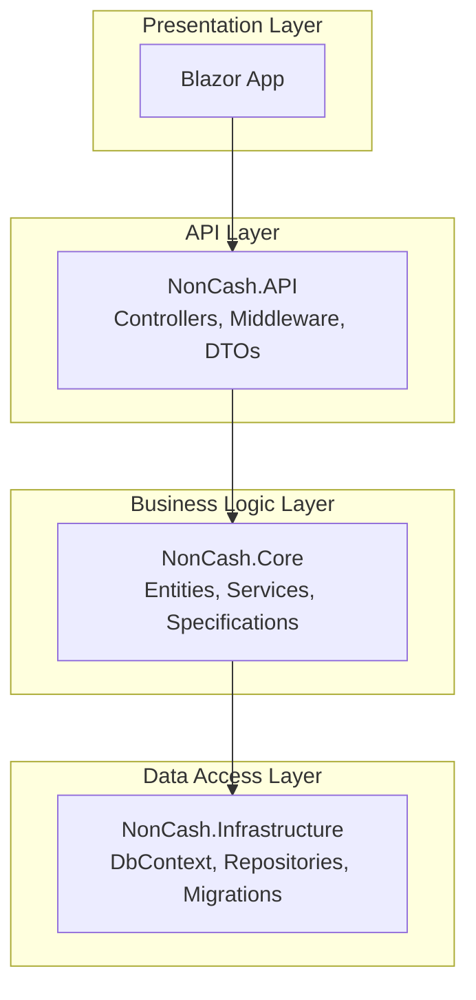
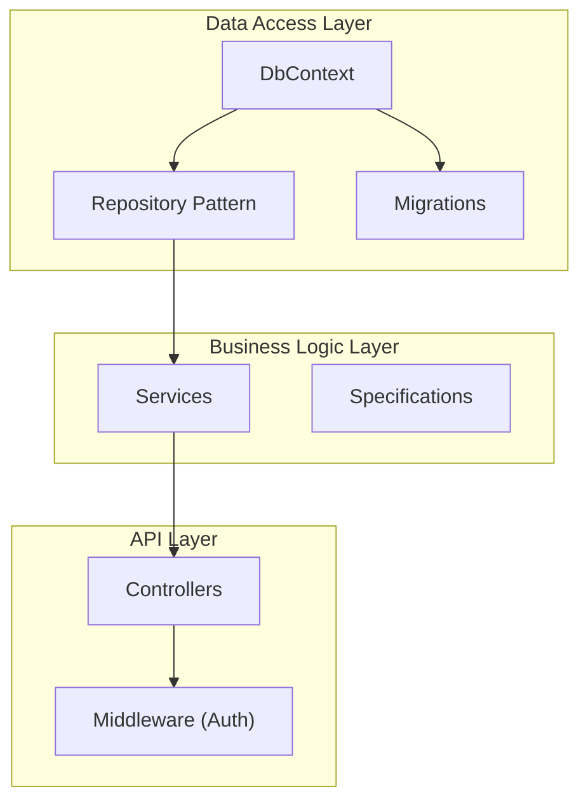
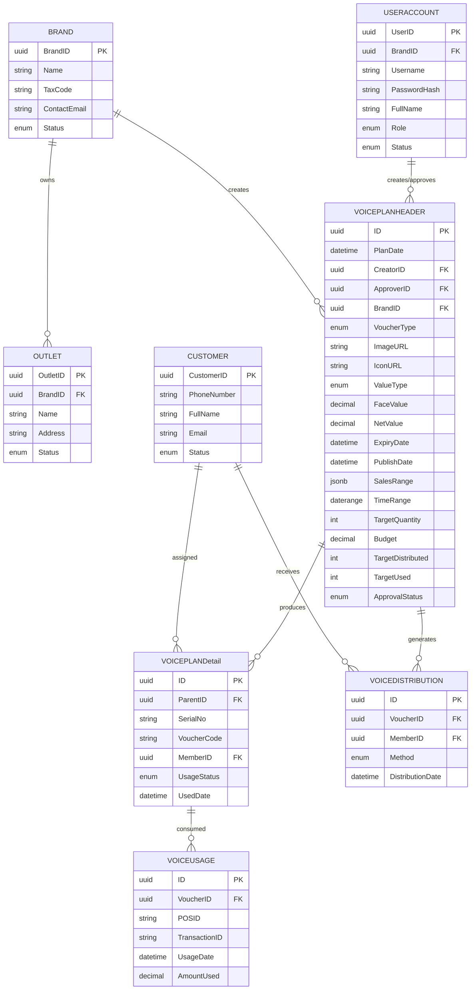
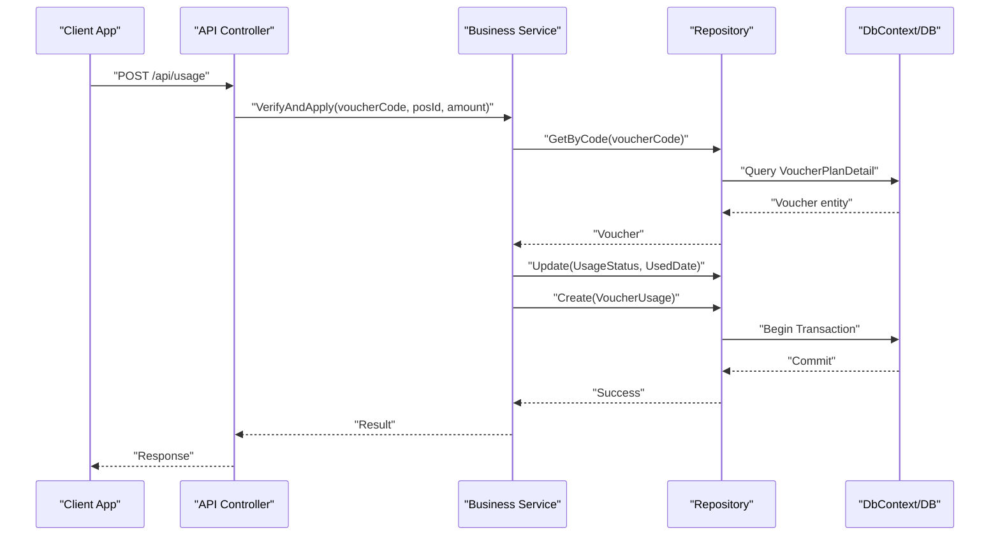
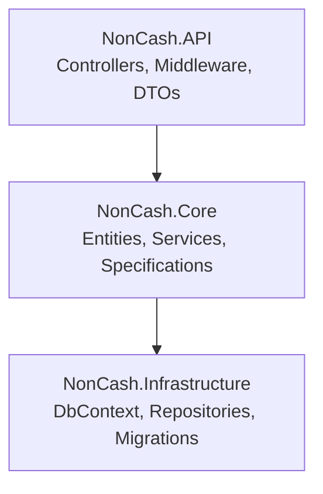

# Data Models and Database Design

<cite>
**Referenced Files in This Document**
- [data-models.md](file://docs/data-models.md)
- [architecture.md](file://docs/architecture.md)
- [source-tree-analysis.md](file://docs/source-tree-analysis.md)
- [Key Functionalities.txt](file://Key Functionalities.txt)
- [description.txt](file://description.txt)
</cite>

## Table of Contents
1. [Introduction](#introduction)
2. [Project Structure](#project-structure)
3. [Core Components](#core-components)
4. [Architecture Overview](#architecture-overview)
5. [Detailed Component Analysis](#detailed-component-analysis)
6. [Dependency Analysis](#dependency-analysis)
7. [Performance Considerations](#performance-considerations)
8. [Troubleshooting Guide](#troubleshooting-guide)
9. [Conclusion](#conclusion)
10. [Appendices](#appendices)

## Introduction
This document provides comprehensive data model documentation for the NonCash platform, focusing on core business entities and the relational database schema. It covers entity definitions, relationships, constraints, and business rules embedded in the schema. It also documents data access patterns using Entity Framework Core, repository pattern implementation, and operational considerations such as lifecycle management, retention, archival, security, privacy, access control, and migration/versioning strategies.

## Project Structure
The NonCash project follows a layered architecture with a clear separation of concerns:
- Data Access Layer (DAL): Implements Entity Framework Core with PostgreSQL and Repository pattern.
- Business Logic Layer (BLL): Encapsulates business rules and microservices.
- Presentation Layer: Blazor-based GUI for management and planning.
- API Layer: RESTful integration for POS usage verification and validation.
- Shared Library: Common DTOs and constants.

**Diagram sources**
- [source-tree-analysis.md:15-28](file://docs/source-tree-analysis.md#L15-L28)

**Section sources**
- [source-tree-analysis.md:1-34](file://docs/source-tree-analysis.md#L1-L34)
- [architecture.md:28-52](file://docs/architecture.md#L28-L52)

## Core Components
This section defines the core entities and their attributes, primary keys, foreign keys, and constraints. The entities are derived from the data models documentation and align with the layered architecture.

- VoucherPlanHeader (Plan Header)
  - Purpose: Captures the strategic plan for a voucher campaign.
  - Key attributes:
    - ID: GUID (Primary Key)
    - PlanDate: DateTime
    - CreatorID: GUID (Foreign Key to UserAccount)
    - ApproverID: GUID (Nullable, Foreign Key to UserAccount)
    - BrandID: GUID (Foreign Key to Brand)
    - VoucherType: Enum (Complimentary, Gift)
    - ImageURL: String
    - IconURL: String
    - ValueType: Enum (Value, Percentage)
    - FaceValue: Decimal
    - NetValue: Decimal
    - ExpiryDate: DateTime
    - PublishDate: DateTime
    - SalesRange: List<OutletID> (Accepted outlet locations)
    - TimeRange: DateRange (Valid from-to)
    - TargetQuantity: Integer
    - Budget: Decimal
    - TargetDistributed: Integer
    - TargetUsed: Integer
    - ApprovalStatus: Enum (Pending, Approved, Rejected)

- VoucherPlanDetail (Voucher Detail)
  - Purpose: Represents individual vouchers generated after plan approval.
  - Key attributes:
    - ID: GUID (Primary Key)
    - ParentID: GUID (Foreign Key to VoucherPlanHeader)
    - SerialNo: String (Unique external ID)
    - VoucherCode: String (Dynamic/JWT-like code for usage)
    - MemberID: GUID (Nullable, Assigned owner)
    - UsageStatus: Enum (Pending, In-Use, Complete)
    - UsedDate: DateTime? (Nullable)

- VoucherUsage
  - Purpose: Stores the history of voucher redemptions at POS.
  - Key attributes:
    - ID: GUID
    - VoucherID: GUID (Foreign Key to VoucherPlanDetail)
    - POSID: String (Redemption location)
    - TransactionID: String (Link to POS transaction)
    - UsageDate: DateTime
    - AmountUsed: Decimal

- VoucherDistribution
  - Purpose: Tracks how vouchers were sent to customers.
  - Key attributes:
    - ID: GUID
    - VoucherID: GUID
    - MemberID: GUID
    - Method: Enum (Sale, Promotion, Transfer)
    - DistributionDate: DateTime

- Brand (Organization / Tenant)
  - Purpose: Represents businesses that create and distribute vouchers.
  - Key attributes:
    - BrandID: GUID (Primary Key)
    - Name: String
    - TaxCode: String
    - ContactEmail: String
    - Status: Enum (Active, Suspended)

- Outlet (Point of Sale / Store)
  - Purpose: Represents physical or digital stores belonging to a Brand.
  - Key attributes:
    - OutletID: GUID (Primary Key)
    - BrandID: GUID (Foreign Key to Brand)
    - Name: String
    - Address: String
    - Status: Enum (Active, Closed)

- UserAccount (Back-office Users)
  - Purpose: Platform access for creating, reviewing, and approving plans.
  - Key attributes:
    - UserID: GUID (Primary Key)
    - BrandID: GUID (Nullable, Foreign Key to Brand)
    - Username: String
    - PasswordHash: String
    - FullName: String
    - Role: Enum (Admin, Planner, Approver)
    - Status: Enum (Active, Locked)

- Customer (End-User / App Member)
  - Purpose: Consumers who hold and use distributed vouchers.
  - Key attributes:
    - CustomerID: GUID (Primary Key)
    - PhoneNumber: String (Primary identifier for transfer/login)
    - FullName: String
    - Email: String
    - Status: Enum (Active, Blacklisted)

Entity relationships and constraints:
- VoucherPlanHeader.ID → VoucherPlanDetail.ParentID (1-to-many)
- VoucherPlanHeader.BrandID → Brand.BrandID (many-to-1)
- VoucherPlanHeader.CreatorID/UserAccount.UserID (many-to-1)
- VoucherPlanHeader.ApproverID → UserAccount.UserID (nullable, many-to-1)
- VoucherPlanDetail.MemberID → Customer.CustomerID (nullable, many-to-1)
- VoucherUsage.VoucherID → VoucherPlanDetail.ID (many-to-1)
- VoucherDistribution.VoucherID → VoucherPlanDetail.ID (many-to-1)
- VoucherDistribution.MemberID → Customer.CustomerID (many-to-1)
- Outlet.BrandID → Brand.BrandID (many-to-1)

**Section sources**
- [data-models.md:9-98](file://docs/data-models.md#L9-L98)
- [Key Functionalities.txt:7-166](file://Key Functionalities.txt#L7-L166)

## Architecture Overview
The NonCash system employs a relational model managed via Entity Framework Core and PostgreSQL. The Data Access Layer uses the Repository pattern to abstract persistence concerns, enabling decoupling from the Business Logic Layer and supporting schema evolution and technology changes.

**Diagram sources**
- [architecture.md:28-52](file://docs/architecture.md#L28-L52)
- [source-tree-analysis.md:15-28](file://docs/source-tree-analysis.md#L15-L28)

**Section sources**
- [architecture.md:28-52](file://docs/architecture.md#L28-L52)
- [source-tree-analysis.md:15-28](file://docs/source-tree-analysis.md#L15-L28)

## Detailed Component Analysis

### Entity Relationship Model
The following ER diagram captures the core entities and their relationships, highlighting primary and foreign keys and cardinalities.

**Diagram sources**
- [data-models.md:9-98](file://docs/data-models.md#L9-L98)

### Data Validation and Business Rules Embedded in Schema
- Multi-tenancy isolation: BrandID ensures tenant boundaries across entities.
- Approval workflow: VoucherPlanHeader tracks ApprovalStatus and links approver via ApproverID.
- Dynamic security: VoucherPlanDetail.VoucherCode is designed as a rotating, JWT-like code to prevent reuse.
- POS integration controls: VoucherUsage records POSID and TransactionID for auditability and reconciliation.
- Outlet acceptance: VoucherPlanHeader.SalesRange restricts voucher usage to designated Outlets.
- Time-bound validity: VoucherPlanHeader.TimeRange and ExpiryDate enforce temporal constraints.
- Distribution tracking: VoucherDistribution.Method categorizes how vouchers reached customers.
- User roles: UserAccount.Role defines access levels (Admin, Planner, Approver).

**Section sources**
- [data-models.md:9-98](file://docs/data-models.md#L9-L98)
- [Key Functionalities.txt:7-166](file://Key Functionalities.txt#L7-L166)
- [architecture.md:36-41](file://docs/architecture.md#L36-L41)

### Data Access Patterns Using Entity Framework Core and Repository Pattern
- DbContext encapsulates all entity sets and manages change tracking and transactions.
- Repository pattern abstracts CRUD operations, enabling testability and technology flexibility.
- Transactions for POS usage ensure atomicity during redemption and updates to dependent entities.
- Migrations manage schema evolution and version control for PostgreSQL.

**Diagram sources**
- [architecture.md:28-52](file://docs/architecture.md#L28-L52)
- [source-tree-analysis.md:15-28](file://docs/source-tree-analysis.md#L15-L28)

**Section sources**
- [architecture.md:28-52](file://docs/architecture.md#L28-L52)
- [source-tree-analysis.md:15-28](file://docs/source-tree-analysis.md#L15-L28)

### Sample Data Examples
Below are representative rows illustrating typical data entries across entities. These examples illustrate relationships and constraints without exposing sensitive information.

- Brand
  - BrandID: [GUID], Name: "The Coffee House", TaxCode: "THC-12345", ContactEmail: "admin@thecoffeehouse.example", Status: Active
- Outlet
  - OutletID: [GUID], BrandID: [Brand GUID], Name: "Downtown Store", Address: "123 Main St", Status: Active
- UserAccount
  - UserID: [GUID], BrandID: [Brand GUID], Username: "planner_user", PasswordHash: "[hash]", FullName: "Jane Planner", Role: Planner, Status: Active
- Customer
  - CustomerID: [GUID], PhoneNumber: "+8490xxxxxxx", FullName: "John Doe", Email: "john.doe@example", Status: Active
- VoucherPlanHeader
  - ID: [GUID], PlanDate: 2026-06-01, CreatorID: [User GUID], ApproverID: [User GUID], BrandID: [Brand GUID], VoucherType: Complimentary, ValueType: Value, FaceValue: 100000, NetValue: 80000, ExpiryDate: 2026-12-31, PublishDate: 2026-06-15, SalesRange: ["[Outlet GUID 1]","[Outlet GUID 2]"], TimeRange: ["2026-06-15","2026-12-31"), TargetQuantity: 1000, Budget: 80000000, TargetDistributed: 800, TargetUsed: 800, ApprovalStatus: Approved
- VoucherPlanDetail
  - ID: [GUID], ParentID: [Plan GUID], SerialNo: "VC2026-001", VoucherCode: "dyn-code-abc123", MemberID: [Customer GUID], UsageStatus: In-Use, UsedDate: null
- VoucherDistribution
  - ID: [GUID], VoucherID: [Detail GUID], MemberID: [Customer GUID], Method: Sale, DistributionDate: 2026-06-16
- VoucherUsage
  - ID: [GUID], VoucherID: [Detail GUID], POSID: "POS-101", TransactionID: "TXN-2026-001", UsageDate: 2026-06-17, AmountUsed: 100000

**Section sources**
- [data-models.md:9-98](file://docs/data-models.md#L9-L98)
- [Key Functionalities.txt:7-166](file://Key Functionalities.txt#L7-L166)

## Dependency Analysis
The following diagram highlights dependencies among layers and components relevant to data modeling and access.

**Diagram sources**
- [source-tree-analysis.md:15-28](file://docs/source-tree-analysis.md#L15-L28)

**Section sources**
- [source-tree-analysis.md:15-28](file://docs/source-tree-analysis.md#L15-L28)

## Performance Considerations
- Indexing strategy:
  - VoucherPlanHeader: Index on BrandID, ApprovalStatus, PublishDate, ExpiryDate, SalesRange.
  - VoucherPlanDetail: Index on ParentID, VoucherCode, MemberID, UsageStatus.
  - VoucherUsage: Index on VoucherID, POSID, UsageDate, TransactionID.
  - VoucherDistribution: Index on VoucherID, MemberID, Method, DistributionDate.
  - Brand/Outlet/UserAccount/Customer: Index on primary keys and frequently filtered columns (e.g., Status).
- Query patterns:
  - Use projection queries to avoid loading unnecessary columns.
  - Batch operations for bulk distribution and usage updates.
  - Partitioning by time for VoucherUsage and VoucherDistribution to improve historical query performance.
- Concurrency:
  - Optimistic concurrency with row versioning for entities updated by multiple users.
  - Isolation levels set appropriately for POS transactions to prevent phantom reads.
- Caching:
  - Cache static reference data (e.g., enums, Brand/Outlet lists) with invalidation on change.
- Monitoring:
  - Track slow queries and long-running transactions; alert on unusual spikes.

[No sources needed since this section provides general guidance]

## Troubleshooting Guide
Common issues and resolutions:
- Duplicate voucher code:
  - Symptom: VoucherCode uniqueness constraint violation.
  - Resolution: Implement code rotation and uniqueness checks before insertion/update.
- Cross-tenant access:
  - Symptom: Unauthorized data retrieval across Brands.
  - Resolution: Enforce BrandID filtering at query level and repository boundaries.
- POS transaction integrity:
  - Symptom: Partial redemption or inconsistent state.
  - Resolution: Wrap redemption operations in explicit transactions; validate usage limits and expiry.
- Audit trail gaps:
  - Symptom: Missing VoucherUsage entries.
  - Resolution: Ensure middleware logs POS requests and retries; reconcile discrepancies periodically.

**Section sources**
- [data-models.md:9-98](file://docs/data-models.md#L9-L98)
- [architecture.md:28-52](file://docs/architecture.md#L28-L52)

## Conclusion
The NonCash data model centers on a robust relational design with clear entity relationships and embedded business rules. The use of Entity Framework Core and the Repository pattern supports maintainability and scalability. Multi-tenancy, dynamic security, and strict POS integration controls underpin data integrity and compliance. Proper indexing, transactional semantics, and monitoring ensure performance and reliability. Migration and versioning strategies keep the schema evolving safely over time.

[No sources needed since this section summarizes without analyzing specific files]

## Appendices

### Appendix A: Data Lifecycle Management, Retention, and Archival
- Voucher lifecycle:
  - Creation: VoucherPlanHeader and VoucherPlanDetail creation upon approval.
  - Distribution: VoucherDistribution records and ownership assignment.
  - Usage: VoucherUsage entries per POS transaction; UsageStatus updates.
  - Expiration: Automatic deactivation via ExpiryDate and TimeRange.
- Retention policy:
  - VoucherUsage/VoucherDistribution: Retain for statutory periods (e.g., 5–7 years).
  - VoucherPlanHeader/VoucherPlanDetail: Retain indefinitely for auditability.
  - UserAccount/Customer: Retain per privacy regulations; anonymization on request.
- Archival strategy:
  - Cold storage for historical VoucherUsage; partitioned by quarter/year.
  - Metadata-only archiving for closed plans and outlets.

[No sources needed since this section provides general guidance]

### Appendix B: Security, Privacy, and Access Control
- Multi-tenancy:
  - Strict BrandID enforcement across queries and writes.
- Dynamic security:
  - VoucherPlanDetail.VoucherCode rotates frequently; POS verification validates against current rules.
- Authentication and authorization:
  - JWT for back-office users; API Keys for POS systems bound to approved ranges.
- Privacy:
  - Pseudonymization of Customer.PhoneNumber; minimal PII collection.
- Audit logging:
  - Track all sensitive operations (usage, approvals, distribution).

**Section sources**
- [architecture.md:36-41](file://docs/architecture.md#L36-L41)
- [Key Functionalities.txt:135-156](file://Key Functionalities.txt#L135-L156)

### Appendix C: Data Migration Paths and Version Management
- Migration strategy:
  - Use EF Core migrations for schema changes; maintain deterministic ordering.
  - Add indexes and constraints in separate migration steps to minimize downtime.
- Version management:
  - Tag database versions alongside application releases.
  - Maintain rollback scripts for critical migrations.
- Zero-downtime deployments:
  - Shadow deployments for large schema changes; blue/green deployment for API and services.

**Section sources**
- [source-tree-analysis.md:15-28](file://docs/source-tree-analysis.md#L15-L28)
- [description.txt:11-22](file://description.txt#L11-L22)