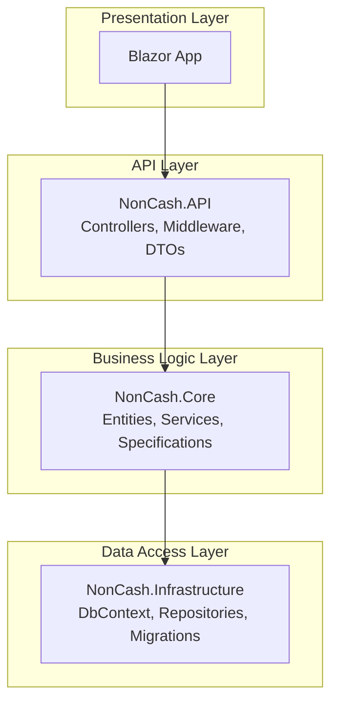
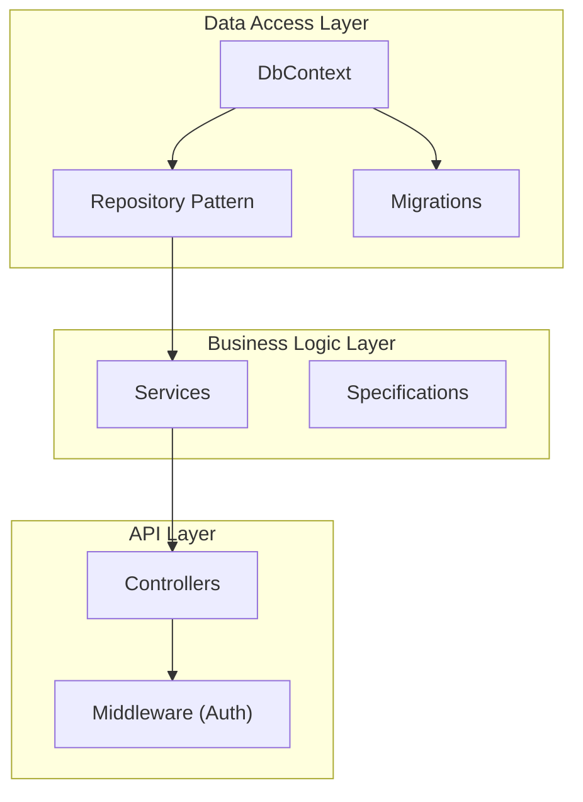
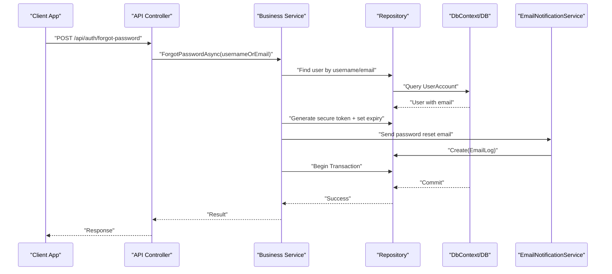
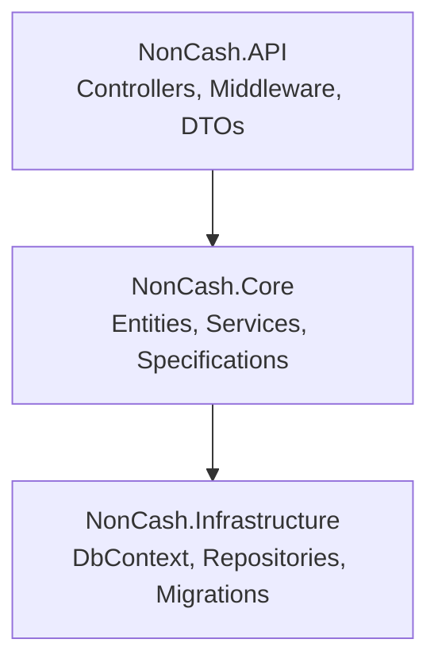

# Data Models and Database Design

<cite>
**Referenced Files in This Document**
- [data-models.md](file://docs/data-models.md)
- [BaseEntity.cs](file://src/NonCash.Core/Entities/BaseEntity.cs)
- [Brand.cs](file://src/NonCash.Core/Entities/Brand.cs)
- [Outlet.cs](file://src/NonCash.Core/Entities/Outlet.cs)
- [UserAccount.cs](file://src/NonCash.Core/Entities/UserAccount.cs)
- [VoucherDistribution.cs](file://src/NonCash.Core/Entities/VoucherDistribution.cs)
- [VoucherReview.cs](file://src/NonCash.Core/Entities/VoucherReview.cs)
- [VoucherUsage.cs](file://src/NonCash.Core/Entities/VoucherUsage.cs)
- [VoucherPlanHeader.cs](file://src/NonCash.Core/Entities/VoucherPlanHeader.cs)
- [VoucherPlanDetail.cs](file://src/NonCash.Core/Entities/VoucherPlanDetail.cs)
- [SettlementEntry.cs](file://src/NonCash.Core/Entities/SettlementEntry.cs)
- [CreditLedgerEntry.cs](file://src/NonCash.Core/Entities/CreditLedgerEntry.cs)
- [PaymentTransaction.cs](file://src/NonCash.Core/Entities/PaymentTransaction.cs)
- [VoucherEvent.cs](file://src/NonCash.Core/Entities/VoucherEvent.cs)
- [IntegrationPartner.cs](file://src/NonCash.Core/Entities/IntegrationPartner.cs)
- [VoucherTransfer.cs](file://src/NonCash.Core/Entities/VoucherTransfer.cs)
- [MemberAccount.cs](file://src/NonCash.Core/Entities/MemberAccount.cs)
- [Business.cs](file://src/NonCash.Core/Entities/Business.cs)
- [CreditBatch.cs](file://src/NonCash.Core/Entities/CreditBatch.cs)
- [CreditPricingPolicy.cs](file://src/NonCash.Core/Entities/CreditPricingPolicy.cs)
- [BrandGroup.cs](file://src/NonCash.Core/Entities/BrandGroup.cs)
- [CreditAdjustmentRequest.cs](file://src/NonCash.Core/Entities/CreditAdjustmentRequest.cs)
- [CreditConsumption.cs](file://src/NonCash.Core/Entities/CreditConsumption.cs)
- [CreditExpiryLog.cs](file://src/NonCash.Core/Entities/CreditExpiryLog.cs)
- [EmailLog.cs](file://src/NonCash.Core/Entities/EmailLog.cs)
- [BrandRegistrationRequest.cs](file://src/NonCash.Core/Entities/BrandRegistrationRequest.cs)
- [Customer.cs](file://src/NonCash.Core/Entities/Customer.cs)
- [CreditBatchConfiguration.cs](file://src/NonCash.Infrastructure/Data/Configurations/CreditBatchConfiguration.cs)
- [CreditPricingPolicyConfiguration.cs](file://src/NonCash.Infrastructure/Data/Configurations/CreditPricingPolicyConfiguration.cs)
- [BrandGroupConfiguration.cs](file://src/NonCash.Infrastructure/Data/Configurations/BrandGroupConfiguration.cs)
- [CreditAdjustmentRequestConfiguration.cs](file://src/NonCash.Infrastructure/Data/Configurations/CreditAdjustmentRequestConfiguration.cs)
- [EmailLogConfiguration.cs](file://src/NonCash.Infrastructure/Data/Configurations/EmailLogConfiguration.cs)
- [BrandRegistrationRequestConfiguration.cs](file://src/NonCash.Infrastructure/Data/Configurations/BrandRegistrationRequestConfiguration.cs)
- [UserAccountConfiguration.cs](file://src/NonCash.Infrastructure/Data/Configurations/UserAccountConfiguration.cs)
- [ICreditService.cs](file://src/NonCash.Core/Interfaces/ICreditService.cs)
- [CreditService.cs](file://src/NonCash.Infrastructure/Services/CreditService.cs)
- [CreditExpirySweepService.cs](file://src/NonCash.API/HostedServices/CreditExpirySweepService.cs)
- [EmailNotificationService.cs](file://src/NonCash.Infrastructure\Services\EmailNotificationService.cs)
- [AuthController.cs](file://src/NonCash.API\Controllers\AuthController.cs)
- [AuthService.cs](file://src/NonCash.Core\Services\AuthService.cs)
- [INotificationService.cs](file://src/NonCash.Core/Interfaces/INotificationService.cs)
- [AuthDtos.cs](file://src/NonCash.API/DTOs/AuthDtos.cs)
- [PasswordReset.html](file://src/NonCash.Infrastructure/EmailTemplates/PasswordReset.html)
- [20260814114913_AddPasswordResetToken.cs](file://src/NonCash.Infrastructure/Migrations/20260814114913_AddPasswordResetToken.cs)
- [architecture.md](file://docs/architecture.md)
- [source-tree-analysis.md](file://docs/source-tree-analysis.md)
- [Key Functionalities.txt](file://Key Functionalities.txt)
- [description.txt](file://description.txt)
</cite>

## Update Summary
**Changes Made**
- Added comprehensive email logging functionality through EmailLog entity and EmailNotificationService with full audit trail capabilities
- Enhanced UserAccount entity with email field for direct email notifications
- Added BrandRegistrationRequest entity for brand onboarding workflow management
- Enhanced Customer entity with email field support
- Integrated email notification system across all business processes including voucher distribution, credit operations, and approval workflows
- Added comprehensive email retry logic with exponential backoff and failure tracking
- **NEW**: Enhanced UserAccount entity with PasswordResetToken (string) and PasswordResetTokenExpiry (DateTime?) columns for secure time-limited password reset functionality
- **NEW**: Complete password reset workflow implementation with API endpoints, email notifications, and security measures

## Table of Contents
1. [Introduction](#introduction)
2. [Project Structure](#project-structure)
3. [Core Components](#core-components)
4. [Architecture Overview](#architecture-overview)
5. [Detailed Component Analysis](#detailed-component-analysis)
6. [Dependency Analysis](#dependency-analysis)
7. [Performance Considerations](#performance-considerations)
8. [Troubleshooting Guide](#troubleshooting-guide)
9. [Conclusion](#conclusion)
10. [Appendices](#appendices)

## Introduction
This document provides comprehensive data model documentation for the NonCash platform, focusing on core business entities and the relational database schema. The platform now includes enhanced approval workflows, versioning capabilities, comprehensive tracking mechanisms for voucher management across brands and outlets, settlement tracking for cross-tenant operations, credit ledger management, integration partner support, improved member identity management, sophisticated batch-based credit system with maker-checker approval workflows, comprehensive email notification system with complete audit trail capabilities, and secure password reset functionality with time-limited tokens.

## Project Structure
The NonCash project follows a layered architecture with a clear separation of concerns:
- Data Access Layer (DAL): Implements Entity Framework Core with PostgreSQL and Repository pattern.
- Business Logic Layer (BLL): Encapsulates business rules and microservices.
- Presentation Layer: Blazor-based GUI for management and planning.
- API Layer: RESTful integration for POS usage verification and validation.
- Shared Library: Common DTOs and constants.

```mermaid
graph TB
subgraph "Presentation Layer"
BLZ["Blazor App"]
end
subgraph "API Layer"
API["NonCash.API<br/>Controllers, Middleware, DTOs"]
end
subgraph "Business Logic Layer"
BLL_CORE["NonCash.Core<br/>Entities, Services, Specifications"]
end
subgraph "Data Access Layer"
INFRA_DATA["NonCash.Infrastructure<br/>DbContext, Repositories, Migrations"]
end
BLZ --> API
API --> BLL_CORE
BLL_CORE --> INFRA_DATA
```

**Diagram sources**
- [source-tree-analysis.md:15-28](file://docs/source-tree-analysis.md#L15-L28)

**Section sources**
- [source-tree-analysis.md:1-34](file://docs/source-tree-analysis.md#L1-L34)
- [architecture.md:28-52](file://docs/architecture.md#L28-L52)

## Core Components
This section defines the core entities and their attributes, primary keys, foreign keys, and constraints. The entities are derived from the data models documentation and align with the layered architecture.

### Enhanced Voucher Management Entities

- **VoucherPlanHeader** (Enhanced Plan Header)
  - Purpose: Captures the strategic plan for a voucher campaign with comprehensive approval workflows, versioning, and display capabilities.
  - Key attributes:
    - ID: GUID (Primary Key)
    - PlanDate: DateTime (Creation date)
    - CreatorId: GUID (Foreign Key to UserAccount)
    - ApproverId: GUID (Nullable, Foreign Key to UserAccount)
    - BrandId: GUID (Foreign Key to Brand)
    - VoucherType: Enum (Complimentary, Gift)
    - ImageUrl: String (Url for detailed display)
    - IconUrl: String (Url for grid/logo display)
    - ValueType: Enum (Value, Percentage)
    - FaceValue: Decimal (Usage value)
    - NetValue: Decimal (Reference cost)
    - ExpiryDate: DateTime (Hard expiry)
    - PublishDate: DateTime (Availability date)
    - ValidFrom: DateTime? (Flexible validity period)
    - ValidTo: DateTime? (Flexible validity period)
    - TargetQuantity: Integer (Expected volume)
    - Budget: Decimal (Total cost)
    - TargetDistributed: Integer (Goal for distribution)
    - TargetUsed: Integer (Goal for POS usage)
    - ApprovalStatus: Enum (Pending, Approved, Rejected)
    - PreviousVersionId: GUID? (Foreign Key to previous version)
    - VersionNumber: Integer (Version tracking)
    - SponsorBrandId: GUID? (Cross-tenant sponsorship)
    - CoverImageUrl: String? (Display image)
    - TermsAndConditions: String? (Usage terms)
    - BrandColor: String? (Hex color code)
    - DisplayName: String? (Marketing name)
    - ShortDescription: String? (Summary text)
    - ValidDaysOfWeek: String? (Day restrictions)
  - **New Features**: Display fields for rich rendering, cross-tenant sponsorship, enhanced approval workflow tracking, versioning support, flexible validity periods

- **VoucherPlanDetail** (Enhanced Voucher Detail)
  - Purpose: Represents individual vouchers generated after plan approval with enhanced POS lock functionality.
  - Key attributes:
    - ID: GUID (Primary Key)
    - ParentId: GUID (Foreign Key to VoucherPlanHeader)
    - SerialNo: String (Unique external ID)
    - VoucherCodeSecret: String (Secure code storage)
    - MemberId: GUID (Nullable - Assigned owner)
    - UsageStatus: Enum (Pending, In-Use, Complete)
    - UsedDate: DateTime? (Nullable)
    - LockId: GUID? (POS transaction lock)
    - LockedAt: DateTime? (Lock timestamp)
    - BillNumber: String? (POS bill reference)
    - LockedOutletId: GUID? (Outlet where locked)
  - **New Features**: POS transaction locking, bill tracking, enhanced security

- **VoucherReview** (Approval Tracking)
  - Purpose: Comprehensive tracking of approval decisions and review processes.
  - Key attributes:
    - ID: GUID (Primary Key)
    - PlanId: GUID (Foreign Key to VoucherPlanHeader)
    - ApproverId: GUID (Foreign Key to UserAccount)
    - ReviewDate: DateTime
    - ReviewNotes: String? (Approval comments)
    - Decision: Enum (Approved, Rejected)
    - PublishDate: DateTime? (Publication decision)

### New Financial and Settlement Entities

- **SettlementEntry** (Cross-Tenant Settlement)
  - Purpose: Tracks cross-tenant settlement obligations arising from voucher redemptions where sponsor brand differs from redeeming brand.
  - Key attributes:
    - ID: GUID (Primary Key)
    - SponsorBrandId: GUID? (Brand that sponsored the campaign)
    - IssuingBrandId: GUID (Brand that issued the voucher)
    - RedeemBrandId: GUID? (Brand at whose outlet redeemed)
    - RedeemOutletId: GUID? (Outlet where redeemed)
    - VoucherUsageId: GUID (Linked VoucherUsage record)
    - FaceValue: Decimal (Value at redemption time)
    - Status: Enum (Pending, Settled)
    - SettledAt: DateTime? (Settlement completion time)
    - SettledBy: GUID? (User/system that settled)

- **CreditLedgerEntry** (Prepaid Credit Ledger)
  - Purpose: Append-only prepaid credit ledger for billing model. Balance = SUM(Amount) per brand.
  - Key attributes:
    - ID: GUID (Primary Key)
    - BrandId: GUID (Brand whose balance affected)
    - EntryType: Enum (Grant, Purchase, Consumption, Adjustment)
    - Amount: Integer (Signed: positive for Grant/Purchase, negative for Consumption)
    - Reference: String? (Free-text reference)
    - VoucherDetailId: GUID? (Unique when set - enforces 1 voucher = max 1 credit)
    - CreatedBy: GUID? (User who created entry)

- **PaymentTransaction** (Payment Processing)
  - Purpose: Records payment transactions for voucher purchases.
  - Key attributes:
    - ID: GUID (Primary Key)
    - PurchaseOrderId: GUID (Related purchase order)
    - Gateway: String (Payment gateway name)
    - GatewayTransactionId: String (External transaction ID)
    - Amount: Decimal (Transaction amount)
    - Currency: String (Default: VND)
    - Status: Enum (Pending, Success, Failed, Cancelled, Refunded)
    - RequestPayload: String? (Gateway request data)
    - ResponsePayload: String? (Gateway response data)
    - WebhookPayload: String? (Webhook data)
    - GatewayResponseCode: String? (Gateway status code)
    - CompletedAt: DateTime? (Completion timestamp)

### Integration and Event Management

- **VoucherEvent** (Outbox Pattern Events)
  - Purpose: Outbox-pattern event record for webhook delivery to integration partners.
  - Key attributes:
    - ID: GUID (Primary Key)
    - EventType: String (Event type like "voucher.distributed", "voucher.redeemed")
    - VoucherId: GUID? (Related voucher)
    - MemberPhone: String? (Member phone for queries)
    - BrandId: GUID? (Brand context)
    - PayloadJson: String (JSON payload data)

- **WebhookDelivery** (Event Delivery Tracking)
  - Purpose: Tracks delivery of events to specific integration partners with retry logic.
  - Key attributes:
    - ID: GUID (Primary Key)
    - PartnerId: GUID (Target partner)
    - EventId: GUID (Event being delivered)
    - HttpStatus: Int? (Last HTTP status code)
    - RetryCount: Int (Attempt count)
    - DeliveredAt: DateTime? (Successful delivery time)
    - NextRetryAt: DateTime? (Next retry schedule)
    - LastError: String? (Error message)

- **IntegrationPartner** (External System Integration)
  - Purpose: Represents external loyalty apps or CRM systems integrating with NonCash.
  - Key attributes:
    - ID: GUID (Primary Key)
    - Name: String (Display name)
    - ContactEmail: String (Technical contact)
    - CallbackUrl: String (Webhook endpoint URL)
    - ApiKeyPrefix: String (First 8 chars for identification)
    - ApiKeyHash: String (BCrypt hash of full API key)
    - WebhookSecret: String (HMAC-SHA256 secret)
    - IsActive: Boolean (Active status)

### Member Identity and Transfer Management

- **MemberAccount** (Enhanced Member Identity)
  - Purpose: Manages member login credentials and account status, split from Customer for better identity management.
  - Key attributes:
    - ID: GUID (Primary Key)
    - CustomerId: GUID (FK to Customer)
    - Username: String (Login username)
    - PasswordHash: String (Encrypted password)
    - FullName: String (Display name)
    - Status: Enum (PendingActivation, Active, Locked)

- **VoucherTransfer** (Voucher Gifting)
  - Purpose: Manages voucher transfers between members with acceptance workflow.
  - Key attributes:
    - ID: GUID (Primary Key)
    - SenderId: GUID (FK to MemberAccount)
    - RecipientId: GUID (FK to MemberAccount)
    - VoucherId: GUID (FK to VoucherPlanDetail)
    - Status: Enum (PendingAcceptance, Accepted, Rejected, Expired, Cancelled)
    - TransferType: Enum (Gift)
    - InitiatedAt: DateTime (Transfer creation time)
    - ExpiresAt: DateTime (Transfer expiration)
    - Note: String? (Transfer note)
    - RejectReason: String? (Rejection reason)
    - RespondedAt: DateTime? (Response timestamp)

### Business and Organizational Entities

- **Business** (Organizational Unit)
  - Purpose: Represents organizational units that own multiple brands.
  - Key attributes:
    - ID: GUID (Primary Key)
    - BusinessName: String (Organization name)
    - TaxCode: String (Tax identification)
    - Address: String (Physical address)
    - ContactEmail: String? (Contact email)
    - PhoneNumber: String? (Contact phone)
    - IsActive: Boolean (Active status)

### Supporting Entities

- **VoucherUsage** (Enhanced Usage Tracking)
  - Purpose: Stores history of voucher redemptions at POS with improved POS identification.
  - Key attributes:
    - ID: GUID (Primary Key)
    - VoucherId: GUID (FK to VoucherPlanDetail)
    - PosId: GUID (FK to Outlet)
    - TransactionId: String (POS transaction link)
    - UsageDate: DateTime
    - AmountUsed: Decimal

- **VoucherDistribution** (Distribution Tracking)
  - Purpose: Tracks how vouchers were sent to customers.
  - Key attributes:
    - ID: GUID (Primary Key)
    - VoucherId: GUID (FK to VoucherPlanDetail)
    - MemberId: GUID (FK to Customer)
    - Method: Enum (Sale, Promotion, Transfer)
    - DistributionDate: DateTime

- **Brand** (Organization / Tenant)
  - Purpose: Represents businesses that create and distribute vouchers.
  - Key attributes:
    - ID: GUID (Primary Key)
    - Name: String
    - TaxCode: String
    - ContactEmail: String?
    - Status: Enum (PendingActivation, Active, Suspended)

- **Outlet** (Point of Sale / Store)
  - Purpose: Represents physical or digital stores belonging to a Brand.
  - Key attributes:
    - ID: GUID (Primary Key)
    - BrandId: GUID (FK to Brand)
    - Name: String
    - Address: String?
    - Status: Enum (Active, Closed)
    - ApiKeyPrefix: String? (POS API access)

- **UserAccount** (Enhanced Back-office Users with Password Reset Support)
  - Purpose: Platform access for creating, reviewing, and approving plans with secure password reset functionality.
  - Key attributes:
    - ID: GUID (Primary Key)
    - BrandId: GUID (Nullable, FK to Brand)
    - Username: String
    - PasswordHash: String
    - FullName: String
    - Role: Enum (Admin, BrandManager, Planner, Approver, FinancialController)
    - Status: Enum (PendingActivation, Active, Locked)
    - Email: String? (Optional email for notifications)
    - **PasswordResetToken**: String? (One-time token for password reset, null when no reset is pending)
    - **PasswordResetTokenExpiry**: DateTime? (Expiry time for the password reset token)
  - **Enhanced**: Added email field for direct email notifications, user communication, and secure password reset functionality with time-limited tokens

- **Customer** (End-User / App Member)
  - Purpose: Consumers who hold and use distributed vouchers.
  - Key attributes:
    - ID: GUID (Primary Key)
    - PhoneNumber: String (Primary identifier)
    - FullName: String
    - Email: String? (Optional email for communications)
    - Status: Enum (Active, Blacklisted)
  - **Enhanced**: Added email field for customer communications and notifications

### New Batch-Based Credit System Entities

- **CreditBatch** (Credit Top-Up Batch)
  - Purpose: Represents a single credit top-up with its own price snapshot and expiry. Each batch is independent and consumed via FIFO.
  - Key attributes:
    - ID: GUID (Primary Key)
    - BrandId: GUID (Foreign Key to Brand)
    - PolicyId: GUID? (Snapshot of pricing policy at creation time)
    - BatchType: Enum (Purchase, WelcomeGrant, Grant, Compensation, Correction, Clawback, Reinstatement)
    - OriginalAmount: Integer (Credits granted; negative for Clawback)
    - RemainingAmount: Integer (Credits still available; 0..OriginalAmount)
    - PricePerCreditVnd: Decimal (Unit price snapshot; 0 for free grants)
    - TotalPaidVnd: Decimal (Total VND paid; 0 otherwise)
    - ExpiresAt: DateTime? (When remaining credits expire; null = never)
    - ExpiryWarningSentAt: DateTime? (One-time warning marker)
    - EvidenceImageUrl: String? (Bank slip/evidence image URL)
    - Reference: String? (Bank transfer ref or free-text reference)
    - AdjustmentRequestId: GUID? (Link to adjustment request if applicable)
    - CreatedBy: GUID? (User who created; null for system grants)

- **CreditPricingPolicy** (Versioned Pricing Policy)
  - Purpose: Time-bound, versioned pricing policy with scope resolution (Global > BrandGroup > Brand).
  - Key attributes:
    - ID: GUID (Primary Key)
    - Name: String (Policy name)
    - Scope: Enum (Global, BrandGroup, Brand)
    - BrandGroupId: GUID? (Target group when scope = BrandGroup)
    - BrandId: GUID? (Target brand when scope = Brand)
    - PricePerCreditVnd: Decimal (Flat unit price in VND)
    - CreditExpiryMonths: Integer? (Months until purchased credits expire; null = never)
    - WelcomeCredits: Integer (Free credits on brand activation; 0 = none)
    - WelcomeCreditExpiryMonths: Integer? (Months until welcome credits expire)
    - LowBalanceWarningPct: Integer? (Warning threshold percentage)
    - ExpiryWarningDays: Integer? (Days before expiry to send warnings)
    - AdjustmentApprovalThreshold: Integer? (Amount requiring FC approval)
    - EffectiveFrom: DateTime (Policy start date)
    - EffectiveTo: DateTime? (Policy end date; null = open-ended)
    - IsActive: Boolean (Policy active status)
    - CreatedBy: GUID? (Admin who created policy)

- **BrandGroup** (Policy Target Group)
  - Purpose: Named group of brands used as pricing policy targets for bulk policy application.
  - Key attributes:
    - ID: GUID (Primary Key)
    - Name: String (Group name)
    - Description: String? (Group description)
    - IsActive: Boolean (Group active status)

- **BrandGroupMember** (Group Membership Link)
  - Purpose: Junction entity linking BrandGroup to Brands (many-to-many relationship).
  - Key attributes:
    - ID: GUID (Primary Key)
    - BrandGroupId: GUID (Foreign Key to BrandGroup)
    - BrandId: GUID (Foreign Key to Brand)

- **CreditAdjustmentRequest** (Maker-Checker Adjustment Workflow)
  - Purpose: Maker-checker workflow for credit adjustments with approval matrix and audit trail.
  - Key attributes:
    - ID: GUID (Primary Key)
    - BrandId: GUID (Foreign Key to Brand)
    - AdjustmentType: Enum (Grant, Compensation, Correction, Clawback, Reinstatement)
    - Amount: Integer (Always positive; direction from type)
    - RelatedBatchId: GUID? (Batch being fixed; required for Correction/Clawback/Reinstatement)
    - ReasonText: String (Mandatory human-readable justification)
    - EvidenceNote: String? (Optional supporting note)
    - EvidenceImageUrl: String? (Evidence image URL)
    - Status: Enum (PendingApproval, Approved, Rejected, Applied)
    - RequiresApproval: Boolean (Whether FC approval needed)
    - ApprovalThreshold: Integer? (Threshold snapshot from policy)
    - PolicyId: GUID? (Policy in force at request time)
    - RequestedBy: GUID (User who requested)
    - RequestedAt: DateTime (Request timestamp)
    - ReviewedBy: GUID? (FinancialController who approved/rejected)
    - ReviewedAt: DateTime? (Review timestamp)
    - ReviewNote: String? (Reviewer note; mandatory on reject)
    - AppliedAt: DateTime? (When resulting batch was created)

- **CreditConsumption** (FIFO Credit Consumption)
  - Purpose: Records one voucher's single credit charge, drawn FIFO from oldest non-expired batch.
  - Key attributes:
    - ID: GUID (Primary Key)
    - BatchId: GUID (Foreign Key to CreditBatch)
    - BrandId: GUID (Foreign Key to Brand)
    - VoucherDetailId: GUID (Unique across all consumptions - enforces 1 voucher = max 1 credit)
    - Reference: String? (Consumption context)

- **CreditExpiryLog** (Expiry Audit Trail)
  - Purpose: Audit record written when expiry job zeroes out batches past ExpiresAt.
  - Key attributes:
    - ID: GUID (Primary Key)
    - BatchId: GUID (Foreign Key to CreditBatch)
    - BrandId: GUID (Foreign Key to Brand)
    - ExpiredCredits: Integer (Credits forfeited at expiry time)
    - ExpiredAt: DateTime (When expiry was executed)

### New Email Notification System

- **EmailLog** (Email Audit Trail)
  - Purpose: Comprehensive audit trail for all outbound email notifications with success/failure tracking and retry information.
  - Key attributes:
    - ID: GUID (Primary Key)
    - ToAddress: String (Recipient email address)
    - Subject: String (Email subject line)
    - TemplateName: String (Email template used)
    - NotificationType: String (Category like "PlanReviewed", "AdjustmentPending", "VoucherDistribution")
    - RelatedEntityId: GUID? (Optional related entity ID for traceability)
    - Success: Boolean (Whether email was successfully sent)
    - ErrorMessage: String? (Error details if failed)
    - RetryCount: Integer (Number of retry attempts)
    - SentAt: DateTime (Timestamp of send attempt)

- **BrandRegistrationRequest** (Brand Onboarding Workflow)
  - Purpose: Manages brand registration process with approval workflow and audit trail.
  - Key attributes:
    - ID: GUID (Primary Key)
    - BrandId: GUID (Foreign Key to Brand)
    - SubmittedByUserId: GUID (Foreign Key to UserAccount who submitted)
    - SubmittedAt: DateTime (Submission timestamp)
    - Status: Enum (Submitted, UnderReview, Approved, Rejected)
    - ReviewNotes: String? (Reviewer comments)
    - ReviewedAt: DateTime? (Review completion timestamp)
    - ReviewedByUserId: GUID? (Foreign Key to UserAccount who reviewed)

### New Junction Entities

- **PlanOutlet** (Outlet Assignment)
  - Purpose: Junction table linking voucher plans to specific outlets.
  - Key attributes:
    - PlanId: GUID (FK to VoucherPlanHeader)
    - OutletId: GUID (FK to Outlet)

- **PartnerBrand** (Integration Authorization)
  - Purpose: Join entity linking IntegrationPartner to authorized Brands.
  - Key attributes:
    - PartnerId: GUID (FK to IntegrationPartner)
    - BrandId: GUID (FK to Brand)

Entity relationships and constraints:
- VoucherPlanHeader.ID → VoucherPlanDetail.ParentId (1-to-many)
- VoucherPlanHeader.BrandId → Brand.ID (many-to-1)
- VoucherPlanHeader.CreatorId/ApproverId → UserAccount.ID (many-to-1)
- VoucherPlanDetail.MemberId → MemberAccount.ID (nullable, many-to-1)
- VoucherUsage.VoucherId → VoucherPlanDetail.ID (many-to-1)
- VoucherUsage.PosId → Outlet.ID (many-to-1)
- VoucherDistribution.VoucherId → VoucherPlanDetail.ID (many-to-1)
- VoucherDistribution.MemberId → Customer.ID (many-to-1)
- SettlementEntry.VoucherUsageId → VoucherUsage.ID (one-to-one)
- SettlementEntry.SponsorBrandId/IssuingBrandId/RedeemBrandId → Brand.ID (many-to-1)
- CreditLedgerEntry.BrandId → Brand.ID (many-to-1)
- PaymentTransaction.PurchaseOrderId → PurchaseOrder.ID (many-to-1)
- VoucherEvent.VoucherId → VoucherPlanDetail.ID (many-to-1)
- VoucherEvent.BrandId → Brand.ID (many-to-1)
- WebhookDelivery.PartnerId → IntegrationPartner.ID (many-to-1)
- WebhookDelivery.EventId → VoucherEvent.ID (many-to-1)
- IntegrationPartner.Id → PartnerBrand.PartnerId (one-to-many)
- VoucherTransfer.SenderId/RecipientId → MemberAccount.ID (many-to-1)
- VoucherTransfer.VoucherId → VoucherPlanDetail.ID (many-to-1)
- MemberAccount.CustomerId → Customer.ID (one-to-one)
- Business.Id → Brand.BusinessId (one-to-many)
- PlanOutlet.PlanId → VoucherPlanHeader.ID (many-to-1)
- PlanOutlet.OutletId → Outlet.ID (many-to-1)
- **NEW**: CreditBatch.BrandId → Brand.ID (many-to-1)
- **NEW**: CreditBatch.PolicyId → CreditPricingPolicy.ID (many-to-1)
- **NEW**: CreditBatch.AdjustmentRequestId → CreditAdjustmentRequest.ID (many-to-1)
- **NEW**: CreditConsumption.BatchId → CreditBatch.ID (many-to-1)
- **NEW**: CreditConsumption.BrandId → Brand.ID (many-to-1)
- **NEW**: CreditConsumption.VoucherDetailId → VoucherPlanDetail.ID (unique constraint)
- **NEW**: CreditExpiryLog.BatchId → CreditBatch.ID (many-to-1)
- **NEW**: CreditExpiryLog.BrandId → Brand.ID (many-to-1)
- **NEW**: CreditAdjustmentRequest.BrandId → Brand.ID (many-to-1)
- **NEW**: CreditAdjustmentRequest.RelatedBatchId → CreditBatch.ID (many-to-1)
- **NEW**: CreditAdjustmentRequest.PolicyId → CreditPricingPolicy.ID (many-to-1)
- **NEW**: CreditPricingPolicy.BrandGroupId → BrandGroup.ID (many-to-1)
- **NEW**: CreditPricingPolicy.BrandId → Brand.ID (many-to-1)
- **NEW**: BrandGroupMember.BrandGroupId → BrandGroup.ID (many-to-1)
- **NEW**: BrandGroupMember.BrandId → Brand.ID (many-to-1)
- **NEW**: BrandRegistrationRequest.BrandId → Brand.ID (many-to-1)
- **NEW**: BrandRegistrationRequest.SubmittedByUserId → UserAccount.ID (many-to-1)
- **NEW**: BrandRegistrationRequest.ReviewedByUserId → UserAccount.ID (many-to-1)
- **NEW**: UserAccount.PasswordResetToken index with filter for non-null values

**Section sources**
- [data-models.md:9-113](file://docs/data-models.md#L9-L113)
- [VoucherPlanHeader.cs:22-76](file://src/NonCash.Core/Entities/VoucherPlanHeader.cs#L22-L76)
- [VoucherPlanDetail.cs:10-28](file://src/NonCash.Core/Entities/VoucherPlanDetail.cs#L10-L28)
- [VoucherReview.cs:9-22](file://src/NonCash.Core/Entities/VoucherReview.cs#L9-L22)
- [VoucherUsage.cs:3-14](file://src/NonCash.Core/Entities/VoucherUsage.cs#L3-L14)
- [VoucherDistribution.cs:10-21](file://src/NonCash.Core/Entities/VoucherDistribution.cs#L10-L21)
- [SettlementEntry.cs:7-49](file://src/NonCash.Core/Entities/SettlementEntry.cs#L7-L49)
- [CreditLedgerEntry.cs:8-42](file://src/NonCash.Core/Entities/CreditLedgerEntry.cs#L8-42)
- [PaymentTransaction.cs:12-30](file://src/NonCash.Core/Entities/PaymentTransaction.cs#L12-30)
- [VoucherEvent.cs:8-62](file://src/NonCash.Core/Entities/VoucherEvent.cs#L8-62)
- [IntegrationPartner.cs:8-46](file://src/NonCash.Core/Entities/IntegrationPartner.cs#L8-46)
- [VoucherTransfer.cs:17-35](file://src/NonCash.Core/Entities/VoucherTransfer.cs#L17-35)
- [MemberAccount.cs:10-20](file://src/NonCash.Core/Entities/MemberAccount.cs#L10-L20)
- [Business.cs:6-18](file://src/NonCash.Core/Entities/Business.cs#L6-L18)
- [Brand.cs:10-17](file://src/NonCash.Core/Entities/Brand.cs#L10-L17)
- [Outlet.cs:9-19](file://src/NonCash.Core/Entities/Outlet.cs#L9-L19)
- [UserAccount.cs:20-37](file://src/NonCash.Core/Entities/UserAccount.cs#L20-L37)
- [CreditBatch.cs:27-70](file://src/NonCash.Core/Entities/CreditBatch.cs#L27-L70)
- [CreditPricingPolicy.cs:16-64](file://src/NonCash.Core/Entities/CreditPricingPolicy.cs#L16-L64)
- [BrandGroup.cs:7-17](file://src/NonCash.Core/Entities/BrandGroup.cs#L7-L17)
- [CreditAdjustmentRequest.cs:20-70](file://src/NonCash.Core/Entities/CreditAdjustmentRequest.cs#L20-L70)
- [CreditConsumption.cs:7-22](file://src/NonCash.Core/Entities/CreditConsumption.cs#L7-L22)
- [CreditExpiryLog.cs:6-21](file://src/NonCash.Core/Entities/CreditExpiryLog.cs#L6-L21)
- [EmailLog.cs:1-24](file://src/NonCash.Core/Entities/EmailLog.cs#L1-L24)
- [BrandRegistrationRequest.cs:1-24](file://src/NonCash.Core/Entities/BrandRegistrationRequest.cs#L1-L24)
- [Customer.cs:1-20](file://src/NonCash.Core/Entities/Customer.cs#L1-L20)

## Architecture Overview
The NonCash system employs a relational model managed via Entity Framework Core and PostgreSQL. The Data Access Layer uses the Repository pattern to abstract persistence concerns, enabling decoupling from the Business Logic Layer and supporting schema evolution and technology changes.

```mermaid
graph TB
subgraph "Data Access Layer"
DC["DbContext"]
REP["Repository Pattern"]
MIG["Migrations"]
end
subgraph "Business Logic Layer"
SVC["Services"]
SPEC["Specifications"]
end
subgraph "API Layer"
CTRL["Controllers"]
MW["Middleware (Auth)"]
end
DC --> REP
REP --> SVC
SVC --> CTRL
CTRL --> MW
DC --> MIG
```

**Diagram sources**
- [architecture.md:28-52](file://docs/architecture.md#L28-L52)
- [source-tree-analysis.md:15-28](file://docs/source-tree-analysis.md#L15-L28)

**Section sources**
- [architecture.md:28-52](file://docs/architecture.md#L28-L52)
- [source-tree-analysis.md:15-28](file://docs/source-tree-analysis.md#L15-L28)

## Detailed Component Analysis

### Enhanced Entity Relationship Model
The following ER diagram captures the core entities and their relationships, highlighting primary and foreign keys and cardinalities. The model now includes enhanced approval workflows, versioning, comprehensive tracking, settlement management, credit ledger, integration partners, member identity management, sophisticated batch-based credit system, comprehensive email notification system, and secure password reset functionality.

```mermaid
erDiagram
BRAND {
uuid ID PK
string Name
string TaxCode
string ContactEmail
enum Status
}
OUTLET {
uuid ID PK
uuid BrandId FK
string Name
string Address
enum Status
string ApiKeyPrefix
}
USERACCOUNT {
uuid ID PK
uuid BrandId FK
string Username
string PasswordHash
string FullName
enum Role
enum Status
string Email
string PasswordResetToken
datetime PasswordResetTokenExpiry
}
CUSTOMER {
uuid ID PK
string PhoneNumber
string FullName
string Email
enum Status
}
MEMBERACCOUNT {
uuid ID PK
uuid CustomerId FK
string Username
string PasswordHash
string FullName
enum Status
}
BUSINESS {
uuid ID PK
string BusinessName
string TaxCode
string Address
string ContactEmail
string PhoneNumber
bool IsActive
}
VOUCHERPLANHEADER {
uuid ID PK
datetime PlanDate
uuid CreatorId FK
uuid ApproverId FK
uuid BrandId FK
uuid SponsorBrandId FK
enum VoucherType
string ImageUrl
string IconUrl
enum ValueType
decimal FaceValue
decimal NetValue
datetime ExpiryDate
datetime PublishDate
datetime ValidFrom
datetime ValidTo
int TargetQuantity
decimal Budget
int TargetDistributed
int TargetUsed
enum ApprovalStatus
uuid PreviousVersionId FK
int VersionNumber
string CoverImageUrl
string TermsAndConditions
string BrandColor
string DisplayName
string ShortDescription
string ValidDaysOfWeek
}
VOUCHERPLANDetail {
uuid ID PK
uuid ParentId FK
string SerialNo
string VoucherCodeSecret
uuid MemberId FK
enum UsageStatus
datetime UsedDate
uuid LockId
datetime LockedAt
string BillNumber
uuid LockedOutletId
}
VOUCHERREVIEW {
uuid ID PK
uuid PlanId FK
uuid ApproverId FK
datetime ReviewDate
string ReviewNotes
enum Decision
datetime PublishDate
}
VOICEDISTRIBUTION {
uuid ID PK
uuid VoucherId FK
uuid MemberId FK
enum Method
datetime DistributionDate
}
VOUCHERUSAGE {
uuid ID PK
uuid VoucherId FK
uuid PosId FK
string TransactionId
datetime UsageDate
decimal AmountUsed
}
SETTLEMENTENTRY {
uuid ID PK
uuid SponsorBrandId FK
uuid IssuingBrandId FK
uuid RedeemBrandId FK
uuid RedeemOutletId FK
uuid VoucherUsageId FK
decimal FaceValue
enum Status
datetime SettledAt
uuid SettledBy
}
CREDITLEDGERENTRY {
uuid ID PK
uuid BrandId FK
enum EntryType
int Amount
string Reference
uuid VoucherDetailId
uuid CreatedBy
}
PAYMENTTRANSACTION {
uuid ID PK
uuid PurchaseOrderId FK
string Gateway
string GatewayTransactionId
decimal Amount
string Currency
enum Status
string RequestPayload
string ResponsePayload
string WebhookPayload
string GatewayResponseCode
datetime CompletedAt
}
VOUCHEVENT {
uuid ID PK
string EventType
uuid VoucherId FK
string MemberPhone
uuid BrandId FK
string PayloadJson
}
WEBHOOKDELIVERY {
uuid ID PK
uuid PartnerId FK
uuid EventId FK
int HttpStatus
int RetryCount
datetime DeliveredAt
datetime NextRetryAt
string LastError
}
INTEGRATIONPARTNER {
uuid ID PK
string Name
string ContactEmail
string CallbackUrl
string ApiKeyPrefix
string ApiKeyHash
string WebhookSecret
bool IsActive
}
VOUCHERTRANSFER {
uuid ID PK
uuid SenderId FK
uuid RecipientId FK
uuid VoucherId FK
enum Status
enum TransferType
datetime InitiatedAt
datetime ExpiresAt
string Note
string RejectReason
datetime RespondedAt
}
PLANOUTLET {
uuid PlanId FK
uuid OutletId FK
}
PARTNERBRAND {
uuid PartnerId FK
uuid BrandId FK
}
CREDITBATCH {
uuid ID PK
uuid BrandId FK
uuid PolicyId FK
uuid AdjustmentRequestId FK
enum BatchType
int OriginalAmount
int RemainingAmount
decimal PricePerCreditVnd
decimal TotalPaidVnd
datetime ExpiresAt
datetime ExpiryWarningSentAt
string EvidenceImageUrl
string Reference
uuid CreatedBy
}
CREDITPRICINGPOLICY {
uuid ID PK
string Name
enum Scope
uuid BrandGroupId FK
uuid BrandId FK
decimal PricePerCreditVnd
int CreditExpiryMonths
int WelcomeCredits
int WelcomeCreditExpiryMonths
int LowBalanceWarningPct
int ExpiryWarningDays
int AdjustmentApprovalThreshold
datetime EffectiveFrom
datetime EffectiveTo
bool IsActive
uuid CreatedBy
}
BRANDGROUP {
uuid ID PK
string Name
string Description
bool IsActive
}
BRANDGROUPMEMBER {
uuid BrandGroupId FK
uuid BrandId FK
}
CREDITADJUSTMENTREQUEST {
uuid ID PK
uuid BrandId FK
uuid RelatedBatchId FK
uuid PolicyId FK
enum AdjustmentType
int Amount
string ReasonText
string EvidenceNote
string EvidenceImageUrl
enum Status
bool RequiresApproval
int ApprovalThreshold
uuid RequestedBy
datetime RequestedAt
uuid ReviewedBy
datetime ReviewedAt
string ReviewNote
datetime AppliedAt
}
CREDITCONSUMPTION {
uuid ID PK
uuid BatchId FK
uuid BrandId FK
uuid VoucherDetailId
string Reference
}
CREDITEXPIRYLOG {
uuid ID PK
uuid BatchId FK
uuid BrandId FK
int ExpiredCredits
datetime ExpiredAt
}
EMAILLOG {
uuid ID PK
string ToAddress
string Subject
string TemplateName
string NotificationType
uuid RelatedEntityId
bool Success
string ErrorMessage
int RetryCount
datetime SentAt
}
BRANDREGISTRATIONREQUEST {
uuid ID PK
uuid BrandId FK
uuid SubmittedByUserId FK
uuid ReviewedByUserId FK
enum Status
string ReviewNotes
datetime SubmittedAt
datetime ReviewedAt
}
BRAND ||--o{ OUTLET : "owns"
BRAND ||--o{ VOUCHERPLANHEADER : "creates"
BRAND ||--o{ SETTLEMENTENTRY : "sponsor/issue/redeem"
BRAND ||--o{ CREDITLEDGERENTRY : "balance"
BRAND ||--o{ PARTNERBRAND : "authorized"
BRAND ||--o{ CREDITBATCH : "owns"
BRAND ||--o{ CREDITCONSUMPTION : "consumes"
BRAND ||--o{ CREDITEXPIRYLOG : "expires"
BRAND ||--o{ CREDITADJUSTMENTREQUEST : "requests"
BRAND ||--o{ CREDITPRICINGPOLICY : "targets"
BRAND ||--o{ BRANDREGISTRATIONREQUEST : "registered by"
BUSINESS ||--o{ BRAND : "owns"
USERACCOUNT ||--o{ VOUCHERPLANHEADER : "creates/approves"
USERACCOUNT ||--o{ VOUCHERREVIEW : "reviews"
USERACCOUNT ||--o{ BRANDREGISTRATIONREQUEST : "submits/reviews"
CUSTOMER ||--o{ VOICEDISTRIBUTION : "receives"
CUSTOMER ||--o{ MEMBERACCOUNT : "has account"
MEMBERACCOUNT ||--o{ VOUCHEPLANDetail : "assigned"
MEMBERACCOUNT ||--o{ VOUCHERTRANSFER : "sender/recipient"
VOUCHERPLANHEADER ||--o{ VOICEDISTRIBUTION : "generates"
VOUCHERPLANHEADER ||--o{ VOUCHEPLANDetail : "produces"
VOUCHERPLANHEADER ||--o{ VOUCHERREVIEW : "undergoes"
VOUCHERPLANHEADER ||--o{ PLANOUTLET : "assigns"
VOUCHERPLANDetail ||--o{ VOUCHEUSAGE : "consumed"
VOUCHERUSAGE ||--o{ SETTLEMENTENTRY : "triggers"
VOUCHEREVENT ||--o{ WEBHOOKDELIVERY : "delivered to"
INTEGRATIONPARTNER ||--o{ WEBHOOKDELIVERY : "receives"
VOUCHERTRANSFER ||--o{ VOUCHEPLANDetail : "transfers"
CREDITBATCH ||--|| CREDITCONSUMPTION : "charged by"
CREDITBATCH ||--|| CREDITEXPIRYLOG : "expires to"
CREDITBATCH ||--|| CREDITADJUSTMENTREQUEST : "related to"
CREDITPRICINGPOLICY ||--|| CREDITBATCH : "snapshotted by"
CREDITPRICINGPOLICY ||--|| CREDITADJUSTMENTREQUEST : "governs"
BRANDGROUP ||--o{ BRANDGROUPMEMBER : "contains"
BRAND ||--o{ BRANDGROUPMEMBER : "member of"
EMAILLOG ||..| USERACCOUNT : "sent to"
```

**Diagram sources**
- [VoucherPlanHeader.cs:22-76](file://src/NonCash.Core/Entities/VoucherPlanHeader.cs#L22-L76)
- [VoucherPlanDetail.cs:10-28](file://src/NonCash.Core/Entities/VoucherPlanDetail.cs#L10-L28)
- [VoucherReview.cs:9-22](file://src/NonCash.Core/Entities/VoucherReview.cs#L9-L22)
- [VoucherUsage.cs:3-14](file://src/NonCash.Core/Entities/VoucherUsage.cs#L3-L14)
- [VoucherDistribution.cs:10-21](file://src/NonCash.Core/Entities/VoucherDistribution.cs#L10-L21)
- [SettlementEntry.cs:7-49](file://src/NonCash.Core/Entities/SettlementEntry.cs#L7-L49)
- [CreditLedgerEntry.cs:8-42](file://src/NonCash.Core/Entities/CreditLedgerEntry.cs#L8-L42)
- [PaymentTransaction.cs:12-30](file://src/NonCash.Core/Entities/PaymentTransaction.cs#L12-L30)
- [VoucherEvent.cs:8-62](file://src/NonCash.Core/Entities/VoucherEvent.cs#L8-62)
- [IntegrationPartner.cs:8-46](file://src/NonCash.Core/Entities/IntegrationPartner.cs#L8-46)
- [VoucherTransfer.cs:17-35](file://src/NonCash.Core/Entities/VoucherTransfer.cs#L17-L35)
- [MemberAccount.cs:10-20](file://src/NonCash.Core/Entities/MemberAccount.cs#L10-L20)
- [Business.cs:6-18](file://src/NonCash.Core/Entities/Business.cs#L6-L18)
- [Brand.cs:10-17](file://src/NonCash.Core/Entities/Brand.cs#L10-L17)
- [Outlet.cs:9-19](file://src/NonCash.Core/Entities/Outlet.cs#L9-L19)
- [UserAccount.cs:20-37](file://src/NonCash.Core/Entities/UserAccount.cs#L20-L37)
- [CreditBatch.cs:27-70](file://src/NonCash.Core/Entities/CreditBatch.cs#L27-L70)
- [CreditPricingPolicy.cs:16-64](file://src/NonCash.Core/Entities/CreditPricingPolicy.cs#L16-L64)
- [BrandGroup.cs:7-17](file://src/NonCash.Core/Entities/BrandGroup.cs#L7-L17)
- [CreditAdjustmentRequest.cs:20-70](file://src/NonCash.Core/Entities/CreditAdjustmentRequest.cs#L20-L70)
- [CreditConsumption.cs:7-22](file://src/NonCash.Core/Entities/CreditConsumption.cs#L7-L22)
- [CreditExpiryLog.cs:6-21](file://src/NonCash.Core/Entities/CreditExpiryLog.cs#L6-L21)
- [EmailLog.cs:1-24](file://src/NonCash.Core/Entities/EmailLog.cs#L1-L24)
- [BrandRegistrationRequest.cs:1-24](file://src/NonCash.Core/Entities/BrandRegistrationRequest.cs#L1-L24)

### Enhanced Data Validation and Business Rules Embedded in Schema
- **Multi-tenancy isolation**: BrandId ensures tenant boundaries across entities.
- **Comprehensive approval workflow**: VoucherPlanHeader tracks ApprovalStatus with VoucherReview providing detailed audit trail.
- **Versioning support**: VoucherPlanHeader includes PreviousVersionId and VersionNumber for plan evolution tracking.
- **Enhanced security**: VoucherPlanDetail.VoucherCodeSecret provides secure code storage with POS transaction locking.
- **Improved POS integration**: VoucherUsage now uses Outlet ID for precise POS identification and transaction tracking.
- **Flexible validity periods**: VoucherPlanHeader supports both fixed ExpiryDate and flexible ValidFrom/ValidTo ranges.
- **Outlet assignment flexibility**: PlanOutlet junction table enables granular outlet targeting for campaigns.
- **Enhanced user roles**: UserAccount includes BrandManager role for improved multi-tenancy management.
- **POS transaction control**: VoucherPlanDetail includes LockId, LockedAt, and LockedOutletId for transaction integrity.
- **Cross-tenant settlement tracking**: SettlementEntry manages financial obligations between different brands.
- **Credit ledger integrity**: CreditLedgerEntry enforces unique consumption per voucher with filtered unique index.
- **Integration partner security**: IntegrationPartner uses BCrypt hashing for API keys and HMAC-SHA256 for webhooks.
- **Member identity separation**: MemberAccount separates authentication from customer data for better security.
- **Voucher transfer lifecycle**: VoucherTransfer manages complete transfer workflow with expiration and rejection handling.
- **Batch-based credit system with FIFO consumption model and unique voucher consumption constraint**.
- **Maker-checker adjustment workflow with approval thresholds and audit trail**.
- **Brand group support for bulk policy application and scope-based policy resolution**.
- **Automated credit expiry management with one-time warning system**.
- **Comprehensive email notification system with complete audit trail and retry logic**.
- **Brand registration workflow with approval process and audit trail**.
- **Enhanced user accounts with email support for direct notifications**.
- **Customer email support for personalized communications**.
- **SECURE PASSWORD RESET FUNCTIONALITY**: UserAccount now includes PasswordResetToken (string) and PasswordResetTokenExpiry (DateTime?) columns for secure time-limited password reset functionality with indexed token lookup and automatic token cleanup on expiry.

**Section sources**
- [VoucherPlanHeader.cs:22-76](file://src/NonCash.Core/Entities/VoucherPlanHeader.cs#L22-L76)
- [VoucherPlanDetail.cs:10-28](file://src/NonCash.Core/Entities/VoucherPlanDetail.cs#L10-L28)
- [VoucherReview.cs:9-22](file://src/NonCash.Core/Entities/VoucherReview.cs#L9-L22)
- [VoucherUsage.cs:3-14](file://src/NonCash.Core/Entities/VoucherUsage.cs#L3-L14)
- [SettlementEntry.cs:7-49](file://src/NonCash.Core/Entities/SettlementEntry.cs#L7-L49)
- [CreditLedgerEntry.cs:8-42](file://src/NonCash.Core/Entities/CreditLedgerEntry.cs#L8-L42)
- [IntegrationPartner.cs:8-46](file://src/NonCash.Core/Entities/IntegrationPartner.cs#L8-L46)
- [VoucherTransfer.cs:17-35](file://src/NonCash.Core/Entities/VoucherTransfer.cs#L17-L35)
- [MemberAccount.cs:10-20](file://src/NonCash.Core/Entities/MemberAccount.cs#L10-L20)
- [UserAccount.cs:20-37](file://src/NonCash.Core/Entities/UserAccount.cs#L20-L37)
- [CreditBatch.cs:27-70](file://src/NonCash.Core/Entities/CreditBatch.cs#L27-L70)
- [CreditPricingPolicy.cs:16-64](file://src/NonCash.Core/Entities/CreditPricingPolicy.cs#L16-L64)
- [CreditAdjustmentRequest.cs:20-70](file://src/NonCash.Core/Entities/CreditAdjustmentRequest.cs#L20-L70)
- [CreditConsumption.cs:7-22](file://src/NonCash.Core/Entities/CreditConsumption.cs#L7-L22)
- [CreditExpiryLog.cs:6-21](file://src/NonCash.Core/Entities/CreditExpiryLog.cs#L6-L21)
- [EmailLog.cs:1-24](file://src/NonCash.Core/Entities/EmailLog.cs#L1-L24)
- [BrandRegistrationRequest.cs:1-24](file://src/NonCash.Core/Entities/BrandRegistrationRequest.cs#L1-L24)
- [Customer.cs:1-20](file://src/NonCash.Core/Entities/Customer.cs#L1-L20)

### Enhanced Data Access Patterns Using Entity Framework Core and Repository Pattern
- DbContext encapsulates all entity sets and manages change tracking and transactions.
- Repository pattern abstracts CRUD operations, enabling testability and technology flexibility.
- **Enhanced transaction handling**: POS usage operations now include voucher locking and transaction integrity.
- **Version-aware queries**: Repository methods handle plan versioning and approval status filtering.
- **Approval workflow integration**: Services coordinate between VoucherPlanHeader, VoucherReview, and approval processes.
- **Settlement processing**: SettlementService manages cross-tenant financial settlements with proper auditing.
- **Credit ledger operations**: CreditService handles append-only ledger entries with balance calculations.
- **Integration partner management**: IntegrationPartnerService manages API keys, webhooks, and brand authorizations.
- **Event-driven architecture**: VoucherEvent and WebhookDelivery enable reliable webhook delivery with retry logic.
- **Batch-based credit consumption with FIFO algorithm and idempotent processing**.
- **Maker-checker adjustment workflow with approval matrix and audit trail**.
- **Automated credit expiry sweep service with one-time warning system**.
- **Comprehensive email notification system with retry logic and audit trail**.
- **Brand registration workflow with email notifications and approval process**.
- **SECURE PASSWORD RESET WORKFLOW**: Complete password reset implementation with ForgotPasswordAsync and ResetPasswordAsync methods, secure token generation, email notifications, and automatic token cleanup on expiry or successful password reset.
- Migrations manage schema evolution and version control for PostgreSQL.

```mermaid
sequenceDiagram
participant Client as "Client App"
participant API as "API Controller"
participant Service as "Business Service"
participant Repo as "Repository"
participant DB as "DbContext/DB"
participant EmailSvc as "EmailNotificationService"
Client->>API : "POST /api/auth/forgot-password"
API->>Service : "ForgotPasswordAsync(usernameOrEmail)"
Service->>Repo : "Find user by username/email"
Repo->>DB : "Query UserAccount"
DB-->>Repo : "User with email"
Service->>Repo : "Generate secure token + set expiry"
Service->>EmailSvc : "Send password reset email"
EmailSvc->>Repo : "Create(EmailLog)"
Service->>Repo : "Begin Transaction"
DB-->>Repo : "Commit"
Repo-->>Service : "Success"
Service-->>API : "Result"
API-->>Client : "Response"
```

**Diagram sources**
- [architecture.md:28-52](file://docs/architecture.md#L28-L52)
- [source-tree-analysis.md:15-28](file://docs/source-tree-analysis.md#L15-L28)
- [EmailNotificationService.cs:327-416](file://src/NonCash.Infrastructure\Services\EmailNotificationService.cs#L327-L416)
- [AuthService.cs:122-171](file://src/NonCash.Core\Services\AuthService.cs#L122-L171)

**Section sources**
- [architecture.md:28-52](file://docs/architecture.md#L28-L52)
- [source-tree-analysis.md:15-28](file://docs/source-tree-analysis.md#L15-L28)
- [EmailNotificationService.cs:1-428](file://src/NonCash.Infrastructure\Services\EmailNotificationService.cs#L1-L428)
- [AuthService.cs:122-171](file://src/NonCash.Core\Services\AuthService.cs#L122-L171)

### Enhanced Sample Data Examples
Below are representative rows illustrating typical data entries across entities with the enhanced functionality. These examples illustrate relationships and constraints without exposing sensitive information.

- **Business**
  - ID: [GUID], BusinessName: "Giga Mall Group", TaxCode: "GMG-12345", Address: "456 Corporate Blvd", ContactEmail: "admin@gigamall.example", PhoneNumber: "+8490xxxxxxx", IsActive: true
- **Brand**
  - ID: [GUID], Name: "The Coffee House", TaxCode: "THC-12345", ContactEmail: "admin@thecoffeehouse.example", Status: Active
- **Outlet**
  - ID: [GUID], BrandId: [Brand GUID], Name: "Downtown Store", Address: "123 Main St", Status: Active, ApiKeyPrefix: "POS-101"
- **UserAccount** *(Enhanced with Password Reset Support)*
  - ID: [GUID], BrandId: [Brand GUID], Username: "brand_manager", PasswordHash: "[hash]", FullName: "Jane Brand Manager", Role: BrandManager, Status: Active, Email: "jane.brandmanager@example.com", PasswordResetToken: null, PasswordResetTokenExpiry: null
- **Customer** *(Enhanced)*
  - ID: [GUID], PhoneNumber: "+8490xxxxxxx", FullName: "John Doe", Email: "john.doe@example.com", Status: Active
- **MemberAccount**
  - ID: [GUID], CustomerId: [Customer GUID], Username: "johndoe", PasswordHash: "[hash]", FullName: "John Doe", Status: Active
- **IntegrationPartner**
  - ID: [GUID], Name: "Giga Mall App", ContactEmail: "tech@gigamall.example", CallbackUrl: "https://gigamall.example/webhook", ApiKeyPrefix: "abc12345", ApiKeyHash: "[bcrypt-hash]", WebhookSecret: "[secret]", IsActive: true
- **VoucherPlanHeader** *(Enhanced)*
  - ID: [GUID], PlanDate: 2026-06-01, CreatorId: [User GUID], ApproverId: [User GUID], BrandId: [Brand GUID], VoucherType: Complimentary, ValueType: Value, FaceValue: 100000, NetValue: 80000, ExpiryDate: 2026-12-31, PublishDate: 2026-06-15, ValidFrom: 2026-06-15, ValidTo: 2026-12-31, TargetQuantity: 1000, Budget: 80000000, TargetDistributed: 800, TargetUsed: 800, ApprovalStatus: Approved, PreviousVersionId: null, VersionNumber: 1, SponsorBrandId: null, CoverImageUrl: "/images/voucher_cover.jpg", TermsAndConditions: "Valid at participating outlets only", BrandColor: "#E53935", DisplayName: "Weekend Treat 200K", ShortDescription: "Enjoy 200K off your weekend coffee", ValidDaysOfWeek: "Sat,Sun"
- **VoucherPlanDetail** *(Enhanced)*
  - ID: [GUID], ParentId: [Plan GUID], SerialNo: "VC2026-001", VoucherCodeSecret: "secret-hash-abc123", MemberId: [Member GUID], UsageStatus: InUse, UsedDate: null, LockId: [GUID], LockedAt: 2026-06-17T10:30:00Z, BillNumber: "BILL-001", LockedOutletId: [Outlet GUID]
- **VoucherReview**
  - ID: [GUID], PlanId: [Plan GUID], ApproverId: [User GUID], ReviewDate: 2026-06-15T14:30:00Z, ReviewNotes: "Approved with conditions", Decision: Approved, PublishDate: 2026-06-15T15:00:00Z
- **VoucherDistribution**
  - ID: [GUID], VoucherId: [Detail GUID], MemberId: [Customer GUID], Method: Sale, DistributionDate: 2026-06-16
- **VoucherUsage** *(Enhanced)**
  - ID: [GUID], VoucherId: [Detail GUID], PosId: [Outlet GUID], TransactionId: "TXN-2026-001", UsageDate: 2026-06-17, AmountUsed: 100000
- **SettlementEntry** *(New)**
  - ID: [GUID], SponsorBrandId: [Brand GUID], IssuingBrandId: [Brand GUID], RedeemBrandId: [Brand GUID], RedeemOutletId: [Outlet GUID], VoucherUsageId: [Usage GUID], FaceValue: 100000, Status: Pending, SettledAt: null, SettledBy: null
- **CreditLedgerEntry** *(New)**
  - ID: [GUID], BrandId: [Brand GUID], EntryType: Consumption, Amount: -1, Reference: "Voucher redemption", VoucherDetailId: [Detail GUID], CreatedBy: null
- **PaymentTransaction** *(New)**
  - ID: [GUID], PurchaseOrderId: [Purchase GUID], Gateway: "ZaloPay", GatewayTransactionId: "zp-123456", Amount: 100000, Currency: "VND", Status: Success, RequestPayload: "{...}", ResponsePayload: "{...}", WebhookPayload: "{...}", GatewayResponseCode: "00", CompletedAt: 2026-06-16T10:00:00Z
- **VoucherEvent** *(New)**
  - ID: [GUID], EventType: "voucher.redeemed", VoucherId: [Detail GUID], MemberPhone: "+8490xxxxxxx", BrandId: [Brand GUID], PayloadJson: "{\"amount\":100000,\"outlet\":\"store1\"}"
- **WebhookDelivery** *(New)**
  - ID: [GUID], PartnerId: [Partner GUID], EventId: [Event GUID], HttpStatus: 200, RetryCount: 0, DeliveredAt: 2026-06-17T10:31:00Z, NextRetryAt: null, LastError: null
- **VoucherTransfer** *(New)**
  - ID: [GUID], SenderId: [Member GUID], RecipientId: [Member GUID], VoucherId: [Detail GUID], Status: PendingAcceptance, TransferType: Gift, InitiatedAt: 2026-06-16T15:00:00Z, ExpiresAt: 2026-06-23T15:00:00Z, Note: "Birthday gift!", RejectReason: null, RespondedAt: null
- **PlanOutlet**
  - PlanId: [Plan GUID], OutletId: [Outlet GUID]
- **EmailLog** *(New)**
  - ID: [GUID], ToAddress: "admin@example.com", Subject: "New business registration: Coffee House", TemplateName: "AdminNewRegistration", NotificationType: "NewRegistration", RelatedEntityId: [Request GUID], Success: true, ErrorMessage: null, RetryCount: 0, SentAt: 2026-06-17T10:30:00Z
- **BrandRegistrationRequest** *(New)**
  - ID: [GUID], BrandId: [Brand GUID], SubmittedByUserId: [User GUID], SubmittedAt: 2026-06-16T09:00:00Z, Status: UnderReview, ReviewNotes: "Under review for compliance check", ReviewedAt: null, ReviewedByUserId: null
- **NEW**: **CreditBatch**
  - ID: [GUID], BrandId: [Brand GUID], PolicyId: [Policy GUID], BatchType: Purchase, OriginalAmount: 1000, RemainingAmount: 999, PricePerCreditVnd: 100m, TotalPaidVnd: 100000m, ExpiresAt: 2027-06-17, EvidenceImageUrl: "/bank-slip-001.jpg", Reference: "Bank transfer #BT-001", AdjustmentRequestId: null, CreatedBy: [User GUID]
- **NEW**: **CreditPricingPolicy**
  - ID: [GUID], Name: "Standard Brand Policy", Scope: Brand, BrandId: [Brand GUID], PricePerCreditVnd: 100m, CreditExpiryMonths: 12, WelcomeCredits: 100, WelcomeCreditExpiryMonths: 6, LowBalanceWarningPct: 20, ExpiryWarningDays: 7, AdjustmentApprovalThreshold: 500, EffectiveFrom: 2026-01-01, EffectiveTo: null, IsActive: true, CreatedBy: [Admin GUID]
- **NEW**: **BrandGroup**
  - ID: [GUID], Name: "Premium Brands", Description: "High-value brand partners", IsActive: true
- **NEW**: **CreditAdjustmentRequest**
  - ID: [GUID], BrandId: [Brand GUID], AdjustmentType: Correction, Amount: 50, RelatedBatchId: [Batch GUID], ReasonText: "System error caused double charging", EvidenceNote: "Ticket #INC-001", EvidenceImageUrl: "/error-screenshot.png", Status: PendingApproval, RequiresApproval: true, ApprovalThreshold: 100, PolicyId: [Policy GUID], RequestedBy: [User GUID], RequestedAt: 2026-06-17T10:00:00Z, ReviewedBy: null, ReviewedAt: null, ReviewNote: null, AppliedAt: null
- **NEW**: **CreditConsumption**
  - ID: [GUID], BatchId: [Batch GUID], BrandId: [Brand GUID], VoucherDetailId: [Detail GUID], Reference: "gift-sold"
- **NEW**: **CreditExpiryLog**
  - ID: [GUID], BatchId: [Batch GUID], BrandId: [Brand GUID], ExpiredCredits: 50, ExpiredAt: 2027-06-17T00:00:00Z
- **NEW**: **UserAccount with Password Reset Token**
  - ID: [GUID], BrandId: [Brand GUID], Username: "user@example.com", PasswordHash: "[hash]", FullName: "John User", Role: BrandManager, Status: Active, Email: "user@example.com", PasswordResetToken: "base64-encoded-token", PasswordResetTokenExpiry: 2026-08-14T12:30:00Z

**Section sources**
- [data-models.md:9-113](file://docs/data-models.md#L9-L113)
- [VoucherPlanHeader.cs:22-76](file://src/NonCash.Core/Entities/VoucherPlanHeader.cs#L22-L76)
- [VoucherPlanDetail.cs:10-28](file://src/NonCash.Core/Entities/VoucherPlanDetail.cs#L10-L28)
- [VoucherReview.cs:9-22](file://src/NonCash.Core/Entities/VoucherReview.cs#L9-L22)
- [VoucherUsage.cs:3-14](file://src/NonCash.Core/Entities/VoucherUsage.cs#L3-L14)
- [SettlementEntry.cs:7-49](file://src/NonCash.Core/Entities/SettlementEntry.cs#L7-L49)
- [CreditLedgerEntry.cs:8-42](file://src/NonCash.Core/Entities/CreditLedgerEntry.cs#L8-L42)
- [PaymentTransaction.cs:12-30](file://src/NonCash.Core/Entities/PaymentTransaction.cs#L12-L30)
- [VoucherEvent.cs:8-62](file://src/NonCash.Core/Entities/VoucherEvent.cs#L8-62)
- [IntegrationPartner.cs:8-46](file://src/NonCash.Core/Entities/IntegrationPartner.cs#L8-L46)
- [VoucherTransfer.cs:17-35](file://src/NonCash.Core/Entities/VoucherTransfer.cs#L17-L35)
- [MemberAccount.cs:10-20](file://src/NonCash.Core/Entities/MemberAccount.cs#L10-L20)
- [Business.cs:6-18](file://src/NonCash.Core/Entities/Business.cs#L6-L18)
- [CreditBatch.cs:27-70](file://src/NonCash.Core/Entities/CreditBatch.cs#L27-L70)
- [CreditPricingPolicy.cs:16-64](file://src/NonCash.Core/Entities/CreditPricingPolicy.cs#L16-L64)
- [BrandGroup.cs:7-17](file://src/NonCash.Core/Entities/BrandGroup.cs#L7-L17)
- [CreditAdjustmentRequest.cs:20-70](file://src/NonCash.Core/Entities/CreditAdjustmentRequest.cs#L20-L70)
- [CreditConsumption.cs:7-22](file://src/NonCash.Core/Entities/CreditConsumption.cs#L7-L22)
- [CreditExpiryLog.cs:6-21](file://src/NonCash.Core/Entities/CreditExpiryLog.cs#L6-L21)
- [EmailLog.cs:1-24](file://src/NonCash.Core/Entities/EmailLog.cs#L1-L24)
- [BrandRegistrationRequest.cs:1-24](file://src/NonCash.Core/Entities/BrandRegistrationRequest.cs#L1-L24)
- [UserAccount.cs:20-37](file://src/NonCash.Core/Entities/UserAccount.cs#L20-L37)

## Dependency Analysis
The following diagram highlights dependencies among layers and components relevant to data modeling and access.

```mermaid
graph TB
CORE["NonCash.Core<br/>Entities, Services, Specifications"]
INFRA["NonCash.Infrastructure<br/>DbContext, Repositories, Migrations"]
API["NonCash.API<br/>Controllers, Middleware, DTOs"]
API --> CORE
CORE --> INFRA
```

**Diagram sources**
- [source-tree-analysis.md:15-28](file://docs/source-tree-analysis.md#L15-L28)

**Section sources**
- [source-tree-analysis.md:15-28](file://docs/source-tree-analysis.md#L15-L28)

## Performance Considerations
- **Enhanced indexing strategy**:
  - VoucherPlanHeader: Index on BrandId, ApprovalStatus, PublishDate, ExpiryDate, ValidFrom/ValidTo, PreviousVersionId, SponsorBrandId
  - VoucherPlanDetail: Index on ParentId, VoucherCodeSecret, MemberId, UsageStatus, LockId, LockedOutletId
  - VoucherUsage: Index on VoucherId, PosId, UsageDate, TransactionId
  - VoucherDistribution: Index on VoucherId, MemberId, Method, DistributionDate
  - VoucherReview: Index on PlanId, ApproverId, ReviewDate, Decision
  - SettlementEntry: Index on SponsorBrandId, IssuingBrandId, RedeemBrandId, Status, VoucherUsageId (unique), CreatedAt
  - CreditLedgerEntry: Index on BrandId, CreatedAt, VoucherDetailId (unique filtered)
  - PaymentTransaction: Index on PurchaseOrderId, Status, CompletedAt
  - VoucherEvent: Index on EventType, VoucherId, BrandId, CreatedAt
  - WebhookDelivery: Index on PartnerId, EventId, NextRetryAt, HttpStatus
  - IntegrationPartner: Index on ApiKeyPrefix, IsActive
  - VoucherTransfer: Index on SenderId, RecipientId, VoucherId, Status, ExpiresAt
  - MemberAccount: Index on CustomerId, Username
  - Brand/Outlet/UserAccount/Customer: Index on primary keys and frequently filtered columns
  - PlanOutlet: Composite index on PlanId, OutletId
  - PartnerBrand: Composite index on PartnerId, BrandId
  - **NEW**: EmailLog: Index on NotificationType, SentAt, Success for email audit queries
  - **NEW**: BrandRegistrationRequest: Index on Status, SubmittedAt for approval queue, BrandId, SubmittedByUserId
  - **NEW**: CreditBatch: Index on BrandId, ExpiresAt, CreatedAt for FIFO consumption and expiry scanning
  - **NEW**: CreditConsumption: Unique index on VoucherDetailId, composite index on BrandId, CreatedAt
  - **NEW**: CreditExpiryLog: Unique index on BatchId for one-time expiry logging
  - **NEW**: CreditAdjustmentRequest: Index on Status, RequestedAt for approval queue, BrandId, CreatedAt
  - **NEW**: CreditPricingPolicy: Index on Scope, IsActive, EffectiveFrom for policy resolution, BrandId, BrandGroupId
  - **NEW**: BrandGroup: Unique index on Name for group lookup
  - **NEW**: BrandGroupMember: Composite unique index on BrandGroupId, BrandId for membership validation
  - **NEW**: UserAccount: Index on PasswordResetToken with filter for non-null values for efficient token lookup
- **Enhanced query patterns**:
  - Use projection queries to avoid loading unnecessary columns
  - Batch operations for bulk distribution and usage updates
  - Partitioning by time for VoucherUsage, VoucherDistribution, and CreditLedgerEntry to improve historical query performance
  - **New**: Support for plan versioning queries, approval workflow filtering, settlement reporting, credit balance calculations, webhook delivery optimization
  - **New**: FIFO consumption queries with ordering by CreatedAt, policy resolution queries with scope priority
  - **new**: Adjustment request queue queries with status-based filtering
  - **new**: Email notification queries with retry logic and failure analysis
  - **new**: Password reset token queries with expiry validation and cleanup
- **Enhanced concurrency**:
  - Optimistic concurrency with row versioning for entities updated by multiple users
  - **New**: POS transaction locking prevents concurrent usage conflicts
  - Isolation levels set appropriately for POS transactions to prevent phantom reads
  - **New**: Settlement entry uniqueness on VoucherUsageId prevents duplicate settlements
  - **New**: Credit ledger unique constraint on VoucherDetailId prevents double consumption
  - **New**: Credit consumption unique constraint on VoucherDetailId prevents double charging
  - **New**: One-time expiry warning system prevents duplicate notifications
  - **New**: Email retry logic with exponential backoff prevents duplicate sends
  - **New**: Password reset token uniqueness and automatic cleanup on expiry or successful reset
- **Enhanced caching**:
  - Cache static reference data (enums, Brand/Outlet lists) with invalidation on change
  - **New**: Cache approval workflow states, plan version hierarchies, integration partner configurations, credit balances
  - **New**: Cache resolved pricing policies per brand with invalidation on policy changes
  - **New**: Cache email templates and notification configurations
  - **New**: Cache password reset token state with short-lived cache for performance
- **Enhanced monitoring**:
  - Track slow queries and long-running transactions; alert on unusual spikes
  - **New**: Monitor POS transaction lock timeouts, approval workflow bottlenecks, settlement processing delays, webhook delivery failures, credit balance anomalies
  - **New**: Monitor credit consumption performance, adjustment request processing times, expiry sweep efficiency
  - **New**: Monitor email delivery success rates, retry patterns, SMTP configuration issues
  - **New**: Monitor password reset token generation, usage, and expiry patterns for security analytics

## Troubleshooting Guide
Common issues and resolutions:
- **Duplicate voucher code**:
  - Symptom: VoucherCodeSecret uniqueness constraint violation
  - Resolution: Implement code rotation and uniqueness checks before insertion/update
- **Cross-tenant access**:
  - Symptom: Unauthorized data retrieval across Brands
  - Resolution: Enforce BrandId filtering at query level and repository boundaries
- **POS transaction integrity**:
  - Symptom: Partial redemption or inconsistent state
  - Resolution: Wrap redemption operations in explicit transactions; validate usage limits, expiry, and implement proper voucher locking
- **Audit trail gaps**:
  - Symptom: Missing VoucherUsage entries
  - Resolution: Ensure middleware logs POS requests and retries; reconcile discrepancies periodically
- **Approval workflow issues**:
  - Symptom: VoucherPlanHeader stuck in Pending status
  - Resolution: Check VoucherReview entries and approval permissions; verify UserAccount roles
- **POS lock conflicts**:
  - Symptom: Concurrent POS transactions failing
  - Resolution: Implement proper lock timeout handling and retry logic in POS integration
- **Settlement processing errors**:
  - Symptom: Duplicate settlement entries or missing settlements
  - Resolution: Verify VoucherUsageId uniqueness constraint; check cross-tenant detection logic
- **Credit ledger inconsistencies**:
  - Symptom: Double consumption or incorrect balances
  - Resolution: Validate VoucherDetailId uniqueness; implement idempotent consumption processing
- **Webhook delivery failures**:
  - Symptom: Events not delivered to integration partners
  - Resolution: Check webhook retry logic, partner callback URLs, and API key validity
- **Member account issues**:
  - Symptom: Login failures or account conflicts
  - Resolution: Verify MemberAccount-Customer relationships; check username uniqueness and password hashes
- **Voucher transfer problems**:
  - Symptom: Transfers not completing or expiring prematurely
  - Resolution: Check transfer expiration dates, recipient acceptance workflow, and voucher ownership validation
- **Credit consumption failures**:
  - Symptom: Voucher charged multiple times or consumption not recorded
  - Resolution: Check CreditConsumption unique constraint on VoucherDetailId; verify FIFO consumption logic and batch availability
- **Adjustment request workflow issues**:
  - Symptom: Requests stuck in pending or self-approval detected
  - Resolution: Verify approval matrix logic, ensure RequestedBy ≠ ReviewedBy, check policy thresholds
- **Policy resolution problems**:
  - Symptom: Incorrect pricing or expiry applied to batches
  - Resolution: Check policy scope priority (Brand > BrandGroup > Global), verify effective date ranges, validate brand group memberships
- **Credit expiry issues**:
  - Symptom: Batches not expiring or duplicate warnings sent
  - Resolution: Verify expiry sweep service execution, check ExpiryWarningSentAt deduplication, validate ExpiresAt calculations
- **Email delivery failures**:
  - Symptom: Emails not sent or SMTP connection issues
  - Resolution: Check SMTP configuration, verify recipient addresses, monitor retry counts and error messages in EmailLog
- **Brand registration workflow issues**:
  - Symptom: Registration requests stuck or approval delays
  - Resolution: Check BrandRegistrationRequest status, verify reviewer assignments, validate brand uniqueness constraints
- **Email notification routing problems**:
  - Symptom: Wrong recipients or missing notifications
  - Resolution: Verify UserAccount.Email fields, check notification type mappings, validate template rendering
- **PASSWORD RESET ISSUES**:
  - Symptom: Password reset emails not received or tokens invalid/expired
  - Resolution: Check UserAccount.Email field, verify PasswordResetToken generation, check PasswordResetTokenExpiry validation, monitor EmailLog for delivery status
  - Symptom: Multiple password reset requests causing token conflicts
  - Resolution: Implement token rotation on new reset requests, ensure old tokens are invalidated
  - Symptom: Security concerns with token exposure
  - Resolution: Verify token length (32-byte secure random), Base64 encoding, 30-minute expiry, and proper cleanup after use

**Section sources**
- [VoucherPlanHeader.cs:22-76](file://src/NonCash.Core/Entities/VoucherPlanHeader.cs#L22-L76)
- [VoucherPlanDetail.cs:10-28](file://src/NonCash.Core/Entities/VoucherPlanDetail.cs#L10-L28)
- [VoucherReview.cs:9-22](file://src/NonCash.Core/Entities/VoucherReview.cs#L9-L22)
- [VoucherUsage.cs:3-14](file://src/NonCash.Core/Entities/VoucherUsage.cs#L3-L14)
- [SettlementEntry.cs:7-49](file://src/NonCash.Core/Entities/SettlementEntry.cs#L7-L49)
- [CreditLedgerEntry.cs:8-42](file://src/NonCash.Core/Entities/CreditLedgerEntry.cs#L8-L42)
- [VoucherEvent.cs:8-62](file://src/NonCash.Core/Entities/VoucherEvent.cs#L8-62)
- [IntegrationPartner.cs:8-46](file://src/NonCash.Core/Entities/IntegrationPartner.cs#L8-L46)
- [VoucherTransfer.cs:17-35](file://src/NonCash.Core/Entities/VoucherTransfer.cs#L17-L35)
- [MemberAccount.cs:10-20](file://src/NonCash.Core/Entities/MemberAccount.cs#L10-L20)
- [architecture.md:28-52](file://docs/architecture.md#L28-L52)
- [CreditBatch.cs:27-70](file://src/NonCash.Core/Entities/CreditBatch.cs#L27-L70)
- [CreditPricingPolicy.cs:16-64](file://src/NonCash.Core/Entities/CreditPricingPolicy.cs#L16-L64)
- [CreditAdjustmentRequest.cs:20-70](file://src/NonCash.Core/Entities/CreditAdjustmentRequest.cs#L20-L70)
- [CreditConsumption.cs:7-22](file://src/NonCash.Core/Entities/CreditConsumption.cs#L7-L22)
- [CreditExpiryLog.cs:6-21](file://src/NonCash.Core/Entities/CreditExpiryLog.cs#L6-L21)
- [EmailLog.cs:1-24](file://src/NonCash.Core/Entities/EmailLog.cs#L1-L24)
- [BrandRegistrationRequest.cs:1-24](file://src/NonCash.Core/Entities/BrandRegistrationRequest.cs#L1-L24)
- [EmailNotificationService.cs:327-416](file://src/NonCash.Infrastructure\Services\EmailNotificationService.cs#L327-L416)
- [UserAccount.cs:20-37](file://src/NonCash.Core/Entities/UserAccount.cs#L20-L37)
- [AuthService.cs:122-171](file://src/NonCash.Core\Services\AuthService.cs#L122-L171)

## Conclusion
The NonCash data model centers on a robust relational design with clear entity relationships and embedded business rules. The enhanced approval workflows, versioning capabilities, comprehensive tracking mechanisms, settlement management, credit ledger system, integration partner support, improved member identity management, sophisticated batch-based credit system, comprehensive email notification system, and secure password reset functionality provide enhanced governance and operational control. The use of Entity Framework Core and the Repository pattern supports maintainability and scalability. Multi-tenancy, enhanced security through POS transaction locking, strict POS integration controls, cross-tenant settlement tracking, comprehensive audit logging, automated credit expiry management, complete email notification audit trail, and secure password reset with time-limited tokens underpin data integrity and compliance. Proper indexing, transactional semantics, and monitoring ensure performance and reliability. Migration and versioning strategies keep the schema evolving safely over time with support for complex approval processes, outlet-specific campaign management, integration ecosystem expansion, advanced credit management capabilities, comprehensive email communication tracking, and secure authentication recovery mechanisms.

## Appendices

### Appendix A: Enhanced Data Lifecycle Management, Retention, and Archival
- **Enhanced voucher lifecycle**:
  - Creation: VoucherPlanHeader and VoucherPlanDetail creation upon approval with version tracking and display field population
  - Distribution: VoucherDistribution records and ownership assignment with member account linkage
  - Usage: VoucherUsage entries per POS transaction with POS identification; UsageStatus updates
  - Settlement: Automatic settlement entry creation for cross-tenant redemptions with financial tracking
  - Credit consumption: CreditLedgerEntry creation for each voucher consumption with balance impact
  - Expiration: Automatic deactivation via ExpiryDate and ValidFrom/ValidTo periods
  - **New**: Approval workflow tracking, plan version archival, webhook event generation, transfer lifecycle management
  - **New**: Batch-based credit lifecycle with purchase, welcome grant, adjustment, consumption, and expiry phases
  - **New**: Email notification lifecycle with send attempts, retry logic, and audit trail
  - **New**: Password reset token lifecycle with generation, email delivery, expiry validation, and cleanup
- **Enhanced retention policy**:
  - VoucherUsage/VoucherDistribution: Retain for statutory periods (5-7 years)
  - VoucherPlanHeader/VoucherPlanDetail: Retain indefinitely for auditability with version history
  - VoucherReview: Retain permanently for complete approval audit trail
  - SettlementEntry: Retain for financial compliance and reconciliation purposes
  - CreditLedgerEntry: Retain permanently for financial audit trails
  - PaymentTransaction: Retain for payment processing compliance
  - VoucherEvent/WebhookDelivery: Retain for integration audit trails
  - UserAccount/Customer/MemberAccount: Retain per privacy regulations; anonymization on request
  - **New**: EmailLog: Retain permanently for email audit trail and compliance
  - **New**: BrandRegistrationRequest: Retain permanently for brand onboarding audit trail
  - **New**: CreditBatch: Retain indefinitely for credit history and audit purposes
  - **New**: CreditConsumption: Retain permanently for consumption audit trail
  - **New**: CreditExpiryLog: Retain permanently for expiry audit trail
  - **New**: CreditAdjustmentRequest: Retain permanently for adjustment audit trail
  - **New**: CreditPricingPolicy: Retain indefinitely for policy history and compliance
  - **New**: Password reset tokens: Temporary storage with automatic cleanup on expiry or successful reset
- **Enhanced archival strategy**:
  - Cold storage for historical VoucherUsage; partitioned by quarter/year
  - Metadata-only archiving for closed plans and outlets
  - **New**: Complete approval workflow archival, settlement archival, credit ledger archival, webhook delivery archival for compliance purposes
  - **New**: Batch-based credit archival with FIFO consumption history, adjustment request archival, policy version archival
  - **New**: Email notification archival with send history and failure analysis
  - **New**: Password reset audit trail with token usage tracking and security monitoring

### Appendix B: Enhanced Security, Privacy, and Access Control
- **Enhanced multi-tenancy**:
  - Strict BrandId enforcement across queries and writes
  - **New**: BrandManager role for brand-specific administrative access, integration partner brand authorization
  - **New**: Brand group support for bulk policy application with proper access controls
  - **New**: Brand registration workflow with proper approval and audit trail
  - **New**: Password reset functionality with proper user authentication and authorization
- **Enhanced dynamic security**:
  - VoucherPlanDetail.VoucherCodeSecret rotates with secure storage; POS verification validates against current rules
  - **New**: POS transaction locking prevents unauthorized concurrent usage, settlement entry uniqueness prevents duplicate settlements
  - **New**: Credit consumption unique constraint prevents double charging, maker-checker approval workflow prevents unauthorized adjustments
  - **New**: Email notification security with proper recipient validation and template sanitization
  - **New**: Secure password reset with cryptographically secure tokens, time-limited expiry, and automatic cleanup
- **Enhanced authentication and authorization**:
  - JWT for back-office users; API Keys for POS systems bound to approved ranges
  - **New**: Role-based access control for approval workflows and plan management, integration partner API key management with BCrypt hashing
  - **New**: FinancialController role for adjustment approvals, brand manager role for policy management within brand scope
  - **New**: Email notification permissions based on user roles and brand membership
  - **New**: Password reset API endpoints with anonymous access for security, token validation, and proper user authentication
- **Enhanced privacy**:
  - Pseudonymization of Customer.PhoneNumber; minimal PII collection
  - **New**: POS transaction data anonymization for audit trails, webhook payload sanitization, member account separation from customer data
  - **New**: Evidence image URLs stored securely, adjustment request evidence handled with proper access controls
  - **New**: Email address protection in audit logs, notification content sanitization
  - **New**: Password reset token security with secure random generation, Base64 encoding, and temporary storage
- **Enhanced audit logging**:
  - Track all sensitive operations (usage, approvals, distribution, version changes)
  - **New**: Complete approval workflow audit trail, settlement processing logs, credit ledger entries, webhook delivery attempts, transfer lifecycle tracking
  - **New**: Credit consumption audit trail, adjustment request audit trail, policy change audit trail, expiry event audit trail
  - **New**: Comprehensive email notification audit trail with send attempts, retry logic, and failure analysis
  - **New**: Password reset audit trail with token generation, email delivery, usage tracking, and security monitoring
- **Enhanced data protection**:
  - Encryption at rest for sensitive fields (password hashes, API keys, webhook secrets)
  - **New**: Secure webhook signature verification, transfer expiration enforcement, credit balance calculation validation
  - **New**: Bank slip/evidence image security, adjustment request evidence protection, policy version integrity
  - **New**: Email template security, SMTP credential protection, notification content encryption
  - **New**: Password reset token security with secure random generation, time-limited storage, and automatic cleanup
- **Enhanced password reset security**:
  - Cryptographically secure token generation using RandomNumberGenerator
  - 30-minute token expiry with automatic cleanup
  - Base64 encoding for safe transmission
  - Token validation against active user status
  - Automatic token cleanup on successful password reset or expiry
  - Email notification with token and expiry information
  - Audit trail through EmailLog for security monitoring

**Section sources**
- [VoucherPlanHeader.cs:22-76](file://src/NonCash.Core/Entities/VoucherPlanHeader.cs#L22-L76)
- [VoucherPlanDetail.cs:10-28](file://src/NonCash.Core/Entities/VoucherPlanDetail.cs#L10-L28)
- [VoucherReview.cs:9-22](file://src/NonCash.Core/Entities/VoucherReview.cs#L9-L22)
- [VoucherUsage.cs:3-14](file://src/NonCash.Core/Entities/VoucherUsage.cs#L3-L14)
- [SettlementEntry.cs:7-49](file://src/NonCash.Core/Entities/SettlementEntry.cs#L7-L49)
- [CreditLedgerEntry.cs:8-42](file://src/NonCash.Core/Entities/CreditLedgerEntry.cs#L8-L42)
- [VoucherEvent.cs:8-62](file://src/NonCash.Core/Entities/VoucherEvent.cs#L8-62)
- [IntegrationPartner.cs:8-46](file://src/NonCash.Core/Entities/IntegrationPartner.cs#L8-L46)
- [VoucherTransfer.cs:17-35](file://src/NonCash.Core/Entities/VoucherTransfer.cs#L17-L35)
- [MemberAccount.cs:10-20](file://src/NonCash.Core/Entities/MemberAccount.cs#L10-L20)
- [UserAccount.cs:20-37](file://src/NonCash.Core/Entities/UserAccount.cs#L20-L37)
- [architecture.md:36-41](file://docs/architecture.md#L36-L41)
- [Key Functionalities.txt:135-156](file://Key Functionalities.txt#L135-L156)
- [CreditBatch.cs:27-70](file://src/NonCash.Core/Entities/CreditBatch.cs#L27-L70)
- [CreditPricingPolicy.cs:16-64](file://src/NonCash.Core/Entities/CreditPricingPolicy.cs#L16-L64)
- [CreditAdjustmentRequest.cs:20-70](file://src/NonCash.Core/Entities/CreditAdjustmentRequest.cs#L20-L70)
- [CreditConsumption.cs:7-22](file://src/NonCash.Core/Entities/CreditConsumption.cs#L7-L22)
- [CreditExpiryLog.cs:6-21](file://src/NonCash.Core/Entities/CreditExpiryLog.cs#L6-L21)
- [EmailLog.cs:1-24](file://src/NonCash.Core/Entities/EmailLog.cs#L1-L24)
- [BrandRegistrationRequest.cs:1-24](file://src/NonCash.Core/Entities/BrandRegistrationRequest.cs#L1-L24)
- [EmailNotificationService.cs:327-416](file://src/NonCash.Infrastructure\Services\EmailNotificationService.cs#L327-L416)
- [AuthService.cs:122-171](file://src/NonCash.Core\Services/AuthService.cs#L122-L171)

### Appendix C: Enhanced Data Migration Paths and Version Management
- **Enhanced migration strategy**:
  - Use EF Core migrations for schema changes; maintain deterministic ordering
  - Add indexes and constraints in separate migration steps to minimize downtime
  - **New**: Support for plan versioning migrations, approval workflow schema changes, settlement tracking migrations, credit ledger migrations, integration partner migrations, member identity split migrations
  - **New**: Batch-based credit system migrations with proper dependency ordering, maker-checker workflow migrations, brand group migrations, policy resolution migrations
  - **New**: Email notification system migrations with comprehensive audit trail support
  - **New**: Brand registration workflow migrations with approval process support
  - **New**: Password reset functionality migrations with secure token storage and indexed lookup
- **Enhanced version management**:
  - Tag database versions alongside application releases
  - Maintain rollback scripts for critical migrations
  - **New**: Version-aware migration scripts for plan header versioning, settlement processing, credit ledger operations, webhook delivery system
  - **New**: Migration scripts for credit batch system, adjustment request workflow, policy resolution, brand group management
  - **New**: Migration scripts for email notification system, brand registration workflow, user account email support
  - **New**: Migration script 20260814114913_AddPasswordResetToken.cs for password reset functionality
- **Enhanced zero-downtime deployments**:
  - Shadow deployments for large schema changes; blue/green deployment for API and services
  - **New**: Support for gradual rollout of approval workflow enhancements, settlement processing, credit ledger operations, integration partner features
  - **New**: Support for gradual rollout of batch-based credit system, maker-checker approvals, policy management features
  - **New**: Support for gradual rollout of email notification system, brand registration workflow, enhanced user account features
  - **New**: Support for gradual rollout of password reset functionality with proper testing and monitoring
- **Enhanced data migration considerations**:
  - Backfill existing data with new required fields using default values
  - Implement data transformation scripts for legacy data compatibility
  - **New**: Migrate Customer references to MemberAccount relationships, populate settlement entries for historical transactions, calculate credit balances from existing data
  - **New**: Migrate existing credit data to batch model, establish FIFO consumption history, populate adjustment request audit trails, migrate policy configurations
  - **New**: Populate email notification history, establish brand registration workflow data, migrate user account email addresses
  - **New**: No data migration required for password reset functionality as it adds optional nullable columns

**Section sources**
- [source-tree-analysis.md:15-28](file://docs/source-tree-analysis.md#L15-L28)
- [description.txt:11-22](file://description.txt#L11-L22)
- [CreditBatchConfiguration.cs:1-104](file://src/NonCash.Infrastructure/Data/Configurations/CreditBatchConfiguration.cs#L1-L104)
- [CreditPricingPolicyConfiguration.cs:1-40](file://src/NonCash.Infrastructure/Data/Configurations/CreditPricingPolicyConfiguration.cs#L1-L40)
- [BrandGroupConfiguration.cs:1-47](file://src/NonCash.Infrastructure/Data/Configurations/BrandGroupConfiguration.cs#L1-L47)
- [CreditAdjustmentRequestConfiguration.cs:1-46](file://src/NonCash.Infrastructure/Data/Configurations/CreditAdjustmentRequestConfiguration.cs#L1-L46)
- [EmailLogConfiguration.cs:1-28](file://src/NonCash.Infrastructure/Data/Configurations/EmailLogConfiguration.cs#L1-L28)
- [BrandRegistrationRequestConfiguration.cs:1-49](file://src/NonCash.Infrastructure/Data/Configurations/BrandRegistrationRequestConfiguration.cs#L1-L49)
- [UserAccountConfiguration.cs:48-55](file://src/NonCash.Infrastructure/Data/Configurations/UserAccountConfiguration.cs#L48-L55)
- [20260814114913_AddPasswordResetToken.cs:12-35](file://src/NonCash.Infrastructure/Migrations/20260814114913_AddPasswordResetToken.cs#L12-L35)