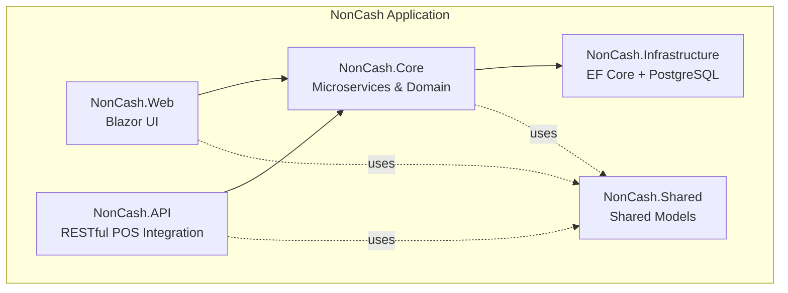
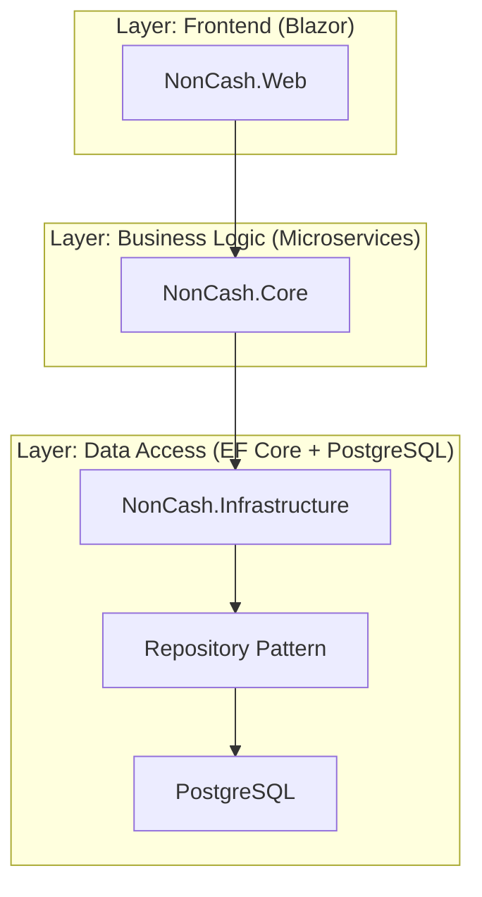
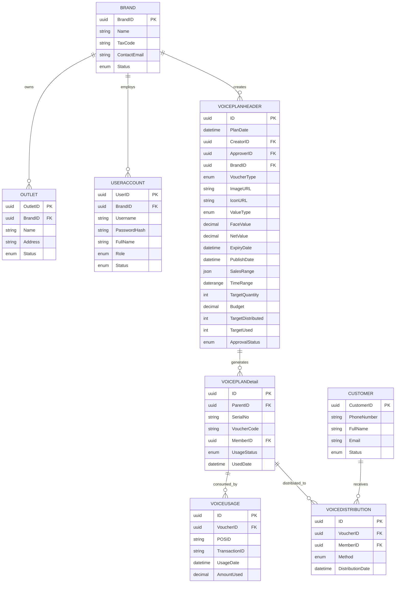
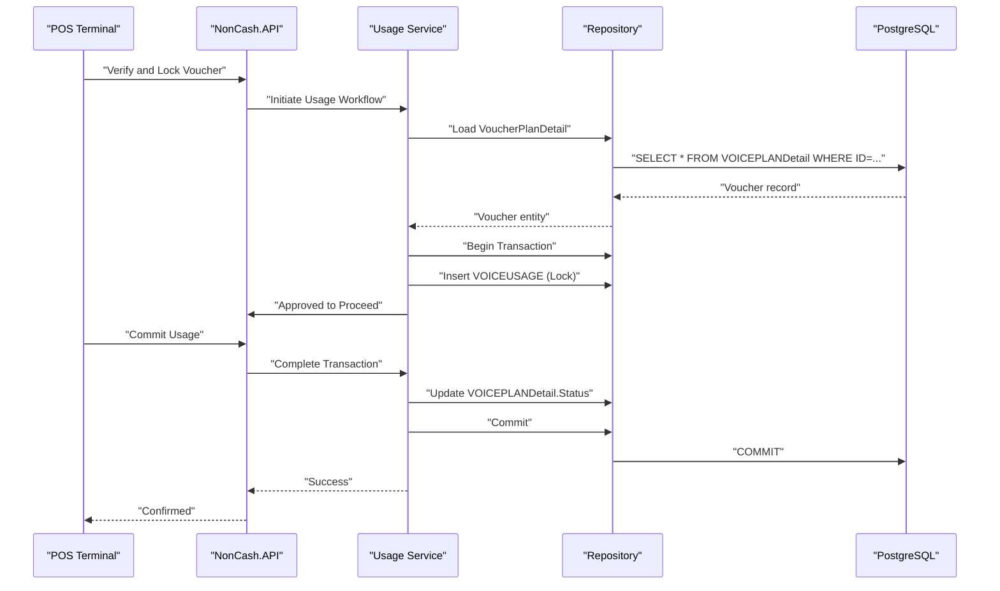
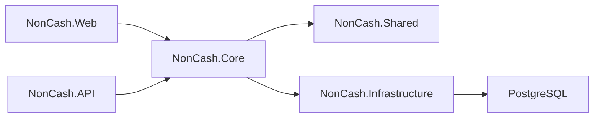

# Entity Relationships and Schema Design

<cite>
**Referenced Files in This Document**
- [data-models.md](file://docs/data-models.md)
- [architecture.md](file://docs/architecture.md)
- [source-tree-analysis.md](file://docs/source-tree-analysis.md)
- [Key Functionalities.txt](file://Key Functionalities.txt)
- [implementation-readiness-report-2026-04-17.md](file://_bmad-output/planning-artifacts/implementation-readiness-report-2026-04-17.md)
</cite>

## Table of Contents
1. [Introduction](#introduction)
2. [Project Structure](#project-structure)
3. [Core Components](#core-components)
4. [Architecture Overview](#architecture-overview)
5. [Detailed Component Analysis](#detailed-component-analysis)
6. [Dependency Analysis](#dependency-analysis)
7. [Performance Considerations](#performance-considerations)
8. [Troubleshooting Guide](#troubleshooting-guide)
9. [Conclusion](#conclusion)
10. [Appendices](#appendices)

## Introduction
This document provides architectural documentation for the entity relationship model and database schema design in NonCash. It details the relational schema, primary keys, foreign key constraints, and table relationships among VoucherPlanHeader, VoucherPlanDetail, VoucherUsage, VoucherDistribution, Brand, Outlet, UserAccount, and Customer. It also explains the three-tier architecture implications for data modeling, including multi-tenancy with BrandID isolation, and documents the database design patterns used, particularly the repository pattern implementation with Entity Framework Core. Finally, it covers indexing strategies, performance considerations, data access patterns, schema evolution, migration strategies, and version management approaches.

## Project Structure
The NonCash project is structured around a 3-tier architecture with clear separation of concerns:
- Frontend (Blazor): Management portal for business users.
- Backend (Microservices in .NET Core): Business logic layer implementing microservices for planning, approval, distribution, usage, and identity/tenant management.
- Data Access Layer (Infrastructure): PostgreSQL-backed persistence using Entity Framework Core with the repository pattern.

**Diagram sources**
- [source-tree-analysis.md:7-34](file://docs/source-tree-analysis.md#L7-L34)

**Section sources**
- [source-tree-analysis.md:1-50](file://docs/source-tree-analysis.md#L1-L50)
- [architecture.md:5-52](file://docs/architecture.md#L5-L52)

## Core Components
This section defines the core entities and their attributes, focusing on primary keys, foreign keys, and relationships. All entities are modeled as relational tables with GUID primary keys and explicit foreign key relationships.

- VoucherPlanHeader
  - PK: ID
  - FK: CreatorID → UserAccount.UserID, ApproverID → UserAccount.UserID, BrandID → Brand.BrandID
  - Attributes include plan metadata, approval status, target quantities, budget, validity ranges, and outlet acceptance lists.

- VoucherPlanDetail
  - PK: ID
  - FK: ParentID → VoucherPlanHeader.ID
  - Attributes include serial number, dynamic voucher code, optional owner assignment, usage status, and used date.

- VoucherUsage
  - PK: ID
  - FK: VoucherID → VoucherPlanDetail.ID
  - Attributes include POS identifier, transaction linkage, usage timestamp, and amount applied.

- VoucherDistribution
  - PK: ID
  - FK: VoucherID → VoucherPlanDetail.ID, MemberID → Customer.CustomerID
  - Attributes include distribution method and timestamp.

- Brand
  - PK: BrandID
  - Attributes include branding details and status.

- Outlet
  - PK: OutletID
  - FK: BrandID → Brand.BrandID
  - Attributes include location details and status.

- UserAccount
  - PK: UserID
  - FK: BrandID → Brand.BrandID (nullable for system super-admins)
  - Attributes include credentials, role, and status.

- Customer
  - PK: CustomerID
  - Attributes include contact details and status.

These definitions are derived from the data models documentation and align with the three-tier architecture’s multi-tenancy strategy enforced via BrandID.

**Section sources**
- [data-models.md:9-98](file://docs/data-models.md#L9-L98)
- [Key Functionalities.txt:7-166](file://Key Functionalities.txt#L7-L166)

## Architecture Overview
NonCash employs a 3-layer SaaS architecture:
- Frontend (Blazor): Provides management dashboards and user interactions.
- Business Logic Layer (Microservices): Encapsulates business capabilities and orchestrates workflows across planning, approval, distribution, usage, and identity/tenant management.
- Data Access Layer (Infrastructure): Implements repository pattern with Entity Framework Core over PostgreSQL, ensuring decoupling and transactional consistency, especially for POS usage.

Multi-tenancy is enforced by isolating data per BrandID across entities such as UserAccount, Outlet, and VoucherPlanHeader, ensuring that users and outlets operate within their tenant boundaries.

**Diagram sources**
- [architecture.md:5-52](file://docs/architecture.md#L5-L52)
- [source-tree-analysis.md:7-34](file://docs/source-tree-analysis.md#L7-L34)

**Section sources**
- [architecture.md:5-52](file://docs/architecture.md#L5-L52)
- [source-tree-analysis.md:1-50](file://docs/source-tree-analysis.md#L1-L50)

## Detailed Component Analysis
This section focuses on the entity relationship model, constraints, and data access patterns.

### Relational Schema and Constraints
The following diagram illustrates the relational schema with primary keys and foreign key relationships among the core entities.

**Diagram sources**
- [data-models.md:9-98](file://docs/data-models.md#L9-L98)
- [Key Functionalities.txt:7-166](file://Key Functionalities.txt#L7-L166)

### Repository Pattern Implementation with Entity Framework Core
The Data Access Layer implements the repository pattern to abstract persistence concerns:
- Interfaces define contracts for data operations.
- Implementations encapsulate EF Core queries, projections, and transactions.
- Dependency injection binds interfaces to implementations, enabling testability and flexibility.

This pattern supports schema evolution and technology changes without affecting the Business Logic Layer.

**Section sources**
- [architecture.md:28-35](file://docs/architecture.md#L28-L35)
- [source-tree-analysis.md:15-18](file://docs/source-tree-analysis.md#L15-L18)

### Multi-Tenancy with BrandID Isolation
Multi-tenancy is achieved by anchoring sensitive entities to BrandID:
- Brand: Tenant root.
- Outlet: Bound to a Brand.
- UserAccount: Optionally bound to a Brand (nullable for super-admins).
- VoucherPlanHeader: Bound to a Brand.

Access control and filtering enforce that users and outlets operate within their tenant boundaries, preventing cross-tenant data leakage.

**Section sources**
- [architecture.md:36-41](file://docs/architecture.md#L36-L41)
- [data-models.md:63-98](file://docs/data-models.md#L63-L98)

### Data Access Patterns
- CRUD Abstraction: Repositories encapsulate create, read, update, delete operations.
- Query Composition: LINQ queries leverage navigation properties and projections to minimize round-trips.
- Transactions: Critical workflows (e.g., POS usage) are wrapped in transactions to ensure atomicity.
- Projection and Pagination: Selective field retrieval and paging improve performance for reporting and dashboards.

**Section sources**
- [architecture.md:28-35](file://docs/architecture.md#L28-L35)
- [Key Functionalities.txt:135-156](file://Key Functionalities.txt#L135-L156)

### Voucher Lifecycle Orchestration (Sequence)
The following sequence illustrates POS usage orchestration, highlighting transactional consistency and state transitions.

**Diagram sources**
- [Key Functionalities.txt:135-156](file://Key Functionalities.txt#L135-L156)
- [data-models.md:44-62](file://docs/data-models.md#L44-L62)

## Dependency Analysis
The dependency relationships across layers and modules are as follows:
- NonCash.Web depends on NonCash.Core for business logic and NonCash.Shared for shared models.
- NonCash.API depends on NonCash.Core and NonCash.Shared.
- NonCash.Core depends on NonCash.Shared and uses interfaces defined in its own layer to interact with NonCash.Infrastructure.
- NonCash.Infrastructure depends on PostgreSQL and EF Core, exposing repositories to NonCash.Core.

**Diagram sources**
- [source-tree-analysis.md:7-34](file://docs/source-tree-analysis.md#L7-L34)

**Section sources**
- [source-tree-analysis.md:1-50](file://docs/source-tree-analysis.md#L1-L50)

## Performance Considerations
Indexing and performance strategies:
- Primary Keys: Ensure clustered indexes on GUID PKs for efficient row access.
- Foreign Keys: Add non-clustered indexes on FK columns (e.g., BrandID, UserID, OutletID, CustomerID) to accelerate joins.
- High-Cardinality Filters: Index columns frequently used in WHERE clauses (e.g., SerialNo, PhoneNumber, ApprovalStatus).
- Range Queries: Index DateRange and DateTime fields used in validity checks (e.g., ExpiryDate, PublishDate, UsageDate).
- Composite Indexes: Consider composite indexes for frequent filter combinations (e.g., BrandID + Status, OutletID + Status).
- Query Patterns: Use projection to fetch only required columns; apply pagination for large result sets.
- Concurrency: Use optimistic concurrency tokens for entities updated by multiple services.
- Transactions: Keep transactions short; avoid long-held locks during POS usage workflows.

[No sources needed since this section provides general guidance]

## Troubleshooting Guide
Common issues and resolutions:
- Cross-Tenant Access Violations: Verify BrandID filters on all queries for UserAccount, Outlet, and VoucherPlanHeader.
- Duplicate SerialNo or PhoneNumber: Enforce unique constraints at the database level and handle uniqueness violations gracefully.
- POS Usage Conflicts: Ensure transactional boundaries around voucher locking and committing; implement retry logic for transient failures.
- Migration Failures: Validate migration scripts against PostgreSQL compatibility; test in staging before applying to production.
- Audit and Tracing: Log repository operations and key business events for diagnostics and compliance.

**Section sources**
- [architecture.md:36-41](file://docs/architecture.md#L36-L41)
- [Key Functionalities.txt:135-156](file://Key Functionalities.txt#L135-L156)

## Conclusion
NonCash’s relational schema and repository-driven persistence align with a robust 3-tier SaaS architecture. Multi-tenancy is enforced via BrandID across core entities, while the microservices-based Business Logic Layer orchestrates complex workflows such as voucher planning, distribution, and POS usage. The documented entity relationships, indexing strategies, and migration practices provide a solid foundation for scalable, secure, and maintainable operations.

[No sources needed since this section summarizes without analyzing specific files]

## Appendices
- Implementation Readiness: The project demonstrates strong adherence to database entity mapping and story dependencies, with foundational tables established early and transaction tables introduced progressively.

**Section sources**
- [_bmad-output/implementation-readiness-report-2026-04-17.md:91-123](file://_bmad-output/planning-artifacts/implementation-readiness-report-2026-04-17.md#L91-L123)