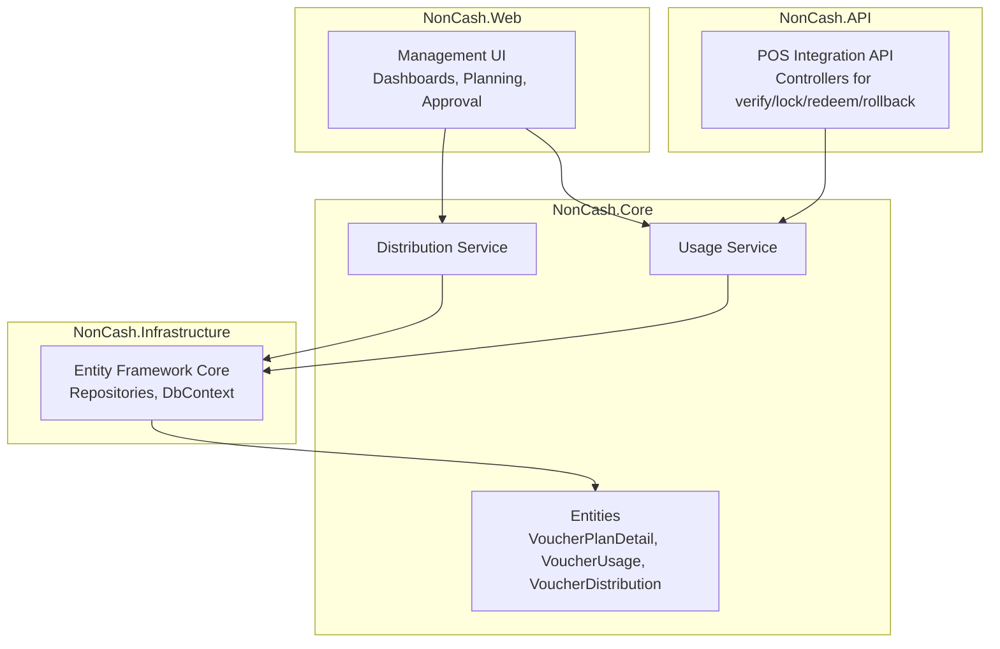
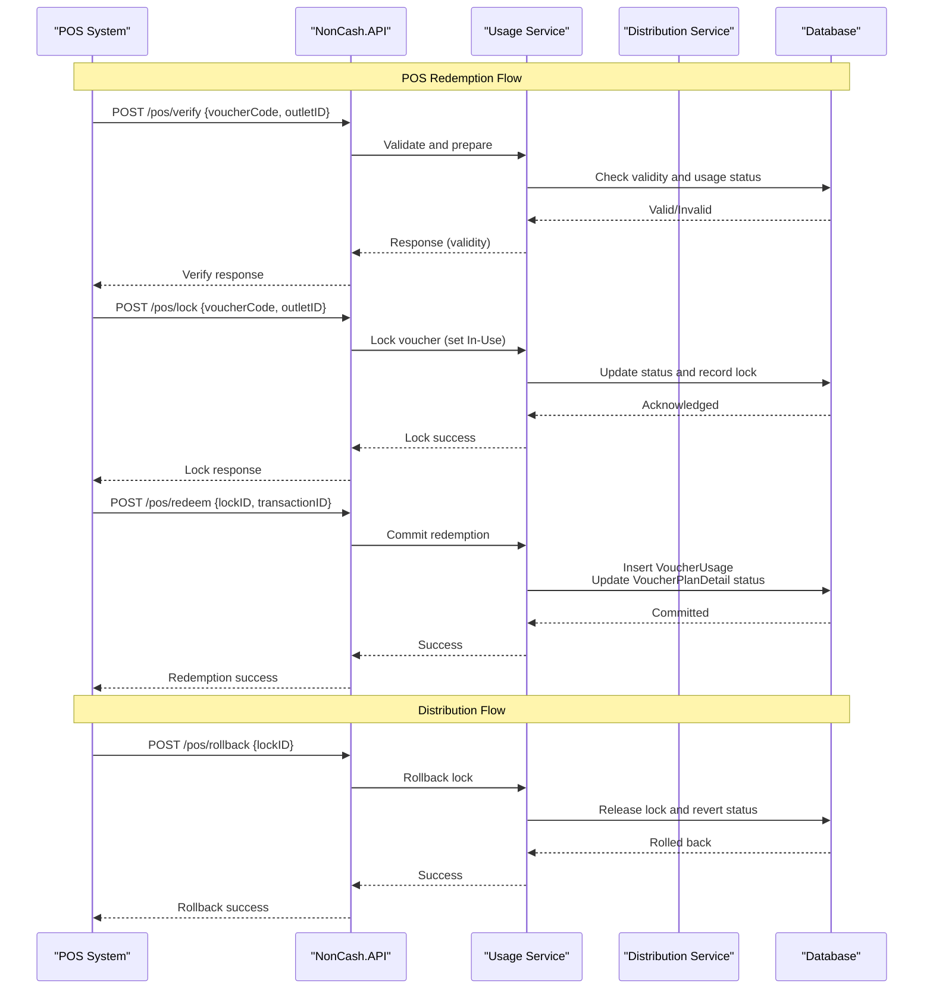
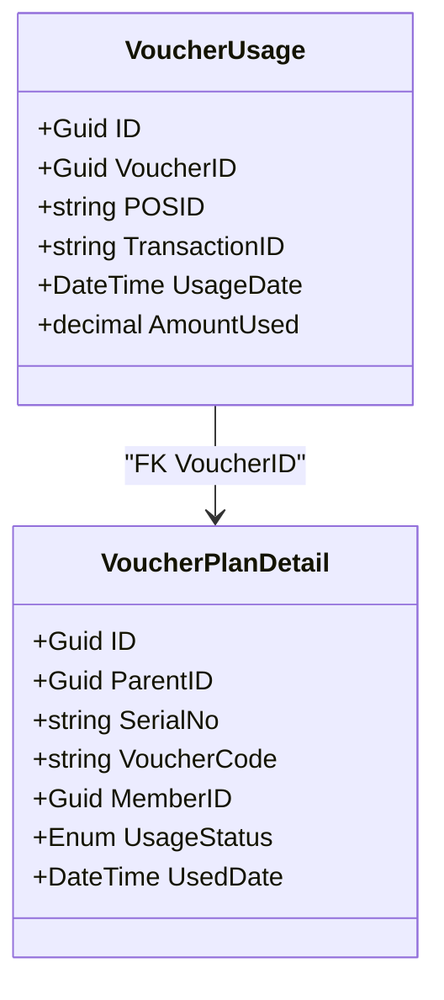
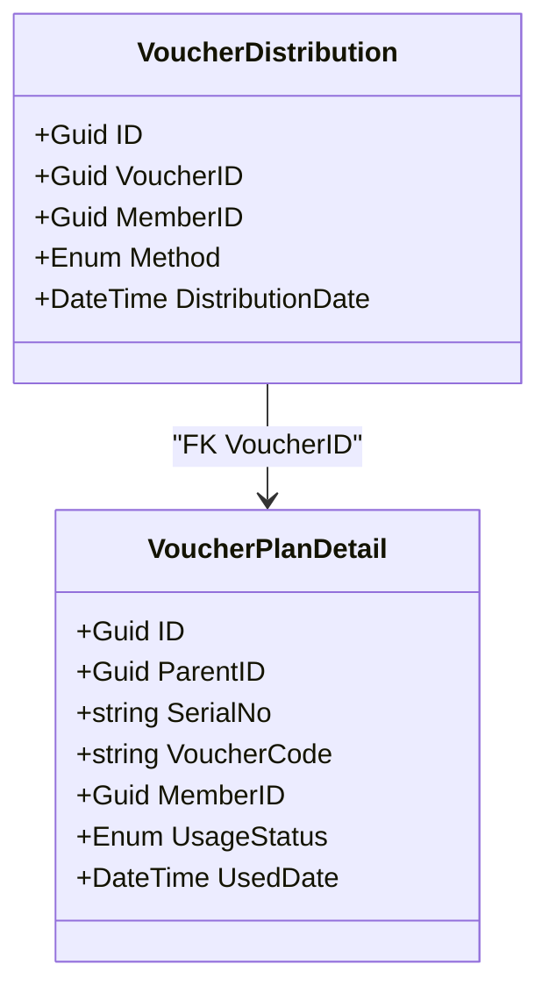
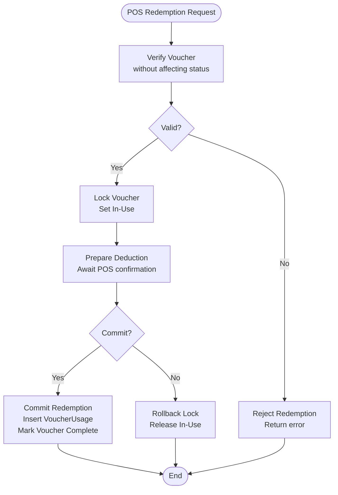
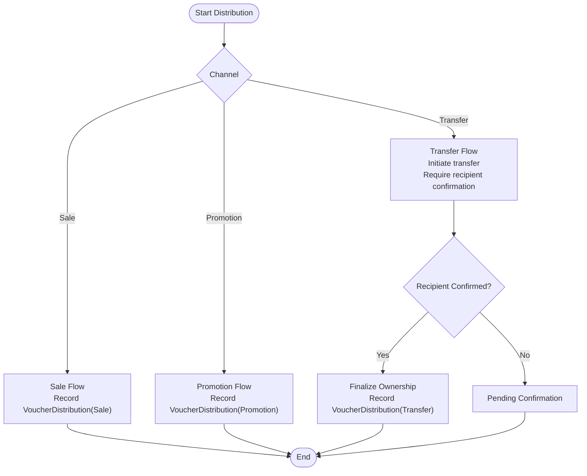
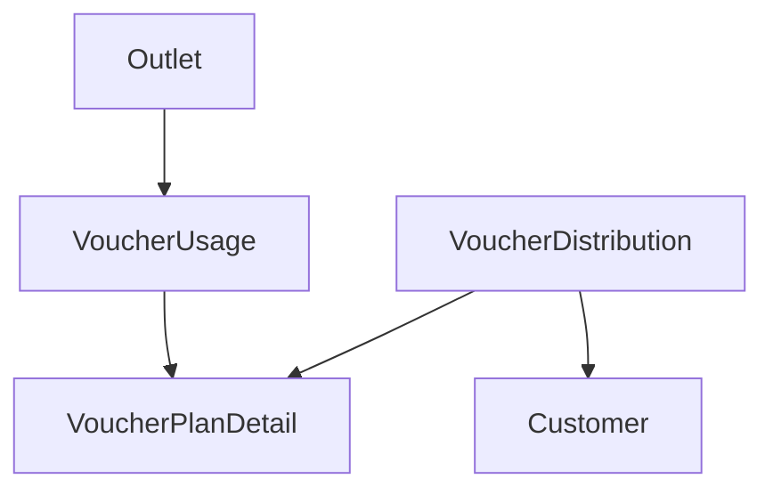
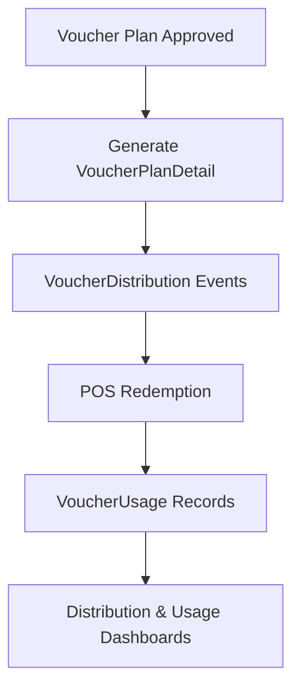

# Tracking and Distribution Entities

<cite>
**Referenced Files in This Document**
- [data-models.md](file://docs/data-models.md)
- [architecture.md](file://docs/architecture.md)
- [api-contracts.md](file://docs/api-contracts.md)
- [epics.md](file://_bmad-output/planning-artifacts/epics.md)
- [Key Functionalities.txt](file://Key Functionalities.txt)
- [source-tree-analysis.md](file://docs/source-tree-analysis.md)
</cite>

## Table of Contents
1. [Introduction](#introduction)
2. [Project Structure](#project-structure)
3. [Core Components](#core-components)
4. [Architecture Overview](#architecture-overview)
5. [Detailed Component Analysis](#detailed-component-analysis)
6. [Dependency Analysis](#dependency-analysis)
7. [Performance Considerations](#performance-considerations)
8. [Troubleshooting Guide](#troubleshooting-guide)
9. [Conclusion](#conclusion)
10. [Appendices](#appendices)

## Introduction
This document focuses on the tracking and distribution entities central to the NonCash platform: VoucherUsage (POS redemption history) and VoucherDistribution (voucher delivery tracking). It documents the data structures, transaction logging, distribution methods, and audit trails. It also explains the relationships between these entities and core business entities, details tracking fields such as transaction IDs, POS identifiers, distribution methods, and timestamps, and illustrates data flow patterns from creation to redemption. Finally, it outlines business rules governing usage tracking and distribution analytics, and provides typical tracking scenarios and reporting query patterns.

## Project Structure
The NonCash project follows a 3-layer SaaS architecture with microservices. The relevant structure for tracking and distribution includes:
- NonCash.Core: Business logic and domain entities (including tracking entities).
- NonCash.API: POS integration endpoints for verification, locking, redemption, and rollback.
- NonCash.Web: Management UI for planning, approvals, and dashboards.
- NonCash.Infrastructure: Data access layer with Entity Framework and PostgreSQL.

**Diagram sources**
- [source-tree-analysis.md:1-50](file://docs/source-tree-analysis.md#L1-L50)
- [architecture.md:17-26](file://docs/architecture.md#L17-L26)

**Section sources**
- [source-tree-analysis.md:1-50](file://docs/source-tree-analysis.md#L1-L50)
- [architecture.md:17-26](file://docs/architecture.md#L17-L26)

## Core Components
This section documents the two tracking entities and their roles in the system.

- VoucherUsage
  - Purpose: Stores the history of voucher redemptions at POS.
  - Key fields: ID, VoucherID (FK to VoucherPlanDetail), POSID, TransactionID, UsageDate, AmountUsed.
  - Audit trail: Captures POS redemption events with transaction linkage and amount.

- VoucherDistribution
  - Purpose: Tracks how vouchers were sent to customers.
  - Key fields: ID, VoucherID, MemberID, Method (Sale, Promotion, Transfer), DistributionDate.
  - Audit trail: Captures distribution events with method and timestamp.

Relationships to core business entities:
- VoucherPlanDetail: Parent entity for both VoucherUsage and VoucherDistribution records.
- Outlet: POS systems are configured via Outlets; POSID references Outlet identifiers.
- Customer: MemberID identifies the recipient of distribution.

**Section sources**
- [data-models.md:44-62](file://docs/data-models.md#L44-L62)
- [epics.md:244-256](file://_bmad-output/planning-artifacts/epics.md#L244-L256)

## Architecture Overview
The POS redemption workflow integrates with the Usage Service and logs redemptions into VoucherUsage. Distribution events are handled by the Distribution Service and logged into VoucherDistribution. Both services operate within the Business Logic Layer and persist data via the Data Access Layer.

**Diagram sources**
- [api-contracts.md:14-87](file://docs/api-contracts.md#L14-L87)
- [epics.md:265-317](file://_bmad-output/planning-artifacts/epics.md#L265-L317)
- [data-models.md:44-62](file://docs/data-models.md#L44-L62)

**Section sources**
- [api-contracts.md:14-87](file://docs/api-contracts.md#L14-L87)
- [epics.md:265-317](file://_bmad-output/planning-artifacts/epics.md#L265-L317)

## Detailed Component Analysis

### VoucherUsage Analysis
VoucherUsage captures redemption events with precise linkage to POS and transaction metadata.

- Data fields and semantics:
  - ID: Unique identifier for the usage record.
  - VoucherID: Links to the specific VoucherPlanDetail.
  - POSID: Identifier of the outlet/store where the redemption occurred.
  - TransactionID: Link to the POS transaction for reconciliation.
  - UsageDate: Timestamp of the redemption event.
  - AmountUsed: Monetary amount deducted from the voucher.

- Business rules:
  - Redemptions occur only when the voucher is in a valid state and locked during the transaction.
  - Committing a redemption permanently marks the voucher as used and records the amount and timestamp.
  - Rollback releases the lock without creating a usage record.

- Audit trail:
  - Each redemption creates a VoucherUsage record with POSID and TransactionID for reconciliation and reporting.

**Diagram sources**
- [data-models.md:46-53](file://docs/data-models.md#L46-L53)

**Section sources**
- [data-models.md:46-53](file://docs/data-models.md#L46-L53)
- [epics.md:292-317](file://_bmad-output/planning-artifacts/epics.md#L292-L317)

### VoucherDistribution Analysis
VoucherDistribution tracks how vouchers reached recipients across multiple channels.

- Data fields and semantics:
  - ID: Unique identifier for the distribution event.
  - VoucherID: Links to the VoucherPlanDetail record.
  - MemberID: Recipient’s identifier (Customer).
  - Method: Enumerated distribution channel (Sale, Promotion, Transfer).
  - DistributionDate: Timestamp of the distribution action.

- Business rules:
  - Distribution events are recorded upon successful completion of the distribution process (e.g., sale, promotion, transfer).
  - Transfer requires confirmation from the recipient to finalize ownership.

- Audit trail:
  - Distribution logs enable dashboards and reporting on distribution velocity and channel effectiveness.

**Diagram sources**
- [data-models.md:55-61](file://docs/data-models.md#L55-L61)

**Section sources**
- [data-models.md:55-61](file://docs/data-models.md#L55-L61)
- [epics.md:205-243](file://_bmad-output/planning-artifacts/epics.md#L205-L243)

### POS Redemption Workflow
The POS redemption workflow ensures transactional integrity and accurate audit logging.

**Diagram sources**
- [epics.md:265-317](file://_bmad-output/planning-artifacts/epics.md#L265-L317)
- [api-contracts.md:14-87](file://docs/api-contracts.md#L14-L87)

**Section sources**
- [epics.md:265-317](file://_bmad-output/planning-artifacts/epics.md#L265-L317)
- [api-contracts.md:14-87](file://docs/api-contracts.md#L14-L87)

### Distribution Channels and Ownership
Distribution occurs through three primary methods, each with distinct ownership and confirmation requirements.

**Diagram sources**
- [epics.md:205-243](file://_bmad-output/planning-artifacts/epics.md#L205-L243)
- [Key Functionalities.txt:93-134](file://Key Functionalities.txt#L93-L134)

**Section sources**
- [epics.md:205-243](file://_bmad-output/planning-artifacts/epics.md#L205-L243)
- [Key Functionalities.txt:93-134](file://Key Functionalities.txt#L93-L134)

## Dependency Analysis
Tracking entities depend on core business entities and are consumed by services and UI dashboards.

- Coupling:
  - VoucherUsage and VoucherDistribution both reference VoucherPlanDetail, ensuring traceability from distribution to usage.
  - POSID in VoucherUsage ties redemption events to Outlet configuration.
  - MemberID in VoucherDistribution ties distribution events to Customer profiles.

- Cohesion:
  - Each entity encapsulates a single responsibility: usage logging and distribution tracking respectively.

- External dependencies:
  - POS Integration API enforces authentication and transactional integrity for redemption.
  - Management UI consumes distribution and usage data for dashboards.

**Diagram sources**
- [data-models.md:44-62](file://docs/data-models.md#L44-L62)
- [architecture.md:17-26](file://docs/architecture.md#L17-L26)

**Section sources**
- [data-models.md:44-62](file://docs/data-models.md#L44-L62)
- [architecture.md:17-26](file://docs/architecture.md#L17-L26)

## Performance Considerations
- Indexing:
  - Index VoucherUsage.VoucherID and VoucherUsage.POSID for fast redemption reporting.
  - Index VoucherDistribution.VoucherID and VoucherDistribution.DistributionDate for distribution analytics.
- Transactions:
  - Redemption operations use transaction begin/commit/rollback to ensure atomicity and consistency.
- Scalability:
  - Microservices architecture allows independent scaling of Distribution and Usage services.
- Reporting:
  - Aggregate distribution counts by Method and Outlet for distribution dashboards.
  - Aggregate usage totals by POSID and date ranges for redemption analytics.

[No sources needed since this section provides general guidance]

## Troubleshooting Guide
Common issues and resolutions:
- Redemption without usage record:
  - Cause: Rollback was invoked or transaction did not commit.
  - Resolution: Verify POS rollback calls and confirm commit flow.
- Duplicate usage entries:
  - Cause: Commit called multiple times for the same lock.
  - Resolution: Enforce idempotency at the Usage Service level using TransactionID.
- Distribution not reflected:
  - Cause: Transfer not confirmed by recipient or promotion import errors.
  - Resolution: Validate confirmation flows and import logs.

**Section sources**
- [epics.md:305-317](file://_bmad-output/planning-artifacts/epics.md#L305-L317)
- [Key Functionalities.txt:127-134](file://Key Functionalities.txt#L127-L134)

## Conclusion
VoucherUsage and VoucherDistribution form the backbone of NonCash’s tracking and distribution capabilities. They provide precise audit trails, enforce business rules around POS redemption and distribution ownership, and enable actionable reporting. Their relationships to VoucherPlanDetail, Outlet, and Customer ensure end-to-end visibility from creation to redemption and from issuance to utilization.

[No sources needed since this section summarizes without analyzing specific files]

## Appendices

### Data Flow Patterns: Creation to Redemption

**Diagram sources**
- [Key Functionalities.txt:50-68](file://Key Functionalities.txt#L50-L68)
- [epics.md:265-317](file://_bmad-output/planning-artifacts/epics.md#L265-L317)

### Typical Tracking Scenarios and Query Patterns
- Scenario 1: Monthly distribution analytics
  - Query pattern: Group VoucherDistribution by Method and DistributionDate to compute distribution volumes per channel.
- Scenario 2: Redemption performance by POS
  - Query pattern: Filter VoucherUsage by POSID and date range to compute total AmountUsed and count of redemptions.
- Scenario 3: Transfer ownership tracking
  - Query pattern: Filter VoucherDistribution where Method = Transfer and join with confirmation status to track pending vs finalized transfers.
- Scenario 4: Redemption reconciliation
  - Query pattern: Join VoucherUsage with POS transaction logs using TransactionID to reconcile POS and backend systems.

[No sources needed since this section provides general guidance]