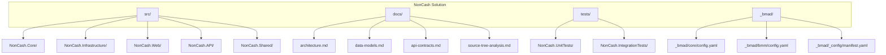
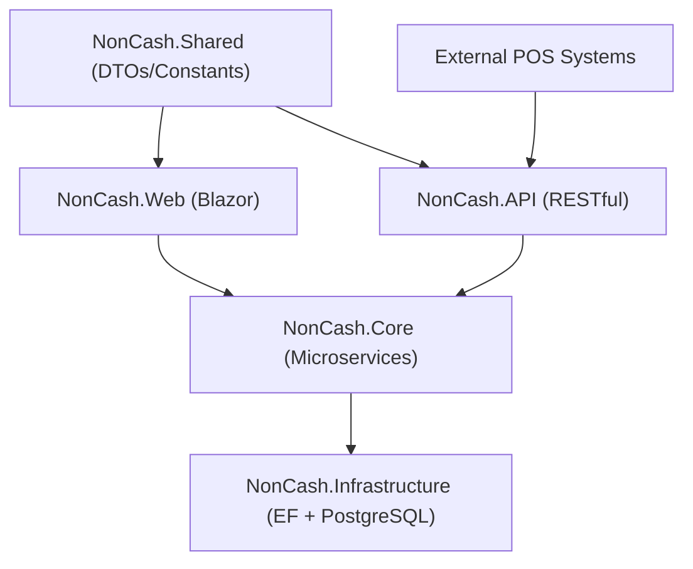
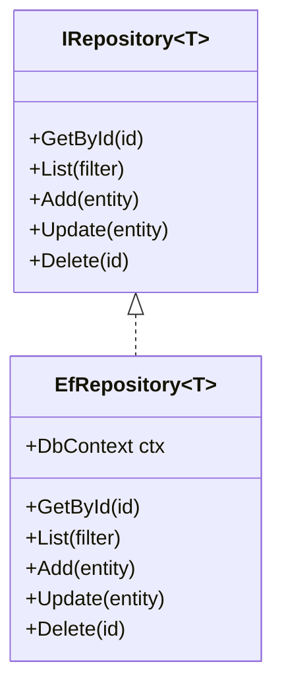
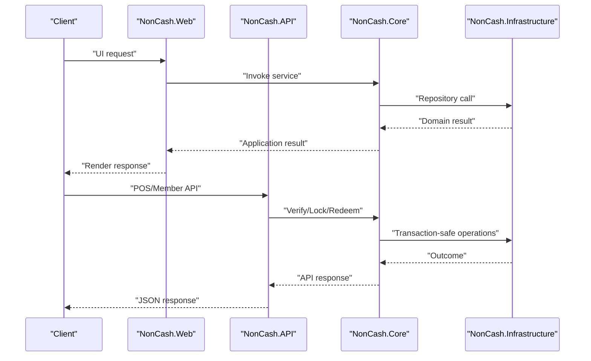
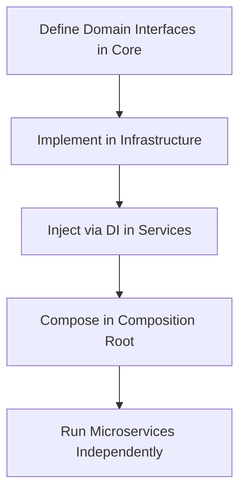
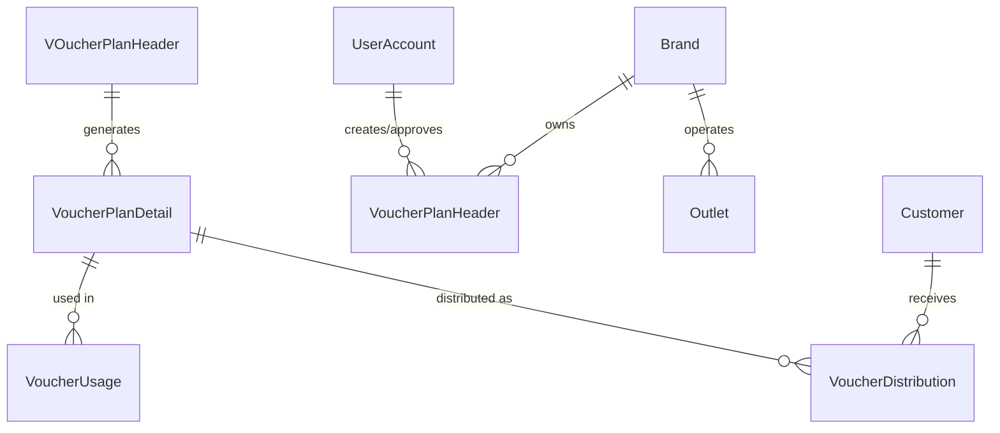
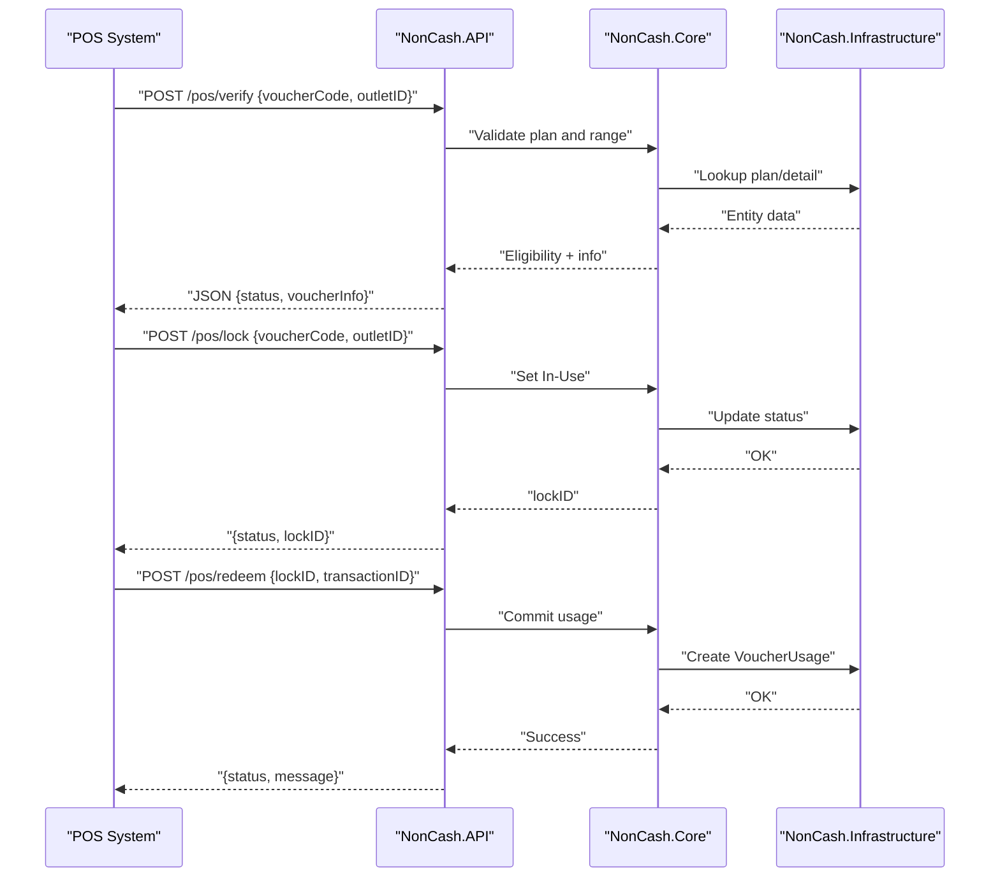
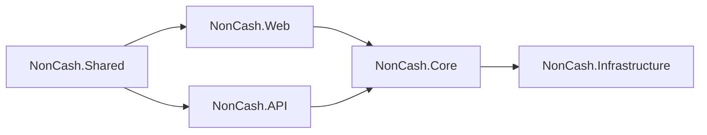
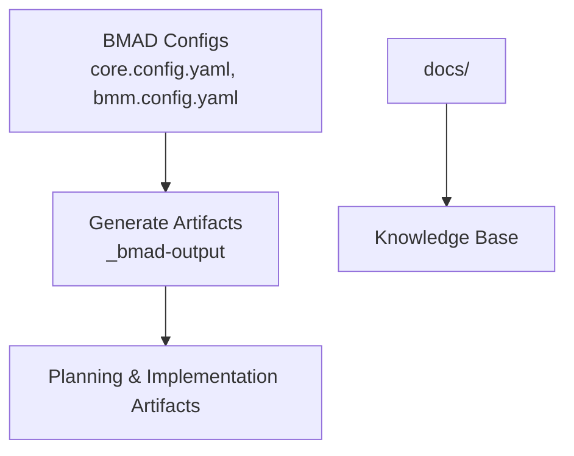

# Development Guidelines and Best Practices

<cite>
**Referenced Files in This Document**
- [BMAD_STRUCTURE.md](file://BMAD_STRUCTURE.md)
- [Key Functionalities.txt](file://Key Functionalities.txt)
- [description.txt](file://description.txt)
- [docs/index.md](file://docs/index.md)
- [docs/architecture.md](file://docs/architecture.md)
- [docs/data-models.md](file://docs/data-models.md)
- [docs/api-contracts.md](file://docs/api-contracts.md)
- [docs/source-tree-analysis.md](file://docs/source-tree-analysis.md)
- [_bmad/core/config.yaml](file://_bmad/core/config.yaml)
- [_bmad/bmm/config.yaml](file://_bmad/bmm/config.yaml)
- [_bmad/_config/manifest.yaml](file://_bmad/_config/manifest.yaml)
</cite>

## Table of Contents
1. [Introduction](#introduction)
2. [Project Structure](#project-structure)
3. [Core Components](#core-components)
4. [Architecture Overview](#architecture-overview)
5. [Detailed Component Analysis](#detailed-component-analysis)
6. [Dependency Analysis](#dependency-analysis)
7. [Performance Considerations](#performance-considerations)
8. [Troubleshooting Guide](#troubleshooting-guide)
9. [Conclusion](#conclusion)
10. [Appendices](#appendices)

## Introduction
This document provides comprehensive development guidelines for the NonCash project, focusing on coding standards, testing strategies, and development best practices. It consolidates the project’s architecture, patterns, and operational practices derived from the repository’s documentation and BMAD configuration. The guidelines emphasize adherence to a layered architecture, microservices organization, repository pattern, dependency injection, SOLID principles, and security controls. They also outline testing strategies (unit, integration, acceptance), performance optimization, logging, error handling, BMAD-driven documentation and artifacts, code review, CI/quality assurance, and multi-service consistency.

## Project Structure
The repository follows a structured, layered approach with a target source tree that supports a 3-layer architecture and microservices. The structure separates concerns across Core (business logic), Infrastructure (data access), Web (Blazor UI), API (POS integration), and Shared (common models) layers, with dedicated tests and BMAD automation.

**Diagram sources**
- [docs/source-tree-analysis.md:7-34](file://docs/source-tree-analysis.md#L7-L34)
- [docs/index.md:12-26](file://docs/index.md#L12-L26)

**Section sources**
- [docs/source-tree-analysis.md:3-34](file://docs/source-tree-analysis.md#L3-L34)
- [docs/index.md:12-26](file://docs/index.md#L12-L26)

## Core Components
- NonCash.Core: Houses business entities, interfaces, microservices, and business rule specifications. It is intentionally decoupled from data access to enable independent evolution.
- NonCash.Infrastructure: Implements Entity Framework Core with PostgreSQL, exposes repositories, and manages migrations.
- NonCash.Web: Blazor application for management staff, dashboards, and administrative workflows.
- NonCash.API: RESTful API for POS systems and member app, secured with API keys and JWT.
- NonCash.Shared: Shared DTOs and constants used across Web and API.
- Tests: Dedicated unit and integration test projects aligned with the layered architecture.

These components collectively enforce separation of concerns, testability, and maintainability.

**Section sources**
- [docs/source-tree-analysis.md:10-28](file://docs/source-tree-analysis.md#L10-L28)
- [docs/architecture.md:17-35](file://docs/architecture.md#L17-L35)

## Architecture Overview
NonCash adopts a 3-layer SaaS architecture:
- GUI (Blazor): Manages user interactions for business admins and marketing staff.
- BLL (Microservices): Encapsulates business logic and orchestrates cross-service workflows.
- DAL (Infrastructure): Provides data access via Entity Framework and repositories.

Security is enforced through API Key Authentication and JWT Token Management. The system emphasizes multi-tenancy via BrandID and dynamic voucher code logic to prevent fraud.

**Diagram sources**
- [docs/architecture.md:9-35](file://docs/architecture.md#L9-L35)
- [docs/data-models.md:1-98](file://docs/data-models.md#L1-L98)
- [docs/api-contracts.md:1-109](file://docs/api-contracts.md#L1-L109)

**Section sources**
- [docs/architecture.md:5-52](file://docs/architecture.md#L5-L52)
- [description.txt:16-27](file://description.txt#L16-L27)

## Detailed Component Analysis

### Repository Pattern Implementation
- Abstraction: Interfaces define contracts for data access in Core.
- Implementation: Infrastructure provides EF-based repository implementations.
- Benefits: Decouples business logic from persistence, simplifies mocking, and enables schema evolution.

**Diagram sources**
- [docs/source-tree-analysis.md:11-18](file://docs/source-tree-analysis.md#L11-L18)

**Section sources**
- [docs/source-tree-analysis.md:11-18](file://docs/source-tree-analysis.md#L11-L18)
- [BMAD_STRUCTURE.md:44-47](file://BMAD_STRUCTURE.md#L44-L47)

### Dependency Injection and Microservices
- DI Container: Configure services and scoped lifetimes in the composition root (e.g., Program.cs or Startup.cs).
- Microservices: Each service encapsulates bounded contexts (Planning, Approval, Distribution, Usage, Identity/Tenant).
- Loose Coupling: Services communicate via clean interfaces and shared DTOs.

**Diagram sources**
- [docs/architecture.md:17-35](file://docs/architecture.md#L17-L35)
- [docs/api-contracts.md:14-109](file://docs/api-contracts.md#L14-L109)

**Section sources**
- [docs/architecture.md:17-26](file://docs/architecture.md#L17-L26)
- [docs/source-tree-analysis.md:13-14](file://docs/source-tree-analysis.md#L13-L14)

### SOLID Principles Application
- Single Responsibility: Each microservice focuses on a single responsibility (e.g., Usage Service for POS redemption).
- Open/Closed: Business rules encapsulated in specifications/services to minimize invasive changes.
- Liskov Substitution: Repository interfaces ensure substitutability of EF implementations.
- Interface Segregation: Clear separation between domain interfaces and EF implementations.
- Dependency Inversion: Core depends on abstractions (interfaces), not on Infrastructure.

**Diagram sources**
- [docs/source-tree-analysis.md:11-18](file://docs/source-tree-analysis.md#L11-L18)
- [docs/architecture.md:17-26](file://docs/architecture.md#L17-L26)

**Section sources**
- [docs/architecture.md:17-26](file://docs/architecture.md#L17-L26)
- [docs/source-tree-analysis.md:11-18](file://docs/source-tree-analysis.md#L11-L18)

### Data Models and Transactions
- Relational model with PostgreSQL and EF Core.
- Entities represent core business objects (VoucherPlanHeader, VoucherPlanDetail, VoucherUsage, VoucherDistribution, Brand, Outlet, UserAccount, Customer).
- Transactional integrity is critical for POS usage (Lock -> Commit/Rollback).

**Diagram sources**
- [docs/data-models.md:11-98](file://docs/data-models.md#L11-L98)

**Section sources**
- [docs/data-models.md:11-98](file://docs/data-models.md#L11-L98)

### API Contracts and Security
- POS Integration API: Verify, Lock, Redeem, and Rollback endpoints with JSON payloads and responses.
- Member App API: List My Vouchers and Transfer endpoints protected by JWT.
- Security: API Key Authentication for POS and JWT for member app; dynamic voucher code logic prevents fraud.

**Diagram sources**
- [docs/api-contracts.md:14-87](file://docs/api-contracts.md#L14-L87)
- [docs/architecture.md:36-41](file://docs/architecture.md#L36-L41)

**Section sources**
- [docs/api-contracts.md:14-109](file://docs/api-contracts.md#L14-L109)
- [docs/architecture.md:36-41](file://docs/architecture.md#L36-L41)

### Coding Conventions and Naming
- Layered naming: NonCash.Core, NonCash.Infrastructure, NonCash.Web, NonCash.API, NonCash.Shared.
- Service naming: Feature-based microservices (Planning, Approval, Distribution, Usage, Identity/Tenant).
- DTOs: Clearly separated in Shared and API layers for transport models.
- Constants: Centralized in Shared for reuse across UI and API.

**Section sources**
- [docs/source-tree-analysis.md:10-28](file://docs/source-tree-analysis.md#L10-L28)
- [docs/architecture.md:17-26](file://docs/architecture.md#L17-L26)

## Dependency Analysis
The solution exhibits strong cohesion within layers and low coupling across boundaries. Core depends on abstractions; Infrastructure implements them; Web and API consume services from Core; Shared provides common models.

**Diagram sources**
- [docs/source-tree-analysis.md:10-28](file://docs/source-tree-analysis.md#L10-L28)

**Section sources**
- [docs/source-tree-analysis.md:10-28](file://docs/source-tree-analysis.md#L10-L28)

## Performance Considerations
- Database: PostgreSQL with EF Core; leverage migrations, indexes, and connection pooling.
- Transactions: Use explicit transactions for POS usage to ensure atomicity (Lock -> Commit/Rollback).
- Caching: Consider read-mostly DTO caching for frequently accessed plan and brand data.
- Asynchronous I/O: Prefer async/await in repositories and services to improve throughput.
- Logging: Centralize logs with structured logging and correlation IDs for tracing.
- Error Handling: Return meaningful HTTP statuses and error envelopes; avoid leaking sensitive details.

[No sources needed since this section provides general guidance]

## Troubleshooting Guide
- Authentication Failures: Verify API Key presence and validity; confirm JWT token issuance and scopes.
- Voucher Validation Issues: Confirm plan approval status, publish date, expiry date, and outlet eligibility.
- POS Redemption Failures: Ensure Lock precedes Redeem; handle Rollback on failure; verify transactionID uniqueness.
- Data Consistency: Use transaction scopes around VoucherUsage creation and status updates.
- Logging: Capture request IDs, endpoint paths, and entity identifiers; include contextual properties for auditability.

**Section sources**
- [docs/api-contracts.md:14-109](file://docs/api-contracts.md#L14-L109)
- [docs/architecture.md:36-41](file://docs/architecture.md#L36-L41)

## Conclusion
The NonCash project establishes a robust, layered, and microservices-oriented architecture with clear separation of concerns, strong security controls, and well-defined API contracts. By adhering to the repository pattern, dependency injection, SOLID principles, and the documented testing and operational practices, teams can maintain high code quality, scalability, and reliability across the multi-service ecosystem.

[No sources needed since this section summarizes without analyzing specific files]

## Appendices

### Testing Strategy
- Unit Testing: Validate business logic and service methods in isolation using mocks for repositories and external dependencies.
- Integration Testing: Exercise repository and service interactions against a test database; cover transactional flows (e.g., POS usage).
- Acceptance Testing: Validate end-to-end scenarios (e.g., Plan Approval -> Distribution -> POS Redemption) using contract tests and API tests.

**Section sources**
- [docs/source-tree-analysis.md:31-32](file://docs/source-tree-analysis.md#L31-L32)

### Logging and Error Handling Patterns
- Logging: Use structured logging with correlation IDs; log at Info/Warn/Error/Fatal levels; avoid sensitive data exposure.
- Error Handling: Return standardized error envelopes; map exceptions to appropriate HTTP statuses; surface actionable messages.

**Section sources**
- [docs/architecture.md:36-41](file://docs/architecture.md#L36-L41)

### BMAD Methodology Integration
- Configuration: Core and BMM modules define project metadata, output folders, and languages.
- Artifacts: Planning and implementation artifacts are generated under _bmad-output; knowledge is sourced from docs/.
- Execution: Modules are built-in; IDEs configured include Claude Code, Gemini, Antigravity, Qwen.

**Diagram sources**
- [_bmad/core/config.yaml:1-10](file://_bmad/core/config.yaml#L1-L10)
- [_bmad/bmm/config.yaml:1-17](file://_bmad/bmm/config.yaml#L1-L17)
- [_bmad/_config/manifest.yaml:1-25](file://_bmad/_config/manifest.yaml#L1-L25)

**Section sources**
- [_bmad/core/config.yaml:1-10](file://_bmad/core/config.yaml#L1-L10)
- [_bmad/bmm/config.yaml:1-17](file://_bmad/bmm/config.yaml#L1-L17)
- [_bmad/_config/manifest.yaml:1-25](file://_bmad/_config/manifest.yaml#L1-L25)

### Code Review and Continuous Integration
- Code Reviews: Enforce pull request checks, peer reviews, and adherence to naming/convention guidelines.
- CI/CD: Automate builds, unit/integration tests, and artifact generation; gate deployments with quality gates.
- Quality Assurance: Static analysis, dependency checks, and security scans integrated into pipelines.

[No sources needed since this section provides general guidance]

### Maintaining Consistency Across Multi-Service Architecture
- Shared Contracts: Keep DTOs and constants in NonCash.Shared; align versions across services.
- API Contracts: Maintain API contracts in docs/api-contracts.md; treat them as source of truth for external integrations.
- Data Contracts: Align entity models and relationships in docs/data-models.md; evolve migrations carefully.
- Documentation: Keep docs/index.md and BMAD outputs synchronized with code changes.

**Section sources**
- [docs/api-contracts.md:1-109](file://docs/api-contracts.md#L1-L109)
- [docs/data-models.md:1-98](file://docs/data-models.md#L1-L98)
- [docs/index.md:12-26](file://docs/index.md#L12-L26)