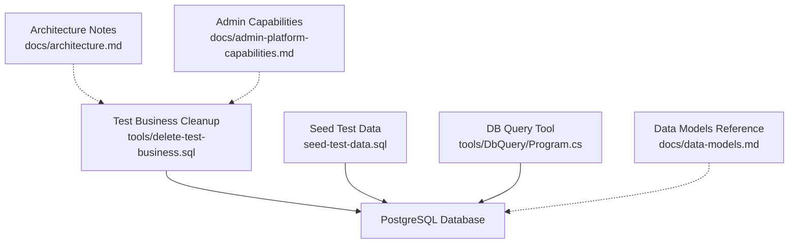
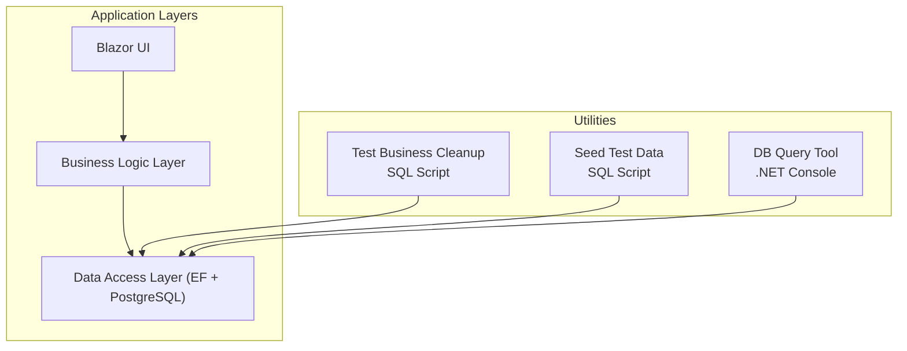
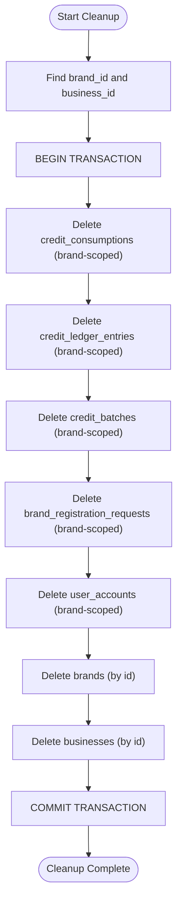
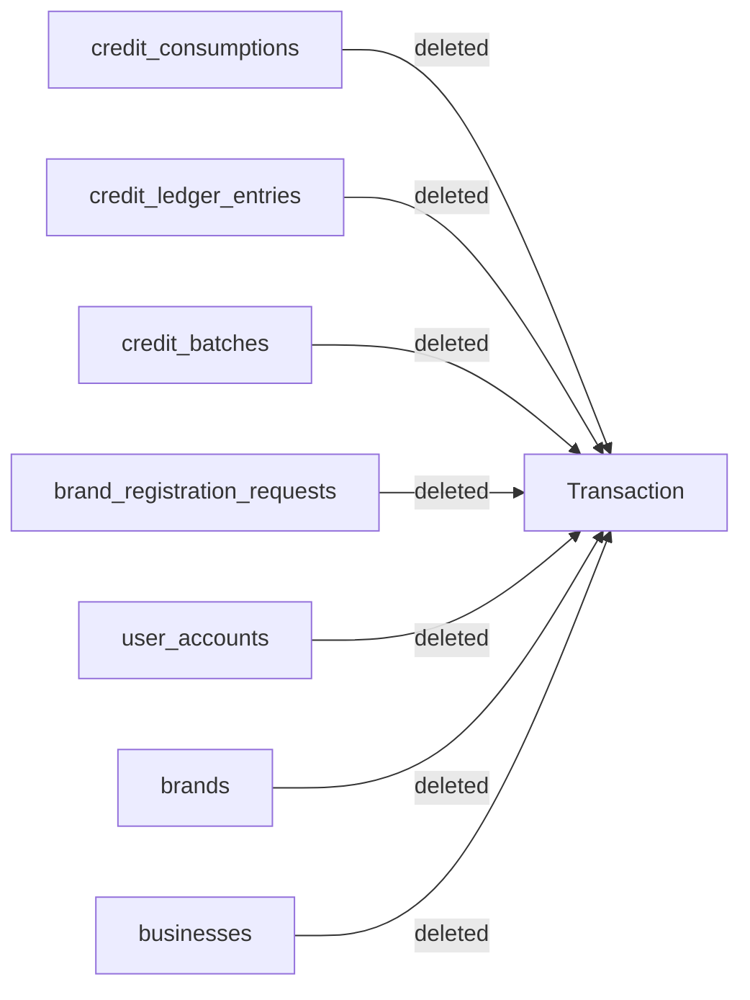

# Test Business Cleanup Utility

<cite>
**Referenced Files in This Document**
- [delete-test-business.sql](file://tools/delete-test-business.sql)
- [seed-test-data.sql](file://seed-test-data.sql)
- [Program.cs](file://tools/DbQuery/Program.cs)
- [data-models.md](file://docs/data-models.md)
- [architecture.md](file://docs/architecture.md)
- [admin-platform-capabilities.md](file://docs/admin-platform-capabilities.md)
</cite>

## Table of Contents
1. [Introduction](#introduction)
2. [Project Structure](#project-structure)
3. [Core Components](#core-components)
4. [Architecture Overview](#architecture-overview)
5. [Detailed Component Analysis](#detailed-component-analysis)
6. [Dependency Analysis](#dependency-analysis)
7. [Performance Considerations](#performance-considerations)
8. [Troubleshooting Guide](#troubleshooting-guide)
9. [Conclusion](#conclusion)

## Introduction
This document describes the Test Business Cleanup Utility for the NonCash voucher platform. It explains how to safely remove a self-registered test business (brand, user account, and welcome credits) so that registration-to-approval flows can be re-run and verified end-to-end. The utility is implemented as a transactional SQL script and is complemented by helper scripts and tools used during testing and verification.

The cleanup is intentionally scoped to fresh test businesses only, ensuring no production or shared data is affected. It removes credit-related records first, then registration artifacts, then the brand and business entities, all within a single database transaction to maintain consistency.

## Project Structure
The cleanup utility and related assets are organized under the repository’s tools and documentation:
- tools/delete-test-business.sql: Transactional cleanup script for a test brand and its associated records
- seed-test-data.sql: Seed script that creates sample brands, outlets, customers, users, and vouchers for testing
- tools/DbQuery/Program.cs: Console tool to run ad-hoc queries against the PostgreSQL instance for diagnostics
- docs/data-models.md: Reference for core entities such as Brand, UserAccount, CreditLedgerEntry, etc.
- docs/architecture.md: High-level system architecture and security notes
- docs/admin-platform-capabilities.md: Platform capabilities including email notifications and welcome credit policies

**Diagram sources**
- [delete-test-business.sql:1-44](file://tools/delete-test-business.sql#L1-L44)
- [seed-test-data.sql:1-205](file://seed-test-data.sql#L1-L205)
- [Program.cs:1-60](file://tools/DbQuery/Program.cs#L1-L60)
- [data-models.md:1-113](file://docs/data-models.md#L1-L113)
- [architecture.md:1-186](file://docs/architecture.md#L1-L186)
- [admin-platform-capabilities.md:104-133](file://docs/admin-platform-capabilities.md#L104-L133)

**Section sources**
- [delete-test-business.sql:1-44](file://tools/delete-test-business.sql#L1-L44)
- [seed-test-data.sql:1-205](file://seed-test-data.sql#L1-L205)
- [Program.cs:1-60](file://tools/DbQuery/Program.cs#L1-L60)
- [data-models.md:1-113](file://docs/data-models.md#L1-L113)
- [architecture.md:1-186](file://docs/architecture.md#L1-L186)
- [admin-platform-capabilities.md:104-133](file://docs/admin-platform-capabilities.md#L104-L133)

## Core Components
- Test Business Cleanup Script: A single transaction that deletes credit consumption entries, ledger entries, credit batches, registration requests, applicant user accounts, the brand, and the business record. It is safe only for fresh test businesses without outlets, plans, vouchers, or partners.
- Seed Test Data Script: Creates a controlled set of test entities (brand, outlet, customers, user accounts, approved plan, and voucher details) to exercise workflows like distribution and redemption.
- DB Query Tool: A small console application that connects to PostgreSQL and prints query results for quick checks on registration requests, brands, businesses, user accounts, and email logs.

Key responsibilities:
- Ensure referential integrity by deleting child records before parent records
- Use a transaction to guarantee atomicity of cleanup operations
- Provide clear steps to identify the correct IDs for the current test cycle

**Section sources**
- [delete-test-business.sql:1-44](file://tools/delete-test-business.sql#L1-L44)
- [seed-test-data.sql:1-205](file://seed-test-data.sql#L1-L205)
- [Program.cs:1-60](file://tools/DbQuery/Program.cs#L1-L60)

## Architecture Overview
The cleanup utility operates at the data layer against PostgreSQL, which is part of the Data Access Layer (DAL). It complements the Business Logic Layer (BLL) services that orchestrate registration, approval, and billing. The utility does not call application APIs; it directly manipulates the database to reset test state.

**Diagram sources**
- [architecture.md:1-186](file://docs/architecture.md#L1-L186)
- [delete-test-business.sql:1-44](file://tools/delete-test-business.sql#L1-L44)
- [seed-test-data.sql:1-205](file://seed-test-data.sql#L1-L205)
- [Program.cs:1-60](file://tools/DbQuery/Program.cs#L1-L60)

## Detailed Component Analysis

### Test Business Cleanup Script
Purpose:
- Remove a self-registered test business and all associated artifacts created during registration and welcome credit grant.
- Enable re-running registration and approval flows to verify email delivery and end-to-end behavior.

Operational flow:
- Identify the brand and business IDs for the current test cycle using a diagnostic query
- Delete credit consumption entries scoped to the brand
- Delete credit ledger entries scoped to the brand
- Delete credit batches scoped to the brand (must occur before brand deletion)
- Delete brand registration requests scoped to the brand
- Delete applicant user accounts scoped to the brand
- Delete the brand record
- Delete the business record
- All deletions are wrapped in a transaction to ensure atomicity

Safety constraints:
- Intended only for fresh test businesses with no outlets, plans, vouchers, or partners
- Hardcoded IDs must be refreshed per test cycle using the provided diagnostic query

**Diagram sources**
- [delete-test-business.sql:13-43](file://tools/delete-test-business.sql#L13-L43)

**Section sources**
- [delete-test-business.sql:1-44](file://tools/delete-test-business.sql#L1-L44)

### Seed Test Data Script
Purpose:
- Populate a minimal dataset for testing voucher lifecycle scenarios, including brand, outlet, customers, user accounts, an approved plan, and voucher details.

Key elements:
- Inserts a brand and an outlet
- Creates multiple customers (sender and recipients)
- Creates user accounts for members with placeholder password hashes
- Creates an approved voucher plan header
- Creates voucher plan details assigned to specific members

Usage:
- Run after migrations are applied to prepare a consistent test environment
- Provides deterministic IDs and states for predictable test runs

**Section sources**
- [seed-test-data.sql:1-205](file://seed-test-data.sql#L1-L205)

### DB Query Tool
Purpose:
- Execute ad-hoc queries against the PostgreSQL instance to inspect recent registrations, brands, businesses, user accounts, and email logs.

Capabilities:
- Connects to PostgreSQL using a connection string
- Executes predefined queries and prints column headers and rows
- Useful for verifying cleanup outcomes and diagnosing issues

**Section sources**
- [Program.cs:1-60](file://tools/DbQuery/Program.cs#L1-L60)

## Dependency Analysis
The cleanup script depends on the following entities and relationships:
- credit_consumptions: Scoped by brand_id; deleted first
- credit_ledger_entries: Scoped by brand_id; deleted second
- credit_batches: Scoped by brand_id; deleted third (before brand deletion)
- brand_registration_requests: Scoped by brand_id; deleted fourth
- user_accounts: Scoped by brand_id; deleted fifth
- brands: Deleted by id; must occur after dependent records
- businesses: Deleted by id; last step

These dependencies align with the data model definitions and ensure referential integrity during cleanup.

**Diagram sources**
- [delete-test-business.sql:20-43](file://tools/delete-test-business.sql#L20-L43)
- [data-models.md:99-113](file://docs/data-models.md#L99-L113)

**Section sources**
- [delete-test-business.sql:20-43](file://tools/delete-test-business.sql#L20-L43)
- [data-models.md:99-113](file://docs/data-models.md#L99-L113)

## Performance Considerations
- The cleanup script uses a single transaction to minimize lock contention and ensure atomicity.
- Deletions are filtered by brand_id and id to limit scope and improve performance.
- Running the script on large datasets may still incur significant I/O; prefer executing it only on test databases or isolated schemas.
- Avoid running cleanup while other processes are actively writing to the same tables to prevent deadlocks.

[No sources needed since this section provides general guidance]

## Troubleshooting Guide
Common issues and resolutions:
- Wrong IDs: If cleanup fails due to foreign key constraints, verify brand_id and business_id using the diagnostic query before execution.
- Unexpected data: If the script cannot delete records because they are referenced elsewhere, ensure you are operating on a fresh test business without outlets, plans, vouchers, or partners.
- Email verification: After cleanup and re-registration, use the DB Query Tool to check latest email_logs and confirm delivery success.

Verification steps:
- Use the DB Query Tool to list latest brand_registration_requests and confirm the new request appears
- Check brands and businesses tables to ensure the old test brand and business were removed
- Confirm user_accounts were removed for the test brand
- Validate email_logs for successful sends after re-approval

**Section sources**
- [Program.cs:40-59](file://tools/DbQuery/Program.cs#L40-L59)
- [delete-test-business.sql:13-18](file://tools/delete-test-business.sql#L13-L18)

## Conclusion
The Test Business Cleanup Utility provides a safe, transactional way to reset a self-registered test business and its associated artifacts. Combined with the seed data script and the DB Query Tool, it enables rapid iteration over registration, approval, and notification flows. Follow the safety constraints and verification steps to ensure reliable and repeatable test cycles.

[No sources needed since this section summarizes without analyzing specific files]