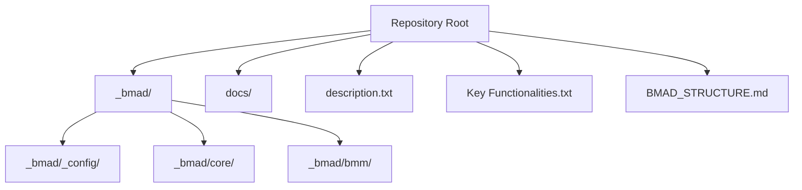
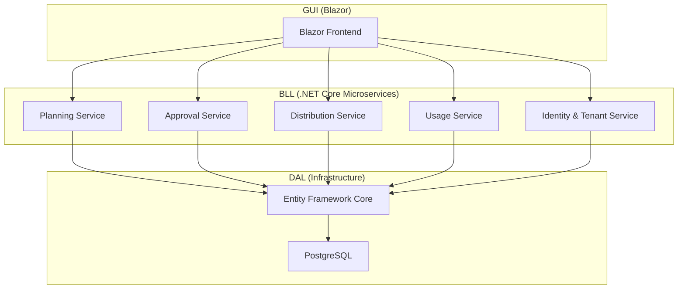
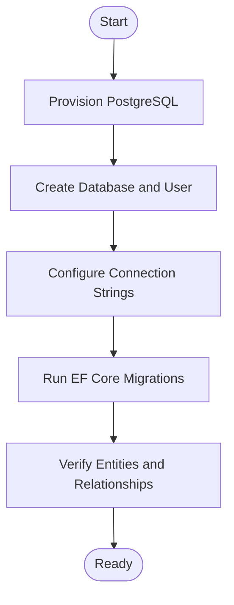
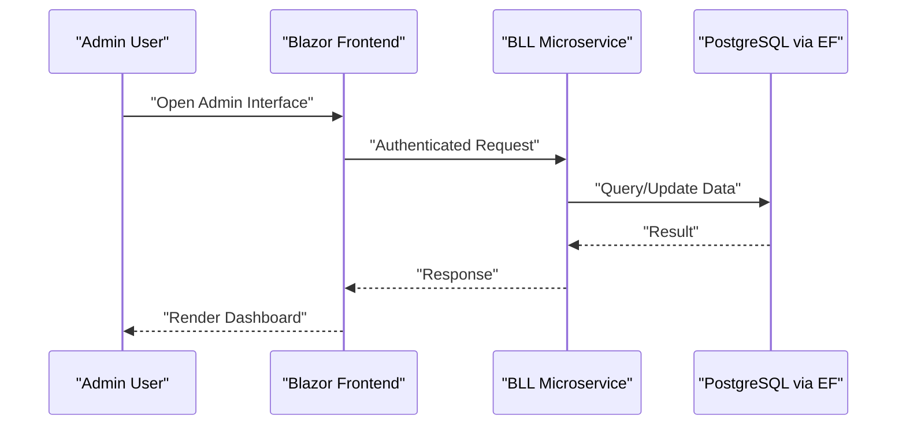
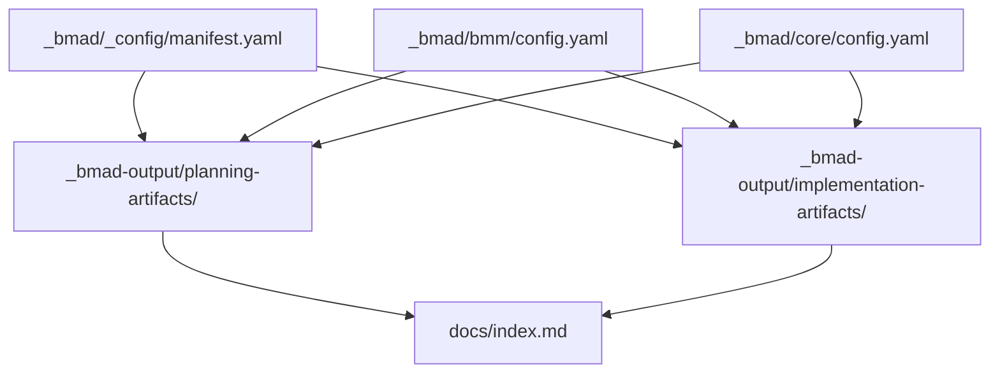
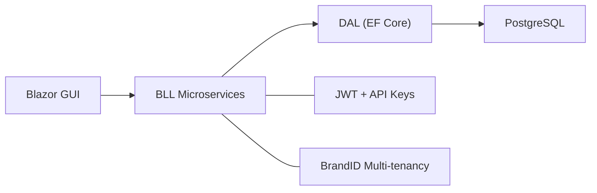

# Getting Started

<cite>
**Referenced Files in This Document**
- [BMAD_STRUCTURE.md](file://BMAD_STRUCTURE.md)
- [Key Functionalities.txt](file://Key Functionalities.txt)
- [description.txt](file://description.txt)
- [docs/index.md](file://docs/index.md)
- [docs/architecture.md](file://docs/architecture.md)
- [docs/data-models.md](file://docs/data-models.md)
- [_bmad/_config/manifest.yaml](file://_bmad/_config/manifest.yaml)
- [_bmad/bmm/config.yaml](file://_bmad/bmm/config.yaml)
- [_bmad/core/config.yaml](file://_bmad/core/config.yaml)
</cite>

## Table of Contents
1. [Introduction](#introduction)
2. [Project Structure](#project-structure)
3. [Core Components](#core-components)
4. [Architecture Overview](#architecture-overview)
5. [Detailed Component Analysis](#detailed-component-analysis)
6. [Dependency Analysis](#dependency-analysis)
7. [Performance Considerations](#performance-considerations)
8. [Troubleshooting Guide](#troubleshooting-guide)
9. [Conclusion](#conclusion)
10. [Appendices](#appendices)

## Introduction
This guide helps you set up the NonCash platform for development. It covers prerequisites, environment setup for C#/.NET Core and PostgreSQL, Blazor frontend expectations, initial project structure, first-time local run steps, database connectivity, and access to the admin interface. It also documents the BMAD methodology integration and how to leverage automated documentation generation.

NonCash is a SaaS platform for voucher production and management. The system follows a three-layer architecture: GUI (Blazor), BLL (C#/.NET Core microservices), and DAL (PostgreSQL via Entity Framework). Security is enforced with JWT and API keys, and the platform emphasizes multi-tenancy and dynamic voucher code logic.

**Section sources**
- [description.txt:1-31](file://description.txt#L1-L31)
- [docs/index.md:1-41](file://docs/index.md#L1-L41)

## Project Structure
At a high level, the repository is organized around:
- Business Model and Architecture Design (BMAD) artifacts and configuration
- Project documentation (architecture, data models, API contracts, scan report)
- Top-level project description and key functionalities
- Automated documentation output folders

Key directories and files:
- _bmad: BMAD configuration and modules (core, bmm, _config)
- docs: Architectural and data model documentation
- description.txt and Key Functionalities.txt: Business overview and functional scope
- BMAD_STRUCTURE.md: High-level BMAD structure aligned with the project

**Diagram sources**
- [BMAD_STRUCTURE.md:1-82](file://BMAD_STRUCTURE.md#L1-L82)
- [docs/index.md:1-41](file://docs/index.md#L1-L41)

**Section sources**
- [BMAD_STRUCTURE.md:1-82](file://BMAD_STRUCTURE.md#L1-L82)
- [docs/index.md:1-41](file://docs/index.md#L1-L41)

## Core Components
- Backend: C#/.NET Core microservices in the Business Logic Layer (BLL)
- Database: PostgreSQL with Entity Framework Core in the Data Access Layer (DAL)
- Frontend: Blazor application for the GUI
- Security: JWT and API Key authentication
- Multi-tenancy: Tenant isolation via BrandID

These components align with the three-layer architecture described in the documentation and reflect the BMAD structure.

**Section sources**
- [docs/architecture.md:1-52](file://docs/architecture.md#L1-L52)
- [BMAD_STRUCTURE.md:37-82](file://BMAD_STRUCTURE.md#L37-L82)

## Architecture Overview
The NonCash platform uses a 3-layer SaaS architecture:
- GUI (Blazor): Presents dashboards and admin interfaces
- BLL (C#/.NET Core microservices): Orchestrates business logic
- DAL (PostgreSQL via EF): Manages persistence and transactions

**Diagram sources**
- [docs/architecture.md:9-52](file://docs/architecture.md#L9-L52)
- [BMAD_STRUCTURE.md:39-56](file://BMAD_STRUCTURE.md#L39-L56)

**Section sources**
- [docs/architecture.md:1-52](file://docs/architecture.md#L1-L52)
- [BMAD_STRUCTURE.md:37-56](file://BMAD_STRUCTURE.md#L37-L56)

## Detailed Component Analysis

### Prerequisites and Environment Setup
- Installers and SDKs:
  - .NET SDK matching the target runtime of the backend services
  - PostgreSQL server and client tools
  - Blazor development tools (Blazor Server or WebAssembly depending on your preference)
- IDE: Visual Studio, VS Code, or JetBrains Rider
- Optional: Docker for containerized database/local environment orchestration

Notes:
- The technology stack and layer responsibilities are defined in the architecture documentation.
- The project description confirms the backend is C#, database is PostgreSQL, and the frontend is Blazor.

**Section sources**
- [docs/architecture.md:17-49](file://docs/architecture.md#L17-L49)
- [description.txt:11-14](file://description.txt#L11-L14)

### Database Configuration (PostgreSQL)
- Choose PostgreSQL as the primary database engine.
- Use Entity Framework Core for data access and migrations.
- Maintain multi-tenancy via BrandID to isolate tenant data.
- Ensure transactional integrity for POS usage workflows.

Recommended steps:
- Provision a PostgreSQL instance (local or cloud).
- Create a dedicated database and user for the application.
- Configure connection strings in the backend services.
- Apply EF Core migrations to initialize schema.
- Verify relationships among core entities (VoucherPlanHeader, VoucherPlanDetail, Brand, Outlet, UserAccount, Customer).

**Diagram sources**
- [docs/data-models.md:1-98](file://docs/data-models.md#L1-L98)
- [docs/architecture.md:28-35](file://docs/architecture.md#L28-L35)

**Section sources**
- [docs/data-models.md:1-98](file://docs/data-models.md#L1-L98)
- [docs/architecture.md:28-35](file://docs/architecture.md#L28-L35)

### Blazor Frontend Setup
- Select Blazor Server or Blazor WebAssembly based on deployment preferences.
- Connect the frontend to backend microservices via internal APIs or service-to-service calls.
- Implement dashboards for production planning, approvals, distribution, and usage analytics.
- Enforce authentication using JWT tokens and ensure secure routes.

**Diagram sources**
- [docs/architecture.md:9-26](file://docs/architecture.md#L9-L26)

**Section sources**
- [docs/architecture.md:9-26](file://docs/architecture.md#L9-L26)

### First-Time Local Run
- Build and run backend microservices using the .NET CLI or IDE.
- Start PostgreSQL and apply migrations.
- Launch the Blazor frontend and log in using configured credentials.
- Navigate to admin dashboards to manage plans, approvals, distributions, and usage.

Note: The exact commands depend on your chosen project layout and service composition. Use the architecture and data model documentation to understand service boundaries and entity relationships.

**Section sources**
- [docs/architecture.md:17-26](file://docs/architecture.md#L17-L26)
- [docs/data-models.md:9-98](file://docs/data-models.md#L9-L98)

### Accessing the Admin Interface
- Log in via the Blazor frontend using appropriate credentials.
- Use role-based dashboards to:
  - Create and approve production plans
  - Monitor distribution and usage metrics
  - Manage tenants (Brands and Outlets)
  - View customer profiles and blacklist status

Security:
- API Key authentication for external integrations (e.g., POS)
- JWT-based session management for admin users

**Section sources**
- [docs/architecture.md:36-41](file://docs/architecture.md#L36-L41)
- [Key Functionalities.txt:70-86](file://Key Functionalities.txt#L70-L86)

### BMAD Methodology Integration and Automated Documentation
The repository includes BMAD configuration and output folders that enable automated documentation generation and planning:

- Core and BMM modules define project metadata and artifact locations.
- Manifest and configuration files specify installation details and output paths.
- Planning and implementation artifacts are generated under _bmad-output.

How to leverage:
- Review generated planning artifacts for strategic roadmap and UX directions.
- Use implementation artifacts to guide development phases.
- Keep BMAD configuration up to date to ensure accurate documentation generation.

**Diagram sources**
- [_bmad/_config/manifest.yaml:1-25](file://_bmad/_config/manifest.yaml#L1-L25)
- [_bmad/bmm/config.yaml:1-17](file://_bmad/bmm/config.yaml#L1-L17)
- [_bmad/core/config.yaml:1-10](file://_bmad/core/config.yaml#L1-L10)
- [docs/index.md:24-26](file://docs/index.md#L24-L26)

**Section sources**
- [_bmad/_config/manifest.yaml:1-25](file://_bmad/_config/manifest.yaml#L1-L25)
- [_bmad/bmm/config.yaml:1-17](file://_bmad/bmm/config.yaml#L1-L17)
- [_bmad/core/config.yaml:1-10](file://_bmad/core/config.yaml#L1-L10)
- [docs/index.md:24-26](file://docs/index.md#L24-L26)

## Dependency Analysis
- Layer coupling:
  - GUI depends on BLL via internal APIs
  - BLL depends on DAL via repositories and EF Core
  - DAL depends on PostgreSQL
- Security dependencies:
  - JWT for user sessions
  - API Keys for external POS integrations
- Multi-tenancy:
  - BrandID enforces tenant isolation across entities

**Diagram sources**
- [docs/architecture.md:9-52](file://docs/architecture.md#L9-L52)

**Section sources**
- [docs/architecture.md:36-52](file://docs/architecture.md#L36-L52)

## Performance Considerations
- Use PostgreSQL indexing on frequently queried fields (e.g., BrandID, OutletID, MemberID).
- Apply EF Core change tracking and batch operations to reduce round trips.
- Implement pagination and filtering in the GUI dashboards.
- Ensure transaction boundaries around POS usage to maintain consistency.

[No sources needed since this section provides general guidance]

## Troubleshooting Guide
Common issues and resolutions:
- Database connectivity failures:
  - Verify connection string correctness and network accessibility
  - Confirm PostgreSQL is running and accepts connections
- Migration errors:
  - Re-run migrations with verbose logs to identify failing scripts
  - Ensure schema ownership and permissions are correct
- Blazor authentication problems:
  - Confirm JWT issuer/signing key configuration
  - Check role assignments for admin users
- POS integration issues:
  - Validate API Key configuration and allowed ranges per plan
  - Confirm endpoint URLs and request signatures

[No sources needed since this section provides general guidance]

## Conclusion
You now have the essentials to set up the NonCash platform locally, connect to PostgreSQL, run the backend microservices, and access the Blazor admin interface. Use the BMAD configuration and output folders to guide planning and documentation. Refer to the architecture and data model documentation for deeper understanding of service boundaries and entity relationships.

[No sources needed since this section summarizes without analyzing specific files]

## Appendices

### Quick Reference: Layers, Technologies, and Responsibilities
- GUI (Blazor): Admin dashboards and user interactions
- BLL (C#/.NET Core): Microservices for planning, approval, distribution, usage, identity
- DAL (PostgreSQL/EF): Repositories and transactions
- Security: JWT and API Keys
- Multi-tenancy: BrandID isolation

**Section sources**
- [docs/architecture.md:9-52](file://docs/architecture.md#L9-L52)
- [BMAD_STRUCTURE.md:37-56](file://BMAD_STRUCTURE.md#L37-L56)